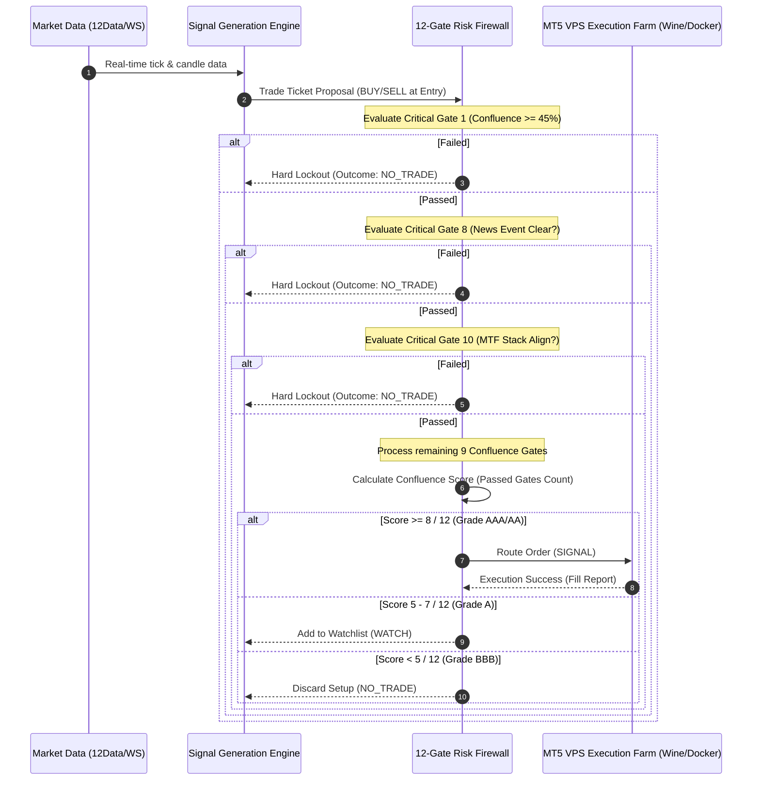

# TradeGPT 12-Gate Quantitative Confluence Engine
## Architectural Whitepaper & Technical Specification

**Document Class:** Technical Specification / Investment Memorandum  
**Version:** 2.1.0  
**Date:** July 2026  
**Status:** Commercial in Confidence  

---

## Engine Execution Flowchart

The vector diagram below illustrates the linear validation pipeline, showing how setups flow from raw proposals through the Critical and Standard gates to active MT5 execution:

<svg xmlns="http://www.w3.org/2000/svg" viewBox="0 0 820 280" width="100%" height="auto" style="border-radius: 8px; box-shadow: 0 4px 12px rgba(0,0,0,0.15); font-family: -apple-system, BlinkMacSystemFont, 'Segoe UI', Roboto, Helvetica, Arial, sans-serif;">
  <!-- Background -->
  <rect width="820" height="280" rx="12" fill="#0b0f19" />
  
  <!-- Grid Lines -->
  <pattern id="grid" width="20" height="20" patternUnits="userSpaceOnUse">
    <path d="M 20 0 L 0 0 0 20" fill="none" stroke="#ffffff" stroke-width="1" opacity="0.02" />
  </pattern>
  <rect width="820" height="280" fill="url(#grid)" rx="12" />

  <!-- Header -->
  <text x="40" y="35" font-size="14" font-weight="bold" fill="#ffffff" letter-spacing="0.5">12-GATE PIPELINE EXECUTION LIFECYCLE</text>
  <text x="40" y="52" font-size="9.5" fill="#64748b" letter-spacing="0.5">Linear validation flow from market proposal to automated MT5 execution routing</text>
  <line x1="40" y1="65" x2="780" y2="65" stroke="#1e293b" stroke-width="1" />

  <!-- STAGE 1: PROPOSAL -->
  <rect x="40" y="100" fill="#1e293b" stroke="#475569" stroke-width="1.5" rx="6" width="120" height="80" />
  <text x="100" y="125" font-size="10" font-weight="bold" fill="#94a3b8" text-anchor="middle">STAGE 1</text>
  <text x="100" y="145" font-size="12" font-weight="bold" fill="#ffffff" text-anchor="middle">Trade Proposal</text>
  <text x="100" y="162" font-size="8.5" fill="#64748b" text-anchor="middle">Signal Proposed</text>

  <!-- Connection 1 -->
  <path d="M 160 140 L 200 140" stroke="#475569" stroke-width="2" fill="none" />
  <polygon points="200,140 193,136 193,144" fill="#475569" />

  <!-- STAGE 2: CRITICAL GATES -->
  <rect x="200" y="85" fill="#221314" stroke="#f43f5e" stroke-width="1.5" rx="6" width="180" height="110" />
  <rect x="210" y="93" fill="#f43f5e" rx="3" width="160" height="18" />
  <text x="290" y="105" font-size="9" font-weight="bold" fill="#ffffff" text-anchor="middle">STAGE 2: CRITICAL GATES</text>
  
  <text x="220" y="132" font-size="10" font-weight="bold" fill="#fda4af">1. Confluence</text>
  <text x="350" y="132" font-size="8.5" fill="#fda4af" text-anchor="end">(&gt;= 45%)</text>
  
  <text x="220" y="152" font-size="10" font-weight="bold" fill="#fda4af">8. News Event</text>
  <text x="350" y="152" font-size="8.5" fill="#fda4af" text-anchor="end">(Calendar clear)</text>
  
  <text x="220" y="172" font-size="10" font-weight="bold" fill="#fda4af">10. MTF Stack</text>
  <text x="350" y="172" font-size="8.5" fill="#fda4af" text-anchor="end">(2/3 Align)</text>

  <!-- Hard Stop / Fail Path -->
  <path d="M 290 195 L 290 230 L 160 230" stroke="#f43f5e" stroke-width="1.5" fill="none" stroke-dasharray="3 3" />
  <polygon points="160,230 167,226 167,234" fill="#f43f5e" />
  <rect x="40" y="210" fill="#7f1d1d" stroke="#f43f5e" stroke-width="1.5" rx="5" width="120" height="40" />
  <text x="100" y="227" font-size="11" font-weight="bold" fill="#ffffff" text-anchor="middle">NO_TRADE</text>
  <text x="100" y="240" font-size="8.5" fill="#fecaca" text-anchor="middle">Early Hard Stop</text>

  <!-- Connection 2 -->
  <path d="M 380 140 L 420 140" stroke="#10b981" stroke-width="2" fill="none" />
  <polygon points="420,140 413,136 413,144" fill="#10b981" />
  <text x="400" y="132" font-size="8" font-weight="bold" fill="#10b981" text-anchor="middle">PASS</text>

  <!-- STAGE 3: STANDARD CONFLUENCE GATES -->
  <rect x="420" y="85" fill="#0c1524" stroke="#38bdf8" stroke-width="1.5" rx="6" width="200" height="110" />
  <rect x="430" y="93" fill="#0284c7" rx="3" width="180" height="18" />
  <text x="520" y="105" font-size="9" font-weight="bold" fill="#ffffff" text-anchor="middle">STAGE 3: STANDARD GATES</text>
  
  <text x="435" y="130" font-size="8.5" fill="#e0f2fe">• 2. SMC Confirmation</text>
  <text x="525" y="130" font-size="8.5" fill="#e0f2fe">• 6. No Conflict</text>
  
  <text x="435" y="145" font-size="8.5" fill="#e0f2fe">• 3. Timeframe Align</text>
  <text x="525" y="145" font-size="8.5" fill="#e0f2fe">• 7. Cooldown</text>
  
  <text x="435" y="160" font-size="8.5" fill="#e0f2fe">• 4. Session Filter</text>
  <text x="525" y="160" font-size="8.5" fill="#e0f2fe">• 9. Correlation</text>
  
  <text x="435" y="175" font-size="8.5" fill="#e0f2fe">• 5. Volatility</text>
  <text x="525" y="175" font-size="8.5" fill="#e0f2fe">• 11/12. VWAP &amp; Candle</text>

  <!-- Connection 3 -->
  <path d="M 620 140 L 660 140" stroke="#38bdf8" stroke-width="2" fill="none" />
  <polygon points="660,140 653,136 653,144" fill="#38bdf8" />

  <!-- STAGE 4: ROUTING OUTCOMES -->
  <rect x="660" y="85" fill="#111827" stroke="#4b5563" stroke-width="1.5" rx="6" width="120" height="150" />
  <rect x="670" y="93" fill="#4b5563" rx="3" width="100" height="18" />
  <text x="720" y="105" font-size="9" font-weight="bold" fill="#ffffff" text-anchor="middle">STAGE 4: OUTCOME</text>

  <!-- SIGNAL -->
  <rect x="670" y="122" fill="#064e3b" stroke="#10b981" stroke-width="1" rx="4" width="100" height="24" />
  <text x="720" y="137" font-size="9.5" font-weight="bold" fill="#ffffff" text-anchor="middle">SIGNAL (&gt;= 8)</text>

  <!-- WATCH -->
  <rect x="670" y="157" fill="#78350f" stroke="#f59e0b" stroke-width="1" rx="4" width="100" height="24" />
  <text x="720" y="172" font-size="9.5" font-weight="bold" fill="#ffffff" text-anchor="middle">WATCH (5-7)</text>

  <!-- REJECT -->
  <rect x="670" y="192" fill="#7f1d1d" stroke="#ef4444" stroke-width="1" rx="4" width="100" height="24" />
  <text x="720" y="207" font-size="9.5" font-weight="bold" fill="#ffffff" text-anchor="middle">NO_TRADE (&lt; 5)</text>
</svg>

### How a Trade Setup Flows (3 Simple Steps):
1. **Proposal**: A trade setup is proposed by the market scanner.
2. **Must-Pass Filters**: The trade must pass **all 3 Critical Gates** (Confluence, News Event, and MTF Stack). If *any* critical gate fails, execution is immediately stopped (**NO_TRADE**).
3. **Score Accumulation**: If they pass, the engine checks the remaining **9 Standard Gates** and sums up the score:
   - **8 or more gates passed**: Trade is automatically sent to the brokers (**SIGNAL**).
   - **5 to 7 gates passed**: Trade is placed on the dashboard for observation (**WATCH**).
   - **Fewer than 5 gates passed**: Trade is discarded (**NO_TRADE**).

---

## 1. Executive Summary & Value Proposition

In algorithmic trading, retail strategies frequently suffer from capital erosion due to a common set of systemic vulnerabilities: executing counter to macro-trends, entering during illiquid market openings (rollovers), suffering slippage during high-impact news releases, or buying at the absolute limits of local ranges. 

The **TradeGPT 12-Gate Quantitative Confluence Engine** is a proprietary, multi-stage transaction validation pipeline designed to mitigate these exact risks. It sits as a high-frequency risk firewall between raw market data feeds (Twelve Data, WebSockets) and active broker execution pools (MT5 VPS Farm). 

Before any trade is routed to the market, it must pass through the validation pipeline. This structure enforces strict technical, liquidity, and event-based checks, ensuring that capital is only deployed when a setup possesses a mathematically verified statistical edge.

---

## 2. Core Architecture & Transaction Lifecycle

Every trade ticket travels through a sequential, deterministically routed pipeline. The pipeline divides checks into two categories: **Critical Gates** and **Confluence Gates**.

### The Critical Gate Rule
Certain market states pose an existential risk to capital. The engine designates **three Critical Gates**:
1. **Gate 1: Confluence** (Technical indicators must show minimum momentum direction)
2. **Gate 8: News Event** (Macroeconomic calendar must be clear of high-impact releases)
3. **Gate 10: MTF Stack** (Higher timeframes must confirm directional bias)

If any of these three gates fail, the pipeline terminates immediately with a **NO_TRADE** outcome, ignoring all other parameter clearances.

---

## 3. High-Level Summary of the 12 Gates

Below is the complete registry of the 12 Gates evaluated by the Confluence Engine:

1. **Gate 1: Confluence (CRITICAL)** — Weighted directional consensus across multiple core technical indicators ($\ge 45\%$).
2. **Gate 2: SMC Confirmation (Standard)** — Detection of institutional Smart Money structural signals (BOS, ChoCH, FVG, OB).
3. **Gate 3: Timeframe Alignment (Standard)** — Verification that local execution matches the 4-Hour higher timeframe bias.
4. **Gate 4: Session Filter (Standard)** — Restricts execution to high-liquidity volume sessions (London/NY overlap).
5. **Gate 5: Volatility (Standard)** — Verifies current ATR is within stable ratios ($0.5 \le \text{Ratio} \le 2.5$) to avoid dead or hyper-volatile markets.
6. **Gate 6: No Conflict (Standard)** — Verifies that bullish and bearish indicators are not heavily contradictory ($> 10\%$ spread).
7. **Gate 7: Cooldown (Standard)** — Prevents over-trading by enforcing a 4-hour cooldown per symbol.
8. **Gate 8: News Event (CRITICAL)** — Halts execution within high-impact macroeconomic event windows (CPI, NFP, FOMC).
9. **Gate 9: Correlation (Standard)** — Cross-checks inverse and positive cross-market index alignment (e.g. Dollar Index DXY).
10. **Gate 10: MTF Stack (CRITICAL)** — Verifies absolute trend alignment across Weekly, Daily, and 4-Hour EMA lines.
11. **Gate 11: VWAP (Standard)** — Ensures the entry price lies within standard statistical deviation envelopes ($\pm 2\sigma$) of VWAP.
12. **Gate 12: Candle Pattern (Standard)** — Validates local candlestick confirmation shapes on the 1-Hour chart.

---

## 4. Gate-by-Gate Architectural Specifications

### Gate 1: Confluence (CRITICAL GATE)
* **Objective:** Confirms directional agreement across a diversified stack of classical technical indicators.
* **Systemic Risk Targeted:** High cross-talk and noise in retail indicators leading to low-probability executions.
* **Mathematical Model:**
  Computes a weighted average of directional momentum and oscillator signals:
  $$\text{Confluence Score} = \sum (W_i \cdot \text{Dir}_i) \ge 45\%$$
  
  Where weights are allocated as:
  * **RSI (14)**: 15%
  * **MACD**: 20%
  * **EMA Stack (50/200)**: 20%
  * **Bollinger Bands (20, 2)**: 15%
  * **Stochastic (14, 3, 3)**: 10%
  * **4H HTF Bias**: 15%
* **Production Status:** Live.
* **Application Output Format:** `60% (need ≥45%)`

---

### Gate 2: SMC Confirmation
* **Objective:** Verifies institutional presence using Smart Money Concepts (SMC) order-flow theory.
* **Systemic Risk Targeted:** Trading within retail traps and missing structural shifts.
* **Analytical Logic:**
  Scans the local candle structures on the execution timeframe (typically M15/H1) for structural events:
  $$\text{SMC}_{\text{Confirmed}} = \begin{cases} \text{True} & \text{if } (\text{BOS} \ge 1 \lor \text{ChoCH} \ge 1 \lor \text{FVG} \ge 1 \lor \text{OB} \ge 1 \lor \text{Liquidity Sweep}) \\ \text{False} & \text{otherwise} \end{cases}$$
* **Production Status:** Live.
* **Application Output Format:** `4 pattern(s): BOS bullish, 9 active FVG(s), 3 Order Block(s), Liquidity Sweep detected`

---

### Gate 3: Timeframe Alignment
* **Objective:** Safeguards trades by checking micro-entries against the 4-Hour higher timeframe (HTF) trend bias.
* **Systemic Risk Targeted:** Counter-trend trading (buying in a macro-bearish market).
* **Logical Condition:**
  $$\text{HTF\_Align} = \begin{cases} \text{True} & \text{if } \text{Bias}_{\text{4H}} = \text{Neutral} \lor (\text{Bias}_{\text{4H}} = \text{Bullish} \land \text{Signal} = \text{BUY}) \lor (\text{Bias}_{\text{4H}} = \text{Bearish} \land \text{Signal} = \text{SELL}) \\ \text{False} & \text{otherwise} \end{cases}$$
* **Production Status:** Live.
* **Application Output Format:** `4H bias: neutral, Signal: SELL`

---

### Gate 4: Session Filter
* **Objective:** Confirms the setup occurs during peak market volume to minimize slippage and trading costs.
* **Systemic Risk Targeted:** Executing during Asian session consolidation or low-volume gaps where spreads widen.
* **Logical Condition:**
  Restricts Forex and Gold indices to active London and New York operational overlaps.
  $$\text{Session}_{\text{Valid}} = \text{Current UTC Hour} \in [08:00, 17:00]$$
* **Production Status:** Live.
* **Application Output Format:** `overlap — optimal trading window`

---

### Gate 5: Volatility
* **Objective:** Filters out dead markets (no movement) or high-slippage markets (extreme news volatility).
* **Systemic Risk Targeted:** Capital locked in rangebound markets (decaying time value) or executing during erratic slippage spikes.
* **Mathematical Model:**
  Calculates the ratio of the current 14-period Average True Range (ATR) against the 20-period historical average:
  $$\text{Volatility Ratio} = \frac{ATR_{14}}{ATR_{\text{Avg}\_20}}$$
  $$\text{Gate Passed} = 0.5 \le \text{Volatility Ratio} \le 2.5$$
* **Production Status:** Live.
* **Application Output Format:** `ATR ratio 0.06 — dead market`

---

### Gate 6: No Conflict
* **Objective:** Assures high directional consensus by rejecting trades when buy and sell indicators are highly conflicted.
* **Systemic Risk Targeted:** Executing during whipsaws and choppy trend transitions.
* **Mathematical Model:**
  Calculates the directional spread between bullish and bearish indicator weights:
  $$\text{Spread} = \frac{| \sum W_{\text{Bull}} - \sum W_{\text{Bear}} |}{\sum W_{\text{Total}}} > 10\%$$
* **Production Status:** Live.
* **Application Output Format:** `Bull/Bear spread: 20% (need >10%)`

---

### Gate 7: Cooldown
* **Objective:** Limits trade frequency on individual tickers to prevent emotional revenge-trading or over-exposure.
* **Systemic Risk Targeted:** Multiple executions triggered by a single consolidating structural zone.
* **Logical Condition:**
  $$\text{Time}_{\text{Elapsed}} \ge 4\text{ Hours}$$
* **Production Status:** Live.
* **Application Output Format:** `No recent signal`

---

### Gate 8: News Event (CRITICAL GATE)
* **Objective:** Completely halts execution during high-impact macroeconomic event windows.
* **Systemic Risk Targeted:** Extreme news volatility, widening spreads, and slippage (e.g. CPI, NFP, FOMC releases).
* **Logical Condition:**
  Fetches live economic calendar feeds. Blocks execution if:
  $$t_{\text{current}} \in [t_{\text{event}} - 30\text{ min}, t_{\text{event}} + 15\text{ min}]$$
* **Production Status:** Live.
* **Application Output Format:** `Clear — next event: Non-Farm Payrolls in 2686min`

---

### Gate 9: Correlation
* **Objective:** Evaluates inter-market asset correlations to ensure global currency alignment.
* **Systemic Risk Targeted:** Executing US dollar (USD) crosses when the underlying dollar index (DXY) is contradicting.
* **Logical Condition:**
  Checks index direction. For example, EURUSD or XAUUSD buy setups require a neutral or bearish DXY indicator bias:
  $$\text{Correl}_{\text{Valid}} = \text{DXY}_{\text{Bias}} \text{ aligns with inverse cross-asset setup}$$
* **Production Status:** Live.
* **Application Output Format:** `DXY ↓ bearish (inv) → ✗ conflicts`

---

### Gate 10: MTF Stack (CRITICAL GATE)
* **Objective:** Verifies trend coherence across multiple timeframes.
* **Systemic Risk Targeted:** Retail fakeouts caused by lower timeframe trends reversing into higher timeframe resistances.
* **Mathematical Model:**
  Checks trend direction (EMA 50/200 bias) on the Weekly (W1), Daily (D1), and 4-Hour (4H) charts:
  $$\text{Agreement Count} = \sum (\text{Trend}_{\text{W1}} = \text{Dir} \lor \text{Trend}_{\text{D1}} = \text{Dir} \lor \text{Trend}_{\text{4H}} = \text{Dir}) \ge 2$$
* **Production Status:** Live.
* **Application Output Format:** `2/3 TFs bearish — Weekly bearish · Daily bearish · 4H neutral`

---

### Gate 11: VWAP
* **Objective:** Prevents entering trades at overextended prices far from institutional value averages.
* **Systemic Risk Targeted:** Chasing momentum at local tops or bottoms.
* **Mathematical Model:**
  Ensures the current asset price lies within the normal $\pm 2\sigma$ standard deviation envelope of the daily Volume Weighted Average Price (VWAP):
  $$VWAP - 2.0\sigma \le Price \le VWAP + 2.0\sigma$$
* **Production Status:** Live.
* **Application Output Format:** `Price 1.59% above VWAP — at +1σ band, extended`

---

### Gate 12: Candle Pattern
* **Objective:** Confirms local price action momentum via candlestick wick and body geometry.
* **Systemic Risk Targeted:** Entering trades when immediate local momentum is reversing.
* **Logical Condition:**
  Identifies key structural reversal patterns (Hammers, Inverted Hammers, Engulfing Bars, Inside Bars) on the 1H timeframe. Passes if the pattern aligns with the trade signal or if no conflicting pattern is present.
* **Production Status:** Live.
* **Application Output Format:** `Inside Bar — bearish pattern confluence (strength 29%)`

---

## 5. Confluence Scoring & Trade Routing

Once all 12 Gates are processed, the engine calculates the overall score and issues the routing outcome:

| Passed Gates | Signal Class | Risk Sizing Adjustment | Routing Execution Action |
| :--- | :--- | :--- | :--- |
| **12 / 12** | **Grade AAA** | **Full Kelly Sizing** | Automated routing directly to MT5 terminal clusters. |
| **8 / 12 - 11 / 12** | **Grade AA / A** | **75% Kelly Sizing** | Automated routing; email/Telegram notifications dispatched. |
| **5 / 12 - 7 / 12** | **Grade WATCH** | **0% Risk** | Execution blocked. Setup routed to the live dashboard watchlist. |
| **< 5 / 12** | **Grade REJECT** | **0% Risk** | Execution blocked. Proposal discarded. |

### Dynamic Kelly Risk Sizing Model
The engine dynamically adjusts position sizes based on historical probability matrices. The sizing model determines the optimal percentage of equity to risk:
$$f^* = \frac{p \cdot R - q}{R}$$

Where:
* $p$ = Historical win rate of the asset class.
* $q = 1 - p$ = Historical loss rate of the asset class.
* $R$ = Risk-to-Reward ratio (default target 1:2.5).

---

## 6. Infrastructure & High-Availability Guarantees

To ensure institutional stability, the platform runs on a low-latency VPS architecture designed to operate continuously under any market load.

* **Primary Application Servers:** High-memory VPS nodes executing Next.js edge-optimized logic containers.
* **MT5 Execution Farm:** Multiple memory-optimized Utho VPS instances running Wine-based Docker containers. This structure manages thousands of connected MT5 trading accounts without incurring per-account MetaAPI flat fees, saving significant operating costs.
* **Database & Caching Layer:** PostgreSQL (via Supabase Pro) with a Redis caching layer to handle high-frequency indicators and prevent Twelve Data API rate limit lockouts.
* **Failover Protocol:** If Twelve Data API endpoints experience latency spikes ($> 1500\text{ms}$) or connection issues, the data layer automatically switches to Yahoo Finance backup endpoints, ensuring continuous market coverage.
