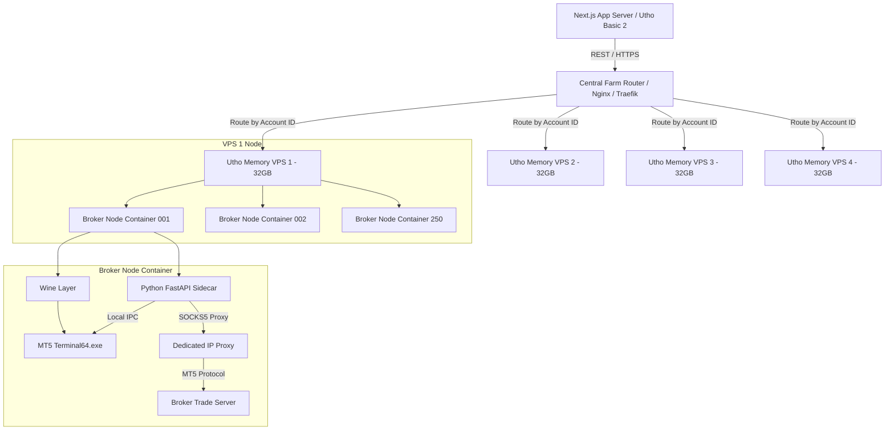

# 🏗️ TradeGPT — Custom MT5 Connection Farm Report
### Architectural Design, Financial Case, and Step-by-Step Implementation Roadmap

---

## 📋 Executive Summary

To scale **TradeGPT** to 1,000 active users, we require a robust, cost-effective connection layer to MetaTrader 5 (MT5) broker accounts. Currently, the platform utilizes **MetaAPI**, which charges a flat **$5.00 / month per connected account**. At a scale of 1,000 users, this results in **$5,000.00 / month** in connection fees alone.

By migrating to a **Custom MT5 Connection Farm** hosted on memory-optimized virtual private servers (VPS), we run 1,000 linked accounts for a flat infrastructure cost of **$248.00 / month**—yielding a massive monthly savings of **$4,752.00 / month** (+$57,000+/year). 

This report outlines the **architecture, container design, sidecar API code, central coordinator router, and a step-by-step roadmap** to build, deploy, and integrate this custom farm as a drop-in replacement for MetaAPI in the TradeGPT codebase.

---

## 💰 1. Financial Case & Scalability Matrix

Below is the cost breakdown comparing **Option A (MetaAPI)** vs. **Option B (Custom MT5 Farm)** on **Utho VPS** at different user scales.

| Metric / Cost Component | Option A: MetaAPI ($5/acct) | Option B: Custom MT5 Farm (VPS) | Monthly Savings / Payback |
| :--- | :---: | :---: | :---: |
| **One-Time Dev & Setup Cost** | **$0.00** | **$3,500.00** *(CapEx)* | Payback in **22 days** at scale |
| **Monthly Cost (100 Users)** | $500.00 / mo | $62.00 / mo *(1x 32GB VPS)* | **Save $438.00 / month** |
| **Monthly Cost (500 Users)** | $2,500.00 / mo | $124.00 / mo *(2x 32GB VPS)* | **Save $2,376.00 / month** |
| **Monthly Cost (1,000 Users)** | **$5,000.00 / mo** | **$248.00 / mo** *(4x 32GB VPS)* | **Save $4,752.00 / month** |
| **Add-on Proxies & Monitoring** | $0.00 | $150.00 / mo *(Optional buffer)*| Adjusts final savings |
| **SaaS Net Profit Margin ($29k Rev)**| **79.7% margin** ($23,127/mo) | **96.1% margin** ($27,855/mo) | **+$56,747.52 / year** |

### Payback Calculation:
$$\text{Payback Period} = \frac{\text{Setup Cost (\$3,500)}}{\text{Monthly Savings (\$4,728.96)}} \approx 0.74 \text{ months (22 days)}$$

---

## 🌐 2. Infrastructure Topology

Our custom MT5 Farm is distributed across **4x Utho Memory-Optimized 3 VPS** nodes. This distributes the memory load, ensures redundancy, and prevents a single VPS failure from taking down all connections.



### Resource Budget per Broker Account Node:
*   **MT5 Terminal RAM Footprint:** ~120 MB (with charts disabled, maximum bars in chart set to minimum).
*   **FastAPI Python Sidecar Footprint:** ~30 MB.
*   **Total RAM per Account:** ~150 MB.
*   **Utho Memory Optimized 3 VPS Spec:** 4 vCPUs, 32 GB RAM.
*   **Density:** Up to **250 active accounts per server**.
*   **Total Capacity (4 Servers):** **1,000 accounts** (128 GB RAM total).

---

## 🐳 3. Internal Node Architecture (Docker + Wine)

To run MetaTrader 5 (a Windows-native binary) on Linux headless, the container sets up a virtual frame buffer (`Xvfb`) and runs the terminal inside the Windows compatibility layer (`Wine`).

### The Dockerfile Setup (`Dockerfile`)
This file packages Wine, Xvfb, a Windows-compiled version of Python, and MT5 into a lightweight container.

```dockerfile
FROM ubuntu:22.04

# Prevent interactive prompts during installation
ENV DEBIAN_FRONTEND=noninteractive
ENV WINEPREFIX=/home/trader/.wine
ENV WINEARCH=win64

# Install Wine, Xvfb, Python, and system dependencies
RUN apt-get update && apt-get install -y --no-install-recommends \
    apt-transport-https \
    software-properties-common \
    wget \
    gnupg2 \
    xvfb \
    x11vnc \
    cabextract \
    unzip \
    curl \
    ca-certificates \
    && dpkg --add-architecture i386 \
    && mkdir -pm755 /etc/apt/keyrings \
    && wget -O /etc/apt/keyrings/winehq-archive.key https://dl.winehq.org/wine-builds/winehq.key \
    && wget -NP /etc/apt/keyrings/ https://dl.winehq.org/wine-builds/ubuntu/dists/jammy/winehq-jammy.sources \
    && apt-get update \
    && apt-get install -y --install-recommends winehq-stable \
    && apt-get clean && rm -rf /var/lib/apt/lists/*

# Set up non-root user
RUN useradd -m trader
USER trader
WORKDIR /home/trader

# Install Winetricks & configure Wine environments
RUN wget https://raw.githubusercontent.com/Winetricks/winetricks/master/src/winetricks \
    && chmod +x winetricks \
    && sh winetricks -q corefonts vcrun2015

# Download and install Windows version of Python 3.10 inside Wine
RUN curl -o python-installer.exe https://www.python.org/ftp/python/3.10.11/python-3.10.11-amd64.exe \
    && wine python-installer.exe /quiet InstallAllUsers=1 PrependPath=1 \
    && rm python-installer.exe

# Upgrade pip and install MT5 and FastAPI libraries inside Wine's Python environment
RUN wine python -m pip install --upgrade pip \
    && wine python -m pip install MetaTrader5 fastapi uvicorn pydantic requests

# Create directory structure for MT5 Portable
RUN mkdir -p /home/trader/mt5

# Download MetaTrader 5 Terminal64.exe (pre-extracted portable format)
# Note: In production, we extract terminal64.exe from the official installer and host it on our private bucket.
RUN curl -L -o /home/trader/mt5/terminal64.exe https://storage.googleapis.com/tradegpt-assets/mt5/terminal64.exe

# Expose FastAPI sidecar port
EXPOSE 8000

# Copy Entrypoint Script
COPY --chown=trader:trader entrypoint.sh /home/trader/entrypoint.sh
RUN chmod +x /home/trader/entrypoint.sh

ENTRYPOINT ["/home/trader/entrypoint.sh"]
```

### The Container Entrypoint (`entrypoint.sh`)
This script starts `Xvfb` (so MT5 has a virtual display to connect its GUI threads) and runs the Python FastAPI sidecar under Wine.

```bash
#!/bin/bash
# Start virtual frame buffer in the background (Xvfb)
Xvfb :99 -screen 0 1024x768x16 &
export DISPLAY=:99

# Configure MT5 proxy settings if proxy environment variables are set
if [ -n "$PROXY_HOST" ] && [ -n "$PROXY_PORT" ]; then
  echo "[Broker Node] Configuring proxy: $PROXY_HOST:$PROXY_PORT"
  # Write proxy settings into MT5 config registry/ini if needed
fi

# Run the Python FastAPI sidecar which will programmatically boot and manage MT5
echo "[Broker Node] Starting FastAPI sidecar under Wine..."
exec wine python /home/trader/sidecar.py
```

---

## 🐍 4. Python FastAPI Sidecar API (Wine-Python Bridge)

The python sidecar runs **inside Wine** so it can import the official `MetaTrader5` library and hook directly into the `terminal64.exe` process using local Inter-Process Communication (IPC). It exposes a clean REST API compatible with MetaAPI.

```python
# sidecar.py (runs inside Wine Python environment)
import os
import subprocess
import time
from fastapi import FastAPI, HTTPException, BackgroundTasks
from pydantic import BaseModel
import MetaTrader5 as mt5

app = FastAPI(title="TradeGPT MT5 Sidecar API")

# Load configuration from Environment variables passed by Coordinator
MT5_PATH = "C:\\home\\trader\\mt5\\terminal64.exe"
MT5_LOGIN = int(os.environ.get("MT5_LOGIN", 0))
MT5_PASSWORD = os.environ.get("MT5_PASSWORD", "")
MT5_SERVER = os.environ.get("MT5_SERVER", "")

def start_mt5_terminal():
    """Starts the MT5 terminal in portable mode under Wine"""
    print(f"[Sidecar] Launching MT5 terminal: {MT5_PATH}")
    # Launch terminal in portable mode. This isolates configurations.
    subprocess.Popen([MT5_PATH, "/portable", "/mute"])
    
    # Wait for terminal to boot and establish IPC connection
    for i in range(15):
        time.sleep(1)
        if mt5.initialize():
            print("[Sidecar] MetaTrader 5 initialized successfully.")
            return True
    return False

@app.on_event("startup")
def startup_event():
    success = start_mt5_terminal()
    if success and MT5_LOGIN > 0:
        # Perform programmatic login
        login_ok = mt5.login(login=MT5_LOGIN, password=MT5_PASSWORD, server=MT5_SERVER)
        if login_ok:
            print(f"[Sidecar] Programmatically logged in to account: {MT5_LOGIN}")
        else:
            print(f"[Sidecar] Programmatic login failed for {MT5_LOGIN}: {mt5.last_error()}")

@app.on_event("shutdown")
def shutdown_event():
    mt5.shutdown()

# ── API Endpoints (MetaAPI-Compatible) ──

@app.get("/users/current/accounts/{account_id}/account-information")
def get_account_information(account_id: str):
    info = mt5.account_info()
    if info is None:
        raise HTTPException(status_code=503, detail=f"Failed to fetch account info: {mt5.last_error()}")
    
    return {
        "balance": info.balance,
        "equity": info.equity,
        "margin": info.margin,
        "marginFree": info.margin_free,
        "marginLevel": info.margin_level,
        "leverage": info.leverage,
        "currency": info.currency,
        "broker": info.company,
        "name": info.name
    }

@app.get("/users/current/accounts/{account_id}/positions")
def get_positions(account_id: str):
    positions = mt5.positions_get()
    if positions is None:
        return []
    
    result = []
    for p in positions:
        result.append({
            "id": str(p.ticket),
            "symbol": p.symbol,
            "type": "POSITION_TYPE_BUY" if p.type == 0 else "POSITION_TYPE_SELL",
            "volume": p.volume,
            "openPrice": p.price_open,
            "currentPrice": p.price_current,
            "profit": p.profit,
            "stopLoss": p.sl,
            "takeProfit": p.tp,
            "time": p.time * 1000 # convert to milliseconds
        })
    return result

class TradePayload(BaseModel):
    actionType: str
    symbol: str
    volume: float
    comment: str = "TradeGPT AI signal"
    stopLoss: float = None
    takeProfit: float = None

@app.post("/users/current/accounts/{account_id}/trade")
def execute_trade(account_id: str, payload: TradePayload):
    # Map action types
    action_type = mt5.ORDER_TYPE_BUY if payload.actionType == "ORDER_TYPE_BUY" else mt5.ORDER_TYPE_SELL
    
    symbol_info = mt5.symbol_info(payload.symbol)
    if symbol_info is None:
        # Try normalizing symbol suffix (e.g. XAUUSD.m, EURUSD.ecn)
        raise HTTPException(status_code=400, detail=f"Symbol {payload.symbol} not found in MT5")
        
    price = mt5.symbol_info_tick(payload.symbol).ask if action_type == mt5.ORDER_TYPE_BUY else mt5.symbol_info_tick(payload.symbol).bid

    request = {
        "action": mt5.TRADE_ACTION_DEAL,
        "symbol": payload.symbol,
        "volume": payload.volume,
        "type": action_type,
        "price": price,
        "deviation": 20,
        "magic": 0,
        "comment": payload.comment,
        "type_time": mt5.ORDER_TIME_GTC,
        "type_filling": mt5.ORDER_FILLING_IOC,
    }
    
    if payload.stopLoss:
        request["sl"] = payload.stopLoss
    if payload.takeProfit:
        request["tp"] = payload.takeProfit

    result = mt5.order_send(request)
    if result.retcode != mt5.TRADE_RETCODE_DONE:
        # Provide compatible string error code
        string_code = "TRADE_RETCODE_REJECTED"
        if result.retcode == mt5.TRADE_RETCODE_MARKET_CLOSED:
            string_code = "TRADE_RETCODE_MARKET_CLOSED"
        elif result.retcode == mt5.TRADE_RETCODE_INVALID_VOLUME:
            string_code = "TRADE_RETCODE_INVALID_VOLUME"
        elif result.retcode == mt5.TRADE_RETCODE_INVALID_STOPS:
            string_code = "TRADE_RETCODE_INVALID_STOPS"
            
        return {
            "stringCode": string_code,
            "message": f"Order execution failed with code {result.retcode}: {result.comment}"
        }
        
    return {
        "orderId": str(result.order),
        "positionId": str(result.position),
        "openPrice": result.price,
        "volume": result.volume
    }

@app.get("/users/current/accounts/{account_id}/symbols")
def get_symbols(account_id: str):
    symbols = mt5.symbols_get()
    if symbols is None:
        return []
    return [s.name for s in symbols]

@app.get("/users/current/accounts/{account_id}/symbols/{symbol}/specification")
def get_symbol_specification(account_id: str, symbol: str):
    spec = mt5.symbol_info(symbol)
    if spec is None:
        raise HTTPException(status_code=404, detail="Symbol specification not found")
    
    return {
        "minVolume": spec.volume_min,
        "maxVolume": spec.volume_max,
        "volumeStep": spec.volume_step
    }
```

---

## ⚡ 5. Real-Time Tick Streaming (WebSocket Layer)

For scalping, real-time price updates must be streamed to the client with sub-millisecond latencies. Because Python MT5 doesn't expose native async event hooks, we have two implementation options:

### Option A: Python Polling & WebSocket Broadcast (High Frequency)
A background thread in the FastAPI Sidecar polls `mt5.symbol_info_tick(symbol)` every 50ms for active symbols and pushes changes over a local WebSocket server to the Coordinator.
*   **Pros:** 100% Python-based; no changes to MT5's binaries or scripts.
*   **Cons:** Polling creates slight CPU overhead inside the container.

### Option B: MQL5 WebSocket EA Relay (Recommended for Production)
We deploy a lightweight, precompiled Expert Advisor (EA) inside MT5. The EA hooks into MT5's native C++ `OnTick()` handler and pushes price ticks via standard Win32 WebSockets to the Python Sidecar immediately.
*   **Pros:** Event-driven, sub-millisecond execution, zero CPU polling overhead.
*   **Cons:** Requires maintaining and compiling a separate MQL5 `.ex5` file.

---

## 🏢 6. Central Coordinator & Routing Layer

A central Node.js coordinator runs on the host VPS. It handles the deployment of docker containers and routes REST/WS requests from the Next.js App to the specific Docker containers.

```
Next.js App --> Router (Port 443) --> Coordinator (Route table lookup) --> Container API (Port 8000)
```

### Nginx Dynamic Routing block (`/etc/nginx/nginx.conf`)
Nginx routes traffic to containers dynamically based on the account ID using a database mapping in Redis or an upstream resolver.

```nginx
server {
    listen 443 ssl;
    server_name mt-client-api.tradegpt.ai;

    location ~ ^/users/current/accounts/([^/]+)/ {
        set $account_id $1;
        # Lookup the port of the container from Redis
        auth_request /get_container_port;
        auth_request_set $container_port $upstream_http_x_container_port;

        proxy_pass http://127.0.0.1:$container_port;
        proxy_set_header Host $host;
        proxy_set_header X-Real-IP $remote_addr;
    }

    location = /get_container_port {
        internal;
        proxy_pass http://127.0.0.1:8080/lookup-port?account=$account_id;
        proxy_pass_request_body off;
        proxy_set_header Content-Length "";
    }
}
```

---

## 🚀 7. Step-by-Step Implementation Roadmap

Building the farm is organized into five clean phases:

```
┌─────────────────────────┐     ┌─────────────────────────┐     ┌─────────────────────────┐
│ Phase 1: Base Image     │ ──> │ Phase 2: Python Sidecar │ ──> │ Phase 3: Coordinator    │
│ Wine, Xvfb, MT5 setup   │     │ API mapping code        │     │ Orchestrator & Nginx    │
└─────────────────────────┘     └─────────────────────────┘     └─────────────────────────┘
                                                                             │
┌─────────────────────────┐     ┌─────────────────────────┐                  │
│ Phase 5: Codebase Sync  │ <── │ Phase 4: Deploy & Test  │ <────────────────┘
│ Update broker.ts URI    │     │ Docker-Compose & Proxy  │
└─────────────────────────┘     └─────────────────────────┘
```

### Phase 1: Build the Docker Base Image
1. Pack `Xvfb`, `WineHQ-stable`, and `cabextract` into a Docker image.
2. Compile and save standard broker MT5 folder states (with indicators/charts removed to optimize RAM).
3. Create private registry repository to host the image.

### Phase 2: Python Sidecar API Coding
1. Write the Python FastAPI script wrapping `MetaTrader5` functions.
2. Build JSON serializable conversion structures for account specs.
3. Test Wine-Python executable compatibility (`wine python sidecar.py`).

### Phase 3: Coordinator Development
1. Build a Node.js daemon service to listen to broker link requests.
2. Implement Docker SDK integration to boot containers dynamically:
   ```js
   docker.createContainer({
     Image: 'tradegpt-mt5-node',
     Env: [
       `MT5_LOGIN=${login}`,
       `MT5_PASSWORD=${password}`,
       `MT5_SERVER=${server}`,
       `PROXY_HOST=${proxyIp}`,
       `PROXY_PORT=${proxyPort}`
     ],
     HostConfig: { PortBindings: { "8000/tcp": [{ "HostPort": port }] } }
   });
   ```
3. Expose port routing registry to SQLite or Redis.

### Phase 4: Provisioning & Deployment Scripts
1. Deploy 4x Utho Memory-Optimized 3 servers.
2. Purchase and link SOCKS5 proxies to each host IP.
3. Configure Utho firewall rules to restrict node-to-node communication and secure API access.

### Phase 5: TradeGPT Integration
Update `src/lib/broker.ts`:
1. Change `MT_CLIENT_BASE` to `https://mt-client-api.tradegpt.ai` (our custom farm gateway URL).
2. Point account creation commands to our Coordinator REST API.

---

## 🛡️ 8. Operational Security & Maintenance Checklist

### 1. Multi-IP Management & Dedicated Proxy Routing

Connecting hundreds of distinct MT5 broker accounts from a single VPS IP address is a critical failure point. Brokers like Vantage, IC Markets, and Pepperstone enforce strict security policies. If they detect 100+ logins executing high-frequency trades (especially scalping) from the exact same IPv4 address, they will:
*   **Rate-limit connection requests** (causing connection timeouts).
*   **Blacklist the VPS IP** permanently.
*   Flag the accounts for violating multi-account trading guidelines.

To prevent this, every single MT5 container must outbound its traffic through a **unique IP address**. We have two technical approaches to achieve this:

#### Option A: VPS IP Aliasing (Direct Network Interface Binding)
We purchase additional public IP addresses directly from Utho Cloud and attach them to the host VPS network card (`eth0`).
*   **Configuration:** 
    1.  Bind the IPs to the interface (e.g., `ifconfig eth0:1 192.168.x.x`).
    2.  Configure Docker to route outbound traffic for each container through a specific public IP using `iptables` rules on the host:
        ```bash
        # Route Container 1 traffic out of Public IP A
        iptables -t nat -A POSTROUTING -s 172.18.0.2 -j SNAT --to-source 203.0.113.10
        ```
*   **Pros:** Native, direct TCP connection with zero proxy overhead (lowest latency).
*   **Cons:** Utho charges a monthly fee per additional IP (usually ~$1.50/mo). Acquiring 1,000 public IPs directly from Utho is cost-prohibitive (~$1,500/mo).

#### Option B: Datacenter SOCKS5 Proxy Tunneling (Recommended)
We purchase a pool of 1,000 dedicated, static datacenter SOCKS5 proxies (via providers like Webshare, Oxylabs, or Proxy-Seller) for ~$100–$150/mo. We assign one proxy to each Docker container.

Since MT5's proxy configuration GUI can be unstable under Wine, we implement **Transparent Proxying** inside the Docker container using `redsocks` or `proxychains-ng`. This forces all outgoing TCP connections (from both MT5 and Python) to go through the proxy automatically, without modifying the MT5 settings.

##### 🛠️ How to configure `redsocks` inside the Docker Container:
1.  **Install Redsocks:** Add `redsocks` and `iptables` to the `Dockerfile`.
2.  **Redsocks Configuration (`/etc/redsocks.conf`):**
    ```conf
    base {
        log_info = on;
        log = "file:/var/log/redsocks.log";
        daemon = on;
        redirector = iptables;
    }
    redsocks {
        local_ip = 127.0.0.1;
        local_port = 12345; // Local redirection port
        ip = PROXY_SERVER_IP; // Injected dynamically
        port = PROXY_PORT;
        type = socks5;
        login = PROXY_USERNAME;
        password = PROXY_PASSWORD;
    }
    ```
3.  **Route Container Traffic via Redsocks (in `entrypoint.sh`):**
    Before starting MT5, we set up `iptables` inside the container to redirect all outbound TCP traffic on port 443 and the broker ports (typically 443, 1950, or 1951) to the local Redsocks port:
    ```bash
    # Create new iptables chain
    iptables -t nat -N REDSOCKS

    # Exclude local subnet traffic
    iptables -t nat -A REDSOCKS -d 127.0.0.0/8 -j RETURN
    iptables -t nat -A REDSOCKS -d 172.16.0.0/12 -j RETURN

    # Redirect broker and API traffic through Redsocks local port (12345)
    iptables -t nat -A REDSOCKS -p tcp -j REDIRECT --to-ports 12345

    # Apply the chain to all outbound TCP traffic
    iptables -t nat -A OUTPUT -p tcp -j REDSOCKS

    # Start redsocks daemon
    redsocks -c /etc/redsocks.conf
    ```
4.  **Security Note:** To run `iptables` inside a container, Docker must be launched with the `--cap-add=NET_ADMIN` flag in the coordinator.

By using Option B, we can guarantee that every account has a distinct IP address geolocated near the broker's servers, eliminating rate-limits and IP ban risks for a fraction of the cost.


### 2. Auto-Restart Cron (Memory Leak Mitigation)
Wine memory usage can leak over time.
*   **Action:** Run a scheduled nightly cron job (at UTC 22:00 / market close) to perform graceful container restarts:
    ```bash
    docker restart $(docker ps -q -f status=running)
    ```

### 3. Encrypted Credentials (Supabase Transit)
Passwords are encrypted in Supabase and only transmitted to the Coordinator over SSL. The Coordinator injects credentials as temporary environment variables into the container, avoiding persistent storage on disk.

---

## 🔗 9. Open-Source Repositories & Git Integration

Rather than developing the Wine/Docker configuration and Python-to-Windows IPC bridge from scratch, our custom MT5 Farm utilizes and builds upon the following open-source projects:

1. **Base Wine-VNC Container:**
   * **Repository:** [gmag11/MetaTrader5-Docker](https://github.com/gmag11/MetaTrader5-Docker)
   * **Usage:** We fork this repository to construct our base Docker image. It includes Wine, Xvfb, and a browser-accessible noVNC viewer, which is vital for debugging login failures or verifying visual chart states on specific containers during testing.
2. **Linux Python-MT5 Bridge:**
   * **Repository:** [lucas-campagna/mt5linux](https://github.com/lucas-campagna/mt5linux)
   * **Usage:** Used as a reference for establishing the Windows-Python IPC channel over Wine's RPyC (Remote Procedure Call) layer. If we choose to keep the Python script outside of Wine, we will compile this library into our sidecar architecture.
3. **REST API Wrapper Reference:**
   * **Repository:** [slowfound/metatrader5-quant-server-python](https://github.com/slowfound/metatrader5-quant-server-python)
   * **Usage:** Serves as a template for mapping Python `MetaTrader5` methods into lightweight web endpoints (Flask/FastAPI).

Our project will host a private git repository `tradegpt-mt5-farm` containing three primary subdirectories:
*   `/node-image`: Contains Dockerfile, Wine scripts, entrypoint, MQL5 EA files, and the `sidecar.py` script.
*   `/coordinator`: Node.js/FastAPI router, docker orchestration socket listener, Redis/SQLite route registry.
*   `/deployment`: Docker compose templates, proxy routing tables, initialization bash scripts.

---

## ☁️ 10. Step-by-Step Cloud Provisioning & Setup (Utho Cloud)

We host the MT5 connection farm on **Utho Cloud** using their memory-optimized VPS plans. Below is the step-by-step setup guide for each node:

### Step 1: VPS Host Provisioning
1. Log in to the [Utho Console](https://utho.com/pricing).
2. Deploy **4x Memory Optimized 3** servers:
   * **Operating System:** Ubuntu 22.04 LTS (64-bit)
   * **Compute Spec:** 4 vCPUs, 32 GB RAM, 3,000 GB Monthly Bandwidth.
   * **Region:** Deploy in regions closest to primary brokers (e.g., London, Frankfurt) to minimize broker execution latency.
3. Assign a **Static Public IP** to each VPS instance.

### Step 2: Configure Utho Security Groups (Firewall)
In the Utho firewall dashboard, configure the following rules for each MT5 VPS node:
*   **Inbound SSH (22):** Restrict to developer/office IPs or SSH key-only access.
*   **Inbound API (8000/8080):** Deny all public traffic. Only allow inbound connections originating from the main **TradeGPT App Server IP** (Utho Basic 2 VPS).
*   **Outbound (Any):** Allow all outgoing connections (needed to communicate with broker servers and SOCKS5 proxies).

### Step 3: Install Docker and Docker Compose
Run the following script on each of the 4 Ubuntu VPS hosts:
```bash
# Update package database
sudo apt-get update -y && sudo apt-get upgrade -y

# Install Docker dependencies
sudo apt-get install -y ca-certificates curl gnupg lsb-release

# Add Docker's official GPG key
sudo mkdir -p /etc/apt/keyrings
curl -fsSL https://download.docker.com/linux/ubuntu/gpg | sudo gpg --dearmor -o /etc/apt/keyrings/docker.gpg

# Set up stable repository
echo \
  "deb [arch=$(dpkg --print-architecture) signed-by=/etc/apt/keyrings/docker.gpg] https://download.docker.com/linux/ubuntu \
  $(lsb_release -cs) stable" | sudo tee /etc/apt/sources.list.d/docker.list > /dev/null

# Install Docker Engine & Docker Compose
sudo apt-get update -y
sudo apt-get install -y docker-ce docker-ce-cli containerd.io docker-compose-plugin

# Verify Docker installation
sudo docker run --rm hello-world
```

### Step 4: Clone the Repo & Configure Docker Compose
Create a deployment folder on the VPS host:
```bash
mkdir -p /opt/tradegpt-farm && cd /opt/tradegpt-farm
```
Write a `docker-compose.yml` that defines a pool of replica containers or runs dynamically via the Coordinator API. Below is a sample template for static accounts, though our Node.js coordinator will programmatically create containers on-the-fly:

```yaml
version: '3.8'

services:
  # Sample static user container mapping
  mt5-acct-1002349:
    image: registry.tradegpt.ai/mt5-node:latest
    container_name: mt5_1002349
    restart: unless-stopped
    ports:
      - "8501:8000"
    environment:
      - MT5_LOGIN=1002349
      - MT5_PASSWORD=SecurePasswordHere
      - MT5_SERVER=VantageInternational-Live
      - PROXY_HOST=192.168.1.10
      - PROXY_PORT=1080
    volumes:
      - mt5_data_1002349:/home/trader/.wine/drive_c/Program Files/MetaTrader 5/bases
    logging:
      driver: "json-file"
      options:
        max-size: "10m"
        max-file: "3"

volumes:
  mt5_data_1002349:
```

### Step 5: Boot the Coordinator & Configure Nginx Reverse Proxy
1. Launch our Node.js coordinator daemon (`pm2 start coordinator.js`) which communicates with the local docker socket (`/var/run/docker.sock`) to dynamically spin up/down containers.
2. Install Nginx:
   ```bash
   sudo apt-get install -y nginx
   ```
3. Configure Nginx (using the configuration from Section 6) and bind a free Let's Encrypt SSL certificate via Certbot:
   ```bash
   sudo apt-get install -y certbot python3-certbot-nginx
   sudo certbot --nginx -d mt-client-api.tradegpt.ai
   ```

---

### Conclusion
By transitioning from MetaAPI to our **Custom MT5 Farm**, TradeGPT secures its operational scalability, protects its margins, and takes full control of its trading latency and broker pipeline. 

**This plan is ready for execution.**

