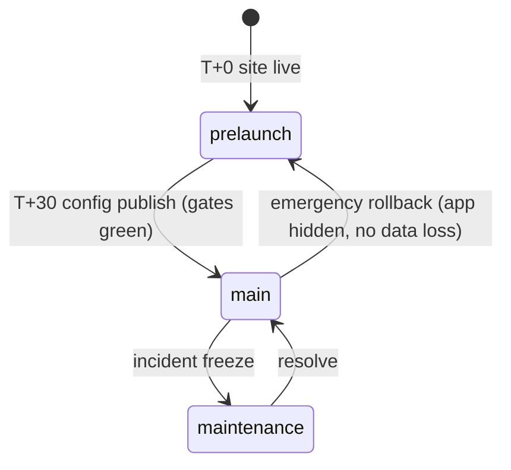
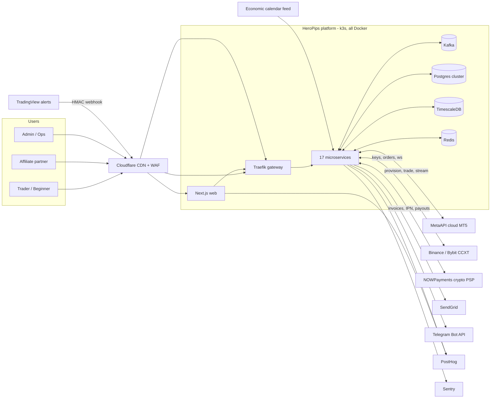
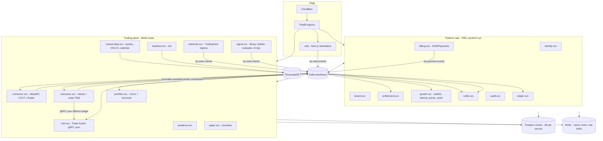
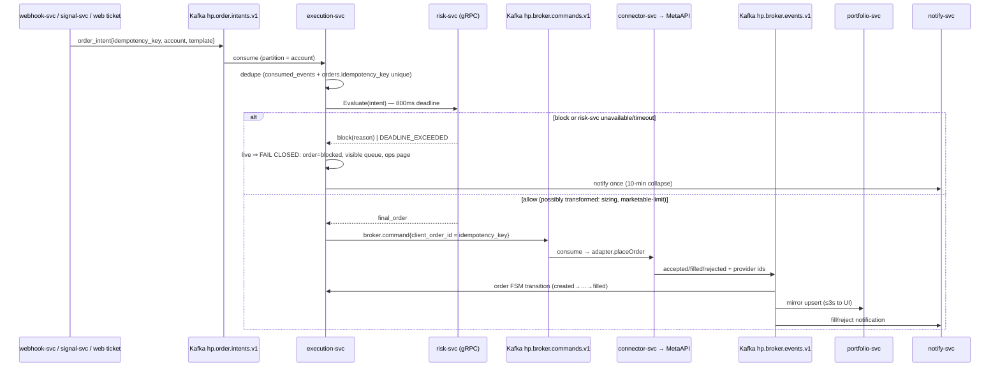
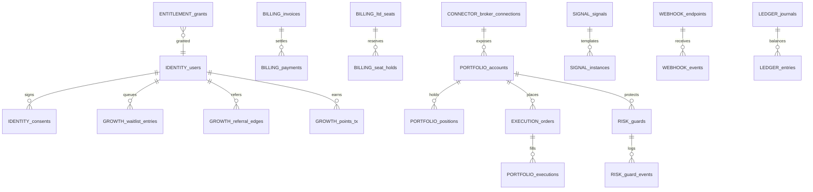
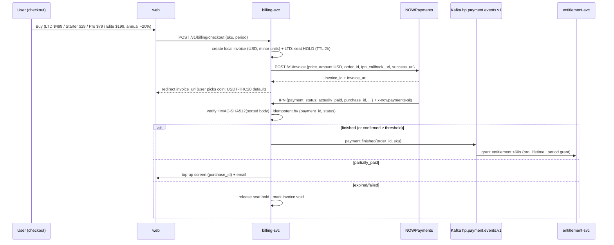
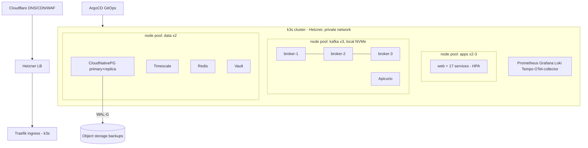

# HeroPips — End-to-End System Architecture (v2.0)

**Product:** HeroPips (heropips.com) — AI-assisted trading automation, academy & signal platform
**Document type:** Technical Architecture Specification (satisfies BRD/PRD/FRD v1.0; supersedes Architecture v1.0)
**Owner:** Founder/CEO · **Author:** Engineering
**Status:** Baseline for build · **Date:** July 28, 2026
**Related:** BRD v1.0 · PRD v1.0 (E1–E19) · FRD v1.0 (FRD-01..20) · Strategy Plan · Design System "Volt on Ink" v1

| Version | Date | Change |
|---|---|---|
| 1.0 | Jul 28, 2026 | Modular monolith + Redis Streams + Stripe. Locked MetaAPI, two-mode launch, pre-launch LTD. |
| 2.0 | Jul 28, 2026 | **Founder overrides (recorded as ADR-006..009):** event-driven microservices on **Apache Kafka**, payments **crypto-only via NOWPayments**, **everything dockerized** (dev compose → prod k3s), full **testing + security-testing program** included. MetaAPI, launch modes, LTD mechanics, design system, and all BRL/FRD rules carried forward unchanged. |

---

## 0. Executive Summary

One platform, two launch modes, seventeen right-sized services on a Kafka backbone — every container reproducible from `docker compose up`.

- **T+0 (pre-launch):** heropips.com live as a production-grade marketing + conversion system: waitlist with referral queue-jump, **Founding Hero lifetime package** sold for **crypto via NOWPayments**, academy preview, affiliate early-apply. Only the 9 "platform rail" services run; variable cost ≈ $0.
- **T+30 (main mode):** tenant-config flip opens the product: auth+2FA, academy v0, paper trading, MT5 connect (MetaAPI), portfolio mirroring, universal ticket, Trade Guards v1 (fail-closed), notifications, dashboards, admin. Founding Heroes + cohort-1 waitlist first; signals/webhooks land days 31–60 per PRD calendar.
- **The execution invariants survive the shape change intact:** synchronous fail-closed risk evaluation, exactly-once order intents, per-account ordering, ≤3s p95 webhook→submit, server-side entitlements, non-cash points, ≤2-level referral, double-entry partner ledger, audit-everything, tenant RLS.

### Decision register (deltas from v1)

| ADR | Decision | Rationale & recorded risk |
|---|---|---|
| ADR-001 *(kept)* | **MetaAPI** is the MT5 provider at launch; MTsocketAPI self-hosted terminal fleet is the Phase-3 margin lever behind the same connector seam (trigger ≈1,000 connected accounts). | Unchanged. |
| ADR-002 *(kept)* | Launch mode = tenant config (`prelaunch → main`), cutover is a config publish, not a deploy. | Unchanged. |
| ADR-003 *(kept)* | Founding Hero LTD sells at pre-launch. Cap **500 global forever**, atomic seat inventory, never repeated post-GA, 14-day refund. | Unchanged; §8.4 adapts inventory to crypto settlement latency. |
| ADR-006 | **Microservices from day 1** (supersedes PRD §11 modular-monolith shape). 17 services, bounded by FRD modules — no nano-services. | Founder decision Jul 28, 2026. Recorded risk: ops surface + distributed-failure classes arrive before PMF; mitigated by platform-rails-first build order (§13), one shared Postgres **cluster** with database-per-service isolation (§7), contracts package + schema registry, and k3s standardization. |
| ADR-007 | **Apache Kafka (KRaft)** is the event backbone (supersedes Redis Streams). Redis remains for cache/locks/rate-limits only. | Founder decision. 3-broker RF=3 in prod, 1-broker dev profile. Transactional outbox + idempotent consumers give exactly-once *effect*. |
| ADR-008 | **NOWPayments is the sole PSP — crypto-only billing** (supersedes Stripe + Paddle fallback; retires Open Question Q3 entirely — no card acquirer needed for the UAE entity). Subscriptions become **prepaid periods with a renewal-invoice engine** (crypto has no card-style auto-charge). Affiliate/partner payouts ride NOWPayments **mass payouts (USDT)** — the BRD already sanctioned the USDT rail. | Verified mechanics §8.1. Recorded risks: crypto-only conversion friction for absolute beginners (mitigate: USDT-TRC20 default + guided checkout; card PSP port kept dormant behind the billing interface), price volatility (fixed-USD pricing, NOWPayments auto-convert to USDT treasury), refunds are manual payouts (approval queue). |
| ADR-009 | **Everything dockerized.** Dev: single `docker compose up` brings the entire platform (all services + Kafka + Postgres + Timescale + Redis + registry + observability + mocks). Prod: **k3s** on Hetzner, Helm charts, GHCR images, ArgoCD GitOps. Web (Next.js standalone) is a container too — no Vercel. | Uniform runtime, no snowflakes; Cloudflare stays in front as CDN/WAF. |

---

## 1. Launch Topology & Mode Machine *(carried from v1, unchanged semantics)*



`tenant-svc` owns `launch_mode`; publishes compacted `hp.tenant.config.v1`; every service caches the latest config record and enforces mode **server-side**.

| Surface | prelaunch | main |
|---|---|---|
| Marketing, `/waitlist`, `/founding` (LTD, until sold out), `/academy` preview, `/affiliates`, `/faq`, `/legal/*` | ✅ | ✅ (`/founding` permanently closed post-GA — BRL-06) |
| Auth (account shell: waitlist status + LTD receipts) | ✅ | ✅ full |
| `/app/**` (dashboard, academy, paper, connect, ticket, guards) | ❌ → `/waitlist` | ✅ cohort-gated via `entitlements.app_access` |
| Live broker connect | ❌ | ✅ paid/LTD only (BRL-01) |
| `hooks.heropips.com` (TradingView ingress) | 503 | ✅ |
| `admin.heropips.com` | ✅ (waitlist/LTD/config ops) | ✅ full |

**Cutover runbook (T+30):** freeze config → PITR snapshot marker → publish `launch_mode: main` (≤60s propagation) → entitlement-svc activates dormant `pro_lifetime` grants + cohort-1 invites (500/day batches) → webhook ingress un-503s → **risk-svc health-check must pass before execution-svc leaves its default-blocked state** (fail-closed is the *initial* state, not an exception path) → announce (SendGrid journey, Telegram/Discord, X). Rollback = republish `prelaunch`.

**Waitlist + queue-jump (E13.7 pulled forward):** `growth-svc` owns `waitlist_entries{email citext unique, referral_code, referred_by, position, cohort, utm}`; 3 verified referrals = tier jump (velocity caps, device fingerprint per FR-13.05); referral edges recorded level-1 now so paid-conversion rewards attribute later (FR-14.01); every join renders a shareable OG card ("#214 to HeroPips") via the same renderer the ROI cards use (FRD-12).

---

## 2. System Context (C4-1)



Trust boundaries: browsers untrusted → Cloudflare → Traefik (TLS 1.2+, mTLS inside the mesh); broker credentials decrypt only inside `connector-svc` memory; TradingView payloads untrusted until HMAC+replay pass; NOWPayments IPNs untrusted until `x-nowpayments-sig` HMAC-SHA512 verification passes (§8.2).

---

## 3. Service Catalog (C4-2) — 17 services, phase-tagged



| # | Service | Owns (FRD trace) | Data | Sync API | Emits → Kafka | Phase |
|---|---|---|---|---|---|---|
| 1 | **web** | Next.js App Router: marketing (SSG/ISR), app shell (RSC/SSR, PWA), admin UI | — | — | — | T+0 |
| 2 | **identity-svc** | FRD-01/02: email+Google auth, Argon2id, TOTP 2FA, sessions (JWT 15m + rotating refresh 30d), devices, lockout+CAPTCHA, consents, onboarding quiz | `hp_identity` | REST `/v1/auth/**`; gRPC token introspection | `user.registered`, `user.verified`, `consent.recorded`, `session.revoked` | T+0 |
| 3 | **tenant-svc** | FRD-17.02/03, FRD-20: config versions + publish/rollback, `launch_mode`, country×feature flags, disclaimers, branding tokens, i18n | `hp_tenant` | REST admin; config served via compacted topic + cache | `hp.tenant.config.v1` (compacted) | T+0 |
| 4 | **entitlement-svc** | FRD-16.03: plan catalog projection, grants (`pro_lifetime`, promo, admin, `app_access`), `effective_entitlements` | `hp_entitlement` | **gRPC `Resolve(user)`** ≤5ms cached (60s TTL, event-invalidated) | `entitlement.changed` | T+0 |
| 5 | **billing-svc** | FRD-16 re-based on NOWPayments (§8): invoices, IPN, renewal engine, LTD seat inventory, refund queue | `hp_billing` | REST `/v1/billing/**`; IPN ingress `/v1/billing/ipn` | `payment.confirmed/finished/failed/expired/partially_paid`, `subscription.renewed/lapsed`, `ltd.granted/refunded` | T+0 |
| 6 | **growth-svc** | FRD-12/13/14 + waitlist: referral codes/edges/rewards (compliance gate 403), Hero Points (earn/redeem, non-cash — CI negative test), share-card/certificate renderer, waitlist + queue-jump | `hp_growth` | REST | `waitlist.joined`, `referral.converted`, `points.earned/redeemed`, `card.rendered` | T+0 |
| 7 | **ledger-svc** | FRD-15.04/05 + E13.4: **the only money-truth** — double-entry journal (affiliate commissions, referral credits, clawbacks, payouts), balance checks, payout queue → NOWPayments mass payout, 4-eyes >$1k | `hp_ledger` | REST (admin/partner reads); gRPC `PostJournal` | `ledger.entry.posted`, `payout.executed/failed` | T+0 |
| 8 | **notify-svc** | FRD-18: outbox consumer, SendGrid/Telegram/in-app WS, per-category prefs, storm collapse (10-min summaries), suppression | `hp_notify` | REST prefs; WS gateway | `notification.sent/bounced` | T+0 |
| 9 | **audit-svc** | FR-00.02/BR-23: consumes `hp.audit.log.v1` → append-only store (no UPDATE/DELETE grants), admin query API, retention ≥7y | `hp_audit` | REST (read-only, RBAC) | — | T+0 |
| 10 | **connector-svc** | FRD-05: `IBrokerConnector` adapters (MetaApiAdapter now; Ccxt Open Beta; cTrader GA), credential vault client, lifecycle states, provider streams normalization, **per-account cost telemetry + idle auto-sleep** | `hp_connector` | gRPC `Connect/Snapshot/Disconnect`; consumes `hp.broker.commands.v1` | `hp.broker.events.v1` (fills, positions, balance, state), `connection.state.changed` | T+30 |
| 11 | **portfolio-svc** | FRD-06: mirror read-model (accounts/positions/orders/executions upserts keyed by provider ids), 5-min reconciler (gRPC snapshot diff), `sync_anomaly`, CSV export, Pro/Elite rollups | `hp_portfolio` | REST reads for web/admin | `portfolio.updated`, `sync.anomaly` | T+30 |
| 12 | **execution-svc** | FRD-07 + pipeline: intent intake (dedupe), order state machine (DB check constraints), **synchronous gRPC risk call (fail-closed)**, broker command issue, compensating flows (reverse = close+open with rollback semantics), rejection mapping to error catalog | `hp_execution` | REST ticket ops; consumes `hp.order.intents.v1` | `order.state.changed`, `hp.broker.commands.v1` | T+30 |
| 13 | **risk-svc** | FRD-10: guard CRUD (schema-validated params), **`Evaluate(order_intent) → allow(transformed) \| block(code)` gRPC, 800ms budget, precedence chain 1..9**, breaker state (daily-loss realized+floating, DD high-water) maintained from `broker.events`, post-trade automations (P1), prop presets (GA) | `hp_risk` | gRPC Evaluate; REST guard CRUD | `guard.triggered/blocked` | T+30 |
| 14 | **market-data-svc** | FRD-11.01 + FR-04.02: live/delayed quote cache (Redis), OHLCV ingestion → Timescale (Dukascopy/Binance dumps, gap detect, `dataset_versions`), calendar feed (news filter source; stale>60min ⇒ fail-open w/ banner) | Timescale + `hp_marketdata` | gRPC `GetQuote/GetBars`; WS quotes for web | `bar.closed{symbol,tf}` | T+30 |
| 15 | **academy-svc** | FRD-03: tracks/modules/lessons (immutable version snapshots), quiz engine (randomized, ≥70%, best-score), progress, paid-lesson paywall previews, CMS, certificates (via growth-svc renderer) | `hp_academy` | REST | `lesson.completed`, `track.completed` | T+30 |
| 16 | **paper-svc** | FRD-04: simulator (fill rules per order type, spread tables, stop-out at 50% margin level), paper accounts (1/1/3/5 per tier), resets w/ archived generations, leaderboard (opt-in) | `hp_paper` | REST; consumes `hp.order.intents.v1` (paper-targeted) | `order.state.changed{simulated:true}` | T+30 |
| 17 | **signal-svc** | FRD-08: library (admin-managed, versioned), instances (pinned versions), builder DSL (depth ≤3, ≤12 predicates, dry-run last 100 bars), bar-close evaluator (+2s grace, dedupe `(instance,symbol,tf,bar_ts)`), modes notify/confirm(15-min token)/auto(consent+guard required), AI tips (deterministic rules first, LLM behind locked template, directive-verb lint) | `hp_signal` | REST; consumes `bar.closed` | `hp.order.intents.v1{source:signal}`, `signal.fired` | day 31–60 |
| 18 | **webhook-svc** | FRD-09: per-user endpoints (32-byte secret shown once), HMAC-SHA256/secret fallback, ±300s window + nonce cache, idempotency (explicit key else 10s fingerprint), tier budgets (100/1k/10k → 429), symbol maps, console (30/90d), test-fire (always paper) | `hp_webhook` | Public POST `/wh/{uuid}` (own hostname); REST console | `hp.order.intents.v1{source:webhook}`, `webhook.received/deduped/blocked` | day 31–60 |
| 19 | **backtest-svc** | FRD-11: async jobs (queued→running→done), quotas (Pro 20/Elite 100 per day), **same evaluator library as signal-svc** (determinism: byte-identical results per `(config, range, dataset_version, assumptions)`) | `hp_backtest` | REST | `backtest.completed` | GA |

*(17 backend services + web + gateway. partner-svc for affiliate deal CRUD/attribution folds into ledger-svc + growth-svc at this scale — deal configs in ledger-svc (money adjacency), attribution in growth-svc — split out post-GA if partner volume demands.)*

**Service template (every service):** NestJS + Fastify · Protobuf contracts from `packages/contracts` · OpenTelemetry auto-instrumentation · health (`/healthz`, `/readyz`) · outbox table + relay publisher · consumer dedupe store · RLS-scoped DB user · distroless image, non-root, read-only rootfs.

---

## 4. Kafka Backbone (ADR-007)

### 4.1 Cluster & conventions

- **Prod:** 3 brokers, KRaft (no ZooKeeper), RF=3, `min.insync.replicas=2`, `acks=all`, idempotent producers, compression `zstd`, dedicated k3s node pool with local NVMe. **Dev:** 1 broker profile.
- **Schema governance:** Protobuf schemas live in `packages/contracts`; **Apicurio Registry** (Docker) enforces compatibility (`BACKWARD_TRANSITIVE`); `buf breaking` gates CI.
- **Naming:** `hp.<domain>.<kind>.v<n>` — bump `v` only on breaking change (dual-publish window during migration).
- **DLQs:** every consumer group has `<topic>.dlq.<group>`; DLQ depth alerts; replayer tool in `apps/ops`.

### 4.2 Topic map

| Topic | Key (ordering) | Partitions | Retention | Producers → Consumers |
|---|---|---|---|---|
| `hp.order.intents.v1` | `account_id` | 24 | 7d | webhook/signal/web-ticket/paper → execution-svc, paper-svc |
| `hp.broker.commands.v1` | `account_id` | 24 | 3d | execution-svc → connector-svc |
| `hp.broker.events.v1` | `account_id` | 24 | 7d | connector-svc → portfolio, risk, execution, notify |
| `hp.payment.events.v1` | `user_id` | 6 | 30d | billing-svc → entitlement, growth, ledger, notify |
| `hp.tenant.config.v1` | `tenant_id` | 1 | **compacted** | tenant-svc → all |
| `hp.entitlement.events.v1` | `user_id` | 6 | 30d | entitlement-svc → all gates |
| `hp.domain.events.v1` | aggregate id | 12 | 30d | rails services → notify, analytics-forwarder, growth |
| `hp.audit.log.v1` | `actor_id` | 6 | ∞ (tiered to object storage) | all → audit-svc |
| `hp.notify.outbound.v1` | `user_id` | 6 | 7d | all → notify-svc |
| `hp.marketdata.bars.v1` | `symbol` | 12 | 3d | market-data-svc → signal-svc, paper-svc |

### 4.3 Delivery semantics (the honest version)

Kafka gives at-least-once; we engineer **exactly-once effect**:

1. **Transactional outbox** in every service: domain mutation + outbox row in one Postgres tx; relay publishes with idempotent producer; row marked sent. (Debezium CDC is the drop-in upgrade at scale — same table shape.)
2. **Consumer dedupe:** every event carries UUIDv7 `event_id`; consumers upsert into `consumed_events(event_id pk)` inside the same tx as their side effect.
3. **Ordering:** partition key = account_id/user_id; single consumer per partition per group; execution-svc additionally holds a Redis per-account lock across the risk→route critical section.
4. **What is NEVER on Kafka:** risk evaluation (synchronous gRPC — fail-closed semantics can't ride an async bus), entitlement checks (gRPC), IPN verification (HTTP ingress). Kafka carries facts and commands, not safety gates.

---

## 5. Execution Pipeline (invariants unchanged, transport re-based)



Latency budget audit (p95 ≤3s excl. venue): ingress verify ~30ms · Kafka hop ~20ms · dedupe ~5ms · risk eval ≤800ms worst (typ. <50ms — breaker states are precomputed from `broker.events`, not fetched) · command hop ~20ms · MetaAPI submit 200–900ms. Headroom holds; k6 gate enforces it (§11).

Paper parity: paper-targeted intents consume from the same topic into paper-svc's simulator — identical validation path, `simulated=true` (FR-04.05).
Webhook HTTP semantics preserved: guard blocks return **200 `status=blocked_by_guard`** (TradingView retries non-2xx), duplicates return original result (FR-09.04/09.07) — webhook-svc awaits the execution outcome via correlated reply (Redis rendezvous, 2.5s cap, else `202 queued` + console entry).

---

## 6. Broker Connectivity *(carried from v1 — §5 there; deltas only)*

- `IBrokerConnector` interface unchanged; **MetaApiAdapter** unchanged (provision→state mapping, investor-password probe, streaming listener, 5y history watermark, region pinning, retry/jitter/circuit-breaker per account).
- Now isolated in `connector-svc`: the **only** service holding provider credentials/SDKs; horizontal shards by `account_id % N` consumer assignment; cost telemetry row per account per month (BO-8) + idle auto-sleep (undeploy 14d-inactive, redeploy on demand with "waking your terminal" UX).
- CCXT (Binance/Bybit — withdrawal-scope keys rejected, nothing stored) Open Beta; cTrader OAuth GA; **MTsocketAPI terminal-fleet bridge** stays the Phase-3 ADR-001 lever — a new adapter + fleet orchestrator, zero changes above the seam.
- Credential vault: **HashiCorp Vault (Docker) transit engine** performs envelope encryption (AES-256-GCM data keys wrapped by transit master; auto-unseal via cloud KMS optional). Secrets decrypt only in connector-svc memory; CI log-scrubber e2e proves no leakage; no reveal endpoint; delete ⇒ provider undeploy + purge (FR-05.06).

---

## 7. Data Architecture

### 7.1 Postgres — one HA cluster, database-per-service

**CloudNativePG** operator on k3s: 1 primary + 1 streaming replica + WAL archiving to object storage (RPO ≤15min, PITR; RTO ≤4h, weekly restore drill). Each service gets its **own database + own role** (`hp_identity`, `hp_billing`, …): no cross-service joins possible at the DB layer — sharing happens via Kafka events or gRPC only. Promotion path: any hot service's DB can move to a dedicated instance without app changes (connection string only).

Binding conventions (FRD §5): UUIDv7 PKs · `tenant_id NOT NULL` + RLS `tenant_id = current_setting('app.tenant_id')::uuid` on every domain table (defense-in-depth *inside* each service DB) · money `bigint` minor units + `char(3)` · timestamptz UTC · FSM check constraints (orders per FR-07.03) · append-only tables (`audit_log`, `points_tx`, `ledger_entries`, `webhook_events`, `consumed_events`) have no UPDATE/DELETE grants · provider ids unique per connection.



### 7.2 TimescaleDB

Separate CloudNativePG-managed instance (Timescale extension): `ohlcv(symbol, tf, ts, o,h,l,c,v)` hypertable + continuous aggregates M1→M5/M15/H1/H4/D1 · `calendar_events` · `dataset_versions{id, source, range, checksum}` (every backtest + every published hypothetical-stats block pins one) · compression policy >90d · nightly ingestion jobs with gap detection/backfill. Needed from day 31 (signals) — pre-launch runs without it.

### 7.3 Redis

Cache (entitlements 60s, tenant config, symbol specs 24h, quote last-tick) · rate limiting (sliding window at gateway + per-service) · distributed locks (per-account execution critical section) · confirm-token store (15-min signed actions) · webhook nonce cache (10-min replay window) · IPN reply rendezvous. **No queues on Redis** (ADR-007).

### 7.4 Retention & privacy *(unchanged)*

trades/executions ≥7y · audit ≥7y (tiered to object storage) · webhook_events 30d/90d · backtests 90d/1y · GDPR export ≤72h, delete anonymizes PII preserving financial/audit records · consents versioned {doc, version, ip, ts} · analytics properties carry user id only.

---

## 8. Billing on NOWPayments (ADR-008) — crypto-native, entitlement-safe

### 8.1 Verified integration facts (nowpayments.io API docs, Jul 2026)

Non-custodial; 300+ pay currencies; settlement auto-converted to our **USDT treasury wallet** (0.5% mono / 1% with conversion + network fees). Flows: `POST /v1/payment` (deposit address) or `POST /v1/invoice` (hosted checkout, `success_url`/`cancel_url`) — we use **invoices** (PCI-free, wallet-agnostic UX). **IPN:** POST to our callback with header `x-nowpayments-sig` = **HMAC-SHA512 over the JSON body with keys sorted alphabetically**, signed with the store's IPN secret; configurable retry storm on non-200. Status ladder: `waiting → confirming → confirmed → sending → finished`, plus `partially_paid`, `expired`, `failed`, `refunded`. Underpayment: `partially_paid` + `purchase_id` lets us issue top-up payments against the same order. Sandbox: `api-sandbox.nowpayments.io` (CI target). Mass payouts API: batch crypto payouts (affiliate rail). 2FA + withdrawal whitelisting on the merchant account.

### 8.2 billing-svc design



Rules:

- **Idempotency:** IPNs deduped on `(payment_id, payment_status)`; out-of-order statuses resolved by ladder rank; raw IPN bodies archived (`hp_billing.ipn_events`, append-only) for dispute forensics.
- **Grant threshold:** entitlements activate at `finished` (funds settled). For UX, `confirmed` shows "payment confirmed — activating…". Never grant on `waiting/confirming`.
- **Fixed-USD pricing:** catalog prices in USD minor units; NOWPayments computes crypto amount at invoice time; volatility risk sits in the payment window (theirs), treasury auto-converts to USDT (ours).
- **Under/over-payment:** `partially_paid` ⇒ guided top-up via `purchase_id`; overpayment logged as ledger credit (redeemable for subscription time — never cash-out, BRL-02 analog).

### 8.3 Subscriptions without cards — the renewal engine

Crypto cannot auto-charge. Subscriptions = **prepaid entitlement periods**:

1. Purchase grants `plan_period{plan, start, end}` (month/year).
2. Renewal engine (billing-svc cron): **T−7d** create renewal invoice + email/in-app/Telegram · **T−3d, T−1d** reminders · **T+0..+3d grace** (features intact, banner) · **T+3d** lapse ⇒ `subscription.lapsed` ⇒ entitlement-svc downgrades per E7.3 (connections read-only, instances paused, nothing deleted) · late payment within 30d reactivates same terms.
3. Hero Points redemption (3,000 pts = 1 month Starter, admin-config) applies as ledger credit **before** invoice amount (E12.2 — non-cash redemption only).
4. Annual −20% is the churn lever (one renewal event/year) — checkout defaults to annual.
5. Dormant **card-PSP port**: `billing-svc` fulfillment is interface-driven (`PspPort`); a card provider can be added later without touching entitlements (recorded option, not built).

### 8.4 LTD seat inventory under slow settlement (ADR-003 × crypto)

`ltd_seats{cap:500, remaining}` + `seat_holds{invoice_id, expires_at}`: hold **reserved at invoice creation** (atomic `UPDATE … WHERE remaining > 0`), TTL 2h (crypto payment window); expiry/failure releases; `finished` converts hold → grant (dormant until main mode). Oversell impossible: holds + grants ≤ cap enforced by the same row lock. Sold-out ⇒ waitlist. Concurrency e2e in §11.3. Cap immutable (code + config checksum), never repeated post-GA.

### 8.5 Refunds & clawbacks

14-day LTD/first-subscription money-back: user submits payout address → refund queue (Finance approval; 4-eyes >$1k) → **NOWPayments payout** in USDT equivalent of USD price (policy page, counsel-owned) → `payment.refunded` ⇒ entitlement revoked, seat returned, referral/affiliate accruals clawed back (FR-14.02/15.05). All refund legs are ledger journal entries — Σdebit=Σcredit always.

### 8.6 Affiliate/partner payouts

ledger-svc payout queue (monthly, ≥$50, KYC'd, geo/withholding blocks) executes via **NOWPayments mass payout** to whitelisted addresses — the BRD's USDT rail, now first-class. Invoice PDFs auto-generated; failed payouts return to queue with reason.

### 8.7 Compliance notes (counsel items, pre-launch gate)

Crypto-only checkout wording (no investment framing — you are buying **software access**); refund policy in USDT-equivalent terms; sanctioned-jurisdiction blocks via tenant country flags at checkout; NOWPayments merchant KYB completed + IPN secret + withdrawal whitelisting + 2FA before first sale; Travel-Rule/VASP posture: HeroPips never custodies user crypto — NOWPayments settles to our own treasury (we remain a software merchant, not an exchange).

---

## 9. Website & App Surface *(carried from v1 §9 — unchanged standards, two deltas)*

All AGENTS.md production standards stand at T+0: Lighthouse ≥95 ×4 (mobile+desktop), LCP<2.5s / CLS<0.1 / INP<200ms, WCAG 2.1 AA (0 axe violations), responsive 320→1920 (design-system breakpoints, ≥44px targets, safe-areas), PWA (manifest, maskable icons, offline fallback; app-shell caching at main mode), SEO pack (unique title/desc/canonical/OG per route, dynamic `sitemap.xml`, `robots.txt`, **301 hellopips.com**), AEO pack (**`/llms.txt` + `/llms-full.txt`**, `FAQPage`/`Organization`/`WebSite`/`SoftwareApplication`+`Offer`/`BreadcrumbList`/`Course` JSON-LD, server-rendered extractable content), Volt-on-Ink tokens as the only styling source (CI gates: no raw hex/px in app code, no hard-coded brand strings — FR-20.02), analytics taxonomy extending into PRD §13 without renames.

Deltas: **(1)** web ships as a Docker container (Next.js `output: standalone`) behind Traefik + Cloudflare CDN (ISR via cache tags) — no Vercel. **(2)** `/founding` + `/pricing` present **crypto checkout** (coin selector, USDT-TRC20 default, live seat counter, payment-status screen driven by billing-svc SSE).

---

## 10. Platform, Docker & Deployment (ADR-009)

### 10.1 Images & registry

Every deployable = Dockerfile in its app dir: multi-stage (pnpm fetch → build → **distroless/nodejs22** runtime), non-root UID, read-only rootfs, `tini` init, healthcheck. Images → GHCR, tagged `sha-<git>` + `vX.Y.Z`; **SBOM (syft) attached + cosign-signed**; Trivy scan gate (no HIGH/CRITICAL).

### 10.2 Dev: one command

`docker compose up` (profiles): all 17 services + web + Traefik + Kafka (1 broker KRaft) + Apicurio + Postgres + Timescale + Redis + Vault (dev mode) + observability (Prometheus/Grafana/Loki/Tempo) + **mocks**: MetaAPI simulator (WS + REST stub with scripted fills/latency/chaos), NOWPayments sandbox proxy, SendGrid capture (MailHog), Telegram stub, TradingView alert generator. Seed script: tenant #1 config, plan catalog, 10 lessons, demo users per persona P1–P5, LTD seats=500. **Full-stack e2e runs on this exact compose in CI.**

### 10.3 Prod: k3s on Hetzner



- Helm chart per service from one library chart (values: image, env, resources, HPA, PDB, ServiceMonitor, NetworkPolicy).
- **NetworkPolicies:** default-deny; only declared service→service/gRPC/Kafka paths open; mTLS inside via Traefik/cert-manager issued SPIFFE-style certs.
- Secrets: Vault Agent injector (no secrets in manifests/env files); sealed bootstrap only.
- ArgoCD syncs `infra/gitops` (app-of-apps); rollouts: web + rails = rolling; execution/risk/connector = **blue-green with drain** (finish in-flight intents, stop consuming, cut over — no order can be half-routed).
- Sizing at beta: apps 2–3× CPX41, kafka 3× CCX23 (NVMe), data 2× CCX33 ≈ **€300–450/mo** — the microservices tax vs v1's ~€150 compose, accepted under ADR-006.

### 10.4 Observability & SLOs

OTel traces end-to-end (correlation id: webhook→intent→risk→command→fill→notification) · RED dashboards per service + business boards (LTD seats, MRR-equivalent, MetaAPI cost/account, guard blocks, north-star Weekly Guarded Live Traders) · Loki structured logs (secret-scrubbed at source) · alerting: fail-closed activations page instantly, DLQ depth, consumer lag, ledger imbalance, IPN signature failures spike, seat anomalies, SLO burn (99.5% beta / 99.9% GA execution path) · public status page from Open Beta.

---

## 11. Testing Architecture — "ready to test" is a build artifact, not a phase

### 11.1 Pyramid & gates (every PR, per affected service)

| Layer | Tooling | Gate |
|---|---|---|
| Static | TypeScript strict, ESLint, `buf lint` | 0 errors |
| Unit | Vitest (domain logic: sizing math FR-07.02, fill rules FR-04.03, precedence chain FR-10.02, renewal clock, IPN parser) | ≥85% on domain packages; mutation spot-checks (Stryker) on risk-svc math |
| Contract | OpenAPI diff (REST), `buf breaking` (gRPC/Protobuf), Apicurio compatibility check | no breaking change without `v+1` |
| Integration | **Testcontainers**: real Postgres/Kafka/Redis per suite; MetaAPI mock; NOWPayments sandbox | outbox→consume→effect proven per service |
| Component | Service container + its DB + Kafka in compose; golden-path scenarios | healthz/readyz + scenario green |
| E2E | Playwright vs full dev compose (§10.2) | suite green (below) |
| Performance | k6: 200 alerts/s sustained webhook→submit **p95 ≤3s**; signal eval p95 ≤5s; 1k concurrent instances; gateway 1k rps | budgets hold, no consumer lag growth |
| Chaos | scripted in compose/k3s (below) | invariants hold |

### 11.2 The named suites (from FRD Appendix D, now executable specs)

1. **Idempotency suite** — same TradingView alert ×3 in 8s ⇒ exactly 1 broker order, console shows 1 executed + 2 deduplicated (FR-09.04); signal re-emission after evaluator restart ⇒ `signal_duplicate_dropped` (FR-08.04); Kafka redelivery ⇒ `consumed_events` dedupe.
2. **Fail-closed chaos suite** — kill risk-svc pods under 50 alerts/s live load ⇒ **0 unguarded orders reach the (mock) broker**, intents visible as blocked-queued, ops alert fired (FR-10.03); kill 1 Kafka broker ⇒ no message loss (RF=3), p95 recovers <60s; partition connector-svc from MetaAPI mock ⇒ connections `degraded`, submissions disabled with reason.
3. **Ledger property tests** — fast-check generators over accrual/clawback/payout sequences: Σdebits=Σcredits per journal always; payable = accruals−clawbacks−payouts exactly; imbalance freezes payout queue + alerts <5min (FR-15.04).
4. **Entitlement-bypass suite** — every gated endpoint called with Free/expired/lapsed users ⇒ 402/403 server-side (client gating is cosmetic); LTD dormant grant grants nothing pre-cutover (FR-00.01/16.03).
5. **LTD concurrency** — 1 seat remaining, 2 concurrent checkouts + IPN races ⇒ exactly one grant, one auto-void/refund path, `remaining=0`, holds ≤ cap invariant (FR-16.05 AC adapted §8.4).
6. **RLS isolation** — cross-tenant reads return zero rows in every service DB (FR-20.01).
7. **Secret-leak scan** — e2e run then grep all Loki output + traces for credential/token/IPN-secret patterns ⇒ zero hits (FR-05.06).
8. **Determinism** — identical backtest inputs ⇒ byte-identical result hashes with pinned `dataset_version` (FR-11.04).
9. **Referral compliance gate** — Ops-role admin sets depth=5/cash ⇒ 403 `compliance_signoff_required` + audit row (FR-14.03).
10. **Billing/IPN suite** — bad `x-nowpayments-sig` ⇒ 403 + alert counter; replayed IPN ⇒ deduped; out-of-order statuses ⇒ ladder-resolved; `partially_paid` ⇒ top-up flow; `expired` ⇒ seat released; renewal engine time-travel (fake clock): T−7 invoice, T+3 lapse ⇒ E7.3 downgrade, nothing deleted; points-credit applied before invoice amount.
11. **Paper-parity suite** — same intent to live(mock) vs paper ⇒ identical validation outcomes; paper flagged `simulated=true`, zero broker calls (FR-04.05/E3 AC).
12. **Reconciliation suite** — external close at (mock) broker ⇒ local matches ≤5min, `source=external` attribution; ≥3 anomalies/hr pages ops (FR-06.03).

### 11.3 E2E golden paths (Playwright, full compose)

Waitlist join → referral queue-jump → **LTD crypto checkout on NOWPayments sandbox → IPN → dormant grant** → cutover flip (`launch_mode: main` on staging) → Founding Hero login+2FA → MT5 connect (mock) → sync visible → daily-loss guard created → risk-% ticket → fill notification → TradingView test-fire deduped → guard-blocked entry returns 200 `blocked_by_guard` + one collapsed notification → renewal lapse → E7.3 downgrade banner. Plus AGENTS.md web QA: Lighthouse CI + axe on key routes, responsive matrix 320–1920, link check, JSON-LD validation.

### 11.4 Milestone gates

CI is the M1 gate (idempotency + fail-closed suites green mandatory); M5/GA adds pen test + full performance sign-off. **A release that skips a named suite cannot deploy — ArgoCD only syncs images whose CI run attests all suites (cosign attestation).**

---

## 12. Security Program — engineering + continuous security testing

### 12.1 Threat model (STRIDE, maintained per service in `docs/security/`)

Top abuse cases designed against: forged TradingView alerts (HMAC+replay+budgets) · forged IPNs / fake payment confirmation (HMAC-SHA512 verify + status-ladder + amount cross-check vs local invoice) · credential theft (Vault envelope, memory-only decrypt, no reveal, 2FA gate) · entitlement bypass (server-side resolve, suite 11.2.4) · IDOR (tenant RLS + ownership checks + suite) · referral/points fraud (velocity caps, device fingerprint, same-instrument detection, clawbacks) · seat oversell (row-lock inventory) · SSRF/webhook abuse (egress-restricted NetworkPolicies, schema-validated payloads ≤8KB) · replayed/duplicated orders (idempotency end-to-end) · insider/admin abuse (RBAC 6 roles, 4-eyes payouts, read-only impersonation with red banner, append-only audit).

### 12.2 Controls (OWASP ASVS L2 mapped checklist in repo)

Edge: Cloudflare WAF, bot rules on `hooks.` + `/v1/billing/ipn`, rate limits (auth 5/15min lockout+CAPTCHA, checkout, webhooks per-tier) · AuthN: Argon2id, breached-password list, TOTP (required pre-live-connect), rotating refresh, device revoke · AuthZ: RBAC+entitlements on every mutation, RLS last line · Transport: TLS 1.2+ external, mTLS internal, NetworkPolicy default-deny · Secrets: Vault, no secrets in env/manifests/logs (scrubber test) · Supply chain: pinned lockfile, osv-scanner, Trivy image gate, SBOM + cosign signing + deploy-time verification, Renovate · Data: field-level encryption for broker creds, PII minimization, GDPR flows · Money: withdrawal-scope keys rejected (CEX), NOWPayments withdrawal whitelisting + 2FA, payout 4-eyes, ledger invariants block payouts on imbalance.

### 12.3 Security testing cadence

| Activity | Tool | When |
|---|---|---|
| SAST | Semgrep (curated + `nodejs`/`nestjs` packs) | every PR |
| SCA / containers / IaC | osv-scanner · Trivy fs+image · tfsec/checkov · kube-bench monthly | every PR / nightly |
| Secret scanning | gitleaks (pre-commit + CI) + Loki scrub audit | every PR / weekly |
| DAST | OWASP ZAP baseline vs staging (authed contexts per role) | nightly; full scan weekly |
| API fuzzing | Schemathesis vs OpenAPI (all REST); `buf`-driven gRPC negative tests | nightly |
| AuthZ regression | executable RBAC matrix (FR-17.06) + IDOR corpus | every PR touching guards/gates |
| Abuse simulations | webhook forgery/replay storm, IPN forgery, referral fraud scripts, seat-race | weekly on staging |
| Chaos + fail-closed | suite 11.2.2 | weekly on staging + every release |
| External pen test | independent firm, scope: execution path, billing, admin | **before GA (M5 gate)** + annually |
| Bug bounty | private program | post-GA |

Incident response: severity matrix, on-call rotation, fail-closed default posture, user-comms templates (BR-12 runbook), post-incident review with audit-log forensics.

---

## 13. 30-Day Build Plan (re-sequenced for microservices)

Team: founder + eng lead + 2 contractors + content lead. **Rails before trading plane; the pre-launch site only needs the rails.**

| Days | Workstream | Ships |
|---|---|---|
| 0–3 | W0 Platform | Monorepo (pnpm+Turborepo), `packages/contracts` (Protobuf+zod+error catalog), service template (NestJS+OTel+outbox+health), dev compose with Kafka/Apicurio/Vault/observability/mocks, CI skeleton (all §11.1 gates wired), Helm library chart, k3s staging cluster via Terraform+ArgoCD |
| 0–5 | W0 Blockers | **P1:** NOWPayments merchant KYB + IPN secret + treasury wallet + withdrawal whitelist + sandbox keys · **P2:** counsel: LTD terms, ToS/privacy/risk, **crypto refund policy** · **P3:** hellopips 301 + Cloudflare DNS cutover |
| 2–12 | W1 Rails | identity, tenant (launch_mode), entitlement, billing (invoices+IPN+seats+renewal engine), growth (waitlist/referral/cards), notify (SendGrid+in-app), audit, ledger — each with integration tests green |
| 4–12 | W2 Pre-launch web | Marketing routes on Volt-on-Ink primitives, `/founding` crypto checkout + live seat SSE, waitlist + queue-jump + OG cards, academy 3 previews, FAQ/legal, SEO/AEO pack, PWA shell, analytics |
| 10–14 | Hardening → **GO LIVE pre-launch ≈ day 12–14** | Lighthouse/axe/responsive green · e2e §11.3 pre-launch subset · billing suite 11.2.10 vs sandbox · load test waitlist+checkout · ZAP baseline clean |
| 8–24 | W3 Trading plane | market-data (quotes for paper), connector (MetaApiAdapter vs mock + real demo brokers on staging), portfolio (mirror+reconciler), execution (FSM + gRPC risk integration), risk (guard v1 set: risk-% sizing, per-trade cap, max-concurrent, daily-loss breaker, DD watchdog, panic close), paper simulator, academy v0 (10 lessons), app shell (bottom tabs / sidebar) |
| 22–28 | Integration & chaos | E2E on **3 real broker demo accounts** (M0 exit) · suites 11.2.1/2/6/7/11/12 green on staging k3s · latency budget verified under k6 |
| 29–30 | **Gate M-LAUNCH** → cutover §1 | Founding Heroes + cohort-1 in; first guarded live order = the north-star event |
| 31–60 (PRD Closed Beta) | Follow-on | signal-svc + webhook-svc (+ suites 11.2.8/9 full), points/referral rewards live, Telegram bot, journal v1; Open-Beta scope (CCXT, tier sales, affiliate portal) per PRD §6 |

**Gate M-LAUNCH (all required):** M0 exit criteria (PRD §15) · named suites green (11.2.1–7, 10–12) · SLO dashboards live · counsel sign-off on app disclaimers · blue-green drain rehearsed · rollback rehearsed · support runbook + incident comms ready.

Honest note (ADR-006 risk): the microservices tax is ~4–6 engineer-days of W0 platform work and permanent ops overhead vs v1. The rails/trading split keeps the **pre-launch date insensitive** to trading-plane slippage; if W3 slips, cutover gates to Founding-only cohort with academy+paper first — BRL-11 one-in-one-out governs any scope trade.

---

## 14. Cost Model

| Phase | Fixed infra | Variable | Notes |
|---|---|---|---|
| Pre-launch | ~€300–450/mo (k3s pools §10.3) + Cloudflare free + SendGrid ~$20 | NOWPayments 0.5–1% of LTD revenue | No MetaAPI, no Timescale load |
| Main T+30 (≤500 users, ≤150 live conns) | ~€400–550/mo | MetaAPI ≈ $10 × live conns (≤$1.5k/mo); idle auto-sleep −20–40% | Crypto PSP fees ≪ card fees (2.9%+) — margin tailwind vs plan |
| Beta scale (3k conns) | ~€700–1,200/mo | MetaAPI dominates (≈$30k/mo worst case) → BRD §7.2 margins hold | Q1 volume quote + auto-sleep + crypto-user mix are the levers |
| Bridge trigger | — | ~1,000 connected MT5 accounts | MTsocketAPI fleet (ADR-001) lifts GM →~85% |

---

## 15. Risk Register (v2 deltas)

| Risk | L×I | Mitigation |
|---|---|---|
| Microservices+Kafka ops burden pre-PMF (founder-accepted) | M×M | Service template + library chart + ArgoCD standardization; rails-first; DB-per-service on ONE cluster; §11 suites as regression net |
| Crypto-only checkout depresses beginner conversion | M×H | USDT-TRC20 default + guided "first crypto payment" flow + Academy explainer; monitor `founding_checkout_started→finished`; dormant card-PSP port is the pre-agreed fallback (flip = new PspPort impl, no entitlement changes) |
| NOWPayments availability/policy change | L×H | PspPort abstraction; IPN archive enables replay; treasury swept to self-custody wallet on schedule; status monitored |
| IPN forgery / fake-payment fraud | L×H | HMAC-SHA512 verify + amount/currency cross-check vs local invoice + status ladder + suite 11.2.10; alerts on signature-failure spikes |
| Seat oversell under slow crypto settlement | L×M | Hold-with-TTL inventory (§8.4) + concurrency suite |
| Kafka message loss / consumer lag melts latency budget | L×H | RF=3 min.insync=2 acks=all; lag SLO alerts; k6 gate; risk path is gRPC (never queued) |
| Renewal-lapse churn (no auto-charge) | M×M | Annual-default pricing, T−7/−3/−1 nudges (email+Telegram), 3-day grace, points-credit renewals, in-app one-click renew |
| Distributed data drift (no cross-service joins) | M×M | Events are the only sharing path; reconciliation jobs (portfolio 5-min, billing↔entitlement nightly, ledger balance nightly) + drift alerts |

ADR index: ADR-001 MetaAPI/MTsocketAPI-bridge · ADR-002 launch-mode config · ADR-003 pre-launch LTD · ADR-006 microservices · ADR-007 Kafka · ADR-008 NOWPayments crypto-only · ADR-009 all-Docker/k3s. Records in `docs/adr/`.

---

## Appendix A — Repository layout

```
heropips/
├── apps/
│   ├── web/                          # Next.js standalone (marketing+app+admin)
│   ├── services/
│   │   ├── identity/ tenant/ entitlement/ billing/ growth/ ledger/ notify/ audit/
│   │   ├── connector/ portfolio/ execution/ risk/ market-data/ academy/ paper/
│   │   └── signal/ webhook/ backtest/
│   └── ops/                          # DLQ replayer, seat admin, ledger tools
├── packages/
│   ├── contracts/                    # Protobuf + zod + OpenAPI + error catalog + event schemas
│   ├── ui/                           # Volt on Ink tokens + primitives
│   ├── connectors/                   # IBrokerConnector + adapters (used by connector-svc)
│   ├── service-kit/                  # Nest template: outbox, dedupe, OTel, health, RLS ctx
│   └── config/                       # eslint/tsconfig/tailwind preset
├── infra/
│   ├── compose/                      # dev + e2e profiles (full platform + mocks)
│   ├── terraform/                    # Hetzner, Cloudflare, k3s bootstrap
│   ├── helm/                         # library chart + per-service values
│   └── gitops/                       # ArgoCD app-of-apps
├── docs/ (this file, adr/, security/ threat models, runbooks/)
└── .github/workflows/                # §11 gates + image build/sign/attest
```

## Appendix B — What "done" means at each gate

- **T+0 site:** AGENTS.md Definition-of-Done on the web surface + first **live NOWPayments LTD sale** verified end-to-end (real IPN, real grant, real receipt) + suites 11.2.4/5/10 green.
- **T+30 main:** M0 exit + Gate M-LAUNCH + a Founding Hero placing a **guarded live MT5 order** within 24h of cutover — the north-star event, captured in PostHog and toasted in volt.

— End of Architecture v2.0 —
