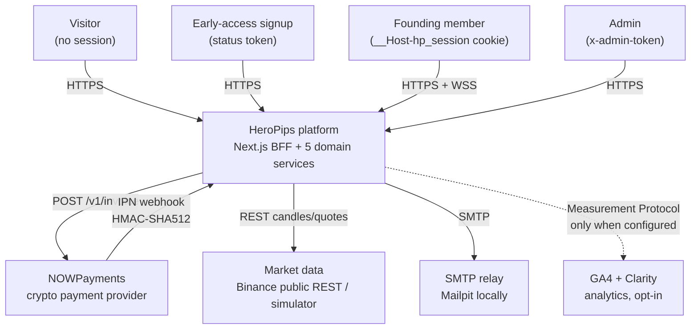
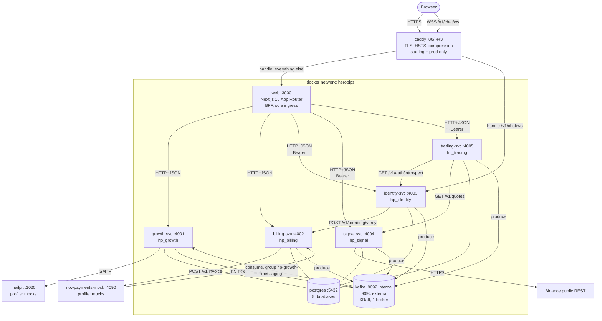
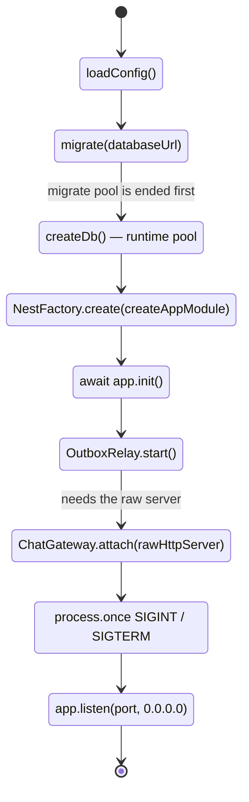
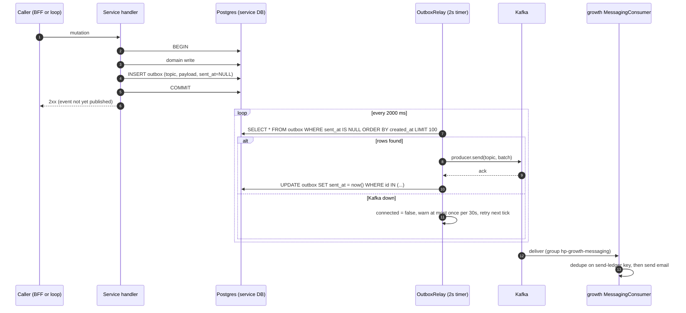
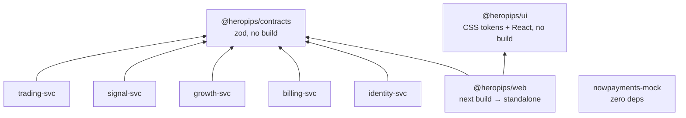

# System architecture

This document explains how HeroPips is decomposed, why it is decomposed that
way, and what happens at runtime. It covers the system context, the container
topology, the service catalogue, the load-bearing architectural decisions and
their tradeoffs, boot and shutdown sequencing, the event architecture, the three
request paths, the build graph, and the architectural risks that are real today.
It is for an engineer who joined this week and needs a mental model before
opening any service. Table shapes and column semantics live in
[the data model](./02-data-model.md); end-to-end business sequences live in
[flows](./03-flows.md); per-service internals live under
[features](./04-features/); containers, environment variables and deploy live in
[infrastructure](./07-infrastructure.md).

---

## 1. System context

HeroPips is an AI trading-signal platform sold as a one-time **Founding Hero
lifetime deal** during a pre-launch phase. The price is a flat **$499 USD**
(`packages/contracts/src/index.ts:292-297`, `LTD.PRICE_USD_DEFAULT: 499`) against
a cap of 500 seats. There is no seat-price ladder anywhere in the codebase; the
only ladder in billing is `PAYMENT_STATUS_RANK`
(`packages/contracts/src/index.ts:195-198`), which orders out-of-sequence payment
webhooks.

The product surface is: an early-access waitlist with email verification and
queue positions, a paid lifetime membership, generated trading signals, broker
connections with paper/live execution and PnL tracking, a gamified 10-level
trading academy, a founding-member chat lounge, and a multi-level referral
programme.

### Actors

| Actor | Reaches | Through |
|---|---|---|
| Visitor | Marketing pages, academy Level 0 | Next.js server render, no session |
| Early-access signup | `/early-access`, `/early-access/status` | BFF route handlers → growth-svc; identified by a signed status token, not a session |
| Founding member | `/app/**` | `__Host-hp_session` cookie → BFF → identity/signal/trading/growth |
| Admin | `PATCH /v1/referrals/config` | `x-admin-token` header checked against `ADMIN_TOKEN`; unset ⇒ 503 (`apps/services/growth/src/common/config.ts:11,42`) |
| NOWPayments (payment provider) | `POST /v1/billing/ipn` | Server-to-server HMAC-SHA512 webhook; simulated locally by `infra/mocks/nowpayments` |
| Market data feed | signal-svc only | Binance public REST, or a deterministic simulator (`apps/services/signal/src/common/config.ts:15,20`) |
| SMTP relay | growth-svc only | `SMTP_URL`; unset ⇒ emails are logged, not sent (`apps/services/growth/src/messaging/config.ts:8-9,36`) |



Only the visitor's browser and the payment provider's webhook cross the trust
boundary inward. Everything else is outbound.

---

## 2. Container view

Six application containers, two infrastructure containers, and — in staging and
production — a Caddy edge that terminates TLS. Ports, database names and topic
strings are authoritative here and are not restated differently elsewhere.



Edge and wiring evidence: `infra/compose/docker-compose.yml:283-316` (web,
`GROWTH_URL`…`TRADING_URL` internal DNS names, `depends_on`),
`infra/compose/docker-compose.yml:82-110` (Kafka KRaft listeners),
`infra/compose/docker-compose.yml:50-80` (Postgres),
`infra/compose/caddy/Caddyfile.production:48-97` (edge routing —
`handle /v1/chat/ws` → `{$CHAT_UPSTREAM}` at `:69-77`, everything else →
`{$UPSTREAM}` at `:80-90`),
`infra/compose/docker-compose.production.yml:151-161`
(`UPSTREAM: web:3000`, `CHAT_UPSTREAM: identity:4003`, mounting
`./caddy/Caddyfile.production`).

No service publishes a port to the host in the base topology — the browser
reaches only the edge, and the edge reaches only `web` and (for the lounge
socket) `identity` (`infra/compose/docker-compose.yml:279-282`). This is not
left to convention: CI renders the staging and production overlays and fails the
build if any development mock appears or if more than three ports are published,
which is exactly the edge proxy's `80`, `443` and `443/udp`
(`.github/workflows/ci.yml:100-113`,
`infra/compose/docker-compose.production.yml:143-146`).

---

## 3. Service catalogue

| Service | Port | Database | Owns | Depends on (HTTP) | Publishes (topics) | Consumes (topics) |
|---|---|---|---|---|---|---|
| **web** (Next.js) | 3000 | — | Rendering, SEO, PWA, session cookie, BFF route handlers, in-process rate limiting | growth, billing, identity, signal, trading | — | — |
| **growth-svc** | 4001 | `hp_growth` | Early access + queue positions, affiliate applications, MLM referral closure tree, academy XP/certs, lifecycle email engine | none | `hp.growth.events.v1` | `hp.growth.events.v1`, `hp.payment.events.v1`, `hp.identity.events.v1`, `hp.signal.events.v1`, `hp.trade.events.v1` |
| **billing-svc** | 4002 | `hp_billing` | LTD orders, seat cap and holds, NOWPayments invoices, IPN ingestion, founding verification | NOWPayments (`/v1/invoice`) | `hp.payment.events.v1` | none |
| **identity-svc** | 4003 | `hp_identity` | Accounts, scrypt passwords, opaque sessions, audit log, founding-lounge chat + WebSocket | billing (`POST /v1/founding/verify`) | `hp.identity.events.v1`, `hp.audit.log.v1` | none |
| **signal-svc** | 4004 | `hp_signal` | Market feed adapter, quant model, signal generation + resolution, quote serving | Binance public REST (optional) | `hp.signal.events.v1` | none |
| **trading-svc** | 4005 | `hp_trading` | Broker connections (AES-256-GCM credentials), order execution, positions, trades, PnL and equity curve | identity (`GET /v1/auth/introspect`), signal (`GET /v1/quotes`) | `hp.trade.events.v1` | none |

Citations for the dependency column: `apps/web/lib/api.ts:5-6` and
`apps/web/lib/session.ts:16-18` (web's five upstreams);
`apps/services/identity/src/auth/billing-verify.client.ts:11`;
`apps/services/trading/src/auth/introspect.ts:30` and
`apps/services/trading/src/app.module.ts:26,33-35`;
`apps/services/billing/src/common/config.ts:28`.

Citations for the topic columns: `apps/services/growth/src/early-access/early-access.service.ts:264-266`,
`apps/services/growth/src/referrals/referrals.service.ts:135-137`,
`apps/services/growth/src/academy/academy.service.ts:140-141,153-154,163-164,219-220,324-325`,
`apps/services/growth/src/academy/nudges.ts:92-93,116-117,139-140`,
`apps/services/growth/src/affiliates/affiliates.service.ts:20-22`,
`apps/services/billing/src/outbox/outbox.service.ts:17-19`,
`apps/services/identity/src/outbox/outbox.service.ts:19-25`,
`apps/services/signal/src/signals/signals.service.ts:96-99,120-123`,
`apps/services/trading/src/exec/exec.service.ts:144-146,200-202,227-229`,
`apps/services/growth/src/messaging/consumer.ts:13,17-23` (the only consumer in
the system).

Every service exposes `GET /healthz → {ok:true}` from a `HealthController`
declared inside its own `app.module.ts`
(`apps/services/identity/src/app.module.ts:20-26`,
`apps/services/billing/src/app.module.ts:20-26`,
`apps/services/growth/src/app.module.ts:25-31`,
`apps/services/signal/src/app.module.ts:13-19`,
`apps/services/trading/src/app.module.ts:17-23`). The full endpoint inventory is
in the [API reference](./05-api-reference.md).

---

## 4. Why this shape

### 4.1 Database per service, no cross-database joins

Each service owns one logical database on a shared Postgres 16 instance:
`hp_growth`, `hp_billing`, `hp_identity`, `hp_signal`, `hp_trading`
(`infra/compose/docker-compose.yml:155,188,216,238,262`). No service holds a
connection string for another service's database — each `db/client.ts` reads its
own `DATABASE_URL_<SERVICE>` with a `DATABASE_URL` fallback
(`apps/services/growth/src/db/client.ts:5-8`,
`apps/services/billing/src/common/config.ts:21-23`,
`apps/services/identity/src/common/config.ts:18-20`).

*Why*: it makes ownership unambiguous and lets a service change its schema
without a repo-wide migration. *Cost*: any question that spans domains becomes
either an HTTP call or an event. Referral commissions, for example, are keyed by
identity user ids but stored in `hp_growth`, so growth cannot verify that a
`beneficiary_id` exists. See [data model](./02-data-model.md) for the
consequences on referential integrity.

### 4.2 Next.js as the sole ingress (BFF)

The browser reaches exactly one origin. Server components call upstreams
directly via `serviceGet` (`apps/web/lib/session.ts:69-86`); client-side
mutations go to Next route handlers under `apps/web/app/api/**`, which validate
with the shared zod schemas and then forward
(`apps/web/app/api/app/_lib/proxy.ts:41-65`).

*Why*: the opaque session bearer never reaches client JavaScript — it lives in an
httpOnly cookie and is attached server-side (`apps/web/lib/session.ts:14,20-26`).
Upstream error shapes are normalised in one place
(`apps/web/app/api/_lib/bff.ts:34-40`: `UpstreamError` passes through, anything
else becomes an opaque 502). And no domain service needs to know about browsers.

*Cost*: every member request pays an extra hop, and `web` becomes a single point
of failure for the whole product. It also means the BFF must re-declare a thin
mirror of each upstream route — there are 40 route handlers under
`apps/web/app/api/`.

*Exception*: the chat WebSocket. Next route handlers cannot proxy a protocol
upgrade, so `ChatRoom` opens a socket directly at `NEXT_PUBLIC_CHAT_WS_URL`
(`apps/web/components/app/ChatRoom.tsx:9,26-28`), and the edge routes that one
path to identity-svc rather than to Next
(`infra/compose/caddy/Caddyfile.production:69-77`). So the browser still sees a
single origin, but behind it there are two upstreams, not one — see **R4** for
what that costs.

### 4.3 CORS disabled everywhere

No service calls `enableCors` — verified by search across `apps/services`, zero
matches. The decision is stated in-code at
`apps/services/growth/src/main.ts:18`, `apps/services/signal/src/main.ts:18`,
`apps/services/trading/src/main.ts:18`.

*Why*: a browser is never supposed to originate a request to `:4001`–`:4005`. A
missing `Access-Control-Allow-Origin` turns any accidental client-side call into
an immediate, loud failure rather than a silently working shortcut that later
becomes load-bearing. *Cost*: none while the BFF invariant holds; if a future
feature genuinely needs direct browser→service traffic, it must go through the
BFF or through the edge proxy, not through a CORS flag.

### 4.4 Transactional outbox instead of dual writes

A domain write and its event row commit together, and a separate relay drains
`outbox WHERE sent_at IS NULL` to Kafka. Concretely:
`apps/services/identity/src/db/repo.ts:195-200` writes the audit row and its
outbox rows in one `db.transaction`;
`apps/services/billing/src/db/repo.ts:107,174,181,198,215,248` does the same for
every order state change; `apps/services/growth/src/early-access/early-access.repo.ts:111-113`
wraps the entire join in a transaction (with a `pg_advisory_xact_lock(42)` for
position assignment); `apps/services/trading/src/db/repo.ts:103-105` exposes a
generic `tx()` seam.

*Why*: publishing to Kafka inside a request handler means either (a) publish
before commit and risk an event for a transaction that rolls back, or (b) commit
then publish and risk a lost event on crash. The outbox makes the event a row,
so it inherits the transaction's atomicity.

*Cost*: delivery is asynchronous (2 s poll, §6), events can be delivered more
than once, and a poison row causes head-of-line blocking (risk **R7**).

*Exception*: signal-svc. `insertSignal` and `insertOutbox` are two independent
statements with no surrounding transaction
(`apps/services/signal/src/signals/signals.service.ts:95-99` and
`:119-123`). This is a genuine dual write — see risk **R5**.

### 4.5 Zod contracts in a shared package as the only coupling point

`packages/contracts/src/index.ts` is a 967-line declaration file: 31 error codes
(`:9-41`), request/response schemas for every cross-service call, the six topic
strings (`:245-252`), the event-name maps, and the business constants (`LTD`
`:292-297`, `REFERRAL` `:302-311`, `SYMBOLS` `:391-399`, `ACADEMY_XP` `:752-765`).
It has one runtime dependency (zod) and exactly one function
(`academyTrackSlugs`, `:818-821`).

*Why*: a schema that both the producer and the consumer import cannot drift
silently. The BFF re-parses every upstream response against the same schema the
service used to build it (`apps/web/lib/api.ts:25`,
`apps/web/lib/session.ts:80`), so a service that changes a field shape fails at
the BFF boundary rather than in a component.

*Cost*: `packages/contracts` is a repo-wide coupling point — every service and
the web app depend on it, so a breaking change to it is a synchronised deploy.
And the package ships raw TypeScript (`packages/contracts/package.json:5-6`
point `main`/`exports` at `./src/index.ts`, `build` is `echo ok`), so every
consumer must be able to transpile TS at import time. That is why each service
Dockerfile copies `packages/contracts` into the *runtime* image
(`apps/services/identity/Dockerfile:30`).

### 4.6 NestJS module factories / explicit tokens instead of decorator DI

Nest's constructor-parameter DI normally works by reading `design:paramtypes`
metadata emitted by `tsc` when `emitDecoratorMetadata` is on
(`tsconfig.base.json:6`). The services do not run `tsc` at runtime — they run
`tsx`, which transpiles with esbuild and **does not emit that metadata**. Two
different workarounds exist in this repo, both for the same reason:

**Pattern A — module factory (identity, billing).** `createAppModule(deps)`
returns a freshly-decorated `@Module` class whose providers are all
`useValue`/`useFactory` with explicit `inject:` token arrays. The reason is
stated verbatim in the source:

> "Module factory instead of a static AppModule: tsx/esbuild does not emit
> design:paramtypes, so all providers are wired with explicit tokens, and tests
> inject an in-memory repo without @nestjs/testing."
> — `apps/services/identity/src/app.module.ts:36-40`, repeated at
> `apps/services/billing/src/app.module.ts:35-39`

See `apps/services/identity/src/app.module.ts:59-75` (three `useFactory`
providers with `inject: [IDENTITY_REPO, IDENTITY_CONFIG, …]`) and
`apps/services/billing/src/app.module.ts:57-68`.

**Pattern B — static module with `@Inject(TOKEN)` on every parameter (growth,
signal, trading).** The module is a plain `@Module` class, but each provider
class annotates every constructor parameter, which supplies the token without
metadata:

```ts
constructor(
  @Inject(SIGNAL_REPO)   private readonly repo:   SignalRepo,
  @Inject(QUANT_SOURCE)  private readonly source: QuantSource,
  @Inject(SIGNAL_CONFIG) private readonly config: SignalConfig,
) {}
```
— `apps/services/signal/src/signals/signals.service.ts:36-40`; same at
`apps/services/trading/src/pnl/marks.ts:23-27` and
`apps/services/growth/src/messaging/scheduler.ts:24-28`, the last of which
carries the comment "Explicit tokens: tsx/esbuild does not emit decorator
design:paramtypes metadata."

*Tradeoff*: both patterns are verbose and neither can be checked by the
compiler — a wrong token in an `inject:` array is a runtime error. Pattern A
buys testability (tests construct the module with an in-memory repo and no
`@nestjs/testing`); pattern B is cheaper to write but constructs its
dependencies at **module import time** (`apps/services/growth/src/app.module.ts:33,45-51`;
`apps/services/signal/src/app.module.ts:21,34`;
`apps/services/trading/src/app.module.ts:25-26`), which is a side effect on
import — see risk **R8**.

### 4.7 Fastify over Express

All five services use `@nestjs/platform-fastify` (`FastifyAdapter` at
`apps/services/identity/src/main.ts:24`, `apps/services/growth/src/main.ts:15`,
and the same line in signal and trading). Throughput and lower per-request
allocation are the usual reason; the concrete architectural payoff here is
billing's raw-body requirement. NOWPayments signs the IPN over the exact bytes of
the request, so billing installs a buffer-mode JSON parser that stashes
`request.rawBody` before parsing
(`apps/services/billing/src/app.module.ts:81-102`) — Fastify's
`useBodyParser(..., parseAs: buffer, rawBody)` makes this a five-line adapter
rather than an Express middleware ordering puzzle. *Cost*: Express middleware
ecosystems do not apply, and `@nestjs/platform-fastify` pins the Fastify major.

---

## 5. Runtime concerns

### 5.1 Boot sequence

Two shapes, matching the two DI patterns.

**identity** (`apps/services/identity/src/main.ts:14-52`) — the most elaborate,
because it must reach the raw HTTP server for the WebSocket upgrade:



`app.init()` is called explicitly at `:27` precisely because `:36` needs
`app.getHttpAdapter().getInstance().server` before `listen`.

**billing** (`apps/services/billing/src/main.ts:12-44`): `loadConfig` →
`migrate(databaseUrl, ltdSeatCap)` → `createDb` → `NestFactory.create(…,
rawBodyFastifyAdapter())` → `relay.start()` → `holds.start()` → signal handlers →
`listen`.

**growth / signal / trading** (`apps/services/growth/src/main.ts:10-25`, and the
identical shape in signal `:10-25` and trading `:10-25`): `migrate(pool)` →
`NestFactory.create(AppModule, new FastifyAdapter())` →
`useGlobalFilters(new ApiExceptionFilter())` → `enableShutdownHooks()` →
`listen`. Their background loops are **not** started by `main.ts`; they start
from `onApplicationBootstrap`, which Nest fires during `listen`. A boot failure
rejects the promise and `process.exit(1)`
(`apps/services/growth/src/main.ts:27-30`).

In every service the schema migration runs **before** the HTTP listener opens,
which is why compose can use `/healthz` as a genuine readiness gate
(`infra/compose/docker-compose.yml:31-33,169-177`).

### 5.2 Background loops

| Service | Loop | Interval | Configurable by | Source |
|---|---|---|---|---|
| all 5 | Outbox relay | 2 000 ms | not configurable | `apps/services/identity/src/outbox/relay.ts:4`; `apps/services/growth/src/outbox/relay.ts:7` (same constant in billing, signal, trading) |
| billing | Seat-hold expiry | 60 000 ms | not configurable | `apps/services/billing/src/founding/holds.job.ts:3,22-33` |
| signal | Generate + resolve sweep | 60 s (`SIGNAL_INTERVAL_SEC`), `0` disables | env | `apps/services/signal/src/common/config.ts:17,21`; `apps/services/signal/src/signals/signals.service.ts:42-51` |
| trading | Mark-to-market equity snapshot | 30 s (`MARK_INTERVAL_SEC`), `0` disables | env | `apps/services/trading/src/common/config.ts:32`; `apps/services/trading/src/pnl/marks.ts:29-38` |
| growth | Messaging journey + digest sweep | 60 s (`MESSAGING_SWEEP_INTERVAL_SEC`, min 1), off when `MESSAGING_ENABLED=false` | env | `apps/services/growth/src/messaging/config.ts:24-25,39-41`; `apps/services/growth/src/messaging/scheduler.ts:30-43` |
| growth | Academy inactivity nudges | 3 600 s default, floor 5 s | env | `apps/services/growth/src/academy/nudges.ts:13-14` |
| growth | Kafka consumer (5 topics) | event-driven, 5 s reconnect backoff | — | `apps/services/growth/src/messaging/consumer.ts:13-23` |
| identity | Chat WS heartbeat | 30 000 ms | not configurable | `apps/services/identity/src/chat/gateway.ts:6,41-42` |

Every loop follows the same resilience contract: catch everything, warn at most
once per 30 s, never crash, never block the HTTP path. The warn throttle constant
is `WARN_THROTTLE_MS = 30_000` / `WARN_EVERY_MS = 30_000` in
`apps/services/growth/src/outbox/relay.ts:8`,
`apps/services/identity/src/outbox/relay.ts:5`,
`apps/services/growth/src/messaging/scheduler.ts:11`,
`apps/services/growth/src/academy/nudges.ts:15`.

Timers are `unref()`d where a hung timer would otherwise hold the process open
(`apps/services/identity/src/outbox/relay.ts:27`,
`apps/services/billing/src/founding/holds.job.ts:14`,
`apps/services/trading/src/pnl/marks.ts:36`,
`apps/services/growth/src/messaging/scheduler.ts:42`). The growth/trading outbox
relay uses a self-rescheduling `setTimeout` chain instead, so ticks cannot
overlap (`apps/services/growth/src/outbox/relay.ts:53-58`); identity's
`setInterval` version guards with a `ticking` flag
(`apps/services/identity/src/outbox/relay.ts:40-41`).

### 5.3 Graceful shutdown

| Service | Trigger | Order |
|---|---|---|
| identity | `process.once("SIGINT"/"SIGTERM")` (`main.ts:46-47`) | `gateway.close()` → `relay.stop()` → `app.close()` → `pool.end()` → `process.exit(0)` (`main.ts:39-45`) |
| billing | same (`main.ts:38-39`) | `holds.stop()` → `relay.stop()` → `app.close()` → `pool.end()` → `process.exit(0)` (`main.ts:31-37`) |
| growth, signal, trading | `app.enableShutdownHooks()` (`main.ts:20` in each) | Nest drives `onApplicationShutdown` on every provider — relays stop and disconnect their producer, timers are cleared. **`pool.end()` is never called** |

The ordering rationale is identical in both explicit variants: stop *producing*
work (gateway/job), then stop the relay so it disconnects its Kafka producer
cleanly, then close HTTP so no new request can start a transaction, then close
the connection pool. Compose allows 20 s for this
(`infra/compose/docker-compose.yml:37`, `stop_grace_period: 20s`).

The growth/signal/trading pool is a module-scope singleton created at import
(`apps/services/growth/src/db/client.ts:10`, `max: 10`) and is only reclaimed by
process exit. In a container that is harmless; under `tsx watch` it leaks a pool
per reload.

---

## 6. Event architecture

### 6.1 The six topics

```
hp.payment.events.v1    hp.growth.events.v1     hp.audit.log.v1
hp.signal.events.v1     hp.trade.events.v1      hp.identity.events.v1
```
— `packages/contracts/src/index.ts:245-252`. Every message is an
`EventEnvelope` (`:236-243`): `{event_id: uuid, type, occurred_at, tenant_id:
"heropips", payload}`, built by a per-service `makeEnvelope` helper that is
byte-identical across services
(`apps/services/growth/src/outbox/outbox.service.ts:8-16`,
`apps/services/signal/src/outbox/outbox.service.ts:8-16`).

Topics are never created explicitly. `KAFKA_AUTO_CREATE_TOPICS_ENABLE` is `true`
(`infra/compose/docker-compose.yml:96-98`) and the identity producer additionally
passes `allowAutoTopicCreation: true`
(`apps/services/identity/src/outbox/relay.ts:52`).

### 6.2 End-to-end



Read path: `apps/services/growth/src/outbox/relay.ts:62-93`. The batch is grouped
by topic (`:78-83`) and `sent_at` is stamped per topic batch after the ack
(`:90-93`). Identity's relay is the older single-row variant — send, then
`markOutboxSent([row.id])` per row
(`apps/services/identity/src/outbox/relay.ts:58-70`).

### 6.3 Delivery semantics

**At-least-once.** The send happens before the `sent_at` update
(`apps/services/growth/src/outbox/relay.ts:86-93`), so a crash in that window
republishes the whole batch on the next tick. Growth and trading configure the
producer with `idempotent: true, maxInFlightRequests: 1`
(`apps/services/growth/src/outbox/relay.ts:71`), which suppresses broker-side
duplicates *within* a producer session but not across a process restart.
Consumers subscribe with `fromBeginning: false`
(`apps/services/growth/src/messaging/consumer.ts:75`), so a consumer restart
resumes from the committed offset and does not replay history.

**Idempotency strategy** — every consumer-side effect is keyed, not counted:

| Effect | Idempotency key | Source |
|---|---|---|
| Outbound email | send-ledger dedupe key | `apps/services/growth/src/messaging/consumer.ts:26-28` ("At-least-once delivery is fine: the send ledger's dedupe keys make every email exactly-once") |
| Academy nudge | `(user, cadence, day)` primary key, written in the same transaction as the outbox row | `apps/services/growth/src/academy/nudges.ts:28-34` |
| Trade order | client-supplied `idempotency_key`, 8–80 chars, **required** | `packages/contracts/src/index.ts:544` |
| Payment status transition | monotonic `PAYMENT_STATUS_RANK` — a lower-ranked late IPN cannot regress an order | `packages/contracts/src/index.ts:195-198` |
| Early-access join | `duplicate: boolean` in the response makes re-joining a non-error | `packages/contracts/src/index.ts:132` |

**Message keys** differ by service and this matters for partition ordering:
growth and trading key on the outbox row id
(`apps/services/growth/src/outbox/relay.ts:88`), identity keys on
`payload.actor_id ?? event_id`
(`apps/services/identity/src/outbox/relay.ts:64`). Only identity therefore gets
per-actor ordering; everywhere else events for the same aggregate can land on
different partitions. Today the broker is single-node with default partitioning,
so this is latent rather than active.

### 6.4 The signal-svc exception

signal-svc writes the domain row and the outbox row as two separate awaits with
no transaction:

```
await this.repo.insertSignal({ ...row, status: "active" });   // :95
await this.repo.insertOutbox(TOPICS.signalEvents, …);          // :96-99
```
— `apps/services/signal/src/signals/signals.service.ts:95-99`, and the same
shape for resolution at `:119-123`. `apps/services/signal/src/signals/signals.repo.ts`
has no `transaction(` call at all, unlike every other service's repo. A crash
between the two statements produces a signal that exists in `hp_signal` but was
never announced; nothing reconciles it, because `generateSweep` skips symbols
that already have an active signal (`:70`). See risk **R5**.

---

## 7. Request paths

Three shapes. The distinction that matters is *who holds the bearer token* and
*whether the response is cacheable*.

```mermaid
flowchart TB
    subgraph P1["Path 1 — public marketing render"]
        a1(["GET /founding"]) --> a2["Next server component"]
        a2 --> a3["billing.get('/v1/founding/seats')<br/>lib/api.ts:36, cache: no-store"]
        a3 --> a4["billing-svc :4002"]
        a4 --> a5["HTML, per-request CSP nonce<br/>middleware.ts + next.config.ts"]
    end

    subgraph P2["Path 2 — authenticated app render"]
        b1(["GET /app/positions"]) --> b2["middleware.ts:10-19<br/>cookie PRESENCE only"]
        b2 -->|no cookie| b3(["302 /app/login?next=…"])
        b2 -->|cookie| b4["platform layout: getSession()<br/>session.ts:38-51, React cache()"]
        b4 --> b5["identity GET /v1/auth/introspect"]
        b5 --> b6["serviceGet(TRADING_URL, …)<br/>session.ts:69-86, Bearer forwarded"]
        b6 -->|401| b3
        b6 --> b7["schema.parse(json) then render"]
    end

    subgraph P3["Path 3 — BFF mutation"]
        c1(["POST /api/app/orders"]) --> c2["rateLimit(req)<br/>bff.ts:12-31"]
        c2 -->|no tokens| c3(["429 rate_limited"])
        c2 --> c4["zod safeParse of body"]
        c4 -->|invalid| c5(["422 validation_failed<br/>bff.ts:42-47"])
        c4 --> c6["forward(TRADING_URL, …)<br/>proxy.ts:41-65"]
        c6 -->|no cookie| c7(["401 unauthorized"])
        c6 -->|fetch throws| c8(["502 internal"])
        c6 --> c9["mirror upstream status + JSON"]
    end
```



Notes that are easy to get wrong:

- **Middleware never validates.** `apps/web/middleware.ts:10-19` checks only that
  the `__Host-hp_session` cookie *exists*, and only for `/app/:path*`
  (`middleware.ts:21-23`). A forged cookie value passes middleware and is
  rejected by the layout's introspection call. The comment at `middleware.ts:3-7`
  states this is deliberate: keeping introspection out of the edge avoids an
  identity round-trip on every static asset request.
- **`getSession()` is request-deduped** via React `cache()`
  (`apps/web/lib/session.ts:38`), so a layout and three nested server components
  cost one introspection call, not four.
- **Everything is `cache: "no-store"`** — `lib/api.ts:18`, `lib/session.ts:44,74`,
  `proxy.ts:54`. Nothing upstream is cached by Next.
- **trading-svc caches introspection for 30 s** in-process
  (`apps/services/trading/src/auth/introspect.ts:12,41`), which is the only
  session cache in the system and the reason a revoked session can still place a
  trade for up to 30 seconds (risk **R9**).
- **204/205/304 are special-cased** in the proxy (`proxy.ts:59-62`) because
  `NextResponse.json` on a bodiless status throws and would surface as a 500.

---

## 8. Build and dependency graph

`pnpm-workspace.yaml:1-5` declares four globs — `apps/*`, `apps/services/*`,
`packages/*`, `infra/mocks/*` — resolving to nine importers.



No service depends on another service at build time. `packages/contracts` is the
only node with fan-in from all six apps, which is exactly the coupling point
§4.5 chose.

### Turbo tasks (`turbo.json:3-9`)

| Task | `dependsOn` | Outputs | Effect |
|---|---|---|---|
| `build` | `^build` | `.next/**`, `!.next/cache/**`, `dist/**` | Topological. But `contracts` and `ui` define `build: echo ok`, so `^build` is a no-op edge |
| `dev` | — | — | `cache: false`, `persistent: true` |
| `test` | `^build` | — | Same no-op edge |
| `typecheck` | *(none)* | *(none)* | Fully parallel, cached on inputs. The strongest source-level gate, since service `build` swallows type errors (see **R1**) |
| `lint` | *(none)* | *(none)* | Only `apps/web` has a real lint script; all five services define `lint: echo ok` |

### What `build` actually produces

| Package | `build` script | Emits |
|---|---|---|
| `apps/web` | `next build` | `.next/standalone` — the only real build artifact (`apps/web/Dockerfile:19-28`, requires `output: "standalone"` at `next.config.ts:48`) |
| `identity`, `billing` | `tsc -p tsconfig.build.json \|\| echo build-noop` | **nothing** — their `tsconfig.build.json` does not override `noEmit`, so it inherits `noEmit: true` from `tsconfig.json` |
| `growth`, `signal`, `trading` | same script | `dist/` — their `tsconfig.build.json:3` sets `"noEmit": false`. `dist/` is present on disk for all three today and **is never executed**: `.dockerignore:11` excludes `**/dist`, and the image CMD is `tsx src/main.ts` |
| `contracts`, `ui`, mock | `echo ok` | nothing |

> **Correction to the project baseline.** The baseline states that
> `tsconfig.build.json` inherits `noEmit: true` everywhere. That is true for
> identity and billing only. growth, signal and trading override it to `false`
> (`apps/services/growth/tsconfig.build.json:3` and the identical files in signal
> and trading) and do emit a `dist/` tree — which nothing consumes. The
> baseline's conclusion is unchanged and correct: **no service runs compiled
> output.**

Root scripts (`package.json:8-42`) wrap turbo for the five graph tasks, plus
`preflight*`, `stack:*`, `db:*` and `security:scan`. The deploy tooling behind
those is documented in [infrastructure](./07-infrastructure.md) and
[operations](./09-operations-runbook.md).

---

## 9. Architectural risks and gaps

Ordered by blast radius. Each is a real, reproducible condition in the code as it
stands.

### R1 — Services run TypeScript through `tsx` at runtime; there is no production build

**Evidence.** Every service image ends in `CMD ["node_modules/.bin/tsx",
"src/main.ts"]` (`apps/services/identity/Dockerfile:35`,
`billing/Dockerfile:32`, `growth/Dockerfile:32`, `signal/Dockerfile:35`,
`trading/Dockerfile:34`). The build script is
`tsc -p tsconfig.build.json || echo build-noop`, which exits 0 on a type error.
`pnpm install` in the deps stage cannot use `--prod`, because `tsx` — the
entrypoint — is a devDependency, so vitest, typescript, drizzle-kit, `@swc/core`
and every `@types/*` package ship to production. `.spec.ts` files are copied in
too (the `COPY apps/services/X ./apps/services/X` at `identity/Dockerfile:31`).

**Impact.** (a) A syntax error surfaces at container start, not at build time.
(b) Cold start pays full transpilation of the service tree. (c) The production
attack surface includes the whole dev toolchain. (d) `pnpm build` cannot fail on
a service type error — only `pnpm typecheck` (`.github/workflows/ci.yml:43-44`)
stands between a type error and `main`.

**Remediation.** Add a real build stage: set `"noEmit": false` in identity's and
billing's `tsconfig.build.json` to match the other three, drop the `|| echo
build-noop` suffix, then in each Dockerfile run `pnpm build` in the build stage,
`pnpm install --prod --frozen-lockfile` in a fresh stage, and switch CMD to
`node dist/main.js`. `packages/contracts` must gain a real build (or be bundled)
for this to work, since it is currently raw TS.

### R2 — Single-broker Kafka with auto-created topics and RF=1

**Evidence.** `infra/compose/docker-compose.yml:82-104` — one `apache/kafka:3.7.2`
node in KRaft mode, `KAFKA_OFFSETS_TOPIC_REPLICATION_FACTOR` and
`KAFKA_TRANSACTION_STATE_LOG_REPLICATION_FACTOR` default to `1`,
`KAFKA_AUTO_CREATE_TOPICS_ENABLE` defaults to `true`, retention 168 h. The
production overlay does not change this.

**Impact.** The broker is a single point of failure and the `kafkadata` volume a
single point of data loss. Auto-created topics get the broker default partition
count, so partitioning and ordering are never a deliberate choice. The
mitigating factor is genuine: the outbox means an outage delays events rather
than losing them — relays retry forever
(`apps/services/growth/src/outbox/relay.ts:95-103`) — but unsent rows accumulate
in each service's `outbox` table for the duration.

**Remediation.** For production, move to a managed cluster (RF ≥ 3, `min.insync.replicas=2`),
set `KAFKA_AUTO_CREATE_TOPICS=false` via the existing env hook, and pre-create the
six topics from `packages/contracts/src/index.ts:245-252` with explicit partition
counts and a documented key strategy (see R3). Add an alert on
`SELECT count(*) FROM outbox WHERE sent_at IS NULL` per service.

### R3 — Inconsistent partition keys mean no cross-service ordering guarantee

**Evidence.** growth and trading key messages on the outbox row id
(`apps/services/growth/src/outbox/relay.ts:88`); identity keys on
`payload.actor_id ?? event_id` (`apps/services/identity/src/outbox/relay.ts:64`).

**Impact.** Latent today (one broker, default partitioning). The moment topics
gain partitions, `payment.finished` and `order.hold_expired` for the same order
can be processed out of order by growth's messaging consumer, whose only
protection is the send-ledger dedupe key, not ordering.

**Remediation.** Standardise on the aggregate id (order id / user id / signal id)
as the message key across all five relays before increasing partition counts.

### R4 — The lounge WebSocket is a second upstream, and it is unavailable on staging

**Evidence.** The founding-lounge socket server is attached to **identity-svc's**
raw HTTP server and accepts exactly one path
(`apps/services/identity/src/main.ts:36`,
`apps/services/identity/src/chat/gateway.ts:39-47`). `apps/web` serves no
`/v1/**` route and declares no `rewrites()` in `next.config.ts`, so the edge
cannot fold this into the Next upstream. Both Caddyfiles therefore carry a
dedicated, mutually-exclusive `handle /v1/chat/ws` block pointing at
`{$CHAT_UPSTREAM}` = `identity:4003`
(`infra/compose/caddy/Caddyfile.production:69-77`,
`infra/compose/caddy/Caddyfile.staging:47-54`,
`infra/compose/docker-compose.production.yml:157`,
`infra/compose/docker-compose.staging.yml:113`).

> This was a live routing break until recently: the edge sent the upgrade to
> `web:3000`, which 404s. It is fixed. The `handle`-block structure and the
> `CHAT_UPSTREAM` variable exist specifically to keep it fixed, and the rationale
> is recorded in the Caddyfile header
> (`infra/compose/caddy/Caddyfile.production:9-23`).

**What remains.** Two things, both real.

1. *Staging has no working lounge, by design.* `basic_auth` wraps the whole site
   including the WebSocket handle
   (`infra/compose/caddy/Caddyfile.staging:27-29`), and browsers do not attach
   basic-auth credentials to a JS-initiated WebSocket handshake. The handshake
   401s and the client falls back to 10-second history polling
   (`apps/web/components/app/ChatRoom.tsx:10,63-64`). This is accepted and
   documented at `infra/compose/caddy/Caddyfile.staging:12-15`; production has no
   basic auth. The consequence for engineers: **you cannot QA live chat fanout on
   staging**, only the polling fallback.
2. *The invariant is now structural, not incidental.* "The BFF is the only
   ingress" is no longer literally true — the edge has two upstreams. Anyone
   adding a second WebSocket, an SSE stream or a webhook receiver must add an
   explicit `handle` block in **both** Caddyfiles and a matching upstream
   variable in **both** overlays, or it will silently fall through to Next and
   404.

**Remediation.** For (1), either exempt the WebSocket path from `basic_auth` on
staging and rely on the session-token check the gateway already performs on
upgrade (`apps/services/identity/src/chat/gateway.ts:51-57`), or accept the
polling fallback and state it in the staging QA checklist. For (2), the routing
split deserves a smoke check — CI already asserts the port and mock invariants
(`.github/workflows/ci.yml:100-113`); an equivalent assertion that both
Caddyfiles contain a `/v1/chat/ws` handle would stop the original bug recurring.

### R5 — signal-svc's outbox writes are not transactional

**Evidence.** `apps/services/signal/src/signals/signals.service.ts:95-99`
(generate) and `:119-123` (resolve): `insertSignal` / `markResolved` followed by
a separate `insertOutbox`. `signals.repo.ts` exposes no transaction seam, unlike
`apps/services/trading/src/db/repo.ts:103-105`.

**Impact.** A crash or connection loss between the two statements silently
diverges state from the event stream. For generation the signal is visible in the
UI but never announced. For resolution the signal is marked resolved and the
`signal.resolved` event is lost — and because `generateSweep` skips symbols with
an active signal (`:70`), the symbol simply moves on. Nothing reconciles this.

**Remediation.** Add a `tx()` method to `DrizzleSignalRepo` mirroring
`trading/src/db/repo.ts:103-105`, and wrap each pair:
`await this.repo.tx(ops => { await ops.insertSignal(...); await ops.insertOutbox(...); })`.
Roughly a 20-line change; the outbox relay needs no modification.

### R6 — In-process rate limiting does not survive replicas, and the BFF bucket map never sweeps

**Evidence.** The BFF limiter is a module-scope `Map` at
`apps/web/app/api/_lib/bff.ts:10`, default 20 requests/minute per IP
(`:8-9`), with tighter named buckets for side-effecting routes
(`apps/web/app/api/early-access/code/route.ts:12`, capacity 6;
`.../verify/route.ts:11`, capacity 12). identity-svc has its own
`TokenBucket` (`apps/services/identity/src/common/rate-limit.ts:6-38`).

**Impact.** Three distinct problems. (a) *Per replica*: two `web` containers give
an attacker 2× the budget, and every deploy resets all counters. (b) *Unbounded
growth*: the BFF map has no sweep — identity's does, at 100 000 entries
(`rate-limit.ts:20,34-38`) — so a distributed source of unique IPs grows the map
until the process OOMs. (c) *Key collapse*: the key is the first
`x-forwarded-for` hop, falling back to the literal string `"local"`
(`bff.ts:17`). Behind Caddy this is correct because
`trusted_proxies static private_ranges`
(`infra/compose/caddy/Caddyfile.production:33-40`) prevents a client from forging XFF —
but in the local compose topology there is no Caddy, so *all* traffic shares one
bucket named `local`.

**Remediation.** Move the limiter behind a shared store (Redis token bucket, or a
Postgres table with a `TTL` sweep) keyed the same way, and until then port
identity's `sweep()` into `bff.ts` and cap the map. Longer term, rate limiting
belongs at the edge — Caddy's `rate_limit` directive would cover the whole
surface including static routes.

### R7 — The outbox relay has no dead-letter path and blocks head-of-line

**Evidence.** `apps/services/growth/src/outbox/relay.ts:62-67` selects unsent rows
ordered by `created_at` with `LIMIT 100`; `:86-93` sends per topic and only then
stamps `sent_at`. Any error resets `connected` and retries the same rows forever
(`:95-103`). There is no attempt counter, no `failed_at`, no dead-letter table.

**Impact.** A permanently unsendable row — a payload that exceeds
`max.message.bytes`, a topic ACL rejection, a serialisation bug — stalls its
topic's batch indefinitely, and because the batch is the oldest 100 rows, it
stalls *every* topic behind it in that service. The failure mode is a warning
every 30 s and an outbox table that grows without bound.

**Remediation.** Add `attempts int NOT NULL DEFAULT 0` and `last_error text` to
each `outbox` table; increment on failure; move rows past a threshold (say 20) to
`sent_at = now()` plus a `dead_lettered_at` stamp so the queue drains, and alert
on any row with `dead_lettered_at IS NOT NULL`. Schema changes belong in
[the data model](./02-data-model.md) and `infra/sql/`.

### R8 — Dependencies are constructed at module import time in growth, signal and trading

**Evidence.** `apps/services/growth/src/app.module.ts:33` calls
`loadMessagingConfig()` and `:45-51` calls `new DrizzleEarlyAccessRepo(db)`,
`new DrizzleReferralRepo(db)`, `makeTransport(...)` — all at module scope.
`apps/services/signal/src/app.module.ts:21,34` calls `loadConfig()` and
`buildSource()` the same way. `apps/services/trading/src/app.module.ts:25-26`
constructs the config and an HTTP quote provider, and `loadConfig` **throws** on a
malformed `CRED_KEY` (`apps/services/trading/src/common/config.ts:24-26`). The
Postgres pool is likewise created on import
(`apps/services/growth/src/db/client.ts:10`).

**Impact.** A configuration error throws during ESM resolution, before Nest's
logger exists — the operator gets a bare stack trace, not
`trading-svc failed to start` (`trading/src/main.ts:27-29`, which never runs).
Any test that imports `AppModule` opens a real connection pool. And a config
value cannot be swapped in a test without module-registry surgery, which is
precisely the problem the identity/billing module factory (§4.6, pattern A)
solves.

**Remediation.** Converge on pattern A: give growth, signal and trading a
`createAppModule(deps)` factory, move `loadConfig()` and repo construction inside
it, and pass the pool in. The five services would then share one bootstrap shape
instead of two.

### R9 — trading-svc caches session introspection for 30 s in an unbounded map

**Evidence.** `apps/services/trading/src/auth/introspect.ts:12` (`CACHE_TTL_MS =
30_000`), `:16` (`Map<string, {user, expiresAt}>`), `:41` (write). Entries are
deleted only when that exact token is looked up again after expiry (`:26`).

**Impact.** (a) A revoked or logged-out session can still submit orders and read
positions for up to 30 seconds. (b) The map grows one entry per distinct token
ever seen and never shrinks on its own — a long-lived container accumulates every
session token that has traded.

**Remediation.** Add a periodic sweep (or an LRU cap) to the cache, and have
identity publish `session.revoked` on `hp.identity.events.v1` with trading
consuming it to punch entries out. Shortening the TTL alone just moves cost onto
identity-svc.

### R10 — The MLM referral subsystem has no caller

**Evidence.** growth-svc exposes `POST /v1/referrals/link`,
`POST /v1/referrals/attribute` and `POST /v1/referrals/reverse`
(`apps/services/growth/src/referrals/referrals.controller.ts:19,46,60`), and the
service can walk the closure tree and accrue commissions
(`apps/services/growth/src/referrals/referrals.service.ts:135-137,163-165`).
Nothing calls them: `apps/web` has no route handler that touches
`/v1/referrals/*`, billing has no growth client (its only outbound URL is
NOWPayments, `apps/services/billing/src/common/config.ts:28`), and there is no
Kafka consumer other than growth's messaging bridge
(`apps/services/growth/src/messaging/consumer.ts:13-23`, which does not act on
payment events for attribution).

**Impact.** The `referral_edges` / `referral_ancestors` / `referral_commissions`
tables are never populated by any user-reachable flow. The affiliate marketing
copy promises 10-level commissions
(`apps/web/app/(marketing)/affiliates/page.tsx:28,62-66`); the code path that
would pay them is only reachable by hand-curling growth-svc. This is separate
from the waitlist referral system, which *is* wired — see
[growth referrals](./04-features/growth-referrals.md) for the distinction.

**Remediation.** Add a consumer in growth-svc on `hp.payment.events.v1` that
calls `ReferralsService.attribute` on `payment.finished` and `reverse` on
`payment.refunded`, using `order_id` as the idempotency key. That keeps the
attribution inside growth's own transaction boundary rather than adding a
billing→growth HTTP dependency.

### R11 — `hp.audit.log.v1` is write-only

**Evidence.** identity publishes audit events to `TOPICS.auditLog`
(`apps/services/identity/src/outbox/outbox.service.ts:19-21`). The only consumer
in the system subscribes to five topics and `auditLog` is not among them
(`apps/services/growth/src/messaging/consumer.ts:17-23`).

**Impact.** Audit events are produced, retained for 168 h
(`infra/compose/docker-compose.yml:102`) and then discarded. The durable audit
trail is the `audit_log` table in `hp_identity`, not the topic. Anyone who
assumes the bus carries the compliance record is wrong.

**Remediation.** Either drop the topic from `packages/contracts` and keep audit
purely table-local, or add a sink (e.g. an object-storage archiver) — the current
state is a topic that costs broker resources and delivers nothing.

### R12 — `web` starts before its upstreams are healthy

**Evidence.** `infra/compose/docker-compose.yml:311-316` — `web` depends on all
five services with `condition: service_started`, while every service depends on
Postgres and Kafka with `condition: service_healthy` (`:175-177` and equivalents).

**Impact.** `web` can accept browser traffic while a service is still running its
boot migration. The BFF degrades correctly (`forward` returns 502 on a fetch
throw, `apps/web/app/api/app/_lib/proxy.ts:56-58`) but a marketing page that
server-renders `GET /v1/founding/seats` will render an error state during the
window.

**Remediation.** Change the five `depends_on` entries to
`condition: service_healthy`. The healthchecks already exist and are correct
(`:169-174` and the per-service copies), so this is a one-word change per entry.

### R13 — No request correlation across the BFF → service → outbox chain

**Evidence.** Search for `x-request-id`, `requestId`, `correlation` and
`traceparent` across `apps/services`, `apps/web/lib` and `apps/web/app/api`
returns no matches. `forward()` propagates only `authorization` and
`content-type` (`apps/web/app/api/app/_lib/proxy.ts:49-52`). `EventEnvelope`
(`packages/contracts/src/index.ts:236-243`) carries `event_id`, `type`,
`occurred_at`, `tenant_id`, `payload` — no causation or correlation id.

**Impact.** A user-reported failure in a flow that crosses web → trading →
identity → Kafka → growth → SMTP cannot be reconstructed from logs. Each hop logs
independently with no shared key.

**Remediation.** Generate a request id in the BFF, forward it as
`x-request-id`, log it in each service's `ApiExceptionFilter`, and add
`correlation_id` to `EventEnvelope` so the outbox row carries it onto the bus.
That is one contract change plus one line in `makeEnvelope` per service — the
helper is already duplicated identically in all five
(`apps/services/growth/src/outbox/outbox.service.ts:8-16`).

### R14 — The remaining CI gaps are in the package scripts, not the workflow

The workflow itself is now genuinely strict. `verify` runs secret scan, brand
guard, documentation integrity, typecheck, lint, tests, dependency audit and
build (`.github/workflows/ci.yml:32-61`); `pnpm audit --prod --audit-level high`
is advisory only on a pull request and **blocking on main**
(`:54-56`); a separate `infra` job renders all three compose environments,
asserts staging and production start no mocks and publish only the edge's ports,
asserts preflight rejects local values used as a staging config, and runs
`db apply/verify/seed` twice to prove idempotency (`:68-145`); `images` needs
both jobs and builds through `scripts/stack.mjs` (`:151-163`).

**Evidence of what still slips through.** The gaps have moved down into the
package scripts that CI invokes.

| Gate | Runs in CI | Why it is still weak |
|---|---|---|
| `pnpm lint` | yes (`ci.yml:46-47`) | All five services define `lint: echo ok`, so only `apps/web` is actually linted |
| `pnpm test` | yes (`ci.yml:49-50`) | `apps/web` uses `vitest run --passWithNoTests`, so deleting every web test is invisible |
| `pnpm build` | yes (`ci.yml:58-59`) | Service `build` is `tsc -p tsconfig.build.json \|\| echo build-noop`, which exits 0 on a type error (see **R1**) |
| e2e | no | Only `workflow_dispatch` or a literal `e2e` PR label (`.github/workflows/e2e.yml:17-24`); `pull_request: types: [labeled]` means re-pushing to an already-labelled PR does not re-run it, and merges to `main` never exercise it |

**Impact.** `pnpm typecheck` (`ci.yml:43-44`) and the new `infra` job carry
almost all of the real load. A service can ship an unlinted, untested,
type-broken-at-build file and only `typecheck` will notice.

**Remediation.** Give the five services a real `lint` script (they already have
eslint transitively via the workspace), drop `--passWithNoTests` from
`apps/web`, drop the `|| echo build-noop` suffix once R1's real build stage
lands, and run e2e on merge to `main` — the `infra` job already proves the stack
comes up from `scripts/stack.mjs`, which is all e2e needs
(`.github/workflows/e2e.yml:50-51`).

---

## Related documents

- [Data model](./02-data-model.md) — tables, indexes, ownership, the outbox table shape
- [Flows](./03-flows.md) — end-to-end business sequences across services
- [Features](./04-features/) — per-service internals
- [API reference](./05-api-reference.md) — every HTTP endpoint
- [Security](./06-security.md) — threat model, crypto parameters, session handling
- [Infrastructure](./07-infrastructure.md) — images, compose overlays, environment variables, deploy
- [Operations runbook](./09-operations-runbook.md) — day-2 operations
