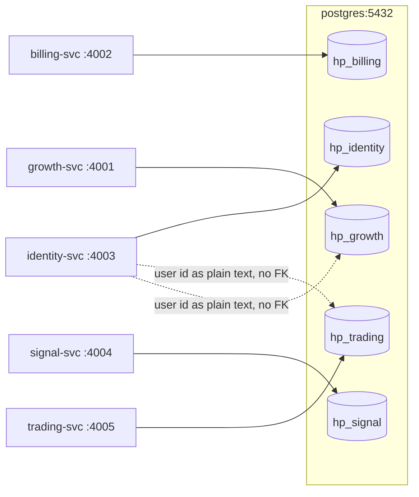
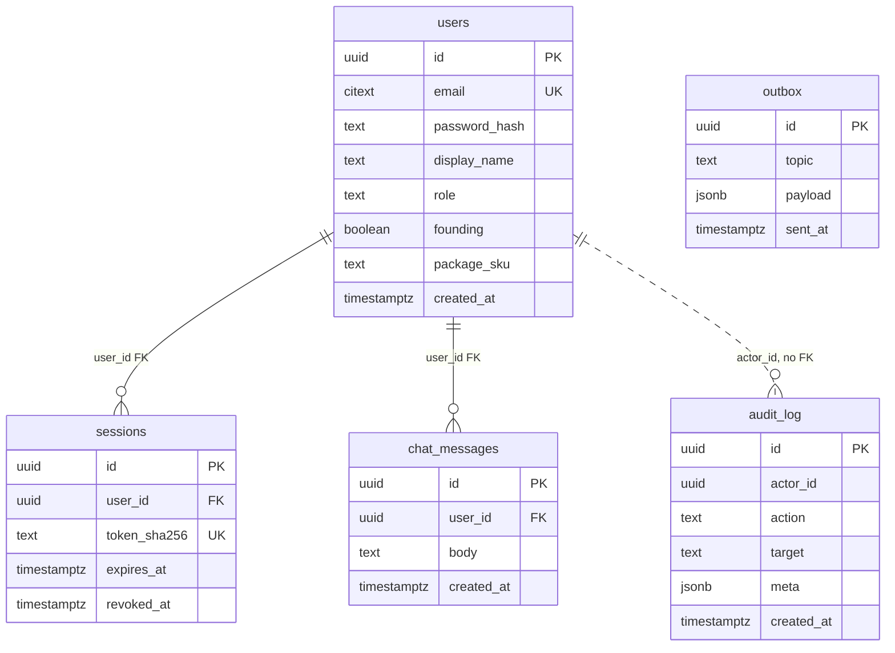
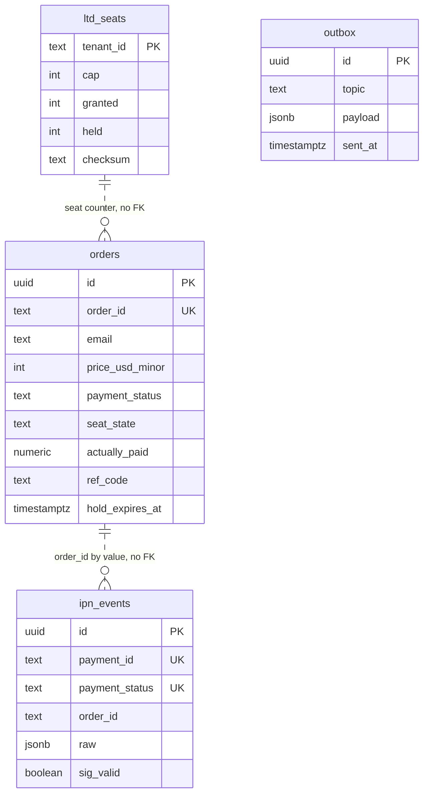
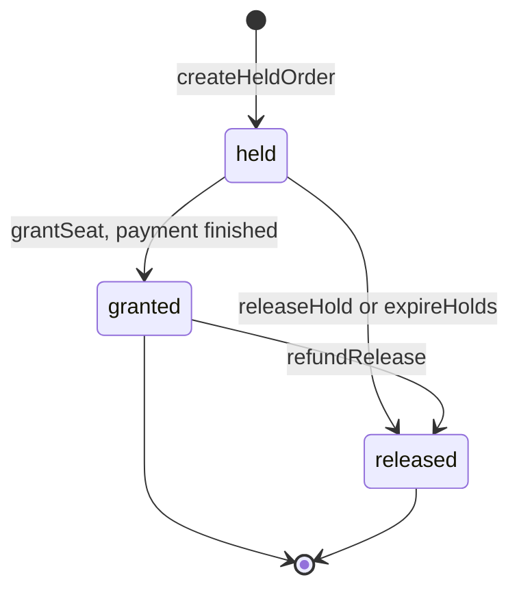
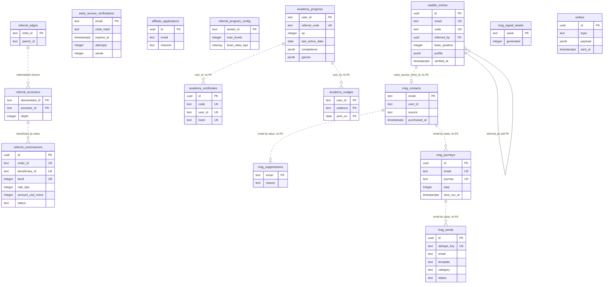
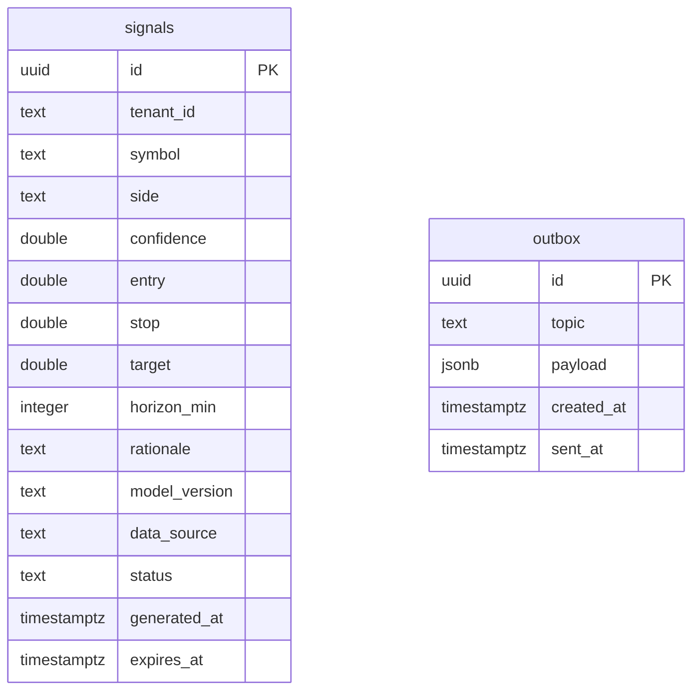
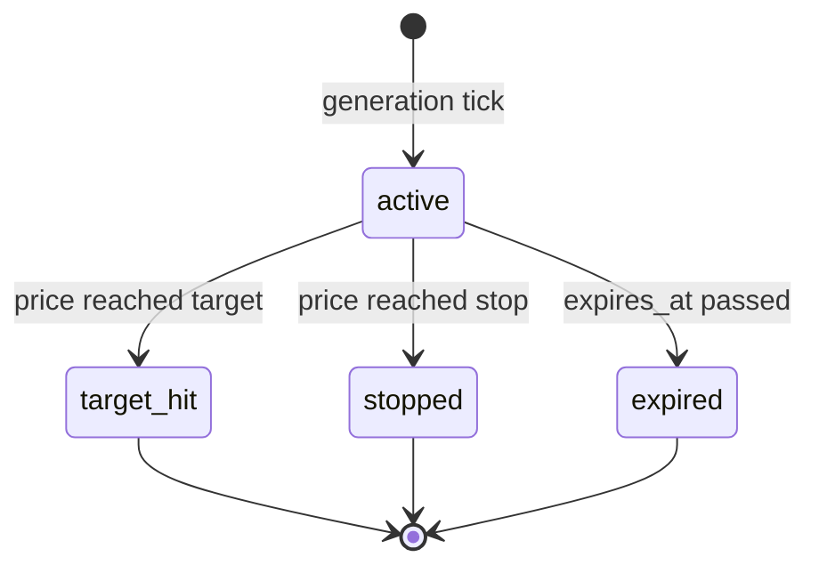
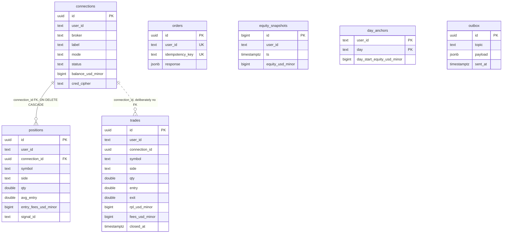

# Data model

This is the authoritative reference for every table HeroPips persists: five
Postgres databases, 34 tables, every index and the query it serves, every
constraint and the invariant it protects, and the code path that writes each
row. It also covers the money/precision rules, the shared outbox pattern, the
migration system and the retention story. Read it when you need to know what a
column means, whether a query is indexed, or what breaks if you drop a
constraint. Cross-service call sequences live in [flows](./03-flows.md),
per-service internals in [features](./04-features/README.md), HTTP shapes in the
[API reference](./05-api-reference.md).

---

## 1. Storage topology

Five logical databases on one Postgres 16 cluster, one per service, created by
`infra/sql/000_databases.sql:18-27`:

| Service | Database | Tables |
|---|---|---|
| identity-svc | `hp_identity` | `users`, `sessions`, `audit_log`, `chat_messages`, `outbox` |
| billing-svc | `hp_billing` | `ltd_seats`, `orders`, `ipn_events`, `outbox` |
| growth-svc | `hp_growth` | 15 domain tables across 4 bounded contexts + `outbox` |
| signal-svc | `hp_signal` | `signals`, `outbox` |
| trading-svc | `hp_trading` | `connections`, `positions`, `trades`, `orders`, `equity_snapshots`, `day_anchors`, `outbox` |

Each service connects only to its own database. There are no cross-database
joins, no shared tables, no foreign data wrappers
(`infra/sql/000_databases.sql:5-6`). Services integrate over Kafka (through the
outbox, section 3) and internal HTTP.



### User ids cross boundaries as untyped text

`hp_identity.users.id` is a `uuid`. Everywhere else the same value is stored as
plain `text` with no referential integrity:

| Column | Type | Points at |
|---|---|---|
| `hp_trading.connections.user_id` | `text` | `hp_identity.users.id` |
| `hp_trading.positions.user_id` / `trades.user_id` / `equity_snapshots.user_id` / `day_anchors.user_id` / `orders.user_id` | `text` | same |
| `hp_growth.academy_progress.user_id` and `.referred_by` | `text` | same |
| `hp_growth.academy_certificates.user_id`, `academy_nudges.user_id` | `text` | same |
| `hp_growth.referral_edges.child_id` / `.parent_id`, `referral_ancestors.*_id`, `referral_commissions.beneficiary_id` | `text` | same |
| `hp_growth.msg_contacts.user_id` | `text` | same |
| `hp_billing.orders.email` | `text` | matches `users.email` by value only |

`connections.user_id` is explicitly documented as "no FK across service
databases" (`infra/sql/trading/0001_init.sql:40`).

Consequences you must design around:

- **No referential integrity.** Nothing stops a `connections` row from
  referencing a user id that never existed, or that was deleted. Validity is
  enforced only at write time, by trading-svc introspecting the session against
  identity-svc (`apps/services/trading/src/auth/introspect.ts:25-29`).
- **No cascading delete.** Deleting a user in `hp_identity` orphans their rows
  in `hp_growth` and `hp_trading` silently. There is no user-deletion endpoint
  and no cross-service tombstone event today, so "delete my account" is an
  unimplemented, five-database manual operation. `ON DELETE CASCADE` exists in
  exactly one place — `positions.connection_id → connections.id`
  (`apps/services/trading/src/db/migrate.ts:24`) — and that is intra-database.
- **No cross-database transaction.** A state change that spans services is
  eventually consistent by construction: each side commits locally and emits an
  event through its own outbox. The window between the two commits is real and
  observable.
- **No join.** Anything that needs identity attributes next to trading rows must
  fetch them over HTTP or denormalise them. `academy_progress` denormalises
  `email` and `display_name` for exactly this reason
  (`apps/services/growth/src/db/migrate.ts:103-104`), and `msg_contacts` is a
  full projection of identity/billing/academy facts keyed by email
  (`apps/services/growth/src/db/migrate.ts:149-164`).

---

## 2. Money and precision

The rule, stated once for the whole platform: **monetary amounts are integers in
minor units (US cents). Prices and quantities are `double precision`.**

| Kind | Storage | Example |
|---|---|---|
| Ledger amount | `bigint` / `integer`, cents | `trades.rpl_usd_minor`, `connections.balance_usd_minor`, `referral_commissions.amount_usd_minor`, `orders.price_usd_minor` |
| Market price | `double precision` | `signals.entry`, `positions.avg_entry`, `trades.exit` |
| Quantity | `double precision` | `positions.qty`, `trades.qty` |
| Provider-reported crypto amount | `numeric` | `orders.actually_paid` |
| Model score | `double precision` | `signals.confidence` |

Why doubles are allowed where they are: prices and quantities are *market data*,
not ledger entries. They are inputs to a calculation, never a balance. Every
amount derived from them is converted to cents before it is persisted, and that
conversion is the only place rounding happens
(`infra/sql/trading/0001_init.sql:7-12`). A float in a `*_usd_minor` column is a
bug.

`orders.actually_paid` is `numeric`, not `double precision`, because it is a
crypto amount reported by NOWPayments for underpayment reconciliation and must
not lose precision in transit (`infra/sql/billing/0001_init.sql:65`). The repo
converts it to a JS number only at the read boundary
(`apps/services/billing/src/db/repo.ts:142`).

### Rounding behaviour

All defined in `apps/services/trading/src/pnl/engine.ts`:

| Function | Rule | Line |
|---|---|---|
| `roundMoney(x)` | half-away-from-zero: `Math.round(abs(x))`, sign restored | `:47-50` |
| `roundQty(q)` | quantise to 1e-8 | `:53-55` |
| `notionalUsdMinor` | `roundMoney(notional_usd × 100)`; `base_is_usd` symbols skip the price factor | `:120-124` |
| `feeUsdMinor` | `max(1, roundMoney(notional_minor × FEE_BPS/10000))`, `FEE_BPS = 8` — a 1¢ floor, so a fee never rounds to zero | `:38-39`, `:127-129` |
| `uplUsdMinor` | `roundMoney(qty × (mark − avg_entry) × contract_size × dir × usd_per_quote × 100)` | `:137-141` |
| `sizeByRisk` | `floor(risk_usd / per_unit / step + 1e-6)`, `step = 10^-precision`; floors so risk is never exceeded, the 1e-6 nudge absorbs float slack | `:154-171` |

The non-obvious part is **fee carry**. An opening fill does not charge its fee
to the balance; the fee is carried on the position in `entry_fees_usd_minor` and
consumed pro-rata as the position is reduced
(`apps/services/trading/src/pnl/engine.ts:22-25`, `:226-228`). The final close
takes the *exact remainder* rather than a pro-rata share (`:226-227`), which is
what makes `Σ trades.rpl_usd_minor == Σ balance deltas` exact to the cent with
no residue. Drop that special case and partial closes leak cents.

Growth's commission maths **floors** rather than rounds:
`amount = floor(total_usd_minor × rate_bps / 10000)`
(`apps/services/growth/src/referrals/referrals.service.ts:124`), and a
zero-amount level is skipped entirely (`:125`). The house keeps the fraction.

`referral_commissions.amount_usd_minor` is `integer`, not `bigint`
(`apps/services/growth/src/db/migrate.ts:92`) — fine for a $499 order.
`hp_billing.orders.price_usd_minor` is also `integer`
(`apps/services/billing/src/db/migrate.ts:18`). Every money column in
`hp_trading` is `bigint`.

**Correction to a stale comment.** `infra/sql/billing/0001_init.sql:62` says
"the seat ladder may have moved on since". There is no seat-price ladder. The
Founding Hero lifetime deal is a flat **$499** (`LTD.PRICE_USD_DEFAULT`,
`packages/contracts/src/index.ts:292`). `price_usd_minor` still exists as a
locked-in per-order price, which is the right design, but nothing in the
codebase varies it by seat count. The only ladder in billing is
`PAYMENT_STATUS_RANK`.

---

## 3. The `outbox` table

Every service has an identical `outbox` table. This is the single place it is
described; everything else links here.

```sql
CREATE TABLE outbox (
  id         uuid PRIMARY KEY,        -- gen_random_uuid() default in growth/signal/trading
  topic      text NOT NULL,           -- Kafka topic, from TOPICS in packages/contracts
  payload    jsonb NOT NULL,          -- the full EventEnvelope
  created_at timestamptz NOT NULL DEFAULT now(),
  sent_at    timestamptz              -- NULL until the relay has published it
);
CREATE INDEX outbox_unsent_idx ON outbox (created_at) WHERE sent_at IS NULL;
```

**Purpose.** A domain write and the event announcing it commit in one
transaction. Without this, a crash between "row written" and "event published"
either loses the event or publishes an event for a row that was rolled back.

**The index.** `outbox_unsent_idx` is partial: the relay's only query is
`WHERE sent_at IS NULL ORDER BY created_at ASC LIMIT 100`, so the index contains
only the backlog and stays small no matter how many million rows have already
been sent. A plain index on `created_at` would grow forever and be useless.

**The relay.** A 2-second polling loop per service. Growth, signal and trading
query Drizzle directly (`apps/services/growth/src/outbox/relay.ts:60-104`,
`apps/services/signal/src/outbox/relay.ts:60-68`,
`apps/services/trading/src/outbox/relay.ts:60-68`); identity and billing go
through `repo.fetchUnsentOutbox(100)` / `markOutboxSent`
(`apps/services/identity/src/outbox/relay.ts:43`,
`apps/services/billing/src/outbox/relay.ts:43`,
`apps/services/identity/src/db/repo.ts:256-269`,
`apps/services/billing/src/db/repo.ts:276-289`). Both shapes batch by topic,
publish with an idempotent producer, then stamp `sent_at` — so delivery is
**at-least-once**: a crash between `producer.send` and the `UPDATE` republishes
the batch. Every consumer must be idempotent; that is why the dedupe keys in
section 9 exist. Kafka being unreachable degrades to a throttled warning and the
loop retries forever (`apps/services/growth/src/outbox/relay.ts:95-103`).

**Row id semantics differ per service, deliberately:**

| Service | `outbox.id` source | Note |
|---|---|---|
| identity | `envelope.event_id` (`apps/services/identity/src/db/repo.ts:200`) | outbox id *is* the event id |
| billing | `randomUUID()` (`apps/services/billing/src/db/repo.ts:169`) | DDL has no column default; the app must supply it |
| growth, signal, trading | `gen_random_uuid()` column default | the app never sets it |

The relay uses `row.id` as the Kafka message key
(`apps/services/growth/src/outbox/relay.ts:88`), so identity's events are keyed
by event id and the rest by an unrelated row id. Partition affinity is therefore
effectively random on all six topics.

**The exception that matters.** signal-svc writes the signal row and the outbox
row as two separate statements with **no transaction**
(`apps/services/signal/src/signals/signals.service.ts:95-99` and `:119-123`;
`SignalRepo` has no `tx` seam at all,
`apps/services/signal/src/signals/signals.repo.ts:28-36`). A crash between them
produces a signal nobody was told about, or a resolution event for a signal
still marked active. The comment at `infra/sql/signal/0001_init.sql:65` ("A
signal row and its published event share one transaction") is **wrong** — see
[gaps](#12-gaps-bugs-and-hazards).

---

## 4. `hp_identity`



### `users`

Platform accounts. Provisioned only through `POST /v1/auth/redeem`; there is no
open self-serve registration (`infra/sql/identity/0001_init.sql:21-22`).

| Column | Type | Meaning |
|---|---|---|
| `id` | `uuid` PK | account id; this value is what leaves the service as plain text everywhere else |
| `email` | `citext UNIQUE NOT NULL` | login identity. `citext` makes the UNIQUE case-insensitive without `lower()` wrappers; callers still normalise at the zod boundary |
| `password_hash` | `text NOT NULL` | scrypt digest `scrypt$32768$8$1$<b64 salt>$<b64 key>` — see [security](./06-security.md) |
| `display_name` | `text NOT NULL` | shown in chat and on the leaderboard |
| `role` | `text NOT NULL DEFAULT 'member'` | `CHECK (role IN ('member','admin'))` |
| `founding` | `boolean NOT NULL DEFAULT false` | lifetime-deal buyer; gates the founding lounge |
| `package_sku` | `text NOT NULL DEFAULT 'ltd_founding'` | entitlement SKU carried onto the session, surfaced by `GET /v1/me` |
| `created_at` | `timestamptz NOT NULL DEFAULT now()` | |

**Indexes.** PK on `id` (point lookup,
`apps/services/identity/src/db/repo.ts:134`); UNIQUE on `email` (login lookup,
`:129`, and the conflict target for idempotent provisioning).

**Constraints.** The `role` CHECK bounds the privilege enum at the storage
layer, so a service bug cannot invent a third role. `email` UNIQUE is the
duplicate-account guard.

**Write path.** `PgIdentityRepo.createUser`
(`apps/services/identity/src/db/repo.ts:98-114`) —
`INSERT … ON CONFLICT (email) DO NOTHING RETURNING id`; zero rows back means
`duplicate_email`. `setDisplayName` (`:139-141`) and `setPasswordHash`
(`:143-145`) are bare UPDATEs, no transaction.

### `sessions`

Server-side session store. Only `sha256(token)` is persisted, so a database dump
yields no usable credentials (`infra/sql/identity/0001_init.sql:42-43`).

| Column | Type | Meaning |
|---|---|---|
| `id` | `uuid` PK | session id, used for targeted revoke |
| `user_id` | `uuid NOT NULL REFERENCES users(id)` | owner |
| `token_sha256` | `text UNIQUE NOT NULL` | SHA-256 of the opaque bearer token; the plaintext exists only in the `__Host-hp_session` cookie |
| `created_at` | `timestamptz NOT NULL` | issue time |
| `last_seen_at` | `timestamptz NOT NULL` | sliding-renewal marker, throttled to 60s |
| `expires_at` | `timestamptz NOT NULL` | TTL 30 days |
| `ip` | `text` | captured at issue |
| `user_agent` | `text` | captured at issue |
| `revoked_at` | `timestamptz` | non-NULL = logged out or remotely revoked |

**Indexes.** PK on `id`; UNIQUE on `token_sha256` — the hot path, since every
authenticated request resolves a session by token hash
(`apps/services/identity/src/db/repo.ts:151-161`, joined to `users`);
`sessions_user_id_idx (user_id)` — serves the "my devices" list (`:167-173`,
`WHERE user_id = ? AND revoked_at IS NULL AND expires_at > now()`) and bulk
revoke on password change (`:184-193`).

**Invariant.** A session is valid only when
`revoked_at IS NULL AND expires_at > now()`. That is enforced in the query, not
by a constraint.

**Write path.** `createSession` (`:147-149`), `touchSession` (`:163-165`),
`revokeSession` (`:175-182`, conditional on `revoked_at IS NULL` so a double
revoke returns false), `revokeOtherSessions` (`:184-193`). None transactional —
each is a single statement.

### `audit_log`

Append-only security trail, surfaced at `GET /v1/me/audit`.

| Column | Type | Meaning |
|---|---|---|
| `id` | `uuid` PK | |
| `actor_id` | `uuid NOT NULL` | who did it. **No FK** to `users`, despite being in the same database |
| `action` | `text NOT NULL` | event name |
| `target` | `text` | optional subject of the action |
| `meta` | `jsonb` | free-form detail |
| `created_at` | `timestamptz NOT NULL` | supplied by the caller, not defaulted |

**Index.** `audit_log_actor_idx (actor_id, created_at DESC, id DESC)` — the
column order is exactly the keyset pagination cursor in
`apps/services/identity/src/common/cursor.ts`, so `listAudit`
(`apps/services/identity/src/db/repo.ts:206-227`) reads the page straight off
the index with no sort node.

**Write path.** `insertAudit` (`:195-204`) — the audit row **and** its outbox
rows in one transaction. Never updated, never deleted.

### `chat_messages`

Founding-lounge history. One global room; there is deliberately no `room_id`
(`infra/sql/identity/0001_init.sql:91`). The WebSocket gateway broadcasts live;
this table is the replayable backlog.

| Column | Type | Meaning |
|---|---|---|
| `id` | `uuid` PK | |
| `user_id` | `uuid NOT NULL REFERENCES users(id)` | author |
| `body` | `text NOT NULL` | max 2000 chars, enforced by zod (`packages/contracts/src/index.ts:626`), not by the column |
| `created_at` | `timestamptz NOT NULL` | |

**Index.** `chat_messages_created_idx (created_at DESC, id DESC)` — newest-first
keyset pagination for `GET /v1/chat/history`
(`apps/services/identity/src/db/repo.ts:233-254`, which joins `users` for the
display name).

**Write path.** `insertChatMessage` (`:229-231`), single statement, no outbox.

### `outbox`

See [section 3](#3-the-outbox-table). Identity's `id` column has no default; the
repo supplies `envelope.event_id`.

---

## 5. `hp_billing`



### `ltd_seats`

A single row (`tenant_id = 'heropips'`) that is the serialization point for the
entire seat-allocation flow.

| Column | Type | Meaning |
|---|---|---|
| `tenant_id` | `text` PK DEFAULT `'heropips'` | |
| `cap` | `int NOT NULL` | total seats for sale; seeded from `LTD_SEAT_CAP` (default 500) on first boot |
| `granted` | `int NOT NULL DEFAULT 0` | seats permanently allocated to a paid order |
| `held` | `int NOT NULL DEFAULT 0` | seats reserved by an in-flight checkout |
| `checksum` | `text` | intended as a tamper-evidence digest — **never written by any code** (see gaps) |

**Index.** PK only. One row; nothing else is needed.

**The oversell guard is a conditional UPDATE, not a lock.** Every hold goes
through `UPDATE ltd_seats SET held = held + 1 WHERE tenant_id = $1 AND granted +
held < cap RETURNING cap` (`apps/services/billing/src/db/repo.ts:108-112`).
Postgres row-level locking serialises concurrent updaters on that single row and
the predicate re-evaluates after the lock is taken, so zero rows returned means
sold out. That is the whole concurrency story — there is no advisory lock and no
`SELECT … FOR UPDATE`.

**Write path.** Seeded at boot
(`apps/services/billing/src/db/migrate.ts:57-61`,
`INSERT … ON CONFLICT DO NOTHING`) and mirrored in SQL
(`infra/sql/billing/0001_init.sql:117-119`). Mutated only inside transactions:

| Operation | Delta | Code |
|---|---|---|
| `createHeldOrder` | `held + 1` (conditional) | `apps/services/billing/src/db/repo.ts:108-112` |
| `grantSeat` | `held − 1, granted + 1` | `:188-191` |
| `releaseHold` | `held − 1` | `:205-208` |
| `refundRelease` | `granted − 1` | `:222-225` |
| `expireHolds` | `held − N` | `:261-264` |

### `orders`

One row per checkout attempt. Two independent state machines share the row:
`payment_status` is NOWPayments' view, `seat_state` is ours. **Only `seat_state`
is authoritative for access** (`infra/sql/billing/0001_init.sql:34-38`).

| Column | Type | Meaning |
|---|---|---|
| `id` | `uuid` PK | internal id, never exposed |
| `order_id` | `text UNIQUE NOT NULL` | public, user-facing identifier; every lookup uses this |
| `tenant_id` | `text NOT NULL DEFAULT 'heropips'` | |
| `email` | `text NOT NULL` | buyer; the value that later matches `users.email` |
| `sku` | `text NOT NULL DEFAULT 'ltd_founding'` | |
| `price_usd_minor` | `int NOT NULL` | price locked at checkout, in cents |
| `payment_status` | `text NOT NULL DEFAULT 'waiting'` | verbatim provider status. **No CHECK** — untrusted input that only ever arrives on a signature-verified IPN |
| `seat_state` | `text NOT NULL DEFAULT 'held'` | `CHECK IN ('held','granted','released')` |
| `invoice_id`, `invoice_url` | `text` | NOWPayments invoice handles |
| `purchase_id` | `text` | provider purchase id from the IPN |
| `pay_currency` | `text` | crypto the buyer chose |
| `actually_paid` | `numeric` | amount actually received, for underpayment reconciliation |
| `ref_code` | `text` | referral code captured at checkout, replayed to growth-svc on grant |
| `hold_expires_at` | `timestamptz NOT NULL` | now + `HOLD_TTL_MINUTES` (120) |
| `created_at`, `updated_at` | `timestamptz NOT NULL DEFAULT now()` | |



**Indexes.**
- PK on `id`.
- `UNIQUE (order_id)` — every read and every state transition filters on it
  (`apps/services/billing/src/db/repo.ts:129`, `:154`, `:175`, `:185`, `:202`,
  `:219`).
- `orders_hold_expiry_idx (hold_expires_at) WHERE seat_state = 'held'` —
  partial, and it drives exactly one query: the holds sweeper (`:247-274`,
  `WHERE seat_state='held' AND hold_expires_at < now AND payment_status <>
  'finished'`), run on a timer by
  `apps/services/billing/src/founding/holds.job.ts:13`. Because the index
  predicate matches the query predicate, the index only ever contains live
  checkouts, so sweeper cost is bounded by concurrent traffic rather than
  lifetime order count.

**Constraints.** The `seat_state` CHECK is the entitlement guard: no state
outside the three is representable. Every transition is additionally guarded by
a `WHERE seat_state = <expected>` predicate so a concurrent transition returns
false instead of double-counting seats
(`apps/services/billing/src/db/repo.ts:185`, `:202`, `:219`).

**Write path.** All in transactions: `createHeldOrder` (`:106-126`, seat
increment + order insert + outbox), `updatePayment` (`:173-178`), `grantSeat`
(`:180-195`), `releaseHold` (`:197-212`), `refundRelease` (`:214-229`),
`expireHolds` (`:247-274`). `setInvoice` (`:150-155`) is the one bare UPDATE.

### `ipn_events`

Every inbound NOWPayments callback, signature-valid or not, written **before**
any state transition so the log is complete even for rejected payloads.

| Column | Type | Meaning |
|---|---|---|
| `id` | `uuid` PK | |
| `payment_id` | `text` | provider payment id, nullable because a hostile payload may omit it |
| `payment_status` | `text` | provider status in this callback |
| `order_id` | `text` | our order id as claimed by the payload |
| `raw` | `jsonb NOT NULL` | untouched provider body, stored before validation |
| `sig_valid` | `boolean` | HMAC-SHA512 verification result; `false` rows are recorded then ignored |
| `received_at` | `timestamptz NOT NULL DEFAULT now()` | |

**Indexes.** PK on `id`; the implicit index behind
`UNIQUE (payment_id, payment_status)`. Nothing else — and nothing needs it,
because the application never reads this table.

**Constraint.** `UNIQUE (payment_id, payment_status)` is the replay defence. The
provider retries callbacks, and `(payment_id, payment_status)` is the natural
idempotency key: the same payment reaching the same status twice is a retry, not
news.

**Write path.** `insertIpnEvent`
(`apps/services/billing/src/db/repo.ts:231-245`) —
`INSERT … ON CONFLICT (payment_id, payment_status) DO NOTHING RETURNING id`.
Returns `false` on a replay and the IPN handler stops there. This INSERT is
deliberately **not** in the order-transition transaction: the forensic record
must survive even if the transition aborts.

### `outbox`

See [section 3](#3-the-outbox-table). Billing's `id` has no column default; the
repo supplies `randomUUID()`.

---

## 6. `hp_growth`

Four bounded contexts share one database, separated by table prefix and never
joined across a context boundary — with two exceptions in the messaging read
path, noted in section 6.4 (`infra/sql/growth/0001_init.sql:7-12`).



### 6.1 Early access

#### `waitlist_entries`

Verified early-access signups. **The physical name is legacy** — the Drizzle
model calls it `earlyAccessEntries`
(`apps/services/growth/src/db/schema.ts:21`) and the rename is deferred because
it needs a data migration plus a coordinated deploy
(`infra/sql/growth/0001_init.sql:28-30`). A row exists only once the address has
passed code verification; unverified attempts live in
`early_access_verifications`.

| Column | Type | Meaning |
|---|---|---|
| `id` | `uuid` PK DEFAULT `gen_random_uuid()` | |
| `tenant_id` | `text NOT NULL DEFAULT 'heropips'` | |
| `email` | `text NOT NULL` | plain text; uniqueness is enforced on `lower(email)` |
| `code` | `text NOT NULL` | this entry's own public share code, used in `?ref=` links |
| `referred_by` | `uuid REFERENCES waitlist_entries(id)` | self-FK to the entry whose code was used; NULL for organic signups |
| `base_position` | `integer NOT NULL` | queue position at signup, before referral boosts. The displayed position is derived, never stored |
| `utm` | `jsonb` | campaign attribution captured at signup |
| `profile` | `jsonb` | self-declared trader profile, captured after verification |
| `verified_at` | `timestamptz` | set when the 6-digit code was accepted; in practice every row has one |
| `created_at` | `timestamptz NOT NULL DEFAULT now()` | |

Displayed position is `max(1, base_position − floor(referrals/3) × 25)`
(`apps/services/growth/src/common/position.ts:4-11`).

**Indexes.**
- PK on `id` — `findEarlyAccessEntry`
  (`apps/services/growth/src/messaging/messaging.repo.ts:401-413`).
- `waitlist_entries_email_lower_uq` UNIQUE on `lower(email)` — case-insensitive
  duplicate guard on a plain `text` column, and it is what makes
  `findByEmailOn`'s `WHERE lower(email) = ?` an index lookup
  (`apps/services/growth/src/early-access/early-access.repo.ts:86-93`). This is
  why the service lowercases at the zod boundary.
- `waitlist_entries_code_uq` UNIQUE on `code` — guarantees share codes are
  globally unique. It does **not** serve the code lookup, which uses
  `WHERE upper(code) = ?`
  (`apps/services/growth/src/early-access/early-access.repo.ts:116-123`) — see
  gaps.
- `waitlist_entries_referred_by_idx (referred_by)` — `countReferrals`
  (`apps/services/growth/src/early-access/early-access.repo.ts:100-106`,
  `WHERE referred_by = ?`), used on every status read to compute queue jumps.

**Constraints.** The self-FK on `referred_by` is the only real FK in this
database; it makes a dangling referrer impossible.

**Write path.** `joinTx`
(`apps/services/growth/src/early-access/early-access.repo.ts:111-153`) wraps the
whole join in a transaction that first takes `pg_advisory_xact_lock(42)`
(`:113`), so position assignment is globally serialised — two simultaneous
signups cannot be handed the same `base_position`. Inside that lock:
`countEntries` → `insertEntry` (`:126-140`) → `insertOutbox` (`:147-149`).
`updateProfile` (`:141-146`) also runs inside it.

**Forward-compat DDL.** `profile` and `verified_at` are added with
`ALTER TABLE … ADD COLUMN IF NOT EXISTS`
(`apps/services/growth/src/db/migrate.ts:22-24`,
`infra/sql/growth/0001_init.sql:49-50`) so a database created by an older build
converges to the current shape on the next boot.

#### `early_access_verifications`

Pending email verifications. Transient by design: one row per address, replaced
wholesale on every resend, so there is never a set of simultaneously valid codes.

| Column | Type | Meaning |
|---|---|---|
| `email` | `text` PK | lowercased address; the PK *is* the "one live code per address" rule |
| `code_hash` | `text NOT NULL` | HMAC of the 6-digit code. The plaintext exists only in the outbound email |
| `expires_at` | `timestamptz NOT NULL` | now + `EA_CODE_TTL_SEC` (900s) |
| `attempts` | `integer NOT NULL DEFAULT 0` | failed verification attempts; bounded so brute-forcing a 6-digit code is useless |
| `sends` | `integer NOT NULL DEFAULT 1` | resend counter, paired with `last_sent_at` for throttling — caps email-bombing a third party's inbox |
| `last_sent_at` | `timestamptz NOT NULL DEFAULT now()` | 30s per-address resend gate |
| `created_at` | `timestamptz NOT NULL DEFAULT now()` | |

**Indexes.** PK on `email` — every access is a point lookup
(`apps/services/growth/src/early-access/early-access.repo.ts:175-182`,
`:209-216`, `:218-222`). `early_access_verifications_expires_idx (expires_at)`
exists but **serves no query in the codebase** (see gaps).

**Write path.** `issueVerification` (`:184-207`) —
`INSERT … ON CONFLICT (email) DO UPDATE` that replaces `code_hash`/`expires_at`,
resets `attempts` to 0 and increments `sends`. `bumpVerificationAttempts`
(`:209-216`). `clearVerification` (`:218-222`) DELETEs the row on success or on
expiry detection
(`apps/services/growth/src/early-access/early-access.service.ts:169-171`). None
transactional.

#### `affiliate_applications`

Inbound partner applications. Intake only — approval happens out of band and
grants no automatic entitlement (`infra/sql/growth/0001_init.sql:94`).

| Column | Type | Meaning |
|---|---|---|
| `id` | `uuid` PK DEFAULT `gen_random_uuid()` | |
| `tenant_id` | `text NOT NULL DEFAULT 'heropips'` | |
| `name` | `text NOT NULL` | applicant |
| `email` | `text NOT NULL` | not unique — an applicant may apply twice |
| `channel` | `text NOT NULL` | where they publish |
| `audience_size` | `text NOT NULL` | free-text bucket, not a number |
| `geo` | `text NOT NULL` | |
| `note` | `text` | |
| `created_at` | `timestamptz NOT NULL DEFAULT now()` | |

**Indexes.** PK only. There is no read path in the service at all — rows are
inspected manually.

**Constraints.** None beyond NOT NULL.

### 6.2 Referrals (the MLM closure tree)

This is a separate system from waitlist referrals. Waitlist referrals are
single-level, keyed by `waitlist_entries.id`, and move a queue position. The
closure tree is up to 10 levels, keyed by identity user ids, and pays money. The
two are **not connected**.

#### `referral_program_config`

Payout rates are data, not code, so the ladder changes without a deploy.

| Column | Type | Meaning |
|---|---|---|
| `tenant_id` | `text` PK DEFAULT `'heropips'` | |
| `max_levels` | `integer NOT NULL DEFAULT 5` | `CHECK (max_levels BETWEEN 1 AND 10)` |
| `level_rates_bps` | `integer[] NOT NULL DEFAULT '{2000,1000,500,300,200}'` | basis points per level, index 0 = level 1 → 20/10/5/3/2 % |
| `updated_at` | `timestamptz NOT NULL DEFAULT now()` | |

**Indexes.** PK only; one row.

**Constraints.** The `max_levels` CHECK mirrors the depth cap on
`referral_ancestors`; the two must agree or the closure table would hold rows
the payout query can never reach. `patchConfig` adds two more rules in code, not
in the schema: `length(level_rates_bps) == max_levels`, and
`sum(level_rates_bps) ≤ 5000` (50 %)
(`apps/services/growth/src/referrals/referrals.service.ts:89-99`).

**Write path.** Seeded by `INSERT … ON CONFLICT DO NOTHING` in the boot DDL
(`apps/services/growth/src/db/migrate.ts:67`) and the SQL file
(`infra/sql/growth/0001_init.sql:124`). Updated by `updateConfig` inside the
referral transaction
(`apps/services/growth/src/referrals/referrals.repo.ts:103-116`). Changing it
affects **future accruals only** — historical commissions keep their recorded
`rate_bps`.

#### `referral_edges`

The direct parent of each user. One referrer, forever.

| Column | Type | Meaning |
|---|---|---|
| `child_id` | `text` PK | the referred user; PK means re-attribution is impossible |
| `parent_id` | `text NOT NULL` | the referrer |
| `created_at` | `timestamptz NOT NULL DEFAULT now()` | |

**Indexes.** PK on `child_id` — `hasEdge`
(`apps/services/growth/src/referrals/referrals.repo.ts:117-124`).
`referral_edges_parent_idx (parent_id)` exists but **serves no query** (gaps).

**Constraints.** `CHECK (child_id <> parent_id)` blocks the trivial
self-referral. Longer cycles are not representable in SQL and are blocked in the
service by an `isAncestor(childId, parentId)` probe before insert
(`apps/services/growth/src/referrals/referrals.service.ts:41-43`).

**Write path.** `insertEdge`
(`apps/services/growth/src/referrals/referrals.repo.ts:154-156`), always inside
the `link` transaction alongside the closure rows
(`apps/services/growth/src/referrals/referrals.service.ts:36-64`).

#### `referral_ancestors`

Materialised closure table. Every `(descendant, ancestor, depth)` pair is stored
so commission fan-out on the payment path is one indexed read, not a recursive
CTE.

| Column | Type | Meaning |
|---|---|---|
| `descendant_id` | `text NOT NULL` | part of PK |
| `ancestor_id` | `text NOT NULL` | part of PK |
| `depth` | `integer NOT NULL` | `CHECK (depth BETWEEN 1 AND 10)`; 1 = direct referrer |

**Primary key** `(descendant_id, ancestor_id)` — a pair can exist at only one
depth, which is what makes `insertAncestors`' `ON CONFLICT DO NOTHING`
(`apps/services/growth/src/referrals/referrals.repo.ts:157-165`) a safe
idempotent re-link.

**Indexes.**
- PK `(descendant_id, ancestor_id)` — the `isAncestor` cycle probe
  (`apps/services/growth/src/referrals/referrals.repo.ts:125-137`).
- `referral_ancestors_desc_depth_idx (descendant_id, depth)` — the payout query:
  `WHERE descendant_id = ? AND depth <= ? ORDER BY depth ASC` (`:138-148`).
  Index order matches both the filter and the sort, so no sort node.
- `referral_ancestors_ancestor_idx (ancestor_id)` — the reverse direction,
  `descendantsOf` (`:149-153`), used when a parent is linked *after* their
  subtree already exists and the closure must be back-filled
  (`apps/services/growth/src/referrals/referrals.service.ts:50-60`).

**Constraint.** The depth CHECK hard-caps fan-out at 10 so a pathological chain
cannot explode the cross-product written on each `link`.

**Write path.** `insertAncestors`
(`apps/services/growth/src/referrals/referrals.repo.ts:157-165`) inside the
`link` transaction. The rows written are the cross-product `members × gained`
filtered to `depth ≤ 10`
(`apps/services/growth/src/referrals/referrals.service.ts:52-60`).

#### `referral_commissions`

The accrual ledger, in cents.

| Column | Type | Meaning |
|---|---|---|
| `id` | `uuid` PK DEFAULT `gen_random_uuid()` | |
| `order_id` | `text NOT NULL` | billing's public order id, by value |
| `beneficiary_id` | `text NOT NULL` | the ancestor being paid |
| `level` | `integer NOT NULL` | equals the ancestor's `depth` |
| `rate_bps` | `integer NOT NULL` | rate captured **at accrual time**, so a later config change cannot retroactively rewrite a payout |
| `amount_usd_minor` | `integer NOT NULL` | `floor(total × rate_bps / 10000)` |
| `status` | `text NOT NULL DEFAULT 'accrued'` | `CHECK IN ('accrued','reversed')` |
| `created_at` | `timestamptz NOT NULL DEFAULT now()` | |

**Indexes.**
- PK on `id`.
- `UNIQUE (order_id, beneficiary_id, level)` — the idempotency key; its index
  also covers any `order_id` prefix scan.
- `referral_commissions_order_idx (order_id)` — `reverseCommissions`
  (`apps/services/growth/src/referrals/referrals.repo.ts:180-192`,
  `WHERE order_id = ? AND status = 'accrued'`). Redundant with the UNIQUE
  index's leading column (gaps).
- `referral_commissions_beneficiary_idx (beneficiary_id)` — serves no query
  today (gaps).

**Constraints.** The UNIQUE triple is what makes at-least-once payment delivery
safe: `insertCommission` uses `ON CONFLICT … DO NOTHING RETURNING id`
(`apps/services/growth/src/referrals/referrals.repo.ts:166-179`) and only emits
a `referral.commission.accrued` event when a row was actually inserted
(`apps/services/growth/src/referrals/referrals.service.ts:134-145`). The
`status` CHECK keeps a reversal from becoming a delete — refunds mark
`reversed`, the original accrual row is never removed.

**Write path.** `attribute`
(`apps/services/growth/src/referrals/referrals.service.ts:111-156`) and
`reverse` (`:159-173`), both inside `repo.tx` alongside their outbox rows.

### 6.3 Academy

#### `academy_progress`

One row per learner. Server-authoritative: the browser proposes activity, the
server decides XP.

| Column | Type | Meaning |
|---|---|---|
| `user_id` | `text` PK | identity user id |
| `tenant_id` | `text NOT NULL DEFAULT 'heropips'` | |
| `email` | `text NOT NULL` | denormalised from identity — no cross-DB join is possible |
| `display_name` | `text NOT NULL` | denormalised; shown on the leaderboard |
| `xp` | `integer NOT NULL DEFAULT 0` | `CHECK (xp >= 0)` |
| `streak_days` | `integer NOT NULL DEFAULT 0` | current consecutive-day streak |
| `streak_best` | `integer NOT NULL DEFAULT 0` | all-time best |
| `last_active_date` | `date` | UTC day of last activity; drives streaks and nudges |
| `spin_last_date` | `date` | UTC date of last daily spin. The date comparison — not a timer — is what makes the spin once-per-day |
| `referral_code` | `text NOT NULL` | this learner's academy referral code |
| `referred_by` | `text` | referrer's user id, set once ever |
| `completions` | `jsonb NOT NULL DEFAULT '{}'` | lesson slug → completion record; denormalised because it is always read whole |
| `games` | `jsonb NOT NULL DEFAULT '{}'` | per-minigame best scores and attempt state, same rationale |
| `created_at`, `updated_at` | `timestamptz NOT NULL DEFAULT now()` | |

**Indexes.**
- PK on `user_id` — `getProgress` and the `FOR UPDATE` row lock
  (`apps/services/growth/src/academy/academy.repo.ts:139-146`, `:188-196`).
- `academy_progress_referral_code_uq` UNIQUE on `referral_code` — uniqueness
  plus `findByReferralCode` (`:223-230`).
- `academy_progress_leaderboard_idx (xp DESC, updated_at ASC)` — exactly the
  leaderboard's `ORDER BY xp DESC, updated_at ASC LIMIT n` (`:289-299`): highest
  XP first, earliest achiever wins ties. The index supplies the order, so no
  sort and no full scan.
- `academy_progress_last_active_idx (last_active_date)` — nudge candidate
  selection, `listActiveBetween` (`:301-306`) and `listActiveOnOrBefore`
  (`:308-313`), both range scans.

**Constraints.** `CHECK (xp >= 0)` is the anti-cheat backstop: any XP path that
would compute a negative total fails loudly at write time.

**Write path.** Everything goes through `repo.tx`
(`apps/services/growth/src/academy/academy.repo.ts:185-271`):
`getProgressForUpdate` takes a `SELECT … FOR UPDATE` row lock (`:194`), then
`insertProgress` (`:197-200`) or `saveProgress` (`:201-222`), then
`insertOutbox` (`:264-266`) — all one transaction. The row lock is what makes
concurrent XP awards for the same learner safe; the jsonb columns are
read-modify-write and would lose updates without it.

The one place `completions` is queried *into* rather than read whole is the
qualified-referral count, which uses the jsonb `?&` operator to require all
qualifying-level slugs as keys (`:168-180`). That query is unindexed — see gaps.

#### `academy_certificates`

Issued credentials, one per `(user, track)`.

| Column | Type | Meaning |
|---|---|---|
| `id` | `uuid` PK DEFAULT `gen_random_uuid()` | |
| `code` | `text NOT NULL` | public verification code (`HP-XXXXX-XXXXX`), resolved by the `/academy/verify/[code]` page |
| `user_id` | `text NOT NULL` | holder |
| `track` | `text NOT NULL` | `CHECK IN ('level-0' … 'level-9','hero-trader')` |
| `recipient` | `text NOT NULL` | name printed on the certificate, snapshotted at issue so a later rename cannot alter an issued credential |
| `xp_at_issue` | `integer NOT NULL` | `CHECK (xp_at_issue >= 0)`; historical record, not a live value |
| `issued_at` | `timestamptz NOT NULL DEFAULT now()` | |

**Indexes.**
- PK on `id`.
- `UNIQUE (user_id, track)` — idempotent issuance; its index serves both
  `getCertificate(userId, track)`
  (`apps/services/growth/src/academy/academy.repo.ts:232-239`) and
  `listCertificates(userId)` (`:148-154`) via the leading column.
- `academy_certificates_code_uq` UNIQUE on `code` — the public verification
  lookup (`:156-163`).

**Constraints.** `UNIQUE (user_id, track)` makes re-claiming a certificate
return the existing credential instead of minting a second one. The `track`
CHECK is maintained by a **drop-then-add** so the migration stays idempotent
(`apps/services/growth/src/db/migrate.ts:136-139`,
`infra/sql/growth/0001_init.sql:241-245`); the same block deletes legacy
`'foundations'` rows, which spanned levels 0-2 and have no per-level equivalent.
That destructive statement is justified only because it is prelaunch dev data.

**Write path.** `insertCertificate`
(`apps/services/growth/src/academy/academy.repo.ts:241-244`) inside the academy
transaction.

#### `academy_nudges`

Sent-nudge ledger. The composite primary key is the entire anti-spam mechanism.

| Column | Type | Meaning |
|---|---|---|
| `user_id` | `text NOT NULL` | part of PK |
| `cadence` | `text NOT NULL` | part of PK; `CHECK IN ('daily','weekly','monthly')` |
| `sent_on` | `date NOT NULL` | part of PK; UTC day |

**Primary key** `(user_id, cadence, sent_on)`.

**Indexes.** The PK — `lastNudgeOn`
(`apps/services/growth/src/academy/academy.repo.ts:245-253`,
`WHERE user_id = ? AND cadence = ? ORDER BY sent_on DESC LIMIT 1`) reads it as a
prefix scan in index order. `academy_nudges_cadence_sent_idx (cadence, sent_on)`
serves no query (gaps).

**Constraints.** The PK: a duplicate insert conflicts instead of sending twice.
`insertNudge` (`:254-263`) uses `ON CONFLICT DO NOTHING RETURNING user_id`, and
the sweeper only emits the nudge event when a row was actually inserted
(`apps/services/growth/src/academy/nudges.ts:91-95`, `:115-119`, `:138-142`).

**Write path.** `insertNudge` inside `repo.tx`, with the outbox row — one
transaction per nudge.

### 6.4 Messaging (lifecycle email engine)

#### `msg_contacts`

A read-model of every known address, projected from Kafka events across all
services. **Email is the identity here** — a contact can exist with no `user_id`.

| Column | Type | Meaning |
|---|---|---|
| `email` | `text` PK | lowercased |
| `tenant_id` | `text NOT NULL DEFAULT 'heropips'` | |
| `user_id` | `text` | set once the address becomes an account |
| `display_name` | `text` | |
| `source` | `text NOT NULL` | where the address first appeared: `early_access`, `checkout`, `purchase`, `platform`, `academy`. Drives which journey a contact enters |
| `founding` | `boolean NOT NULL DEFAULT false` | |
| `package_sku` | `text` | |
| `early_access_entry_id` | `uuid` | `waitlist_entries.id` by value, no FK |
| `registered_at` | `timestamptz` | milestone gate |
| `purchased_at` | `timestamptz` | milestone gate |
| `first_trade_at` | `timestamptz` | milestone gate |
| `last_lesson_at` | `timestamptz` | milestone gate |
| `created_at`, `updated_at` | `timestamptz NOT NULL DEFAULT now()` | |

The four milestone timestamps are journey gates: set means that lifecycle stage
is reached, so its nurture sequence exits.

**Indexes.** PK on `email` — the upsert conflict target, every point lookup
(`apps/services/growth/src/messaging/messaging.repo.ts:178-179`, `:198-204`) and
the keyset order for `listAudience` (`:389-399`).
`msg_contacts_user_idx (user_id)` — `findContactByUserId` (`:206-213`).

**Write path.** `upsertContact` (`:160-196`), a single
`INSERT … ON CONFLICT (email) DO UPDATE` whose SET clause is the interesting
part: it is **merge, never overwrite**.

| Field | Merge rule | Line |
|---|---|---|
| `user_id`, `display_name`, `package_sku`, `early_access_entry_id`, `last_lesson_at` | `COALESCE(excluded, existing)` — a new non-null wins, a null never erases | `:182-186`, `:190` |
| `founding` | `excluded OR existing` — once true, always true | `:184` |
| `registered_at`, `purchased_at`, `first_trade_at` | `COALESCE(existing, excluded)` — **first** value wins; a replayed event cannot move a milestone | `:187-189` |

That asymmetry is deliberate and load-bearing: milestones are first-write-wins
because events are at-least-once and may arrive out of order; descriptive fields
are last-non-null-wins because they are corrections. Callers:
`onEarlyAccessJoined`
(`apps/services/growth/src/messaging/messaging.service.ts:131`),
`onOrderCreated` (`:177`), `onPurchase` (`:190`), `onUserRegistered` (`:240`),
`onAcademy` (`:315`), `onFirstTrade` (`:331`). No transaction — each is a single
statement.

#### `msg_suppressions`

Lifecycle opt-outs.

| Column | Type | Meaning |
|---|---|---|
| `email` | `text` PK | lowercased |
| `reason` | `text NOT NULL` | `unsubscribe`, `bounce`, `complaint`, `manual` — a convention, no CHECK |
| `created_at` | `timestamptz NOT NULL DEFAULT now()` | |

**Indexes.** PK on `email` — the `isSuppressed` point lookup
(`apps/services/growth/src/messaging/messaging.repo.ts:215-221`) and the join
key in `listAudience`'s anti-join (`:394`).

**Semantics.** Checked before every **lifecycle** send. Transactional mail
(verification codes, receipts) is exempt by design
(`infra/sql/growth/0001_init.sql:304`) — mis-categorising a template is a
compliance bug, not a cosmetic one.

**Write path.** `suppress`
(`apps/services/growth/src/messaging/messaging.repo.ts:223-228`),
`ON CONFLICT (email) DO NOTHING` so the first reason recorded is kept.

#### `msg_journeys`

Per-contact state machine, one active run per journey.

| Column | Type | Meaning |
|---|---|---|
| `id` | `uuid` PK DEFAULT `gen_random_uuid()` | |
| `email` | `text NOT NULL` | |
| `journey` | `text NOT NULL` | journey key (`early_access_nurture`, `founding_onboarding`, `member_activation`, …) |
| `step` | `integer NOT NULL DEFAULT 0` | index of the **next** step to execute; advanced only after its send is durably recorded |
| `status` | `text NOT NULL DEFAULT 'active'` | `CHECK IN ('active','completed','cancelled')` |
| `context` | `jsonb NOT NULL DEFAULT '{}'` | template variables carried through the run |
| `started_at` | `timestamptz NOT NULL DEFAULT now()` | |
| `next_run_at` | `timestamptz` | when the sweeper should next consider this row. NULL = waiting on an external event, not on the clock |

**Indexes.**
- PK on `id` — `advanceJourney`
  (`apps/services/growth/src/messaging/messaging.repo.ts:280-287`).
- `UNIQUE (email, journey)` — idempotent kick-off; its index also serves
  `cancelJourneys`' `WHERE email = ? AND status = 'active' AND journey IN (…)`
  (`:245-259`) via the leading column.
- `msg_journeys_due_idx (next_run_at) WHERE status = 'active'` — the sweeper's
  only query, `WHERE status = 'active' AND next_run_at <= now ORDER BY
  next_run_at LIMIT n` (`:261-278`). Partial on the same predicate, so cost
  tracks pending journeys rather than total contacts, and the index supplies the
  sort order.

**Constraints.** `UNIQUE (email, journey)` means re-triggering a running journey
is a no-op rather than a second parallel sequence: `startJourney` uses
`onConflictDoNothing()` and returns whether it inserted (`:237-243`).

**Write path.** `startJourney` (`:230-243`), `cancelJourneys` (`:245-259`),
`advanceJourney` (`:280-287`). All single statements — the journey advance and
the send record are **not** in one transaction.

#### `msg_sends`

The send ledger. Every attempted email gets a row, including ones that were
never actually sent.

| Column | Type | Meaning |
|---|---|---|
| `id` | `uuid` PK DEFAULT `gen_random_uuid()` | also the tracking-pixel / click-redirect token |
| `email` | `text NOT NULL` | lowercased recipient |
| `template` | `text NOT NULL` | template key |
| `category` | `text NOT NULL` | `CHECK IN ('transactional','lifecycle')` |
| `dedupe_key` | `text NOT NULL` | deterministic per (recipient, template, occasion), e.g. `tx:ea_code:<email>:<lastSentAt.ms>` |
| `subject` | `text NOT NULL DEFAULT ''` | rendered subject, filled in on send |
| `status` | `text NOT NULL DEFAULT 'queued'` | `CHECK IN ('queued','sent','failed','suppressed','capped')` |
| `provider_id` | `text` | ESP message id |
| `error` | `text` | provider failure detail |
| `opened_at` | `timestamptz` | first open only |
| `clicked_at` | `timestamptz` | first click only |
| `created_at` | `timestamptz NOT NULL DEFAULT now()` | |
| `sent_at` | `timestamptz` | |

**Indexes.**
- PK on `id` — `markSend`, `recordOpen`, `recordClick`
  (`apps/services/growth/src/messaging/messaging.repo.ts:298-345`).
- `msg_sends_dedupe_uq` UNIQUE on `dedupe_key` — the idempotency guard.
- `msg_sends_email_idx (email, created_at DESC)` — per-recipient history and
  frequency-cap counting over a window. It only partially serves
  `lastLifecycleSendAt` (`:347-361`) — see gaps.

**Constraints.** `UNIQUE (dedupe_key)` is what makes a retried journey step
idempotent: `insertSend` (`:289-296`) is
`INSERT … ON CONFLICT DO NOTHING RETURNING id` and returns `null` on a
duplicate, which the caller treats as "already sent". The `category` CHECK keeps
the transactional/lifecycle distinction representable only as those two values,
because `transactional` bypasses both suppression and frequency caps.

`opened_at` and `clicked_at` are written with `COALESCE(existing, new)` (`:329`,
`:339-340`) so the **first** open/click wins; a click also implies an open
(`:340`).

**Suppressed and capped attempts are recorded, not dropped** — "why did they not
get the email" must be answerable (`infra/sql/growth/0001_init.sql:348`).

#### `msg_signal_weeks`

Pre-aggregated weekly signal outcomes for the "what you missed" digest, so the
email path never has to query signal-svc.

| Column | Type | Meaning |
|---|---|---|
| `week` | `text` PK | ISO week key, `YYYY-Www` (e.g. `2026-W31`) |
| `generated` | `integer NOT NULL DEFAULT 0` | signals generated that week |
| `target_hit` | `integer NOT NULL DEFAULT 0` | |
| `stopped` | `integer NOT NULL DEFAULT 0` | |
| `updated_at` | `timestamptz NOT NULL DEFAULT now()` | |

**Indexes.** PK on `week` — the upsert conflict target and the only read
(`apps/services/growth/src/messaging/messaging.repo.ts:384-387`).

**Write path.** `bumpSignalWeek` (`:363-382`) —
`INSERT … ON CONFLICT (week) DO UPDATE SET <col> = <col> + 1`. Counters are
**incremented from signal events, never recomputed**, driven by
`signal.generated` / `signal.resolved`
(`apps/services/growth/src/messaging/messaging.service.ts:109-117`). Because the
outbox is at-least-once and this increment has no dedupe key, a redelivered
signal event double-counts (gaps).

### 6.5 `outbox`

See [section 3](#3-the-outbox-table).

---

## 7. `hp_signal`



No relationships: signal-svc owns exactly two tables and they are independent.

### `signals`

One row per generated trade idea. Columns mirror the `SignalRes` contract in
`packages/contracts`, so the wire shape and the storage shape cannot drift.
Immutable except for the status transition out of `active`.

| Column | Type | Meaning |
|---|---|---|
| `id` | `uuid` PK DEFAULT `gen_random_uuid()` | |
| `tenant_id` | `text NOT NULL DEFAULT 'heropips'` | |
| `symbol` | `text NOT NULL` | one of the 7 `SYMBOLS` (`packages/contracts/src/index.ts:391-399`). Not constrained by the schema |
| `side` | `text NOT NULL` | `CHECK IN ('buy','sell')` |
| `confidence` | `double precision NOT NULL` | `CHECK (confidence >= 0 AND confidence <= 1)` |
| `entry` | `double precision NOT NULL` | proposed entry price |
| `stop` | `double precision NOT NULL` | stop-loss price |
| `target` | `double precision NOT NULL` | take-profit price |
| `horizon_min` | `integer NOT NULL` | `CHECK (horizon_min > 0)` |
| `rationale` | `text NOT NULL` | human-readable explanation |
| `model_version` | `text NOT NULL` | scoring model id — required for backtesting and post-hoc attribution |
| `data_source` | `text NOT NULL` | `sim` or `binance`. Simulated rows must never be presented as live |
| `status` | `text NOT NULL DEFAULT 'active'` | `CHECK IN ('active','expired','target_hit','stopped')` |
| `generated_at` | `timestamptz NOT NULL DEFAULT now()` | |
| `expires_at` | `timestamptz NOT NULL` | `generated_at + horizon_min` |



**Indexes.**
- PK on `id` — `markResolved`
  (`apps/services/signal/src/signals/signals.repo.ts:94-99`).
- `signals_generated_at_idx (generated_at DESC)` — the list endpoint's
  `ORDER BY generated_at DESC LIMIT n` (`:78-92`). Supplies the sort directly.
- `signals_one_active_per_symbol_uq` UNIQUE on
  `(symbol) WHERE status = 'active'` — a **partial unique index**, the single
  most load-bearing object in this database. It makes a second active signal for
  a symbol physically impossible even under concurrent generation ticks. It also
  doubles as a cheap index for `hasActive` (`:64-71`) and `listActive`
  (`:73-76`).

**Constraints.** The three CHECKs (`side`, `confidence` range,
`horizon_min > 0`) exist so a model bug fails loudly at write time rather than
shipping a nonsense signal to members.

**Write path.** `insertSignal`
(`apps/services/signal/src/signals/signals.repo.ts:45-62`) and `markResolved`
(`:94-99`, conditional on `status = 'active'` so a terminal state is never
revisited). Both are single statements, and — critically — the matching
`insertOutbox` (`:101-103`) is a **separate statement outside any transaction**
(`apps/services/signal/src/signals/signals.service.ts:95-99`, `:119-123`). See
[gaps](#12-gaps-bugs-and-hazards).

The generation path is a read-then-insert (`hasActive` then `insertSignal`) with
no `ON CONFLICT`, so under a concurrent tick the partial unique index rejects the
insert and the whole tick errors rather than skipping the symbol. The index is a
correctness backstop, not the primary mechanism.

---

## 8. `hp_trading`



### `connections`

A member's link to a broker. Paper connections are simulated in-process; live
connections carry encrypted credentials.

| Column | Type | Meaning |
|---|---|---|
| `id` | `uuid` PK DEFAULT `gen_random_uuid()` | |
| `user_id` | `text NOT NULL` | identity user id as text, no FK |
| `broker` | `text NOT NULL` | `CHECK IN ('paper','mt5','binance','kucoin')` |
| `label` | `text NOT NULL` | member-chosen name |
| `mode` | `text NOT NULL` | `CHECK IN ('paper','live')`. The UI must never conflate the two |
| `status` | `text NOT NULL` | `CHECK IN ('active','pending','error')` |
| `status_detail` | `text` | human-readable reason when `status = 'error'` |
| `balance_usd_minor` | `bigint NOT NULL DEFAULT 0` | cash balance in cents. Paper starts at `PAPER_STARTING_BALANCE_USD_MINOR` = 1 000 000 ($10,000) (`packages/contracts/src/index.ts:623`); live starts at 0 |
| `cred_cipher` | `text` | `base64(iv ‖ tag ‖ AES-256-GCM ciphertext)`, key from `CRED_KEY`. Plaintext credentials are never stored or logged |
| `created_at` | `timestamptz NOT NULL DEFAULT now()` | |

**Indexes.** PK on `id` — `getConnection`
(`apps/services/trading/src/db/repo.ts:118-121`), balance update (`:138-140`),
delete (`:142-144`). `connections_user_idx (user_id)` — `listConnections`
(`:109-116`, `WHERE user_id = ? ORDER BY created_at`).

**Constraints.** Three CHECKs bound the broker, mode and status enums. The
critical one is `mode`: paper and live are the same code path with different
routing, and the storage layer refuses any third value.

**Write path.** `insertConnection` (`:123-136`), `updateConnectionBalance`
(`:138-140`, inside the order transaction,
`apps/services/trading/src/exec/exec.service.ts:180`), `deleteConnection`
(`:142-144`).

### `positions`

Open exposure only. At most one open position per `(connection, symbol)`; an add
averages into the existing row.

| Column | Type | Meaning |
|---|---|---|
| `id` | `uuid` PK | **no column default** — the app supplies it, and the id changes when a position flips direction (`apps/services/trading/src/pnl/engine.ts:264`) |
| `user_id` | `text NOT NULL` | |
| `connection_id` | `uuid NOT NULL REFERENCES connections(id) ON DELETE CASCADE` | |
| `symbol` | `text NOT NULL` | |
| `side` | `text NOT NULL` | `CHECK IN ('long','short')` |
| `qty` | `double precision NOT NULL` | quantised to 1e-8 |
| `avg_entry` | `double precision NOT NULL` | size-weighted average across every fill that built the position |
| `entry_fees_usd_minor` | `bigint NOT NULL DEFAULT 0` | fees paid to open, carried forward and consumed pro-rata on reduces |
| `opened_at` | `timestamptz NOT NULL` | |
| `signal_id` | `text` | originating signal, NULL for manual entries. A `hp_signal.signals.id` by value, no FK |

**Indexes.**
- PK on `id` — `getPosition` (`apps/services/trading/src/db/repo.ts:158-161`),
  `deletePosition` (`:192-194`).
- `positions_connection_symbol_uq` UNIQUE on `(connection_id, symbol)` — the
  conflict target for `upsertPosition`'s `ON CONFLICT DO UPDATE` (`:163-190`),
  and the index behind `listPositionsByConnection` (`:148-151`).
- `positions_user_idx (user_id)` — `listPositionsByUser` (`:153-156`), used on
  every PnL read and by the marks sweeper.

**Constraints.** `UNIQUE (connection_id, symbol)` enforces one open position per
symbol per connection: an add *must* average into the existing row and can never
insert a second. `ON DELETE CASCADE` on `connection_id` removes open exposure
when a connection is deleted — closed trades are deliberately **not** cascaded
so history survives (`infra/sql/trading/0001_init.sql:69-70`).

**Write path.** `upsertPosition` / `deletePosition`, always inside the order
transaction (`apps/services/trading/src/exec/exec.service.ts:37`, `:173-177`).

### `trades`

Closed round-trips. Append-only realised-PnL ledger.

| Column | Type | Meaning |
|---|---|---|
| `id` | `uuid` PK DEFAULT `gen_random_uuid()` | |
| `user_id` | `text NOT NULL` | |
| `connection_id` | `uuid NOT NULL` | **intentionally not a FK** — trade history must outlive a deleted connection |
| `symbol` | `text NOT NULL` | |
| `side` | `text NOT NULL` | `CHECK IN ('long','short')` — the side of the closed position |
| `qty` | `double precision NOT NULL` | closed quantity |
| `entry` | `double precision NOT NULL` | the position's `avg_entry` at close |
| `exit` | `double precision NOT NULL` | fill price |
| `rpl_usd_minor` | `bigint NOT NULL` | realised PnL in cents, **net of fees**, signed |
| `fees_usd_minor` | `bigint NOT NULL` | close-fee share + entry-fee share, already deducted from `rpl_usd_minor`; kept separately for gross/net reporting |
| `signal_id` | `text` | |
| `opened_at`, `closed_at` | `timestamptz NOT NULL` | |

**Index.** `trades_user_closed_idx (user_id, closed_at DESC, id DESC)` — the
column order matches the history keyset cursor exactly
(`apps/services/trading/src/db/repo.ts:221-244`,
`ORDER BY closed_at DESC, id DESC`), and its `user_id` prefix also serves
`listTradesSince` (`:246-253`), `sumRplSince` (`:255-261`) and `sumRplTotal`
(`:263-269`). One index covers four queries.

**Constraints.** Only the `side` CHECK. Append-only is a convention, not a
trigger: correcting a trade means writing a compensating row, never an UPDATE
(`infra/sql/trading/0001_init.sql:92`).

**Write path.** `insertTrade` (`apps/services/trading/src/db/repo.ts:203-219`)
inside the order transaction, immediately before the `trade.position.closed`
outbox row (`apps/services/trading/src/exec/exec.service.ts:185-217`).

### `orders`

Idempotency ledger for order submission. Not an order book — despite sharing a
name with `hp_billing.orders`, this table stores HTTP responses.

| Column | Type | Meaning |
|---|---|---|
| `id` | `uuid` PK DEFAULT `gen_random_uuid()` | |
| `user_id` | `text NOT NULL` | |
| `idempotency_key` | `text NOT NULL` | client-supplied |
| `response` | `jsonb NOT NULL` | the exact `OrderRes` body served for this key |
| `created_at` | `timestamptz NOT NULL DEFAULT now()` | |

**Indexes.** PK on `id`; `UNIQUE (user_id, idempotency_key)` — the only read,
`findOrder` (`apps/services/trading/src/db/repo.ts:273-280`).

**Constraint.** The UNIQUE pair. Scoping idempotency **per user** means one
member cannot collide with — or probe — another member's keys
(`infra/sql/trading/0001_init.sql:113-114`). A retried key replays the stored
response verbatim instead of double-executing, which is what makes the API safe
for a mobile client on a flaky network. Both blocked and filled orders are
recorded (`apps/services/trading/src/exec/exec.service.ts:143`, `:226`).

**Write path.** `insertOrder` (`apps/services/trading/src/db/repo.ts:282-284`)
inside the order transaction.

### `equity_snapshots`

Time series behind the equity curve.

| Column | Type | Meaning |
|---|---|---|
| `id` | `bigint GENERATED ALWAYS AS IDENTITY` PK | the only identity column in the platform; a stable tiebreaker when two samples share a timestamp |
| `user_id` | `text NOT NULL` | |
| `ts` | `timestamptz NOT NULL` | sample time |
| `equity_usd_minor` | `bigint NOT NULL` | Σ connection balances + Σ live-marked unrealised PnL (`apps/services/trading/src/pnl/account.ts:41-51`) |

**Index.** `equity_snapshots_user_ts_idx (user_id, ts)` — range scans per user
over a time window, `listSnapshots`
(`apps/services/trading/src/db/repo.ts:292-299`,
`WHERE user_id = ? ORDER BY ts, id`). It is also the natural retention /
downsampling key.

**Write path.** `insertSnapshot` (`:288-290`), from two places: after every fill
(`apps/services/trading/src/exec/exec.service.ts:244`) and from the
mark-to-market sweeper every `MARK_INTERVAL_SEC` (default 30s) for every user
holding open positions (`apps/services/trading/src/pnl/marks.ts:31`, `:49`).
This is the fastest-growing table in the platform — see
[retention](#11-data-lifecycle-and-retention).

### `day_anchors`

Opening equity per UTC day, so day-over-day PnL is stable regardless of when the
process restarted.

| Column | Type | Meaning |
|---|---|---|
| `user_id` | `text NOT NULL` | part of PK |
| `day` | `text NOT NULL` | part of PK; UTC calendar day as `YYYY-MM-DD` **text**, deliberately UTC so the anchor never shifts with a member's timezone |
| `day_start_equity_usd_minor` | `bigint NOT NULL` | first observed equity that day |

**Primary key** `(user_id, day)` — and it is the only index, serving
`getDayAnchor` (`apps/services/trading/src/db/repo.ts:303-310`).

**Constraint.** The PK makes the anchor write-once per day: `insertDayAnchor`
(`:312-317`) is `ON CONFLICT DO NOTHING`, so a second execution that day cannot
move the baseline. Today's PnL is `current equity − anchor`, and the daily-loss
Trade Guard reads it
(`apps/services/trading/src/exec/exec.service.ts:116-135`).

### `outbox`

See [section 3](#3-the-outbox-table).

---

## 9. Database-enforced invariants

These are the constraints that carry business meaning. Every one of them is the
*only* thing standing between at-least-once delivery and a real defect.

| # | Invariant | Object | Table | What breaks if dropped |
|---|---|---|---|---|
| 1 | At most one **active** signal per symbol | `signals_one_active_per_symbol_uq` — partial UNIQUE on `(symbol) WHERE status='active'` (`apps/services/signal/src/db/migrate.ts:26`) | `hp_signal.signals` | Concurrent generation ticks publish two contradictory live signals for the same instrument. The generation path is read-then-insert with no `ON CONFLICT` (`apps/services/signal/src/signals/signals.service.ts:88-99`), so nothing else prevents it |
| 2 | One **open position** per `(connection, symbol)` | `positions_connection_symbol_uq` UNIQUE (`apps/services/trading/src/db/migrate.ts:33`) | `hp_trading.positions` | `upsertPosition`'s `ON CONFLICT DO UPDATE` (`apps/services/trading/src/db/repo.ts:178-189`) loses its conflict target and adds insert a second row. Exposure splits, average entry is wrong, and the guard that counts open positions under-counts |
| 3 | **Commission idempotency** on `(order_id, beneficiary_id, level)` | UNIQUE (`apps/services/growth/src/db/migrate.ts:95`) | `hp_growth.referral_commissions` | A replayed `payment.finished` event pays every ancestor twice. `insertCommission`'s `ON CONFLICT DO NOTHING RETURNING id` (`apps/services/growth/src/referrals/referrals.repo.ts:166-179`) also gates the accrual event, so duplicate money *and* duplicate events |
| 4 | **IPN replay defence** on `(payment_id, payment_status)` | UNIQUE (`apps/services/billing/src/db/migrate.ts:40`) | `hp_billing.ipn_events` | NOWPayments retries a callback and the seat-grant path runs twice. `insertIpnEvent` returning false is the handler's early exit (`apps/services/billing/src/db/repo.ts:231-245`) |
| 5 | **Send dedupe** on `dedupe_key` | `msg_sends_dedupe_uq` UNIQUE (`apps/services/growth/src/db/migrate.ts:201`) | `hp_growth.msg_sends` | Every journey-step retry re-sends the email. `insertSend` returning `null` is how the engine knows to skip (`apps/services/growth/src/messaging/messaging.repo.ts:289-296`) |
| 6 | **Nudge dedupe** on `(user_id, cadence, sent_on)` | composite PRIMARY KEY (`apps/services/growth/src/db/migrate.ts:145`) | `hp_growth.academy_nudges` | A sweeper that runs twice in a UTC day nudges twice. The PK conflict is the entire anti-spam mechanism (`apps/services/growth/src/academy/academy.repo.ts:254-263`) |
| 7 | **One journey run** per `(email, journey)` | UNIQUE (`apps/services/growth/src/db/migrate.ts:182`) | `hp_growth.msg_journeys` | Re-triggering a running journey starts a second parallel sequence and the contact gets the whole nurture stream twice (`apps/services/growth/src/messaging/messaging.repo.ts:237-243`) |
| 8 | One **referrer forever** | `child_id` PRIMARY KEY (`apps/services/growth/src/db/migrate.ts:70`) | `hp_growth.referral_edges` | A user can be re-attributed to a second referrer, silently rewriting who earns their downline commissions |
| 9 | Closure depth ≤ 10 | `CHECK (depth BETWEEN 1 AND 10)` (`apps/services/growth/src/db/migrate.ts:80`) | `hp_growth.referral_ancestors` | A deep chain makes each `link` write an unbounded cross-product, and payout fan-out becomes unbounded too |
| 10 | One **certificate** per `(user, track)` | UNIQUE (`apps/services/growth/src/db/migrate.ts:129`) | `hp_growth.academy_certificates` | Re-claiming mints a second credential with a different public code; both verify |
| 11 | One **day anchor** per `(user, day)` | composite PRIMARY KEY (`apps/services/trading/src/db/migrate.ts:74`) | `hp_trading.day_anchors` | The daily baseline moves mid-day, so "today's PnL" and the daily-loss guard both drift |
| 12 | **Order idempotency** per `(user, key)` | UNIQUE (`apps/services/trading/src/db/migrate.ts:59`) | `hp_trading.orders` | A retried submit double-executes the fill. Scoping to `user_id` also stops one member probing another's keys |
| 13 | Seats cannot be oversold | `granted + held < cap` predicate on a single-row conditional UPDATE (`apps/services/billing/src/db/repo.ts:108-112`) | `hp_billing.ltd_seats` | Not a constraint — a predicate. Postgres row locking on the one seat row serialises checkouts. Bypassing that UPDATE (e.g. a plain `held = held + 1`) oversells the cap |
| 14 | Entitlement state is a closed enum | `CHECK (seat_state IN ('held','granted','released'))` (`apps/services/billing/src/db/migrate.ts:20`) | `hp_billing.orders` | A bug can invent a fourth state that no transition guard matches, stranding the seat |
| 15 | Sessions are stored hashed and unique | `token_sha256 UNIQUE` (`apps/services/identity/src/db/migrate.ts:17`) | `hp_identity.sessions` | Duplicate hashes make session resolution ambiguous; the column being a hash is what keeps a DB dump useless |
| 16 | XP never goes negative | `CHECK (xp >= 0)` (`apps/services/growth/src/db/migrate.ts:105`) | `hp_growth.academy_progress` | A miscomputed penalty silently produces negative XP and a corrupt leaderboard instead of failing the write |
| 17 | Confidence is a probability | `CHECK (confidence >= 0 AND confidence <= 1)` (`apps/services/signal/src/db/migrate.ts:12`) | `hp_signal.signals` | A model bug ships a nonsense signal to members instead of failing at write time |

---

## 10. Migration system

### Layout

```
infra/sql/
  000_databases.sql          -- CREATE DATABASE x5, \gexec-guarded, idempotent
  identity/0001_init.sql
  billing/0001_init.sql
  growth/0001_init.sql
  signal/0001_init.sql
  trading/0001_init.sql
  seed/growth.sql            -- demo data, applied by `pnpm db:seed`
  seed/trading.sql
```

Per-service directories, files sorted lexically and applied in that order
(`scripts/db.mjs:271-273`). The `version` recorded in the ledger is the filename
minus `.sql` (`scripts/db.mjs:277`).

`000_databases.sql` runs against the maintenance database as a superuser, and
compose also mounts it into the postgres entrypoint. It cannot be transactional
— `CREATE DATABASE` has no `IF NOT EXISTS` and cannot run inside a transaction —
hence the `SELECT format('CREATE DATABASE %I') … \gexec` guard pattern
(`infra/sql/000_databases.sql:12-27`). Each service file wraps its own DDL in
`BEGIN; … COMMIT;` with `\set ON_ERROR_STOP on`, so a service schema applies
atomically.

### The checksum ledger

`scripts/db.mjs` creates one `schema_migrations` table **per service database**
(`scripts/db.mjs:102-110`, created by `cmdApply` before applying anything,
`:350-351`):

| Column | Type | Meaning |
|---|---|---|
| `version` | `text` PK | filename without `.sql` |
| `checksum` | `text NOT NULL` | first 16 hex chars of `sha256(file bytes)` (`scripts/db.mjs:281`) |
| `applied_at` | `timestamptz NOT NULL DEFAULT now()` | |
| `applied_by` | `text NOT NULL DEFAULT current_user` | |

`pendingFor` (`scripts/db.mjs:298-314`) compares each file's checksum against
the ledger:

- not in the ledger → pending, will be applied;
- in the ledger with a matching checksum → skipped;
- in the ledger with a **different** checksum → hard failure:
  *"Applied migrations are immutable — add a new numbered file instead of
  editing this one."* (`scripts/db.mjs:305-311`).

**The rule: never edit an applied migration. Add a new numbered file.** The
checksum makes this mechanical rather than a matter of discipline — editing
`0001_init.sql` after it has been applied anywhere breaks `db:plan`, `db:apply`
and CI, loudly, before it can produce a schema drift you would otherwise
discover in production.

Commands: `plan` (read-only, safe anywhere), `apply` (needs `--yes` outside
local), `verify`, `seed`, `reset` (local only, needs `--force`) —
`scripts/db.mjs:7-18`. `verify` (`:373-411`) asserts a curated `CRITICAL` list
of tables and indexes exists per service (`:49-100`) — not the full schema, just
the objects whose absence is silent corruption rather than a loud crash.
`seed` (`:413-426`) applies `infra/sql/seed/<service>.sql` where it exists
(currently growth and trading) and refuses to run against production (`:414`).

### Relationship to boot-time `migrate.ts`

Every service also runs its own idempotent DDL on boot, before the HTTP listener
starts:

| Service | Boot DDL | Extras |
|---|---|---|
| identity | `apps/services/identity/src/db/migrate.ts:53-61` | `CREATE EXTENSION citext` first |
| billing | `apps/services/billing/src/db/migrate.ts:53-65` | seeds `ltd_seats` from `LTD_SEAT_CAP` |
| growth | `apps/services/growth/src/db/migrate.ts:213-220` | `pgcrypto`; seeds `referral_program_config`; `ADD COLUMN IF NOT EXISTS`; certificate-track constraint swap |
| signal | `apps/services/signal/src/db/migrate.ts:38-45` | `pgcrypto` |
| trading | `apps/services/trading/src/db/migrate.ts:87-94` | `pgcrypto` |

Both paths create the **identical** objects and both are idempotent
(`CREATE TABLE/INDEX IF NOT EXISTS` throughout), so whichever runs first wins
and the other is a no-op. That is the design: a database provisioned by SQL
alone and one provisioned by a service boot converge on the same shape.

**They must be kept in lockstep.** A change in `infra/sql/<service>/000N_*.sql`
without the same change in that service's `migrate.ts` means a fresh container
silently re-creates the old shape — the boot DDL will not error, it will just
not add your column (`infra/sql/identity/0001_init.sql:7-10`). The reverse is
equally bad: a change only in `migrate.ts` is invisible to `db:plan`, so a
migration-managed environment never gets it.

Practical rule for adding a column:

1. Add `infra/sql/<service>/0002_<name>.sql` — never touch `0001_init.sql`.
2. Add the equivalent `ALTER TABLE … ADD COLUMN IF NOT EXISTS` to that service's
   `migrate.ts` DDL string.
3. Add the Drizzle column to `schema.ts`.
4. If it is load-bearing, add it to `CRITICAL` in `scripts/db.mjs:49-100`.

Note that **Drizzle is not the source of truth for DDL**. There is no
drizzle-kit and no generated migration folder. `schema.ts` is a typed query
builder over a schema defined elsewhere, which is why several constraints appear
there only as comments (`// CHECK … via migrate.ts`,
`apps/services/growth/src/db/schema.ts:99`, `:112`, `:129`, `:141`). Drizzle
drift is therefore cosmetic, but it is still drift — see gaps.

---

## 11. Data lifecycle and retention

### Append-only (never UPDATEd, never DELETEd)

| Table | Why | Correction mechanism |
|---|---|---|
| `hp_identity.audit_log` | security evidence | none — write a new entry |
| `hp_trading.trades` | realised-PnL ledger | write a compensating row |
| `hp_billing.ipn_events` | payment dispute evidence | none |
| `hp_growth.msg_sends` | deliverability / compliance record | status is updated on the *same* row; rows are never removed |
| `hp_growth.academy_nudges` | send ledger | none |
| `hp_growth.referral_commissions` | money ledger | `status = 'reversed'`, never DELETE |
| all five `outbox` tables | event log | `sent_at` stamped, row retained forever |

`msg_sends` is append-only at row granularity, but its `status`, `provider_id`,
`opened_at`, `clicked_at` and `sent_at` are mutated in place
(`apps/services/growth/src/messaging/messaging.repo.ts:298-345`).

### Transient (rows are expected to disappear)

| Table | Removed by |
|---|---|
| `hp_growth.early_access_verifications` | `clearVerification` on successful verify, and on expiry detection during a verify attempt (`apps/services/growth/src/early-access/early-access.repo.ts:218-222`, `apps/services/growth/src/early-access/early-access.service.ts:169-171`) |
| `hp_trading.positions` | deleted on full close, in the same transaction that inserts the `trades` row (`apps/services/trading/src/db/repo.ts:192-194`, `apps/services/trading/src/exec/exec.service.ts:176`); also `ON DELETE CASCADE` when the connection goes |
| `hp_trading.connections` | `deleteConnection` (`apps/services/trading/src/db/repo.ts:142-144`) |

Note the hole: `early_access_verifications` rows are only removed when the same
address is touched again. An address that requests a code and never returns
leaves its row forever.

### Unbounded growth with no retention policy

There is **no scheduled deletion anywhere in the codebase**. A repository-wide
search for `DELETE FROM` and `db.delete(` finds exactly three call sites —
`clearVerification`, `deletePosition`, `deleteConnection` — plus the one-off
legacy-certificate cleanup in the growth boot DDL
(`apps/services/growth/src/db/migrate.ts:136`). Nothing prunes, archives or
partitions.

Ranked by growth rate:

| Table | Growth driver | Estimate |
|---|---|---|
| `hp_trading.equity_snapshots` | one row per user with open positions per `MARK_INTERVAL_SEC` (30s), **plus** one per fill | ~2 880 rows per user per day of open exposure. 1 000 active users → ~2.9 M rows/day |
| all five `outbox` tables | one row per domain event, forever | tracks total platform activity; the partial index stays small but the heap does not |
| `hp_identity.audit_log` | one row per security-relevant action | steady |
| `hp_trading.trades` | one per closed round-trip | steady; genuinely must be kept |
| `hp_billing.ipn_events` | one per provider callback, **including invalid ones** — an attacker can inflate this by spraying unsigned callbacks | attacker-influenced |
| `hp_growth.msg_sends` | one per attempted email including suppressed/capped | list size × cadence |
| `hp_signal.signals` | one per generation tick per symbol; resolved rows are never removed | 7 symbols × tick rate |
| `hp_growth.academy_nudges` | up to 3 per user per day | steady |
| `hp_growth.early_access_verifications` | abandoned verifications never expire out | leaks |
| `hp_identity.chat_messages` | one per lounge message | steady |
| `hp_identity.sessions` | expired and revoked sessions are never deleted | one row per login, forever |

The two that need a policy first are `equity_snapshots` (downsample beyond N
days — the `(user_id, ts)` index is already the right key) and the `outbox`
tables (`DELETE WHERE sent_at < now() - interval '7 days'`; the rows have served
their purpose the moment they are published). Both belong in
[operations](./09-operations-runbook.md).

---

## 12. Gaps, bugs and hazards

Everything here was verified against the source, not inferred from comments.

### Indexes that serve no query

| Index | Table | Finding |
|---|---|---|
| `academy_nudges_cadence_sent_idx (cadence, sent_on)` | `academy_nudges` | No query filters by `cadence` without `user_id`. `lastNudgeOn` (`apps/services/growth/src/academy/academy.repo.ts:245-253`) filters `(user_id, cadence)`, which the composite PK already covers as a prefix. Pure write overhead |
| `referral_commissions_beneficiary_idx (beneficiary_id)` | `referral_commissions` | Nothing selects by beneficiary. An affiliate earnings dashboard would need it, but no such read path exists today |
| `referral_commissions_order_idx (order_id)` | `referral_commissions` | Redundant: `UNIQUE (order_id, beneficiary_id, level)` already leads with `order_id`, so `reverseCommissions`' `WHERE order_id = ?` is covered. Two indexes maintained for one access pattern |
| `referral_edges_parent_idx (parent_id)` | `referral_edges` | No query selects by `parent_id` — downline traversal goes through `referral_ancestors` instead (`apps/services/growth/src/referrals/referrals.repo.ts:149-153`) |
| `early_access_verifications_expires_idx (expires_at)` | `early_access_verifications` | Built for a sweeper that does not exist. Every access is a PK point lookup; expiry is checked in JS after fetching the row (`apps/services/growth/src/early-access/early-access.service.ts:169`) |

### Queries that cannot use the index that exists

| Query | Problem |
|---|---|
| `findByCode` — `WHERE upper(code) = ?` (`apps/services/growth/src/early-access/early-access.repo.ts:116-123`) | `waitlist_entries_code_uq` is on the bare `code` column, so `upper(code)` is not sargable. Every `?ref=` resolution is a **sequential scan** of the whole waitlist. Fix: index `upper(code)`, or store codes normalised and compare exactly. `findByEmail` gets this right — the index is on `lower(email)` and the query matches |
| `lastLifecycleSendAt` — `WHERE email=? AND category=? AND status=? ORDER BY sent_at DESC LIMIT 1` (`apps/services/growth/src/messaging/messaging.repo.ts:347-361`) | `msg_sends_email_idx` is `(email, created_at DESC)`. The `email` prefix filters, but the sort is on `sent_at`, so Postgres must fetch and sort every send to that address. An index on `(email, sent_at DESC) WHERE category='lifecycle' AND status='sent'` would make it a single index read |
| `countQualifiedReferrals` — `WHERE referred_by = ? AND completions ?& '{…}'::text[]` (`apps/services/growth/src/academy/academy.repo.ts:168-180`) | No index on `academy_progress.referred_by`, and none on `completions`. Full scan per call. A btree on `referred_by` plus a GIN on `completions` would fix it; the btree alone is the cheap 90 % |
| `cancelJourneys` — `WHERE email=? AND status='active' AND journey IN (…)` (`apps/services/growth/src/messaging/messaging.repo.ts:245-259`) | Covered by `UNIQUE (email, journey)`'s leading column. Fine today; flagged only so nobody "optimises" it by adding a redundant index |

### Missing foreign keys

- `hp_identity.audit_log.actor_id` has **no FK** to `users(id)` even though both
  live in `hp_identity` and the column is a `uuid`
  (`apps/services/identity/src/db/migrate.ts:28`). Defensible if audit rows must
  survive a user delete, but nothing documents that intent and no user delete
  exists. Nothing prevents an audit row for a nonexistent actor.
- `hp_growth` has exactly one FK in the whole database
  (`waitlist_entries.referred_by`). `msg_contacts.early_access_entry_id` is a
  `uuid` pointing at `waitlist_entries.id` in the *same database* with no FK
  (`apps/services/growth/src/db/migrate.ts:157`) — an easy, safe addition.
- `hp_trading.trades.connection_id` has no FK, and that one **is** documented
  and deliberate (`infra/sql/trading/0001_init.sql:95`).
- All cross-database `user_id` columns: unavoidable, see
  [section 1](#1-storage-topology).

### Dead schema

**`hp_billing.ltd_seats.checksum` is never written.** The SQL comment claims it
is a "tamper-evidence digest over the counter tuple, recomputed on every
mutation" (`infra/sql/billing/0001_init.sql:31`). A search of
`apps/services/billing/src` finds the column only in the DDL
(`apps/services/billing/src/db/migrate.ts:10`) and the Drizzle model
(`apps/services/billing/src/db/schema.ts:18`) — no code computes or reads it.
The column is NULL in every environment. Either implement it or drop it; a
comment describing a control that does not exist is worse than no control.

### Wrong or stale comments in shipped SQL

| Location | Claim | Reality |
|---|---|---|
| `infra/sql/signal/0001_init.sql:65` | "A signal row and its published event share one transaction" | They do not. `apps/services/signal/src/signals/signals.service.ts:95-99` and `:119-123` issue two independent statements, and `SignalRepo` has no transaction seam at all (`apps/services/signal/src/signals/signals.repo.ts:28-36`). signal-svc is the one service whose outbox is **not** transactional |
| `infra/sql/billing/0001_init.sql:62` | "The seat ladder may have moved on since" | There is no seat-price ladder. `LTD.PRICE_USD_DEFAULT` is a flat 499 (`packages/contracts/src/index.ts:292`). The column is still correct as a locked-in price; the rationale is not |
| `infra/sql/billing/0001_init.sql:31` | `checksum` "recomputed on every mutation" | Never written (above) |
| `infra/sql/growth/0001_init.sql:74` | verification rows are "swept on expiry" | No sweeper exists. Rows are removed only when the same address is verified or retried |
| `infra/sql/identity/0001_init.sql:76` | audit "retention is handled by partition/archival" | No partitioning, no archival, no retention job anywhere |

### Drizzle model vs. actual DDL

`schema.ts` does not generate DDL, so these are documentation defects rather
than runtime bugs — but they mislead anyone reading the model as the schema:

| Divergence | Model | DDL |
|---|---|---|
| `users.email` type | `text` (`apps/services/identity/src/db/schema.ts:15`) | `citext` (`apps/services/identity/src/db/migrate.ts:6`) — the model does not show that uniqueness is case-insensitive |
| `sessions.user_id` FK | absent (`apps/services/identity/src/db/schema.ts:28`) | `REFERENCES users(id)` (`apps/services/identity/src/db/migrate.ts:16`) |
| `chat_messages.user_id` FK | absent (`apps/services/identity/src/db/schema.ts:57`) | `REFERENCES users(id)` (`apps/services/identity/src/db/migrate.ts:37`) |
| `audit_log_actor_idx` direction | ASC on all three columns (`apps/services/identity/src/db/schema.ts:50`) | `(actor_id, created_at DESC, id DESC)` (`apps/services/identity/src/db/migrate.ts:34`) |
| `chat_messages_created_idx` direction | ASC (`apps/services/identity/src/db/schema.ts:61`) | `DESC, DESC` (`apps/services/identity/src/db/migrate.ts:41`) |
| `positions.connection_id` FK | absent, comment only (`apps/services/trading/src/db/schema.ts:28`) | `REFERENCES connections(id) ON DELETE CASCADE` (`apps/services/trading/src/db/migrate.ts:24`) |
| every CHECK constraint in growth, signal and trading | comment only | real CHECKs in `migrate.ts` |

### Other hazards

- **`msg_signal_weeks` double-counts on redelivery.** `bumpSignalWeek`
  (`apps/services/growth/src/messaging/messaging.repo.ts:363-382`) is a bare
  `+ 1` with no dedupe key, driven by at-least-once Kafka events
  (`apps/services/growth/src/messaging/messaging.service.ts:109-117`). A relay
  retry or consumer restart inflates the weekly digest counters. Every other
  event consumer in growth has an idempotency key; this one does not.
- **Journey advance and send record are not atomic.** `insertSend`
  (`apps/services/growth/src/messaging/messaging.repo.ts:289-296`) and
  `advanceJourney` (`:280-287`) are separate statements. A crash between them
  re-runs the step, which is safe *only* because `dedupe_key` catches it. The
  dedupe key is doing double duty as a transaction substitute.
- **`hp_growth.waitlist_entries` is a legacy name.** The Drizzle export is
  `earlyAccessEntries` (`apps/services/growth/src/db/schema.ts:21`), every
  service-layer type is `EarlyAccessEntry*`, the SQL file section header says
  "EARLY ACCESS", and only the physical relation still says `waitlist`. Every
  query, index name (`waitlist_entries_email_lower_uq`,
  `waitlist_entries_code_uq`, `waitlist_entries_referred_by_idx`) and the
  `CRITICAL` verify list (`scripts/db.mjs:60`, `:78`) carries the old name.
  Renaming needs `ALTER TABLE … RENAME` plus matching index renames in a new
  numbered migration **and** the same change in `migrate.ts`, applied while no
  old build is running. Until then, expect the mismatch and do not "fix" one
  side alone.
- **`signals.symbol` has no CHECK or FK** against the 7 supported instruments
  (`packages/contracts/src/index.ts:391-399`). Same for `positions.symbol` and
  `trades.symbol`. Validation is zod-only at the HTTP boundary; a background job
  writing directly would not be caught.
- **`orders.payment_status` has no CHECK** in billing
  (`apps/services/billing/src/db/migrate.ts:19`) while `seat_state` does.
  Deliberate — it stores a verbatim third-party value — but it means the column
  can hold anything the provider sends, and `PAYMENT_STATUS_RANK` in the service
  is the only thing giving it order.
- **Two `orders` tables with unrelated meanings.** `hp_billing.orders` is the
  lifetime-deal purchase; `hp_trading.orders` is an HTTP idempotency cache. They
  share nothing. Always qualify with the database when discussing them.
- **`hp_growth` mixes four bounded contexts in one database**, and the messaging
  read path already crosses the boundary the file declares
  (`infra/sql/growth/0001_init.sql:12`):
  `apps/services/growth/src/messaging/messaging.repo.ts:401-426` reads
  `waitlist_entries` and `:428-448` reads `academy_progress`. They are reads,
  not joins, and they are the pragmatic choice — but the stated boundary is
  softer than the comment implies.
- **Compiled `dist/` trees exist for three services and are never consumed.**
  `apps/services/{growth,signal,trading}/tsconfig.build.json:3` sets
  `"noEmit": false`, so `build` emits a `dist/` tree containing older copies of
  `migrate.js`, `schema.js` and `repo.js`; identity and billing inherit
  `noEmit: true` and emit nothing. Nothing runs the emitted code — `.dockerignore`
  excludes `**/dist` and every image CMD is `tsx src/main.ts` — but a repo-wide
  grep for schema DDL will hit the stale copies. Always scope schema searches to
  `src/`.
