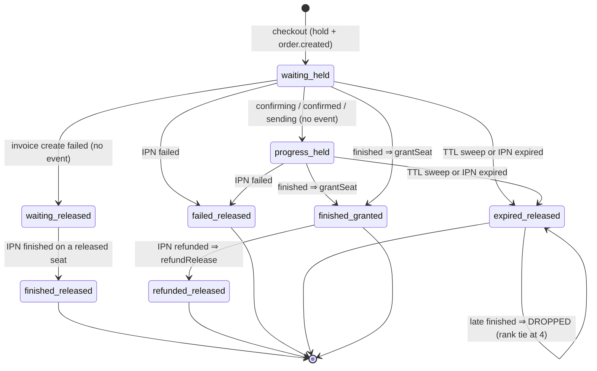
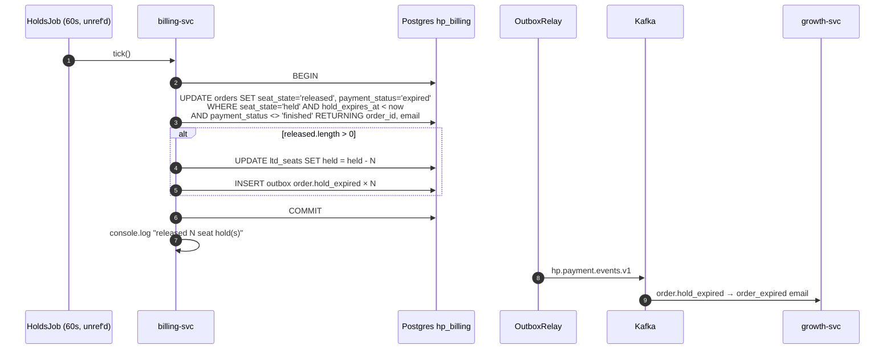
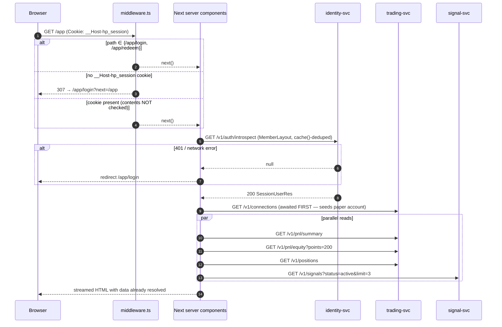
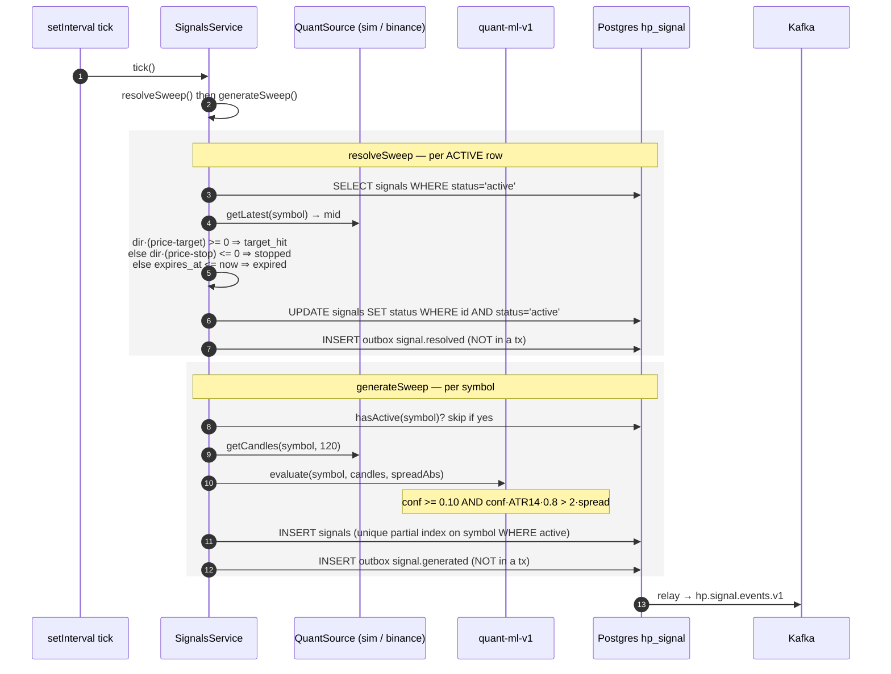
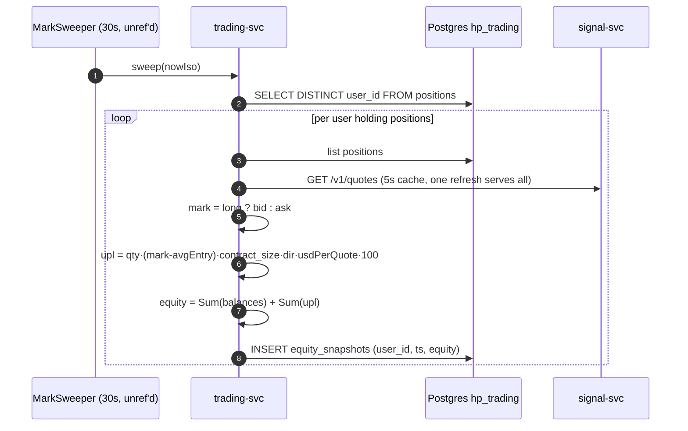
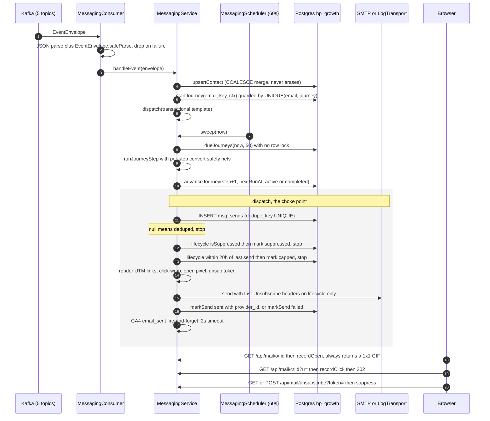

# End-to-end flows

Every cross-service journey HeroPips performs, traced hop by hop from the
browser to the last Kafka event. Each flow gives you a sequence diagram with
the real participants, a numbered step list where every hop names the exact
`file:line` that handles it, and a failure-mode table stating what breaks and
what the user actually sees. This is the document to read when you need to know
*where* something happens; read [04-features](./04-features/) when you need to
know *how* a single service works internally, and [02-data-model](./02-data-model.md)
for table and index detail.

---

## How to read this document

**Participants.** Diagrams use consistent short names:

| Name | Real thing |
|---|---|
| `B` | Browser (React client component or plain form post) |
| `W` | Next.js 15 App Router — server component **or** BFF route handler in `apps/web` |
| `MW` | `apps/web/middleware.ts` (edge-style cookie gate, Node runtime) |
| `ID` | identity-svc `:4003` |
| `BI` | billing-svc `:4002` |
| `GR` | growth-svc `:4001` |
| `SI` | signal-svc `:4004` |
| `TR` | trading-svc `:4005` |
| `PG` | Postgres 16 — one database per service (`hp_identity`, `hp_billing`, `hp_growth`, `hp_signal`, `hp_trading`) |
| `OB` | the `outbox` table of whichever service owns the step |
| `RL` | that service's `OutboxRelay` (2 s poll, batch 100) |
| `K` | Kafka 3.7.2, KRaft single broker |
| `NP` | NOWPayments (the real provider, or `infra/mocks/nowpayments` behind the `mocks` compose profile) |
| `SMTP` | outbound mail transport (nodemailer, or `LogTransport` when `SMTP_URL` is unset) |

**Ground rules that hold for every flow below.**

- No service is reachable from the internet. The browser talks only to
  Next.js, which fans out server-side. CORS is off everywhere by design.
  Details in [07-infrastructure](./07-infrastructure.md).
- Every event on the diagram is an **outbox row committed with the domain
  write**, then relayed to Kafka by a separate 2 s poller. Delivery is
  **at-least-once** — the relay does `producer.send` then `markOutboxSent`,
  so a crash between the two republishes. The one exception is signal-svc,
  whose outbox insert is *not* in a transaction with its state change
  (`apps/services/signal/src/signals/signals.service.ts:95-99`).
- There are **no HTTP client timeouts in `apps/web`** and none in trading-svc's
  outbound calls. The only outbound deadlines in the platform are identity →
  billing (`AbortSignal.timeout(5_000)`,
  `apps/services/identity/src/auth/billing-verify.client.ts:15`), billing →
  NOWPayments (`AbortSignal.timeout(10_000)`,
  `apps/services/billing/src/nowpayments/client.ts:41`) and the GA4 beacon
  (2 s, `apps/services/growth/src/messaging/analytics.ts:39`).
- All error bodies are the contracts `ApiError` shape
  `{error_code, message, remediation?}`, enforced by each service's global
  `APP_FILTER`. Codes come from the frozen catalogue at
  `packages/contracts/src/index.ts:9-41`.

---

## 1. Early-access signup

Three POSTs, two of which are the state machine: `/code` issues a
credential, `/verify` spends it and is the only thing that ever writes a
queue row. Nothing is persisted to `waitlist_entries` until a correct code
arrives. Internals: [growth-early-access](./04-features/growth-early-access.md).

```mermaid
sequenceDiagram
  autonumber
  participant B as Browser
  participant W as web BFF
  participant GR as growth-svc
  participant PG as Postgres hp_growth
  participant SMTP as SMTP
  participant OB as outbox → Kafka

  B->>W: POST /api/early-access/code {email}
  W->>GR: POST /v1/early-access/code
  GR->>PG: SELECT early_access_verifications WHERE email
  Note over GR: 30s resend gate on last_sent_at
  GR->>PG: UPSERT code_hash=HMAC(email:code), expires_at=+900s, attempts=0
  GR->>SMTP: dispatch ea_verify_code (dedupe tx:ea_code:email:ms)
  GR-->>W: 200 {email_masked, expires_in 900, resend_in 30}
  W-->>B: 200 (same body)

  B->>W: POST /api/early-access/verify {email, code, ref?, utm?, profile?}
  W->>GR: POST /v1/early-access/verify
  GR->>PG: SELECT verification row
  Note over GR: expiry → 401 + delete; mismatch → attempts+1, 5-budget
  GR->>PG: DELETE verification row
  GR->>PG: BEGIN; pg_advisory_xact_lock(42)
  GR->>PG: countEntries()+1 = base_position; INSERT waitlist_entries
  GR->>OB: INSERT outbox early_access.joined (same tx)
  GR->>PG: COMMIT
  GR-->>W: 200 {position, total, code, status_token, duplicate:false}
  W-->>B: 200 → wizard shows "Place claimed #N"
  OB->>OB: relay → hp.growth.events.v1
```

### Steps

| # | Hop | Handler |
|---|---|---|
| 1 | Client posts the email. Per-IP token bucket `ea-code`, **capacity 6/min**, in-process | `apps/web/app/api/early-access/code/route.ts:12` |
| 2 | Body parsed with `EarlyAccessCodeReq` (trim → lowercase → email → ≤254); failure is a local 422 that never leaves the BFF | `apps/web/app/api/early-access/code/route.ts:15-16`, schema `packages/contracts/src/index.ts:99` |
| 3 | Server-side fetch to growth, `cache: "no-store"`, **no timeout** | `apps/web/app/api/early-access/code/route.ts:18`, client `apps/web/lib/api.ts:15-26` |
| 4 | Controller re-parses the body (defence in depth — growth is also reachable directly on `:4001`) | `apps/services/growth/src/early-access/early-access.controller.ts:19-27` |
| 5 | Email re-normalised, then the **resend throttle**: `remaining = 30 − floor((now − last_sent_at)/1000)`; `remaining > 0` → 429 whose message interpolates the seconds | `apps/services/growth/src/early-access/early-access.service.ts:100-115`, constant `EA_CODE_RESEND_SEC` at `packages/contracts/src/index.ts:87-93` |
| 6 | `known = findByEmail(email) !== null` — used **only** to change the email copy. The HTTP response is byte-identical for known and unknown addresses, deliberately, so the endpoint is not a membership oracle | `apps/services/growth/src/early-access/early-access.service.ts:117-119`, contract comment `packages/contracts/src/index.ts:110-114` |
| 7 | Code = `devVerificationCode ?? generateNumericCode(6)`. `EARLY_ACCESS_DEV_CODE` pins it; unset **and** `NODE_ENV !== production` defaults it to `"123456"` | `apps/services/growth/src/early-access/early-access.service.ts:120`, `apps/services/growth/src/common/config.ts:33,47` |
| 8 | Upsert on the `email` primary key: replaces `code_hash`, sets `expires_at = now + 900s`, **resets `attempts` to 0**, increments `sends`. Only the HMAC is stored — `hex(HMAC-SHA256(STATUS_TOKEN_SECRET, lower(email) + ":" + code))`, address-bound so a leaked table cannot be replayed on another address | `apps/services/growth/src/early-access/early-access.service.ts:121-126`, `apps/services/growth/src/early-access/early-access.repo.ts:184-207`, hash `apps/services/growth/src/common/verification.ts:9-15` |
| 9 | Mail dispatched through the single messaging choke point with dedupe key `tx:ea_code:<email>:<lastSentAt.ms>` — keyed on the issuance instant, not a counter, because verify deletes the row and `sends` restarts at 1 | `apps/services/growth/src/early-access/early-access.service.ts:128-136`; dispatch pipeline in [flow 14](#14-lifecycle-email) |
| 10 | Only the literal `"failed"` result becomes a 502; `deduped`/`suppressed`/`capped` are treated as success | `apps/services/growth/src/early-access/early-access.service.ts:137-144` |
| 11 | Response carries `dev_code` iff `devVerificationCode !== null`, and the BFF forwards the body verbatim | `apps/services/growth/src/early-access/early-access.service.ts:146-151` |
| 12 | **Verify** — BFF bucket `ea-verify`, capacity 12/min; body is `EarlyAccessVerifyReq` (`code` must match `/^[0-9]{6}$/`) | `apps/web/app/api/early-access/verify/route.ts:11`, schema `packages/contracts/src/index.ts:118-125` |
| 13 | No pending row → `401 verification_required` | `apps/services/growth/src/early-access/early-access.service.ts:160-168` |
| 14 | **Expiry**: `expires_at <= now` → delete the row, then `401 verification_code_expired`. The row is destroyed, so the next attempt reports `verification_required` instead | `apps/services/growth/src/early-access/early-access.service.ts:169-177` |
| 15 | **Attempt budget**: HMAC mismatch → `bumpVerificationAttempts` returns the post-increment count; `left = 5 − attempts`. `left > 0` → 401 with "N tries left"; `left <= 0` → delete the row and 401 "Too many wrong codes." Comparison is `timingSafeEqual` over the hex-decoded digests | `apps/services/growth/src/early-access/early-access.service.ts:178-196`, `apps/services/growth/src/common/verification.ts:17-30`, cap `EA_CODE_MAX_ATTEMPTS = 5` |
| 16 | On match the verification row is cleared **before** the join runs | `apps/services/growth/src/early-access/early-access.service.ts:198-199` |
| 17 | **Advisory lock.** `joinTx` opens one transaction and immediately takes `pg_advisory_xact_lock(42)`. Every join in the service serialises here — duplicate check, ref lookup, the code-collision loop, `countEntries()`, the insert and the outbox row all execute under it. This is what makes `base_position` gapless and unique | `apps/services/growth/src/early-access/early-access.repo.ts:111-153` |
| 18 | *Duplicate branch*: profile answers replace stored ones (skipping never wipes), `total = countEntries()`, `position = effectivePosition(base, referrals)`, `duplicate: true`, fresh status token | `apps/services/growth/src/early-access/early-access.service.ts:217-234` |
| 19 | *New branch*: `ref` resolved case-insensitively via `upper(code) = upper($1)`; unknown codes and self-referral are silently ignored | `apps/services/growth/src/early-access/early-access.service.ts:236-245`, `apps/services/growth/src/early-access/early-access.repo.ts:116-123` |
| 20 | Referral code: 8 chars from a 32-glyph Crockford-ish alphabet with I/O/0/1 removed, up to 5 collision retries. The **final** candidate is inserted without a re-check — the unique index `waitlist_entries_code_uq` is the real guard | `apps/services/growth/src/early-access/early-access.service.ts:247-250`, `apps/services/growth/src/common/codes.ts:4-13`, index `apps/services/growth/src/db/migrate.ts:19` |
| 21 | **Queue position** assigned: `base_position = countEntries() + 1`, then `position = effectivePosition(base, 0) = base` for a fresh entry. Displayed position is always derived, never stored: `position = max(1, base − floor(referrals / 3) × 25)` | `apps/services/growth/src/early-access/early-access.service.ts:252-263`, formula `apps/services/growth/src/common/position.ts:4-11`, constants `REFERRALS_PER_JUMP = 3`, `JUMP_SIZE = 25` at `packages/contracts/src/index.ts:298-299` |
| 22 | `early_access.joined` outbox row inserted **inside the same transaction**. Payload carries ids and a masked email, never raw PII — the messaging consumer re-reads the entry from the same database | `apps/services/growth/src/early-access/early-access.service.ts:264-276` |
| 23 | Commit releases the advisory lock; the response returns `total = basePosition` for a fresh join (note: the duplicate branch returns `total = countEntries()`, a different quantity) | `apps/services/growth/src/early-access/early-access.service.ts:278-288` |
| 24 | Best-effort operator email to `ADMIN_NOTIFY_EMAIL`, only for non-duplicates, wrapped in its own try/catch | `apps/services/growth/src/early-access/early-access.service.ts:201-203, 296-323` |
| 25 | Relay drains the outbox to `hp.growth.events.v1`; growth's own messaging consumer picks it up and starts the welcome mail + nurture journey ([flow 14](#14-lifecycle-email)) | `apps/services/growth/src/outbox/relay.ts:60-104`, `apps/services/growth/src/messaging/messaging.service.ts:125-170` |

### Failure modes

| Condition | System behaviour | What the user sees |
|---|---|---|
| >6 `/code` calls per minute from one IP | BFF bucket denies before any upstream hop | `429 rate_limited`, form shows the rate-limit message |
| Second `/code` for the same address inside 30 s | `429` from growth; **the verification row was already written** on the first call | "A code was just sent to this address. Wait *N*s before asking for another." |
| SMTP transport throws | `dispatch` returns `"failed"`; the verification row is **already committed**, so the address is throttled for 30 s with no mail in hand | `502 internal` — "We couldn't send the code to that address." |
| Code expired (>15 min) | Row deleted, so the state machine resets to "never issued" | `401 verification_code_expired` → "That code expired." Request a new one |
| Wrong code, attempts 1–4 | `attempts` incremented, row survives | `401 verification_code_invalid` — "That code doesn't match. *N* tries left." |
| Wrong code, 5th attempt | Row deleted; even the *correct* code now fails | `401 verification_code_invalid` — "Too many wrong codes." Then `verification_required` on retry |
| Resend after a wrong guess | `issueVerification` resets `attempts` to 0 | Budget is **per issuance, not per address** — no cumulative lockout exists |
| Verify for an address already in the queue | Duplicate branch; no second insert, no second event | Same position and code returned, `duplicate: true`; the wizard renders "Welcome back" |
| Join transaction fails after `clearVerification` | The code is already burned | User must wait out the 30 s cooldown and request a new code (`apps/services/growth/src/early-access/early-access.service.ts:198-199`) |
| Kafka down | Outbox rows accumulate; the relay retries forever with a 30 s-throttled warning; HTTP is unaffected | Signup succeeds; the welcome email is delayed until Kafka returns |
| `ADMIN_NOTIFY_EMAIL` unset or its mail fails | Swallowed with a `warn` | No user-visible effect |
| growth-svc unreachable | `UpstreamError` → BFF `toResponse` | `502 internal` |

**Hazards.** `EARLY_ACCESS_DEV_CODE` both *pins* and *echoes* the code —
`dev_code` is in the HTTP body whenever it is set, and the BFF forwards the
body verbatim (`apps/services/growth/src/early-access/early-access.service.ts:150`).
Because containers run with `NODE_ENV=production`, the env var — not
`NODE_ENV` — is the real switch; but a deploy that forgets `NODE_ENV`
entirely silently pins every code to `123456`
(`apps/services/growth/src/common/config.ts:47`). Expired verification rows are
never swept: the `expires_at` index at `apps/services/growth/src/db/migrate.ts:37-38`
implies a sweeper that does not exist. And `findByCode` compares `upper(code)`
while the only index is on the raw column
(`apps/services/growth/src/early-access/early-access.repo.ts:120`) — a
sequential scan run up to six times per signup **while holding the global
advisory lock**.

---

## 2. Founding Hero purchase

One flat price — **$499**, `LTD.PRICE_USD_DEFAULT` at
`packages/contracts/src/index.ts:294`. There is no seat-price ladder anywhere
in the codebase; the only ladder in billing is `PAYMENT_STATUS_RANK`, which
orders out-of-sequence IPNs. Cap 500 seats, hold TTL 120 minutes. Internals:
[billing](./04-features/billing.md).

```mermaid
sequenceDiagram
  autonumber
  participant B as Browser
  participant W as web BFF
  participant BI as billing-svc
  participant PG as Postgres hp_billing
  participant NP as NOWPayments
  participant K as Kafka

  B->>W: POST /api/founding/checkout {email, pay_currency?, ref?}
  W->>BI: POST /v1/founding/checkout
  BI->>PG: BEGIN
  BI->>PG: UPDATE ltd_seats SET held=held+1 WHERE granted+held < cap RETURNING cap
  Note over BI,PG: 0 rows ⇒ sold_out ⇒ 410
  BI->>PG: INSERT orders (waiting, held, hold_expires_at=+120min)
  BI->>PG: INSERT outbox order.created
  BI->>PG: COMMIT
  BI->>BI: signStatusToken({o: order_id}) HMAC-SHA256
  BI->>NP: POST /v1/invoice (10s timeout, no retry)
  Note over BI: any throw ⇒ releaseHold ⇒ 502
  BI->>PG: UPDATE orders SET invoice_id, invoice_url
  BI-->>W: 200 {order_id, invoice_url, price_usd 499, expires_at, status_token}
  W-->>B: 200 → redirect to invoice_url

  NP->>BI: POST /v1/billing/ipn (x-nowpayments-sig)
  BI->>BI: verifyIpn HMAC-SHA512 over sorted-key re-serialisation
  BI->>PG: INSERT ipn_events ON CONFLICT (payment_id,payment_status) DO NOTHING
  Note over BI: 0 rows ⇒ 200 {ok,duplicate}
  BI->>BI: rank gate: RANK[incoming] > RANK[current]
  BI->>PG: BEGIN; UPDATE orders SET finished/granted WHERE seat_state='held'
  BI->>PG: UPDATE ltd_seats SET held=held-1, granted=granted+1
  BI->>PG: INSERT outbox payment.finished; COMMIT
  BI-->>NP: 200 {ok:true}
  BI->>K: relay → hp.payment.events.v1
```

### Steps

| # | Hop | Handler |
|---|---|---|
| 1 | Checkout form posts. Shared per-IP bucket, **20/min across all BFF POSTs** — checkout gets no tighter budget despite triggering an outbound invoice | `apps/web/app/api/founding/checkout/route.ts:7`, bucket `apps/web/app/api/_lib/bff.ts:8-30` |
| 2 | `CheckoutReq` parsed: email trimmed+lowercased ≤254, optional `pay_currency` ≤20 lowercased, optional `ref` `/^[A-Z0-9]{4,12}$/i` | `packages/contracts/src/index.ts:173-178` |
| 3 | Billing re-parses `unknown` — zod is the only validation layer, there is no Nest `ValidationPipe` | `apps/services/billing/src/founding/checkout.controller.ts:9-13`, `apps/services/billing/src/founding/founding.service.ts:35-43` |
| 4 | `order_id = "hp_ltd_" + randomBytes(6).hex` — 12 hex chars, **48 bits**; `expires_at = now + 120 min` | `apps/services/billing/src/founding/founding.service.ts:46-47`, `LTD.HOLD_TTL_MINUTES` at `packages/contracts/src/index.ts:296` |
| 5 | **Seat hold**, one transaction. `UPDATE ltd_seats SET held = held + 1 WHERE tenant_id = $1 AND granted + held < cap RETURNING cap` — the cap check *is* the predicate, so there is no SELECT-then-INSERT window. 0 rows ⇒ `'sold_out'`. The order row and the `order.created` outbox row commit in the same transaction | `apps/services/billing/src/db/repo.ts:106-126`, called at `apps/services/billing/src/founding/founding.service.ts:49-67` |
| 6 | Sold out → `410 ltd_sold_out` | `apps/services/billing/src/founding/founding.service.ts:68-75` |
| 7 | Status token minted: `base64url(JSON) + "." + hex(HMAC-SHA256(payload, STATUS_TOKEN_SECRET))`, payload `{o: order_id}`. **No `exp`, no nonce — valid forever** | `apps/services/billing/src/founding/founding.service.ts:77`, `apps/services/billing/src/common/token.ts:8-12` |
| 8 | Invoice created at NOWPayments: `price_amount = 499`, `price_currency "usd"`, `ipn_callback_url`, `success_url = ${PUBLIC_ORIGIN}/founding/status?token=…` (so the token travels through the provider's redirect chain), `cancel_url`. 10 s hard timeout, **zero retries** | `apps/services/billing/src/founding/founding.service.ts:81-90`, `apps/services/billing/src/nowpayments/client.ts:37-51` |
| 9 | Any invoice failure → `releaseHold(orderId, {})` rolls the seat back, then `502 invoice_create_failed`. The empty patch leaves the row `(waiting, released)` | `apps/services/billing/src/founding/founding.service.ts:91-100`, `apps/services/billing/src/db/repo.ts:197-212` |
| 10 | `setInvoice` persists `invoice_id`/`invoice_url` (single statement, outside any transaction) | `apps/services/billing/src/founding/founding.service.ts:102` |
| 11 | **IPN arrives.** The controller reads `req.rawBody`, attached by a custom buffer-mode JSON parser registered with the raw-body flag; drop that flag and every IPN 403s | `apps/services/billing/src/ipn/ipn.controller.ts:14-19`, `apps/services/billing/src/app.module.ts:81-102` |
| 12 | **Signature verification.** Empty body → 403. Otherwise `hex(HMAC-SHA512(JSON.stringify(parsed, Object.keys(parsed).sort()), NOWPAYMENTS_IPN_SECRET))`, header lower-cased and trimmed, length-checked then `timingSafeEqual`. Key sorting is **top-level only** — the HMAC is over a re-serialisation, not the received bytes | `apps/services/billing/src/ipn/ipn.service.ts:20-27`, `apps/services/billing/src/ipn/signature.ts:8-11, 20-42` |
| 13 | `NowPaymentsIpn.safeParse` failure → `200 {ok, ignored}` with a warn — deliberate, so the provider stops retrying | `apps/services/billing/src/ipn/ipn.service.ts:29-34` |
| 14 | **Replay defence.** `INSERT ipn_events … ON CONFLICT (payment_id, payment_status) DO NOTHING RETURNING id`; 0 rows ⇒ `200 {ok, duplicate}` before any state is read or written | `apps/services/billing/src/ipn/ipn.service.ts:37-45`, `apps/services/billing/src/db/repo.ts:231-245` |
| 15 | Unknown `order_id` → `200 {ok, ignored}` + warn | `apps/services/billing/src/ipn/ipn.service.ts:47-52` |
| 16 | Amount fields (`actually_paid`, `purchase_id`, `pay_currency`) collected into a patch only when present | `apps/services/billing/src/ipn/ipn.service.ts:54-57` |
| 17 | **Rank gate**, strictly greater: `PAYMENT_STATUS_RANK[incoming] > PAYMENT_STATUS_RANK[current]`. `partially_paid` is the one exception — it still records amounts even when it cannot advance the status | `apps/services/billing/src/ipn/ipn.service.ts:59-67`, ranks `packages/contracts/src/index.ts:195-198` |
| 18 | **Seat grant.** `finished` + `seat_state='held'` → `grantSeat`: conditional `UPDATE orders … WHERE order_id = $1 AND seat_state = 'held' RETURNING id` inside a transaction; 0 rows ⇒ return `false` before touching `ltd_seats` or the outbox. Counters mutate by SQL expression (`held − 1, granted + 1`) under the same row lock | `apps/services/billing/src/ipn/ipn.service.ts:85-99`, `apps/services/billing/src/db/repo.ts:180-195` |
| 19 | `payment.finished` outbox row is written **inside** the grant transaction | `apps/services/billing/src/ipn/ipn.service.ts:86-93`, `apps/services/billing/src/db/repo.ts:192` |
| 20 | Relay publishes to `hp.payment.events.v1`, Kafka key = `payload.order_id` | `apps/services/billing/src/outbox/relay.ts:61-73` |
| 21 | growth-svc's messaging consumer sends `purchase_confirmed`, cancels the early-access nurture journey and starts `founding_onboarding` ([flow 14](#14-lifecycle-email)) | `apps/services/growth/src/messaging/messaging.service.ts:86-87` |

### `payment_status` × `seat_state` lifecycle

Ranks: `waiting 0 · confirming 1 · confirmed 2 · partially_paid 2.5 · sending 3 · finished 4 · failed 4 · expired 4 · refunded 5`
(`packages/contracts/src/index.ts:195-198`).



Read it as: `seat_state` moves `held → granted` on `finished` only,
`held → released` on failed / expired / refunded / TTL sweep / invoice
rollback, and `granted → released` on refund only. **`granted` and `released`
are terminal** — nothing in the codebase moves a seat back to `held`
(`apps/services/billing/src/db/repo.ts:180-229`).

Two edges deserve attention. The **self-loop on `expired_released`** is the
dangerous one: an IPN carrying `finished` for an order the sweeper already
marked `expired` is silently **dropped**, because `finished` and `expired` both
rank 4 and the gate is strictly greater
(`apps/services/billing/src/ipn/ipn.service.ts:61`). Money is in, no seat, no
alert, and the provider gets a cheerful `200 {ok, ignored}`. The
`waiting_released --> finished_released` edge is the mirror hazard: it *does*
fire, granting entitlement on a seat the counter never reserved — reachable
whenever `createInvoice` times out after NOWPayments actually created the
invoice (`apps/services/billing/src/ipn/ipn.service.ts:94-98`).

### Failure modes

| Condition | System behaviour | What the user sees |
|---|---|---|
| Cap reached (`granted + held >= cap`) | Hold UPDATE matches 0 rows | `410 ltd_sold_out` — "All Founding Hero seats are taken." |
| NOWPayments slow (>10 s), down, or non-2xx | Hold rolled back, order left `(waiting, released)` | `502 invoice_create_failed` — "Try again in a moment." |
| Invoice created upstream but the 10 s timeout fired first | Hold released, but the provider still fires IPNs at the registered callback. `finished (4) > waiting (0)` passes the gate, so `apply` marks the order `finished` on a **released** seat and never re-grants | The buyer's `/founding/status` shows `finished`, `verifyPurchase` returns `ok:true`, and they can redeem — but the seat counter never decremented (`apps/services/billing/src/ipn/ipn.service.ts:94-98`) |
| Byte-identical IPN replay | Unique `(payment_id, payment_status)` rejects the ledger insert | `200 {ok:true, duplicate:true}`; nothing re-applied |
| Different `payment_id`, same `finished` status | Passes the ledger, fails the rank gate (already rank 4) | `200 {ok:true, ignored:true}`; no double grant |
| Two concurrent grants slip past both layers | They serialise on the `orders` row lock; the loser re-evaluates `seat_state='held'` and matches nothing, returning `false` before touching counters | Silent — the boolean is discarded by `IpnService` (`apps/services/billing/src/ipn/ipn.service.ts:95`) |
| Wrong or missing `x-nowpayments-sig` | 403 before any parse | `403 ipn_signature_invalid`; **no audit row is written** — `sig_valid` is hardcoded `true` at its only call site (`apps/services/billing/src/ipn/ipn.service.ts:43`) |
| Body signed but not IPN-shaped | Swallowed | `200 {ok:true, ignored:true}` |
| Kafka down | Rows queue in `outbox`; the relay never blocks HTTP | Payment succeeds; the receipt email is delayed |
| Double-submitted checkout form | No client idempotency key is accepted; two order ids, two holds | Two seats burn for two full hold TTLs |
| Postgres down at boot | `migrate()` throws, no retry loop, container exits | Service never becomes healthy |

**Hazards.** Status tokens never expire and the same `STATUS_TOKEN_SECRET`
signs growth's tokens too, so rotating it invalidates both services'
links at once (`apps/services/billing/src/common/token.ts:8-12`,
`apps/services/growth/src/common/token.ts:9-16`).
`POST /v1/founding/verify` is completely unauthenticated and compose publishes
`:4002` on the host — with 48-bit order ids, `(email, order_id)` is enough to
confirm a purchase (`apps/services/billing/src/founding/verify.controller.ts:9-13`).
`confirmed` (rank 2) already satisfies `verifyPurchase`, so an account can be
created before payment finality and before the seat is granted
(`apps/services/billing/src/founding/founding.service.ts:208-215`).
The IPN ledger insert commits *outside* the apply transaction, so a crash
between them permanently loses that transition.
`LTD_SEAT_CAP` is seeded once with `ON CONFLICT DO NOTHING` — later changes
need SQL (`apps/services/billing/src/db/migrate.ts:57-61`).

---

## 3. Hold expiry

A 60 s sweeper that returns unpaid seats to inventory. It is the only
scheduled writer in billing.



### Steps

| # | Hop | Handler |
|---|---|---|
| 1 | `setInterval(tick, 60_000)`, timer `unref()`ed so it never holds the process open | `apps/services/billing/src/founding/holds.job.ts:3, 11-15` |
| 2 | `tick()` calls `repo.expireHolds(new Date())`; errors are caught and warned, never rethrown | `apps/services/billing/src/founding/holds.job.ts:22-33` |
| 3 | One `UPDATE … RETURNING` selects and mutates in a single statement, guarded by `seat_state='held' AND hold_expires_at < now AND payment_status <> 'finished'`. The partial index `orders_hold_expiry_idx ON (hold_expires_at) WHERE seat_state='held'` serves it | `apps/services/billing/src/db/repo.ts:247-259`, index `apps/services/billing/src/db/migrate.ts:31` |
| 4 | Counter decremented by the exact released count, as a SQL expression under the `ltd_seats` row lock | `apps/services/billing/src/db/repo.ts:260-264` |
| 5 | One `order.hold_expired` outbox row per released order, payload `{order_id, email}`, all in the same transaction | `apps/services/billing/src/db/repo.ts:265-270` |
| 6 | growth's consumer maps both `payment.expired` **and** `order.hold_expired` to the same handler with dedupe key `tx:expired:{orderId}`, so only one email is ever sent | `apps/services/growth/src/messaging/messaging.service.ts:90-92` |

### Failure modes

| Condition | System behaviour | What the user sees |
|---|---|---|
| Multiple billing replicas sweeping simultaneously | Both run the same UPDATE; the `seat_state='held'` predicate makes the loser match 0 rows | No double release, no double event |
| A `finished` payment landed just before the sweep | `payment_status <> 'finished'` excludes it | Seat stays granted |
| A `finished` payment lands just **after** the sweep | The order is now `expired` (rank 4); the incoming `finished` (rank 4) is dropped by the strict gate | **Money in, no seat, no alert.** The order shows `expired` forever, `verifyPurchase` returns `ok:false`, and redeem is blocked |
| Sweep throws (DB blip) | Logged as `[billing] hold expiry failed: …`; the next tick retries | Seats stay held until the next successful sweep |
| Very large backlog | `expireHolds` has **no LIMIT** — one statement releases every expired hold in one transaction. Bounded in practice by the 500-seat cap | A long lock on `ltd_seats`; concurrent checkouts block briefly |

---

## 4. Redeem and account creation

The **only** account-creation path in the platform. There is no signup form and
no password reset. Internals: [identity](./04-features/identity.md).

```mermaid
sequenceDiagram
  autonumber
  participant B as Browser
  participant W as web BFF
  participant ID as identity-svc
  participant BI as billing-svc
  participant PG as Postgres hp_identity
  participant TR as trading-svc
  participant K as Kafka

  B->>W: POST /api/app/auth/redeem {email, access_code, password, display_name}
  W->>ID: POST /v1/auth/redeem
  ID->>ID: per-IP bucket 5/min (BEFORE validation)
  ID->>BI: POST /v1/founding/verify {email, order_id} (5s timeout)
  BI->>BI: order exists, email matches, status ∈ {finished, confirmed}
  BI-->>ID: 200 {ok:true, sku} | {ok:false}
  Note over ID: !ok AND code ∉ EARLY_ACCESS_CODES ⇒ 401
  ID->>ID: scrypt N=2^15 r=8 p=1, 32B salt, 64B key
  ID->>PG: INSERT users ON CONFLICT (email) DO NOTHING
  ID->>PG: INSERT sessions (token_sha256, expires_at=+30d)
  ID->>PG: BEGIN; INSERT audit_log + outbox(audit, user.registered); COMMIT
  ID-->>W: 200 {token, expires_at, user}
  W->>TR: GET /v1/connections (best-effort, seeds $10k paper)
  W-->>B: 200 {user} + Set-Cookie __Host-hp_session
  ID->>K: hp.identity.events.v1 user.registered
  ID->>K: hp.audit.log.v1 auth.redeemed
```

### Steps

| # | Hop | Handler |
|---|---|---|
| 1 | BFF shared 20/min bucket, then `RedeemAccessReq` (`email ≤320`, `access_code 6..120`, `password 10..200`, `display_name 2..40`) | `apps/web/app/api/app/auth/redeem/route.ts:12-23`, schema `packages/contracts/src/index.ts:431-436` |
| 2 | Identity rate-limits **before** parsing — a malformed payload still burns a token from the 5/min per-IP redeem bucket | `apps/services/identity/src/auth/auth.service.ts:63-65`, bucket built at `:53` |
| 3 | `RedeemAccessReq.safeParse` → 422 carrying the first zod issue message | `apps/services/identity/src/auth/auth.service.ts:66-69` |
| 4 | **Billing verification.** `POST {BILLING_URL}/v1/founding/verify` with `{email, order_id: access_code}`, `AbortSignal.timeout(5000)`. Non-2xx → `{ok:false}`; the response body is *cast, not zod-parsed*, and `sku` is trusted verbatim with no allowlist. Any throw is caught by redeem and degraded to `{ok:false}` | `apps/services/identity/src/auth/billing-verify.client.ts:11-19`, caught at `apps/services/identity/src/auth/auth.service.ts:74-77` |
| 5 | Billing side: order must exist, email must match case-insensitively, and `payment_status` must satisfy `isRedeemable` — `finished` **or `confirmed`**. That predicate is exported from contracts so the claim CTA and the redeem page gate on exactly what billing accepts | `apps/services/billing/src/founding/founding.service.ts:208-215`, predicate `packages/contracts/src/index.ts:200-215` |
| 6 | Gate: `!verified.ok && !compedCodes.includes(access_code.toLowerCase())` → `401 access_code_invalid`. Env codes are folded to lower case once in the constructor, so a phone-capitalised code still matches; they remain unlimited multi-use | `apps/services/identity/src/auth/auth.service.ts:78-90`, folded at `:56` |
| 7 | Password hashed: scrypt `N=2^15, r=8, p=1`, 32-byte random salt, 64-byte key, `maxmem` 64 MiB, stored as `scrypt$32768$8$1$<b64 salt>$<b64 key>` | `apps/services/identity/src/common/crypto.ts:9-34` |
| 8 | User row built with `role: "member"` and **`founding: true` unconditionally** — the audit meta records the truth (`founding: verified.ok`) but the Kafka payload carries `user.founding`, i.e. always true | `apps/services/identity/src/auth/auth.service.ts:95-104, 123-131` |
| 9 | `INSERT … ON CONFLICT (email) DO NOTHING RETURNING id`; empty result maps to `duplicate_email` → `409 forbidden`, remediation `"Sign in with that email instead."` — which the redeem form renders as an actual link to `/app/login` rather than prose | `apps/services/identity/src/auth/auth.service.ts:105-113`, `apps/services/identity/src/db/repo.ts:98-114`, link at `apps/web/components/app/AuthForms.tsx:174` |
| 10 | Session issued: 32 random bytes → base64url (43 chars); only `sha256Hex(token)` is persisted; `expires_at = now + 30 d`; `ip`/`user_agent` from `requestMeta` | `apps/services/identity/src/auth/auth.service.ts:164-179`, `apps/services/identity/src/common/crypto.ts:62-69` |
| 11 | `audit("auth.redeemed", …)` writes the audit row **and both outbox envelopes** in the service's only transaction — one to `hp.audit.log.v1`, one carrying `user.registered` to `hp.identity.events.v1` | `apps/services/identity/src/auth/auth.service.ts:116-135`, `apps/services/identity/src/common/audit.ts:18-29`, `apps/services/identity/src/db/repo.ts:195-204` |
| 12 | BFF parses `AuthSessionRes`; a parse failure is a 502 rather than a half-authenticated response | `apps/web/app/api/app/auth/redeem/route.ts:44-45` |
| 13 | **First-touch provisioning.** A throwaway `GET /v1/connections` against trading-svc with the fresh bearer triggers `ensurePaper`, seeding a `paper`/`active` connection with `PAPER_STARTING_BALANCE_USD_MINOR = 1_000_000` ¢ ($10,000) *before* the client can paint a balance. Best-effort — a failure self-heals on the next connections read | `apps/web/app/api/app/auth/redeem/route.ts:51-58`, `apps/services/trading/src/connections/connections.service.ts:40-57` |
| 14 | Cookie set: `__Host-hp_session`, `httpOnly`, `SameSite=Lax`, `Secure` (unconditional — the `__Host-` prefix requires it), `path=/`, `priority=high`, `maxAge 2 592 000`. The JSON body returns only `{user}` — the raw token never reaches client JS on this path | `apps/web/app/api/app/auth/redeem/route.ts:60-62`, attrs `apps/web/lib/session-cookie.ts:33-40` |
| 15 | Relay publishes both envelopes. `user.registered` has no `actor_id` in its payload, so the relay keys it on `event_id` — registrations land on arbitrary partitions, unlike audit events which key on `actor_id` | `apps/services/identity/src/outbox/relay.ts:58-70` |
| 16 | growth consumes `user.registered` → `platform_welcome` email, cancels both pre-signup journeys, starts `member_activation` | `apps/services/growth/src/messaging/messaging.service.ts:95-96` |

### Failure modes

| Condition | System behaviour | What the user sees |
|---|---|---|
| >5 redeems/min from one IP | Bucket denies before parsing | `429 rate_limited` |
| billing-svc down, slow (>5 s), or returning garbage | Verifier degrades to `{ok:false}`; redeem falls back to `EARLY_ACCESS_CODES` | Indistinguishable from "order not found": `401 access_code_invalid` unless an env code was used |
| Order paid but only `waiting`/`confirming` | `verifyPurchase` → `{ok:false}` | `401 access_code_invalid` — "That code and email don't match a Founding order. Use the order id from your order status page together with the email you paid with." Both the email and access-code fields are flagged, because billing matches on the pair and answers with one opaque `{ok:false}` either way |
| Email already registered | `ON CONFLICT DO NOTHING` yields no row | `409 forbidden` — "An account with this email already exists." This is an **account-enumeration oracle** that undoes the effort spent making login timing- and body-identical |
| Crash between `createUser` and `createSession` | Redeem spans **three** independent commits; only `insertAudit` is transactional | A user row with no session or no audit trail; the user must log in instead |
| trading-svc unreachable during the provisioning touch | Swallowed | Dashboard briefly shows $0 equity until the next `/v1/connections` read seeds the account |
| Kafka down | Envelopes queue in `outbox` | Account works immediately; the welcome email is delayed |
| User forgets the password | **There is no password-reset endpoint anywhere in the service** | Permanent lockout. The 409 remediation no longer advertises a reset — it now says "Sign in with that email instead." and the form renders it as a link |

---

## 5. Login and session lifecycle

```mermaid
sequenceDiagram
  autonumber
  participant B as Browser
  participant W as web BFF
  participant ID as identity-svc
  participant PG as Postgres hp_identity

  B->>W: POST /api/app/auth/login {email, password}
  W->>ID: POST /v1/auth/login
  ID->>ID: LoginReq.safeParse (validate FIRST)
  ID->>ID: bucket ip 10/min OR email 5/min
  ID->>PG: SELECT users WHERE email (citext)
  Note over ID: unknown email ⇒ verify against DUMMY_HASH_PROMISE<br/>same scrypt cost, byte-identical 401
  ID->>PG: INSERT sessions (sha256(token), expires_at=+30d)
  ID->>PG: BEGIN; audit auth.login + outbox; COMMIT
  ID-->>W: 200 {token, expires_at, user}
  W-->>B: 200 {user} + Set-Cookie __Host-hp_session (30d)

  B->>W: any authed request (cookie auto-sent)
  W->>ID: GET /v1/auth/introspect (Bearer)
  ID->>PG: SELECT sessions ⋈ users WHERE token_sha256 = sha256(token)
  alt now - last_seen_at >= 60s
    ID->>PG: UPDATE last_seen_at = now, expires_at = now + 30d
  end
  ID-->>W: 200 SessionUserRes

  B->>W: POST /api/app/auth/logout
  W->>ID: POST /v1/auth/logout (best-effort)
  ID->>PG: UPDATE sessions SET revoked_at WHERE id AND user_id AND revoked_at IS NULL
  W-->>B: 200 {ok:true} + Set-Cookie __Host-hp_session="" maxAge=0
```

### Steps

| # | Hop | Handler |
|---|---|---|
| 1 | BFF shared 20/min bucket, `LoginReq` parsed locally | `apps/web/app/api/app/auth/login/route.ts:10-14` |
| 2 | Identity **validates first, rate-limits second** — the inverse of redeem, so garbage payloads are unlimited. `!loginByIp.allow(ip) \|\| !loginByEmail.allow(email)` short-circuits, so the email bucket is not consumed when the IP bucket already denied | `apps/services/identity/src/auth/auth.service.ts:140-147` |
| 3 | **Constant-time unknown-email path.** `verifyPassword(req.password, user?.passwordHash ?? await DUMMY_HASH_PROMISE)`. `DUMMY_HASH_PROMISE` is a module-load-time scrypt of 24 random bytes, so an unknown address costs exactly the same 32 MiB scrypt as a real one, and the `401 auth_invalid_credentials` body is byte-identical for both failures | `apps/services/identity/src/auth/auth.service.ts:149-155`, `apps/services/identity/src/common/crypto.ts:59`, proven at `apps/services/identity/test/auth.test.ts:114-131` |
| 4 | Session issued exactly as in redeem; `audit("auth.login", meta {ip})` | `apps/services/identity/src/auth/auth.service.ts:157-159` |
| 5 | BFF writes the raw token into the `__Host-hp_session` cookie and returns only `{user}` | `apps/web/app/api/app/auth/login/route.ts:33-34` |
| 6 | **Introspect** is the single token-validation oracle for the whole platform: one indexed lookup on the unique `token_sha256`, joined to `users`; `null` if `revoked_at` is set or `expires_at <= now` | `apps/services/identity/src/auth/auth.service.ts:185-191`, `apps/services/identity/src/db/repo.ts:151-162` |
| 7 | **Sliding renewal**, throttled: only when `now − last_seen_at >= 60_000` does it write `last_seen_at = now, expires_at = now + 30 d`. Under regular use a session survives indefinitely | `apps/services/identity/src/auth/auth.service.ts:192-197`, `TOUCH_INTERVAL_MS` at `:33`; 40 × (+20 d) proven at `apps/services/identity/test/auth.test.ts:163-181` |
| 8 | `requireSession` strips the literal `"Bearer "` prefix; anything else is `401 session_expired` with remediation "Log in again." | `apps/services/identity/src/auth/auth.service.ts:201-208` |
| 9 | **Enumerate**: `GET /v1/sessions` lists live rows (`revoked_at IS NULL AND expires_at > now`) and flags `current` by comparing `token_sha256` | `apps/services/identity/src/auth/auth.service.ts:222-235`, `apps/services/identity/src/db/repo.ts:167-174` |
| 10 | **Revoke by id**: guarded by `id AND user_id AND revoked_at IS NULL RETURNING id`, so revocation is monotonic and a second attempt is `404 forbidden` | `apps/services/identity/src/auth/auth.service.ts:237-245`, `apps/services/identity/src/db/repo.ts:175-183` |
| 11 | **Logout** revokes the current session but **discards the boolean** and always answers 200 | `apps/services/identity/src/auth/auth.service.ts:215-220` |
| 12 | BFF clears the cookie with `maxAge: 0` regardless of what identity said | `apps/web/app/api/app/auth/logout/route.ts:17-19` |
| 13 | **Password change** revokes every *other* live session and keeps the current one — three sequential, independently-committed writes (hash → revoke others → audit) | `apps/services/identity/src/me/me.service.ts:47-63`, `apps/services/identity/src/db/repo.ts:184-193` |

### Failure modes

| Condition | System behaviour | What the user sees |
|---|---|---|
| Unknown email | Dummy-hash verify, then 401 | `{"error_code":"auth_invalid_credentials","message":"Invalid email or password."}` — identical to a wrong password |
| Wrong password | Same 401, same body, same wall-clock cost | Identical |
| >10 attempts/min from one IP | IP bucket | `429 rate_limited` |
| >5 attempts/min against one email, even across 5 distinct IPs | Email bucket | `429 rate_limited` (`apps/services/identity/test/auth.test.ts:133-145`) |
| Behind a proxy with `trustProxy` off | `FastifyAdapter` is constructed with no options, so `req.ip` is the proxy address. `redeemByIp` (5/min) and `loginByIp` (10/min) collapse into **one global bucket for all traffic** | Platform-wide self-inflicted DoS under load; every `sessions.ip` and `auth.login` audit records the proxy IP (`apps/services/identity/src/main.ts:24`, `apps/services/identity/src/common/http.ts:9-15`) |
| Session revoked or expired mid-request | `resolveToken` returns null | `401 session_expired`; server components redirect to `/app/login` (`apps/web/lib/session.ts:76`) |
| Cookie survives 30 days but the server slid `expires_at` further | The cookie `maxAge` is **never refreshed** | Hard 30-day browser cap the server does not impose; `AuthSessionRes.expires_at` is discarded by the BFF (`apps/web/lib/session.ts:25`) |
| Double logout | First revoke succeeds, second matches 0 rows but the result is ignored | Both return 200 — while `DELETE /v1/sessions/:id` on the same id returns 404. Inconsistent semantics for the same operation |
| Non-UUID passed to `DELETE /v1/sessions/:id` | No validation; the value reaches Postgres and raises a cast error | `500 internal` via the global filter |
| Identity replicas > 1 | Rate-limit buckets are per-process in-memory maps | Effective limits multiply by the replica count; they also reset on every deploy |

---

## 6. Authenticated page render

Two independent gates. The middleware is a cheap cookie sniff; the real
validation is server-side introspection inside the member layout.



### Steps

| # | Hop | Handler |
|---|---|---|
| 1 | Matcher `["/app/:path*"]` (which also matches bare `/app`); `PUBLIC_APP_PATHS` is an exact-match `Set` of `/app/login` and `/app/redeem` | `apps/web/middleware.ts:8, 12, 21-23` |
| 2 | Gate is `req.cookies.has("__Host-hp_session")` — **presence only**, deliberately. A forged or expired cookie sails straight through | `apps/web/middleware.ts:13` |
| 3 | Redirect clones `nextUrl`, **blanks `search`**, then re-adds `next = pathname + originalSearch` | `apps/web/middleware.ts:14-18` |
| 4 | Middleware injects **no headers**. CSP, HSTS, `X-Frame-Options` and the rest are a static `headers()` entry in `next.config.ts:21-46` | — |
| 5 | `MemberLayout` calls `getSession()` and redirects on null. This is the real gate | `apps/web/app/(platform)/app/(member)/layout.tsx:10-12` |
| 6 | `getSession` is `cache()`-wrapped, so N server components in one render share **one** introspect call | `apps/web/lib/session.ts:38-51` |
| 7 | Any non-2xx or thrown fetch returns `null` — indistinguishable from "logged out" | `apps/web/lib/session.ts:46-50` |
| 8 | Identity resolves the token: sha256 → indexed `sessions ⋈ users` → revoked/expiry check → optional sliding touch | `apps/services/identity/src/auth/auth.service.ts:185-199` |
| 9 | `serviceGet(base, path, schema)` reads the cookie, forwards `Authorization: Bearer`, `redirect("/app/login")` on a tokenless call or an upstream 401, `ServiceError(status, ApiError)` otherwise, then `schema.parse` | `apps/web/lib/session.ts:69-86` |
| 10 | The dashboard **awaits `/v1/connections` first**, then fans out the four reads in `Promise.all`. Sequencing is load-bearing: `ensurePaper` seeds the $10k account on that call, and racing it paints $0 equity for a brand-new member | `apps/web/app/(platform)/app/(member)/page.tsx:19-29` |
| 11 | Every response is zod-parsed at the boundary before it reaches JSX; unparsable data throws into the segment's `error.tsx` | `apps/web/lib/session.ts:80` |
| 12 | trading-svc introspects the same bearer independently, with its own 30 s positive-only cache keyed on the raw token string | `apps/services/trading/src/auth/introspect.ts:12, 23-43` |

### Failure modes

| Condition | System behaviour | What the user sees |
|---|---|---|
| No cookie | Middleware redirect | Login page with `?next=/app/…` preserved |
| Forged or expired cookie | Middleware passes, layout introspect returns null | Redirect to `/app/login` — one wasted round trip |
| Session dies between layout introspect and a later `serviceGet` | `serviceGet` sees a 401 and redirects | Login page |
| Upstream 5xx from trading or signal | `ServiceError` thrown | The segment's `error.tsx` boundary renders |
| Upstream hangs | **No timeout exists anywhere in `apps/web`** | The Next worker stalls until undici's default gives up |
| New private route added **outside** the `(member)` group | Inherits the cookie sniff but not the introspection | Silently unauthenticated server rendering — the single most likely way to introduce an auth hole here |
| `NEXT_PUBLIC_CHAT_WS_URL` changed at runtime | Its origin is baked into CSP `connect-src` at build time | The chat socket is blocked until a rebuild (`next.config.ts:4-11`) |

---

## 7. Signal generation and resolution

One engine tick every `SIGNAL_INTERVAL_SEC` (default 60, `0` disables). Resolve
runs before generate, so a symbol freed this tick can immediately regenerate.
Formulas: [signal](./04-features/signal.md).



### Steps — generation

| # | Hop | Handler |
|---|---|---|
| 1 | `setInterval(run, intervalSec × 1000)` plus one immediate sweep at boot; disabled entirely when `intervalSec <= 0`. Tick failures are caught and logged as warnings | `apps/services/signal/src/signals/signals.service.ts:42-51` |
| 2 | `tick()` = `resolveSweep()` then `generateSweep()` | `apps/services/signal/src/signals/signals.service.ts:59-62` |
| 3 | Per symbol in `SYMBOLS` (7 instruments): `hasActive(symbol)` short-circuits. This check is **advisory** — the real invariant is the partial unique index | `apps/services/signal/src/signals/signals.service.ts:69-70`, index `signals_one_active_per_symbol_uq ON signals(symbol) WHERE status='active'` at `apps/services/signal/src/db/migrate.ts:26` |
| 4 | `getCandles(symbol, 120)`. In sim mode this is a deterministic zero-drift GBM walk seeded on `(SIM_SEED + fnv1a(symbol))`, 7 PRNG draws per bar, so candle *i* is a pure function of seed and index. In `SOURCE=binance` only crypto symbols hit the REST API; fx and metal always fall back to the sim, and a failure relabels `data_source` honestly | `apps/services/signal/src/signals/signals.service.ts:72`, `apps/services/signal/src/market/sim.source.ts:109-140`, `apps/services/signal/src/market/binance.source.ts:32-56` |
| 5 | `mid = last close`; `spreadAbs(symbol, mid) = mid × bps / 10_000` with `{fx: 0.6, metal: 1.2, crypto: 2.0}` bps | `apps/services/signal/src/signals/signals.service.ts:74-75`, `apps/services/signal/src/market/quotes.ts:5-14` |
| 6 | Model preconditions: ≥61 candles and `atr14 > 0`, else `null` | `apps/services/signal/src/quant/model.ts:51-57` |
| 7 | Score = `1.10·momentum − 0.55·zScore − 0.90·rsiFeature − 0.35·regimeFeature`; `p = sigmoid(score)`; `side = p > 0.5 ? buy : sell`; `confidence = |2p − 1|` | `apps/services/signal/src/quant/model.ts:22-27, 86-89` |
| 8 | **Emission gate**, both must pass: `confidence >= 0.10` **and** `confidence · ATR14 · 0.8 > 2 · spread` (strict — equality rejects) | `apps/services/signal/src/quant/model.ts:92-94` |
| 9 | Levels: `entry = last close`, `stop = entry − dir·1.2·ATR`, `target = entry + dir·1.8·ATR` ⇒ fixed **R = 1.5**; `horizon_min = clamp(round(90 · regime), 30, 240)` | `apps/services/signal/src/quant/model.ts:97-113` |
| 10 | Row built with `data_source` read from the source **at that instant** (so a Binance outage mid-sweep is recorded truthfully) and `expires_at = generated_at + horizon_min × 60_000` | `apps/services/signal/src/signals/signals.service.ts:78-94` |
| 11 | `insertSignal` is a plain INSERT with **no `onConflict`** | `apps/services/signal/src/signals/signals.service.ts:95`, `apps/services/signal/src/signals/signals.repo.ts:45-62` |
| 12 | `signal.generated` outbox row, payload = the full `SignalRes` — **a separate autocommit statement, not in a transaction with the insert** | `apps/services/signal/src/signals/signals.service.ts:96-99` |

### Steps — resolution

| # | Hop | Handler |
|---|---|---|
| 13 | For each active row, `getLatest(symbol)` returns a **mid**, never bid/ask | `apps/services/signal/src/signals/signals.service.ts:108-110` |
| 14 | Precedence is fixed and optimistic: `target_hit` is tested first, then `stopped`, then `expired`. If a single candle crossed both stop and target, the signal records `target_hit` | `apps/services/signal/src/signals/signals.service.ts:113-117` |
| 15 | `markResolved` updates **only if still active**, so a lost race is a silent no-op | `apps/services/signal/src/signals/signals.repo.ts:94-99` |
| 16 | `signal.resolved` runs **unconditionally** afterwards, payload = `SignalRes` with `status` set to the outcome plus a duplicate `outcome` field | `apps/services/signal/src/signals/signals.service.ts:119-123` |
| 17 | growth counts `signal.generated` into `msg_signal_weeks`, and `signal.resolved` only when `outcome ∈ {target_hit, stopped}` — `expired` is explicitly dropped | `apps/services/growth/src/messaging/messaging.service.ts:109-117` |

### Failure modes

| Condition | System behaviour | What the user sees |
|---|---|---|
| Model gate fails (low confidence or edge ≤ 2× spread) | `evaluate` returns `null`, symbol skipped this tick | Fewer active signals; `/app/intelligence` shows an empty or short list |
| Fewer than 61 candles, or a flat market with ATR = 0 | `null` | Same |
| Binance unreachable in `SOURCE=binance` | Sim candles substituted, warn logged **once per symbol**, `data_source` reports the sim label. No backoff, no circuit breaker, **no fetch timeout** | Signals keep flowing; the `data_source` field on the card changes |
| One symbol throws mid-sweep | A single try/catch wraps the whole tick, so the remainder of that sweep is abandoned | Some symbols silently skip a cycle |
| Two signal-svc replicas | `hasActive → insertSignal` is not atomic; the loser hits `signals_one_active_per_symbol_uq` and, with no `ON CONFLICT`, the PG error **rejects the whole tick** | Missing signals for that cycle |
| Crash between `insertSignal` and `insertOutbox` | The outbox is **not transactional** in this service | A signal exists in the DB that was never published — the weekly digest undercounts |
| Crash between `markResolved` and its outbox insert, or a lost resolve race | `markResolved` no-ops but `insertOutbox` runs regardless | Duplicate `signal.resolved` on the bus; consumers must dedupe on `event_id` |
| Kafka down | Relay retries forever, 30 s-throttled warn | HTTP unaffected |
| Process restart | `t0` (the sim's history anchor) is fixed at construction | Signals are reproducible per process, not across restarts at different wall-clock times |

Both signal endpoints are **unauthenticated by design** and bound to
`0.0.0.0` — network policy is the only boundary
(`apps/services/signal/src/main.ts:17-23`).

---

## 8. Order execution

Everything below runs inside **one** database transaction — the idempotency
read, the position write, the balance update, the trade rows, the order row,
the outbox events and the equity snapshot. Money maths:
[trading](./04-features/trading.md).

```mermaid
sequenceDiagram
  autonumber
  participant B as Browser
  participant W as web BFF
  participant TR as trading-svc
  participant ID as identity-svc
  participant SI as signal-svc
  participant PG as Postgres hp_trading

  B->>W: POST /api/app/orders (OrderReq + idempotency_key)
  W->>TR: POST /v1/orders (Bearer)
  TR->>ID: GET /v1/auth/introspect (30s positive cache)
  TR->>PG: BEGIN
  TR->>PG: findOrder(user_id, idempotency_key)
  Note over TR: hit ⇒ return the ORIGINAL response verbatim
  TR->>PG: getConnection → 404 foreign / 409 not active
  TR->>SI: GET /v1/quotes (5s cache, all symbols)
  Note over TR: entry = buy ? ask : bid
  TR->>PG: list connection positions → mark → connEquity
  TR->>TR: sizeByRisk if risk_pct (stop required)
  TR->>PG: getDayAnchor(user, utcDay) or insert pre-order equity
  TR->>PG: sumRplSince(user, utcMidnight)
  TR->>TR: evaluateGuards (risk/trade, open positions, daily loss)
  alt guard tripped
    TR->>PG: INSERT orders (blocked_by_guard) + outbox trade.order.blocked
    TR-->>W: 200 {status:"blocked_by_guard", reason}
  else
    TR->>TR: fee = max(1c, 8bps notional); applyFill(existing, …)
    TR->>PG: upsert/delete position; update balance if delta != 0
    TR->>PG: INSERT trades + outbox trade.position.closed (per closed leg)
    TR->>PG: INSERT orders + outbox trade.order.filled
    TR->>PG: INSERT equity_snapshots at the fill timestamp
    TR-->>W: 200 {status:"filled", fill}
  end
  TR->>PG: COMMIT
```

### Steps

| # | Hop | Handler |
|---|---|---|
| 1 | The order sheet mints `idempotency_key = crypto.randomUUID()` when it **opens**, not on submit, so retrying the same open sheet is safe; reopening mints a new key | `apps/web/components/app/OrderSheet.tsx:40` |
| 2 | `OrderReq` enforces `type: "market"`, `idempotency_key` 8..80 chars, `risk_pct ∈ [0.1, 2]`, and a `.refine` demanding **exactly one of `qty` or `risk_pct`** | `packages/contracts/src/index.ts:533-547` |
| 3 | BFF proxy forwards **only** `authorization` and `content-type` — no cookie, UA, XFF or trace header propagates. `/api/app/**` routes are **unthrottled** at the BFF | `apps/web/app/api/app/_lib/proxy.ts:27-30` |
| 4 | trading-svc requires the literal `"Bearer "` prefix, then introspects with a 30 s positive-only cache keyed on the raw token; failures and unparsable bodies are never cached, and a network throw is `503 internal` | `apps/services/trading/src/auth/introspect.ts:23-63` |
| 5 | `placeOrder` opens the transaction; everything after this is inside it | `apps/services/trading/src/exec/exec.service.ts:36-38`, `apps/services/trading/src/db/repo.ts:103-105` |
| 6 | **Idempotency replay.** `findOrder(user.id, idempotency_key)` returns the stored `OrderRes` verbatim — including `rejected` and `blocked_by_guard` responses. Backed by `UNIQUE (user_id, idempotency_key)` | `apps/services/trading/src/exec/exec.service.ts:57-59`, index `apps/services/trading/src/db/migrate.ts:59` |
| 7 | Connection resolved and ownership-checked → 404; `status !== "active"` → `409 order_rejected` carrying `statusDetail` as the remediation | `apps/services/trading/src/exec/exec.service.ts:61-72` |
| 8 | Symbol re-checked against `SYMBOLS` (defence in depth) → `422 symbol_unknown` | `apps/services/trading/src/exec/exec.service.ts:74-77` |
| 9 | **Fill price**: `entry = side === "buy" ? quote.ask : quote.bid`, from the 5 s quote cache. A cache miss for the symbol, a signal-svc error, or an unparsable payload is `503 broker_unavailable` for the whole order | `apps/services/trading/src/exec/exec.service.ts:79-82`, `apps/services/trading/src/quotes/provider.ts:23-50` |
| 10 | **Connection-scope equity** = `conn.balance + Σ upl of that connection's marked positions`. Marking is N+1 by design — one `getQuote` per position — and is called up to three times per order | `apps/services/trading/src/exec/exec.service.ts:84-89`, `apps/services/trading/src/pnl/account.ts:14-22` |
| 11 | Sizing: `risk_pct` **requires** `stop` (422 otherwise). `sizeByRisk` computes `perUnit = |entry − stop| · usdPerQuote · contract_size`, `riskUsd = equity/100 × pct/100`, then floors to the symbol's price step. `qty <= 1e-9` produces a persisted `{status:"rejected", reason:"quantity_too_small"}` | `apps/services/trading/src/exec/exec.service.ts:91-110`, `apps/services/trading/src/pnl/engine.ts:154-171` |
| 12 | **Day anchor**: `getDayAnchor(user, utcDay)`; if absent it is set to the equity measured **before** this order. Only orders create anchors — the mark sweeper never does | `apps/services/trading/src/exec/exec.service.ts:112-119`, `apps/services/trading/src/pnl/marks.ts:45-50` |
| 13 | **Trade Guard**, fail-closed, spec order. (0) pure reduces bypass everything so a user can always de-risk; (1) max risk per trade — only when `stop` is present — blocks when `qty·|entry−stop|·contract_size·usdPerQuote` exceeds 2 % of connection equity; (2) max open positions blocks a *new* symbol when the connection already holds 5; (3) daily-loss breaker blocks when `rplToday + uplNow <= −5 % of dayStart` | `apps/services/trading/src/exec/exec.service.ts:122-135`, `apps/services/trading/src/pnl/engine.ts:39-42, 303-341` |
| 14 | Blocked path persists the response under the idempotency key and emits `trade.order.blocked` with the reason | `apps/services/trading/src/exec/exec.service.ts:136-157` |
| 15 | **Fee**: `feeUsdMinor = max(1¢, roundMoney(notional_cents × 8 / 10_000))`. Notional respects `base_is_usd` — USDJPY's notional is already USD, so the JPY price must not multiply it | `apps/services/trading/src/exec/exec.service.ts:159-161`, `apps/services/trading/src/pnl/engine.ts:120-128` |
| 16 | `applyFill` branches three ways: **open** (new position, `entryFees = fee`, `balanceDelta = 0`), **same direction** (weighted-average entry, fees accumulate, `balanceDelta = 0`), **opposite** (realise). Entry fees ride on the position and never touch the balance until a reduce — which is exactly what makes `Σ trade.rpl == balance delta` exact | `apps/services/trading/src/pnl/engine.ts:174-260` |
| 17 | Position upserted on the conflict target `(connection_id, symbol)` — note the SET clause overwrites `id`, so a cross-through-zero flip reuses the row with a **new UUID** | `apps/services/trading/src/exec/exec.service.ts:173-177`, `apps/services/trading/src/db/repo.ts:163-186` |
| 18 | Balance updated **only when the delta is non-zero** | `apps/services/trading/src/exec/exec.service.ts:179-181` |
| 19 | One `trades` row and one `trade.position.closed` event per closed leg | `apps/services/trading/src/exec/exec.service.ts:183-217` |
| 20 | Order row + `trade.order.filled` event | `apps/services/trading/src/exec/exec.service.ts:219-241` |
| 21 | Equity recomputed and an `equity_snapshots` row appended at the fill timestamp | `apps/services/trading/src/exec/exec.service.ts:242-244` |
| 22 | growth consumes `trade.order.filled` to set `msg_contacts.first_trade_at` once. **No email is sent** | `apps/services/growth/src/messaging/messaging.service.ts:326-332` |

### Failure modes

| Condition | System behaviour | What the user sees |
|---|---|---|
| Duplicate submit with the same key | Stored response replayed; no second position, no second snapshot | Identical response — the UI shows the original fill |
| Two **concurrent** requests with the same key | No `ON CONFLICT` on the orders insert; one transaction aborts on the unique violation | `500 internal` on the loser |
| Connection belongs to another user or does not exist | 404 | "Connection not found." |
| Live connection still `pending` | 409 with the sanitised `status_detail` | "Keys stored — live execution rolls out to Founding members in waves" |
| signal-svc down / quote cache empty for the symbol | `503 broker_unavailable` before any write | "Retry shortly." |
| `risk_pct` without `stop` | 422 | "stop is required when sizing with risk_pct." |
| Risk sizing rounds to zero | Persisted `rejected` response | HTTP **200** with `status: "rejected"`, `reason: "quantity_too_small"` |
| Any guard trips | Persisted `blocked_by_guard` response + Kafka event | HTTP **200** with `status: "blocked_by_guard"` and the reason. Callers must branch on `status`, not the HTTP code |
| Order without a `stop` | Guard #1 is skipped entirely — there is **no risk cap at all** | Silently allowed |
| No orders placed yet today | No day anchor exists, so the loss breaker is inert for that UTC day | Silently unprotected |
| Client loses the network mid-submit | Nothing server-side; the UI is explicit | "the order was NOT confirmed. Check Positions before retrying." (`apps/web/components/app/OrderSheet.tsx:86`) |
| identity-svc unreachable | `introspect` throws | `503 internal` with a remediation |

**Hazards.** Guard scopes are mixed inside one call: risk %, position count and
equity are **per connection**, while `rplToday`, `uplNow` and the day anchor are
**per user** (`apps/services/trading/src/exec/exec.service.ts:84-135`). Balance
can go negative — there is no margin requirement, no liquidation and no
free-margin check anywhere in the engine.

---

## 9. Position close and realised PnL

Closing is not a separate code path: it re-enters the same order pipeline with
the inverse side and the full quantity, which makes it a guaranteed **pure
reduce** and therefore guard-exempt.

```mermaid
sequenceDiagram
  autonumber
  participant B as Browser
  participant W as web BFF
  participant TR as trading-svc
  participant PG as Postgres hp_trading

  B->>W: POST /api/app/positions/:id/close
  W->>TR: POST /v1/positions/:id/close (Bearer)
  TR->>PG: getPosition(id) → 404 if missing or foreign
  TR->>TR: placeOrder({side: inverse, qty: pos.qty,<br/>idempotency_key: close-{id}-{uuid}})
  TR->>PG: BEGIN
  TR->>TR: isPureReduce ⇒ evaluateGuards returns null immediately
  TR->>TR: exit = buy ? ask : bid; fee = max(1c, 8bps)
  TR->>TR: gross = closedQty·(exit-avgEntry)·contract_size·dir·usdPerQuote·100
  TR->>TR: rpl = gross - feeClose - entryShare
  TR->>PG: DELETE positions WHERE id (full close)
  TR->>PG: UPDATE connections SET balance = balance + rpl
  TR->>PG: INSERT trades (rpl, fees = feeClose + entryShare)
  TR->>PG: INSERT outbox trade.position.closed
  TR->>PG: INSERT orders (filled) + outbox trade.order.filled
  TR->>PG: INSERT equity_snapshots
  TR->>PG: COMMIT
  TR-->>W: 200 OrderRes
```

### Steps

| # | Hop | Handler |
|---|---|---|
| 1 | Position looked up and ownership-checked outside the transaction → 404 | `apps/services/trading/src/exec/exec.service.ts:41-45` |
| 2 | Re-enters `placeOrder` with the inverse side, full `qty`, and a **freshly generated** key `close-{positionId}-{uuid}` | `apps/services/trading/src/exec/exec.service.ts:46-53` |
| 3 | `isPureReduce` — opposite side and `qty <= existing.qty + ε` — makes `evaluateGuards` return `null` before evaluating anything | `apps/services/trading/src/pnl/engine.ts:303-315` |
| 4 | Fee split: `feeClose = crossing ? roundMoney(fee · closedQty / fill.qty) : fee`, `feeOpen = fee − feeClose` | `apps/services/trading/src/pnl/engine.ts:220-223` |
| 5 | **Carried entry fees settle here.** `entryShare = fullClose ? the entire carried fee : roundMoney(carried · closedQty / pos.qty)` — the final close takes the exact remainder, so fee cents are never minted or lost | `apps/services/trading/src/pnl/engine.ts:226-228` |
| 6 | `gross = roundMoney(closedQty · (exit − avgEntry) · contract_size · posDir · usdPerQuote(symbol, exit) · 100)`; `rpl = gross − feeClose − entryShare`; the trade row's `fees = feeClose + entryShare` and **`balanceDelta = rpl` exactly** | `apps/services/trading/src/pnl/engine.ts:230-238` |
| 7 | Full close deletes the position row; a crossing fill instead reuses the row for the remainder at the fill price with `entryFees = feeOpen` | `apps/services/trading/src/exec/exec.service.ts:173-177` |
| 8 | `roundMoney` rounds **half away from zero**, so long and short mirrors stay symmetric. All money crosses to integer cents at exactly three boundaries: notional/fee, upl, realised gross | `apps/services/trading/src/pnl/engine.ts:47-50, 123, 139, 230` |
| 9 | Trade + `trade.position.closed` event, order + `trade.order.filled` event, and the equity snapshot — all in the same transaction | `apps/services/trading/src/exec/exec.service.ts:183-244` |
| 10 | Reads: `GET /v1/trades` pages keyset-style on `(closed_at DESC, id DESC)` using an opaque `base64url("closedAt|id")` cursor, backed by `trades_user_closed_idx` | `apps/services/trading/src/pnl/read.service.ts:94-114`, `apps/services/trading/src/db/repo.ts:221-244` |

**The money invariant.** `Σ trades.rpl_usd_minor` for a connection exactly
equals its balance drift from the seed, and every fee cent charged at fill time
is realised exactly once. This is asserted at zero-cent tolerance across 500
seeded random walks that flatten every position at the end
(`apps/services/trading/test/reconciliation.property.spec.ts:67, 94, 96`).

### Failure modes

| Condition | System behaviour | What the user sees |
|---|---|---|
| Position already closed | `getPosition` returns null | 404 — which is the *only* reason a retried close is safe, since `closePosition` mints a new idempotency key every call and is therefore **not idempotent by construction** |
| Quote unavailable | `503 broker_unavailable` before any write | "Retry shortly." |
| Client holds a stale position id after a flip | The upsert overwrote `id` in the SET clause | 404 — the client must re-read `/v1/positions` |
| Crash mid-transaction | Everything rolls back together | The position is still open; retry works |
| Deleting the parent connection | `positions` has `ON DELETE CASCADE`; the only thing preventing silent loss is the 409 guard in `connections.service.ts:128-142`, which is *not* a database constraint | `409 order_rejected` while positions are open |

---

## 10. Mark-to-market loop

Between fills, the equity curve only moves because of this sweeper.



### Steps

| # | Hop | Handler |
|---|---|---|
| 1 | `setInterval(sweep, MARK_INTERVAL_SEC × 1000)` when > 0 (`0` disables), timer `unref()`ed; failures are logged as warnings and never rethrown | `apps/services/trading/src/pnl/marks.ts:29-38`, config `apps/services/trading/src/common/config.ts:32` |
| 2 | Candidates are **only users who currently hold positions** — a flat user gets no snapshot | `apps/services/trading/src/pnl/marks.ts:45-50` |
| 3 | `markPrice` is conservative: longs mark at **bid**, shorts at **ask** | `apps/services/trading/src/pnl/engine.ts:132-134` |
| 4 | `uplUsdMinor = roundMoney(qty · (mark − avgEntry) · contract_size · dir · usdPerQuote(symbol, mark) · 100)` | `apps/services/trading/src/pnl/engine.ts:137-141` |
| 5 | `computeUserAccount` = `Σ connection balances + Σ marked upl`; with no open positions, equity ≡ balance | `apps/services/trading/src/pnl/account.ts:33-52` |
| 6 | Snapshot appended; the sweep is **not** transactional | `apps/services/trading/src/pnl/marks.ts:49` |
| 7 | **Day anchor rollover** is *not* done here. `utcDayOf(now)` changes at midnight UTC, and the new day's anchor is written by the **first order** of that day using the equity measured before it. No orders ⇒ no anchor ⇒ the daily-loss breaker is inert for that day | `apps/services/trading/src/exec/exec.service.ts:112-119`, `apps/services/trading/src/pnl/account.ts:55-62`, `insertDayAnchor` is `onConflictDoNothing` at `apps/services/trading/src/db/repo.ts:312-317` |
| 8 | Reads consume the snapshots: `summary` runs max-drawdown over the **entire** snapshot history plus the live equity point, daily returns over the last snapshot of each UTC day within 30 days, and Sharpe over those returns (null below 5 points, sample stdev, `× √365`) | `apps/services/trading/src/pnl/read.service.ts:26-60`, `apps/services/trading/src/pnl/metrics.ts:9-59` |
| 9 | `GET /v1/pnl/equity?points=` clamps to `[1, 500]`, default 200, and downsamples with `round(i·(n−1)/(cap−1))`, always keeping the first and last point | `apps/services/trading/src/pnl/read.service.ts:63`, `apps/services/trading/src/pnl/metrics.ts:65-` |

### Failure modes

| Condition | System behaviour | What the user sees |
|---|---|---|
| Quote feed down | `getQuote` throws `503`; the sweep's catch logs a warning and the whole pass is abandoned | Equity curve flatlines until quotes return |
| User is flat | No snapshot written | Gaps in the curve; Sharpe stays `null` because it needs ≥5 distinct UTC days with snapshots |
| `MARK_INTERVAL_SEC=0` | Sweeper never starts | Equity only moves on fills |
| Multiple trading replicas | Every replica sweeps; the insert has no dedupe | Duplicate snapshots at near-identical timestamps; drawdown and Sharpe read slightly denser data |
| Position count grows | Marking is one quote lookup per position, only cheap because of the 5 s provider cache | Sweep latency grows linearly |
| Entry fees on open positions | They are carried on the position and not deducted from the balance until a reduce | `equity = balance + upl` **overstates** the account by all carried entry fees while positions are open — intentional, and what makes the reconciliation invariant exact |
| `max_drawdown_bps` | Computed lifetime, unlike every other windowed field in the same response | A very old drawdown never ages out of the summary |

---

## 11. Founding-lounge chat

HTTP for writes and history, WebSocket for realtime reads. The socket is
strictly **server → client**: no inbound message handler is registered at all.

```mermaid
sequenceDiagram
  autonumber
  participant B as Browser (ChatRoom)
  participant W as web BFF
  participant ED as Caddy edge (staging/prod only)
  participant ID as identity-svc
  participant GW as ChatGateway (raw Node upgrade)
  participant PG as Postgres hp_identity

  B->>W: GET /api/app/chat/token
  W->>ID: GET /v1/auth/introspect (Bearer from cookie)
  ID-->>W: 200 SessionUserRes
  W-->>B: 200 {token} (cache-control no-store)
  B->>ED: WS upgrade /v1/chat/ws?token=...
  ED->>GW: handle /v1/chat/ws routes to CHAT_UPSTREAM identity:4003
  GW->>GW: pathname must be exactly /v1/chat/ws else socket.destroy()
  GW->>ID: validateToken = auth.resolveToken (sha256, sessions join users)
  alt invalid or missing
    GW-->>B: raw "HTTP/1.1 401 Unauthorized" then destroy
  else valid
    GW-->>B: 101 Switching Protocols
    Note over GW: register(): evict OLDEST while size >= 500 (close 1013)
  end

  B->>W: POST /api/app/chat/messages {body}
  W->>ID: POST /v1/chat/messages (Bearer)
  ID->>ID: burst 1 per 2s AND sustained 20 per 60s, per user id
  ID->>PG: INSERT chat_messages (body stored RAW)
  ID->>PG: BEGIN; audit chat.message.posted + outbox; COMMIT
  ID->>GW: onMessage(message) then broadcast
  GW-->>B: {"type":"chat.message","message":{...}} to every readyState 1
  ID-->>W: 200 ChatMessageRes
  W-->>B: 200

  B->>W: GET /api/app/chat/history?cursor=&limit=
  W->>ID: GET /v1/chat/history
  ID->>PG: keyset (created_at,id) DESC, LIMIT n+1
  ID-->>W: {channel founding-lounge, messages newest LAST, next_cursor}
```

### Steps

| # | Hop | Handler |
|---|---|---|
| 1 | SSR seeds the room with 50 messages via `serviceGet(IDENTITY_URL, "/v1/chat/history?limit=50")` on the page | `apps/web/app/(platform)/app/(member)/chat/page.tsx:14` |
| 2 | **Token exchange.** The `__Host-hp_session` cookie is `httpOnly`, so client JS cannot read it; the WS needs a credential and a Next route handler cannot proxy a WebSocket. `/api/app/chat/token` re-introspects the cookie against identity, `SessionUserRes.parse`s the reply, and only then returns `{token}` with `cache-control: no-store` | `apps/web/app/api/app/chat/token/route.ts:13-27` |
| 3 | Client opens `new WebSocket(NEXT_PUBLIC_CHAT_WS_URL + "?token=" + encodeURIComponent(token))`, default `ws://localhost:4003/v1/chat/ws` | `apps/web/components/app/ChatRoom.tsx:9, 76-79` |
| 4 | **Edge routing (staging/production).** This is the one browser path that does *not* terminate at Next.js. Caddy gives `/v1/chat/ws` its own `handle` block pointed at `{$CHAT_UPSTREAM}` = `identity:4003`; everything else goes to `{$UPSTREAM}` = `web:3000`. Next.js serves no `/v1/**` route and declares no `rewrites()`, so routing this to the web container would 404 and silently degrade the lounge to polling | `infra/compose/caddy/Caddyfile.production:68-90`, `infra/compose/caddy/Caddyfile.staging:46-65`; env at `infra/compose/docker-compose.production.yml:157` and `infra/compose/docker-compose.staging.yml:113` |
| 5 | `attach()` registers a **global** `upgrade` listener on the raw Node server behind Fastify and starts an unref'd 30 s heartbeat | `apps/services/identity/src/chat/gateway.ts:39-43`, wired at `apps/services/identity/src/main.ts:33-36` |
| 6 | **Path check**: `url.pathname !== "/v1/chat/ws"` destroys the socket with no response at all | `apps/services/identity/src/chat/gateway.ts:46-50` |
| 7 | **Token validation**: `validateToken(token).catch(() => null)` — bound in `main.ts` to `auth.resolveToken`, so a DB error is a soft denial. This runs the full sha256 → indexed lookup → revoked/expiry check → sliding-touch path, meaning **a WS connect can itself extend the session** | `apps/services/identity/src/chat/gateway.ts:51-52`, `apps/services/identity/src/main.ts:35` |
| 8 | Denial writes the literal bytes `HTTP/1.1 401 Unauthorized\r\nConnection: close\r\n\r\n` and destroys the socket | `apps/services/identity/src/chat/gateway.ts:53-57` |
| 9 | **Admission control**: while `clients.size >= maxSockets` (500), the **oldest** socket by Set insertion order is evicted with close code `1013 "connection limit reached"` | `apps/services/identity/src/chat/gateway.ts:62-70` |
| 10 | `pong`/`close`/`error` handlers only — **no `message` handler exists**, so inbound frames are ignored entirely | `apps/services/identity/src/chat/gateway.ts:71-79` |
| 11 | **Send**: two per-user token buckets, burst 1 per 2 000 ms and sustained 20 per 60 000 ms, checked before parsing | `apps/services/identity/src/chat/chat.service.ts:46-49` |
| 12 | `ChatPostReq` = `{body: trim 1..2000}`; the trimmed body is stored **raw and unescaped** — escaping is a render-time concern for every consumer | `apps/services/identity/src/chat/chat.service.ts:50-57`, schema `packages/contracts/src/index.ts:626` |
| 13 | Audit `chat.message.posted` with `target` = the message id, written with its outbox envelope in one transaction | `apps/services/identity/src/chat/chat.service.ts:58` |
| 14 | The single `onMessage` hook fires `gateway.broadcast`, which `JSON.stringify`s **once** and sends `{type:"chat.message", message}` to every socket with `readyState === 1` | `apps/services/identity/src/chat/chat.service.ts:60`, `apps/services/identity/src/chat/gateway.ts:81-86`, wiring at `apps/services/identity/src/main.ts:37` |
| 15 | **History pagination**: `limit = Number.isInteger(Number(limitRaw ?? 50)) ? clamp(1..100) : 50`; fetch `limit + 1` to detect `hasMore`; the repo returns newest-first so the page is `.reverse()`d to satisfy the contract's newest-**last** ordering; `next_cursor` encodes the **oldest** row of the page | `apps/services/identity/src/chat/chat.service.ts:28-44` |
| 16 | Cursor is `base64url("<ISO createdAt>|<id>")`, unsigned and unauthenticated, feeding `(created_at < c) OR (created_at = c AND id < c.id) ORDER BY created_at DESC, id DESC` | `apps/services/identity/src/common/cursor.ts:4-17`, `apps/services/identity/src/db/repo.ts:233-254` |
| 17 | **Liveness**: every 30 s, sockets whose `isAlive === false` are terminated and dropped; the rest are marked `false` and pinged | `apps/services/identity/src/chat/gateway.ts:88-98` |
| 18 | On socket drop the browser degrades to 10 s polling of `/api/app/chat/history` | `apps/web/components/app/ChatRoom.tsx:10, 27-28, 63-64` |

### Failure modes

| Condition | System behaviour | What the user sees |
|---|---|---|
| Expired cookie at token exchange | `/api/app/chat/token` 401s before handing anything out | Realtime never starts; the room falls back to polling |
| Bad or missing `?token=` on upgrade | Raw 401 then destroy | The browser's `WebSocket` fires `error`/`close`; the client switches to 10 s polling |
| Wrong WS path | `socket.destroy()` with **no response bytes** | Client sees an abrupt close with no status |
| **On staging**, any WS connect | Caddy's `basic_auth` covers the WebSocket `handle` too, and browsers do not attach basic-auth credentials to a JS-initiated handshake, so the upgrade 401s | The lounge always polls on staging. Accepted by design; production has no basic auth (`infra/compose/caddy/Caddyfile.staging:12-15, 27-29`) |
| Edge misrouted to `web:3000` | Next.js has no `/v1/**` route and no `rewrites()` | 404 on the upgrade, silent 10 s polling — the exact bug the `handle` split fixes |
| 501st concurrent socket | The **oldest** connection is kicked with 1013 | Long-connected members are continuously dropped — the inverse of the usual admission policy |
| Second message inside 2 s | Burst bucket | `429 chat_flood` — "Slow down — 1 message per 2s, 20 per minute." |
| More than 20 messages in a minute, even paced at 1 per 2 s | Sustained bucket | Same 429 |
| Empty or whitespace-only body | zod | `422 validation_failed` — "Message must be 1-2000 characters." |
| More than one identity replica | `ChatGateway` holds an in-memory `Set` | Only clients attached to the replica that served the POST get the realtime frame; everyone else waits up to 10 s for the poll |
| `?limit=` (empty string) | `Number("")` is `0`, which **is** an integer, so it clamps to 1 | Exactly one message returned. `?limit=abc` falls back to 50 |
| Malformed `cursor` | `decodeCursor` returns `null` | Silently restarts from the newest page instead of erroring |
| Slow consumer | Only `readyState` is checked — `bufferedAmount` is never inspected, and `maxPayload`/`perMessageDeflate` are left at `ws` defaults | Frames accumulate in the Node socket buffer |

**Hazards.** `/api/app/chat/token` deliberately breaks `httpOnly` for the WS
path, and the token then travels in a **URL query string**, where it lands in
proxy and access logs; any XSS on the platform can exfiltrate a full-power
session bearer through this endpoint. Chat bodies are stored raw, so a client
that `innerHTML`s a message has stored XSS. Neither the history nor the post
route checks `founding` or `role` — the "founding lounge" is readable and
writable by **any** authenticated member
(`apps/services/identity/src/chat/chat.controller.ts:14-29`). And `attach`
monopolises the server's `upgrade` event, so any other WebSocket path added to
this Fastify instance later will be silently destroyed.

---

## 12. Referral attribution

A closure-table MLM tree keyed by identity user ids, with idempotent commission
accrual and refund reversal. Internals:
[growth-referrals](./04-features/growth-referrals.md).

> **Two unrelated referral systems exist.** This flow is the MLM tree
> (`referral_edges` / `referral_ancestors` / `referral_commissions`, up to 10
> levels, worth money). The *waitlist* referral — `waitlist_entries.referred_by`,
> one level, worth queue positions — is [flow 1](#1-early-access-signup). No
> code joins them.
>
> **Nothing calls `/v1/referrals/*` today.** A grep across
> `apps/services/*/src`, `apps/web/app`, `apps/web/lib` and `packages` finds
> zero callers. Billing does not attribute commissions on `payment.finished`.
> The API is live and correct; it is simply unwired.

```mermaid
sequenceDiagram
  autonumber
  participant C as Caller (service-to-service; none today)
  participant GR as growth-svc referrals
  participant PG as Postgres hp_growth
  participant K as Kafka

  C->>GR: POST /v1/referrals/link {child_id, parent_id}
  GR->>PG: BEGIN
  GR->>PG: hasEdge(child) then 409 referral_conflict
  GR->>PG: isAncestor(child, parent) then 409 referral_cycle
  GR->>PG: gained = parent at depth 1 plus ancestorsOf(parent,10) depth+1
  GR->>PG: members = child at depth 0 plus descendantsOf(child)
  GR->>PG: INSERT referral_edges (child_id is the PK)
  GR->>PG: INSERT referral_ancestors cross-product depth<=10, ON CONFLICT DO NOTHING
  GR->>PG: COMMIT

  C->>GR: POST /v1/referrals/attribute {order_id, buyer_id, total_usd_minor}
  GR->>PG: BEGIN; getConfig(); ancestorsOf(buyer, cfg.max_levels)
  loop per ancestor, depth ASC
    GR->>GR: rate = level_rates_bps[depth-1]; skip if undefined or <= 0
    GR->>GR: amount = floor(total * rate / 10000); skip if <= 0
    GR->>PG: INSERT referral_commissions ON CONFLICT DO NOTHING RETURNING id
    alt row inserted
      GR->>PG: INSERT outbox referral.commission.accrued
    end
  end
  GR->>PG: COMMIT
  PG->>K: hp.growth.events.v1

  C->>GR: POST /v1/referrals/reverse {order_id}
  GR->>PG: UPDATE referral_commissions SET status=reversed WHERE order_id AND status=accrued
  GR->>PG: INSERT outbox referral.commission.reversed only when n > 0
```

### Steps — edge creation and closure fan-out

| # | Hop | Handler |
|---|---|---|
| 1 | `child_id === parent_id` → `422 validation_failed` before any DB work | `apps/services/growth/src/referrals/referrals.service.ts:33-35` |
| 2 | One transaction, **no advisory lock and no `SELECT … FOR UPDATE`** — concurrency safety comes entirely from the primary keys and `ON CONFLICT` | `apps/services/growth/src/referrals/referrals.service.ts:36`, `apps/services/growth/src/referrals/referrals.repo.ts:100-197` |
| 3 | `hasEdge(childId)` → `409 referral_conflict`. `referral_edges` has `child_id` as its **primary key**, so one referrer per child, forever | `apps/services/growth/src/referrals/referrals.service.ts:37-39`, DDL `apps/services/growth/src/db/migrate.ts:69-75` |
| 4 | Cycle guard `isAncestor(childId, parentId)` → `409 referral_cycle`. The signature is `isAncestor(ancestorId, descendantId)`, so the call asks "is the child already an ancestor of the prospective parent?" — correct, and very easy to "fix" into a bug | `apps/services/growth/src/referrals/referrals.service.ts:40-43`, `apps/services/growth/src/referrals/referrals.repo.ts:125-137` |
| 5 | `gained` = the parent at depth 1 plus every ancestor of the parent with depth + 1, capped at `REFERRAL.MAX_LEVELS = 10` | `apps/services/growth/src/referrals/referrals.service.ts:45-49` |
| 6 | `members` = the child at depth 0 plus its **existing subtree**. This cross-product is what makes link order irrelevant: linking C→B before B→A still gives C the ancestor A at depth 2 | `apps/services/growth/src/referrals/referrals.service.ts:50-60` |
| 7 | Rows are always built to the hard cap 10, never to `config.max_levels`, so raising payout depth later needs no tree rebuild | `apps/services/growth/src/referrals/referrals.service.ts:56`, comment `:26-31` |
| 8 | `insertEdge` then `insertAncestors` with `ON CONFLICT (descendant_id, ancestor_id) DO NOTHING`; the insert is skipped entirely when `rows` is empty | `apps/services/growth/src/referrals/referrals.service.ts:62-63`, `apps/services/growth/src/referrals/referrals.repo.ts:154-165` |

### Steps — commission accrual

| # | Hop | Handler |
|---|---|---|
| 9 | Per-tenant config read inside the transaction; `getConfig` throws a plain `Error` (→ 500) if the seed row is missing | `apps/services/growth/src/referrals/referrals.service.ts:116-117`, `apps/services/growth/src/referrals/referrals.repo.ts:89-91` |
| 10 | `ancestorsOf(buyerId, cfg.maxLevels)` ordered by depth ascending; served by the `(descendant_id, depth)` index | `apps/services/growth/src/referrals/referrals.repo.ts:138-148` |
| 11 | Per ancestor: `rateBps = cfg.levelRatesBps[depth − 1]`; `undefined` or `<= 0` is skipped | `apps/services/growth/src/referrals/referrals.service.ts:122-123` |
| 12 | `amountUsdMinor = Math.floor(totalUsdMinor × rateBps / 10_000)`; `<= 0` skipped. Floor rounding always favours the house | `apps/services/growth/src/referrals/referrals.service.ts:124-125` |
| 13 | **Idempotency**: `INSERT … ON CONFLICT (order_id, beneficiary_id, level) DO NOTHING RETURNING id`; the boolean gates the event, so a replay inserts nothing and emits nothing | `apps/services/growth/src/referrals/referrals.service.ts:127-133`, `apps/services/growth/src/referrals/referrals.repo.ts:166-179`, index `apps/services/growth/src/db/migrate.ts:95` |
| 14 | `referral.commission.accrued` outbox row **only when a row was actually inserted**, payload `{order_id, beneficiary_id, level, rate_bps, amount_usd_minor}` | `apps/services/growth/src/referrals/referrals.service.ts:134-145` |
| 15 | `entries` is pushed for every eligible ancestor **regardless of whether a row was inserted** — the response is not the ledger | `apps/services/growth/src/referrals/referrals.service.ts:146-152` |

Default ladder `[2000, 1000, 500, 300, 200]` bps = 20/10/5/3/2 %
(`packages/contracts/src/index.ts:302-311`, DB default
`apps/services/growth/src/db/migrate.ts:64`). On a 49 900-minor ($499) order:

| level | bps | `floor(49900 × bps / 10000)` |
|---|---|---|
| 1 | 2000 | 9 980 |
| 2 | 1000 | 4 990 |
| 3 | 500 | 2 495 |
| 4 | 300 | 1 497 |
| 5 | 200 | 998 |
| **total** | 4000 | **19 960 (40 %)** |

### Steps — reversal and config

| # | Hop | Handler |
|---|---|---|
| 16 | `UPDATE referral_commissions SET status='reversed' WHERE order_id = $1 AND status='accrued' RETURNING id`; the `status='accrued'` predicate makes a repeat reversal return 0 | `apps/services/growth/src/referrals/referrals.repo.ts:180-192` |
| 17 | Exactly one `referral.commission.reversed` event per batch, and none when `n = 0` | `apps/services/growth/src/referrals/referrals.service.ts:159-172` |
| 18 | Config changes are admin-gated: `503 admin_disabled` when `ADMIN_TOKEN` is unset, `401 unauthorized` on mismatch, then cross-field rules `rates.length === max_levels` and `Σ rates <= 5000` bps | `apps/services/growth/src/referrals/referrals.service.ts:73-104` |

### Failure modes

| Condition | System behaviour | What the user sees |
|---|---|---|
| Child already has a referrer | `409 referral_conflict` | "This user already has a referrer." |
| Parent sits below the child | `409 referral_cycle` | "Linking would create a referral cycle." |
| `attribute` replayed | Unique index rejects every insert; no events | Byte-identical response, zero duplicate rows |
| `attribute` replayed **after** a `patchConfig` | Amounts are recomputed from the *current* config while the persisted rows keep the old numbers | The response returns amounts that no ledger row contains |
| Buyer has no ancestors | Loop body never runs | `{entries: []}` |
| Order too small for a level | `floor` yields 0 and the level is skipped (a 40-minor order pays L4 = 1 and skips L5) | Fewer entries than levels |
| `max_levels` lowered | `link` still builds to 10, `attribute` reads config | Payouts narrow immediately; the tree is untouched and raising it back needs no rebuild |
| Two concurrent `link` calls for the same child | No lock; the `referral_edges` primary key rejects the loser | `500 internal` on the loser |
| Relinking a node with a large subtree | `descendantsOf` has **no depth bound** | `subtree × gained` rows materialised in one statement |
| Seed config row missing | `getConfig` throws a bare `Error` | `500 internal` |
| Anyone who can reach `:4001` | `link`, `attribute` and `reverse` mutate money-bearing state with **no credential**; only `PATCH /config` is authenticated | Network isolation is the only control |

---

## 13. Academy progress

Server-authoritative XP: every award is recomputed from curriculum metadata,
so a client can never mint points. Internals:
[growth-academy](./04-features/growth-academy.md).

```mermaid
sequenceDiagram
  autonumber
  participant B as Browser (localStorage bank)
  participant W as web BFF /api/academy/*
  participant ID as identity-svc
  participant GR as growth-svc academy
  participant PG as Postgres hp_growth
  participant K as Kafka

  B->>W: POST /api/academy/sync {client.completions, ref_code?}
  W->>ID: getSession() introspect
  W->>GR: POST /v1/academy/sync plus injected user_id, email, display_name
  GR->>PG: BEGIN; SELECT academy_progress FOR UPDATE
  GR->>PG: INSERT row with unique referral code (5 retries) if absent
  GR->>GR: merge device completions, skip unknown and known slugs, clampScore
  GR->>GR: ONE applyStreak for the whole batch
  GR->>PG: referral 250 XP both sides, once ever, never self
  GR->>PG: saveProgress plus outbox academy.lesson.completed per merged slug
  GR->>PG: INSERT outbox academy.synced; COMMIT
  GR-->>W: 200 AcademyProgressRes

  B->>W: POST /api/academy/complete {lesson_slug, score, total}
  W->>GR: POST /v1/academy/complete plus user_id
  GR->>PG: BEGIN; SELECT FOR UPDATE
  Note over GR: already completed means 0 XP, no streak, no event
  GR->>GR: score = clampScore(score, meta.quiz)
  GR->>GR: awarded = meta.xp + score*10 + perfect bonus 20
  GR->>GR: bonus = min(streakDays*5, 50)
  GR->>PG: saveProgress; INSERT outbox academy.lesson.completed; COMMIT
  GR-->>W: 200 {awarded_xp, streak_bonus, progress}

  B->>W: POST /api/academy/certificates {track}
  W->>GR: POST /v1/academy/certificates plus user_id
  GR->>PG: BEGIN; existing (user_id,track) returns as-is
  Note over GR: missing track slugs means 409 academy_track_incomplete
  GR->>PG: INSERT academy_certificates HP-XXXXX-XXXXX (5 retries)
  GR->>PG: INSERT outbox academy.certificate.issued; COMMIT
  PG->>K: hp.growth.events.v1 then certificate email
```

### Steps

| # | Hop | Handler |
|---|---|---|
| 1 | **A different BFF auth model.** Growth's academy endpoints take no bearer; the BFF introspects the session cookie and **injects `user_id`/`email`/`display_name` into the request body**. Copying a handler from the `/api/app/**` family produces a silently unauthenticated growth call | `apps/web/app/api/academy/_lib.ts:6-11, 30-33` |
| 2 | Client bodies are the contract schema minus the injected identity, e.g. `AcademyCompleteReq.omit({user_id})` | `apps/web/app/api/academy/complete/route.ts:9` |
| 3 | First-touch auto-provisioning: `loadProgress` treats a growth `404 + academy_not_found` as "never synced" and POSTs `/v1/academy/sync` with session identity | `apps/web/app/api/academy/_lib.ts:78-93` |
| 4 | Anonymous callers to `GET /api/academy/progress` get **204, not 401**, to keep the console clean; the client store treats 204 as `null` | `apps/web/app/api/academy/progress/route.ts:10`, `apps/web/lib/academy/store.ts:213` |
| 5 | **Sync**, one transaction opened with `SELECT … FOR UPDATE` on the user row. Row created with a collision-checked referral code (5 retries) or reused with `email`/`display_name` overwritten from the request | `apps/services/growth/src/academy/academy.service.ts:101-111`, lock at `apps/services/growth/src/academy/academy.repo.ts:184-192` |
| 6 | Device-banked completions merged: unknown slugs and already-recorded slugs skipped, score clamped, `xp = meta.xp + quizXp(score, meta.quiz)` | `apps/services/growth/src/academy/academy.service.ts:113-128` |
| 7 | **One** `applyStreak` for the entire batch, not one per lesson | `apps/services/growth/src/academy/academy.service.ts:129-130` |
| 8 | Referral resolution: `ref_code` trimmed+lowercased, only when `referredBy === null`, parent must exist and not be self; **+250 XP to both sides**, once ever, plus an `academy.referral.awarded` event | `apps/services/growth/src/academy/academy.service.ts:132-149`, `ACADEMY_XP.REFERRAL_BONUS` at `packages/contracts/src/index.ts:752-765` |
| 9 | One `academy.lesson.completed` per merged slug, then a single `academy.synced` — all inside the transaction | `apps/services/growth/src/academy/academy.service.ts:151-173` |
| 10 | **Lesson completion.** Unknown slug → `422` *before* any transaction opens; unsynced user → `404 academy_not_found` | `apps/services/growth/src/academy/academy.service.ts:196-202` |
| 11 | Re-completion is a hard no-op: 0 XP, no streak change, no event | `apps/services/growth/src/academy/academy.service.ts:203-209` |
| 12 | **XP award**: the client's `total` is ignored entirely. `score = clampScore(req.score, meta.quiz)` floors and clamps into `[0, meta.quiz]`; `awarded = meta.xp + score × 10 + (score === total ? 20 : 0)`. A body claiming `score:99, total:99` on a 4-question lesson yields 120, not 1010 | `apps/services/growth/src/academy/academy.service.ts:210-211`, `apps/services/growth/src/academy/xp.ts:29-35`, constants `packages/contracts/src/index.ts:752-765` |
| 13 | **Streak update.** `applyStreak` is the single mutation point: same UTC day → unchanged and no bonus; `last === today − 1` → `days + 1`; anything else → reset to 1. Bonus = `min(days × 5, 50)`. `streakBest = max(streakBest, days)` and never decreases | `apps/services/growth/src/academy/academy.service.ts:212`, `apps/services/growth/src/academy/xp.ts:39-53` |
| 14 | Row saved, one `academy.lesson.completed` event with `{user_id, slug, xp_awarded, xp_total}` | `apps/services/growth/src/academy/academy.service.ts:218-227` |
| 15 | Arcade: `capped = plays > 10` evaluated **after** the increment, so plays 1–10 pay 15 XP and play 11 does not; the counter rolls over by comparing the stored `date` to `utcDay()`; a loss earns nothing and does not advance the streak. **No event** | `apps/services/growth/src/academy/academy.service.ts:241-266` |
| 16 | Daily spin: `409 academy_spin_used` when `spinLastDate === today`; otherwise a uniform draw from `[10,15,20,25,40,60,80,100]` using `node:crypto.randomInt` **server-side**. **No event** | `apps/services/growth/src/academy/academy.service.ts:269-291` |
| 17 | **Certificate issuance** is idempotent: an existing `(user_id, track)` row is returned as-is | `apps/services/growth/src/academy/academy.service.ts:298-301` |
| 18 | Gate: every slug of `academyTrackSlugs(track)` must be present in `completions`, else `409 academy_track_incomplete` naming the missing count. `level-N` needs that level's lessons; `hero-trader` needs all 31 | `apps/services/growth/src/academy/academy.service.ts:303-311`, `packages/contracts/src/index.ts:791-801, 818-821` |
| 19 | Code `HP-XXXXX-XXXXX` from uppercased Crockford base32, 5 collision retries, backstopped by `academy_certificates_code_uq` | `apps/services/growth/src/academy/academy.service.ts:313-316`, `apps/services/growth/src/academy/xp.ts:68`, index `apps/services/growth/src/db/migrate.ts:131` |
| 20 | `academy.certificate.issued` emitted with `recipient` snapshotted from `displayName` and `xp_at_issue` from the current row | `apps/services/growth/src/academy/academy.service.ts:317-333` |
| 21 | Public verification is **always 200**: `code.trim().toUpperCase()` then exact match, `{valid:false, certificate:null}` for unknown codes | `apps/services/growth/src/academy/academy.service.ts:339-342` |
| 22 | The nudge sweeper (hourly) turns inactivity into `academy.nudge.{daily,weekly,monthly}` events — ledger row and outbox row in one transaction, deduped by the composite PK `(user_id, cadence, sent_on)` | `apps/services/growth/src/academy/nudges.ts:85-145`, PK `apps/services/growth/src/db/migrate.ts:141-147` |

### Failure modes

| Condition | System behaviour | What the user sees |
|---|---|---|
| Unknown lesson slug in `/complete` | 422 before any DB work | "Unknown lesson slug …" |
| Unknown slug inside `sync.client.completions` | Silently dropped, not an error | That device completion is never claimed |
| User never synced | 404 `academy_not_found` on progress/complete/game/spin/certificates | The BFF's `loadProgress` auto-syncs and retries; direct `/complete` callers see the 404 |
| Inflated `score`/`total` in the body | `clampScore` bounds it to `[0, meta.quiz]`; `total` is ignored | The honest award |
| Negative score | Clamps to 0 → lesson base XP only | — |
| Re-completing a lesson | No-op branch | `awarded_xp: 0, streak_bonus: 0`, progress unchanged |
| Concurrent double-submit | `SELECT … FOR UPDATE` serialises them; the second hits the completed branch | One award |
| 11th arcade round of the day | `capped` | 0 XP awarded, no streak advance |
| Second spin the same UTC day | 409 | "Today's spin is already used." Come back after midnight UTC |
| Track incomplete | 409 | "Track *X* still needs *N* lesson(s)." |
| Certificate re-claimed | Read-first branch plus `UNIQUE (user_id, track)` | The same certificate returned; no second event |
| Self-referral or unknown ref code | Ignored silently | No bonus, no error |
| Ref code supplied when `referredBy` is already set | Write-once guard skips the branch | No bonus |
| Nudge sweep throws | The whole pass is wrapped in try/catch with a 30 s-throttled warn | Sweep never rejects; the next hour retries |
| Repeated sweep the same UTC day | Composite PK rejects the ledger insert | One event, one email |

**Known bug.** Every certificate email says "Hero Trader" regardless of the
track: `onCertificateIssued` maps
`track === "foundations" ? "Foundations" : "Hero Trader"`
(`apps/services/growth/src/messaging/messaging.service.ts:301`), but
`"foundations"` was removed by the per-level refactor — the bootstrap DDL
deletes those rows and constrains `track` to `level-0..level-9|hero-trader`
(`apps/services/growth/src/db/migrate.ts:136-139`). So a `level-2` certificate
produces the subject *"Your Hero Trader certificate is ready"*. The test suite
still fires a `"foundations"` event
(`apps/services/growth/test/messaging.spec.ts:385`), which is why it passes and
hides this.

Also note: `streak_bonus` is reported separately and is **excluded** from
`awarded_xp` and from the event's `xp_awarded`, while `progress.xp` and
`xp_total` include it — anything summing `xp_awarded` will not reconcile
(`apps/services/growth/src/academy/academy.service.ts:222-234`).

---

## 14. Lifecycle email

One dispatch choke point every message passes through, fed by a Kafka consumer
on five topics and a periodic sweeper. Internals:
[growth-messaging](./04-features/growth-messaging.md).



### Steps

| # | Hop | Handler |
|---|---|---|
| 1 | Consumer `groupId "hp-growth-messaging"`, `fromBeginning: false`, subscribed to all five topics: growth, payment, identity, signal, trade | `apps/services/growth/src/messaging/consumer.ts:13-23` |
| 2 | Non-JSON payloads and `EventEnvelope.safeParse` failures are dropped silently; handler errors are logged and swallowed so one poison event never stalls the partition. Connect failure retries every 5 s forever | `apps/services/growth/src/messaging/consumer.ts:79-104` |
| 3 | `handleEvent` is a flat switch on `envelope.type`; unmatched types return silently | `apps/services/growth/src/messaging/messaging.service.ts:79-121` |
| 4 | **Contact projection** uses COALESCE merge semantics: identity fields keep the existing value when the new one is null, `founding` ORs, and the four milestone timestamps (`registered_at`, `purchased_at`, `first_trade_at`, `last_lesson_at`) let the **existing** value win. Events never erase a known fact | `apps/services/growth/src/messaging/messaging.repo.ts:172-186` |
| 5 | **Journey start** is guarded by `UNIQUE (email, journey)`; `startJourney` returns `false` on conflict and the service ignores the result — a journey runs once per address, ever | `apps/services/growth/src/messaging/messaging.service.ts:148-153`, DDL `apps/services/growth/src/db/migrate.ts:173-183` |
| 6 | **Step scheduling**: `stepRunAt` truncates the start instant to UTC midnight, adds `delayDays`, then pins **14:00:00.000Z**. A 12:00Z join therefore waits 26 hours for its "D1" mail, not 24 | `apps/services/growth/src/messaging/journeys.ts:69-76`, `SEND_HOUR_UTC = 14` at `:11` |
| 7 | **Scheduler**: `setInterval(sweepIntervalSec × 1000)` (default 60, floor 1), unref'd, disabled entirely when `MESSAGING_ENABLED=false`; failures degrade to a 30 s-throttled warning | `apps/services/growth/src/messaging/scheduler.ts:31-42` |
| 8 | **Sweep** pulls at most `SWEEP_BATCH = 50` due journeys with a plain `SELECT … WHERE status='active' AND next_run_at <= now ORDER BY next_run_at LIMIT 50` — **no `FOR UPDATE`, no `SKIP LOCKED`** — then runs the digest | `apps/services/growth/src/messaging/messaging.service.ts:338-348`, `apps/services/growth/src/messaging/messaging.repo.ts:255-268`, partial index `msg_journeys_due_idx (next_run_at) WHERE status='active'` at `apps/services/growth/src/db/migrate.ts:184` |
| 9 | Per-step **convert safety nets** run before dispatch: any `early_access_nurture` step is skipped when `contact.purchasedAt` or `contact.registeredAt` is set; `founding_onboarding` when `registeredAt`; `ma_d2_academy` when `anyLessonComplete`; `ma_d5_paper` when `firstTradeAt` | `apps/services/growth/src/messaging/messaging.service.ts:378-435` |
| 10 | A step is **consumed whether it sent, was capped, suppressed, deduped or skipped** — `advanceJourney` runs unconditionally, and only one step advances per sweep pass | `apps/services/growth/src/messaging/messaging.service.ts:350-372` |
| 11 | **Dispatch step 1 — the ledger claim.** `insertSend({email, template, category, dedupeKey})`; a `null` return means the unique index rejected it → `"deduped"`, and nothing else happens | `apps/services/growth/src/messaging/messaging.service.ts:486-492`, index `msg_sends_dedupe_uq` at `apps/services/growth/src/db/migrate.ts:201` |
| 12 | **Suppression check**, lifecycle only: `isSuppressed(email)` → mark the row `suppressed` and stop. Transactional mail ignores suppression by design | `apps/services/growth/src/messaging/messaging.service.ts:494-498` |
| 13 | **Frequency cap**, lifecycle only unless `opts.skipCap`: `now − lastLifecycleSendAt < 20 h` → mark `capped` and stop. The comparison is against `msg_sends.sent_at` of the newest `category='lifecycle' AND status='sent'` row, so suppressed/capped/failed rows do **not** extend the window | `apps/services/growth/src/messaging/messaging.service.ts:499-505`, `LIFECYCLE_MIN_GAP_MS` at `:33` |
| 14 | **Render.** Links are double-wrapped — UTM first (`utm_source=email&utm_medium={category}&utm_campaign={template}`), then the click redirect `${origin}/api/mail/c/${sendId}?u=…`. A 1×1 open pixel points at `${origin}/api/mail/o/${sendId}`. An unsubscribe token `{e: email, a: "unsub"}` is signed with `STATUS_TOKEN_SECRET` | `apps/services/growth/src/messaging/messaging.service.ts:508-526` |
| 15 | **SMTP.** `List-Unsubscribe` and `List-Unsubscribe-Post: List-Unsubscribe=One-Click` headers on lifecycle mail only. `SmtpTransport` wraps nodemailer; with `SMTP_URL` unset, `LogTransport` logs and returns `providerId: null`. **There is no retry and no backoff** | `apps/services/growth/src/messaging/messaging.service.ts:528-541`, `apps/services/growth/src/messaging/transport.ts:26-63` |
| 16 | **Ledger update.** Success → `markSend(sent, subject, providerId, sentAt)` + GA4 `email_sent`. Failure → `markSend(failed, error)` + a masked warn; `dispatch` returns `"failed"` and **never throws** | `apps/services/growth/src/messaging/messaging.service.ts:542-554` |
| 17 | GA4 is fire-and-forget with a 2 s `AbortSignal.timeout` and `client_id = sha256(lower(email)).slice(0,32)` — a raw address never leaves the process | `apps/services/growth/src/messaging/analytics.ts:17-41` |
| 18 | **Open tracking**: `GET /v1/messaging/open/:id` records first-touch `opened_at` via `COALESCE(existing, now)`, catches everything, and always returns `{ok:true}`. The BFF returns a 1×1 transparent GIF with `cache-control: no-store` regardless of what growth said | `apps/services/growth/src/messaging/messaging.service.ts:572-578`, `apps/web/app/api/mail/o/[id]/route.ts:9-17` |
| 19 | **Click tracking**: the redirect target is echoed **only** when it `startsWith(publicOrigin + "/")`, otherwise the bare origin is returned — open redirect refused. A click also back-fills an open | `apps/services/growth/src/messaging/messaging.service.ts:580-588`, `apps/services/growth/src/messaging/messaging.repo.ts:328-346`; the BFF 302s and falls back to `NEXT_PUBLIC_SITE_URL` on any failure (`apps/web/app/api/mail/c/[id]/route.ts:13-24`) |
| 20 | **Unsubscribe** requires both a valid HMAC **and** `a === "unsub"` — a validly-signed status token without the action claim is rejected. Then `suppress(email, "unsubscribe")` + GA4 | `apps/services/growth/src/messaging/messaging.service.ts:561-570` |
| 21 | The one-click POST BFF swallows every error and always answers 200, so a provider never sees a bounce | `apps/web/app/api/mail/unsubscribe/route.ts:23-29` |
| 22 | **Weekly digest** fires only when `now.getUTCDay() === 1 && now.getUTCHours() >= 14`, over `isoWeek(now − 7d)`, skipped when the week row is missing or `generated === 0`. Audience is keyset-paged 200 at a time over non-suppressed contacts, dispatched with `{skipCap: true}` — it bypasses the 20 h cap but still honours suppression | `apps/services/growth/src/messaging/messaging.service.ts:446-472` |

### Journey inventory

| Journey | Started by | Steps (delay → template) | Cancelled by |
|---|---|---|---|
| `early_access_nurture` | `early_access.joined` | D1 `ea_d1_story` · D3 `ea_d3_academy` · D5 `ea_d5_founding` · D8 `ea_d8_referral` · D12 `ea_d12_proof` · D19 `ea_d19_lastcall` | hardcoded on `payment.finished` (`messaging.service.ts:197`) and `user.registered` (`:249`) |
| `founding_onboarding` | `payment.finished` | D1 `fo_d1_redeem` · D3 `fo_d3_redeem2` | hardcoded on `payment.refunded` (`:229`) and `user.registered` (`:249`) |
| `member_activation` | `user.registered` | D2 `ma_d2_academy` · D5 `ma_d5_paper` · D10 `ma_d10_broker` | never — runs to completion or is skipped step by step |

Definitions at `apps/services/growth/src/messaging/journeys.ts:34-67`.
`JourneyDef.cancelOn` is **declared but never read** — grep confirms zero
consumers; adding an entry changes nothing, you must edit the handler.

### Failure modes

| Condition | System behaviour | What the user sees |
|---|---|---|
| Duplicate Kafka delivery | `dedupe_key` unique index rejects the ledger claim | `"deduped"`, no second email |
| Contact unsubscribed | Lifecycle row marked `suppressed`, transactional mail still sends | No lifecycle mail; receipts and verification codes still arrive |
| Two lifecycle sends within 20 h | Second marked `capped` | The journey **still advances past that step** — the email is never retried |
| Suppressed, capped, deduped or failed send | The ledger row was claimed *before* those checks, so it permanently burns the dedupe key | A user who unsubscribes then resubscribes never receives that specific email again |
| SMTP throws | Row marked `failed` with the error; `dispatch` returns `"failed"` and does not throw | Nothing arrives. Recovery is deleting the row to free the dedupe key |
| `SMTP_URL` unset | `LogTransport` logs and returns `providerId: null`, but the row is still marked **`sent`** | The ledger cannot distinguish "handed to SMTP" from "never left the process" except by `provider_id IS NULL` |
| Kafka down | Consumer reconnects every 5 s forever; the scheduler keeps sweeping | Event-triggered mail is delayed; journey steps still fire |
| Two growth replicas | `dueJourneys` takes no lock and `advanceJourney` is an unconditional UPDATE | Safe for email (dedupe keys) but doubles the wasted work; `advanceJourney` is last-write-wins |
| Journey many days overdue | Only one step advances per sweep pass | One email per sweep interval instead of a catch-up burst |
| `payment.failed` without an `email` field | `orderIdEmail` guard returns silently | Nothing sent |
| `early_access.joined` without `entry_id` | Treated as a pre-messaging event shape and dropped | Nothing sent |
| `u=` parameter pointing off-origin | Refused; the bare origin is returned | The click lands on the homepage |
| Validly-signed status token without `a:"unsub"` | Rejected | `401 invalid_token` |
| Digest run twice (process restart on a Monday afternoon) | The `lastDigestWeek` memo is per-process, so the whole audience is rescanned | Silent — the `lc:digest:{week}:{email}` dedupe keys absorb it |
| `MESSAGING_ENABLED=false` | Consumer and scheduler both no-op | HTTP endpoints and direct `dispatch()` (the verification code) stay fully live |

---

## Cross-cutting gaps and hazards

Collected here so they are not buried inside a single flow. Each is real,
verified in source, and worth knowing before you change anything.

### Delivery and durability

| Gap | Where | Consequence |
|---|---|---|
| signal-svc's outbox is **not transactional** | `apps/services/signal/src/signals/signals.service.ts:95-99, 119-123` | A crash between the state write and the event insert loses the event, or duplicates `signal.resolved` after a lost race. Every other service commits both together |
| Every relay is send-then-mark | e.g. `apps/services/identity/src/outbox/relay.ts:58-70`, `apps/services/billing/src/outbox/relay.ts:61-73` | At-least-once. Consumers must dedupe on `event_id` |
| identity's `fetchUnsentOutbox` has no `FOR UPDATE SKIP LOCKED` | `apps/services/identity/src/db/repo.ts:256-264` | Scaling identity past one replica double-publishes every event |
| `hp.audit.log.v1` has no consumer | no `subscribe` for it anywhere under `apps/services` | Events accumulate in Kafka with `allowAutoTopicCreation: true` and nothing reads them |
| billing's IPN ledger insert commits outside the apply transaction | `apps/services/billing/src/db/repo.ts:231-245` vs `:181` | A crash between them permanently loses that transition — the provider's retry is treated as a duplicate and 200s |

### Rate limiting and timeouts

- Every bucket in the platform is an **in-process token bucket**: identity's
  five (`apps/services/identity/src/auth/auth.service.ts:53-56`,
  `apps/services/identity/src/chat/chat.service.ts:24-25`), growth's 30 s
  resend gate (`apps/services/growth/src/early-access/early-access.service.ts:103-115`),
  and the BFF's `Map` (`apps/web/app/api/_lib/bff.ts:8-30`). They reset on
  deploy and are not shared across replicas.
- `/api/app/**` and `/api/academy/**` are **entirely unthrottled** at the BFF.
- **No HTTP client timeout exists in `apps/web`**, and none in trading-svc's
  calls to identity or signal (`apps/services/trading/src/auth/introspect.ts:30`,
  `apps/services/trading/src/quotes/provider.ts:37`). One slow upstream stalls
  the request indefinitely. At the edge, Caddy imposes a 5 s dial timeout and a
  30 s response-header timeout on the Next.js upstream — and deliberately no
  response-header timeout on the WebSocket handle
  (`infra/compose/caddy/Caddyfile.production:72-88`).
- billing → NOWPayments and signal → Binance have **zero retries and no
  backoff**; SMTP has zero retries.

### Authentication and authorisation

- `POST /v1/founding/verify` (billing) and
  `POST /v1/referrals/{link,attribute,reverse}` (growth) mutate or disclose
  money-bearing state with **no credential at all**.
- signal-svc's two endpoints are unauthenticated by design.
- Chat has no entitlement check — any authenticated member reads and writes the
  "founding lounge".
- `founding` is written `true` unconditionally at registration
  (`apps/services/identity/src/auth/auth.service.ts:101`), so downstream
  consumers cannot distinguish a paid founder from a comped env-code grant.
- `EARLY_ACCESS_CODES` are unlimited multi-use, compared with a case-sensitive
  `Array.includes` (`apps/services/identity/src/auth/auth.service.ts:78`).
- Status tokens (billing `{o}`, growth `{e}`) have **no `exp` and no
  revocation**; the same `STATUS_TOKEN_SECRET` signs both, plus growth's
  verification-code HMACs and unsubscribe tokens. Rotating it invalidates
  everything at once.

Full threat model in [06-security](./06-security.md).

### Data integrity

- The duplicate-email 409 at redeem is an account-enumeration oracle that
  undoes the effort spent making login timing- and body-identical.
- `ltd_seats.checksum` is declared and never read or written; there is no
  reconciliation job that recomputes `granted`/`held` from `orders`.
- Trading balances can go negative — no margin requirement, no liquidation, no
  free-margin check anywhere in the engine.
- `positions` cascades on connection delete
  (`apps/services/trading/src/db/migrate.ts:24`); the only thing preventing
  silent position loss is an application-level 409, not a constraint.
- Expired `early_access_verifications` rows are never swept despite an index on
  `expires_at` that implies a sweeper
  (`apps/services/growth/src/db/migrate.ts:37-38`).

### Operational

- **No service runs compiled output.** Every image's `CMD` is
  `tsx src/main.ts`, and `.dockerignore` excludes `**/dist`, so TypeScript is
  transpiled at runtime in production. Note the nuance: only identity and
  billing inherit `noEmit: true` from their base tsconfig
  (`apps/services/identity/tsconfig.build.json`,
  `apps/services/billing/tsconfig.build.json`); growth, signal and trading set
  `"noEmit": false` and **do** emit a `dist/` tree that nothing consumes
  (`apps/services/growth/tsconfig.build.json`,
  `apps/services/signal/tsconfig.build.json`,
  `apps/services/trading/tsconfig.build.json`).
- Each service's `build` script ends in `|| echo build-noop`, so a compiler
  error is swallowed, and each service's `lint` is `echo ok`
  (`apps/services/identity/package.json:9-11`). CI does invoke `pnpm lint` and
  `node scripts/docs-check.mjs`, but for these packages `lint` is a no-op —
  `typecheck` is the only per-service gate with teeth. See
  [07-infrastructure](./07-infrastructure.md).
- Rate limits, chat fanout and the digest memo are all per-process, so
  horizontal scaling changes behaviour in ways the code does not guard.
- Day-2 procedures for all of the above live in
  [09-operations-runbook](./09-operations-runbook.md).
