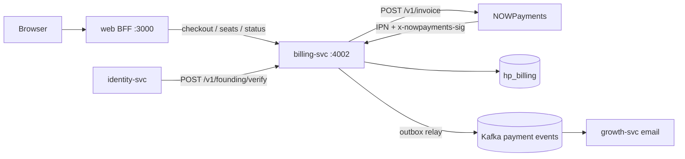
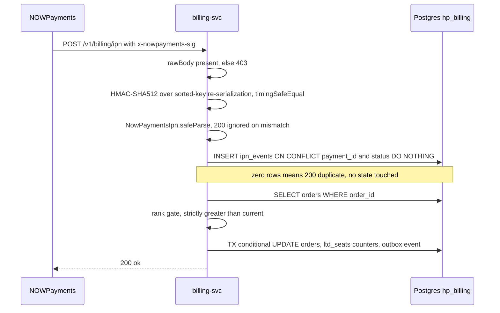
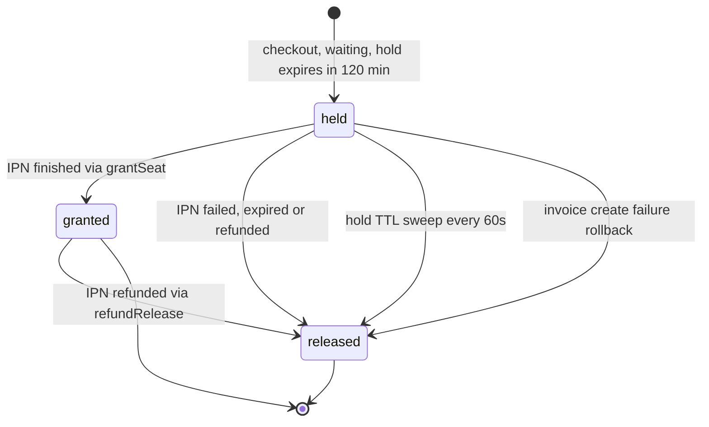

# billing-svc

This document is the code-level reference for `apps/services/billing` — the service that owns the one-time Founding Hero lifetime-deal purchase: finite seat inventory, time-boxed seat holds, NOWPayments invoice creation, signed IPN ingestion, the order status machine, hold expiry, and the purchase-verification endpoint identity-svc calls during account redemption. It is for an engineer who joined today: every behavioural claim carries a `path:line` citation, and every constant is stated as the code states it. Read [01-architecture.md](../01-architecture.md) for the topology and [03-flows.md](../03-flows.md) for the cross-service purchase sequence.

- Port **4002**, database **`hp_billing`** (`apps/services/billing/src/common/config.ts:19,23`; `infra/compose/docker-compose.yml:187-188`).
- NestJS 11 on Fastify with a **custom raw-body JSON parser**, run directly from TypeScript by `tsx`. `tsconfig.build.json` inherits `noEmit: true` from `apps/services/billing/tsconfig.json`, so `build` produces no output and the container runs the sources (`apps/services/billing/tsconfig.build.json:1-4`, `apps/services/billing/Dockerfile`).
- **There is no guard, interceptor or auth middleware anywhere in this service.** The only credentials in play are the NOWPayments IPN HMAC header and the customer status token (`apps/services/billing/src/app.module.ts:45-70`).

## Pricing — say it plainly

**The Founding Hero lifetime deal is a flat $499. There is no seat-price ladder, no tiering, and no price that changes with the number of seats sold — not in this service and not anywhere in the repository.** Seat #1 and seat #500 cost exactly the same amount.

| Constant | Value | Source |
|---|---|---|
| `LTD.SKU` | `ltd_founding` | `packages/contracts/src/index.ts:293` |
| `LTD.PRICE_USD_DEFAULT` | **499 USD** | `packages/contracts/src/index.ts:294` |
| `LTD.SEAT_CAP` | **500 seats** | `packages/contracts/src/index.ts:295` |
| `LTD.HOLD_TTL_MINUTES` | **120 minutes** | `packages/contracts/src/index.ts:296` |
| effective price | `Number(env.LTD_PRICE_USD ?? 499)` — one value, read once at boot | `apps/services/billing/src/common/config.ts:34`, used at `apps/services/billing/src/founding/founding.service.ts:53,63,82,107` |
| stored price | `price_usd_minor = Math.round(price × 100)` = **49900** | `apps/services/billing/src/founding/founding.service.ts:53`, `apps/services/billing/src/db/schema.ts:27` |

The only thing in billing that is a **ladder** is `PAYMENT_STATUS_RANK` — the out-of-order IPN arbitration table (`packages/contracts/src/index.ts:195-198`). That is what `apps/services/billing/test/ladder.test.ts` exercises, and it has nothing to do with price. If you see "ladder" in a commit message or a ticket, it means the status ranks.

---

## 1. Responsibility and boundaries

### Owns

| Concern | Where |
|---|---|
| Seat inventory: cap, `granted`, `held` counters | `apps/services/billing/src/db/repo.ts:97-104,106-126,180-229,247-274` |
| Order creation with a 120-minute seat hold | `apps/services/billing/src/founding/founding.service.ts:34-111` |
| Outbound invoice creation at NOWPayments | `apps/services/billing/src/nowpayments/client.ts:36-53` |
| Inbound IPN signature verification and the status machine | `apps/services/billing/src/ipn/signature.ts:20-42`, `apps/services/billing/src/ipn/ipn.service.ts:20-131` |
| Hold expiry sweeping | `apps/services/billing/src/founding/holds.job.ts:11-33`, `apps/services/billing/src/db/repo.ts:247-274` |
| The customer-facing HMAC status token | `apps/services/billing/src/common/token.ts:8-33` |
| Purchase verification for identity-svc | `apps/services/billing/src/founding/founding.service.ts:208-215` |
| Six `order.*` / `payment.*` events on `hp.payment.events.v1` | `apps/services/billing/src/outbox/outbox.service.ts:17-19` |

### Explicitly does not own

| Not owned | Who owns it | Why billing does not |
|---|---|---|
| Accounts, passwords, sessions | identity-svc | billing has no user table. It answers `{ok, sku}` and identity decides what to create — see [identity §3.2](./identity.md#32-account-creation-post-v1authredeem). |
| Entitlements and limits | `PACKAGES` in contracts, reported by identity | billing stores `orders.sku` and nothing more (`apps/services/billing/src/db/schema.ts:26`) |
| Any email — receipts, refund notices, expiry nudges | growth-svc | growth consumes the Kafka events. See [growth-messaging](./growth-messaging.md). |
| Referral commissions | growth-svc | billing only persists `orders.ref_code` (`apps/services/billing/src/founding/founding.service.ts:55`); it never computes a payout |
| Money movement and refunds at the provider | NOWPayments | billing reacts to IPNs; it never calls a refund API |
| Rate limiting | the web BFF | billing has none — see [Hazard G9](#g9-no-rate-limiting-anywhere-in-billing) |

### Boot sequence

`loadConfig()` → **`migrate(databaseUrl, ltdSeatCap)` before the runtime pool is even opened** → `createDb` → `PgBillingRepo` → Nest app on `rawBodyFastifyAdapter()` → start `OutboxRelay` → start `HoldsJob` → listen on `0.0.0.0:port` (`apps/services/billing/src/main.ts:13-43`). Shutdown on SIGINT/SIGTERM: holds → relay → app → pool → `process.exit(0)` (`apps/services/billing/src/main.ts:31-39`).



---

## 2. Module map

The **File** column omits the `apps/services/billing/` prefix for readability; every citation in the other columns is a complete path.

### `apps/services/billing/src/`

| File | Purpose | Key exports |
|---|---|---|
| `main.ts` | Bootstrap; migration runs first, background jobs start after Nest boots (`apps/services/billing/src/main.ts:13-43`) | — |
| `app.module.ts` | Module **factory** — `tsx`/esbuild emits no `design:paramtypes`, so providers are token-wired — plus the raw-body Fastify adapter | `createAppModule` (`apps/services/billing/src/app.module.ts:40`), `rawBodyFastifyAdapter` (`:81`), `BILLING_REPO`/`INVOICE_CLIENT`/`BILLING_CONFIG` (`:16-18`), `HealthController` (`:21`) |

### `apps/services/billing/src/common/`

| File | Purpose | Key exports |
|---|---|---|
| `config.ts` | The only file that reads `process.env`. All 11 variables have defaults (`apps/services/billing/src/common/config.ts:17-37`) | `BillingConfig`, `loadConfig` (`:17`), `TENANT_ID` (`:39`) |
| `token.ts` | The status-token scheme (`apps/services/billing/src/common/token.ts:8-33`) | `signStatusToken` (`:8`), `verifyStatusToken` (`:14`) |
| `errors.ts` | `ApiError`-shaped exceptions plus the global catch-all filter (`apps/services/billing/src/common/errors.ts:5-38`) | `ApiException` (`:5`), `ApiExceptionFilter` (`:18`) |

### `apps/services/billing/src/founding/`

| File | Purpose | Key exports |
|---|---|---|
| `founding.service.ts` | Seats, checkout, status, purchase verification — the business core (`apps/services/billing/src/founding/founding.service.ts:18-162`) | `FoundingService` (`:18`), `FoundingVerifyRes` (`:162`) |
| `seats.controller.ts` | `GET /v1/founding/seats` (`apps/services/billing/src/founding/seats.controller.ts:9-12`) | `SeatsController` |
| `checkout.controller.ts` | `POST /v1/founding/checkout`, `@HttpCode(200)` (`apps/services/billing/src/founding/checkout.controller.ts:9-13`) | `CheckoutController` |
| `status.controller.ts` | `GET /v1/founding/status?token=` (`apps/services/billing/src/founding/status.controller.ts:9-12`) | `StatusController` |
| `verify.controller.ts` | `POST /v1/founding/verify`, `@HttpCode(200)`, no auth (`apps/services/billing/src/founding/verify.controller.ts:9-13`) | `VerifyController` |
| `holds.job.ts` | 60 s hold-expiry sweeper (`apps/services/billing/src/founding/holds.job.ts:6-34`) | `HoldsJob` (`:6`) |

### `apps/services/billing/src/ipn/`

| File | Purpose | Key exports |
|---|---|---|
| `ipn.controller.ts` | `POST /v1/billing/ipn`; reads `req.rawBody` and `x-nowpayments-sig` (`apps/services/billing/src/ipn/ipn.controller.ts:14-19`) | `IpnController` |
| `ipn.service.ts` | The IPN state machine: dedupe, rank gate, seat transition (`apps/services/billing/src/ipn/ipn.service.ts:20-131`) | `IpnService` (`:14`), `IpnResult` (`:12`) |
| `signature.ts` | The exact NOWPayments HMAC-SHA512 algorithm (`apps/services/billing/src/ipn/signature.ts:8-42`) | `signIpn` (`:8`), `verifyIpn` (`:20`) |

### `apps/services/billing/src/nowpayments/`, `src/db/`, `src/outbox/`

| File | Purpose | Key exports |
|---|---|---|
| `nowpayments/client.ts` | The single outbound HTTP call; deliberately tolerant response schema (`apps/services/billing/src/nowpayments/client.ts:16-54`) | `InvoiceClient` (`:16`), `NowPaymentsClient` (`:30`), `InvoiceRequest`, `Invoice` |
| `db/repo.ts` | Row types, the `BillingRepo` interface (`apps/services/billing/src/db/repo.ts:61-88`), and the concurrency-critical Postgres implementation (`:94-290`) | `BillingRepo`, `PgBillingRepo`, `OrderRow`, `SeatCounts`, `PaymentPatch`, `IpnEventInsert`, `OutboxInsert` |
| `db/schema.ts` | Drizzle tables `ltd_seats`, `orders`, `ipn_events`, `outbox` (`apps/services/billing/src/db/schema.ts:13-61`) | `ltdSeats`, `orders`, `ipnEvents`, `outbox` |
| `db/migrate.ts` | Bootstrap DDL plus the one-time seat seed (`apps/services/billing/src/db/migrate.ts:52-65`) | `migrate` (`:53`) |
| `db/client.ts` | `pg` Pool (`max: 10`) plus drizzle instance (`apps/services/billing/src/db/client.ts:7-11`) | `Db`, `createDb` |
| `outbox/outbox.service.ts` | Envelope construction; pins every event to the payment topic (`apps/services/billing/src/outbox/outbox.service.ts:6-19`) | `makeEnvelope` (`:6`), `paymentEvent` (`:17`) |
| `outbox/relay.ts` | 2 s polling relay: outbox rows → Kafka → `sent_at` (`apps/services/billing/src/outbox/relay.ts:12-85`) | `OutboxRelay` (`:12`) |

### `apps/services/billing/test/`

| File | Role |
|---|---|
| `mem-repo.ts` | In-memory `BillingRepo` reproducing every state guard (`apps/services/billing/test/mem-repo.ts`) |
| `signature.test.ts`, `ladder.test.ts`, `seats.test.ts`, `ipn.controller.test.ts`, `verify.test.ts` | See §7 |

### The raw-body adapter is load-bearing

`rawBodyFastifyAdapter()` calls `adapter.useBodyParser("application/json", true, {}, parser)` (`apps/services/billing/src/app.module.ts:87-100`). The second argument — the `rawBody` flag — is what puts the exact received bytes on `request.rawBody`, and registering a parser here also stops `app.init()` from stacking a conflicting default JSON parser on top (`apps/services/billing/src/app.module.ts:83-86`). The parser itself decodes UTF-8, returns `{}` for an empty body, and forwards a `JSON.parse` failure to `done(err)` (`:92-98`). Remove that `true` and **every** IPN starts returning `403` at `apps/services/billing/src/ipn/ipn.service.ts:21`, because `req.rawBody` is `undefined`.

---

## 3. Feature walkthroughs

### 3.1 Cryptographic primitives (read this first)

**Status token** (`apps/services/billing/src/common/token.ts:8-12`):

```
token = base64url(JSON.stringify(payload)) + "." + hex(HMAC_SHA256(base64urlPayload, STATUS_TOKEN_SECRET))
```

The MAC is computed over the **base64url body string**, not the raw JSON. Billing's payload is exactly `{o: "<order_id>"}` (`apps/services/billing/src/founding/founding.service.ts:77`), so a real token is 36 body characters, a `.`, and 64 hex characters — 101 characters.

Verification (`apps/services/billing/src/common/token.ts:14-33`): split on the **first** `.`; reject `dot <= 0` or a dot in the final position (`:19`); lowercase the supplied MAC (`:21`); recompute; length-check then `timingSafeEqual` over the utf8 hex buffers (`:23-25`); then `JSON.parse` the body and reject arrays, `null` and non-objects (`:27-29`). There is **no `exp`, no `iat`, no `jti`, no nonce** — see [Hazard G6](#g6-status-tokens-never-expire).

**IPN signature** (`apps/services/billing/src/ipn/signature.ts:8-11`):

```
sig = hex(HMAC_SHA512(JSON.stringify(body, Object.keys(body).sort()), NOWPAYMENTS_IPN_SECRET))
```

`JSON.stringify`'s replacer-**array** form both filters and orders the properties, so key sorting is **top-level only** — nested objects keep insertion order. This matches the provider double byte-for-byte (`infra/mocks/nowpayments/src/server.mjs`).

`verifyIpn(raw, headerSig, secret)` (`apps/services/billing/src/ipn/signature.ts:20-42`): `JSON.parse` the raw bytes, where a parse failure, an array, or `null` is invalid (`:26-33`); a missing header is invalid but the parsed body is still returned for logging (`:35`); recompute over the **re-serialized parsed object** (`:37`); `.trim().toLowerCase()` the header; length-check then `timingSafeEqual` (`:38-41`).

### 3.2 Seat inventory: `GET /v1/founding/seats`

`apps/services/billing/src/founding/seats.controller.ts:9-12` → `FoundingService.seats()` (`apps/services/billing/src/founding/founding.service.ts:25-32`):

```
remaining = max(0, cap − granted − held)
```

`getSeats` reads the single `ltd_seats` row for `TENANT_ID = "heropips"` and **throws** `Error("ltd_seats row missing — boot migration did not run")` if it is absent (`apps/services/billing/src/db/repo.ts:97-104`), which the global filter turns into `500 internal`. Public and uncached at the service; the web BFF adds `public, s-maxage=5, stale-while-revalidate=10` (`apps/web/app/api/founding/seats/route.ts:11`).

There is exactly **one row** in `ltd_seats`, and every seat mutation contends on it — that row is a deliberate global serialization point (§3.6).

### 3.3 Checkout: `POST /v1/founding/checkout`

Entry: `apps/services/billing/src/founding/checkout.controller.ts:9-13`. The body arrives as `unknown` and zod is the only validation layer — there is no Nest `ValidationPipe`.

Steps (`apps/services/billing/src/founding/founding.service.ts:34-111`):

1. **Validate** — `CheckoutReq.safeParse` (`packages/contracts/src/index.ts:173-177`): `email` trimmed, lowercased, RFC-email, ≤254; optional `pay_currency` trimmed, lowercased, ≤20; optional `ref` matching `/^[A-Z0-9]{4,12}$/i`. Failure is `422 validation_failed` with the **first** zod issue message and remediation `"Check the request body and retry."` (`:36-43`).
2. **Generate the order id** — `` `hp_ltd_${randomBytes(6).toString("hex")}` `` = `hp_ltd_` plus 12 hex characters, i.e. **48 bits** of entropy, 19 characters total (`:46`).
3. **Compute the hold deadline** — `expiresAt = new Date(Date.now() + LTD.HOLD_TTL_MINUTES * 60_000)` = **now + 120 minutes** (`:47`). Note this uses `Date.now()` directly, not an injected clock.
4. **Take the seat and write the order in one transaction** — `createHeldOrder({orderId, email, priceUsdMinor: 49900, payCurrency: pay_currency ?? null, refCode: ref?.toUpperCase() ?? null, holdExpiresAt}, [order.created event])` (`:49-67`). Inside the transaction (`apps/services/billing/src/db/repo.ts:106-126`):
   - `UPDATE ltd_seats SET held = held + 1 WHERE tenant_id = $1 AND granted + held < cap RETURNING cap` — **the cap check is the UPDATE predicate**. Zero rows returned means `"sold_out"`, and the transaction returns before inserting anything (`:108-113`).
   - `INSERT INTO orders …` with the schema defaults `payment_status = 'waiting'`, `seat_state = 'held'`, `sku = 'ltd_founding'` (`:114-122`, `apps/services/billing/src/db/migrate.ts:17-20`).
   - `INSERT INTO outbox` with the `order.created` envelope (`:123`).
5. **Sold out** → `410 ltd_sold_out`, `"All Founding Hero seats are taken."`, remediation `"Join the early access list to hear about future openings."` (`:68-75`).
6. **Mint the status token** — `signStatusToken({o: orderId}, cfg.statusTokenSecret)` (`:77`).
7. **Create the invoice** — `POST {NOWPAYMENTS_API_URL}/v1/invoice` with headers `content-type: application/json` and `x-api-key`, `AbortSignal.timeout(10_000)`, **no retry and no backoff** (`apps/services/billing/src/nowpayments/client.ts:37-42`). Body (`apps/services/billing/src/founding/founding.service.ts:81-90`):

   | Field | Value |
   |---|---|
   | `price_amount` | `cfg.ltdPriceUsd` = 499 |
   | `price_currency` | `"usd"` |
   | `order_id` | the generated `hp_ltd_…` |
   | `order_description` | `"HeroPips Founding Hero — lifetime access"` |
   | `ipn_callback_url` | `cfg.ipnCallbackUrl` |
   | `success_url` | `` `${PUBLIC_ORIGIN}/founding/status?token=${encodeURIComponent(statusToken)}` `` |
   | `cancel_url` | `` `${PUBLIC_ORIGIN}/founding` `` |
   | `pay_currency` | included **only** when the request supplied it |

   Response handling is deliberately tolerant (`apps/services/billing/src/nowpayments/client.ts:21-51`): non-2xx throws `Error("nowpayments invoice create failed: HTTP <status>")` (`:43-45`); `id` may be a number or a string and may arrive as `invoice_id` (`:23,25,47`); `invoiceUrl` falls back to `` `${baseUrl}/invoice/${id}` `` when `invoice_url` is absent (`:48`); missing both throws (`:49-51`).
8. **Rollback on any invoice failure** — `await this.repo.releaseHold(orderId, {})` then `502 invoice_create_failed`, `"Could not create the payment invoice."`, remediation `"Try again in a moment."` (`:91-100`). The empty patch is why the row keeps `payment_status = 'waiting'` — see [Hazard G14](#g14-invoice-failure-rollback-leaves-a-zombie-order).
9. **Persist the invoice** — `setInvoice(orderId, invoice.id, invoice.invoiceUrl)`, a single statement outside any transaction (`:102`, `apps/services/billing/src/db/repo.ts:150-155`).
10. **Respond** `200 CheckoutRes` = `{order_id, invoice_url, price_usd: 499, expires_at, status_token}` (`:104-110`, `packages/contracts/src/index.ts:180-186`).

```mermaid
sequenceDiagram
  participant C as Client via BFF
  participant B as billing-svc
  participant P as Postgres hp_billing
  participant N as NOWPayments
  C->>B: POST /v1/founding/checkout with email, pay_currency, ref
  B->>B: CheckoutReq.safeParse, 422 on failure
  B->>B: order_id = hp_ltd_ plus 12 hex; expires_at = now + 120 min
  B->>P: TX UPDATE ltd_seats SET held=held+1 WHERE granted+held<cap
  Note over B,P: zero rows means 410 ltd_sold_out, nothing written
  B->>P: TX INSERT orders waiting/held plus outbox order.created
  B->>B: signStatusToken with payload o=order_id
  B->>N: POST /v1/invoice, 10s timeout, no retry
  Note over B,N: any error releases the hold then 502
  B->>P: UPDATE orders SET invoice_id, invoice_url
  B-->>C: 200 order_id, invoice_url, price_usd 499, expires_at, status_token
```

### 3.4 Status: `GET /v1/founding/status?token=`

`apps/services/billing/src/founding/status.controller.ts:9-12` → `FoundingService.status(token)` (`apps/services/billing/src/founding/founding.service.ts:176-200`). `@Query("token")` is optional, so a missing token reaches the service and fails there. The chain is `verifyStatusToken` → `payload.o` must be a `string` → `getOrder(orderId)` (`:177-179`). Any failure in that chain — missing token, bad MAC, non-string `o`, unknown order — collapses to the **same** `401 invalid_token`, `"Status token is missing or invalid."`, remediation `"Use the link from your checkout confirmation."` (`:117-124`). No detail leaks about which step failed.

The response is `OrderStatusRes` (`packages/contracts/src/index.ts:217-231`) with `price_usd = order.priceUsdMinor / 100` and `sku` hard-coded to the literal `"ltd_founding"` (`apps/services/billing/src/founding/founding.service.ts:189,130`).

### 3.5 IPN ingestion: `POST /v1/billing/ipn`

Entry: `apps/services/billing/src/ipn/ipn.controller.ts:14-19`, reading `req.rawBody` (attached by the custom parser) and collapsing an array-valued `x-nowpayments-sig` header to its first element. The request type is declared structurally to avoid importing `fastify` (`:5-8`).

`IpnService.handle` (`apps/services/billing/src/ipn/ipn.service.ts:20-75`), in order:

1. **Empty body** → `403 ipn_signature_invalid`, `"IPN signature verification failed."` (`:21-23`).
2. **Signature** → `verifyIpn`; `!valid` → the same `403` (`:24-27`). Both failures share one message, so a forger learns nothing.
3. **Shape** → `NowPaymentsIpn.safeParse` (`packages/contracts/src/index.ts:215-232`, `.passthrough()` because the provider adds fields and the signature covers the full body). A signed body that fails the shape gets a `console.warn` and `200 {ok:true, ignored:true}` (`:29-34`) — deliberate, so the provider stops retrying.
4. **Idempotency** → `insertIpnEvent({paymentId, paymentStatus, orderId, raw: body, sigValid: true})`, which is `INSERT … ON CONFLICT (payment_id, payment_status) DO NOTHING RETURNING id` (`apps/services/billing/src/db/repo.ts:231-245`). A `false` return means the row already existed, so `200 {ok:true, duplicate:true}` and **nothing else runs** (`:38-45`). The full raw provider body is persisted in `ipn_events.raw`, amounts included.
5. **Unknown order** → `console.warn` and `200 {ok:true, ignored:true}` (`:47-52`).
6. **Amount patch** → `actually_paid`, `purchase_id` and `pay_currency` are copied into `paidPatch` only when present in the IPN (`:54-57`).
7. **Rank gate** — `if (!(PAYMENT_STATUS_RANK[incoming] > PAYMENT_STATUS_RANK[order.paymentStatus]))` the IPN is ignored, with **one exception**: `partially_paid` still calls `updatePayment(orderId, paidPatch)` to record amounts without changing status (`:59-67`). This is the only place a non-advancing IPN mutates the order.
8. **Apply** — the seat and status transition (`:69-74`), then `200 {ok:true}`.

`PAYMENT_STATUS_RANK` (`packages/contracts/src/index.ts:195-198`) — the comparison is **strictly greater**, so equal ranks never reapply:

| status | rank |
|---|---|
| `waiting` | 0 |
| `confirming` | 1 |
| `confirmed` | 2 |
| `partially_paid` | **2.5** |
| `sending` | 3 |
| `finished` | **4** |
| `failed` | **4** |
| `expired` | **4** |
| `refunded` | 5 |

The three-way tie at rank 4 is load-bearing and causes a real bug — see [Hazard G3](#g3-expired-failed-and-finished-all-rank-4-so-late-payments-are-silently-dropped).

`apply()` (`apps/services/billing/src/ipn/ipn.service.ts:77-131`) branches on the incoming status **and** the current `seat_state`:

| Incoming | `seat_state = held` | `seat_state = granted` | `seat_state = released` |
|---|---|---|---|
| `finished` (4) | `grantSeat` → `(finished, granted)`, `held−1, granted+1`, emit `payment.finished` (`:94-95`) | unreachable through the gate: status is already `finished` at rank 4, so the tie ignores it | `updatePayment({paymentStatus: "finished"})` plus `payment.finished`, **seat NOT re-granted** (`:97`) — reachable, see [G5](#g5-entitlement-without-a-counted-seat) |
| `expired` / `failed` (4) | `releaseHold` → `(status, released)`, `held−1`, emit `payment.expired` or `payment.failed` (`:106-107`) | `updatePayment` plus event, seat stays granted (`:109`) | `updatePayment` plus event (`:109`) |
| `refunded` (5) | `releaseHold` → `(refunded, released)`, `held−1`, emit `payment.refunded` (`:120-121`) | `refundRelease` → `(refunded, released)`, `granted−1`, emit `payment.refunded` (`:118-119`) | `updatePayment` plus event (`:123`) |
| `waiting`, `confirming`, `confirmed`, `sending`, `partially_paid` | `updatePayment` with the new status and **no events** (`:127-129`) | same | same |

Every repo return value is discarded — see [Hazard G13](#g13-repo-return-values-are-discarded).



### 3.6 Order lifecycle and how double-granting is prevented

Start state after checkout is **`(waiting, held)`** with `hold_expires_at = now + 120 min`.



`released` and `granted` are **terminal** — nothing in the codebase moves a seat back to `held`.

Double-granting is prevented by four independent layers, in the order they fire:

1. **Exactly-once IPN ingestion.** The unique index `(payment_id, payment_status)` (`apps/services/billing/src/db/migrate.ts:40`, named `ipn_events_payment_id_payment_status_key` in Drizzle at `apps/services/billing/src/db/schema.ts:52`) is the arbiter. `insertIpnEvent` returns `false` on conflict and `handle()` exits before reading any state (`apps/services/billing/src/db/repo.ts:242-244`, `apps/services/billing/src/ipn/ipn.service.ts:45`). Two concurrent identical deliveries — even on different processes — cannot both proceed. Asserted at `apps/services/billing/test/ipn.controller.test.ts:112-133`.
2. **Strict-rank monotonicity.** A *different* `payment_id` carrying the same `finished` status passes layer 1 but fails the strict rank comparison, because the order is already `finished` at rank 4 (`apps/services/billing/src/ipn/ipn.service.ts:61`). Asserted at `apps/services/billing/test/seats.test.ts:117-134`: seats stay `{granted: 1, held: 0}` and no second `payment.finished` appears.
3. **Conditional UPDATE with a state predicate, inside the transaction.** `grantSeat` runs `UPDATE orders SET …, payment_status='finished', seat_state='granted' WHERE order_id = $1 AND seat_state = 'held' RETURNING id`; zero rows means return `false` **before** touching `ltd_seats` and **before** inserting the outbox event (`apps/services/billing/src/db/repo.ts:182-194`). `releaseHold` (`:199-204`) and `refundRelease` (`:216-221`) use the identical pattern with `held` and `granted` predicates, so release and refund are equally single-shot. *[INFERENCE]* Two transactions that slip past layers 1–2 simultaneously serialize on the `orders` row lock, and the loser re-evaluates the predicate against the winner's committed row under Postgres' `READ COMMITTED` EvalPlanQual behaviour; what the **code** guarantees directly is the predicate plus `RETURNING` plus the transaction envelope.
4. **Counters mutated by SQL expression, never read-modify-write.** `held = held + 1` (`apps/services/billing/src/db/repo.ts:109`), `held − 1, granted + 1` (`:190`), `held − 1` (`:207`), `granted − 1` (`:224`), `held −` the released count (`:263`) — all evaluated by Postgres under the `ltd_seats` row lock, all in the same transaction as the order-row change, so counters and order states cannot diverge. The cap check lives in the predicate itself, which is why `apps/services/billing/test/seats.test.ts:53-72` can assert exactly 500 creations and 100 sold-outs against a cap of 500.

**Transaction boundaries.** Inside `db.transaction`: `createHeldOrder` (`apps/services/billing/src/db/repo.ts:107`), `updatePayment` (`:174`), `grantSeat` (`:181`), `releaseHold` (`:198`), `refundRelease` (`:215`), `expireHolds` (`:248`). Outside: `getSeats` (`:97`), `getOrder` (`:128`), `setInvoice` (`:150`), `insertIpnEvent` (`:231`), `fetchUnsentOutbox` (`:276`), `markOutboxSent` (`:286`).

**Money handling.** Price is an `int` in minor units; `actually_paid` is `numeric`, written via `String(...)` (`:160`) and read back with `Number(...)` (`:142`).

### 3.7 Purchase verification for identity-svc: `POST /v1/founding/verify`

`apps/services/billing/src/founding/verify.controller.ts:9-13` → `FoundingService.verifyPurchase` (`apps/services/billing/src/founding/founding.service.ts:208-215`). The request schema is declared locally: `{email: trim/lowercase/≤320, order_id: trim/1..120}` (`:219-222`). It **always** returns `200`, and `{ok:false}` carries no detail, so the endpoint cannot be used to distinguish "no such order" from "wrong email":

| Condition | Result | Line |
|---|---|---|
| body fails the schema | `{ok:false}` | `:146` |
| order id unknown | `{ok:false}` | `:148` |
| `order.email.toLowerCase() !== parsed.email` | `{ok:false}` | `:149` |
| `payment_status` is neither `finished` **nor `confirmed`** | `{ok:false}` | `:150-152` |
| otherwise | `{ok:true, sku: order.sku}` | `:153` |

Accepting `confirmed` grants entitlement before payment finality — see [Hazard G4](#g4-confirmed-rank-2-grants-entitlement-before-finality). The endpoint also has **no authentication** — see [G15](#g15-v1foundingverify-is-unauthenticated). The caller's side of this exchange is documented at [identity §3.2](./identity.md#32-account-creation-post-v1authredeem).

### 3.8 Hold expiry sweeper

`HoldsJob` (`apps/services/billing/src/founding/holds.job.ts`): `TICK_MS = 60_000` (`:3`); `setInterval` plus `timer.unref()` so it never holds the event loop open (`:13-14`); `stop()` clears it (`:17-20`). Each tick calls `repo.expireHolds(new Date())`, logs `[billing] hold expiry: released N seat hold(s)` when `N > 0`, and swallows errors with a `console.warn` (`:22-33`).

`expireHolds` is one transaction (`apps/services/billing/src/db/repo.ts:247-274`):

```sql
UPDATE orders SET seat_state='released', payment_status='expired', updated_at=$now
WHERE seat_state='held' AND hold_expires_at < $now AND payment_status <> 'finished'
RETURNING order_id, email
```

then `held = held -` the released count (`:263`) and one `order.hold_expired` outbox event per released row (`:265-270`). The partial index `orders_hold_expiry_idx ON orders (hold_expires_at) WHERE seat_state = 'held'` (`apps/services/billing/src/db/migrate.ts:31`) serves exactly this predicate. There is **no `LIMIT`, no jitter and no leader election** — every replica sweeps, which is safe only because the `seat_state='held'` guard makes the second sweeper's UPDATE match zero rows.

### 3.9 Outbox relay

`makeEnvelope` stamps `{event_id: randomUUID(), type, occurred_at: ISO now, tenant_id: "heropips", payload}` (`apps/services/billing/src/outbox/outbox.service.ts:6-14`); `paymentEvent` pins `TOPICS.paymentEvents` (`:17-19`).

`OutboxRelay` (`apps/services/billing/src/outbox/relay.ts`): `TICK_MS = 2_000`, `WARN_EVERY_MS = 30_000` (`:4-5`); `start()` is idempotent with an `unref()`ed timer (`:24-28`); re-entrancy guard `ticking` (`:40-41,:82`); `fetchUnsentOutbox(100)` with an **early return when empty** so Kafka is never contacted while idle (`:43-44`); lazy `new Kafka({clientId: "hp-billing", logLevel: NOTHING, retry: {retries: 1}})` and `producer({allowAutoTopicCreation: true})` (`:45-53`); per row `producer.send` with `key = payload.order_id ?? envelope.event_id` then `markOutboxSent([row.id])` — **at-least-once** with a duplicate window on crash (`:58-70`); on error `connected = false` and a warn at most once per 30 s, never rethrowing (`:71-83`).

### 3.10 Error handling

`ApiException` carries the contracts `ApiError` body verbatim (`apps/services/billing/src/common/errors.ts:5-14`, `packages/contracts/src/index.ts:43-46`). `ApiExceptionFilter` is `@Catch()` and registered as `APP_FILTER` (`apps/services/billing/src/common/errors.ts:17-38`, `apps/services/billing/src/app.module.ts:69`): `HttpException` bodies that already carry `error_code` pass through with their status; those without become `{error_code: "internal", message}`; anything else is logged and flattened to `500 {error_code: "internal", message: "Unexpected error."}`. That is what guarantees no raw NOWPayments error text ever reaches a customer.

| `error_code` | Status | Trigger |
|---|---|---|
| `validation_failed` | 422 | `CheckoutReq` failure (`apps/services/billing/src/founding/founding.service.ts:37-42`) |
| `ltd_sold_out` | 410 | cap exhausted (`:69-75`) |
| `invoice_create_failed` | 502 | any `createInvoice` throw, after the hold rollback (`:94-100`) |
| `invalid_token` | 401 | missing, malformed or unknown status token (`:118-124`) |
| `ipn_signature_invalid` | 403 | empty raw body, or a bad or missing signature (`apps/services/billing/src/ipn/ipn.service.ts:22,26`) |
| `internal` | 500 | missing `ltd_seats` row, or any non-`HttpException` (`apps/services/billing/src/db/repo.ts:102`, `apps/services/billing/src/common/errors.ts:37`) |

Full request and response contracts for all six routes are in [05-api-reference.md](../05-api-reference.md); the threat model is in [06-security.md](../06-security.md).

---

## 4. Data

Database `hp_billing`. The physical schema is the DDL string in `apps/services/billing/src/db/migrate.ts:4-51`, executed on **every boot** via a dedicated `Pool({max: 2})` closed in `finally` (`:53-65`), followed by the seat seed:

```sql
INSERT INTO ltd_seats (tenant_id, cap) VALUES ($1, $2) ON CONFLICT (tenant_id) DO NOTHING
```

The cap is therefore seeded **once, ever** — see [Hazard G1](#g1-the-seat-cap-is-seeded-once-and-the-cap-env-var-is-then-ignored). The versioned mirror lives in `infra/sql/billing/0001_init.sql` and is applied by `scripts/db.mjs` — see [07-infrastructure.md](../07-infrastructure.md). Note that `pnpm db:seed` ships demo data only for growth and trading (`infra/sql/seed/growth.sql`, `infra/sql/seed/trading.sql`); there is **no** billing seed, so a fresh local stack has zero orders and a full 500-seat inventory.

Tables owned — column and index detail in [02-data-model.md](../02-data-model.md):

| Table | Role | Load-bearing constraints |
|---|---|---|
| `ltd_seats` | the seat ledger: exactly one row, `tenant_id = 'heropips'` | `cap`, `granted`, `held`. The invariant `granted + held ≤ cap` is enforced **only** in the UPDATE predicate at `apps/services/billing/src/db/repo.ts:110`, never by a database constraint. `checksum` is declared (`apps/services/billing/src/db/migrate.ts:10`, `apps/services/billing/src/db/schema.ts:18`) and never read or written by any code — see [G2](#g2-the-seat-checksum-column-is-dead-and-nothing-reconciles-the-counters) |
| `orders` | one row per checkout | `order_id text UNIQUE` (`apps/services/billing/src/db/migrate.ts:14`); `CHECK (seat_state IN ('held','granted','released'))` (`:20`); **`payment_status` has no CHECK constraint** (`:19`) — only zod guards it. Partial index `orders_hold_expiry_idx ON (hold_expires_at) WHERE seat_state='held'` (`:31`) |
| `ipn_events` | the provider ledger and replay guard | **`UNIQUE (payment_id, payment_status)`** (`:40`) is the idempotency key; `raw jsonb NOT NULL` keeps the complete provider body (`:37`); `sig_valid boolean` (`:38`) — see [G8](#g8-a-failed-signature-is-never-recorded-and-the-ledger-insert-is-outside-the-apply-transaction) |
| `outbox` | pending Kafka envelopes | Partial index `outbox_unsent_idx ON (created_at) WHERE sent_at IS NULL` (`:49`) matches `fetchUnsentOutbox` exactly (`apps/services/billing/src/db/repo.ts:276-284`) |

---

## 5. Events

Billing produces six event types on **one** topic and **consumes nothing** — there is no Kafka consumer in the service.

**Topic:** `hp.payment.events.v1` (`TOPICS.paymentEvents`, `packages/contracts/src/index.ts:246`), pinned for every event by `apps/services/billing/src/outbox/outbox.service.ts:17-19`.
**Envelope:** `{event_id, type, occurred_at, tenant_id: "heropips", payload}` (`apps/services/billing/src/outbox/outbox.service.ts:6-14`).
**Kafka key:** `payload.order_id ?? envelope.event_id` (`apps/services/billing/src/outbox/relay.ts:64`), so all events for one order land on the same partition and stay ordered.

| `type` | Emitted where | Payload (exact keys) |
|---|---|---|
| `order.created` | checkout, in the same transaction as the hold (`apps/services/billing/src/founding/founding.service.ts:59-65`) | `{order_id, email, sku: "ltd_founding", price_usd, expires_at}` |
| `order.hold_expired` | the sweeper, one per released row (`apps/services/billing/src/db/repo.ts:265-270`) | `{order_id, email}` |
| `payment.finished` | IPN `finished` (`apps/services/billing/src/ipn/ipn.service.ts:86-93`) | `{order_id, email, sku, price_usd}` |
| `payment.expired` | IPN `expired` (`:103-105`, via `PAYMENT_EVENTS[status]`) | `{order_id, email}` |
| `payment.failed` | IPN `failed` (same line) | `{order_id, email}` |
| `payment.refunded` | IPN `refunded` (`:177-179`) | `{order_id, email}` |

Names come from `PAYMENT_EVENTS` (`packages/contracts/src/index.ts:261-270`).

**Consumer:** growth-svc's `MessagingConsumer` subscribes to the topic and routes each type to an email handler (`apps/services/growth/src/messaging/consumer.ts`, `apps/services/growth/src/messaging/messaging.service.ts`). Delivery is at-least-once; growth dedupes on its own send-ledger keys. See [growth-messaging](./growth-messaging.md) and [03-flows.md](../03-flows.md).

**Not emitted:** nothing for `waiting`, `confirming`, `confirmed`, `sending` or `partially_paid` — the `default` branch calls `updatePayment` with no events array (`apps/services/billing/src/ipn/ipn.service.ts:127-129`). "Payment in progress" email is impossible without a code change.

---

## 6. Configuration

Every `process.env` read is in `apps/services/billing/src/common/config.ts:17-37`. **All 11 variables have defaults — nothing is strictly required to boot**, which is precisely the risk: the two HMAC secrets silently fall back to well-known development values.

| Env var | Default | Required? | Notes |
|---|---|---|---|
| `BILLING_PORT` | falls through to `PORT`, then `4002` (`apps/services/billing/src/common/config.ts:19`) | no | first match wins |
| `PORT` | `4002` (`:19`) | no | the Dockerfile pins `PORT=4002`; compose sets `"4002"` (`infra/compose/docker-compose.yml:187`) |
| `DATABASE_URL_BILLING` | falls through to `DATABASE_URL` (`:21`) | no | per-service override |
| `DATABASE_URL` | `postgres://hp:hp@localhost:5432/hp_billing` (`:22-23`) | **effectively yes outside local** | compose sets `postgres://hp:hp@postgres:5432/hp_billing` (`infra/compose/docker-compose.yml:188`) |
| `KAFKA_BROKERS` | `localhost:9092` (`:24-27`) | no — the relay degrades gracefully | CSV, trimmed, empties dropped; compose sets `kafka:9092` (`infra/compose/docker-compose.yml:41`) |
| `NOWPAYMENTS_API_URL` | `http://localhost:4090` (`:28`) | no, but wrong-by-default outside local | trailing slashes stripped; compose points at the mock (`infra/compose/docker-compose.yml:189`) |
| `NOWPAYMENTS_API_KEY` | `sandbox-key` (`:29`) | **yes in production** | sent as `x-api-key` (`apps/services/billing/src/nowpayments/client.ts:39`); compose default `sandbox-key` (`infra/compose/docker-compose.yml:190`) |
| `NOWPAYMENTS_IPN_SECRET` | `dev-ipn-secret` (`:30`) | **yes in production** | the HMAC-SHA512 key; must equal the provider's IPN secret (`infra/compose/docker-compose.yml:191`, mock at `:125`) |
| `STATUS_TOKEN_SECRET` | `dev-status-secret-change-me` (`:31`) | **yes in production** | the HMAC-SHA256 key, **shared with growth-svc** (`infra/compose/docker-compose.yml:156,196`) — see [G7](#g7-the-status-token-secret-is-shared-with-growth-svc) |
| `PUBLIC_ORIGIN` | `http://localhost:3000` (`:32`) | yes in production | trailing slashes stripped; builds `success_url` and `cancel_url` (`infra/compose/docker-compose.yml:193`) |
| `IPN_CALLBACK_URL` | `http://billing:4002/v1/billing/ipn` (`:33`) | no | the default is a compose-network address, which is what makes the local stack work; compose sets it explicitly (`infra/compose/docker-compose.yml:192`) |
| `LTD_PRICE_USD` | `499` = `LTD.PRICE_USD_DEFAULT` (`:34`) | no | a plain `Number(...)` — a malformed value yields `NaN` with **no validation**, and `NaN` then flows into `price_amount` and `price_usd_minor` |
| `LTD_SEAT_CAP` | `500` = `LTD.SEAT_CAP` (`:35`) | no | **honoured only on the very first boot** (`apps/services/billing/src/db/migrate.ts:57-61`) |

Compile-time constants, not configurable: `TENANT_ID = "heropips"` (`:39`), hold TTL 120 minutes, sweeper tick 60 s, relay tick 2 s and batch 100, invoice timeout 10 s, and `PAYMENT_STATUS_RANK`.

`scripts/preflight.mjs` is the gate that rejects the dev secret placeholders before a staging or production start, and CI proves it does so by feeding local values in as a staging config and asserting a non-zero exit (`.github/workflows/ci.yml:151-162`). See [07-infrastructure.md](../07-infrastructure.md).

---

## 7. Testing

`vitest run`, node environment, `test/**/*.test.ts`, SWC transform with `legacyDecorator` and `decoratorMetadata` and target `es2022` — needed for the Nest decorators in the HTTP test (`apps/services/billing/vitest.config.ts:5-22`). `apps/services/billing/test/mem-repo.ts` is a faithful in-memory `BillingRepo` reproducing every state guard: the cap check before `held += 1`, the `seat_state` guards in `grantSeat`, `releaseHold` and `refundRelease`, a `Set`-based `(payment_id::payment_status)` idempotency check, and the `expireHolds` predicate.

| File | What it asserts |
|---|---|
| `apps/services/billing/test/signature.test.ts` (3) | independently recomputes `hex(HMAC-SHA512(JSON.stringify(body, Object.keys(body).sort())))` and asserts `signIpn` matches **and** is invariant to source key order (`:8-30`); roundtrip verification over the exact raw bytes including an UPPERCASE header (`:32-41`); rejects a tampered payload, a wrong secret, a missing header, a short `"deadbeef"` signature, and non-JSON bytes (`:43-51`) |
| `apps/services/billing/test/ladder.test.ts` (9) | table-driven transitions (`:40-78`): `waiting→finished` applies; `finished→confirming` is ignored; `confirming→confirmed→sending→finished` each apply; **`expired` then `failed` stays `expired`** because equal rank never reapplies; `refunded` outranks `finished`. Then: `partially_paid` after `finished` records `actually_paid 250.5`, `purchase_id "987654"` and `pay_currency "usdttrc20"` without downgrading status or seat (`:80-99`); `partially_paid` from `waiting` applies both status and amounts and leaves the seat `held` (`:101-111`); an unknown order gives `{ok:true,ignored:true}` (`:113-118`); `failed` releases the hold, zeroes the counters and emits exactly `["payment.failed"]` with payload `{order_id, email}` (`:120-145`) |
| `apps/services/billing/test/seats.test.ts` (6) | cap 500 with 600 checkouts gives exactly 500 created and 100 × `410`, seats `{cap:500, granted:0, held:500}` (`:53-72`); invoice failure rolls the hold back and surfaces `502` (`:74-82`); hold expiry is a no-op before the TTL, releases at +121 min setting `released` and `expired`, emits `order.created` then `order.hold_expired` with `{order_id, email}`, and the freed seat is reusable (`:84-115`); **`finished` converts hold to grant, and a second `finished` with a different `payment_id` gives `{ok:true,ignored:true}`** with seats unchanged and no duplicate event — the double-grant test (`:117-134`); refund after grant releases the seat and emits `payment.refunded` (`:136-156`); checkout rejects a bad email with `422`, builds the exact NOWPayments request (`price_amount 499`, description, `ipn_callback_url`, `success_url` with the encoded token, `cancel_url`, `pay_currency`), and the minted token resolves in `/status` while `"garbage.token"` returns `401` (`:158-185`) |
| `apps/services/billing/test/ipn.controller.test.ts` (7) | a real Nest app over `fastify.inject` with the raw-body adapter: `/healthz` (`:49`); checkout `200` plus seats `{cap:3, remaining:2, held:1}`, status `200`, and status `401 invalid_token` (`:55-81`); a valid signature over the exact bytes gives `200 {ok:true}` with the order `finished`/`granted` and seats `{3,1,0}` (`:83-110`); a byte-identical replay gives `200 {ok:true, duplicate:true}` (`:112-133`); a wrong signature **and** a missing header both give `403 ipn_signature_invalid` (`:135-162`); an invalid checkout body gives `422 validation_failed` (`:164-173`); cap exhaustion gives `410 ltd_sold_out` (`:175-185`) |
| `apps/services/billing/test/verify.test.ts` (6) | `finished` plus a matching email gives `{ok:true, sku:"ltd_founding"}` (`:48-53`); **`confirmed` also counts** and email matching is case-insensitive (`:55-60`) — this test pins the pre-finality entitlement behaviour; `waiting` gives `{ok:false}` (`:62-66`); a wrong email gives `{ok:false}` (`:68-72`); an unknown order gives `{ok:false}` (`:74-77`); malformed bodies (`{}`, `null`, wrong types) give `{ok:false}` and never throw (`:79-84`) |

### Not covered by any test

| Gap | Consequence |
|---|---|
| `OutboxRelay` (`apps/services/billing/src/outbox/relay.ts`) | No relay test exists. Batch size, key selection, `markOutboxSent` ordering and the warn throttle are unverified. |
| `HoldsJob` scheduling (`apps/services/billing/src/founding/holds.job.ts`) | `expireHolds` is tested through `MemRepo`, but the 60 s interval, the `unref()`, and the error-swallowing path are not. |
| `NowPaymentsClient` (`apps/services/billing/src/nowpayments/client.ts`) | Only a fake invoice client is exercised. The 10 s timeout, the non-2xx mapping, the `invoice_id` fallback and the `${baseUrl}/invoice/${id}` URL fallback are untested against anything. |
| `PgBillingRepo` against a real Postgres | **Every concurrency claim in §3.6 rests on reading the SQL predicates, not on an executed race.** `MemRepo` is single-threaded, so it cannot demonstrate that the `orders` row lock and the `RETURNING`-based guards actually serialize. |
| `migrate()` (`apps/services/billing/src/db/migrate.ts`) | Not executed by the unit suite. CI does exercise the *versioned* schema — `node scripts/db.mjs apply|verify|seed` runs twice to prove idempotency (`.github/workflows/ci.yml:164-174`) — but that applies `infra/sql/`, not this service's boot DDL, so a drift between the two would go unnoticed. |

---

## 8. Hazards and gaps

Ordered by severity. Each entry names the impact and a concrete fix.

### G3. `expired`, `failed` and `finished` all rank 4, so late payments are silently dropped

`PAYMENT_STATUS_RANK` assigns rank **4** to all three (`packages/contracts/src/index.ts:197`) and the gate is **strictly greater** (`apps/services/billing/src/ipn/ipn.service.ts:61`). **Impact:** this is a money-losing correctness bug. Once the hold sweeper marks an order `expired` at the 120-minute mark (`apps/services/billing/src/db/repo.ts:251`), a genuinely `finished` payment arriving at minute 121 can never advance it — the IPN returns `200 {ok:true, ignored:true}`, the order stays `expired`/`released`, `verifyPurchase` returns `{ok:false}` so the customer cannot even create an account, no `payment.finished` event fires so growth sends no receipt, and **nothing logs or alerts**. The customer has paid and has nothing. Crypto payments regularly confirm slowly, so this is not hypothetical. It is currently pinned as intended behaviour by `apps/services/billing/test/ladder.test.ts:56-64` ("equal rank does not reapply"). **Fix:** rank is the wrong tool for terminal states. Treat `finished` as a special case that applies from *any* non-`refunded` state: recover the order, attempt a seat re-grant, and emit a distinct `payment.late_finished` event for manual review. At minimum, log at `error` level and increment a counter so the on-call engineer sees it — add the corresponding check to [09-operations-runbook.md](../09-operations-runbook.md).

### G4. `confirmed` (rank 2) grants entitlement before finality

`verifyPurchase` accepts `finished` **or** `confirmed` (`apps/services/billing/src/founding/founding.service.ts:213`), asserted at `apps/services/billing/test/verify.test.ts:55-60`. **Impact:** identity-svc will create a lifetime Founding account while the seat is still merely `held` and before the payment is final — `confirmed` is rank 2, three steps below `finished`. If the payment then fails, expires, or the 120-minute hold sweeper fires, the seat is released and **nothing revokes the account**: there is no de-provisioning path anywhere in the codebase, and identity runs no Kafka consumer at all (see [identity §5](./identity.md#5-events)). The result is a permanent free lifetime member plus a seat returned to inventory, so real entitlements can exceed the cap while `ltd_seats` still looks correct. **Fix:** restrict `verifyPurchase` to `payment_status === "finished" && seat_state === "granted"`, so entitlement requires both finality *and* a counted seat. If pre-finality access is a deliberate product choice, it must ship with a revocation path — a consumer of `payment.expired`, `payment.failed` and `order.hold_expired` that downgrades the account.

### G5. Entitlement without a counted seat

`apply("finished")` with `seat_state === "released"` marks the order `finished` but never re-grants a seat (`apps/services/billing/src/ipn/ipn.service.ts:97`). **Impact:** reachable through a plausible sequence. `createInvoice` times out at 10 s *after* NOWPayments actually created the invoice (`apps/services/billing/src/nowpayments/client.ts:41`); checkout's `catch` then releases the hold, leaving `(waiting, released)` (`apps/services/billing/src/founding/founding.service.ts:93`); the provider still fires IPNs at the registered callback; `finished` at rank 4 beats `waiting` at rank 0 so the gate passes; the order becomes `finished` with `seat_state = 'released'`, `ltd_seats.granted` is **not** incremented, and `verifyPurchase` returns `{ok:true}`. The company now has a paying lifetime member who does not consume a seat, so seat 500 is really seat 501 and the "500 founding members" promise is quietly broken. **Fix:** in the `seat_state === "released"` branch of `finished`, attempt a re-grant that takes a seat from inventory (`UPDATE ltd_seats SET granted = granted + 1 WHERE tenant_id = $1 AND granted + held < cap RETURNING cap`) and, if the cap is exhausted, flag the order for manual reconciliation and alert. Separately, treat a `createInvoice` timeout as *indeterminate* rather than failed: keep the hold and reconcile against the provider, instead of rolling back state the provider may already have accepted.

### G6. Status tokens never expire

`{o: order_id}` signed with HMAC-SHA256, with no `exp`, `iat`, `jti` or nonce (`apps/services/billing/src/common/token.ts:8-12`, `apps/services/billing/src/founding/founding.service.ts:77`). **Impact:** the token is a permanent bearer credential for one order's status, and it is embedded in the NOWPayments `success_url` (`apps/services/billing/src/founding/founding.service.ts:87`), so it travels through the provider's redirect chain, the customer's browser history, any `Referer` header, and every proxy access log on the way. It reveals the purchaser's `payment_status`, `actually_paid`, `pay_currency`, `purchase_id` and `invoice_url` (`:125-136`) — enough for a convincing phishing follow-up. It can never be revoked without rotating the shared secret and breaking every other live link. **Fix:** add an `exp` claim and enforce it in `verifyStatusToken` (a 7-day TTL comfortably covers a 120-minute hold plus support follow-up), plus a `jti` recorded server-side so a single token can be revoked. Have `/founding/status` exchange the token for a short-lived cookie on first use rather than re-accepting the URL token on every page load.

### G15. `/v1/founding/verify` is unauthenticated

The controller has no guard, no shared secret, no mTLS and no allowlist (`apps/services/billing/src/founding/verify.controller.ts:9-13`), and the module registers no global guard (`apps/services/billing/src/app.module.ts:45-70`). **Impact:** anyone who can reach port 4002 can confirm whether a given `(email, order_id)` pair corresponds to a paid founding purchase — a purchase oracle over other people's data. It compounds badly with the 48-bit `order_id` (`apps/services/billing/src/founding/founding.service.ts:46`): the space is small enough to be worth attacking, and there is no rate limiting on this route (see G9), so an attacker who knows a target's email can grind order ids. Worse, this endpoint is the *sole* gate on identity's account creation, so a forged `{ok:true, sku}` response — available to anyone who can occupy `BILLING_URL` on the internal network — mints lifetime accounts, and the `sku` is trusted verbatim (`apps/services/identity/src/auth/billing-verify.client.ts:19`, `apps/services/identity/src/auth/auth.service.ts:102`).

Reachability, precisely: the base topology publishes **no** service ports (`infra/compose/docker-compose.yml:179-205`), staging exposes only the edge proxy (`infra/compose/docker-compose.staging.yml:106-108`), and production exposes only 80/443 (`infra/compose/docker-compose.production.yml:143-146`) — so in those environments the exposure is the internal Docker network, and CI asserts that no service port is published outside the Caddy edge (`.github/workflows/ci.yml:100-118`). The **local** overlay does publish `4002:4002` on the host (`infra/compose/docker-compose.local.yml:55`), so any process on a developer machine can call it directly.

**Fix:** require a shared internal secret header verified with `timingSafeEqual`, sent by `HttpFoundingVerifier`, or mTLS between services. Add a per-email rate limit. Raise `order_id` entropy to at least 128 bits — `randomBytes(16).toString("hex")` — since it doubles as a lookup key on an unauthenticated endpoint.

### G1. The seat cap is seeded once, and the cap env var is then ignored

`INSERT INTO ltd_seats (tenant_id, cap) VALUES ($1,$2) ON CONFLICT (tenant_id) DO NOTHING` (`apps/services/billing/src/db/migrate.ts:57-61`). **Impact:** changing `LTD_SEAT_CAP` after the first boot has **zero** effect, silently. An operator who raises the cap in the environment file, redeploys, and watches checkouts keep returning `410 ltd_sold_out` gets no signal that their change did nothing. **Fix:** either make the seed an explicit upsert with a loud guard (`ON CONFLICT (tenant_id) DO UPDATE SET cap = EXCLUDED.cap WHERE ltd_seats.cap <> EXCLUDED.cap`, plus a log line stating the change), or remove `LTD_SEAT_CAP` from the boot path entirely and document that the cap is changed only with SQL through `scripts/db.mjs`. Do not leave a variable that looks configurable and is not.

### G2. The seat checksum column is dead, and nothing reconciles the counters

`checksum` exists in the DDL (`apps/services/billing/src/db/migrate.ts:10`) and in Drizzle (`apps/services/billing/src/db/schema.ts:18`) and is never read or written by any code in the repository. **Impact:** the column advertises an integrity mechanism that does not exist. `granted` and `held` are maintained purely by increment and decrement expressions, so any bug, any manual SQL fix, or any crash in an unusual place drifts the counters away from the `orders` table permanently, with no detection. Since `remaining` is computed from those counters (`apps/services/billing/src/founding/founding.service.ts:29`), drift either oversells the deal or blocks legitimate sales. **Fix:** delete the column, and add a reconciliation job that periodically compares the counters against ground truth — `SELECT count(*) FILTER (WHERE seat_state='granted'), count(*) FILTER (WHERE seat_state='held') FROM orders` — logging and alerting on any mismatch. Add the same query as a manual check in [09-operations-runbook.md](../09-operations-runbook.md).

### G8. A failed signature is never recorded, and the ledger insert is outside the apply transaction

`sigValid: true` is hard-coded at the only call site (`apps/services/billing/src/ipn/ipn.service.ts:43`) because an invalid signature throws earlier (`:26`). And `insertIpnEvent` commits on its own (`apps/services/billing/src/db/repo.ts:231-245`) *before* `apply()` opens its transaction (`apps/services/billing/src/ipn/ipn.service.ts:38` versus `:69`). **Impact:** two problems. First, forged-IPN attempts leave **no persisted trace** — only a `403` response — so there is nothing to review after a suspected attack, and the column is misleading dead weight. Second, a crash, deploy or connection reset between the ledger insert and the apply transaction **permanently loses that transition**: the provider's retry carries the same `(payment_id, payment_status)`, hits the unique index, and receives a cheerful `200 {ok:true, duplicate:true}`. If the lost transition was `finished`, the customer has paid and holds no seat, and no retry will ever fix it. **Fix:** persist failed-signature attempts with `sig_valid: false` before throwing the `403`. Move the ledger insert *into* the same transaction as the apply, relying on the unique-index violation to abort the whole unit of work — that makes ingestion exactly-once *and* atomic, instead of exactly-once and lossy.

### G13. Repo return values are discarded

`grantSeat`, `releaseHold` and `refundRelease` all return `boolean` (`apps/services/billing/src/db/repo.ts:180,197,214`), and `IpnService` ignores every one of them (`apps/services/billing/src/ipn/ipn.service.ts:95,107,119-123`). **Impact:** the guards described in §3.6 work, but their failures are invisible. A lost concurrency race, or an IPN arriving for a state the predicate rejects, produces no log line, no metric, and a `200 {ok:true}` that tells the provider everything is fine. When money and seats disagree, there is no breadcrumb to explain why. **Fix:** check the boolean, and on `false` log at `warn` with `{orderId, incomingStatus, observedSeatState}` and increment a counter. Return `{ok:true, ignored:true}` so the response at least reflects reality.

### G9. No rate limiting anywhere in billing

There is no bucket, guard or throttle in the service. The only limiter in the path is the web BFF's in-process per-IP token bucket, **20 requests per minute shared across POST routes** (`apps/web/app/api/_lib/bff.ts`), and checkout does not get a tighter one despite triggering an outbound invoice creation (`apps/web/app/api/founding/checkout/route.ts:13`). `POST /v1/billing/ipn` and `POST /v1/founding/verify` are entirely unthrottled. **Impact:** an attacker who bypasses the BFF can convert the entire 500-seat inventory into 120-minute holds with 500 requests, making the product unbuyable for two hours at a time, indefinitely — and each request also costs an outbound NOWPayments invoice, which may carry a provider-side rate limit or per-call cost. `/v1/founding/verify` can be ground for the purchase oracle in G15, and `/v1/billing/ipn` can be flooded with unsigned bodies to burn HMAC-SHA512 CPU. **Fix:** rate-limit checkout per email and per IP at the service, not only at the BFF; reject a second `waiting`/`held` order for an email that already has one; and require the internal secret on `verify` per G15. Given that a hold costs nothing to create and blocks inventory for two hours, consider a challenge on checkout.

### G7. The status-token secret is shared with growth-svc

growth-svc mints `{o: order_id}` tokens with the **same** `STATUS_TOKEN_SECRET` for its emails, and compose sets one value for both services (`infra/compose/docker-compose.yml:156,196`). **Impact:** billing accepts anything signed with that secret whose payload has an `o` key (`apps/services/billing/src/founding/founding.service.ts:177`), so the two services' tokens are fully interchangeable — a compromise in either service compromises both, and rotating the secret invalidates every live link in both simultaneously, including checkout redirects and every email already delivered. There is also no `aud` or `iss` claim to distinguish issuers. **Fix:** give each service its own signing key, or keep one key and add an `aud` claim that the verifying caller checks. Support two active keys, current and previous, so rotation does not break links in flight.

### G10. The HMAC is computed over a re-serialization, not the received bytes

`verifyIpn` parses the raw body and then re-`JSON.stringify`s it with sorted top-level keys (`apps/services/billing/src/ipn/signature.ts:27,37`). **Impact:** the raw bytes matter only insofar as they parse. Formatting differences are normalized away, which is convenient, but any value that does not round-trip identically through `JSON.parse` then `JSON.stringify` breaks verification: integers beyond `Number.MAX_SAFE_INTEGER`, duplicate keys (last wins on parse, so a signature over the first fails), and unusual number formats such as `1e3` or `1.50`. Nested objects are **not** key-sorted, so a provider that reorders nested keys between signing and sending would also fail. Debugging this class of failure from a `403` with no logged body is painful. **Fix:** log the parsed body and the computed versus received MAC at `debug` on failure — never the secret — and persist failed attempts per G8. If NOWPayments ever ships nested objects in the IPN, the sort must become recursive; write that test before it happens.

### G14. Invoice-failure rollback leaves a zombie order

`releaseHold(orderId, {})` passes an **empty** patch (`apps/services/billing/src/founding/founding.service.ts:93`), so the row keeps `payment_status = 'waiting'` while `seat_state` becomes `'released'`. **Impact:** the order then exists forever in a state no other code path produces. `/v1/founding/status` reports it as pending indefinitely, so the customer sees "waiting" for a purchase that never started; the hold sweeper skips it because its predicate requires `seat_state='held'` (`apps/services/billing/src/db/repo.ts:254`); and no event was emitted, so growth never mentions it. It is also the entry point to G5. **Fix:** pass `{paymentStatus: "failed"}` in the rollback and emit `payment.failed`, so the state is legible and growth can tell the customer to retry.

### G18. `expireHolds` has no `LIMIT`, and every replica sweeps

One `UPDATE` releases every expired hold in a single transaction (`apps/services/billing/src/db/repo.ts:249-259`), and `HoldsJob` runs on every replica with no leader election and no jitter (`apps/services/billing/src/founding/holds.job.ts:11-15`). **Impact:** bounded in practice only by the 500-seat cap, so it is fine today; but the statement takes a write lock on every matching `orders` row plus the `ltd_seats` row and inserts one outbox row per release, all in one transaction. If the cap is ever raised substantially, or the sweeper is reused for a larger table, one tick can block all checkouts. Concurrent replicas are safe only because the `seat_state='held'` predicate makes the loser's UPDATE match zero rows — a correctness property that is neither obvious nor tested. **Fix:** bound the batch with a CTE (`WITH doomed AS (SELECT order_id FROM orders WHERE … LIMIT 200 FOR UPDATE SKIP LOCKED) UPDATE …`), and add jitter to the tick so replicas do not sweep in lockstep.

### G11. Partially-paid sits between confirmed and sending

Rank **2.5** (`packages/contracts/src/index.ts:197`). **Impact:** after a partial payment, a subsequent `confirmed` at rank 2 is dropped, while `sending` at 3 and `finished` at 4 still advance. That is probably the intent, but it is a fractional rank in an otherwise integer ladder and it is easy to get wrong when adding a status. It is also the only place a non-advancing IPN mutates the order (`apps/services/billing/src/ipn/ipn.service.ts:63-64`), which makes `updatePayment` reachable from a branch labelled "ignored". **Fix:** model `partially_paid` as an orthogonal flag on the order rather than a rank in the same ladder, so amount recording and status advancement are independent concerns. At minimum, comment the rank table explaining why 2.5 exists.

### G12. Non-terminal statuses emit no events

The `default` branch calls `updatePayment` with no events array (`apps/services/billing/src/ipn/ipn.service.ts:127-129`). **Impact:** growth-svc never learns about `waiting`, `confirming`, `confirmed`, `sending` or `partially_paid`, so a "we saw your payment, it is confirming" email is impossible without a code change — and `partially_paid` in particular is exactly the case where a customer most needs to be told to top up. **Fix:** emit a single `payment.progress` event carrying `{order_id, email, payment_status, actually_paid}` from the default branch, and let growth decide which transitions deserve an email. Keep it to one event type so the topic does not sprawl.

### G16. Smaller sharp edges

| Issue | Impact | Fix |
|---|---|---|
| `LTD_PRICE_USD` is parsed with a bare `Number(...)` and never validated (`apps/services/billing/src/common/config.ts:34`) | A typo yields `NaN`, which flows into `price_amount` at the provider and `Math.round(NaN * 100)` into an `int` column — a boot-time misconfiguration surfacing as a runtime database error | Validate at load with `z.coerce.number().positive()`, failing the boot |
| `orders.payment_status` has **no** `CHECK` constraint (`apps/services/billing/src/db/migrate.ts:19`) while `seat_state` does (`:20`) | The database accepts any string; only zod guards the value on the way in, and `getOrder` casts it straight to `PaymentStatus` (`apps/services/billing/src/db/repo.ts:136`) | Add `CHECK (payment_status IN (…))` mirroring the zod enum at `packages/contracts/src/index.ts:189-192` |
| Timestamps come from the application clock — every write sets `updatedAt: new Date()` (`apps/services/billing/src/db/repo.ts:158`) rather than `now()` | `OrderStatusRes.updated_at` reflects Node clock skew, not database time, so ordering across replicas is not reliable | Use `sql\`now()\`` for `updated_at` |
| `checkout` uses `Date.now()` directly for the hold deadline (`apps/services/billing/src/founding/founding.service.ts:47`) rather than an injectable clock, unlike identity-svc | Not unit-testable without faking global time; `apps/services/billing/test/seats.test.ts:84-115` has to drive expiry through the repo instead | Inject a `now: () => Date` into `FoundingService` |
| No client-supplied idempotency key is accepted on checkout | A double-submitted checkout form burns **two** seats for two full 120-minute hold TTLs | Accept `Idempotency-Key`, or reject a second `waiting`/`held` order for the same email |
| There is no replay window on IPNs — only `(payment_id, payment_status)` uniqueness (`apps/services/billing/src/db/migrate.ts:40`) | A captured valid IPN with a *new* `(payment_id, status)` pair is accepted whenever it is replayed; only the rank ladder limits the effect | Reject IPNs whose provider `created_at`/`updated_at` is older than a few minutes |
| Postgres down at boot: `migrate()` throws, `bootstrap()`'s promise rejects, and the container exits with no retry (`apps/services/billing/src/main.ts:15`) | A transient database blip during a rolling deploy crash-loops the service instead of waiting | Wrap `migrate()` in a bounded retry with backoff; the compose `depends_on: service_healthy` gate already covers the cold-start case (`infra/compose/docker-compose.yml:203-205`) |
| `allowAutoTopicCreation: true` on the producer (`apps/services/billing/src/outbox/relay.ts:52`) | A typo in a topic string silently creates a new topic instead of failing loudly | Set it to `false` and pre-create topics in infrastructure |
| The relay is at-least-once with no row locking in `fetchUnsentOutbox` (`apps/services/billing/src/db/repo.ts:276-284`) | Two billing replicas each publish every row; even one replica republishes after a crash between `send` and `markOutboxSent` | `FOR UPDATE SKIP LOCKED` in the same transaction that marks the batch sent; consumers must stay idempotent on `event_id` regardless |
| `pino` is a declared dependency but unused — all logging is `console.log/warn/error` with a `[billing]` prefix (`apps/services/billing/src/main.ts:43`, `apps/services/billing/src/founding/holds.job.ts:27,31`, `apps/services/billing/src/outbox/relay.ts:77-79`, `apps/services/billing/src/common/errors.ts:36`) | No structured logs, no correlation ids, no levels — every hazard above is harder to detect in production because of it | Either wire `pino` with request ids, or remove the dependency |
| `build` is `"tsc -p tsconfig.build.json \|\| echo build-noop"` (`apps/services/billing/package.json:9`), so compiler errors are swallowed, and the package's own `lint` is `echo ok` (`:11`) | CI does run `pnpm lint` and `pnpm typecheck` (`.github/workflows/ci.yml:43-47`), so type errors are caught by the separate `typecheck` step — but the CI lint step is a **no-op** for this package, so no lint rule is actually enforced on billing source | Make `build` fail on error, and give the package a real linter so the existing CI step has something to run |
