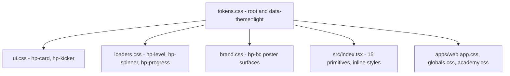
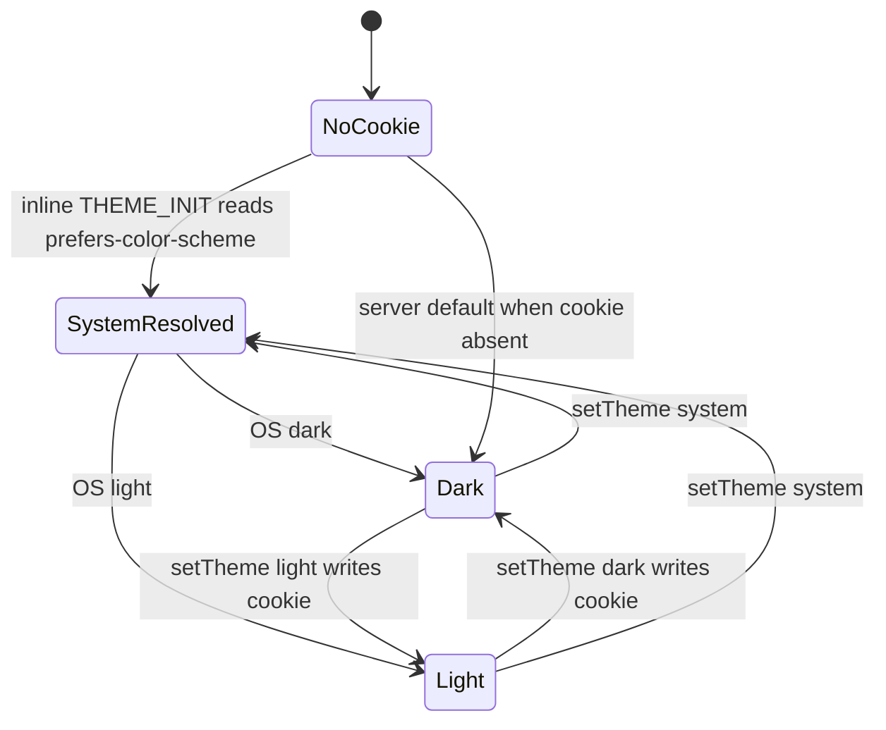

# `packages/ui` — design tokens and primitives

This document is the complete reference for the HeroPips design system: every
token in `packages/ui/tokens.css` with its value, every exported React
primitive with its props and variants, the three CSS layers (`ui.css`,
`brand.css`, `loaders.css`) and what each is for, how a theme is selected and
persisted, and the rules for adding a token or a primitive. It is for anyone
about to write a component or reach for a hex value. How the tokens are consumed
by routes and the app shell lives in [the web feature doc](./web.md); the
package's build and export situation is covered in
[the architecture overview](../01-architecture.md).

`packages/ui` is pure presentation. It contains no business logic, no hooks in
the server-safe primitives, and no raw colour literal outside `tokens.css`.

---

## 1. Package shape

`packages/ui/package.json:5` declares five export entries and **no build step**
(`build` is `echo ok`, `:7`):

| Specifier | Resolves to | Consumed as |
|---|---|---|
| `@heropips/ui` | `./src/index.tsx` | React primitives, raw TSX |
| `@heropips/ui/tokens.css` | `./tokens.css` | the custom-property layer — import first |
| `@heropips/ui/ui.css` | `./ui.css` | utility surfaces (`.hp-card`, `.hp-kicker`) |
| `@heropips/ui/brand.css` | `./brand.css` | poster surfaces (`.hp-bc*`, `.hp-outline-word`) |
| `@heropips/ui/loaders.css` | `./loaders.css` | `.hp-level`, `.hp-spinner`, `.hp-progress` |

`react ^19` is a `peerDependency` only (`:6`). Because the package ships raw TSX
and raw CSS, the consumer's bundler does the transpiling — today that is
`apps/web`.



---

## 2. Token architecture

Everything lives on `:root` in `packages/ui/tokens.css:1-85`, with a
`[data-theme="light"]` remap at `:86-118` and a global reduced-motion kill
switch at `:119-121`. `color-scheme` is declared per theme (`:2`, `:87`) so
native form controls and scrollbars follow.

The layering rule: **primitives** (`--ink-*`, `--volt-*`, …) are raw values;
**semantic aliases** (`--bg-app`, `--surface-*`, `--accent`, `--link`) point at
primitives. Components consume aliases wherever one exists, so the light theme
can remap a handful of aliases instead of every component.

### 2.1 Ink — canvas and surfaces (`:4-7`)

| Token | Value |
|---|---|
| `--ink-950` | `#07080C` |
| `--ink-900` | `#0B0D13` |
| `--ink-850` | `#10131B` |
| `--ink-800` | `#171B25` |
| `--ink-700` | `#202634` |
| `--ink-600` | `#2C3445` |
| `--ink-500` | `#3E4759` |
| `--paper-0` | `#FFFFFF` |
| `--paper-50` | `#F5F6F1` |
| `--paper-100` | `#ECEEE4` |
| `--paper-200` | `#DFE2D2` |
| `--ink-on-paper` | `#14171A` (`:7`) |

### 2.2 Text, dark theme (`:19`)

The three tiers each clear WCAG AA (4.5:1) against both the darkest **and** the
lightest ink surface they are permitted on — `--ink-950` through `--ink-800`.
The comment block at `:8-18` records the measured ratios and the history.

| Token | Value | Measured on `--ink-950` / `--ink-800` | Note |
|---|---|---|---|
| `--text-hi` | `#F3F5FA` | 17.6:1 / 15.1:1 | |
| `--text-mid` | `#B4BCCC` | 10.5:1 / 9.0:1 | raised from `#9BA4B8`, which passed at 8.0:1 but read visually thin at the 13 px sizes it was paired with (`:12-14`) |
| `--text-low` | `#98A1B5` | 7.7:1 / 6.6:1 | raised from `#7A849C`, which was 5.3:1 / 4.6:1 — AA only by a hair, and failing outright once any opacity landed on top (`:15-18`) |

### 2.3 Volt — the accent (`:21-22`)

| Token | Value |
|---|---|
| `--volt-300` | `#E2FF85` |
| `--volt-400` | `#D3FF57` |
| `--volt-500` | `#C6FF2E` |
| `--volt-600` | `#A9E514` |
| `--volt-700` | `#86BC05` |
| `--on-volt` | `#0D0F07` |

### 2.4 Pulse — reserved for AI (`:24`)

The header comment at `:23` marks this ramp **AI only**. Do not use it for
generic emphasis.

| Token | Value |
|---|---|
| `--pulse-300` | `#C9BBFF` |
| `--pulse-400` | `#A98FFF` |
| `--pulse-500` | `#8E66FF` |
| `--pulse-600` | `#7347F0` |
| `--on-pulse` | `#0F0A1E` |

### 2.5 Semantic — money and markets only (`:26-28`)

Marked **money & markets only** at `:25`. Green and red carry financial meaning
here; do not repurpose them as generic success/error colours.

| Token | Value |
|---|---|
| `--profit-400` | `#47FFAE` |
| `--profit-500` | `#21E88D` |
| `--profit-600` | `#0FC471` |
| `--loss-400` | `#FF6584` |
| `--loss-500` | `#FF3D63` |
| `--loss-600` | `#E02348` |
| `--warn-400` | `#FFC24B` |
| `--info-400` | `#45D8FF` |

### 2.6 Tints (`:30-32`)

Low-alpha washes for chip and badge backgrounds. Each is a literal `rgba()` of
its ramp's 500 step rather than a `color-mix`, so it composites identically
everywhere.

| Token | Value |
|---|---|
| `--volt-tint` | `rgba(198,255,46,.12)` |
| `--pulse-tint` | `rgba(142,102,255,.14)` |
| `--profit-tint` | `rgba(33,232,141,.12)` |
| `--loss-tint` | `rgba(255,61,99,.12)` |
| `--warn-tint` | `rgba(255,194,75,.12)` |
| `--info-tint` | `rgba(69,216,255,.12)` |

### 2.7 Borders (`:34`)

Three tiers, all alpha-on-ink derived from `--text-hi`.

| Token | Value | Use |
|---|---|---|
| `--border-1` | `rgba(243,245,250,.08)` | resting card edge |
| `--border-2` | `rgba(243,245,250,.14)` | hover, inputs, ghost buttons |
| `--border-3` | `rgba(243,245,250,.24)` | strongest divider |

### 2.8 Semantic aliases (`:36-40`)

This is the indirection layer the light theme leans on.

| Alias | Dark value |
|---|---|
| `--bg-app` | `var(--ink-950)` |
| `--surface-1` | `var(--ink-900)` |
| `--surface-2` | `var(--ink-850)` |
| `--surface-3` | `var(--ink-800)` |
| `--surface-raised` | `var(--ink-700)` |
| `--accent` | `var(--volt-500)` |
| `--accent-hover` | `var(--volt-400)` |
| `--accent-text` | `var(--volt-400)` |
| `--text-body` | `var(--text-mid)` |
| `--text-heading` | `var(--text-hi)` |
| `--link` | `var(--volt-400)` |
| `--link-hover` | `var(--volt-300)` |

### 2.9 Type — families (`:42-44`)

| Token | Stack |
|---|---|
| `--font-display` | `'Space Grotesk','Helvetica Neue',sans-serif` |
| `--font-body` | `'Instrument Sans','Helvetica Neue',sans-serif` |
| `--font-mono` | `'JetBrains Mono','SF Mono',monospace` |

`apps/web` overrides all three at the `<body>` level to point at the `next/font`
CSS variables it loads (`apps/web/app/layout.tsx:72-76`), keeping the token names
but swapping in self-hosted, `font-display: swap` faces
(`apps/web/app/layout.tsx:9-11`). That is why the CSP needs only
`font-src 'self'`.

### 2.10 Type — 12-step scale (`:48-50`)

**The scale floor is 12 px**: nothing in shipped UI renders smaller, so every
step is legible copy rather than decoration. The comment at `:45-47` states the
intent — a ~1.13 ratio through the reading sizes, opening up across the display
range. Steps are fixed pixels; fluid headlines are built with `clamp()` at the
call site against a token ceiling, for example
`clamp(31px, 5vw, var(--text-6xl))` in `packages/ui/brand.css:141`.

| Token | Value |
|---|---|
| `--text-2xs` | `12px` |
| `--text-xs` | `13px` |
| `--text-sm` | `15px` |
| `--text-md` | `17px` |
| `--text-lg` | `19px` |
| `--text-xl` | `22px` |
| `--text-2xl` | `27px` |
| `--text-3xl` | `33px` |
| `--text-4xl` | `41px` |
| `--text-5xl` | `52px` |
| `--text-6xl` | `64px` |
| `--text-7xl` | `82px` |

### 2.11 Type — tracking, leading, weight (`:51`, `:52`, `:56`)

| Token | Value | Intended for |
|---|---|---|
| `--track-display` | `-0.03em` | display headlines |
| `--track-tight` | `-0.01em` | buttons, wordmark |
| `--track-caps` | `0.14em` | uppercase micro-labels |
| `--leading-display` | `1.02` | display |
| `--leading-heading` | `1.12` | headings |
| `--leading-body` | `1.6` | body copy |
| `--leading-tight` | `1.35` | dense UI |
| `--leading-read` | `1.75` | long-form reading — used by `apps/web/components/academy/academy.css:243` for lesson prose |
| `--weight-regular` | `400` | |
| `--weight-book` | `450` | **the body-copy default.** The comment at `:53-55` explains it: 400 reads thin against near-black, 450 restores stem weight without tipping into medium, and because both display and body faces load as variable fonts it costs no extra request. Applied globally at `apps/web/app/globals.css:28` |
| `--weight-medium` | `500` | |
| `--weight-semibold` | `600` | |
| `--weight-bold` | `700` | |

### 2.12 Space — 4 px scale (`:58-59`)

Token names are the multiplier, so `--sp-6` is 6 × 4 px. The scale is
intentionally gappy above 6: there is no `--sp-7`, `--sp-9`, `--sp-11`, …

| Token | Value |
|---|---|
| `--sp-1` | `4px` |
| `--sp-2` | `8px` |
| `--sp-3` | `12px` |
| `--sp-4` | `16px` |
| `--sp-5` | `20px` |
| `--sp-6` | `24px` |
| `--sp-8` | `32px` |
| `--sp-10` | `40px` |
| `--sp-12` | `48px` |
| `--sp-16` | `64px` |
| `--sp-20` | `80px` |
| `--sp-24` | `96px` |

### 2.13 Radii and control heights (`:61-62`)

| Token | Value | Used by |
|---|---|---|
| `--r-xs` | `6px` | |
| `--r-sm` | `10px` | `Skeleton` |
| `--r-md` | `14px` | `Input`, the skip link |
| `--r-lg` | `20px` | `.hp-card`, and its hairline inset |
| `--r-xl` | `28px` | `.hp-bc` poster cards |
| `--r-2xl` | `36px` | |
| `--r-full` | `999px` | buttons, badges, progress track |
| `--ctl-sm` | `36px` | `Button size="sm"` |
| `--ctl-md` | `44px` | `Button size="md"`, `Input` — also the 44 px touch-target floor |
| `--ctl-lg` | `52px` | `Button size="lg"` |

### 2.14 Rings, glows, shadows (`:64-68`)

| Token | Value |
|---|---|
| `--ring-volt` | `0 0 0 3px rgba(198,255,46,.22)` |
| `--ring-loss` | `0 0 0 3px rgba(255,61,99,.22)` |
| `--glow-volt` | `0 0 32px -4px rgba(198,255,46,.4)` |
| `--glow-volt-lg` | `0 0 64px -8px rgba(198,255,46,.45)` |
| `--glow-pulse` | `0 0 32px -4px rgba(142,102,255,.4)` |
| `--glow-profit` | `0 0 28px -6px rgba(33,232,141,.45)` |
| `--shadow-1` | `0 1px 2px rgba(0,0,0,.4)` |
| `--shadow-2` | `0 8px 24px -8px rgba(0,0,0,.5)` |
| `--shadow-card` | `0 16px 48px -16px rgba(0,0,0,.6)` |

### 2.15 The `--box-*` card recipe (`:69-75`)

Five variables that encode "top-lit machined card with a hairline edge". They
exist so `.hp-card` in this package and the `ap-*` member-app surfaces in
`apps/web/app/(platform)/app/app.css` stay in sync from one definition, and so
the light theme can replace the entire recipe in one block.

| Token | Dark value |
|---|---|
| `--box-surface` | `linear-gradient(180deg, color-mix(in srgb, var(--text-hi) 4%, var(--ink-850)) 0%, var(--ink-850) 56%)` |
| `--box-surface-raised` | the same shape at 6% over `--ink-800` |
| `--box-hairline` | `linear-gradient(90deg, transparent, color-mix(in srgb, var(--text-hi) 22%, transparent) 50%, transparent)` |
| `--box-hairline-volt` | the same, `--volt-500` at 65% |
| `--box-hairline-pulse` | the same, `--pulse-500` at 70% |

### 2.16 Gradients (`:77-81`)

| Token | Value |
|---|---|
| `--grad-volt` | `linear-gradient(115deg,#D3FF57 0%,#C6FF2E 55%,#8AE85C 100%)` |
| `--grad-hero` | two stacked radials — pulse at 16% top-left, volt at 12% top-right |
| `--grad-fade-bg` | `linear-gradient(180deg,rgba(7,8,12,0) 0%,#07080C 100%)` |
| `--grad-fade-ink` | `var(--grad-fade-bg)` |

`--grad-volt` (`:77`) and `--grad-fade-bg` (`:80`) are the only places raw hex
appears outside the ramp declarations, because a gradient stop cannot take a
`var()` and still be interpolated identically by every engine. `#8AE85C` exists
only as `--grad-volt`'s terminal stop and is not a token.

### 2.17 Motion (`:83-84`)

| Token | Value | Use |
|---|---|---|
| `--ease-out` | `cubic-bezier(0.16,1,0.3,1)` | default for entrances and hovers |
| `--ease-spring` | `cubic-bezier(0.34,1.4,0.64,1)` | overshoot, for emphasis only |
| `--dur-fast` | `120ms` | transform, border-colour |
| `--dur-med` | `220ms` | background, box-shadow, screen entrances |

### 2.18 The light-theme remap (`:86-118`)

`[data-theme="light"]` overrides **only** what has to change — roughly 30
declarations against the ~127 on `:root`. Everything else inherits. Four
categories:

**Surfaces** (`:88-89`). `--bg-app` → `--paper-50`, `--surface-1` →
`--paper-0`, `--surface-2` → `#FAFBF6`, `--surface-3` → `--paper-100`,
`--surface-raised` → `--paper-200`.

**Text, measured on `--paper-50`** (`:94`, rationale `:90-93`):

| Token | Light value | Ratio on `--paper-50` | Note |
|---|---|---|---|
| `--text-hi` | `#14171A` | 15.3:1 | |
| `--text-mid` | `#3F4854` | 8.5:1 | darkened from `#49525F` (7.3:1) |
| `--text-low` | `#4A5361` | 7.2:1 | darkened from `#5D6675` (5.9:1) |

**Borders re-spaced** (`:96`). `--border-1` `rgba(20,23,26,.12)`, `--border-2`
`.18`, `--border-3` `.28`. The comment at `:95` records why: the dark `.08`
measured about 1.13:1 on a white card and was effectively invisible.

**Accent steps darkened for contrast on paper** (`:97-102`). Only the
`400`-level steps that appear as *text* are remapped, plus the tints, links and
`--accent-text`:

| Token | Dark | Light |
|---|---|---|
| `--volt-400` | `#D3FF57` | `#4F7002` |
| `--pulse-300` | `#C9BBFF` | `#6740E8` |
| `--profit-400` | `#47FFAE` | `#0A7A47` |
| `--loss-400` | `#FF6584` | `#C11B3F` |
| `--warn-400` | `#FFC24B` | `#8A5F06` |
| `--info-400` | `#45D8FF` | `#076C94` |
| `--link` / `--link-hover` | `--volt-400` / `--volt-300` | `#4F7002` / `#557802` |
| `--accent-text` | `--volt-400` | `#4F7002` |

Note what is **not** remapped: `--volt-500`, `--volt-600`, `--volt-700`,
`--on-volt`, every `--ink-*`, every `--paper-*` and `--grad-volt`. That
invariance is exactly what `brand.css` depends on — see
[§4.3](#43-why-brandcss-is-theme-invariant).

**Depth and the box recipe toned for paper** (`:103-117`). `--ring-volt` and
`--glow-volt` re-tinted to `rgba(134,188,5,…)`; all three shadows switched from
black to `rgba(20,23,26,…)` at much lower alpha; `--box-surface` and
`--box-surface-raised` flattened to solid paper fills; the three hairlines
re-based on `--ink-on-paper`, `--volt-700` and `--pulse-600`; `--grad-hero` and
`--grad-fade-bg` paper-tinted.

### 2.19 The reduced-motion kill switch (`:119-121`)

```css
@media (prefers-reduced-motion: reduce) {
  *, *::before, *::after {
    animation-duration:.01ms !important; animation-iteration-count:1 !important;
    transition-duration:.01ms !important; scroll-behavior:auto !important;
  }
}
```

One global rule with `!important` and a universal selector. It kills every
animation and transition in the whole product — including `apps/web`'s
`.ap-screen` route entrance and `.ap-sheet` rise — without any component needing
to opt in. `packages/ui/loaders.css:121-134` layers a second, finer-grained
block on top so the loaders come to rest **fully visible** rather than mid-fade;
see [§3.3](#33-loaderscss-the-loader-family).

---

## 3. The CSS layers

Three files, three jobs. All three declare "tokens only, zero raw colour
literals" in their headers and hold to it.

### 3.1 `ui.css` — utility surfaces

The everyday box language shared by marketing cards and the member app
(`packages/ui/ui.css:1-8`).

| Selector | Purpose | Line |
|---|---|---|
| `.hp-card` | `--box-surface` fill, `--border-1` edge, `--r-lg` radius, `--shadow-1`, and transitions on border-colour (`--dur-fast`) and box-shadow (`--dur-med`) | `:10-17` |
| `.hp-card::before` | the machined top hairline — 1 px tall, **inset left and right by `--r-lg`** so it stops before the corner curve, `--r-full` capped, `--box-hairline` fill, `pointer-events:none` | `:19-29` |
| `.hp-card--raised` | swaps to `--box-surface-raised` and `--shadow-card` | `:30-33` |
| `.hp-card[data-tone="volt"]::before` | hairline becomes `--box-hairline-volt` | `:35` |
| `.hp-card[data-tone="pulse"]::before` | hairline becomes `--box-hairline-pulse` | `:36` |
| hover sharpening | five selectors — `a .hp-card`, `a.hp-card`, `button.hp-card`, `.hp-card-link:hover .hp-card`, `.hp-card[data-interactive]` — lift the border to `--border-2` | `:39-45` |
| `.hp-kicker` | mono micro-label: `--font-mono`, `--text-2xs`, `--weight-medium`, `0.08em` tracking, uppercase, `--text-low` | `:48-58` |
| `.hp-kicker[data-tone]` | `volt` → `--volt-400`, `pulse` → `--pulse-300` | `:59-60` |

The tone convention, stated at `packages/ui/src/index.tsx:63`: **volt is for
money and action, pulse is for AI only.**

`.hp-kicker` uses a literal `0.08em` (`:55`) rather than `--track-caps`
(`0.14em`) because mono glyphs are already wide. That is a deliberate exception,
not a stray magic number.

### 3.2 `brand.css` — poster surfaces

The social-kit card language brought into the product
(`packages/ui/brand.css:1-10`). Two fixed surfaces, both **theme-invariant**:
they render identically in dark and light, like printed collateral.

| Selector | Purpose | Line |
|---|---|---|
| `.hp-bc` | the shell: `--r-xl`, `clamp(28px,3.5vw,36px)` padding, flex column with `--sp-6` gap, `overflow:hidden`, plus the alias-pinning block below | `:12-45` |
| `.hp-bc > :not(.hp-bc-watermark)` | lifts all real content to `z-index:1` above the watermark and sets `min-width:0` so long strings can shrink | `:47-51` |
| `.hp-bc--ink` | `--bc-bg: --ink-950`, `--bc-fg: --paper-50`, fg tiers at **86% / 68%**, volt logo tile, border at 12% of fg | `:54-70` |
| `.hp-bc--volt` | `--bc-bg: --volt-500`, `--bc-fg: --on-volt`, fg tiers at **88% / 74%**, ink logo tile, `background: --grad-volt`, `border:0`, and `box-shadow:none` because **poster surfaces never float** (`:86`) | `:71-87` |
| `.hp-bc-top` / `.hp-bc-chip` / `.hp-bc-wordmark` | the signature row: logo tile plus a lowercase display wordmark at `--text-lg` | `:90-112` |
| `.hp-bc-badge` | mono uppercase pill, `margin-left:auto`, `5px 14px` padding; outlined on volt (`:123-126`), tinted on ink (`:127-131`) | `:113-131` |
| `.hp-bc-body` / `.hp-bc-display` / `.hp-bc-lede` | `--bc-fg` display headline at `clamp(31px,5vw,var(--text-6xl))` with `--leading-display` and `--track-display` (`:137-146`); lede at `--text-lg`, `--leading-body`, `max-width:56ch` (`:147-153`) | `:134-153` |
| `.hp-outline-word` | poster headline accent — **fallback first**: solid at `opacity:.55`, then inside `@supports (-webkit-text-stroke: 1.5px red)` it switches to transparent fill with a 1.5 px `currentColor` stroke at full opacity | `:157-166` |
| `.hp-bc-watermark` | the `LevelUpMark` chevron glyph, oversized to 360 px and cropped off-card; 6% opacity bottom-right on ink (`:176-181`), 8% bottom-left on volt (`:182-187`), shrunk to 260 px below 760 px (`:188-193`) | `:169-193` |
| `.hp-bc-meta` | mono footer row at `--text-2xs`; left column lowercase at `--bc-fg-mid` (`:207-212`), right column right-aligned `max-width:34ch` `white-space:pre-line` at `--bc-fg-low` (`:213-219`) | `:196-219` |
| `.hp-bc--volt :focus-visible` | focus ring rebuilt as 40% of `--bc-fg`, because `--ring-volt` is invisible on a volt background | `:222-224` |
| `.hp-bc--volt ::selection` | selection rebuilt at 22% of `--bc-fg` for the same reason | `:225-228` |

**Poster foreground tiers are heavier than the flat-card equivalents**, and the
file says why. On ink, mid/low sit at 86% / 68% rather than 74% / 56% because
poster copy sits on top of a watermark chevron and a gradient, so it needs more
weight than it does on a flat card — measured on `--ink-950` at 12.6:1 and 8.4:1
(`:57-61`). On volt the text is near-black, so the same tiers read darker for
less alpha: 88% / 74%, measured on `--volt-500` at 13.1:1 and 9.6:1 (`:74-77`).

**The alias-pinning block** (`:17-35`) is the part to understand before nesting
anything inside a `BrandCard`. `.hp-bc` re-declares roughly 18 global aliases in
terms of its own `--bc-fg` / `--bc-bg`, so that tables, meters, sparklines and
badges dropped inside render against the poster surface rather than the theme:
`--text-hi`, `--text-heading`, `--text-body`, `--text-mid`, `--text-low`, all
three `--border-*`, all four `--surface-*`, `--profit-400` → `--profit-500`,
`--loss-400` → `--loss-500`, and the profit/loss/volt tints re-mixed against the
card. `.hp-bc--volt` additionally sets `--volt-400: var(--on-volt)` (`:80`),
which will surprise anyone reusing an accent-coloured child inside a volt card.

### 3.3 `loaders.css` — the loader family

The brand rule, quoted in the file header (`packages/ui/loaders.css:1-8`) and
again at `packages/ui/src/index.tsx:126-130`: *the level-up loader is the
primary page loader; the spinner is for inline waits; skeleton shimmer is for
data; XP-style progress bars for progress. All CSS.*

| Selector | Behaviour | Line |
|---|---|---|
| `.hp-level` | inline-flex column, `--sp-3` gap | `:11-16` |
| `.hp-level svg` | `color: --volt-500`, `overflow:visible` so the glow is not clipped | `:17-21` |
| `[data-theme="light"] .hp-level svg` | drops to `--volt-400`, which the light theme has remapped to `#4F7002` for contrast; `--volt-500` stays poster-bright | `:23-25` |
| `.hp-level-chev` | rest state `opacity:.25` and `translateY(3px)`; `hp-level-climb` 900 ms `--ease-out` infinite | `:26-30` |
| delays | bottom chevron first: `:nth-child(3)` 0 ms, `:nth-child(2)` 140 ms, `:nth-child(1)` 280 ms — the climb ripples upward | `:32-34` |
| `@keyframes hp-level-climb` | 0% rest → 35% `opacity:1`, `translateY(0)` and a `drop-shadow` at 55% of `currentColor` → 70%/100% back to rest | `:35-52` |
| `.hp-level-label` | mono `--text-2xs`, `--track-caps`, uppercase, `--text-low` | `:53-59` |
| `.hp-spinner` | `hp-spin` 800 ms linear infinite, `color: currentColor`, `flex:none` | `:62-70` |
| `.hp-btn .hp-spinner` | zeroes the spinner margin inside a button — the only coupling between the loader layer and `Button` | `:72` |
| `.hp-progress-track` | 8 px tall, `--r-full`, `--surface-3` fill, `--border-1` edge, `overflow:hidden` | `:80-87` |
| `.hp-progress-fill` | `--grad-volt`, width transitions over `--dur-med` `--ease-out` | `:88-94` |
| `.hp-progress-fill::after` | the 6 px glow tip at the right edge, `box-shadow: --glow-volt` | `:95-104` |
| `.hp-progress--profit` | fill becomes flat `--profit-500`, tip glow becomes `--glow-profit` | `:105-110` |
| `.hp-progress-value` | mono `--text-2xs`, right-aligned, `--text-low` | `:111-118` |
| reduced motion | `.hp-level-chev` → `animation:none; opacity:1; transform:none; filter:none`; `.hp-spinner` → `animation:none`; `.hp-progress-fill` → `transition:none` | `:121-134` |

That reduced-motion block is the reason loaders stay *legible* rather than merely
frozen. The global rule in `packages/ui/tokens.css:119-121` collapses durations
to `.01ms`, which alone would leave the chevrons stuck at their `opacity:.25`
rest state. This block resets them to full opacity and no offset, and
`LevelLoader` keeps its `role="status"` and `aria-label` regardless, so the wait
is still announced.

### 3.4 One class that is *not* in this package

`Skeleton` (`packages/ui/src/index.tsx:102-104`) emits `.hp-skeleton`, but the
shimmer is defined in the consumer: `apps/web/app/globals.css:113-120` supplies
`position:relative; overflow:hidden` plus an `::after` sweeping
`linear-gradient` on the `hp-shimmer` 1.4 s keyframes. Import `@heropips/ui`
into a second app without copying that rule and `Skeleton` renders as a static
grey block. See [§5.4](#54-known-sharp-edges).

---

## 4. Theming

### 4.1 Selection and persistence

The applied theme is `html[data-theme]`, and the stored preference is the
non-httpOnly cookie `hp_theme` with three legal values: `dark`, `light`,
`system` (`apps/web/lib/theme.ts:5-9`). `MAX_AGE` is `60*60*24*365` = one year,
`samesite=lax`, `path=/` (`apps/web/lib/theme.ts:9`, `:33`).

`setTheme(pref)` (`apps/web/lib/theme.ts:32-51`) does four things in order:

1. writes the cookie (`:33`);
2. resolves `system` against `matchMedia("(prefers-color-scheme: light)")` and
   assigns `document.documentElement.dataset.theme` (`:34-38`);
3. **collapses the `theme-color` metas** — removes every one after the first,
   creates it if absent, strips its `media` attribute and sets the single
   resolved colour (`:39-49`). This matters because the media-gated *pair* used
   in system mode would otherwise keep following the OS after an explicit
   choice;
4. dispatches the `hp:theme` `CustomEvent` with the resolved theme as `detail`
   (`:15`, `:50`) so listeners can react without prop drilling.

`META_COLOR` is `{dark:"#07080C", light:"#F5F6F1"}`
(`apps/web/lib/theme.ts:12`), and the comment at `:11` requires it to match
`--bg-app` per theme — those are exactly `--ink-950` and `--paper-50`.

### 4.2 First paint without a flash

Two mechanisms cooperate in `apps/web/app/layout.tsx`:

- **Server side.** `RootLayout` reads the `hp_theme` cookie and, only for an
  explicit `light` or `dark`, emits `data-theme` on `<html>`; otherwise it
  defaults to `dark` (`:63-68`). `generateViewport` mirrors the same logic for
  `themeColor`: an explicit choice pins one colour, absence emits the
  **media-gated pair** so the browser chrome follows the OS (`:41-59`).
  `suppressHydrationWarning` is set on `<html>` (`:69`) because the attribute can
  legitimately differ between server and client.
- **Client side, before paint.** `THEME_INIT` (`:20`) is an inline IIFE injected
  as the first child of `<body>` (`:77`). It tests the cookie for an explicit
  `dark|light` and, finding none, sets `data-theme` from
  `prefers-color-scheme`. So a first-time visitor on a light OS gets light on
  the very first paint — asserted by `apps/web/e2e/theme.spec.ts:51-54`, which
  checks the computed body background is `rgb(245, 246, 241)` on a
  `domcontentloaded` navigation. Because `script-src` carries no
  `'unsafe-inline'`, this script only runs if it gets the per-request nonce the
  middleware mints — the layout reads it from the `x-hp-nonce` request header and
  puts it on the tag (see [web.md](./web.md#15-hazards-and-gaps)).



### 4.3 Why `brand.css` is theme-invariant

Poster surfaces must look the same in both themes, the way printed collateral
does. `brand.css` achieves that without any `[data-theme]` selector of its own,
by an explicit discipline stated at `packages/ui/brand.css:5-9`: **every value
maps only from primitives that the `[data-theme="light"]` block never remaps.**

The invariant set is `--ink-*`, `--paper-*`, `--volt-300`, `--volt-500`,
`--volt-600`, `--on-volt` and `--grad-volt`. Cross-checking
`packages/ui/tokens.css:86-118`: the light block touches `--volt-400` but not
300/500/600/700, and touches no `--ink-*`, no `--paper-*`, not `--on-volt` and
not `--grad-volt`. So `.hp-bc--ink` (`:54-70`) and `.hp-bc--volt` (`:71-87`) are
stable by construction.

Every derived wash is a `color-mix` over those same primitives — for example
`color-mix(in srgb, var(--bc-fg) 12%, transparent)` for the ink card's border
(`:69`) — so there is not one raw colour literal in the file. The alias-pinning
block ([§3.2](#32-brandcss-poster-surfaces)) then makes nested content
invariant too.

Note the one alias the light theme *does* remap that `brand.css` also reads:
`--text-hi` and `--text-mid`/`--text-low` (`packages/ui/tokens.css:94`). That is
harmless precisely because `.hp-bc` **re-pins all three** to its own `--bc-fg`
tiers (`:19-23`) before any child can read them.

**If you add a token and then remap it in the light theme, check whether
`brand.css` reads it.** Remapping `--volt-500` or any `--ink-*` would silently
break poster invariance.

---

## 5. Primitives — `packages/ui/src/index.tsx`

15 exports plus one private helper, `cx()` (`:3-5`), which joins truthy class
fragments. Styling is split by intent: **layout and colour that varies by prop**
lives in inline style objects, so the primitive is self-contained with no CSS
import order to get wrong; **stateful and pseudo-element styling** lives in the
CSS layers, reached through a stable `hp-*` class.

### 5.1 Controls

| Export | Line | Props | Behaviour |
|---|---|---|---|
| `Button` | `:29-37` | `variant?: "volt"\|"ghost"\|"outline"\|"danger"\|"pulse"` (default `volt`), `size?: "sm"\|"md"\|"lg"` (default `md`), `busy?: boolean`, `asChild?: boolean`, plus all `button` attrs; `forwardRef<HTMLButtonElement>` | Composes `btnBase` (`:10-16`) + `btnSizes[size]` (`:17-21`) + `btnVariants[variant]` (`:22-28`) + the caller's `style`, in that order, so a caller override always wins. `busy` prepends `<Spinner size={14}/>` (`:34`). Emits class `hp-btn`, which is only a hook — `packages/ui/loaders.css:72` uses it to zero the spinner margin. **`asChild` is accepted and never read** — see [§5.4](#54-known-sharp-edges) |
| `ButtonLink` | `:38-42` | the same `variant` / `size` on an `<a>` | Identical style maps on an anchor, so a link CTA and a button CTA are pixel-identical. No `busy`, no ref |
| `Input` | `:45-60` | `mono?: boolean`, `invalid?: boolean`, plus all `input` attrs; `forwardRef<HTMLInputElement>` | `--ctl-md` height, full width, `--surface-2` fill, `--r-md`, `--text-md`. `mono` swaps the family to `--font-mono` (`:53`). `invalid` swaps the border to `--loss-500` (`:51`) and the focus ring to `--ring-loss`. Focus and blur handlers set `boxShadow` imperatively and **chain to any caller handler** (`:57-58`) |

Button variants (`:22-28`):

| Variant | Background | Foreground | Extra |
|---|---|---|---|
| `volt` | `--grad-volt` | `--on-volt` | `box-shadow: --glow-volt` |
| `pulse` | `--pulse-500` | `--on-pulse` | `box-shadow: --glow-pulse` |
| `ghost` | `transparent` | `--text-hi` | `border-color: --border-2` |
| `outline` | `--surface-2` | `--text-hi` | `border-color: --border-2` |
| `danger` | `--loss-tint` | `--loss-400` | border `color-mix(in srgb, var(--loss-500) 35%, transparent)` |

Button sizes (`:17-21`): `sm` = `--ctl-sm` / 16 px padding / `--text-sm`;
`md` = `--ctl-md` / 22 px / `--text-md`; `lg` = `--ctl-lg` / 30 px / `--text-lg`.
All three are `--r-full` with `--font-display` at weight 600 and a literal
`-0.01em` tracking (`:12-13`), and they transition transform over `--dur-fast`
plus box-shadow, background and colour over `--dur-med` (`:14`).

### 5.2 Surfaces and labels

| Export | Line | Props | Behaviour |
|---|---|---|---|
| `Card` | `:65-68` | `raised?: boolean`, `tone?: "volt"\|"pulse"` | Renders `div.hp-card`, adds `hp-card--raised`, and passes `tone` through as `data-tone`. **All visuals come from `ui.css`** — the component contributes no inline style |
| `Kicker` | `:70-73` | `tone?: "volt"\|"pulse"` | `div.hp-kicker` with `data-tone`. Same pattern |
| `Badge` | `:76-91` | `tone?: "volt"\|"pulse"\|"profit"\|"loss"\|"warn"\|"info"\|"neutral"` (default `volt`) | A 7-entry `[background, foreground]` map (`:78-83`): each tone pairs its tint with its 400 step, except `pulse` which uses `--pulse-300` and `neutral` which is `--surface-3` on `--text-mid`. Pill shape, `4px 12px` padding, `--text-2xs` `--font-display` 600, uppercase with `--track-caps` |
| `Eyebrow` | `:94-99` | none beyond `div` attrs | `--font-display` `--text-2xs` 600, uppercase, `--track-caps`, coloured `--accent-text` — so it inverts correctly in the light theme for free |
| `Skeleton` | `:102-104` | none beyond `div` attrs | `div.hp-skeleton` with a `--surface-3` background and `--r-sm`. Callers size it via `style` |
| `Disclaimer` | `:107-113` | children optional | `role="note"`, `--text-xs` `--text-low` `--leading-body`. With no children it renders the fixed compliance sentence (`:111`); the header marks it *compliance C1, never hidden* (`:106`) |

### 5.3 Marks, loaders and poster surfaces

| Export | Line | Props | Behaviour |
|---|---|---|---|
| `LevelUpMark` | `:116-124` | `size?: number` (default 28) | The logo: a 32×32 `--volt-500` rounded tile (`rx=8`) with two `--on-volt` chevrons, the lower at `opacity .55`. `aria-hidden`, `focusable="false"` |
| `LevelLoader` | `:142-161` | `size?: "sm"\|"md"\|"lg"` (default `md`), `label?: string` (default `"Loading…"`), `showLabel?: boolean` | `LEVEL_SIZES = {sm:24, md:40, lg:56}` (`:134`). Three chevrons from `LEVEL_CHEVRONS` (`:136-140`), each `className="hp-level-chev"` with `stroke="currentColor"`. The svg is `viewBox="0 0 32 34"` and its height is `px * 34 / 32` (`:152`), so the extra chevron row is not squashed. `role="status"` plus `aria-label={label}` on the wrapper (`:151`), so the wait is announced whether or not the label is visible |
| `Spinner` | `:165-172` | `size?: 14\|16\|20` (default 16) | A single circle with `pathLength={100}` and `strokeDasharray="70 30"`, so the 70% arc is resolution-independent. **Always `aria-hidden`** (`:167`); the header at `:163-164` explains that the surrounding control — a busy button, a labelled chip — owns the accessible name |
| `ProgressBar` | `:176-208` | `value: number`, `max: number`, `label?: string`, `variant?: "volt"\|"profit"` (default `volt`), `showValue?: boolean` | `clamped = min(max(value,0), max)` (`:191`); `pct = max > 0 ? clamped/max*100 : 0` (`:192`), so a `max` of 0 yields 0 rather than `NaN`. The fill gets `minWidth: 8` whenever `clamped > 0` (`:203`), so a 1% bar is still visible. `role="progressbar"` with `aria-valuemin`/`max`/`now` and `aria-label` (`:197-201`); `showValue` renders a mono `clamped/max` readout (`:205`) |
| `BrandCard` | `:218-273` | `variant: "volt"\|"ink"` (**required**), `badge?: string`, `meta?: {left: string\|string[]; right?: string}`, `watermark?: boolean` (default `false`), `chip?: boolean` (default `true`), `as?: "div"\|"section"\|"article"\|"aside"` (default `div`) | Polymorphic through `as` (`:224`, `:238`). `meta.left` is normalised to an array (`:236`) and rendered one `<span>` per line. The chip re-draws the logo inline against `--bc-tile` / `--bc-tile-mark` (`:250-252`) rather than reusing `LevelUpMark`, because the tile colours invert between the two surfaces. The watermark renders first so the `> :not(.hp-bc-watermark)` rule can stack everything else above it. **Server-safe: no hooks** (`:214`) |
| `OutlineWord` | `:276-278` | none beyond `span` attrs | `span.hp-outline-word`; the stroke treatment and its `@supports` fallback live in `packages/ui/brand.css:157-166` |

`BC_CHEVRON_TOP` / `BC_CHEVRON_BOT` (`:215-216`) are the same path data as
`LevelUpMark`'s two chevrons (`:120-121`), duplicated so the poster layer does
not depend on the logo component.

### 5.4 Known sharp edges

1. **`Button` accepts `asChild` and ignores it.**
   `packages/ui/src/index.tsx:30` declares the prop; the implementation
   (`:31-37`) destructures `variant`, `size`, `style`, `className`, `busy` and
   `children`, never `asChild`, so it falls into `...rest` and React forwards it
   to the DOM as an unknown attribute. Either implement Radix-style slot merging
   or delete the prop.

2. **`.hp-skeleton` is defined outside this package.** `Skeleton` (`:103`) emits
   the class, but the shimmer lives at `apps/web/app/globals.css:113-120`.
   Reusing `@heropips/ui` in a second app silently loses the animation. The clean
   fix is moving those seven lines into `ui.css`.

3. **`.hp-bc` overrides ~18 global aliases for its subtree**
   (`packages/ui/brand.css:17-35`), and `.hp-bc--volt` additionally sets
   `--volt-400: var(--on-volt)` (`:80`). Anything nested inside a `BrandCard`
   gets poster colours, not theme colours. That is the intent, but it makes a
   `BrandCard` a hard boundary: do not expect an accent-coloured child to keep
   its accent inside a volt card.

4. **`Input` sets `boxShadow` imperatively on focus and blur** (`:57-58`) instead
   of using `:focus-visible` in CSS. It works, and it chains caller handlers
   correctly, but it means the ring also appears on programmatic and mouse focus,
   and a caller passing `style={{boxShadow: …}}` will see it overwritten on first
   interaction.

5. **The scales have deliberate gaps.** There is no `--sp-7`, `--sp-9` or
   `--sp-11` (`packages/ui/tokens.css:58-59`), and no `--text-8xl`
   (`:48-50`). Reaching for a missing step is the usual reason someone writes a
   magic number.

6. **Some tokens are unused *inside this package* but live in the consumer.**
   `--glow-volt-lg` (`packages/ui/tokens.css:65`) and `--ease-spring` (`:83`) are
   referenced only from `apps/web` — `apps/web/components/academy/academy.css:448`
   and `apps/web/components/convert/OrderStatusPanel.tsx:69` for the glow,
   `apps/web/components/academy/academy.css:364` for the easing. Likewise
   `--weight-book` (`:56`) is applied by `apps/web/app/globals.css:28` and
   `--leading-read` (`:52`) by `apps/web/components/academy/academy.css:243`. Do
   not assume a token is dead just because `packages/ui` does not reference it.

---

## 6. Usage rules

### 6.1 Tokens only

**Every colour, size, radius, shadow, duration and easing in a component must be
a `var(--token)`.** The three CSS files state this in their own headers
(`packages/ui/ui.css:7`, `packages/ui/brand.css:9`,
`packages/ui/loaders.css:6`) and hold to it: there is not one raw colour literal
in any of them.

The complete, sanctioned list of raw values in the whole package:

| Raw value | Where | Why it is allowed |
|---|---|---|
| The ramp hex values | `packages/ui/tokens.css:4-28` | this *is* the definition layer |
| `rgba(...)` tints, rings, glows, shadows | `packages/ui/tokens.css:30-34`, `:64-68` | alpha compositing of a ramp step; a `color-mix` here would change how they composite |
| `#D3FF57`, `#C6FF2E`, `#8AE85C` in `--grad-volt` | `packages/ui/tokens.css:77` | gradient stops must be literals to interpolate identically across engines |
| `#07080C` in `--grad-fade-bg` | `packages/ui/tokens.css:80` | same |
| `#FAFBF6` and the darkened light-theme accents | `packages/ui/tokens.css:88`, `:94`, `:97-102` | one-off paper values with no ramp of their own, each carrying a measured contrast ratio in the adjacent comment |
| `0.08em` on `.hp-kicker` | `packages/ui/ui.css:55` | mono glyphs need less tracking than `--track-caps` |
| `0.02em` and `line-height: 1.6` on `.hp-bc-meta` | `packages/ui/brand.css:204-205` | poster micro-copy sits between two token steps |
| Percentages in `color-mix` washes | `packages/ui/brand.css:24-35`, `:60-61`, `:76-77` | derived from an invariant primitive; the ratios are documented in-file |
| Small pixel values: 8 px progress height, 6 px glow tip, 3 px chevron offset, 10 px chip gap, 2 px meta gap, 1.5 px text stroke, `5px 14px` badge padding | `packages/ui/loaders.css:82`, `:100`, `:28`; `packages/ui/brand.css:99`, `:209`, `:164`, `:120` | sub-`--sp-1` optical adjustments below the 4 px grid |
| `clamp()` bounds and `ch` widths | `packages/ui/brand.css:40`, `:141`, `:152`, `:215` | fluid ranges and measure limits, with the ceiling itself a token |
| Inline pixel numbers in primitives: button padding 16/22/30, badge `4px 12px`, `gap: 8`, `minWidth: 8` | `packages/ui/src/index.tsx:18-20`, `:87`, `:11`, `:203` | optical padding tuned per size; the heights themselves are tokens |

Anything outside that list in a new component is a bug. In particular: never
write a hex value, never write `#fff` "just for a border", and never hardcode a
duration — `--dur-fast` and `--dur-med` are the only two.

### 6.2 Semantic discipline

- **`--pulse-*` is AI only** (`packages/ui/tokens.css:23`). Not "secondary
  accent", not "purple because it looks nice".
- **`--profit-*` / `--loss-*` are money and markets only**
  (`packages/ui/tokens.css:25`). A form validation error uses `Input invalid`
  and `--ring-loss`, which is a deliberate reuse of the ramp for an error ring,
  but a generic "success" toast must not be profit-green.
- **`tone="volt"` means money or action; `tone="pulse"` means AI**
  (`packages/ui/src/index.tsx:63`). That applies to `Card`, `Kicker` and the card
  hairlines.
- **Prefer the alias over the primitive.** Write `var(--surface-2)`, not
  `var(--ink-850)`; `var(--accent-text)`, not `var(--volt-400)`. The light theme
  remaps aliases; primitives are mostly invariant, and using one directly is how
  a component ends up unreadable on paper.
- **Body copy uses `--weight-book`, not `--weight-regular`**
  (`packages/ui/tokens.css:53-56`). 400 reads thin against near-black; the
  global default is already set at `apps/web/app/globals.css:28`, so do not
  re-declare 400 on a paragraph.
- **Depth is never a raw shadow.** Resting surfaces use `--shadow-1`, overlays
  `--shadow-2`, raised cards `--shadow-card`. Poster surfaces use none at all
  (`packages/ui/brand.css:86`).
- **Nothing renders below 12 px.** That is the scale floor
  (`packages/ui/tokens.css:45-48`); `--text-2xs` is the smallest legal size and
  it is real copy, not decoration.

### 6.3 How to add a token

1. **Confirm it is missing, not just unfamiliar.** Check the scale gaps in
   [§5.4](#54-known-sharp-edges) first. Most requests for a new token are
   actually a missing step someone should not need.
2. **Add the primitive to `:root`** in the matching commented group in
   `packages/ui/tokens.css:1-85`. Keep the group's naming convention — ramps use
   numeric steps, `--on-*` is the readable foreground for a ramp, `--*-tint` is
   the low-alpha wash.
3. **Add a semantic alias if components should consume it indirectly**
   (`packages/ui/tokens.css:36-40`). If a value will ever differ between themes,
   it needs an alias — that is the whole point of the layer.
4. **Decide the light-theme behaviour explicitly.** Either add an override in
   `[data-theme="light"]` (`packages/ui/tokens.css:86-118`) or write down why the
   dark value is correct on paper.
5. **Measure contrast and record it in the comment.** This is the house style,
   not a suggestion: `tokens.css` carries measured ratios and the superseded
   value for the dark text tiers (`:8-18`), the light text tiers (`:90-93`) and
   the light border tiers (`:95`), and `brand.css` does the same for both poster
   foreground tiers (`:57-59`, `:74-75`). A new colour token without a measured
   ratio will not survive review.
6. **Check `brand.css` does not read it.** If it does and you are remapping it in
   the light theme, you have broken poster invariance — see
   [§4.3](#43-why-brandcss-is-theme-invariant).
7. **If it is animated, cover reduced motion.** The global rule in
   `packages/ui/tokens.css:119-121` collapses the duration, but if the resting
   state is invisible you also need a finer block, the way
   `packages/ui/loaders.css:121-134` does.

### 6.4 How to add a primitive

1. **Prefer extending an existing one.** A new `Button` variant is one entry in
   `btnVariants` (`packages/ui/src/index.tsx:22-28`) plus one union member
   (`:8`). A new `Badge` tone is one entry in its map (`:78-83`) plus one union
   member (`:77`). That is almost always the right change.
2. **Choose where the styling lives.** Colour or layout that varies by prop goes
   in an inline style object, so the primitive works with no CSS import. Anything
   needing a pseudo-element, a keyframe, a hover or a descendant selector goes in
   `ui.css` (utility), `brand.css` (poster) or `loaders.css` (loader), reached
   through a stable `hp-*` class. `Card` (`packages/ui/src/index.tsx:65-68`) is
   the model for the CSS-driven pattern; `Badge` (`:76-91`) is the model for the
   inline pattern.
3. **Spread `...rest` and merge `style` last** so callers can always override —
   every primitive here does (`:33`, `:41`, `:55`, `:89`, `:97`, `:103`, `:109`).
4. **`forwardRef` for anything focusable or measurable.** `Button` (`:29`) and
   `Input` (`:45`) do; the rest do not need it.
5. **Stay server-safe.** No `useState`, no `useEffect`, no `"use client"` in this
   package. `BrandCard` calls this out explicitly (`:214`). A primitive that
   needs interactivity belongs in `apps/web/components/`, not here.
6. **Accessibility is part of the primitive.** Follow the existing pattern:
   decorative svg gets `aria-hidden` plus `focusable="false"` (`:118`, `:167`,
   `:240`); anything conveying a wait gets `role="status"` and a label (`:151`);
   anything conveying progress gets `role="progressbar"` with the full
   `aria-value*` triple (`:197-201`); compliance copy gets `role="note"`
   (`:108`). If you place content on a volt surface, verify the focus ring —
   `packages/ui/brand.css:222` exists because `--ring-volt` disappears there.
7. **Export it from `packages/ui/src/index.tsx`.** There is one entry point
   (`packages/ui/package.json:5`); there are no submodule paths for components.
8. **Do not add a build step.** The package intentionally ships raw TSX and raw
   CSS.
