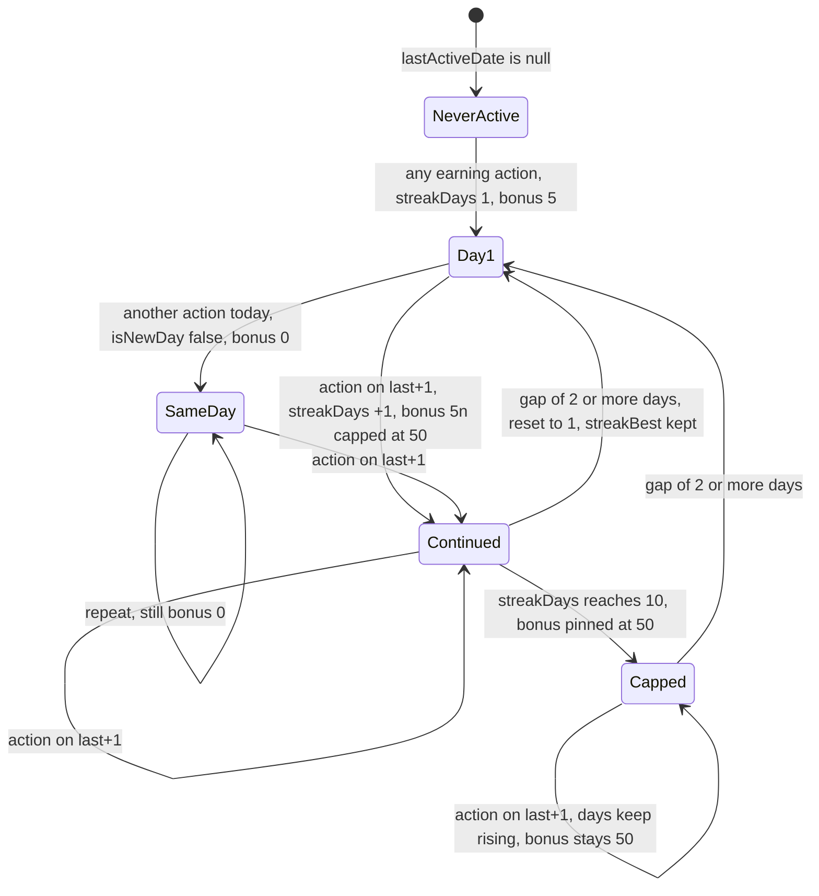
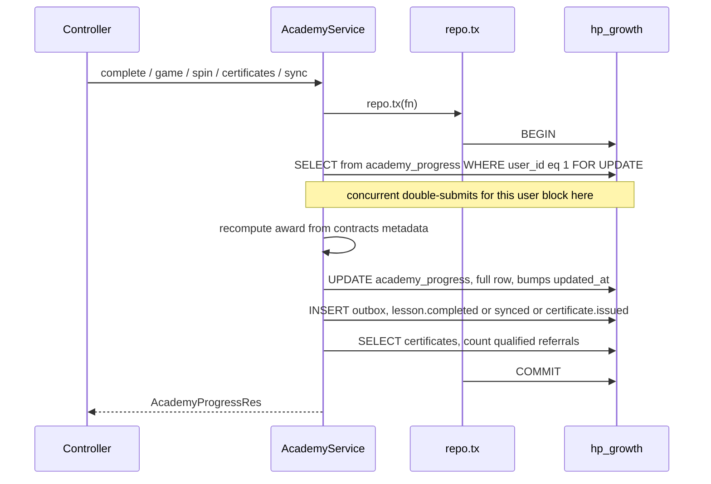
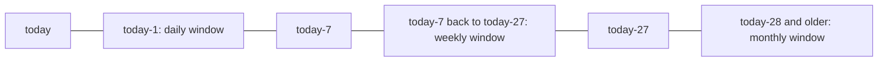

# Growth — Academy (XP, streaks, certificates, nudges)

What this covers: the server-authoritative gamified trading school inside
`growth-svc` — the complete XP economy, UTC-day streak and cap semantics, the
daily spin, the 10-level curriculum, the 11 certificate tracks and their code
format, the leaderboard, the transaction discipline that makes all of it
cheat-resistant, and the hourly nudge sweeper. Who it is for: an engineer
changing an XP number, adding a lesson or a track, or debugging why a nudge did
or did not fire. Table definitions live in [data model](../02-data-model.md);
the emails these events trigger live in [growth-messaging](./growth-messaging.md).

`growth-svc` hosts four bounded contexts in one process and one database. This is
one of them; the others are [early access](./growth-early-access.md),
[referrals](./growth-referrals.md) and [messaging](./growth-messaging.md).

---

## 1. Responsibility

Owns every user's XP total, UTC-day streak, lesson completion map, per-game
arcade counters, daily-spin state, academy referral edge, and issued
certificates — and **recomputes every award server-side from curriculum
metadata**, so a client can never mint XP. It also runs an hourly sweeper that
turns inactivity into nudge events on the bus.

It does not own: sending email (it emits events;
[messaging](./growth-messaging.md) sends), user identity (the `user_id` is an
identity-service id passed in by the BFF), or lesson content (the web app renders
it; the service only knows slugs, XP values and quiz question counts from
`@heropips/contracts`).

Every constant lives in `packages/contracts/src/index.ts` and is imported by both
the service and the web client's optimistic mirror at `apps/web/lib/academy/xp.ts`
(`apps/services/growth/src/academy/xp.ts:1-8`), so the two can never drift.

---

## 2. Module map

| File | Lines | Role |
|---|---|---|
| `apps/services/growth/src/academy/academy.controller.ts` | 96 | `@Controller("v1/academy")`, 8 routes, zod on every body |
| `apps/services/growth/src/academy/academy.service.ts` | 384 | `sync`, `progress`, `complete`, `game`, `spin`, `issueCertificate`, `verify`, `leaderboard` |
| `apps/services/growth/src/academy/academy.repo.ts` | 314 | `AcademyRepo` / `AcademyTxOps` DI seam (`ACADEMY_REPO`, `:107`) + `DrizzleAcademyRepo` |
| `apps/services/growth/src/academy/xp.ts` | 74 | Pure UTC-day / XP / streak math and the two code generators |
| `apps/services/growth/src/academy/nudges.ts` | 146 | `AcademyNudges` — the hourly three-cadence sweeper |
| `apps/services/growth/src/db/migrate.ts:100-147` | — | DDL for `academy_progress`, `academy_certificates`, `academy_nudges` |
| `packages/contracts/src/index.ts:683-966` | — | Levels, lessons, `ACADEMY_XP`, ranks, tracks, `ACADEMY_LIVE`, events, nudge rules |

Routes, all internal — the web BFF calls them server-side after `requireUser()`
and injects `user_id` / `email` / `display_name` itself. Anything that reaches
:4001 directly is trusted.

| Method | Path | Success | Errors |
|---|---|---|---|
| POST | `/v1/academy/sync` | 200 `AcademyProgressRes` | 422 |
| GET | `/v1/academy/progress/:userId` | 200 | 404 `academy_not_found` |
| POST | `/v1/academy/complete` | 200 `{awarded_xp, streak_bonus, progress}` | 422 (bad body **or** unknown slug), 404 |
| POST | `/v1/academy/game` | 200 same shape | 422, 404 |
| POST | `/v1/academy/spin` | 200 `{prize_xp, progress}` | 422, 404, 409 `academy_spin_used` |
| POST | `/v1/academy/certificates` | 200 `AcademyCertRes` | 422, 404, 409 `academy_track_incomplete` |
| GET | `/v1/academy/certificates/verify/:code` | **always 200** `{valid, certificate\|null}` | none |
| GET | `/v1/academy/leaderboard?limit=` | 200 `{entries:[…]}` | none |

Every POST is `@HttpCode(200)` — there are no 201s. `limit` is floored and capped
at 50, defaulting to 10 when absent or non-numeric
(`apps/services/growth/src/academy/academy.controller.ts:21-22`, `:92-93`).

---

## 3. The XP economy — complete

### 3.1 Every constant in `ACADEMY_XP`

`packages/contracts/src/index.ts:752-764`. This is the full object; nothing is
omitted.

| Constant | Value | Meaning | Read at |
|---|---|---|---|
| `QUIZ_CORRECT` | **10** | XP per correct quiz answer | `apps/services/growth/src/academy/xp.ts:35` |
| `QUIZ_PERFECT_BONUS` | **20** | Extra, only when `score === total` | `apps/services/growth/src/academy/xp.ts:35` |
| `GAME_WIN` | **15** | XP for an arcade win | `apps/services/growth/src/academy/academy.service.ts:255` |
| `GAME_DAILY_CAP` | **10** | XP-earning arcade rounds per game per UTC day | `apps/services/growth/src/academy/academy.service.ts:254` |
| `ANON_LESSON_LIMIT` | **1** | Lessons an anonymous visitor may earn on before the claim wall | **never read by growth-svc** — client-side only |
| `REFERRAL_BONUS` | **250** | Awarded to **both** sides, once per referred user | `apps/services/growth/src/academy/academy.service.ts:138-145` |
| `STREAK_BONUS_PER_DAY` | **5** | Multiplier for the first-activity-of-day bonus | `apps/services/growth/src/academy/xp.ts:40` |
| `STREAK_BONUS_CAP` | **50** | Ceiling on the streak bonus, reached at streak 10 | `apps/services/growth/src/academy/xp.ts:40` |
| `SPIN_PRIZES` | **[10, 15, 20, 25, 40, 60, 80, 100]** | Uniform draw for the daily spin | `apps/services/growth/src/academy/academy.service.ts:281` |

Plus the two award sources that are not in `ACADEMY_XP`:

| Source | Value | Where |
|---|---|---|
| Lesson base XP | **60–150**, per lesson | `ACADEMY_LESSONS[i].xp` (`packages/contracts/src/index.ts:713-745`) |
| Certificate issuance | **0 XP** — records an `xp_at_issue` snapshot only | `apps/services/growth/src/academy/academy.service.ts:317-323` |

Derived award functions (`apps/services/growth/src/academy/xp.ts`):

```ts
clampScore(score, quizTotal) = max(0, min(floor(score), quizTotal))                       // :29-31
quizXp(score, total) = score * QUIZ_CORRECT + (score === total ? QUIZ_PERFECT_BONUS : 0)  // :34-36
streakBonus(days) = min(days * STREAK_BONUS_PER_DAY, STREAK_BONUS_CAP)                    // :39-41
```

Worked example, asserted at
`apps/services/growth/test/academy.service.spec.ts:53`: a perfect
`what-is-trading` (base 60, quiz 4) on a user's first ever day pays
`60 + 4×10 + 20 = 120` as `awarded_xp`, plus `streak_bonus = min(1×5, 50) = 5`,
for `xp_total = 125`.

The theoretical maximum from curriculum alone: 3 040 base XP, plus 143 quiz
questions × 10, plus 31 × 20 perfect bonuses = **5 090 XP** — just past the 5 000
threshold for the Hero Trader rank. The curriculum is sized to exactly reach the
top rank if every quiz is perfect.

### 3.2 UTC-day streak rules

Every day boundary in the academy is `d.toISOString().slice(0,10)` — pure UTC,
no timezone handling anywhere (`apps/services/growth/src/academy/xp.ts:11-13`).
A user in UTC+13 loses their streak at 13:00 local.

```ts
nextStreak(prev: {days, last}, today) {                       // xp.ts:47-54
  if (prev.last === today)                return {days: prev.days,     isNewDay: false};
  if (prev.last === dayOffset(today, -1)) return {days: prev.days + 1, isNewDay: true};
  return {days: 1, isNewDay: true};                           // gap, or first ever
}
```

`applyStreak` (`apps/services/growth/src/academy/academy.service.ts:81-88`) is
the **single mutation point** for streak state anywhere in the service:

```ts
const t = nextStreak({days: row.streakDays, last: row.lastActiveDate}, today);
const bonus = t.isNewDay ? streakBonus(t.days) : 0;
row.streakDays     = t.days;
row.streakBest     = Math.max(row.streakBest, t.days);   // never decreases
row.lastActiveDate = today;
return bonus;
```



Three consequences worth internalising:

1. **`streakDays` keeps counting past 10; only the *bonus* is capped.** A 20-day
   streak reports `streak_days: 20` and pays exactly `STREAK_BONUS_CAP = 50`
   (`apps/services/growth/test/academy.service.spec.ts:130` block).
2. **`streakBest` is monotone.** A reset to 1 leaves `streak_best` at its high
   water mark.
3. **The streak is derived from the stored `lastActiveDate`, never from the
   request.** There is no client-supplied date anywhere in the streak path.

Which actions advance the streak
(`apps/services/growth/src/academy/academy.service.ts`):

| Action | Advances streak? | Note |
|---|---|---|
| `complete` a new lesson | yes, always | `:212` |
| `complete` an already-completed lesson | **no** — early-return no-op | `:203-209` |
| `sync` merging ≥1 new completion | yes, **once for the whole batch** | `:129` |
| `sync` merging 0 completions | no | `:129` guard `merged.length > 0` |
| `game` win under the cap | yes | `:256` — `bonus` only when `awarded > 0` |
| `game` loss, or a win over the cap | **no** | a loss leaves `lastActiveDate` untouched |
| `spin` | yes, always | `:282` |
| `issueCertificate` | no | no `applyStreak` call |

### 3.3 The arcade and its caps

`game` (`apps/services/growth/src/academy/academy.service.ts:241-266`) keeps a
per-game state object `{date, plays, wins, best_streak}` inside the `games` jsonb.

```ts
const prev  = row.games[req.game];
const state = prev && prev.date === today
  ? {...prev}                                                              // same UTC day
  : {date: today, plays: 0, wins: 0, best_streak: prev?.best_streak ?? 0}; // :246-249
state.plays += 1;                                                          // :250
if (req.won) state.wins += 1;
state.best_streak = Math.max(state.best_streak, req.streak ?? 0);          // :252

const capped  = state.plays > ACADEMY_XP.GAME_DAILY_CAP;                   // :254
const awarded = req.won && !capped ? ACADEMY_XP.GAME_WIN : 0;              // :255
const bonus   = awarded > 0 ? applyStreak(row, today) : 0;                 // :256
```

- The cap is evaluated **after** the increment, so plays 1–10 can pay and play 11
  cannot. `capped` is `plays > 10`, not `>=`.
- The counter resets lazily by comparing the stored `date` to `utcDay()` — there
  is no midnight job.
- `best_streak` is all-time and deliberately survives the daily reset (`:249`).
- `plays` counts every round including losses, so ten losses exhaust the day's
  earning budget.
- **No outbox event.** Arcade activity is invisible to messaging and analytics.
- Games are `"long-short"` and `"risk-sizer"` (`packages/contracts/src/index.ts:824`).

### 3.4 The daily spin

`spin(userId)` (`apps/services/growth/src/academy/academy.service.ts:269-291`):

```
if row.spinLastDate === utcDay()  -> 409 academy_spin_used
                                     "Come back after midnight UTC for another spin."
prize = SPIN_PRIZES[crypto.randomInt(SPIN_PRIZES.length)]   // uniform over 8 values, server-side
bonus = applyStreak(row, today)
row.xp += prize + bonus
row.spinLastDate = today
```

Expected value is `(10+15+20+25+40+60+80+100)/8 = 43.75` XP per day, plus the
streak bonus. `randomInt` is rejection-sampled and unbiased; the client cannot
influence the prize. **No outbox event.**

### 3.5 Anti-cheat summary

Nine mechanisms, in the order an attacker meets them. Line references are
`apps/services/growth/src/academy/academy.service.ts` unless stated.

| # | Mechanism | Where |
|---|---|---|
| 1 | The client's claimed `total` is ignored — the award is recomputed from `ACADEMY_LESSON_BY_SLUG[slug]` | `:197`, `:210-211` |
| 2 | `clampScore` floors and clamps into `[0, meta.quiz]`; `score: 99, total: 99` yields 120, not 1010 | `apps/services/growth/src/academy/xp.ts:29-31` |
| 3 | Unknown slugs → 422 before any transaction opens; in `sync` they are silently dropped instead | `:198-200`, `:119` |
| 4 | Re-completion is a hard no-op: 0 XP, no streak change, no event | `:203-209` |
| 5 | Streak derives from stored state only | `:81-88` |
| 6 | Spin prize drawn with `node:crypto` server-side | `:281` |
| 7 | Arcade cap enforced on the stored `plays` counter | `:246-254` |
| 8 | Every mutation runs under `SELECT … FOR UPDATE` on the user row | `apps/services/growth/src/academy/academy.repo.ts:188-195` |
| 9 | Certificates require every track slug present in stored `completions` | `:303-311` |

---

## 4. Feature walkthroughs

Line references in this section are
`apps/services/growth/src/academy/academy.service.ts` unless stated.

### 4.1 `sync` (`:100-176`)

The only endpoint that creates a row. One transaction:

1. `getProgressForUpdate(user_id)`; `created = existing === null`.
2. Existing → spread it and **overwrite `email` and `displayName` from the
   request** (`:105`). New → `insertProgress` with a collision-checked referral
   code from `uniqueReferralCode` (`:376-383`, 5 attempts then a thrown `Error`).
3. Merge device-banked completions (`:117-128`): for each `client.completions`
   entry, skip unknown slugs and slugs already recorded, `clampScore`, award
   `meta.xp + quizXp(score, meta.quiz)`, and record
   `{score, total: meta.quiz, xp, at: entry.at}` — note `at` is the client's own
   timestamp, the only client-supplied value that survives into storage.
4. **One** `applyStreak` for the whole batch, only when at least one slug merged
   (`:129`).
5. Referral resolution (§4.3).
6. `saveProgress`, then one `academy.lesson.completed` event per merged slug and
   one terminal `academy.synced` (`:152-173`).

Re-running `sync` with the same client payload is idempotent: every slug is
already in `completions`, so nothing merges and nothing is awarded — only the
`academy.synced` event fires again.

### 4.2 `complete` (`:196-234`)

422 on an unknown slug (checked before the transaction opens), 404 if the user
never synced, no-op branch on re-completion, otherwise:

```
awarded = meta.xp + quizXp(clampScore(req.score, meta.quiz), meta.quiz)
bonus   = applyStreak(row, utcDay())
row.xp += awarded + bonus
```

The response and the emitted `academy.lesson.completed` event both report
`xp_awarded = awarded`, **excluding** the streak bonus, while `xp_total` and
`progress.xp` include it (`:224-231`). Anything downstream that sums `xp_awarded`
will not reconcile with `xp_total`.

### 4.3 Referrals inside the academy

Note: this is a **third** referral mechanism, unrelated to both the waitlist
referral and the MLM tree — see
[growth-referrals](./growth-referrals.md#0-read-this-first-there-are-two-referral-systems-and-they-are-not-connected).

`sync` only (`:132-149`). `ref_code` is trimmed and lowercased; the branch runs
only when `row.referredBy === null`, so the edge is **write-once**. The parent
must exist (`findByReferralCode`) and must not be the user themselves. Both sides
get `+250` XP and one `academy.referral.awarded` event fires. The parent's XP is
written with a separate `saveProgress` inside the same transaction (`:139`).

Codes are 8 lowercase Crockford base32 characters from `randomBytes(8)`, one
character per byte via `byte % 32`
(`apps/services/growth/src/academy/xp.ts:60-65`). Crockford's alphabet
`0123456789abcdefghjkmnpqrstvwxyz` omits I, L, O and U and has exactly 32
symbols, so the modulo is unbiased
(`apps/services/growth/src/academy/xp.ts:56-57`). Key space 32⁸ ≈ 1.1 × 10¹²,
backstopped by the unique index `academy_progress_referral_code_uq`
(`apps/services/growth/src/db/migrate.ts:117`).

A *qualified* referral is a stricter notion used for the live-class ladder: an
invitee who has completed **every** lesson of level
`ACADEMY_LIVE.QUALIFIED_REFERRAL_LEVEL = 5`
(`packages/contracts/src/index.ts:810`). The slugs are derived, never hardcoded
(`apps/services/growth/src/academy/academy.repo.ts:17-19`), and counted with a
jsonb "contains all keys" query:

```sql
-- countQualifiedReferralsOn (academy.repo.ts:168-180)
SELECT count(*)::int FROM academy_progress
 WHERE referred_by = $1
   AND completions ?& '{indicators-without-superstition,breakout-or-pullback,build-your-first-strategy}'::text[];
```

The array must be bound as a **PG array literal string** cast to `text[]`; a JS
array parameter would bind as a record (comment
`apps/services/growth/src/academy/academy.repo.ts:165-166`).

`ACADEMY_LIVE.REFERRAL_TIERS` (`packages/contracts/src/index.ts:811-815`) maps
5 / 25 / 100 qualified referrals to 3 / 12 / unlimited free months of the Hero
Council live class, and `GRAD_FREE_MONTHS = 12` is the graduation grant. **The
growth service never reads `REFERRAL_TIERS` or `GRAD_FREE_MONTHS`** — it only
returns the raw `referrals_qualified` count; tier presentation is a client
concern.

### 4.4 The curriculum: 10 levels, 31 lessons

`ACADEMY_LEVELS` (`packages/contracts/src/index.ts:691-702`) — `access` gates the
web UI, not this service:

| # | Level id | Name | Access | Lessons | Base XP | Quiz Qs |
|---|---|---|---|---|---|---|
| 0 | `first-steps` | First Steps | `open` | 3 | 180 | 13 |
| 1 | `read-the-market` | Read the Market | `member` | 3 | 210 | 15 |
| 2 | `protect-your-money` | Protect Your Money | `member` | 4 | 330 | 18 |
| 3 | `chart-structure` | Chart Structure | `member` | 3 | 270 | 15 |
| 4 | `find-the-trade` | Find the Trade | `member` | 3 | 280 | 14 |
| 5 | `strategy-lab` | Strategy Lab | `member` | 3 | 310 | 14 |
| 6 | `prove-it` | Prove It | `member` | 3 | 350 | 12 |
| 7 | `mind-of-a-hero` | Mind of a Hero | `member` | 3 | 340 | 14 |
| 8 | `trade-with-the-machine` | Trade With the Machine | `pro` | 3 | 360 | 14 |
| 9 | `go-live` | Go Live Like a Hero | `pro` | 3 | 410 | 14 |
| | | **total** | | **31** | **3 040** | **143** |

`ACADEMY_LESSONS` (`packages/contracts/src/index.ts:713-745`) is **ordered — the
array index is curriculum order**, and that ordering is load-bearing for the
weekly nudge, which picks the first incomplete lesson by scanning it. The comment
at `packages/contracts/src/index.ts:712` warns that slugs are public URLs and
must never be renamed.

`ACADEMY_RANKS` (`packages/contracts/src/index.ts:768-779`) — ascending
thresholds, rank = the last entry with `at ≤ xp`: 0 Recruit · 150 Pip Rookie ·
400 Chart Reader · 800 Risk Keeper · 1350 Structure Scout · 2000 Setup Hunter ·
2750 Strategy Smith · 3550 Paper Pilot · 4400 Machine Tamer · 5000 Hero Trader.
**No file under `apps/services/growth/src` references `ACADEMY_RANKS`** — ranks
are computed client-side from `progress.xp`.

### 4.5 Certificates: 11 tracks

`AcademyCertTrack` is the zod enum `level-0` … `level-9` plus `hero-trader`
(`packages/contracts/src/index.ts:783-787`) — **11 tracks**.
`ACADEMY_TRACK_LEVELS` (`packages/contracts/src/index.ts:791-798`) maps each
`level-N` to exactly one level id and `hero-trader` to all ten:

```ts
academyTrackSlugs(track) =                                   // contracts:818-821
  ACADEMY_LESSONS.filter(l => ACADEMY_TRACK_LEVELS[track].includes(l.level))
                 .map(l => l.slug);
```

So `level-0` requires 3 slugs, `level-2` requires 4, and `hero-trader` requires
all 31 (`apps/services/growth/test/academy.service.spec.ts:344` block).

`issueCertificate` (`:297-336`):

1. `SELECT … FOR UPDATE` the progress row (404 if absent).
2. `getCertificate(userId, track)` — an existing row is returned as-is, making
   the endpoint **idempotent** (`:300-301`).
3. `missing = academyTrackSlugs(track).filter(slug => !row.completions[slug])`;
   non-empty → `409 academy_track_incomplete` carrying the missing count
   (`:303-311`).
4. Generate a code, retrying up to `CODE_RETRIES = 5` on collision (`:313-316`).
5. Insert, snapshotting `recipient = row.displayName` and `xpAtIssue = row.xp`
   at issue time (`:317-323`) — both frozen forever.
6. Emit `academy.certificate.issued`.

**Code format**: `generateCertificateCode()`
(`apps/services/growth/src/academy/xp.ts:68-74`) takes `randomBytes(10)`, maps
each byte through Crockford base32, uppercases, and formats as

```
HP-XXXXX-XXXXX          e.g. HP-3K7QT-9VWB2
```

Regex-asserted `/^HP-[0-9A-Z]{5}-[0-9A-Z]{5}$/`. Key space 32¹⁰ ≈ 1.1 × 10¹⁵,
backstopped by `academy_certificates_code_uq`
(`apps/services/growth/src/db/migrate.ts:131`).

`verify(code)` (`:339-342`) trims and uppercases, then does an exact match. It
**always returns 200** with `{valid: false, certificate: null}` for unknown codes,
so the public verification page needs no error handling.

### 4.6 Leaderboard and the tiebreak

```sql
SELECT display_name, xp, streak_days FROM academy_progress
 ORDER BY xp DESC, updated_at ASC
 LIMIT $1;
```

`apps/services/growth/src/academy/academy.repo.ts:289-299`. **Ties break by
`updated_at` ascending — the earlier achiever ranks first.** The index
`academy_progress_leaderboard_idx (xp DESC, updated_at ASC)`
(`apps/services/growth/src/db/migrate.ts:118`) matches this ORDER BY exactly.
`display_name` is returned publicly and the route is reachable unauthenticated
through the BFF.

Because `saveProgress` writes `updatedAt: new Date()` on every mutation
(`apps/services/growth/src/academy/academy.repo.ts:215`), a user who keeps
playing after reaching a tied XP total **loses** the tiebreak to a user who
stopped. The tiebreak rewards being idle at a score, not reaching it first.

### 4.7 `progressRes`

Every read *and* every mutation response calls `progressRes` (`:365-374`), which
issues two extra queries — `listCertificates` and `countQualifiedReferrals` — on
top of the main work. A `game` call is therefore three queries minimum inside a
`FOR UPDATE` transaction.

---

## 5. Transaction discipline



- **Every mutation** opens `db.transaction` and takes `SELECT … FOR UPDATE` on
  the user's row as its first statement
  (`apps/services/growth/src/academy/academy.repo.ts:188-195`). This is the
  mechanism that makes double-submitted lesson completions safe.
- **Outbox rows are written inside the same transaction** as the state change
  (`apps/services/growth/src/academy/academy.repo.ts:264-266`), so an event can
  never exist without its state or vice versa.
- **Reads take no transaction** — `progress` (`:179`), `verify` (`:340`) and
  `leaderboard` (`:345`) call the repo's non-tx methods directly.
- Lock scope is one row, so different users never contend. Contrast
  [early access](./growth-early-access.md#33-join-position-assignment-under-a-global-lock),
  which needs a service-wide advisory lock because its invariant cannot be
  expressed as a constraint.
- `saveProgress` is a full-row `UPDATE … SET` of every mutable column plus
  `updatedAt: new Date()`
  (`apps/services/growth/src/academy/academy.repo.ts:201-222`), and throws
  `"academy_progress row vanished mid-transaction"` if it affects zero rows.

---

## 6. The nudge sweeper

`AcademyNudges` (`apps/services/growth/src/academy/nudges.ts`) turns inactivity
into events. It is a plain `setInterval`, not a cron: interval from
`ACADEMY_NUDGE_INTERVAL_SEC`, else `DEFAULT_INTERVAL_SEC = 3600`, floored at
`MIN_INTERVAL_SEC = 5` (`:13-14`, `:52-60`). The timer is `unref()`'d so it never
holds the process open. The whole pass is wrapped in try/catch with a 30 s warn
throttle — **a sweep never rejects** (`:68-82`, asserted
`apps/services/growth/test/academy.nudges.spec.ts:150`).

One pass runs all three cadences in order against the same `today = utcDay(now)`
(`:70-73`).

### 6.1 The three cadences and their exact selection predicates

Constants `ACADEMY_NUDGE` (`packages/contracts/src/index.ts:959-966`):
`DAILY_MIN_STREAK 3`, `WEEKLY_AFTER_DAYS 7`, `MONTHLY_AFTER_DAYS 28`.

| Cadence | Candidate query | Extra gate | Re-nudge spacing | Event |
|---|---|---|---|---|
| **daily** (`:85-98`) | `listActiveBetween(today-1, today-1)` — `last_active_date` is **exactly** yesterday | `row.streakDays >= 3` | PK only, at most one per UTC day | `academy.nudge.daily` |
| **weekly** (`:104-127`) | `listActiveBetween(today-27, today-7)` | must have ≥1 incomplete lesson; picks the **first** incomplete in `ACADEMY_LESSONS` order | `lastNudgeOn(user,"weekly")` must be ≥ 7 days ago | `academy.nudge.weekly` |
| **monthly** (`:130-145`) | `listActiveOnOrBefore(today-28)` | none | `lastNudgeOn(user,"monthly")` must be ≥ 28 days ago | `academy.nudge.monthly` |

In predicate form, with `d = last_active_date`:

```
daily   : d = today-1                  AND streak_days >= 3
weekly  : today-27 <= d <= today-7     AND exists lesson not in completions
                                       AND (no weekly nudge OR daysBetween(last, today) >= 7)
monthly : d <= today-28                AND (no monthly nudge OR daysBetween(last, today) >= 28)
```

The weekly lower bound is written as
`dayOffset(today, -(ACADEMY_NUDGE.MONTHLY_AFTER_DAYS - 1))` = `today-27`
(`:106`), so the weekly and monthly windows are **disjoint by construction** —
change `MONTHLY_AFTER_DAYS` and the weekly window follows automatically. Rows
with `last_active_date IS NULL` are excluded naturally, because `>=` and `<=`
against NULL are unknown.



### 6.2 Idempotency

Each due user gets a ledger row and an outbox event in **one transaction**
(`:87-97`, `:112-126`, `:134-144`):

```ts
await this.repo.tx(async (ops) => {
  if (!(await ops.insertNudge(row.userId, cadence, today))) return;  // ON CONFLICT DO NOTHING
  await ops.insertOutbox(TOPICS.growthEvents, makeEnvelope(...));
});
```

`academy_nudges` has the composite primary key `(user_id, cadence, sent_on)`
(`apps/services/growth/src/db/migrate.ts:141-146`), so `insertNudge` returns
`true` only when it really inserted
(`apps/services/growth/src/academy/academy.repo.ts:254-263`). A second sweep on
the same UTC day inserts nothing and emits nothing
(`apps/services/growth/test/academy.nudges.spec.ts:26` block). Because the ledger
row and the event commit together, a crash between them is impossible.

`nudgePayload` (`:18-25`) is the shared base:
`{user_id, email, display_name, streak_days, xp}`. Weekly adds
`{completed_count, total_lessons, next_slug}` (`:118-124`).

---

## 7. Data

Full definitions in [data model](../02-data-model.md).

| Table | Key | Notable constraints |
|---|---|---|
| `academy_progress` (`apps/services/growth/src/db/schema.ts:107`) | `user_id` text PK | `CHECK (xp >= 0)`; `completions` / `games` jsonb default `{}`; `last_active_date` / `spin_last_date` are `date` in string mode (`apps/services/growth/src/db/migrate.ts:100-116`) |
| `academy_certificates` (`apps/services/growth/src/db/schema.ts:125`) | `id` uuid; **`UNIQUE (user_id, track)`** | `CHECK track IN ('level-0'..'level-9','hero-trader')` (`apps/services/growth/src/db/migrate.ts:125`, `:138-139`) |
| `academy_nudges` (`apps/services/growth/src/db/schema.ts:137`) | **composite PK `(user_id, cadence, sent_on)`** | `CHECK cadence IN ('daily','weekly','monthly')` (`apps/services/growth/src/db/migrate.ts:141-146`) |

Indexes the code depends on (`apps/services/growth/src/db/migrate.ts`):

| Index | Serves |
|---|---|
| `academy_progress_referral_code_uq` (`:117`) | backstops the 5-retry `uniqueReferralCode` loop |
| `academy_progress_leaderboard_idx (xp DESC, updated_at ASC)` (`:118`) | exactly the leaderboard ORDER BY |
| `academy_progress_last_active_idx (last_active_date)` (`:119`) | all three nudge candidate scans |
| `academy_certificates_code_uq` (`:131`) | public verify lookup and collision detection |
| `academy_nudges_cadence_sent_idx (cadence, sent_on)` (`:147`) | ops queries over a cadence and day |

**One-time destructive migration**:
`DELETE FROM academy_certificates WHERE track = 'foundations'`
(`apps/services/growth/src/db/migrate.ts:132-139`). The old two-track model
(`foundations`, `hero-trader`) was replaced by per-level tracks. `foundations`
covered levels 0–2 and has no single per-level equivalent, so the rows are
deleted rather than remapped — the comment states this is prelaunch dev data with
no real users. The CHECK constraint is then dropped and re-added, keeping the
whole block idempotent. **Watch this if you ever run the bootstrap DDL against a
database holding real certificates.**

### Invariants

1. `academy_progress.xp` is monotonically non-decreasing — the service only ever
   does `+=`, and the DB enforces `CHECK (xp >= 0)`.
2. `referredBy` is write-once
   (`apps/services/growth/src/academy/academy.service.ts:134`).
3. A slug present in `completions` is never re-awarded (`:119`, `:203`).
4. `streakBest = max(streakBest, streakDays)`, never decreases (`:85`).
5. One certificate per `(user_id, track)`, forever — a DB UNIQUE plus a
   read-first branch.
6. `recipient` and `xp_at_issue` on a certificate are immutable snapshots.

---

## 8. Events

All on `hp.growth.events.v1`, all written to `outbox` inside the business
transaction, relayed at-least-once by `OutboxRelay`. Name constants at
`packages/contracts/src/index.ts:948-956`; emission sites are in
`apps/services/growth/src/academy/academy.service.ts` and
`apps/services/growth/src/academy/nudges.ts`.

| `type` | Payload | Emitted at |
|---|---|---|
| `academy.synced` | `{user_id, email, display_name, created, merged_count, xp_total}` | `academy.service.ts:163-173` |
| `academy.lesson.completed` | `{user_id, slug, xp_awarded, xp_total}` | `academy.service.ts:152-162` (sync — one per merged slug) and `:219-227` (complete) |
| `academy.referral.awarded` | `{user_id, referrer_id, xp_awarded: 250}` | `academy.service.ts:140-147` |
| `academy.certificate.issued` | `{user_id, track, code, recipient, xp_at_issue}` | `academy.service.ts:324-333` |
| `academy.nudge.daily` | `{user_id, email, display_name, streak_days, xp}` | `nudges.ts:92-95` |
| `academy.nudge.weekly` | base + `{completed_count, total_lessons, next_slug}` | `nudges.ts:118-125` |
| `academy.nudge.monthly` | base | `nudges.ts:139-142` |

`game` and `spin` emit **nothing** — arcade and spin activity never reaches the
bus, so it cannot trigger email or feed analytics.

Consumed by [messaging](./growth-messaging.md#5-the-kafka-consumer-and-the-scheduler):
the three nudge events become the three nudge emails,
`academy.certificate.issued` becomes the certificate email, and
`academy.lesson.completed` only updates the contact projection (`lastLessonAt`)
with no email. `academy.synced` and `academy.referral.awarded` have **no consumer
anywhere**.

---

## 9. Configuration

| Env var | Read at | Default |
|---|---|---|
| `ACADEMY_NUDGE_INTERVAL_SEC` | `apps/services/growth/src/academy/nudges.ts:54` | `3600`, floored at 5 |
| `DATABASE_URL_GROWTH` / `DATABASE_URL` | `apps/services/growth/src/db/client.ts:6-8` | `postgres://hp:hp@localhost:5432/hp_growth` |
| `GROWTH_URL` (web BFF) | `apps/web/lib/api.ts:5` | `http://localhost:4001` |

That is the entire academy configuration surface. `ACADEMY_NUDGE_INTERVAL_SEC` is
not set by any compose file, so every environment runs the sweeper hourly. There
is no feature flag: the nudge sweeper starts unconditionally on
`onApplicationBootstrap` (`apps/services/growth/src/academy/nudges.ts:44-46`),
unlike the messaging scheduler, which honours `MESSAGING_ENABLED`.

Demo rows for local work ship in `infra/sql/seed/growth.sql`, applied by
`pnpm db:seed` — see [developer guide](../08-developer-guide.md).

---

## 10. Testing

No database anywhere. `apps/services/growth/test/academy-mem-repo.ts` (167 lines)
implements both `AcademyRepo` and `AcademyTxOps`, with `tx` simply calling
`fn(this)`. It `structuredClone`s on every read and write to mimic row copies and
catch accidental aliasing, and enforces the real constraints in memory: the
progress PK, `(user_id, track)` certificate uniqueness, and the nudge triple. It
also re-implements the jsonb `?&` semantics for `countQualifiedReferrals`.
Because `tx` has **no rollback semantics**, no test can observe
partial-transaction behaviour.

| Spec | Size | Describe blocks |
|---|---|---|
| `apps/services/growth/test/academy.service.spec.ts` | 453 lines, 27 tests, fake timers pinned to `2026-07-01T12:00:00Z` | lesson completion (`:51`), streak transitions (`:130`), arcade games (`:173`), daily spin (`:225`), sync (`:249`), referrals (`:295`), certificates (`:344`), progress + leaderboard (`:423`) |
| `apps/services/growth/test/academy.nudges.spec.ts` | 171 lines, 10 tests at `NOW = 2026-07-15T06:00:00Z` | daily nudge (`:26`), weekly nudge (`:67`), monthly nudge (`:117`), sweep resilience (`:150`) |

Representative assertions: the exact 120 XP for a perfect `what-is-trading` plus
the full event payload; a claimed `score:99,total:99` clamping to 4/4 and
`score:-3` clamping to 0; a seeded 20-day streak paying exactly
`STREAK_BONUS_CAP`; arcade cap reset across UTC days; spin 409 on a second draw;
sync merge idempotency; the referral bonus awarded to both sides exactly once;
per-level versus hero-trader certificate gates and the code regex; leaderboard
tie ordering. For nudges: daily fires at `streakDays === 3` last active yesterday
and skips streak 2, users active today and 2-day gaps; weekly fires at 10 days
inactive naming `ACADEMY_LESSONS[1].slug` with `completed_count: 1,
total_lessons: 31`, and a weekly nudge 3 days ago blocks while 8 days ago allows;
monthly fires at 35 days and skips 25 days and `lastActiveDate: null`; a throwing
`listActiveBetween` still resolves.

**Not covered:** `DrizzleAcademyRepo`'s SQL, including the `FOR UPDATE` lock and
the jsonb `?&` query.

---

## 11. Hazards and gaps

1. **`sync` overwrites `email` and `display_name` on every call**
   (`apps/services/growth/src/academy/academy.service.ts:105`) while
   `msg_contacts` deliberately never overwrites
   ([messaging](./growth-messaging.md)). The two projections drift after a name
   change, and certificates snapshot `recipient` at issue time, so they keep the
   old name forever.
2. **Streak bonus is excluded from `awarded_xp` but included in `xp`** (§4.2).
   Any downstream summing `xp_awarded` will not reconcile with `xp_total`.
3. **`game` and `spin` emit no events.** Arcade engagement is invisible to
   messaging, analytics and any future data pipeline.
4. **`ANON_LESSON_LIMIT` and `ACADEMY_RANKS` are never read server-side.** They
   are contract constants only the client enforces, so the anonymous earning wall
   is bypassable by calling the API directly — though the BFF requires a session
   first.
5. **`ACADEMY_LIVE.REFERRAL_TIERS` and `GRAD_FREE_MONTHS` have no server-side
   effect.** Nothing grants live-class access; only the raw qualified-referral
   count is exposed.
6. **The `foundations` certificate DELETE runs on every boot**
   (`apps/services/growth/src/db/migrate.ts:136`). It is a no-op once the rows
   are gone, but it is unconditional destructive DDL executed on every process
   start.
7. **`uniqueReferralCode` throws a plain `Error` after 5 collisions**
   (`apps/services/growth/src/academy/academy.service.ts:382`) → 500.
   Practically unreachable at 32⁸, but there is no graceful path.
8. **The certificate collision loop does not re-check its last candidate.**
   `for (let i = 0; i < CODE_RETRIES && (await ops.getCertificateByCode(code)); i++) code = generateCertificateCode();`
   (`:313-316`) — the final regenerated value is inserted unchecked; the unique
   index is the real guard and a collision surfaces as a 500.
9. **`progressRes` costs two extra queries on every single call**, including pure
   reads and every arcade round (`:365-374`).
10. **All timekeeping is UTC with no user timezone.** A user far from UTC loses
    streaks and spins at a time that is not their local midnight, and nudges fire
    on UTC-day boundaries.
11. **The nudge sweeper loads full candidate rows into memory** —
    `listActiveBetween` and `listActiveOnOrBefore` have no `LIMIT` and no paging
    (`apps/services/growth/src/academy/academy.repo.ts:301-313`). At scale the
    monthly sweep selects every long-dormant user into one array, every hour.
12. **The nudge sweeper runs in every replica.** The `academy_nudges` PK makes
    duplicate *events* impossible, but N replicas do N times the scanning work and
    race on the insert.
13. **`verify` upper-cases its input**
    (`apps/services/growth/src/academy/academy.service.ts:340`) while codes are
    stored upper-case. A lower-case row — impossible via the generator, possible
    via a manual INSERT — could never be verified.
14. **`AcademyController` silently swallows a bad `limit`.** `?limit=abc` becomes
    10 and `?limit=999` becomes 50; neither is an error
    (`apps/services/growth/src/academy/academy.controller.ts:92-93`).
15. **No service-level auth on any academy route.**
    `POST /v1/academy/complete` with an arbitrary `user_id` awards XP to that
    user. The BFF's `requireUser()` is the only control and it is not enforced at
    :4001; see [security](../06-security.md).
16. **The leaderboard tiebreak penalises continued activity** at a tied XP total,
    because `updated_at` moves on every mutation (§4.6). This is very likely
    unintended.
