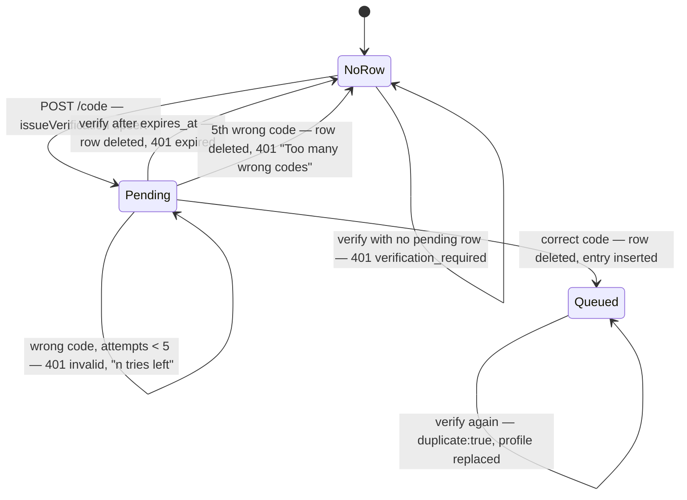
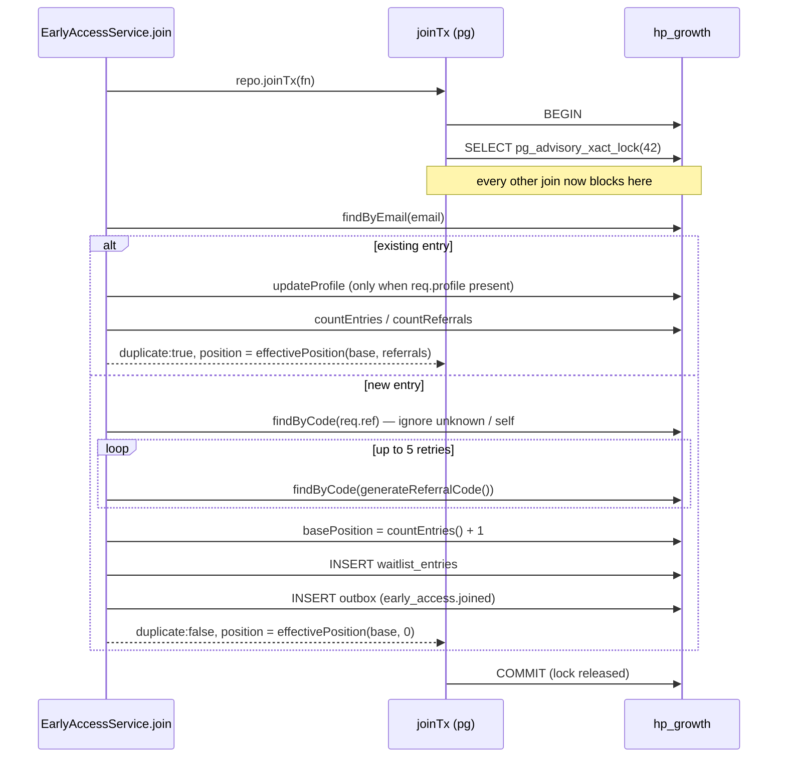

# Growth — Early Access (waitlist)

What this covers: the email-first, code-verified early-access signup inside
`growth-svc` (port 4001, database `hp_growth`) — the two-step state machine, how
verification codes are stored and rate-limited, how a queue position is assigned
under a global advisory lock, and the referral-jump arithmetic that moves a
position. Who it is for: an engineer touching signup, queue positions, or the
verification-code security surface. Deep behaviour that other documents own is
linked, not repeated: table definitions live in [data model](../02-data-model.md),
cross-service sequences in [flows](../03-flows.md), the HTTP contract in
[api reference](../05-api-reference.md), the threat model in
[security](../06-security.md), and the email that carries the code in
[growth-messaging](./growth-messaging.md).

`growth-svc` hosts four bounded contexts in one process and one database. This is
one of them; the others are [referrals](./growth-referrals.md),
[academy](./growth-academy.md) and [messaging](./growth-messaging.md).

---

## 1. Responsibility

Everything between an anonymous visitor typing an email address and a durable,
deliverable-by-construction waitlist row:

| Owns | Does not own |
|---|---|
| Issuing and validating 6-digit verification codes | Rendering or sending the email — it calls `MessagingService.dispatch` ([messaging](./growth-messaging.md)) |
| Creating `waitlist_entries` rows and assigning `base_position` | The MLM commission tree ([referrals](./growth-referrals.md)) — unrelated system |
| Referral-code minting and the queue-jump formula | Payments, seats, accounts |
| The signed status token that backs the "check my place" page | Token *format* — shared with billing, see [security](../06-security.md) |
| Operator notification on every verified signup | Anything the operator does with it |

The load-bearing design decision: **nothing reaches `waitlist_entries` until the
address has proven it can receive mail.** `POST /code` writes only to a pending
verification table; `POST /verify` is what creates the queue row
(`apps/services/growth/src/early-access/early-access.service.ts:28-36`). The
launch-invite list is therefore deliverable by construction.

---

## 2. Module map

| File | Lines | Role |
|---|---|---|
| `apps/services/growth/src/early-access/early-access.controller.ts` | 52 | `@Controller("v1/early-access")`; zod `safeParse` on every body → 422 |
| `apps/services/growth/src/early-access/early-access.service.ts` | 366 | The state machine: `requestCode`, `verify`, `join`, `notifyAdmin`, `stats`, `status` |
| `apps/services/growth/src/early-access/early-access.repo.ts` | 223 | `EarlyAccessRepo` DI seam (`EARLY_ACCESS_REPO`, `:72`) + `DrizzleEarlyAccessRepo`; owns `joinTx` and the advisory lock |
| `apps/services/growth/src/common/verification.ts` | 30 | `hashVerificationCode` / `verificationCodeMatches` — address-bound HMAC |
| `apps/services/growth/src/common/codes.ts` | 24 | `generateReferralCode` (8 chars) and `generateNumericCode` (n digits) |
| `apps/services/growth/src/common/position.ts` | 22 | `jumpsFor`, `effectivePosition`, `maskEmail` |
| `apps/services/growth/src/common/token.ts` | 37 | Status-token sign/verify |
| `apps/services/growth/src/common/config.ts` | 50 | `GrowthConfig`; the `EARLY_ACCESS_DEV_CODE` switch |
| `apps/services/growth/src/db/migrate.ts:7-38` | — | DDL for `waitlist_entries` and `early_access_verifications` |

Constructor injection uses explicit `@Inject` tokens throughout
(`early-access.service.ts:86-94`): `tsx`/esbuild emits no `design:paramtypes`
metadata, so a parameter added without a token is a runtime DI failure, not a
compile error.

`EarlyAccessService` takes a fourth constructor argument `now: () => Date` with a
default (`early-access.service.ts:92`). Nest never supplies it; it exists only so
specs can inject a clock.

---

## 3. The two-step state machine



Two states are worth naming precisely, because they behave differently:

- **`NoRow`** — no `early_access_verifications` row. A `waitlist_entries` row may
  or may not exist; the two tables are independent. A verified member who comes
  back is in `NoRow`, not `Queued`, until they request a fresh code.
- **`Queued`** — a `waitlist_entries` row exists. Re-verifying is legal and
  returns `duplicate: true` with the existing code and position.

### 3.1 Step 1 — `requestCode` (`early-access.service.ts:97-152`)

```
email = req.email.trim().toLowerCase()                      // :100
pending = repo.findVerification(email)                      // :102
if pending:
    waited    = floor((now - pending.lastSentAt) / 1000)     // :104
    remaining = EA_CODE_RESEND_SEC(30) - waited              // :105
    if remaining > 0  -> 429 rate_limited "Wait {remaining}s"  // :106-117
known = repo.findByEmail(email) !== null                    // :119
code  = cfg.devVerificationCode ?? generateNumericCode(6)   // :120
repo.issueVerification({                                     // :121-126
    email,
    codeHash:  hashVerificationCode(email, code),
    expiresAt: now + EA_CODE_TTL_SEC(900) * 1000,
    sentAt:    now,
})
result = messaging.dispatch(eaVerifyCode,
            { code, expiresMinutes: round(900/60) = 15, known },
            email, `tx:ea_code:${email}:${issued.lastSentAt.getTime()}`)   // :128-136
if result === "failed" -> 502 internal                       // :137-144
return { email_masked, expires_in: 900, resend_in: 30, dev_code? }  // :146-151
```

Constants come from `packages/contracts/src/index.ts:87-93`:
`EA_CODE_LENGTH 6`, `EA_CODE_TTL_SEC 15*60 = 900`, `EA_CODE_MAX_ATTEMPTS 5`,
`EA_CODE_RESEND_SEC 30`.

Four details a newcomer will otherwise get wrong:

1. **`known` never reaches the HTTP body.** It only switches the email copy
   between "Welcome back — confirm it's you" and "One code stands between you and
   your spot" (`templates/library.ts:797-803`). The endpoint is deliberately not
   a membership oracle; the response keys are identical either way
   (test `test/early-access.service.spec.ts:426`).
2. **The dedupe key is the issuance instant, not the `sends` counter.** Verifying
   deletes the row, so `sends` restarts at 1 and a counter-based key would collide
   with an earlier send — the messaging ledger would then swallow the new code
   silently. The comment at `:131-135` says so explicitly.
3. **Only `"failed"` is an error.** `dispatch` also returns
   `deduped | suppressed | capped | logged`
   (`apps/services/growth/src/messaging/messaging.service.ts:37`); all of those
   are treated as success and return 200.
4. **`dev_code` is echoed in the response body** whenever
   `cfg.devVerificationCode !== null` (`:150`). See §7.

### 3.2 Step 2 — `verify` (`early-access.service.ts:156-207`)

Checked in this exact order:

| # | Condition | Line | Effect |
|---|---|---|---|
| 1 | no pending row | `:160-167` | `401 verification_required` |
| 2 | `pending.expiresAt <= now` | `:169-177` | **delete the row**, `401 verification_code_expired` |
| 3 | HMAC mismatch, `EA_CODE_MAX_ATTEMPTS - attempts <= 0` | `:178-190` | **delete the row**, `401 verification_code_invalid` "Too many wrong codes." |
| 4 | HMAC mismatch, tries remaining | `:191-196` | `401 verification_code_invalid` "…{n} {try/tries} left." |
| 5 | match | `:198-203` | `clearVerification(email)` **then** `join(...)`, then `notifyAdmin` when `!duplicate` |

`bumpVerificationAttempts` returns the post-increment count
(`early-access.repo.ts:209-216`), so the fifth wrong guess yields `attempts = 5`,
`left = 0`, and burns the row. Four wrong guesses leave the row usable
(test `test/early-access.service.spec.ts:488`).

Note the ordering in case 5: the verification row is destroyed **before** the join
transaction runs. See [hazards](#9-hazards-and-gaps).

### 3.3 `join` — position assignment under a global lock

`apps/services/growth/src/early-access/early-access.service.ts:209-289`. The
entire body runs inside `repo.joinTx`, whose pg implementation takes
`SELECT pg_advisory_xact_lock(42)` as its first statement
(`early-access.repo.ts:112-113`). The lock is transaction-scoped, so it releases
on commit or rollback with no explicit unlock.



Why the lock exists: `base_position` is computed as
`(await ops.countEntries()) + 1` (`:252`) and then inserted. Without
serialisation two concurrent signups both read the same count and both claim the
same position. The advisory lock makes `base_position` **gapless, unique and
monotone** service-wide. `42` is a bare integer with no symbolic name; it is used
nowhere else in this service — check before reusing it.

Branch details:

- **Duplicate** (`:217-234`) — a supplied `profile` replaces the stored one;
  omitting the questions never wipes previous answers (`:219-220`). Returns
  `total = countEntries()`.
- **New** (`:236-288`) — `req.ref` is resolved case-insensitively via
  `upper(code) = upper($1)` (`early-access.repo.ts:116-125`). Unknown codes and
  self-referral (compared by email equality) are silently ignored (`:241-245`).
  Returns `total = basePosition`, i.e. count-before-insert + 1.

`total` therefore means two different things depending on the branch — see
[hazards](#9-hazards-and-gaps).

### 3.4 The position formula

```ts
jumpsFor(r)            = Math.floor(r / REFERRALS_PER_JUMP)        // REFERRALS_PER_JUMP = 3
effectivePosition(b,r) = Math.max(1, b - jumpsFor(r) * JUMP_SIZE)  // JUMP_SIZE = 25
```

`apps/services/growth/src/common/position.ts:4-11`; constants
`packages/contracts/src/index.ts:298-299`. Written out:

$$\text{position} = \max\left(1,\; \text{base} - \left\lfloor \frac{\text{referrals}}{3} \right\rfloor \times 25\right)$$

Properties, each covered by `test/position.spec.ts`:

| Input | Result | Why |
|---|---|---|
| base 100, 0 referrals | 100 | no jumps (`:5`) |
| base 100, 2 referrals | 100 | partial triples do not count — `floor(2/3) = 0` (`:10`) |
| base 100, 5 referrals | 75 | one completed jump (`:10`) |
| base 100, 3/6/9 referrals | 75 / 50 / 25 | 25 per jump (`:16`) |
| base 3, 30 referrals | 1 | floors at 1, never 0 or negative (`:22`) |

`base_position` is stored and never rewritten; the displayed position is always
derived. `referrals` is
`count(*) FROM waitlist_entries WHERE referred_by = $entryId`
(`early-access.repo.ts:100-106`). Because entries only exist post-verification,
every counted referral is verified by construction — which is why the status
response calls the field `referrals_verified` (`:363`).

### 3.5 `notifyAdmin` (`:296-323`)

Best-effort operator mail on every *new* verified signup. Skipped entirely when
`ADMIN_NOTIFY_EMAIL` is unset (`:302-303`). Wrapped in try/catch that only logs a
warning (`:319-322`) — a mail problem must never fail a signup that already
committed. Dedupe key `tx:admin_ea_signup:${entry.id}`; `joinedAt` is
`ISO.replace("T"," ").slice(0,16)`, i.e. UTC minute precision.
`describeProfile` (`:69-81`) turns the trader-profile enums into operator-readable
lines using `PROFILE_LABELS` (`:41-67`).

### 3.6 Read-only views

- **`stats` (`:326-334`)** — `Promise.all` over `countEntries`,
  `countEntriesSince(now - 86_400_000)` and `countEntriesSince(now - 7 × 86_400_000)`
  (`DAY_MS` at `:38`). Returns `{total, joined_today, joined_week}`.
- **`status(token)` (`:336-366`)** — verifies the HMAC status token, requires a
  non-empty string `e` claim, loads the entry by email, and returns
  `{email_masked, position, total, code, referrals_verified, jumps}`.
  `401 invalid_token` on a bad token (`:338-345`), `404 early_access_not_found`
  when the token is valid but no entry matches (`:348-350`).

---

## 4. Verification-code cryptography

```
stored = hex( HMAC-SHA256( STATUS_TOKEN_SECRET, lower(email) + ":" + code ) )
```

`apps/services/growth/src/common/verification.ts:9-15`. Key defaults to
`"dev-status-secret-change-me"` when `STATUS_TOKEN_SECRET` is unset (`:12`).

- **Address-bound.** The email is inside the HMAC input, so a leaked
  `early_access_verifications` table cannot be replayed against a different
  address (test `test/early-access.service.spec.ts:417`).
- **Constant-time comparison.** Length check, then `timingSafeEqual` over the
  hex-decoded buffers, with `catch → false` (`:23-29`).
- **No TTL inside the hash.** Expiry is the `expires_at` column, checked before
  the HMAC comparison.
- **Codes are uniform over the full 10⁶ space including leading zeros** —
  `generateNumericCode` draws each digit with `crypto.randomInt(10)`
  (`common/codes.ts:20-23`), so `"000123"` is exactly as likely as any other value.

Status tokens use a different scheme, shared verbatim with billing:
`base64url(JSON) + "." + hex(HMAC-SHA256(base64url, STATUS_TOKEN_SECRET))`,
growth payload `{"e":"<email>"}` (`common/token.ts:9-16`). Verification splits at
the **last** dot, rejects empty halves, compares in constant time, then requires a
non-array object whose values are all strings (`:22-33`). There is no `exp` claim
and no revocation list — see [security](../06-security.md).

Referral codes come from a 32-glyph alphabet with I/O/0/1 removed,
`ABCDEFGHJKLMNPQRSTUVWXYZ23456789`, length 8 (`common/codes.ts:4-5`), drawn with
`crypto.randomInt` per character. Key space 32⁸ ≈ 1.1 × 10¹².

---

## 5. Data

Full column lists and comments are in [data model](../02-data-model.md); this is
what the module relies on.

| Table | Key | Constraint that matters here |
|---|---|---|
| `waitlist_entries` (ORM symbol `earlyAccessEntries`, `db/schema.ts:21`) | `id` uuid | `UNIQUE (lower(email))` (`db/migrate.ts:18`), `UNIQUE (code)` (`:19`), index on `referred_by` (`:20`) required by `countReferrals`, self-FK `referred_by → waitlist_entries(id)` (`:12`) |
| `early_access_verifications` (`db/schema.ts:36`) | `email` PK | One pending code per address — a resend *replaces*, never appends (`early-access.repo.ts:184-207`). Index on `expires_at` (`db/migrate.ts:37-38`) |
| `outbox` (`db/schema.ts:58`) | `id` uuid | Shared with every other growth module; partial index `outbox_unsent_idx … WHERE sent_at IS NULL` (`db/migrate.ts:59`) |

The physical table is `waitlist_entries` while the ORM symbol is
`earlyAccessEntries` — a historical name kept deliberately; renaming needs a data
migration (comment `db/schema.ts:20`).

### Transaction boundaries

| Operation | Boundary |
|---|---|
| `join` | One transaction holding `pg_advisory_xact_lock(42)` end to end: duplicate check, ref lookup, collision loop, count, insert, outbox insert (`early-access.repo.ts:112-152`) |
| `issueVerification` / `bumpVerificationAttempts` / `clearVerification` | **No transaction** (`:184-222`) — autocommit, last-writer-wins under concurrency |

### Invariants

1. A `waitlist_entries` row exists ⟹ that address passed a code check;
   `verified_at` is always written (`early-access.service.ts:253-261`).
2. `base_position` = entries before insert + 1. Monotone, gapless, never rewritten.
3. At most one pending verification per address (PK), destroyed by success,
   by an attempt after expiry, or by attempt exhaustion.
4. `referred_by` points at another entry id or is null; self-referral is filtered
   in the service, not the schema.

---

## 6. Events

One event, always written to `outbox` inside the join transaction and relayed to
Kafka by `OutboxRelay` (`apps/services/growth/src/outbox/relay.ts`).

| `type` | Topic | Payload | Emitted at |
|---|---|---|---|
| `early_access.joined` (`packages/contracts/src/index.ts:275`) | `hp.growth.events.v1` | `{entry_id, referrer_entry_id, email_masked, position, ref, profiled}` | `early-access.service.ts:264-276` |

Design note: **ids, not raw PII, go on the bus.** The consumer re-reads the entry
from the same database for email and code
(`apps/services/growth/src/messaging/messaging.repo.ts:401-413`). The exact
envelope shape — topic, `tenant_id`, uuid `event_id` and all six payload fields —
is asserted at `test/early-access.service.spec.ts:244-259`.

Only one consumer exists: `MessagingService.onEarlyAccessJoined`
(`messaging.service.ts:125-170`), which sends the welcome email, starts the
`early_access_nurture` journey and mails the referrer a "you moved up" notice.
See [growth-messaging](./growth-messaging.md).

Envelope: `{event_id: randomUUID(), type, occurred_at: ISO, tenant_id: "heropips", payload}`
(`apps/services/growth/src/outbox/outbox.service.ts:8-17`). Delivery is
at-least-once: the relay stamps `sent_at` after a successful publish, so a crash
in between republishes the batch.

---

## 7. Configuration

| Env var | Read at | Default | Notes |
|---|---|---|---|
| `STATUS_TOKEN_SECRET` | `common/token.ts:11,20`; `common/verification.ts:12` | `dev-status-secret-change-me` | **Required in production.** Signs status tokens *and* keys the code HMAC |
| `ADMIN_NOTIFY_EMAIL` | `common/config.ts:43` | `null` | Unset ⇒ no operator mail; signup unaffected |
| `EARLY_ACCESS_DEV_CODE` | `common/config.ts:33,46` | see below | **Security-relevant.** Pins *and* echoes the code |
| `NODE_ENV` | `common/config.ts:34` | unset ⇒ non-production | Decides the default dev code |
| `DATABASE_URL_GROWTH` / `DATABASE_URL` | `db/client.ts:6-8` | `postgres://hp:hp@localhost:5432/hp_growth` | |
| `PORT` | `main.ts:22` | `4001` | |

Blank or whitespace-only values are treated as unset and values are trimmed
(`common/config.ts:27-30`, tests `test/config.spec.ts:38,44`).

### The `EARLY_ACCESS_DEV_CODE` production guard

```ts
const explicitDevCode = optional(env.EARLY_ACCESS_DEV_CODE);   // config.ts:33
const production      = env.NODE_ENV === "production";         // :34
if (explicitDevCode !== null && production) {
  console.warn("[growth] EARLY_ACCESS_DEV_CODE is set with NODE_ENV=production — …");  // :36-39
}
devVerificationCode = explicitDevCode ?? (production ? null : "123456");  // :46
```

The resulting truth table:

| `EARLY_ACCESS_DEV_CODE` | `NODE_ENV` | `devVerificationCode` | Behaviour |
|---|---|---|---|
| unset | `production` | `null` | Random 6-digit code, no `dev_code` in the response — the only safe combination |
| unset | anything else / unset | `"123456"` | Fixed code, echoed to the caller |
| set | `production` | the value | Fixed code, echoed, **one loud `console.warn` at boot** |
| set | anything else | the value | Fixed code, echoed, no warning |

The guard is a warning, not a refusal: the process starts and serves fixed codes.
Because every compose container runs `NODE_ENV: ${NODE_ENV:-production}`
(`infra/compose/docker-compose.yml:40`), the **env var, not `NODE_ENV`, is the
real switch**. How the stack sets it:

| Layer | Value | Source |
|---|---|---|
| base topology | `EARLY_ACCESS_DEV_CODE: ${EARLY_ACCESS_DEV_CODE:-}` — empty ⇒ unset | `infra/compose/docker-compose.yml:167-168` |
| local overlay | defaults it to `123456` for QA | `infra/compose/docker-compose.local.yml:46-49` |
| staging / production | preflight **hard-fails** the run when it is set in strict mode | `scripts/preflight.mjs:283-289` |

So the fixed code is a local-only affordance with a real gate in front of it.
The residual hazard is a production deploy that forgets to set `NODE_ENV` at
all: the `?? (production ? null : "123456")` fallback then silently pins every
code to `123456` without any warning, because `explicitDevCode` is null and the
`console.warn` branch never fires. Covered by `test/config.spec.ts:13-36`.

`EarlyAccessService` also has a hard runtime dependency on `MessagingService`'s
own env (`PUBLIC_ORIGIN`, `SMTP_URL`, `EMAIL_FROM`, `MAIL_ENABLED`, `GA4_*`) —
see [growth-messaging](./growth-messaging.md#7-configuration).

---

## 8. Testing

`vitest run` from `apps/services/growth`; node environment, `test/**/*.spec.ts`,
SWC plugin for decorator metadata (`vitest.config.ts:5-12`). **No database is
involved** — every spec injects an in-memory repo through the `EARLY_ACCESS_REPO`
seam.

| Spec | Size | Covers |
|---|---|---|
| `test/early-access.service.spec.ts` | 619 lines, 2 describes | Everything below |
| `test/position.spec.ts` | 50 lines | The jump formula and `maskEmail`, including `a@mail.co.uk → a•••@m•••.uk` (`:42`) and degenerate inputs (`:46`) |
| `test/codes.spec.ts` | 26 lines | Alphabet is exactly 32 chars with no I/O/0/1 (`:5`); 500 samples all match `/^[A-HJ-NP-Z2-9]{8}$/` (`:10`) |
| `test/token.spec.ts` | 46 lines | Round-trip, wire shape, forged payload, flipped signature, wrong key, garbage inputs |
| `test/config.spec.ts` | 49 lines | The dev-code truth table above |

`test/early-access.service.spec.ts` splits into two blocks:

- **Queue mechanics (`:149-341`)** with a `MemoryRepo` and a fake messaging
  double: position 1 and a verifiable status token (`:171`); nothing queued
  before verify (`:180`); a wrong code queues nothing (`:191`); insert-ordered
  positions (`:200`); duplicate returns the existing entry and emits no second
  event (`:208`); case-insensitive ref (`:218`); unknown ref ignored (`:228`);
  self-referral ignored (`:234`); the exact `early_access.joined` envelope
  (`:244`); profile stored/null (`:261`); base 31 with 3 referrals → position 6
  (`:277`); floor at 1 (`:296`); tampered token → 401 (`:306`); valid token,
  missing entry → 404 (`:314`); a forced code collision is retried (`:323`).
- **Codes and outbound mail (`:377-618`)** driving the **real**
  `MessagingService` with a fake SMTP transport: masked address, TTL and
  `dev_code` echoed and the code present in subject and body with no unsubscribe
  header on transactional mail (`:402`); HMAC storage is address-bound and not
  plaintext (`:417`); identical response keys for known and unknown addresses
  (`:426`); returning users can replace a profile but skipping preserves it
  (`:444`); 429 inside the cooldown then a real second send after it (`:468`);
  transport failure → 502 (`:481`); four wrong guesses keep the row and the fifth
  deletes it (`:488`); expired code rejected and cleared (`:509`); never-issued
  (`:521`); replay after success (`:528`); production issues a random code
  (`:537`); `verifiedAt` from the injected clock (`:547`); admin-mail content,
  skip paths and failure tolerance (`:557-605`); stats counters (`:607`).

**Not covered anywhere:** the Drizzle repo's actual SQL (including the advisory
lock), and `ApiExceptionFilter`.

---

## 9. Hazards and gaps

1. **The code is burned before the join commits.** `clearVerification` runs at
   `:198`, `join` at `:199`. If the join transaction fails, the code is already
   gone and the user must wait out the 30 s cooldown before retrying.
2. **A 502 from `requestCode` still leaves the verification row written.** The
   `issueVerification` upsert (`:121`) precedes the dispatch (`:128`), so a mail
   failure throttles the address for 30 s even though no code arrived.
3. **The guess budget resets on every resend.** `issueVerification` sets
   `attempts: 0` (`early-access.repo.ts:200`), so five guesses are per *issuance*,
   not per address. Effective ceiling ≈ 5 guesses per 30 s against a 10⁶ space,
   with no cumulative lockout and no alerting.
4. **`sends` is incremented but never read** (`early-access.repo.ts:201`). There
   is no daily cap on codes per address.
5. **No per-IP rate limit in the service.** The BFF adds an `ea-code` bucket of
   capacity 6 (`apps/web/app/api/early-access/code/route.ts:12`), which is an
   in-process token bucket per replica and is bypassed entirely by anything that
   can reach :4001 directly. The base topology publishes no service port; only
   the local overlay maps `4001:4001` to the host
   (`infra/compose/docker-compose.local.yml:45`). Network isolation is therefore
   the only real control outside development.
6. **Expired verification rows are never swept.** They are deleted only on
   success, on a verify attempt after expiry, or on attempt exhaustion. The
   `expires_at` index (`db/migrate.ts:37-38`) implies a sweeper that does not
   exist anywhere in the service.
7. **The code-collision loop leaves the last candidate unchecked.**
   `for (attempt = 0; attempt < 5 && (await ops.findByCode(code)) !== null; attempt++) code = generateReferralCode();`
   (`:247-250`) — the final regenerated value is inserted without a lookup. The
   DB unique index `waitlist_entries_code_uq` is the real guard and a collision
   would surface as a 500.
8. **`findByCode` cannot use an index.** It compares `upper(code)`
   (`early-access.repo.ts:120`) while the only unique index is on the raw `code`
   column (`db/migrate.ts:19`). That is a sequential scan, executed up to six
   times per signup **while holding the global advisory lock**. At waitlist scale
   this is fine; it is the first thing to fix if signup throughput ever matters.
9. **`pg_advisory_xact_lock(42)` is a service-wide signup mutex** with no lock
   timeout and no statement timeout. Every join serialises against every other
   join across all replicas.
10. **`total` means two different things.** A fresh join returns
    `total = basePosition` (`:283`); a duplicate returns `total = countEntries()`
    (`:221,:228`). For the first signup they coincide, which is why no test
    catches it.
11. **`stats()` counts `created_at`; the tests count `verifiedAt`.** The pg
    implementation filters `waitlist_entries.created_at`
    (`early-access.repo.ts:171`), a DB `now()` default that is immune to the
    injected clock; the in-memory double filters `verifiedAt`. The specs pass
    because of the double, not because the pg path was exercised.
12. **The dedupe key is millisecond-based.** Two issuances inside the same
    millisecond — reachable only with a frozen clock, i.e. in tests — return
    `"deduped"`, which is not `"failed"`, so the caller gets a 200 with no email.
    This is why every spec steps the clock (`test/early-access.service.spec.ts:154-159`).
13. **Status tokens never expire and cannot be revoked** (`common/token.ts:18-37`).
    The only lever is rotating `STATUS_TOKEN_SECRET`, which simultaneously
    invalidates every pending verification hash because the same secret keys both.
14. **No HTTP client timeout on the BFF → growth call** (`apps/web/lib/api.ts:15-26`).
    A stalled growth request stalls the Next.js route handler.
15. **`EARLY_ACCESS_DEV_CODE` echoes the code into the HTTP body** and the BFF
    forwards the body verbatim. See the truth table in §7.
