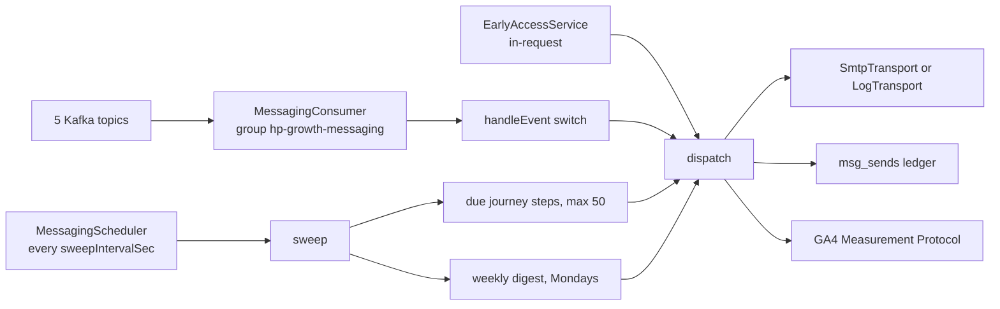
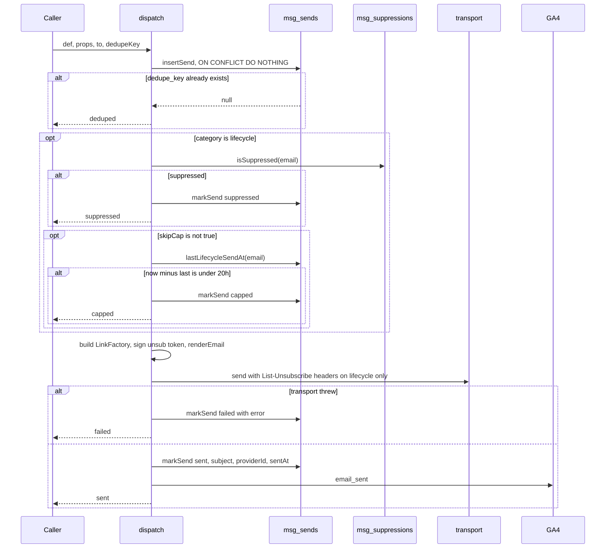
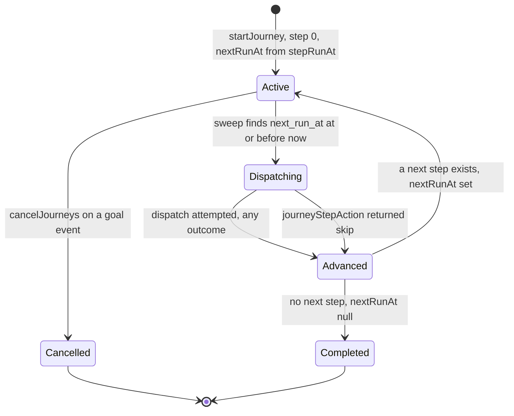

# Growth — Lifecycle Messaging

What this covers: the email engine inside `growth-svc` — the single dispatch
choke point every message passes through, the complete registry of 26 templates,
the three drip journeys plus the weekly digest, the Kafka consumer, the interval
sweeper, and the unsubscribe / open-pixel / click-redirect endpoints. Who it is
for: an engineer adding an email, debugging why one did or did not arrive, or
changing the frequency rules. Table definitions live in
[data model](../02-data-model.md), cross-service sequences in
[flows](../03-flows.md), day-2 procedures in
[operations runbook](../09-operations-runbook.md). The marketing-facing companion
is `docs/Lifecycle-Email-Playbook.md`, which predates the per-level certificate
refactor and is out of date on that one point.

`growth-svc` hosts four bounded contexts in one process and one database. This is
one of them; the others are [early access](./growth-early-access.md),
[referrals](./growth-referrals.md) and [academy](./growth-academy.md).

---

## 1. Responsibility

One engine, two lanes:

| Lane | Who ignores suppression? | Frequency cap? | Unsubscribe link? |
|---|---|---|---|
| `transactional` | yes — always sends | no | **no** — never rendered |
| `lifecycle` | no — suppression list honoured | yes, 20 h | yes, plus RFC 8058 headers |

The lane is a property of the template (`category` on every `TemplateDef`), not
of the call site, so it cannot be forgotten.

Owns: consuming five Kafka topics, projecting a `msg_contacts` table, running
three journeys and a weekly digest, rendering 26 templates to HTML plus a
plain-text alternate, delivering over SMTP, ledgering every attempt, and
reporting to GA4. Does not own: the business events themselves, or the
transactional dispatch its callers make directly — `EarlyAccessService` calls
`dispatch` in-request for the verification code and the operator notice
(`apps/services/growth/src/early-access/early-access.service.ts:128`, `:304`).

---

## 2. Module map

| File | Lines | Role |
|---|---|---|
| `apps/services/growth/src/messaging/messaging.service.ts` | 619 | The orchestrator: event router, 12 handlers, sweeper, `dispatch`, the three public endpoints |
| `apps/services/growth/src/messaging/messaging.repo.ts` | 449 | `MessagingRepo` DI seam (`MESSAGING_REPO`, `:139`) + `DrizzleMessagingRepo` |
| `apps/services/growth/src/messaging/journeys.ts` | 86 | `JOURNEYS`, `SEND_HOUR_UTC`, `stepRunAt`, `isoWeek` |
| `apps/services/growth/src/messaging/consumer.ts` | 110 | kafkajs consumer, group id, 5 topics |
| `apps/services/growth/src/messaging/scheduler.ts` | 49 | `setInterval` driving `sweep()` |
| `apps/services/growth/src/messaging/transport.ts` | 63 | `SmtpTransport` (nodemailer) and `LogTransport` |
| `apps/services/growth/src/messaging/analytics.ts` | 42 | GA4 Measurement Protocol client |
| `apps/services/growth/src/messaging/config.ts` | 48 | `loadMessagingConfig`, 8 env vars |
| `apps/services/growth/src/messaging/messaging.controller.ts` | 35 | `@Controller("v1/messaging")` — unsubscribe, open, click |
| `apps/services/growth/src/messaging/templates/base.ts` | 223 | The bulletproof-HTML renderer and the 11-variant `Block` union |
| `apps/services/growth/src/messaging/templates/library.ts` | 856 | All 26 `TemplateDef` objects |
| `apps/services/growth/src/db/migrate.ts:149-210` | — | DDL for the five `msg_*` tables |

Everything is wired as `useValue` singletons in
`apps/services/growth/src/app.module.ts:44-51`, with `loadMessagingConfig()`
called **once at module load** (`:33`) and shared by the service, scheduler,
consumer and transport. Env changes need a process restart.



---

## 3. The dispatch choke point

**Every** email in the system passes through `MessagingService.dispatch`
(`apps/services/growth/src/messaging/messaging.service.ts:478-555`). There is no
second code path that touches the transport. Signature:

```ts
dispatch<P>(def: TemplateDef<P>, props: P, to: string, dedupeKey: string,
            opts: { skipCap?: boolean } = {}): Promise<DispatchResult>
```

`DispatchResult = "sent" | "deduped" | "suppressed" | "capped" | "failed" | "logged"`
(`:37`). Constants: `LIFECYCLE_MIN_GAP_MS = 20 × 60 × 60 × 1000` (20 hours),
`SWEEP_BATCH = 50`, `DIGEST_PAGE = 200` (`:33-35`). The clock is an injected
`now: () => Date` defaulting to `new Date()` (`:54`); every timestamp, cap
comparison and journey anchor goes through it.



Step by step, with the exact ordering the task-relevant behaviour depends on:

| # | Stage | Lines | Detail |
|---|---|---|---|
| 0 | **claim the dedupe key** | `:486-492` | `insertSend({email: to.toLowerCase(), template, category, dedupeKey})`. A `null` return means the unique index rejected it → return `"deduped"` and do nothing else. **This happens before every other check.** |
| 1 | **suppression** | `:494-498` | Lifecycle only. `isSuppressed(email)` → `markSend(sendId, {status:"suppressed"})`, return. Transactional mail skips this entirely. |
| 2 | **20 h frequency cap** | `:499-505` | Lifecycle only, unless `opts.skipCap === true`. `lastLifecycleSendAt(email)`; if `now - last < LIFECYCLE_MIN_GAP_MS` → `markSend(…, {status:"capped"})`, return. |
| 3 | **render** | `:508-526` | Build the `LinkFactory`, sign an unsubscribe token, call `renderEmail`. Detail below. |
| 4 | **SMTP** | `:528-541` | `transport.send({to, subject, html, text, headers})`. `List-Unsubscribe` and `List-Unsubscribe-Post: List-Unsubscribe=One-Click` are attached **only** for lifecycle; transactional passes `headers: undefined`. |
| 5 | **ledger** | `:542-547` / `:551` | Success → `markSend(sent, subject, providerId, sentAt)`. Throw → `markSend(failed, error)` plus a warn with a masked address. `dispatch` **never throws**. |
| 6 | **GA4** | `:548` | `ga4.track(email, "email_sent", {template, category})` — fire-and-forget, only on success. |

### 3.1 The cap's exact measurement

`lastLifecycleSendAt` (`apps/services/growth/src/messaging/messaging.repo.ts:347-361`):

```sql
SELECT sent_at FROM msg_sends
 WHERE email = $1 AND category = 'lifecycle' AND status = 'sent'
 ORDER BY sent_at DESC LIMIT 1;
```

So the window is measured against the newest **successfully sent** lifecycle row.
`suppressed`, `capped`, `failed` and `queued` rows do not extend it. `skipCap` is
used by exactly one caller: the weekly digest (`:467`).

### 3.2 Link construction — double wrapping

Every CTA URL is wrapped twice.

```ts
// LinkFactory — UTM layer (:509-513)
link(path, content) =>
  `${origin}${path}${path.includes("?") ? "&" : "?"}` +
  `utm_source=email&utm_medium=${def.category}&utm_campaign=${encodeURIComponent(def.key)}` +
  (content ? `&utm_content=${encodeURIComponent(content)}` : "");

// wrapLink — click-redirect layer, applied by the renderer (:525)
wrapLink(url) => `${origin}/api/mail/c/${sendId}?u=${encodeURIComponent(url)}`;
```

`renderEmail` also receives `openPixelUrl = ${origin}/api/mail/o/${sendId}`
(`:524`) and the `unsubscribeUrl` — the latter **only for lifecycle**
(`:523`), which is why transactional mail renders no unsubscribe line
(`apps/services/growth/src/messaging/templates/base.ts:177-179`).

Two unsubscribe URLs are minted from the same token
(`{e: email, a: "unsub"}`, `:514-516`): `${origin}/unsubscribe?token=` for the
human page and `${origin}/api/mail/unsubscribe?token=` for the one-click header.

### 3.3 The renderer

`renderEmail` (`apps/services/growth/src/messaging/templates/base.ts:174-223`)
produces `{subject, html, text}`. Constraints it respects are listed in the file
header (`:1-10`): tables and inline styles only, explicit `bgcolor` attributes,
padding-based buttons, a hidden preheader, and a plain-text alternate built from
the same blocks.

- Palette `INK` is hardcoded because emails cannot use CSS custom properties
  (`:12-25`): bg `#07080C`, card `#0B0D13`, well `#10131B`, line `#171B25`,
  textHi `#F3F5FA`, textMid `#9BA4B8`, textLow `#7A849C`, volt `#C6FF2E`,
  voltSoft `#D3FF57`, onVolt `#0D0F07`.
- 11 block kinds (`:31-42`): `kicker`, `h1`, `p`, `button`, `linkline`, `stats`,
  `code`, `list`, `progress`, `divider`, `note`.
- The hidden preheader is padded with 30 `&nbsp;&zwnj;` pairs so client previews
  do not leak body text (`:194`).
- The footer always carries the template's `reason` line and a fixed risk
  disclaimer, with `Unsubscribe` appended only when `unsubscribeUrl` is present
  (`:203-205`).
- The plain-text alternate is `blocks.map(blockText)` joined with the same reason,
  disclaimer and unsubscribe URL (`:214-220`).
- The 1×1 open pixel is appended after the 600 px table (`:208`).

---

## 4. Template registry — all 26

`TemplateDef<P>` is `{key, category, subject(p), preheader(p), blocks(p, link), reason}`
(`apps/services/growth/src/messaging/templates/library.ts:18-25`). Four shared
footer reasons — `REASON_EA`, `REASON_ORDER`, `REASON_ACCOUNT`, `REASON_ACADEMY`
— are defined at `:27-31`; `weekly_digest`, `ea_verify_code` and
`admin_ea_signup` carry bespoke reason strings (`:752`, `:800`, `:833`).

| # | Template id | Subject | Category | Trigger | Dedupe key |
|---|---|---|---|---|---|
| 1 | `ea_verify_code` (`:792`) | `{code} — your HeroPips verification code` | transactional | **direct** `dispatch()` from `POST /v1/early-access/code` | `tx:ea_code:{email}:{lastSentAt.getTime()}` |
| 2 | `admin_ea_signup` (`:828`) | `Early access #{position} — {email}` | transactional | **direct**, to `ADMIN_NOTIFY_EMAIL` on a new verified signup | `tx:admin_ea_signup:{entry.id}` |
| 3 | `ea_welcome` (`:56`) | `You're #{position} in line for HeroPips` | transactional | `early_access.joined` (`messaging.service.ts:140`) | `tx:ea_welcome:{entry.id}` |
| 4 | `ea_referral_jump` (`:102`) | `You moved up — now #{position} in line`, or `Referral landed — {n} more for a 25-place jump` (`:105-110`) | lifecycle | `early_access.joined` carrying `referrer_entry_id` (`:161`) | `lc:ea_jump:{event_id}` |
| 5 | `order_created` (`:150`) | `Your founding seat is on hold` | transactional | `order.created` (`:178`) | `tx:order_created:{orderId}` |
| 6 | `purchase_confirmed` (`:185`) | `Welcome, Founding Hero — your seat is locked` | transactional | `payment.finished` (`:198`) | `tx:purchase:{orderId}` |
| 7 | `payment_issue` (`:223`) | `Payment problem on your founding order` | transactional | `payment.failed` (`:210`) | `tx:payfail:{orderId}` |
| 8 | `order_expired` (`:242`) | `Your seat hold expired — the seat went back` | transactional | `payment.expired` **or** `order.hold_expired` (`:219`) | `tx:expired:{orderId}` |
| 9 | `refund_confirmed` (`:264`) | `Your refund is on its way` | transactional | `payment.refunded` (`:229`) | `tx:refund:{orderId}` |
| 10 | `platform_welcome` (`:290`) | `{FirstName}, your HeroPips account is live` | transactional | `user.registered` (`:250`) | `tx:welcome:{userId}` |
| 11 | `academy_certificate` (`:331`) | `Your {track} certificate is ready` | transactional | `academy.certificate.issued` (`:302`) | `tx:cert:{userId}:{track}` |
| 12 | `academy_nudge_daily` (`:668`) | `Your {n}-day streak ends at midnight UTC` | lifecycle | `academy.nudge.daily` (`:266`) | `lc:nudge_daily:{userId}:{occurred_at[0..10]}` |
| 13 | `academy_nudge_weekly` (`:699`) | `Next up: {Lesson Title}` | lifecycle | `academy.nudge.weekly` (`:276`) | `lc:nudge_weekly:{userId}:{day}` |
| 14 | `academy_nudge_monthly` (`:718`) | `Your XP is still here. The market moved on.` | lifecycle | `academy.nudge.monthly` (`:288`) | `lc:nudge_monthly:{userId}:{day}` |
| 15 | `ea_d1_story` (`:369`) | `What HeroPips actually does (no magic)` | lifecycle | journey `early_access_nurture` step 0 | `jny:{journeyId}:0` |
| 16 | `ea_d3_academy` (`:398`) | `Don't just stand in line — bank XP while you wait` | lifecycle | step 1 | `jny:{journeyId}:1` |
| 17 | `ea_d5_founding` (`:428`) | `{seatCap} lifetime seats. Then it's subscriptions.` — `seatCap` = `LTD.SEAT_CAP` = 500 | lifecycle | step 2 | `jny:{journeyId}:2` |
| 18 | `ea_d8_referral` (`:459`) | `Cut the line: 3 friends = 25 places` | lifecycle | step 3 | `jny:{journeyId}:3` |
| 19 | `ea_d12_proof` (`:481`) | `What ran inside HeroPips this week` | lifecycle | step 4 — reads `msg_signal_weeks` for last ISO week | `jny:{journeyId}:4` |
| 20 | `ea_d19_lastcall` (`:515`) | `Where you stand, #{position} — and what's left` | lifecycle | step 5 | `jny:{journeyId}:5` |
| 21 | `fo_d1_redeem` (`:543`) | `Your lifetime seat is paid — and still empty` | lifecycle | journey `founding_onboarding` step 0 | `jny:{journeyId}:0` |
| 22 | `fo_d3_redeem2` (`:562`) | `Founders who start in week one keep the edge` | lifecycle | step 1 | `jny:{journeyId}:1` |
| 23 | `ma_d2_academy` (`:594`) | `Your first lesson is 8 minutes. Streaks start at one.` | lifecycle | journey `member_activation` step 0 | `jny:{journeyId}:0` |
| 24 | `ma_d5_paper` (`:612`) | `Your $10,000 paper account is still untouched` | lifecycle | step 1 | `jny:{journeyId}:1` |
| 25 | `ma_d10_broker` (`:637`) | `Put your real rules on real rails` | lifecycle | step 2 | `jny:{journeyId}:2` |
| 26 | `weekly_digest` (`:747`) | `This week on HeroPips: {n} signals ran their course` | lifecycle | scheduler, Monday ≥ 14:00 UTC (`:461`) | `lc:digest:{isoWeek}:{email}` |

Line numbers in the *Template id* column are `library.ts`; those in the *Trigger*
column are `apps/services/growth/src/messaging/messaging.service.ts`.

Naming convention for dedupe keys: `tx:` for transactional, `lc:` for
event-driven lifecycle, `jny:` for journey steps. Every key is unique-indexed by
`msg_sends_dedupe_uq` (`apps/services/growth/src/db/migrate.ts:201`) — this index
is the system's only exactly-once guarantee for email.

Note that `order_expired` is reachable from **two** different envelope types with
the **same** dedupe key, so a `payment.expired` and an `order.hold_expired` for
the same order together produce exactly one email.

Three small helpers shape the copy: `lessonTitle` (`library.ts:33`), `firstName`
(`:38`) and `fmtUsd` (`:43`).

---

## 5. The Kafka consumer and the scheduler

### 5.1 Consumer

`apps/services/growth/src/messaging/consumer.ts`.

| Property | Value | Line |
|---|---|---|
| `clientId` | `hp-growth-messaging` | `:44` |
| **`groupId`** | **`hp-growth-messaging`** | `:13` |
| Brokers | `KAFKA_BROKERS` comma-split and trimmed, default `localhost:9092` | `:45-49` |
| kafkajs retry | `{retries: 1, initialRetryTime: 300}` | `:50` |
| Log level | `logLevel.NOTHING` | `:49` |
| Subscription | `fromBeginning: false` | `:74` |
| Reconnect | `RETRY_CONNECT_MS = 5_000`, unbounded, `unref`'d | `:14`, `:104-106` |
| Master switch | returns immediately when `!cfg.enabled` | `:55` |

Subscribed topics — all five that can carry a messaging trigger
(`consumer.ts:17-23`):

```
hp.growth.events.v1    hp.payment.events.v1    hp.identity.events.v1
hp.signal.events.v1    hp.trade.events.v1
```

Message handling is defensive at three levels (`:78-97`): a missing value is
dropped, non-JSON is dropped silently, an `EventEnvelope.safeParse` failure is
dropped silently, and a handler that throws is logged and swallowed so **one
poison event never stalls the partition**. At-least-once redelivery is fine
because the dedupe keys make each email exactly-once.

`handleEvent` (`messaging.service.ts:79-121`) is a flat switch on
`envelope.type`; unmatched types hit `default: return`.

| Topic | Type | Effect |
|---|---|---|
| `hp.growth.events.v1` | `early_access.joined` | `ea_welcome` + start `early_access_nurture` + `ea_referral_jump` to the referrer |
| | `academy.nudge.daily` / `.weekly` / `.monthly` | the three nudge emails |
| | `academy.certificate.issued` | `academy_certificate` |
| | `academy.lesson.completed` | contact projection only (`lastLessonAt`) — **no email** |
| `hp.payment.events.v1` | `order.created` | `order_created` |
| | `payment.finished` | `purchase_confirmed`, cancel nurture, start `founding_onboarding`, mark contact founding |
| | `payment.failed` | `payment_issue` |
| | `payment.expired`, `order.hold_expired` | `order_expired`, same dedupe key |
| | `payment.refunded` | `refund_confirmed`, cancel `founding_onboarding` |
| `hp.identity.events.v1` | `user.registered` | `platform_welcome`, cancel both pre-signup journeys, start `member_activation` |
| `hp.signal.events.v1` | `signal.generated` | `bumpSignalWeek(isoWeek(occurred_at), "generated")` |
| | `signal.resolved` | bump only when `payload.outcome` is `target_hit` or `stopped` (`:111-117`); anything else, including `expired`, is dropped |
| `hp.trade.events.v1` | `trade.order.filled` | set `firstTradeAt` once, only when the contact exists and it is still null (`:326-332`) — **no email** |

Payload guards keep malformed events harmless: `orderIdEmail` (`:593-598`)
requires a string `order_id` and an `email` containing `@`, `nudgeBase`
(`:600-611`) requires string `user_id` and `email`, and an `early_access.joined`
without `entry_id` is treated as a pre-messaging event shape and dropped
(`:126-127`).

### 5.2 Scheduler and the sweep

`MessagingScheduler` (`apps/services/growth/src/messaging/scheduler.ts:30-43`) is
a `setInterval` at `cfg.sweepIntervalSec × 1000`, `unref`'d, disabled entirely
when `MESSAGING_ENABLED=false` (`:31`), with failures degrading to a warning
throttled to one per 30 s (`WARN_THROTTLE_MS`, `:11`, `:36-39`).

`sweep(now)` (`messaging.service.ts:338-348`) does two things:

1. `dueJourneys(now, SWEEP_BATCH=50)` → run each step inside its own try/catch,
   so one bad step never aborts the pass.
2. `sweepDigest(now)`.

```sql
-- dueJourneys (messaging.repo.ts:261-278) — note: NO row lock
SELECT * FROM msg_journeys
 WHERE status = 'active' AND next_run_at <= $now
 ORDER BY next_run_at ASC
 LIMIT 50;
```

Served by the partial index
`msg_journeys_due_idx (next_run_at) WHERE status = 'active'`
(`apps/services/growth/src/db/migrate.ts:184`), which matches the predicate
exactly.

---

## 6. Journeys

A journey is an ordered list of `(templateKey, delayDays)` steps started by a
trigger event. Every step fires at **`SEND_HOUR_UTC = 14`** on
`startDay + delayDays` (`apps/services/growth/src/messaging/journeys.ts:11`,
`:70-76`):

```ts
stepRunAt(startedAt, delayDays) {
  const d = new Date(startedAt.getTime());
  d.setUTCHours(0, 0, 0, 0);                 // truncate to UTC midnight
  d.setUTCDate(d.getUTCDate() + delayDays);
  d.setUTCHours(SEND_HOUR_UTC, 0, 0, 0);     // 14:00:00.000Z
  return d;
}
```

Delays are **start-day based, not elapsed hours**. A 12:00Z join gets its "D1"
email 26 hours later; a 23:00Z join gets it 15 hours later. Asserted at
`apps/services/growth/test/messaging.spec.ts:100` block.

### 6.1 `early_access_nurture`

Started by `early_access.joined` (`messaging.service.ts:148-153`) with context
`{entry_id, code, position, status_token}`.

| Step | Delay | Template | Runs at |
|---|---|---|---|
| 0 | D+1 | `ea_d1_story` | start-day+1 14:00Z |
| 1 | D+3 | `ea_d3_academy` | start-day+3 14:00Z |
| 2 | D+5 | `ea_d5_founding` | start-day+5 14:00Z |
| 3 | D+8 | `ea_d8_referral` | start-day+8 14:00Z |
| 4 | D+12 | `ea_d12_proof` | start-day+12 14:00Z |
| 5 | D+19 | `ea_d19_lastcall` | start-day+19 14:00Z |

**Exit conditions:**

- Cancelled by `payment.finished` — `cancelJourneys(email, ["early_access_nurture"])`
  (`:197`).
- Cancelled by `user.registered` —
  `cancelJourneys(email, ["early_access_nurture","founding_onboarding"])` (`:249`).
- Per-step safety net: **any** step is skipped when
  `contact.purchasedAt || contact.registeredAt` (`:388`), in case a cancel event
  was missed.
- Completes naturally after step 5.

Step 4 enriches its props with last ISO week's `generated` / `targetHit` counters
from `msg_signal_weeks`, defaulting both to 0 when the row is absent (`:402-408`).

### 6.2 `founding_onboarding`

Started by `payment.finished` (`:204`) with context `{order_id}`.

| Step | Delay | Template |
|---|---|---|
| 0 | D+1 | `fo_d1_redeem` |
| 1 | D+3 | `fo_d3_redeem2` |

**Exit conditions:**

- Cancelled by `payment.refunded` (`:228`) and by `user.registered` (`:249`).
- Per-step safety net: skipped when `contact.registeredAt` is set (`:416`) —
  the seat has been redeemed, so reminders are moot.
- Completes naturally after step 1.

The "access code" shown in these emails is literally the `order_id`
(`library.ts:553`, `:586`).

### 6.3 `member_activation`

Started by `user.registered` (`:254`) with context
`{user_id, display_name, founding}`.

| Step | Delay | Template | Skip condition |
|---|---|---|---|
| 0 | D+2 | `ma_d2_academy` | `repo.anyLessonComplete(user_id)` (`:433`) |
| 1 | D+5 | `ma_d5_paper` | `contact.firstTradeAt` is set (`:436`) |
| 2 | D+10 | `ma_d10_broker` | none |

**Exit conditions:** `cancelOn: []` — this journey is **never** cancelled by any
event. It always runs to completion, skipping individual steps as the user
converts.

### 6.4 Step advancement semantics

`runJourneyStep` (`:350-372`):



- An out-of-range step index short-circuits straight to `completed` (`:352-356`).
- `advanceJourney(id, step+1, nextRunAt|null, active|completed)` runs
  **unconditionally** after the dispatch attempt (`:366-371`). A step is consumed
  whether it sent, was capped, was suppressed, was deduped, or was skipped.
- **Only one step advances per sweep pass**, so a journey that is many days
  overdue catches up one step per interval tick rather than firing everything at
  once (`apps/services/growth/test/messaging.spec.ts:250` block).
- `cancelJourneys` sets `status='cancelled', next_run_at=null` and only matches
  `status='active'` rows (`messaging.repo.ts:245-259`).

### 6.5 The weekly digest

Not a journey row. `sweepDigest` (`:446-472`):

```
if now.getUTCDay() !== 1 || now.getUTCHours() < SEND_HOUR_UTC  -> return   (:447)
week = isoWeek(now - 7 days)                                              (:448)
if lastDigestWeek === week -> return              // per-process memo      (:449)
counters = getSignalWeek(week)
if counters === null || counters.generated === 0 -> memo the week, return (:450-454)
after = null
loop:
    page = listAudience(after, DIGEST_PAGE=200)   // keyset by email ASC
    if page empty -> break
    for contact in page:
        dispatch(weeklyDigest, {...}, contact.email,
                 `lc:digest:${week}:${contact.email}`, { skipCap: true })  (:461-467)
    after = page[last].email
lastDigestWeek = week
```

`listAudience` (`messaging.repo.ts:389-399`) is a keyset page over `msg_contacts`
with a `LEFT JOIN … WHERE msg_suppressions.email IS NULL` anti-join, ordered by
`email ASC`. So the digest **bypasses the 20 h cap but still honours
suppression** — `skipCap` only skips stage 2 of `dispatch`, never stage 1.

`isoWeek` (`journeys.ts:79-86`) uses the ISO-8601 nearest-Thursday rule and
returns a zero-padded `YYYY-Www` label such as `2026-W31`.

`lastDigestWeek` is an in-process memo (`:48`). A restart on a Monday afternoon
re-runs the entire audience scan; the `lc:digest:{week}:{email}` dedupe key is
what actually keeps it silent.

---

## 7. Configuration

`loadMessagingConfig` (`apps/services/growth/src/messaging/config.ts:32-46`).

| Env var | Line | Default | Notes |
|---|---|---|---|
| `PUBLIC_ORIGIN` | `:35` | `http://localhost:3000`, trailing slashes stripped | A wrong value breaks every link, pixel and unsubscribe |
| `SMTP_URL` | `:36` | `null` ⇒ `LogTransport`, nothing is actually sent | Compose points it at Mailpit locally |
| `EMAIL_FROM` | `:37` | `HeroPips <hello@heropips.com>` | |
| `EMAIL_REPLY_TO` | `:38` | `null` — header omitted | |
| `MESSAGING_SWEEP_INTERVAL_SEC` | `:33`, `:39-40` | `60`, floored at `MIN_SWEEP_SEC = 1` | Local overlay sets 15 (`infra/compose/docker-compose.local.yml:51`) |
| `MESSAGING_ENABLED` | `:41` | `true` — **only the literal string `"false"` disables** | Stops consumer and scheduler; HTTP endpoints and direct `dispatch()` stay live |
| `GA4_MEASUREMENT_ID` | `:42` | `null` | Analytics no-op unless **both** GA4 vars are set |
| `GA4_API_SECRET` | `:43` | `null` | idem |
| `STATUS_TOKEN_SECRET` | `:44` | `dev-status-secret-change-me` | **Required in production.** Signs unsubscribe tokens and the billing-compatible status tokens |
| `KAFKA_BROKERS` | `consumer.ts:45` | `localhost:9092` | Read directly from `process.env`, not through the config object |

Compose sets all of these for the growth container at
`infra/compose/docker-compose.yml:152-168`.

### Transport selection

`makeTransport(cfg)` (`apps/services/growth/src/messaging/transport.ts:59-63`)
returns `SmtpTransport` when `cfg.smtpUrl !== null`, else `LogTransport`.
`SmtpTransport` wraps `nodemailer.createTransport(smtpUrl)` and returns
`info.messageId` as `providerId` (`:24-47`). **There is no retry and no backoff**
— one attempt, then the ledger records the failure. Any SMTP endpoint works, so
switching provider is a pure env change.

### GA4

`Ga4Client` (`apps/services/growth/src/messaging/analytics.ts`). The endpoint is
built only when both vars exist (`:16-20`); otherwise `track` returns
immediately. `client_id = sha256(email.toLowerCase()).hex.slice(0,32)` (`:23-25`)
— a raw address never leaves the process. The POST is `void`-ed with a 2 s
`AbortSignal.timeout` and a debug-level catch (`:29-40`), so analytics can never
block or fail a send. `non_personalized_ads: true` is always set.

Four events: `email_sent {template, category}` (`messaging.service.ts:548`),
`email_open {template}` (`:575`), `email_click {template}` (`:585`),
`email_unsubscribe {}` (`:568`).

---

## 8. Public endpoints

`@Controller("v1/messaging")`
(`apps/services/growth/src/messaging/messaging.controller.ts:11`). All three are
fronted by the web BFF at `/api/mail/*`; nothing calls growth directly from a
browser.

| Method | Path | Auth | Success | Errors | Handler |
|---|---|---|---|---|---|
| GET | `/v1/messaging/unsubscribe?token=` | HMAC status token with `a: "unsub"` | `200 {ok:true, email_masked}` | `401 invalid_token` | `messaging.controller.ts:15` → `messaging.service.ts:561` |
| POST | `/v1/messaging/unsubscribe?token=` | same, RFC 8058 one-click | 200 | 401 | `messaging.controller.ts:21` |
| GET | `/v1/messaging/open/:id` | none — the send id is the capability | `200 {ok:true}`, **never throws** | none | `messaging.controller.ts:26` → `:572` |
| GET | `/v1/messaging/click/:id?u=` | none | `200 {to}` | none | `messaging.controller.ts:31` → `:580` |

### Unsubscribe (`:561-570`)

```ts
const payload = verifyStatusToken(token, this.cfg.statusTokenSecret);
const email = payload?.a === "unsub" && typeof payload.e === "string" ? payload.e : null;
if (email === null || email.length === 0) throw apiError(401, "invalid_token", …);
await this.repo.suppress(email, "unsubscribe");
this.ga4.track(email, "email_unsubscribe", {});
return { ok: true, email_masked: maskEmail(email) };
```

Both a valid HMAC **and** the `a === "unsub"` action claim are required, so a
validly-signed early-access status token cannot be replayed as an unsubscribe.
`suppress` is `INSERT … ON CONFLICT DO NOTHING` on `msg_suppressions`
(`messaging.repo.ts:223-228`), so a repeated unsubscribe is a silent no-op.
There is **no resubscribe endpoint** — removal is a manual DELETE.

BFF: `apps/web/app/api/mail/unsubscribe/route.ts` returns the JSON on GET and
swallows every error on POST so a mail provider's one-click never sees a failure.

### Open pixel (`:572-578`)

`recordOpen(sendId, now)` with `.catch(() => null)`, then GA4 if the row came
back with a non-null `openedAt`. Returns `{ok:true}` regardless — a missing or
malformed id is still a 200. The repo uses `COALESCE(opened_at, $now)`
(`messaging.repo.ts:326-333`), so `opened_at` is **first-touch only**.

The BFF (`apps/web/app/api/mail/o/[id]/route.ts`) always serves a 1×1
transparent GIF with `cache-control: no-store`; the growth call is best-effort.

### Click redirect (`:580-588`)

```ts
const fallback = this.cfg.publicOrigin;
const to = url !== undefined && url.startsWith(`${fallback}/`) ? url : fallback;
```

**Open-redirect refused**: `u` is echoed only when it starts with
`publicOrigin + "/"`; anything else collapses to the bare origin (asserted
`apps/services/growth/test/messaging.spec.ts:441` block). `recordClick` sets
`clicked_at` first-touch and **back-fills `opened_at`** in the same statement,
because a click implies an open (`messaging.repo.ts:335-345`).

The BFF (`apps/web/app/api/mail/c/[id]/route.ts`) 302s to the returned `to`, and
on any failure redirects to `NEXT_PUBLIC_SITE_URL` so a mail link never
dead-ends.

---

## 9. Data

Full definitions in [data model](../02-data-model.md).

| Table | Key | Notes |
|---|---|---|
| `msg_contacts` (`apps/services/growth/src/db/schema.ts:150`) | `email` PK, lowercased | Projection only. `source ∈ early_access \| checkout \| purchase \| platform \| academy` |
| `msg_suppressions` (`:168`) | `email` PK | `reason ∈ unsubscribe \| bounce \| complaint \| manual`. Lifecycle only |
| `msg_journeys` (`:175`) | `id` uuid, **`UNIQUE (email, journey)`** | `CHECK status IN ('active','completed','cancelled')` (`apps/services/growth/src/db/migrate.ts:173-183`) |
| `msg_sends` (`:187`) | `id` uuid, **unique index on `dedupe_key`** | `CHECK category IN ('transactional','lifecycle')`, `CHECK status IN ('queued','sent','failed','suppressed','capped')` (`apps/services/growth/src/db/migrate.ts:186-201`) |
| `msg_signal_weeks` (`:204`) | `week` PK, e.g. `2026-W31` | Three counters plus `updated_at` |

Indexes:

| Index | Serves |
|---|---|
| `msg_journeys_due_idx (next_run_at) WHERE status='active'` (`migrate.ts:184`) | `dueJourneys`, exactly |
| `msg_sends_dedupe_uq (dedupe_key)` (`:201`) | the exactly-once guarantee |
| `msg_sends_email_idx (email, created_at DESC)` (`:202`) | ops history queries — note `lastLifecycleSendAt` orders by `sent_at DESC`, so it does **not** use this index |
| `msg_contacts_user_idx (user_id)` (`:165`) | `findContactByUserId` on trade fills |

### The contact merge

`upsertContact` (`messaging.repo.ts:160-196`) is the only writer, and it never
erases a known fact:

| Field group | Rule | Line |
|---|---|---|
| `user_id`, `display_name`, `package_sku`, `early_access_entry_id` | `COALESCE(excluded.x, existing.x)` — new value wins when non-null | `:182-186` |
| `founding` | `excluded.founding OR existing.founding` — sticky true | `:184` |
| `registered_at`, `purchased_at`, `first_trade_at` | `COALESCE(existing.x, excluded.x)` — **existing wins**, first-touch | `:187-189` |
| `last_lesson_at` | `COALESCE(excluded.x, existing.x)` — latest wins | `:190` |

### Transaction boundaries

**There are no explicit transactions anywhere in messaging.** Every repo call is
its own autocommit statement. `dispatch` is deliberately a non-atomic three-step
sequence — the ledger row is claimed *before* the SMTP attempt, so a crash
mid-send leaves a `queued` row that permanently holds the dedupe key. That is the
intended trade: a duplicate send is worse than a missed one.

---

## 10. Testing

`apps/services/growth/test/messaging.spec.ts` — 469 lines, 9 describe blocks, an
injected clock and a `FakeTransport` with a `failNext` flag. `CFG` has
`smtpUrl: null` and no GA4 keys.
`apps/services/growth/test/messaging-mem-repo.ts` (271 lines) mirrors the Drizzle
semantics precisely: the COALESCE merge including `founding` OR-ing and
existing-wins milestones, `(email, journey)` uniqueness, `dedupe_key` uniqueness,
first-touch open/click, the `lastLifecycleSendAt` filter, and the suppression
anti-join in `listAudience`.

| Describe | Line | Covers |
|---|---|---|
| early access joined | `:100` | welcome subject; transactional mail has **no** unsubscribe link and `headers === undefined`; HTML contains `/api/mail/c/`, `utm_campaign=ea_welcome` and `/api/mail/o/`; text alternate over 100 chars; `source === "early_access"`; journey active with `nextRunAt === 2026-07-02T14:00:00.000Z`; redelivery sends nothing more; referrer path 3 verified referrals → 1 jump → position 75 |
| purchase lifecycle | `:153` | `payment.finished` receipt containing the order id and `$499`, cancels nurture, starts onboarding, marks contact founding; the four order events collapse to the expected set |
| user registered | `:214` | welcome, cancels both pre-signup journeys, starts `member_activation` |
| journey sweep | `:250` | due steps run in order and respect the 20 h cap; a capped step still advances |
| unsubscribe | `:315` | suppresses lifecycle but never transactional; a signed token without `a:"unsub"` is rejected |
| academy triggers | `:345` | nudges render streak and lesson context and dedupe per user per day |
| weekly digest | `:403` | last week's counters to the non-suppressed audience, once |
| dispatch pipeline | `:441` | transport failure marks the ledger row `failed` without throwing; open-redirect refused |

**Not tested:** `loadMessagingConfig`, `MessagingConsumer`, `MessagingScheduler`,
`SmtpTransport`, `Ga4Client`, `renderEmail`'s output structure beyond substring
assertions, and `DrizzleMessagingRepo`'s SQL.

---

## 11. Hazards and gaps

### 11.1 Live bug: every certificate email says "Hero Trader"

`onCertificateIssued` (`apps/services/growth/src/messaging/messaging.service.ts:301`):

```ts
const trackName = track === "foundations" ? "Foundations" : "Hero Trader";
```

`"foundations"` was removed by the per-level certificate refactor — the bootstrap
DDL deletes those rows (`apps/services/growth/src/db/migrate.ts:136`) and
constrains `track` to `level-0` … `level-9` and `hero-trader`
(`:138-139`). Every real track therefore falls into the `else` arm, so a
`level-2` certificate produces the subject **"Your Hero Trader certificate is
ready"** and a body claiming the Hero Trader track.

It is invisible to the suite because
`apps/services/growth/test/messaging.spec.ts:345` block still fires a
`"foundations"` event, exercising only the dead branch. The fix is a
track → display-name map fed from `ACADEMY_LEVELS`
(`packages/contracts/src/index.ts:691-702`); the 11 valid tracks are enumerated
in [growth-academy](./growth-academy.md#45-certificates-11-tracks).

### 11.2 Dead metadata: `JourneyDef.cancelOn`

`cancelOn` is declared (`apps/services/growth/src/messaging/journeys.ts:30`) and
populated on all three journeys (`:38`, `:51`, `:60`) — and **never read**. Grep
over `apps/services/growth/src`, `apps/services/growth/test` and `apps/web`
returns only the declaration and the three populations; there is no consumer.

Cancellation is hardcoded in the handlers instead:

| Handler | Cancels | Line |
|---|---|---|
| `onPaymentFinished` | `["early_access_nurture"]` | `messaging.service.ts:197` |
| `onRefunded` | `["founding_onboarding"]` | `:228` |
| `onUserRegistered` | `["early_access_nurture","founding_onboarding"]` | `:249` |

Adding an entry to `cancelOn` changes nothing. You must edit the handler. The two
lists happen to agree today, which is exactly what makes this dangerous: the
declarative version looks authoritative and is not.

### 11.3 Everything else

1. **A suppressed, capped, deduped or failed send permanently burns its dedupe
   key.** `insertSend` runs at `:486`, before the suppression check at `:495` and
   the cap check at `:500`, so the ledger row exists regardless of outcome. Once a
   contact unsubscribes and later resubscribes, any email whose dedupe key already
   exists returns `"deduped"` and silently never sends again. The same applies to
   the cap: a capped journey step is **not** retried later, because the journey
   has already advanced past it.
2. **`msg_journeys UNIQUE (email, journey)` means a journey runs once per address,
   ever.** `startJourney` returns `false` on conflict and the service ignores the
   result (`:66-72`). A cancelled `member_activation` — or a user who re-registers
   with the same address — can never re-enter that journey.
3. **`dueJourneys` takes no row lock**: no `FOR UPDATE`, no `SKIP LOCKED`
   (`messaging.repo.ts:261-278`), and `advanceJourney` is an unconditional UPDATE.
   Two growth replicas will both pick up the same rows. Only the `dedupe_key`
   unique index prevents duplicate emails, and `advanceJourney` is last-write-wins.
   Running more than one growth replica is safe for email but doubles the wasted
   work.
4. **`LogTransport` marks sends as `"sent"`.** Without `SMTP_URL` the transport
   logs `[email:not-sent] …`, returns `providerId: null`, and `dispatch` still
   writes `status: "sent"` (`:542-547`). The ledger cannot distinguish "handed to
   SMTP" from "never left the process" except by `provider_id IS NULL`. The
   `DispatchResult` union declares a `"logged"` variant (`:37`) that is **never
   returned**.
5. **No SMTP retry.** One attempt, then the row is `failed` forever. The
   documented recovery is deleting the row to free the dedupe key — see
   [operations runbook](../09-operations-runbook.md).
6. **Journey step delays are start-day based, not elapsed hours** (§6), and only
   one step advances per sweep, so a backlogged journey drips one email per
   sweep interval rather than catching up at once.
7. **The digest's `lastDigestWeek` memo is per process.** A restart on a Monday
   afternoon re-runs the whole audience scan, relying entirely on dedupe keys to
   stay silent — and that scan is unbounded in total size, only paged.
8. **No unsubscribe expiry.** The token is a plain HMAC with no `exp` claim
   (`apps/services/growth/src/common/token.ts:18-37`), so an old email's
   unsubscribe link works forever. The only revocation lever is rotating
   `STATUS_TOKEN_SECRET`, which also invalidates every pending early-access
   verification hash — see [security](../06-security.md).
9. **`MESSAGING_ENABLED=false` is a partial switch.** It stops the consumer
   (`consumer.ts:55`) and the scheduler (`scheduler.ts:31`) but leaves the HTTP
   endpoints and direct `dispatch()` fully live, so early-access verification
   codes still send.
10. **Config is read once at module load** (`app.module.ts:33`). Changing any
    messaging env var requires a process restart.
11. **`msg_suppressions` has no expiry and no resubscribe path.** Removal is a
    manual DELETE.
12. **`bumpSignalWeek` buckets by `envelope.occurred_at`, not receipt time**
    (`:110`, `:114`). A late-delivered signal event correctly lands in its own
    ISO week — but if it arrives after that week's Monday digest has run, the
    digest has already reported a lower number and the dedupe key prevents a
    correction.
