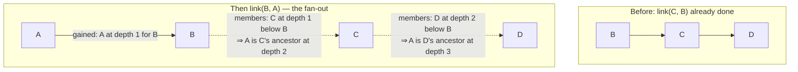

# Growth — Referrals (the MLM closure tree)

What this covers: the multi-level referral programme in `growth-svc` — the
closure-table data structure and the exact algorithm that maintains it, the
payout configuration and its cross-field validation, idempotent commission
accrual, and refund reversal. Also documented here, because it has no better
home: the affiliate-application intake endpoint. Who it is for: an engineer
wiring commissions into billing, or debugging a tree that looks wrong.
Table definitions live in [data model](../02-data-model.md), the HTTP contract in
[api reference](../05-api-reference.md), the auth posture in
[security](../06-security.md).

`growth-svc` hosts four bounded contexts in one process and one database. This is
one of them; the others are [early access](./growth-early-access.md),
[academy](./growth-academy.md) and [messaging](./growth-messaging.md).

---

## 0. Read this first: there are TWO referral systems and they are NOT connected

This is the single most common misreading of the codebase. Two mechanisms both
called "referrals" live in the same service and the same database, and **no line
of code joins them.**

| | Waitlist referral | MLM closure tree |
|---|---|---|
| **Documented in** | [growth-early-access](./growth-early-access.md) | this file |
| **Storage** | `waitlist_entries.referred_by` (`db/schema.ts:26`) | `referral_edges` / `referral_ancestors` / `referral_commissions` (`db/schema.ts:75-104`) |
| **Identifier type** | `uuid` — a `waitlist_entries.id` | `text` — an identity-service user id |
| **Depth** | one level. There is no grandparent | up to 10 levels |
| **Pays** | queue positions: `max(1, base - floor(referrals/3) × 25)` | money: `floor(total_usd_minor × rate_bps / 10000)` |
| **Created by** | `POST /v1/early-access/verify` with a `ref` code (`early-access.service.ts:238-245`) | `POST /v1/referrals/link` (`referrals.controller.ts:19-27`) |
| **Code format** | 8 chars, `ABCDEFGHJKLMNPQRSTUVWXYZ23456789` (`common/codes.ts:4-5`) | none — the API takes raw user ids |
| **Wired to anything today?** | yes — the whole public signup flow | **no. Zero callers.** |

A third, unrelated code also exists: `academy_progress.referral_code`, a
lowercase 8-char Crockford base32 string that awards 250 XP to both sides
(`academy/xp.ts:60-65`). See [growth-academy](./growth-academy.md#43-referrals-inside-the-academy).
That makes **three** independent referral notions in one database. When someone
says "the referral code", ask which one.

Verified by grep over `apps/services/*/src`, `apps/web/app`, `apps/web/lib`,
`packages`, `infra` and `scripts`: **nothing calls `/v1/referrals/*`.** The only
hits are the controller itself and a doc comment in
`common/config.ts:8`. Billing never calls `attribute` on `payment.finished`, so
in the running system today no commission is ever accrued. The tree is complete,
tested and dormant.

---

## 1. Responsibility

Owns the ancestor closure of a referral tree keyed by identity user ids, the
per-tenant payout ladder, idempotent commission accrual for a paid order, and
refund clawback. Does not own: who the users are (identity-svc), what an order is
(billing-svc), or paying anybody — `referral_commissions` is a ledger, not a
disbursement system. There is no payout job anywhere in the repository.

---

## 2. Module map

| File | Lines | Role |
|---|---|---|
| `apps/services/growth/src/referrals/referrals.controller.ts` | 69 | `@Controller("v1/referrals")`; 5 routes, only `PATCH config` is authenticated |
| `apps/services/growth/src/referrals/referrals.service.ts` | 174 | `link`, `getConfig`, `patchConfig`, `attribute`, `reverse`; `RATE_SUM_CAP_BPS` at `:16` |
| `apps/services/growth/src/referrals/referrals.repo.ts` | 204 | `ReferralRepo` DI seam (`REFERRAL_REPO`, `:68`) + `DrizzleReferralRepo`; all SQL |
| `apps/services/growth/src/db/migrate.ts:61-98` | — | DDL: config seed, both closure tables, commissions with its UNIQUE |
| `apps/services/growth/src/affiliates/affiliates.service.ts` | 31 | Affiliate application intake (see §8) |
| `apps/services/growth/src/affiliates/affiliates.controller.ts` | 22 | `@Controller("v1/affiliates")`, `POST apply → 202` |

Constants (`packages/contracts/src/index.ts:302-310`):

```ts
export const REFERRAL = {
  MAX_LEVELS: 10,                                    // hard structural cap
  DEFAULT_LEVELS: 5,                                 // payout levels active by default
  DEFAULT_LEVEL_RATES_BPS: [2000, 1000, 500, 300, 200],  // 20 / 10 / 5 / 3 / 2 %
};
```

**`MAX_LEVELS` and `DEFAULT_LEVELS` are not the same knob and never interchange.**

| | `REFERRAL.MAX_LEVELS = 10` | `config.max_levels` (default `DEFAULT_LEVELS = 5`) |
|---|---|---|
| Nature | compile-time constant | mutable DB row, `referral_program_config` |
| Used by | `link` — how deep the closure is materialised (`referrals.service.ts:45,56`) | `attribute` — how deep payouts reach (`:118`) |
| Enforced by | `CHECK (depth BETWEEN 1 AND 10)` (`db/migrate.ts:80`); zod `.max(REFERRAL.MAX_LEVELS)` on every level field | service cross-field validation in `patchConfig` |
| Changing it | requires code + a schema CHECK change + a tree rebuild | an admin `PATCH`; the tree is untouched |

The closure is **always** built to depth 10 regardless of the payout config
(comment `referrals.service.ts:26-31`). That is what lets an admin raise
`max_levels` from 5 to 8 later and immediately pay three more levels with no
backfill. Lowering it narrows payouts while leaving every ancestor row in place
(test `test/referrals.service.spec.ts:317`).

---

## 3. The closure table

Two tables. `referral_edges` is the *shape* — one row per child, holding its
direct parent. `referral_ancestors` is the *transitive closure* — one row per
(descendant, ancestor) pair with the distance between them. Reads never walk the
tree; every query is a single indexed lookup against the closure.

```
referral_edges     (child_id PK, parent_id)          -- one referrer per user, forever
referral_ancestors (descendant_id, ancestor_id) PK, depth 1..10
```

`referral_edges.child_id` being the primary key is what structurally enforces
"one referrer, forever" — no service check can be forgotten (`db/migrate.ts:70`).
`CHECK (child_id <> parent_id)` blocks self-parenting at the storage layer too
(`:73`).

### 3.1 `link(childId, parentId)` — the algorithm

`apps/services/growth/src/referrals/referrals.service.ts:32-66`.

```
if childId === parentId            -> 422 validation_failed          (:33-35)
tx {
  if hasEdge(childId)              -> 409 referral_conflict          (:37-39)
  if isAncestor(childId, parentId) -> 409 referral_cycle             (:41-43)   <-- cycle guard

  parentAncestors = ancestorsOf(parentId, REFERRAL.MAX_LEVELS)                  (:45)
  gained  = [{parentId, depth: 1}]
          ++ parentAncestors.map(a => ({a.ancestorId, a.depth + 1}))            (:46-49)
  members = [{childId, depth: 0}] ++ descendantsOf(childId)                     (:50)

  rows = { (m.descendantId, g.ancestorId, m.depth + g.depth)
         | m ∈ members, g ∈ gained, m.depth + g.depth <= REFERRAL.MAX_LEVELS }  (:52-60)

  insertEdge(childId, parentId)                                                 (:62)
  insertAncestors(rows)                                                         (:63)
}
```

The **cross product** `members × gained` is the whole trick, and it is why link
order between generations does not matter:



`members` starts with the child itself at depth 0, so the child gets every
`gained` ancestor at exactly the gained depth; every existing descendant of the
child gets the same ancestors shifted down by its own depth. Linking `C→B` before
`B→A` still gives C the ancestor A at depth 2
(test `test/referrals.service.spec.ts:147`).

Rows past depth 10 are dropped in the filter, never inserted. A 12-node chain
materialises depths 1..10 only and the 11th generation up is never recorded
(test `:158`).

### 3.2 The cycle guard

```ts
if (await ops.isAncestor(childId, parentId)) throw apiError(409, "referral_cycle", …);
```

The repo signature is `isAncestor(ancestorId, descendantId)`
(`referrals.repo.ts:125`), and the call site passes `(childId, parentId)`
(`referrals.service.ts:41`). Read it as the question it actually asks: *"is the
child already an ancestor of the prospective parent?"* If yes, attaching the
child below that parent closes a loop. This is correct and easy to "fix" into a
bug — leave the argument order alone.

Note it only needs one lookup, not a walk, because the closure already contains
every transitive relationship. The `hasEdge` check runs first, so the common
rejection (user already has a referrer) never pays for the closure query.

### 3.3 The SQL, verbatim

Drizzle expressions from `apps/services/growth/src/referrals/referrals.repo.ts`,
rendered as the SQL they emit:

```sql
-- hasEdge (:117-124)
SELECT child_id FROM referral_edges WHERE child_id = $1 LIMIT 1;

-- isAncestor(ancestorId, descendantId) (:125-137)
SELECT depth FROM referral_ancestors
 WHERE descendant_id = $descendantId AND ancestor_id = $ancestorId
 LIMIT 1;

-- ancestorsOf(descendantId, maxDepth) (:138-148)
SELECT ancestor_id, depth FROM referral_ancestors
 WHERE descendant_id = $1 AND depth <= $2
 ORDER BY depth ASC;

-- descendantsOf(ancestorId) (:149-153)   -- NOTE: no depth bound
SELECT descendant_id, depth FROM referral_ancestors WHERE ancestor_id = $1;

-- insertEdge (:154-156)
INSERT INTO referral_edges (child_id, parent_id) VALUES ($1, $2);

-- insertAncestors (:157-165)   -- skipped entirely when rows is empty (:158)
INSERT INTO referral_ancestors (descendant_id, ancestor_id, depth)
VALUES …
ON CONFLICT (descendant_id, ancestor_id) DO NOTHING;

-- insertCommission (:166-179)
INSERT INTO referral_commissions (order_id, beneficiary_id, level, rate_bps, amount_usd_minor)
VALUES ($1, $2, $3, $4, $5)
ON CONFLICT (order_id, beneficiary_id, level) DO NOTHING
RETURNING id;                       -- rows.length > 0 == "actually inserted"

-- reverseCommissions (:180-192)
UPDATE referral_commissions SET status = 'reversed'
 WHERE order_id = $1 AND status = 'accrued'
RETURNING id;                       -- rows.length == reversed count
```

Index support: `referral_ancestors_desc_depth_idx (descendant_id, depth)` serves
`ancestorsOf`; `referral_ancestors_ancestor_idx (ancestor_id)` serves
`descendantsOf` (`db/migrate.ts:83-84`).

`ON CONFLICT (descendant_id, ancestor_id) DO NOTHING` means a re-link that would
re-derive an existing pair is a silent no-op rather than a constraint error. It
also means **the closure never updates a `depth`** — the first depth recorded for
a pair wins. Given the one-parent-forever edge constraint, a pair's depth can
never legitimately change, so this is safe.

---

## 4. Commission attribution

`apps/services/growth/src/referrals/referrals.service.ts:111-156`.

```
tx {
  cfg       = getConfig()                            // per-tenant row       (:117)
  ancestors = ancestorsOf(buyerId, cfg.maxLevels)    // depth ASC            (:118)
  entries   = []
  for ancestor in ancestors:
      rateBps = cfg.levelRatesBps[ancestor.depth - 1]                        (:122)
      if rateBps === undefined || rateBps <= 0: continue                     (:123)
      amountUsdMinor = Math.floor(totalUsdMinor * rateBps / 10_000)          (:124)
      if amountUsdMinor <= 0: continue                                       (:125)
      inserted = insertCommission({orderId, ancestor.ancestorId, depth, rateBps, amount})  (:127-133)
      if inserted: insertOutbox(referral.commission.accrued)                 (:134-145)
      entries.push({beneficiary_id, level, rate_bps, amount_usd_minor})      (:146-151)
  return {order_id, total_usd_minor, entries}                                (:154)
}
```

The formula:

$$\text{amount}_{\text{usd minor}} = \left\lfloor \frac{\text{total}_{\text{usd minor}} \times \text{rate}_{\text{bps}}}{10000} \right\rfloor$$

Amounts are integer **USD minor units** (cents) throughout; there is no floating
point in the ledger. Floor rounding always favours the house.

Worked example on the founding-hero order — a flat $499, i.e. 49 900 minor
(`LTD.PRICE_USD_DEFAULT`, `packages/contracts/src/index.ts:292`; there is **no
seat-price ladder** anywhere in the codebase) with the default ladder and six
ancestors present:

| level | rate_bps | `floor(49900 × bps / 10000)` | share |
|---|---|---|---|
| 1 | 2000 | 9 980 | 20 % |
| 2 | 1000 | 4 990 | 10 % |
| 3 | 500 | 2 495 | 5 % |
| 4 | 300 | 1 497 | 3 % |
| 5 | 200 | 998 | 2 % |
| 6 | — | not paid: `levelRatesBps[5]` is `undefined` | — |
| **total** | **4000** | **19 960** | **40 %** |

Asserted exactly at `test/referrals.service.spec.ts:193`. The only "ladder" in
the system is this rate array plus billing's `PAYMENT_STATUS_RANK` — see
[billing](./billing.md).

Skip semantics:

- **Missing level** — `levelRatesBps[depth-1]` is `undefined` when the tree is
  deeper than the config. No row, no event (test `:224`).
- **Zero rate** — an explicit `0` in the array is skipped the same way.
- **Zero amount** — on a 40-minor order, L4 at 300 bps yields `floor(1.2) = 1`
  and pays, while L5 at 200 bps yields `floor(0.8) = 0` and is skipped (test `:234`).
- **Unreferred buyer** — `ancestorsOf` returns nothing, `entries` is `[]` (test `:245`).

### 4.1 Idempotency

`UNIQUE (order_id, beneficiary_id, level)` (`db/migrate.ts:95`) is *the*
attribution idempotency key. Combined with `ON CONFLICT DO NOTHING RETURNING id`,
a re-call inserts nothing and — because the event is emitted only inside
`if (inserted)` (`:134`) — emits nothing either. The HTTP response is
byte-identical (test `:212`). This makes `attribute` safe to retry from a Kafka
consumer or a manual replay.

The choice of key means one beneficiary can hold at most one commission per level
per order, which is exactly right: a user appears at exactly one depth in any
buyer's ancestor set.

### 4.2 Reversal

`reverse(orderId)` (`:159-172`) flips every `accrued` row for the order to
`reversed` and emits **one** `referral.commission.reversed` event carrying the
count, only when the count is greater than zero. Because the UPDATE filters
`status = 'accrued'`, a second call matches nothing, returns `{ok:true, reversed:0}`
and emits nothing (test `:343`). Rows are never deleted — the ledger keeps the
reversal history.

There is no re-accrual path. A reversed order that later settles again would
insert nothing (the UNIQUE still holds) and stay reversed.

---

## 5. Payout configuration

Single row per tenant, `TENANT_ID = "heropips"` (`referrals.repo.ts:74`), seeded
by `INSERT … ON CONFLICT DO NOTHING` at boot (`db/migrate.ts:67`).

`GET /v1/referrals/config` is unauthenticated and returns
`{max_levels, level_rates_bps}` (`referrals.service.ts:68-71`).

`PATCH /v1/referrals/config` (`:73-104`) validates in three layers:

| Layer | Rule | Where |
|---|---|---|
| Admin gate | `ADMIN_TOKEN` unset ⇒ `503 admin_disabled`; header mismatch ⇒ `401 unauthorized` | `:77-82` |
| zod, per field | `max_levels` int 1..10; each rate int 0..10000; array length 1..10 | `packages/contracts/src/index.ts:318-343` |
| Service, cross-field | length **must equal** `max_levels`; sum **must be ≤ `RATE_SUM_CAP_BPS`** | `:88-99` |

The cross-field rules run against the *merged* config, not the patch:
`maxLevels = patch.max_levels ?? current.maxLevels`,
`rates = patch.level_rates_bps ?? current.levelRatesBps` (`:85-86`). Patching only
`max_levels` therefore fails unless the stored array already has the new length —
that is intentional, it prevents a half-applied config.

```ts
const RATE_SUM_CAP_BPS = 5000;   // referrals.service.ts:16
// "Business cap: rates may never sum past 50% of an order (zod only caps at 100%)."
const sum = rates.reduce((a, b) => a + b, 0);
if (sum > RATE_SUM_CAP_BPS) throw apiError(422, "validation_failed",
  `level_rates_bps sum ${sum} exceeds the ${RATE_SUM_CAP_BPS} bps (50%) cap.`);   // :92-99
```

The error message includes the offending sum. `[3000,1500,400,200,100]` sums to
5200 and is rejected (test `:280`); the default ladder sums to 4000 and passes.
A valid 10-level config of `10 × 500 bps` sums to exactly 5000, is accepted, and
drives ten payouts of 2495 on a 49 900 order (test `:299`).

**Two different caps exist.** The service rejects above 5000 bps; the contract's
`ReferralConfigRes` refine only rejects above 10000 bps
(`packages/contracts/src/index.ts:333-336`), with a comment saying so. A legacy
row between 5000 and 10000 still serialises fine on `GET` and is only unwritable,
not unreadable.

---

## 6. Data

Full definitions in [data model](../02-data-model.md).

| Table | Key | Constraint that matters |
|---|---|---|
| `referral_program_config` | `tenant_id` PK | `CHECK (max_levels BETWEEN 1 AND 10)`; default `'{2000,1000,500,300,200}'`; seed row (`db/migrate.ts:61-67`) |
| `referral_edges` | `child_id` PK | structurally one referrer forever; `CHECK (child_id <> parent_id)`; index on `parent_id` (`:69-75`) |
| `referral_ancestors` | `(descendant_id, ancestor_id)` PK | the `ON CONFLICT` target; `CHECK (depth BETWEEN 1 AND 10)`; two indexes (`:77-84`) |
| `referral_commissions` | `id` uuid | **`UNIQUE (order_id, beneficiary_id, level)`** (`:95`); `CHECK (status IN ('accrued','reversed'))` (`:93`); indexes on `order_id` and `beneficiary_id` (`:97-98`) |
| `affiliate_applications` | `id` uuid | no unique constraint — duplicate applications are allowed by design (`:40-50`) |

### Transaction boundaries

`link`, `patchConfig`, `attribute` and `reverse` each run in one `db.transaction`
with **no advisory lock and no `SELECT … FOR UPDATE`**
(`referrals.repo.ts:99-199`). Concurrency safety comes entirely from constraints:

| Race | Prevented by |
|---|---|
| Two `link` calls for the same child | `referral_edges` PK (the loser gets a PK violation → 500, not a 409) |
| Two `link` calls deriving the same closure pair | `referral_ancestors` PK + `ON CONFLICT DO NOTHING` |
| Two `attribute` calls for the same order | `referral_commissions` UNIQUE + `ON CONFLICT DO NOTHING RETURNING id` |
| Two `patchConfig` calls | last writer wins, silently |

Contrast [early access](./growth-early-access.md#33-join-position-assignment-under-a-global-lock),
which does take a global advisory lock because its invariant (gapless
`base_position`) cannot be expressed as a constraint.

### Invariants

1. One referrer per child, forever.
2. Every `referral_ancestors.depth` ∈ [1, 10].
3. A `(descendant, ancestor)` pair's depth is written once and never updated.
4. At most one commission row per `(order_id, beneficiary_id, level)`.
5. `status` transitions only `accrued → reversed`, one-way.

---

## 7. Events

All on `hp.growth.events.v1`, all written to `outbox` inside the producing
transaction and relayed by `OutboxRelay` (at-least-once).

| `type` | Payload | Emitted when |
|---|---|---|
| `referral.commission.accrued` (`packages/contracts/src/index.ts:314`) | `{order_id, beneficiary_id, level, rate_bps, amount_usd_minor}` | one per **actually inserted** row (`referrals.service.ts:137-144`) |
| `referral.commission.reversed` (`:315`) | `{order_id, reversed: n}` | once per reversal batch with `n > 0` (`referrals.service.ts:165-168`) |
| `affiliate.applied` — **bare string literal, not a contract constant** | `{email_masked, channel, audience_size, geo}` | every affiliate application (`affiliates.service.ts:22-27`) |

**No consumer exists for any of them.** `MessagingService.handleEvent`'s switch
does not match these types and falls through to `default: return`
(`messaging.service.ts:118-119`).

---

## 8. Affiliate application intake

A separate, much smaller module that happens to be partner-shaped, documented
here rather than left orphaned.

`POST /v1/affiliates/apply` → `202 {ok:true}`
(`affiliates.controller.ts:11-20`), body
`{name 2-80, email, channel 2-200, audience_size ∈ {"<1k","1k-10k","10k-50k","50k-250k","250k+"}, geo 2-80, note? ≤1000}`
(`packages/contracts/src/index.ts:155-162`). Called by the BFF at
`apps/web/app/api/affiliates/route.ts:16`.

`AffiliatesService.apply` (`affiliates.service.ts:10-30`) opens `db.transaction`
on the module-level Drizzle singleton and writes the application row plus an
outbox row in the same transaction. Only the masked email, channel, audience size
and geo go on the bus (`:22-27`); `name` and `note` stay in the database.

It is the only module in the service **without a repo DI seam** — it imports `db`
directly (`:4`), which is why it has no unit test and cannot get one without a
refactor.

---

## 9. Testing

`test/referrals.service.spec.ts`, 355 lines, no database. `MemReferralRepo`
(`:16-105`) reproduces the pg `ON CONFLICT` semantics in memory.

| Block | Line | Asserts |
|---|---|---|
| closure build | `:133` | depth ladder for A←B←C←D (`:134`); subtree propagation when the parent link comes second (`:147`); a 12-node chain capped at 10 with the 11th ancestor never materialised and every stored depth in [1,10] (`:158`) |
| link guards | `:173` | self-referral 422 (`:174`); duplicate edge 409 `referral_conflict` (`:179`); cycle 409 `referral_cycle` (`:185`) |
| attribution | `:192` | the exact five-row 49 900-minor ladder plus five accrual events (`:193`); byte-identical replay with no extra rows or events (`:212`); missing upper levels skipped (`:224`); zero-amount L5 skipped at 40 minor (`:234`); unreferred buyer accrues nothing (`:245`) |
| config | `:254` | seeded defaults (`:255`); 503 when `ADMIN_TOKEN` is null and 401 on mismatch (`:263`); zod bounds (`:272`); the 5000 bps sum cap (`:280`); length-vs-`max_levels` mismatch in both directions (`:289`); a 10 × 500 bps config driving ten payouts (`:299`); lowering `max_levels` to 2 narrows payout while the tree keeps all five ancestors (`:317`) |
| reverse | — | only the target order flips and exactly one event fires (`:331`); a repeat reverse returns 0 with no event (`:343`) |

**Not covered:** `DrizzleReferralRepo`'s SQL (the in-memory double is the only
thing exercised), concurrent `link` behaviour, and `AffiliatesService` entirely.

---

## 10. Hazards and gaps

1. **The MLM API is live but unwired.** No caller anywhere. If you enable it,
   `attribute` must be invoked from billing's `payment.finished` path and
   `reverse` from its refund path, and both must be idempotent at the caller
   too — they already are at the service.
2. **Only `PATCH /v1/referrals/config` is authenticated.** `link`, `attribute`
   and `reverse` mutate money-bearing state with **no credential at all**
   (`referrals.controller.ts:19,46,60`). The base compose topology publishes no
   service port, and only the local overlay maps `4001:4001` to the host
   (`infra/compose/docker-compose.local.yml:45`), so network isolation is the
   entire control. This is the single largest security gap in the service — see
   [security](../06-security.md).
3. **`attribute`'s response is not the ledger.** `entries` is pushed for every
   eligible ancestor regardless of whether a row was inserted (`:146-151`), and
   amounts are recomputed from the *current* config. After a `patchConfig`, a
   replay returns numbers that no persisted row contains.
4. **`descendantsOf` has no depth bound** (`referrals.repo.ts:149-153`). Linking
   a node that already has a large subtree materialises
   `|subtree| × |gained|` rows in a single INSERT, unbounded. A 10 000-node
   subtree under a 10-deep parent is 100 000 rows in one statement, inside one
   transaction, with no lock timeout.
5. **A concurrent duplicate `link` surfaces as a 500, not a 409.** The
   `hasEdge` check is not serialised against the `referral_edges` PK, so the
   loser of a race gets an unhandled constraint violation mapped to
   `{error_code:"internal"}` by `ApiExceptionFilter` (`common/errors.ts:49-54`).
6. **`getConfig` throws a plain `Error` if the seed row is missing**
   (`referrals.repo.ts:114`, and `getConfigOn` at `:82-94`), producing a 500 with
   the message "referral_program_config seed row missing — run migrations".
   Boot-time `migrate()` normally makes this unreachable.
7. **Two sum caps disagree** — 5000 bps in the service, 10000 bps in the contract
   (§5). Any external consumer validating with `ReferralConfigRes` will accept
   configs the service would reject.
8. **No payout mechanism exists.** `referral_commissions` accrues and reverses;
   nothing ever marks a commission paid. There is no `paid` status in the CHECK
   constraint (`db/migrate.ts:93`), so adding payouts is a schema change.
9. **`affiliate.applied` is an untyped string literal** (`affiliates.service.ts:22`)
   while every other event uses a contract constant. A typo would be silent.
10. **`AffiliatesService` bypasses the DI seam**, so it is untestable as written
    and cannot be pointed at a different database in a test.
11. **The outbox is shared** across early access, referrals, affiliates and
    academy, and the relay groups only by topic. Per-entity ordering across
    modules is not guaranteed; ordering within a batch follows `created_at`
    (`outbox/relay.ts:64-67`).
