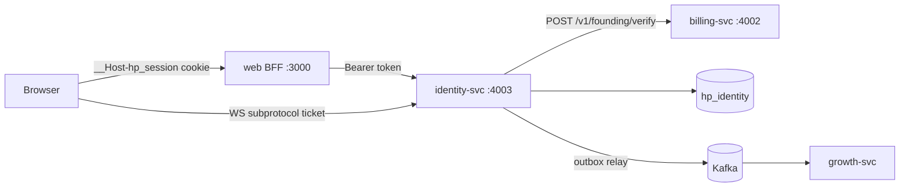
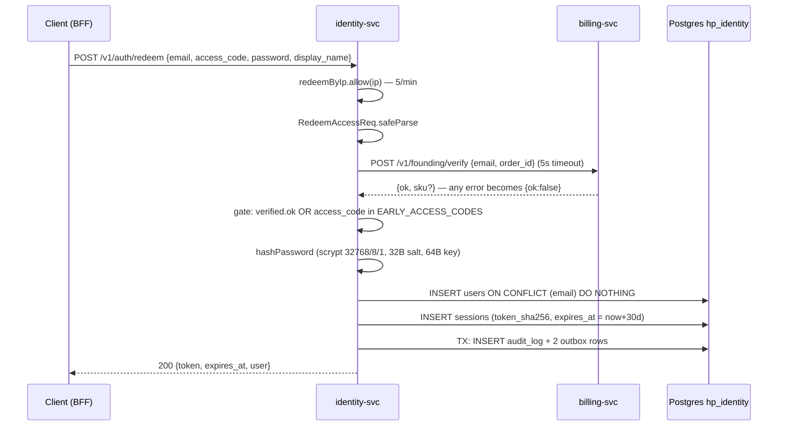
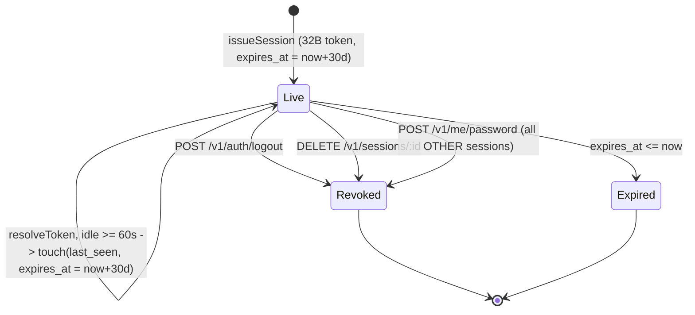
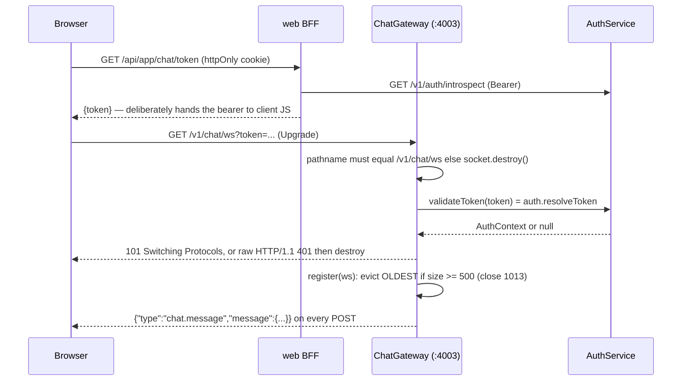

# identity-svc

This document is the code-level reference for `apps/services/identity` — the service that owns accounts, opaque session tokens, member self-service, the append-only audit log, and the founding-lounge chat. It is written for an engineer who joined today: every behavioural claim carries a `path:line` citation, and every constant (scrypt parameters, token lengths, rate-limit capacities, TTLs) is stated as the code states it. Read [01-architecture.md](../01-architecture.md) first for the topology, and [03-flows.md](../03-flows.md) for the cross-service sequences this service participates in.

- Port **4003**, database **`hp_identity`** (`apps/services/identity/src/common/config.ts:16,20`; `infra/compose/docker-compose.yml:215-216`).
- NestJS 11 on Fastify, run directly from TypeScript by `tsx`. `tsconfig.build.json` inherits `noEmit: true` from `apps/services/identity/tsconfig.json`, so `build` produces no output and the container runs the sources (`apps/services/identity/tsconfig.build.json:1-4`, `apps/services/identity/Dockerfile:33`).
- Not internet-facing for HTTP. The browser only ever talks to Next.js, which forwards the bearer server-side (`apps/web/lib/session.ts:42-45,69-76`). The one exception is the chat WebSocket: `/v1/chat/ws` is served by identity itself (`apps/services/identity/src/main.ts:36`, `apps/services/identity/src/chat/gateway.ts:47`), never by Next.js, so the edge proxy routes that one path to `CHAT_UPSTREAM = identity:4003` and everything else to `web:3000` (`infra/compose/caddy/Caddyfile.production:69-81`, `infra/compose/caddy/Caddyfile.staging:47-58`; `infra/compose/docker-compose.production.yml:154,157`, `infra/compose/docker-compose.staging.yml:111,113`). Locally the browser connects straight to the published port, `ws://localhost:4003/v1/chat/ws` (`infra/compose/docker-compose.yml:296`, `infra/compose/docker-compose.local.yml:59`). See §3.7.

---

## 1. Responsibility and boundaries

### Owns

| Concern | Where |
|---|---|
| Account records and password hashes | `apps/services/identity/src/auth/auth.service.ts:95-113`, `apps/services/identity/src/db/repo.ts:98-114` |
| Password hashing/verification primitives | `apps/services/identity/src/common/crypto.ts:25-53` |
| Opaque session tokens: mint, introspect, slide, revoke | `apps/services/identity/src/auth/auth.service.ts:164-245` |
| The token-validation oracle for the entire platform | `GET /v1/auth/introspect` → `apps/services/identity/src/auth/auth.service.ts:210-213`, consumed by `apps/web/lib/session.ts:42-45` |
| Member self-service: display name, password change, entitlements, personal audit trail | `apps/services/identity/src/me/me.service.ts:34-87` |
| Append-only audit log + its Kafka mirror | `apps/services/identity/src/common/audit.ts:9-30`, `apps/services/identity/src/db/repo.ts:195-204` |
| Founding-lounge chat: history, post, WebSocket fanout | `apps/services/identity/src/chat/chat.service.ts:28-62`, `apps/services/identity/src/chat/gateway.ts:28-111` |

### Explicitly does not own

| Not owned | Who owns it | Why identity does not |
|---|---|---|
| Whether a purchase happened | billing-svc | identity asks over HTTP: `POST /v1/founding/verify` (`apps/services/identity/src/auth/billing-verify.client.ts:11-19`). See [billing](./billing.md#37-purchase-verification-for-identity-svc-post-v1foundingverify). |
| The session cookie | the Next.js BFF | identity returns a bare token; the BFF puts it in `__Host-hp_session` (`apps/web/lib/session.ts:14,20-26`). See [web](./web.md). |
| Any email | growth-svc | identity has no SMTP client and no mail dependency; it emits `user.registered` and growth reacts. See [growth-messaging](./growth-messaging.md). |
| Entitlement enforcement | each consuming service | identity only *reports* `PACKAGES[sku]` (`apps/services/identity/src/me/me.service.ts:86`); nothing in identity denies an action based on it. |
| Password reset | nobody — it does not exist | see [Hazard H7](#h7-no-password-reset-exists-anywhere). |
| Kafka consumption | — | identity runs a producer only (`apps/services/identity/src/outbox/relay.ts:46-52`); it subscribes to nothing. |

### Boot sequence

`loadConfig()` → `migrate(databaseUrl)` → `createDb` → `PgIdentityRepo` → Nest app on `FastifyAdapter` → `app.init()` → start `OutboxRelay` → build `ChatGateway` and attach it to the raw Node server → wire `chat.onMessage` to `gateway.broadcast` → listen on `0.0.0.0:port` (`apps/services/identity/src/main.ts:15-51`). Shutdown on SIGINT/SIGTERM: gateway → relay → app → pool → `process.exit(0)` (`apps/services/identity/src/main.ts:39-47`).

---

## 2. Module map

### `apps/services/identity/src/`

| File | Purpose | Key exports |
|---|---|---|
| `main.ts` | Bootstrap, gateway attachment, graceful shutdown (`:14-54`) | — |
| `app.module.ts` | Module **factory**, not a static class: `tsx`/esbuild emits no `design:paramtypes`, so every provider is wired with explicit string tokens and `useFactory` (`:36-82`) | `createAppModule`, `IDENTITY_REPO`, `IDENTITY_CONFIG`, `FOUNDING_VERIFIER`, `CLOCK`, `HealthController` (`:15-18,21,41`) |

### `apps/services/identity/src/common/`

| File | Purpose | Key exports |
|---|---|---|
| `crypto.ts` | All crypto. `node:crypto` only, zero deps (`:1-2`) | `hashPassword` (`:25`), `verifyPassword` (`:36`), `DUMMY_HASH_PROMISE` (`:59`), `newSessionToken` (`:62`), `sha256Hex` (`:67`) |
| `config.ts` | The only file in `src` that reads `process.env` | `IdentityConfig`, `SESSION_TTL_DAYS` (`:12`), `loadConfig` (`:14`), `TENANT_ID` (`:34`) |
| `rate-limit.ts` | In-process token bucket, lazy continuous refill, injectable clock | `TokenBucket` (`:6`) |
| `cursor.ts` | Opaque keyset cursor over `(created_at, id)` | `Cursor`, `encodeCursor` (`:4`), `decodeCursor` (`:8`) |
| `audit.ts` | The single audit-write helper used by every mutating route | `audit` (`:9`) |
| `http.ts` | Structural Fastify request typing so `fastify` is not imported | `RequestMeta`, `requestMeta` (`:9`), `bearerHeader` (`:17`) |
| `errors.ts` | `ApiError`-shaped exceptions + the global catch-all filter | `ApiException` (`:5`), `ApiExceptionFilter` (`:18`) |

### `apps/services/identity/src/auth/`

| File | Purpose | Key exports |
|---|---|---|
| `auth.service.ts` | Redeem, login, session lifecycle, three rate-limit buckets | `AuthService` (`:35`), `FoundingVerifier` (`:26`), `AuthContext` (`:30`), `toSessionUser` (`:236`) |
| `billing-verify.client.ts` | The only outbound HTTP call in the service | `HttpFoundingVerifier` (`:7`) |
| `auth.controller.ts` | `@Controller("v1/auth")`: redeem, login, logout, introspect (`:6-31`) | `AuthController` |
| `sessions.controller.ts` | `@Controller("v1/sessions")`: list, revoke by id (`:6-18`) | `SessionsController` |

### `apps/services/identity/src/me/`

| File | Purpose | Key exports |
|---|---|---|
| `me.service.ts` | Profile, password change, audit paging, package lookup. Declares its own zod schemas (`:15-19`) rather than using `packages/contracts` | `MeService` (`:23`) |
| `me.controller.ts` | `@Controller("v1/me")`: `GET /`, `PATCH /`, `POST /password`, `GET /audit`, `GET /package` (`:6-34`) | `MeController` |

### `apps/services/identity/src/chat/`

| File | Purpose | Key exports |
|---|---|---|
| `chat.service.ts` | History paging, post with two flood buckets, the `onMessage` hook | `ChatService` (`:12`) |
| `gateway.ts` | WebSocket fanout: upgrade auth, admission control, heartbeat, broadcast | `ChatGateway` (`:28`), `ChatSocket` (`:13`) |
| `chat.controller.ts` | `@Controller("v1/chat")`: `GET history`, `POST messages` (`:7-29`) | `ChatController` |

### `apps/services/identity/src/db/` and `apps/services/identity/src/outbox/`

| File | Purpose | Key exports |
|---|---|---|
| `db/repo.ts` | Row types, the `IdentityRepo` interface every service depends on (`:60-91`), and the Postgres implementation (`:95-270`) | `IdentityRepo`, `PgIdentityRepo`, `UserRow`, `SessionRow`, `AuditRow`, `ChatRow`, `OutboxInsert`, `OutboxRow` |
| `db/schema.ts` | Drizzle table definitions. **Descriptive only** — nothing runs drizzle-kit; see [Hazard H10](#h10-the-drizzle-schema-is-decorative) | `users`, `sessions`, `auditLog`, `chatMessages`, `outbox` |
| `db/migrate.ts` | Bootstrap DDL run on every boot, idempotent (`:52-61`). The real source of truth for the physical schema | `migrate` (`:53`) |
| `db/client.ts` | `pg` Pool (`max: 10`) + drizzle instance (`:7-11`) | `Db`, `createDb` |
| `outbox/outbox.service.ts` | Envelope construction and topic pinning | `makeEnvelope` (`:8`), `auditEvent` (`:19`), `identityEvent` (`:24`) |
| `outbox/relay.ts` | 2 s polling relay: outbox rows → Kafka → `sent_at` | `OutboxRelay` (`:12`) |

### `apps/services/identity/test/`

| File | Role |
|---|---|
| `helpers.ts` | `testConfig()`, `FakeClock`, `FakeVerifier`, `META`/`metaFor(ip)` |
| `mem-repo.ts` | In-memory `IdentityRepo` reproducing every Postgres guard |
| `crypto.test.ts`, `rate-limit.test.ts`, `auth.test.ts`, `me.test.ts`, `chat.test.ts`, `app.test.ts` | See §7 |

---

## 3. Feature walkthroughs

Every route below is exact — no global prefix is configured (`apps/services/identity/src/main.ts:22-27`). Every `POST` carries `@HttpCode(200)` to override Nest's default `201`.

### 3.1 Cryptographic primitives (read this first)

**Password hashing** — `apps/services/identity/src/common/crypto.ts:9-33`:

| Parameter | Value | Line |
|---|---|---|
| `N` (CPU/memory cost) | `2 ** 15` = **32768** | `:9` |
| `r` (block size) | **8** | `:10` |
| `p` (parallelism) | **1** | `:11` |
| salt | **32** random bytes from `randomBytes` | `:12,:26` |
| derived key | **64** bytes | `:13,:27` |
| `maxmem` | `128 * N * r * 2` = **67 108 864 B (64 MiB)** — scrypt needs `128·N·r` = 32 MiB, doubled for headroom | `:14-16` |
| stored format | `scrypt$32768$8$1$<base64 salt>$<base64 key>` — standard base64, **not** base64url; 150 chars | `:33` |
| comparison | `timingSafeEqual`; lengths equal by construction because `keyLen = expected.length` | `:46-52` |

`verifyPassword` re-reads `N`/`r`/`p` **out of the stored string** rather than using the constants (`:39-41,46-50`). That is deliberate: the cost can be raised later without invalidating existing hashes. It returns `false` — never throws — when the string is not 6 `$`-separated parts, the prefix is not `scrypt`, any parameter is not an integer, or the salt/key decode to zero bytes (`:38,:44-45`).

**The unknown-email dummy hash** — `DUMMY_HASH_PROMISE` is a hash of `randomBytes(24).toString("base64url")` evaluated at **module load** (`:59`). Login verifies against it when the email is unknown so the scrypt cost is identical either way (`apps/services/identity/src/auth/auth.service.ts:152`). The cost of that design is one 32 MiB scrypt at import time — see [Hazard H3](#h3-one-32-mib-scrypt-runs-at-module-import).

**Session token** — `randomBytes(32).toString("base64url")` → 43 chars, 256 bits of entropy; the function also returns `sha256Hex(token)`, 64 hex chars (`:62-69`). The plaintext token never leaves the HTTP response: only the digest is persisted.

**Rate limiting** — `apps/services/identity/src/common/rate-limit.ts:6-38`. A `Map<key, {tokens, updatedAt}>` with no timers; refill is computed lazily inside `allow()`:

$$\text{tokens} \leftarrow \min\!\left(\text{capacity},\; \text{tokens} + \frac{\text{now} - \text{updatedAt}}{\text{windowMs}} \times \text{capacity}\right)$$

(`:24-26`). A new key starts **full** (`:21`). `allow()` returns `false` when `tokens < 1`, otherwise decrements by one (`:28-30`). Memory guard: when a **new** key is inserted and `buckets.size >= 100_000`, `sweep()` deletes buckets idle for at least `windowMs` (`:20,:34-38`) — a soft cap, because the sweep only runs on new-key insertion and may free nothing.

The five configured buckets:

| Bucket | Capacity / window | Key | Line |
|---|---|---|---|
| redeem by IP | 5 / 60 000 ms | `meta.ip ?? "unknown"` | `apps/services/identity/src/auth/auth.service.ts:54,:55` |
| login by IP | 10 / 60 000 ms | `meta.ip ?? "unknown"` | `:48,:133` |
| login by email | 5 / 60 000 ms | normalized email | `:49,:133` |
| chat burst | 1 / 2 000 ms | `user.id` | `apps/services/identity/src/chat/chat.service.ts:24,:47` |
| chat sustained | 20 / 60 000 ms | `user.id` | `:25,:47` |

**Cursors** — `encodeCursor` produces `base64url("<ISO createdAt>|<id>")`, 82 chars for an ISO timestamp plus a UUID (`apps/services/identity/src/common/cursor.ts:4-6`). `decodeCursor` splits on the **first** `|` via `indexOf` and returns `null` on empty input, `sep <= 0`, an unparseable date, or an empty id (`:8-17`). The SQL predicate it feeds is `(created_at < c) OR (created_at = c AND id < c.id)` with `ORDER BY created_at DESC, id DESC` (`apps/services/identity/src/db/repo.ts:207-217,234-251`).

### 3.2 Account creation: `POST /v1/auth/redeem`

Entry: `apps/services/identity/src/auth/auth.controller.ts:10-14` → `AuthService.redeem(body, requestMeta(req))`. `requestMeta` extracts `{ip: req.ip ?? null, userAgent: <first user-agent header>}` (`apps/services/identity/src/common/http.ts:9-15`).

Steps, in the order the code runs them (`apps/services/identity/src/auth/auth.service.ts:62-137`):

1. **Rate limit before validation** — `redeemByIp.allow(meta.ip ?? "unknown")`; failure is `429 rate_limited`, message `"Too many attempts. Try again in a minute."` (`:63-65`). Note the ordering: a malformed body still burns a token.
2. **Validate** — `RedeemAccessReq.safeParse` (`packages/contracts/src/index.ts:431-436`): `email` trimmed/lowercased/RFC-email/≤320, `access_code` trimmed 6..120, `password` 10..200, `display_name` trimmed 2..40. Failure is `422 validation_failed` carrying the **first** zod issue message (`:66-69`).
3. **Ask billing** — `billing.verify(req.email, req.access_code)` inside `try/catch`; any throw (timeout, DNS, bad JSON) degrades to `{ok:false}` (`:66-70`). The client is `POST {BILLING_URL}/v1/founding/verify` with body `{email, order_id}` and `AbortSignal.timeout(5_000)`; non-2xx → `{ok:false}`; the body is **cast, not zod-parsed**, and only `body.ok === true` yields `{ok:true, sku: body.sku}` (`apps/services/identity/src/auth/billing-verify.client.ts:11-19`).
4. **Entitlement gate** — `if (!verified.ok && !compedCodes.includes(req.access_code.toLowerCase()))` → `401 access_code_invalid`, message `"That code and email don't match a Founding order."` with remediation `"Use the order id from your order status page together with the email you paid with."` (`:78-90`). Naming both inputs matters: billing matches on the pair and returns one opaque `{ok:false}`, so a mistyped *email* used to surface as an unrecognised *code*. The env-code path is a *comped* founding grant; `compedCodes` is `cfg.earlyAccessCodes` folded to lower case once in the constructor (`:56`), so the comparison is case-insensitive — but still `Array.includes`, i.e. not constant-time.
5. **Build the user row** — `id: randomUUID()`, `role: "member"`, **`founding: true` unconditionally**, `packageSku: verified.sku ?? "ltd_founding"`, `passwordHash: await hashPassword(password)` (`:95-104`). See [Hazard H4](#h4-founding-is-always-true-and-sku-is-trusted-verbatim).
6. **Insert** — `createUser` runs `INSERT … ON CONFLICT (email) DO NOTHING RETURNING id`; an empty result maps to `"duplicate_email"` (`apps/services/identity/src/db/repo.ts:99-113`), surfaced as `409` with `error_code: "forbidden"` and remediation `"Sign in with that email instead."` (`:105-113`). The earlier copy pointed at a password reset that does not exist anywhere in the service.
7. **Issue a session** — §3.4.
8. **Audit + event** — `audit(repo, now, user.id, "auth.redeemed", user.id, {via, founding}, [identityEvent("user.registered", …)])` (`:116-135`). `via` is `"billing"` or `"access_code"`; `founding` in the **meta** is the truth (`verified.ok`), while the `user.registered` payload carries `user.founding`, i.e. always `true` (`:124` vs `:131`).

**Three separate commits.** `createUser`, `createSession` and `insertAudit` each autocommit; only `insertAudit` is a transaction (`apps/services/identity/src/db/repo.ts:196`). A crash between them leaves a user with no session, or a user with no audit trail. See [Hazard H8](#h8-redeem-and-changepassword-are-not-atomic).

### 3.3 Login: `POST /v1/auth/login`

`apps/services/identity/src/auth/auth.controller.ts:16-20` → `AuthService.login` (`apps/services/identity/src/auth/auth.service.ts:139-160`):

1. **Validate first** — `LoginReq.safeParse` (`packages/contracts/src/index.ts:439-442`: email as above, password 1..200) → `422 validation_failed` with a fixed `"Invalid input."` (`:128-131`). Unlike redeem, garbage bodies are *not* rate limited.
2. **Then rate limit** — `!loginByIp.allow(ip) || !loginByEmail.allow(email)` → `429` (`:133-135`). JavaScript short-circuits `||`, so the per-email bucket is not consumed when the per-IP bucket already denied.
3. **Constant-cost lookup** — `getUserByEmail` (case-insensitive because the column is `citext`, `apps/services/identity/src/db/migrate.ts:6`), then `verifyPassword(password, user?.passwordHash ?? await DUMMY_HASH_PROMISE)` (`:137-140`).
4. **Uniform failure** — `401 auth_invalid_credentials`, `"Invalid email or password."` for both unknown-email and wrong-password (`:141-143`). The bodies are asserted byte-identical in `apps/services/identity/test/auth.test.ts:114-131`.
5. `issueSession`, then `audit("auth.login", target = user.id, meta = {ip})` (`:145-146`).

### 3.4 Session lifecycle

**Mint** (`apps/services/identity/src/auth/auth.service.ts:164-179`): `newSessionToken()`; insert `{id: uuid, userId, tokenSha256, createdAt = lastSeenAt = now, expiresAt = now + cfg.sessionTtlMs, ip, userAgent}` with `revoked_at` NULL. `sessionTtlMs` is `SESSION_TTL_DAYS (30) * 86 400 000` = **2 592 000 000 ms** and is **not** env-configurable (`apps/services/identity/src/common/config.ts:12,30`). The response is `{token, expires_at, user}` — the only place the plaintext token exists.

**Introspect** (`:173-187`): `sha256Hex(token)` → `getSessionWithUser`, one round trip over the unique `token_sha256` index joined to `users` (`apps/services/identity/src/db/repo.ts:151-161`). `null` when the row is missing, `revoked_at` is set, or `expires_at <= now` (`:176-179`).

**Slide** (`:180-185`): if `now - last_seen_at >= TOUCH_INTERVAL_MS` (**60 000 ms**, `:33`), write `last_seen_at = now, expires_at = now + 30 d`. Under regular use a session never expires — `apps/services/identity/test/auth.test.ts:163-181` drives 40 iterations of +20 days and the session stays alive.

**Bearer parsing** (`:189-196`): `requireSession` strips the literal `"Bearer "` prefix (7 chars) and throws `401 session_expired`, `"Session is invalid or expired."`, remediation `"Log in again."` when the token is missing, malformed, revoked or expired. `bearerHeader` only extracts the raw header (`apps/services/identity/src/common/http.ts:17-20`) — the prefix handling lives in the service.

**Enumerate** — `GET /v1/sessions` lists rows `WHERE user_id AND revoked_at IS NULL AND expires_at > now ORDER BY created_at DESC, id DESC` (`apps/services/identity/src/db/repo.ts:167-173`) and flags `current` by `s.tokenSha256 === ctx.tokenSha256` (`apps/services/identity/src/auth/auth.service.ts:232`).

**Revoke** — `DELETE /v1/sessions/:id` → `revokeSession(id, userId, now)`, guarded by `id AND user_id AND revoked_at IS NULL RETURNING id` (`apps/services/identity/src/db/repo.ts:175-181`); `false` becomes `404` with `error_code: "forbidden"` (`:228-230`). Revocation is therefore monotonic, and re-revoking a session 404s. `POST /v1/auth/logout` revokes the caller's own session but **discards the boolean** and always returns `200` (`:203-208`).

### 3.5 Member self-service: `/v1/me`

Controller: `apps/services/identity/src/me/me.controller.ts:6-34`. Authentication is enforced inside `MeService`, not by a guard.

| Route | Behaviour |
|---|---|
| `GET /v1/me` | Delegates to `auth.introspect` (`apps/services/identity/src/me/me.service.ts:30-32`) |
| `PATCH /v1/me` | `UpdateMeReq` = `{display_name: trim 2..40}` declared locally (`:15`); `422 validation_failed` with `"display_name must be 2-40 characters."`; `setDisplayName`; `audit("me.updated", meta {display_name})`; returns a locally merged `SessionUserRes` rather than re-reading the row (`:34-45`) |
| `POST /v1/me/password` | `ChangePasswordReq` = `{current_password 1..200, new_password 10..200}` (`:16-19`); `verifyPassword` against `ctx.user.passwordHash` → `401 auth_invalid_credentials` `"Current password is incorrect."`; `setPasswordHash(await hashPassword(new))`; `revokeOtherSessions(userId, keep = ctx.session.id, now)`; `audit("auth.password.changed", meta {revoked_sessions: <count>})` (`:47-63`). Three independent commits. |
| `GET /v1/me/audit?cursor=` | `AUDIT_PAGE_SIZE = 50` (`:21`), not client-overridable. Fetches 51 rows, slices to 50, and encodes `next_cursor` from the **last** row of the page (`:65-82`) |
| `GET /v1/me/package` | `PACKAGES[ctx.user.packageSku] ?? PACKAGES.ltd_founding` (`:84-87`). `PACKAGES` has exactly one entry: `ltd_founding` — lifetime, active, limits `{live_connections: 3, paper_accounts: 3, signals_per_day: 50, guard_rules: 20}` (`packages/contracts/src/index.ts:662-670`) |

### 3.6 Audit log

One helper, called by every mutating route (`apps/services/identity/src/common/audit.ts:9-30`). It builds `{id: randomUUID(), actorId, action, target ?? null, meta ?? null, createdAt}` and calls `repo.insertAudit(row, [auditEvent(action, {actor_id, target, meta}), ...extraEvents])`. `insertAudit` is the **only** `db.transaction` in the whole service: the audit row and its outbox envelopes commit together (`apps/services/identity/src/db/repo.ts:195-204`), with `outbox.id = envelope.event_id` giving insert-time dedupe of identical envelopes (`:200`).

Complete inventory of audited actions:

| `action` | `target` | `meta` | Emitted at |
|---|---|---|---|
| `auth.redeemed` | user id | `{via: "billing"\|"access_code", founding: <billing verified?>}` | `apps/services/identity/src/auth/auth.service.ts:116-135` |
| `auth.login` | user id | `{ip}` | `:146` |
| `auth.logout` | **session** id | `null` | `:206` |
| `auth.session.revoked` | revoked session id | `null` | `:231` |
| `me.updated` | user id | `{display_name}` | `apps/services/identity/src/me/me.service.ts:41-43` |
| `auth.password.changed` | user id | `{revoked_sessions: <count>}` | `:59-61` |
| `chat.message.posted` | message id | `null` | `apps/services/identity/src/chat/chat.service.ts:58` |

The Kafka envelope `type` is the audit action string verbatim, and the payload is `{actor_id, target, meta}` — deliberately **not** the audit row id (`apps/services/identity/src/common/audit.ts:27`).

### 3.7 Founding-lounge chat

**`GET /v1/chat/history?cursor=&limit=`** (`apps/services/identity/src/chat/chat.controller.ts:14-22` → `apps/services/identity/src/chat/chat.service.ts:28-44`). `DEFAULT_PAGE = 50`, `MAX_PAGE = 100` (`:9-10`). Limit resolution: `requested = Number(limitRaw ?? 50)`, then `Number.isInteger(requested) ? clamp(requested, 1, 100) : 50` (`:29-30`). Fetches `limit + 1` to detect `hasMore`; the repo returns newest-first, so the page is `.reverse()`d because the contract wants newest **last** (`:37-40`, `packages/contracts/src/index.ts:637-641`); `next_cursor` encodes the **oldest** row of the page (`:41-42`). Note the two edge cases in `:29-30`: `?limit=` (empty string) makes `Number("")` be `0`, which is an integer, so it clamps to **1** message; `?limit=abc` or `?limit=2.5` is not an integer and falls back to **50**.

**`POST /v1/chat/messages`** (`apps/services/identity/src/chat/chat.controller.ts:24-29` → `apps/services/identity/src/chat/chat.service.ts:46-62`):
1. `!burst.allow(user.id) || !sustained.allow(user.id)` → `429 chat_flood`, `"Slow down — 1 message per 2s, 20 per minute."` (`:47-49`).
2. `ChatPostReq.safeParse` = `{body: trim 1..2000}` (`packages/contracts/src/index.ts:626`) → `422` `"Message must be 1-2000 characters."` (`:50-53`).
3. `insertChatMessage` with the **trimmed but otherwise raw, unescaped** body — escaping is a render-time concern (`:56-57`).
4. `audit("chat.message.posted", target = message id)` (`:58`).
5. Fire `this.onMessage?.(message)` — the single hook `main.ts:37` binds to `gateway.broadcast` (`:60`).

Neither route checks `founding` or `role` (`apps/services/identity/src/chat/chat.controller.ts:20,27`): any authenticated member reads and writes the "founding" lounge.

**WebSocket upgrade** (`apps/services/identity/src/chat/gateway.ts`). `HEARTBEAT_MS = 30_000` (`:6`), `OPEN = 1` (`:7`), `maxSockets = 500` by default and never overridden in production (`:36`, `apps/services/identity/src/main.ts:35`). `attach(server)` registers a **global** `upgrade` listener on the raw Node server behind Fastify and starts an `unref`'d 30 s heartbeat (`:39-43`).

Handshake detail (`:45-59`): the path must be exactly `/v1/chat/ws`, otherwise `socket.destroy()` with **no response** (`:47-50`); the token comes from `?token=`; `validateToken(token).catch(() => null)` makes a DB error a soft denial (`:52`); denial writes the literal bytes `HTTP/1.1 401 Unauthorized\r\nConnection: close\r\n\r\n` then destroys (`:53-57`). Because `validateToken` is `auth.resolveToken` (`apps/services/identity/src/main.ts:35`), a WebSocket connect runs the full sliding-renewal path and can itself extend the session.

Admission control (`:62-79`): `while (clients.size >= maxSockets)` delete and `close(1013, "connection limit reached")` the **first** entry of the `Set` — insertion order, i.e. the *oldest* socket. Then `isAlive = true`, insert, and wire `pong` / `close` / `error` (`error` also `terminate()`s). Broadcast (`:81-86`): `JSON.stringify` once, send to every socket with `readyState === 1`, payload `{type: "chat.message", message}`. Heartbeat (`:88-98`): terminate and drop sockets whose `isAlive === false`, otherwise set `isAlive = false` and `ping()`. There is **no** inbound `message` handler — the socket is strictly server→client — and `bufferedAmount`, `maxPayload` and `perMessageDeflate` are never configured (`:29`).

**Deployment caveat — the lounge is polling-only on staging.** The staging edge applies `basic_auth` to the whole site, including the `/v1/chat/ws` handle (`infra/compose/caddy/Caddyfile.staging:27-29,47-48`). Browsers do not attach basic-auth credentials to a WebSocket handshake initiated from JavaScript, so the upgrade is answered with `401` and the client falls back to history polling. This is accepted and documented at the top of that file (`infra/compose/caddy/Caddyfile.staging:12-15`); production has no basic auth (`infra/compose/caddy/Caddyfile.production:69-77`). Do not debug "realtime chat is broken on staging" — it is broken by design there.

### 3.8 Persistence layer

Every query in `PgIdentityRepo` (`apps/services/identity/src/db/repo.ts:95-270`):

| Method | SQL shape | Line |
|---|---|---|
| `createUser` | `INSERT … ON CONFLICT (email) DO NOTHING RETURNING id`; empty → `duplicate_email` | `:98-114` |
| `getUserByEmail` | `SELECT * FROM users WHERE email = $1` (citext ⇒ case-insensitive) | `:129-132` |
| `getUserById` | `SELECT * FROM users WHERE id = $1` — **zero callers in `src`** | `:134-137` |
| `setDisplayName` / `setPasswordHash` | single-column `UPDATE users … WHERE id` | `:139-145` |
| `createSession` | `INSERT INTO sessions …` | `:147-149` |
| `getSessionWithUser` | `sessions INNER JOIN users ON users.id = sessions.user_id WHERE token_sha256 = $1` — the hot path | `:151-161` |
| `touchSession` | `UPDATE sessions SET last_seen_at, expires_at WHERE id` | `:163-165` |
| `listSessions` | `WHERE user_id AND revoked_at IS NULL AND expires_at > $2 ORDER BY created_at DESC, id DESC` | `:167-173` |
| `revokeSession` | `UPDATE … WHERE id AND user_id AND revoked_at IS NULL RETURNING id` → boolean | `:175-182` |
| `revokeOtherSessions` | same with `id <> keepSessionId`, returns the row count | `:184-193` |
| `insertAudit` | **`db.transaction`**: `INSERT audit_log` + bulk `INSERT outbox` with `id = envelope.event_id` | `:195-204` |
| `listAudit` | `WHERE actor_id [AND keyset] ORDER BY created_at DESC, id DESC LIMIT n` | `:206-227` |
| `insertChatMessage` | `INSERT INTO chat_messages …` | `:229-231` |
| `listChatMessages` | joins `users` for `display_name`; `WHERE <keyset or sql\`true\`>`, same ordering | `:233-254` |
| `fetchUnsentOutbox` | `WHERE sent_at IS NULL ORDER BY created_at ASC LIMIT n` — **no `FOR UPDATE SKIP LOCKED`** | `:256-264` |
| `markOutboxSent` | `UPDATE outbox SET sent_at = now() WHERE id IN (…)`; no-op on an empty list | `:266-269` |

### 3.9 Outbox relay

`makeEnvelope(type, payload)` stamps `{event_id: randomUUID(), type, occurred_at: ISO now, tenant_id: "heropips", payload}` (`apps/services/identity/src/outbox/outbox.service.ts:8-16`, `apps/services/identity/src/common/config.ts:34`). `auditEvent` pins `TOPICS.auditLog`; `identityEvent` pins `TOPICS.identityEvents` (`:19-26`).

`OutboxRelay` (`apps/services/identity/src/outbox/relay.ts`): `TICK_MS = 2_000`, `WARN_EVERY_MS = 30_000` (`:4-5`). `start()` is idempotent and the interval is `unref()`ed so it never holds the process open (`:24-28`). Each `tick()`:

1. Re-entrancy guard `ticking` — a slow tick is skipped, not queued (`:40-41,:82`).
2. `fetchUnsentOutbox(100)`; **returns early when empty**, so Kafka is never contacted while idle (`:43-44`).
3. Lazily constructs `new Kafka({clientId: "hp-identity", brokers, logLevel: NOTHING, retry: {retries: 1}})` and `kafka.producer({allowAutoTopicCreation: true})`, connecting once (`:45-57`).
4. Per row: `producer.send({topic: row.topic, messages: [{key: payload.actor_id ?? envelope.event_id, value: JSON.stringify(envelope)}]})`, then `markOutboxSent([row.id])` — **at-least-once**, with one DB round trip per message (`:58-70`).
5. On error: `connected = false`, `console.warn` at most once per 30 s, never rethrow (`:71-83`).

### 3.10 Error handling

`ApiException` carries the contracts `ApiError` body verbatim: `{error_code, message}` plus optional `{remediation}` (`apps/services/identity/src/common/errors.ts:5-13`, `packages/contracts/src/index.ts:43-46`). `ApiExceptionFilter` is `@Catch()` (everything) and registered as `APP_FILTER` (`apps/services/identity/src/common/errors.ts:17-38`, `apps/services/identity/src/app.module.ts:76`): an `HttpException` whose body already has `error_code` passes through with its status; one without is rewritten to `{error_code: "internal", message}`; anything else is `console.error`ed and returned as `500 {error_code: "internal", message: "Unexpected error."}`. Internals never leak, proven end-to-end in `apps/services/identity/test/app.test.ts:116-123`.

| `error_code` | Status | Trigger |
|---|---|---|
| `rate_limited` | 429 | redeem/login buckets (`apps/services/identity/src/auth/auth.service.ts:64,134`) |
| `validation_failed` | 422 | zod failure in redeem/login/chat/me (`:60,:130`; `apps/services/identity/src/chat/chat.service.ts:52`; `apps/services/identity/src/me/me.service.ts:38,51`) |
| `access_code_invalid` | 401 | neither billing nor an env code matched (`:72-77`) |
| `forbidden` | **409** | duplicate email (`:95-100`) |
| `forbidden` | **404** | session not found / not owned / already revoked (`:229`) |
| `auth_invalid_credentials` | 401 | bad login, or wrong current password (`:142`; `apps/services/identity/src/me/me.service.ts:55`) |
| `session_expired` | 401 | missing/malformed/revoked/expired bearer (`:193`) |
| `chat_flood` | 429 | either chat bucket (`apps/services/identity/src/chat/chat.service.ts:48`) |
| `internal` | 500 | any non-`HttpException`, or one without `error_code` (`apps/services/identity/src/common/errors.ts:30,37`) |

For the full request/response contracts of all 15 routes see [05-api-reference.md](../05-api-reference.md).

---

## 4. Data

Database `hp_identity`. The physical schema is the raw DDL in `apps/services/identity/src/db/migrate.ts:3-50`, executed on **every boot** after `CREATE EXTENSION IF NOT EXISTS citext` (`:53-61`, called from `apps/services/identity/src/main.ts:17`) using a dedicated `Pool({max: 2})` that is closed in `finally`. There is no migration-version table in the service itself, so in-service schema changes must be additive and `IF NOT EXISTS`; the versioned mirror lives in `infra/sql/identity/0001_init.sql` and is applied by `scripts/db.mjs` — see [07-infrastructure.md](../07-infrastructure.md).

Tables owned — column and index detail in [02-data-model.md](../02-data-model.md):

| Table | Role | Load-bearing constraints |
|---|---|---|
| `users` | accounts | `email citext UNIQUE` powers the `ON CONFLICT` duplicate check; `role CHECK IN ('member','admin')`; `founding` default `false`; `package_sku` default `ltd_founding` (`apps/services/identity/src/db/migrate.ts:4-13`) |
| `sessions` | opaque session records | `token_sha256 UNIQUE` is the introspect index; FK `user_id → users(id)`; `sessions_user_id_idx (user_id)` serves `listSessions`/`revokeOtherSessions` (`:14-25`) |
| `audit_log` | append-only audit trail | `actor_id uuid NOT NULL` with **no FK**; `audit_log_actor_idx (actor_id, created_at DESC, id DESC)` matches the keyset query exactly (`:26-34`) |
| `chat_messages` | founding-lounge messages | FK `user_id → users(id)`; `chat_messages_created_idx (created_at DESC, id DESC)` (`:35-41`) |
| `outbox` | pending Kafka envelopes | PK `id` **= `envelope.event_id`**; partial index `outbox_unsent_idx (created_at) WHERE sent_at IS NULL` matches `fetchUnsentOutbox` (`:42-49`) |

Invariants worth remembering:

- A session is *live* ⇔ `revoked_at IS NULL AND expires_at > now`, enforced identically in SQL (`apps/services/identity/src/db/repo.ts:171`) and in memory (`apps/services/identity/src/auth/auth.service.ts:191`).
- Revocation is monotonic: every revoke is guarded on `revoked_at IS NULL` (`apps/services/identity/src/db/repo.ts:179,189`).
- `audit_log` has no update or delete path anywhere in the service.
- Runtime pool is `max: 10` (`apps/services/identity/src/db/client.ts:8`); the migration pool is `max: 2` and short-lived.

---

## 5. Events

Both topics are produced through the outbox; identity **consumes nothing**. Exact strings from `packages/contracts/src/index.ts:245-252`.

### Produced

| Topic | `type` values | Payload | Kafka key |
|---|---|---|---|
| `hp.audit.log.v1` | every audit action: `auth.redeemed`, `auth.login`, `auth.logout`, `auth.session.revoked`, `me.updated`, `auth.password.changed`, `chat.message.posted` | `{actor_id, target, meta}` (`apps/services/identity/src/common/audit.ts:27`) | `payload.actor_id` ⇒ per-user partition ordering (`apps/services/identity/src/outbox/relay.ts:59,64`) |
| `hp.identity.events.v1` | exactly one: `user.registered` (`packages/contracts/src/index.ts:255-258`) | `{user_id, email, display_name, founding, package_sku}` (`apps/services/identity/src/auth/auth.service.ts:127-133`) | falls back to `envelope.event_id`, because this payload has **no `actor_id`** (`apps/services/identity/src/outbox/relay.ts:59,64`) |

Envelope shape for both: `{event_id, type, occurred_at, tenant_id: "heropips", payload}` (`apps/services/identity/src/outbox/outbox.service.ts:8-16`).

### Consumed

None. The only kafkajs usage in the service is the producer at `apps/services/identity/src/outbox/relay.ts:46-52`.

### Downstream

growth-svc subscribes to `hp.identity.events.v1` (`apps/services/growth/src/messaging/consumer.ts`). No service in `apps/services` subscribes to `hp.audit.log.v1` — see [Hazard H12](#h12-the-audit-log-kafka-topic-has-no-consumer). Full wiring in [03-flows.md](../03-flows.md).

---

## 6. Configuration

Every `process.env` read in `src` is in `apps/services/identity/src/common/config.ts:14-32`. Nothing else in the service touches the environment.

| Env var | Default | Required? | Notes |
|---|---|---|---|
| `IDENTITY_PORT` | falls through to `PORT`, then `4003` (`:16`) | no | first match wins |
| `PORT` | `4003` (`:16`) | no | Dockerfile sets `PORT=4003` (`apps/services/identity/Dockerfile:24`); compose sets `"4003"` (`infra/compose/docker-compose.yml:215`) |
| `DATABASE_URL_IDENTITY` | falls through to `DATABASE_URL` (`:18`) | no | per-service override |
| `DATABASE_URL` | `postgres://hp:hp@localhost:5432/hp_identity` (`:19-20`) | **effectively yes outside local** — the default points at localhost | compose sets `postgres://hp:hp@postgres:5432/hp_identity` (`infra/compose/docker-compose.yml:216`) |
| `KAFKA_BROKERS` | `localhost:9092` (`:21-24`) | no — the relay degrades gracefully | CSV, trimmed, empty entries dropped; compose sets `kafka:9092` (`infra/compose/docker-compose.yml:41`) |
| `BILLING_URL` | `http://localhost:4002` (`:25`) | no — redeem falls back to env codes | trailing slashes stripped via `.replace(/\/+$/, "")`; compose sets `http://billing:4002` (`infra/compose/docker-compose.yml:217`) |
| `EARLY_ACCESS_CODES` | `""` → empty array (`:26-29`) | no | CSV, trimmed, empties dropped. Base compose leaves it **empty** (`infra/compose/docker-compose.yml:218`); only the local overlay seeds `hp_dev_alpha,hp_dev_beta` (`infra/compose/docker-compose.local.yml:62`) |

**Not configurable at all** — these are compile-time constants: session TTL 30 days (`:12,30`), tenant id `"heropips"` (`:34`), scrypt `N`/`r`/`p`, all five rate-limit capacities and windows, `TOUCH_INTERVAL_MS` 60 s, WS socket cap 500, heartbeat 30 s, relay tick 2 s and batch 100, `AUDIT_PAGE_SIZE` 50, chat `MAX_PAGE` 100.

`NODE_ENV=production` is set in the image (`apps/services/identity/Dockerfile:24`) but identity's own code never reads it.

---

## 7. Testing

`vitest run`, node environment, `apps/services/identity/test/**/*.test.ts`, transpiled by `unplugin-swc` with `legacyDecorator` + `decoratorMetadata` so Nest's `@Inject` resolves in the HTTP test (`apps/services/identity/vitest.config.ts:5-22`). Every test uses `MemRepo` + `FakeClock` + `FakeVerifier`: **no database, no Kafka, no network**. There are no coverage thresholds and no setup files.

| File | What it asserts |
|---|---|
| `crypto.test.ts` | hash/verify roundtrip (`:11-14`); wrong password false **and** the stored string literally starts `scrypt$32768$8$1$` and contains no plaintext (`:16-21`); two hashes of one password differ and the decoded salt is exactly 32 bytes (`:23-29`); malformed stored strings (`""`, `"bcrypt$whatever"`, `"scrypt$a$b$c$d$e"`) return `false` instead of throwing (`:31-35`); the dummy hash never verifies (`:37-39`); a token base64url-decodes to 32 bytes, `sha256 === sha256Hex(token)`, matches `/^[0-9a-f]{64}$/`, and successive tokens differ (`:43-48`) |
| `rate-limit.test.ts` | capacity then block (`:6-11`); keys are independent (`:13-19`); continuous refill precision — 5/min gives exactly one token back at 12 s and none at 11 s (`:21-31`); refill never exceeds capacity even after 60× the window (`:33-39`) |
| `auth.test.ts` | redeem happy path: founding user, `scrypt$` hash without plaintext, `sessions[0].tokenSha256 === sha256Hex(res.token)` and **not** the raw token, audit `["auth.redeemed"]`, exactly **2** outbox rows one of which is `type === "user.registered"` (`:40-63`); env-code fallback while the verifier **throws** still yields `founding: true` and `ltd_founding` (`:65-72`); unknown code → 401 with zero users created (`:74-78`); duplicate email → 409 with one user (`:80-86`); the 6th redeem from one IP inside a minute → 429 (`:88-95`); login audit ordering (`:106-112`); **byte-identical 401 bodies** for unknown-email vs wrong-password (`:114-131`); the per-email bucket trips on the 6th attempt across 5 distinct IPs (`:133-145`); introspect → logout → 401 (`:147-155`); +31 days → 401 (`:157-161`); sliding expiry — no write at +30 s, expiry slides to `now+30d` at +70 s, and 40 × (+20 d) keeps it alive indefinitely (`:163-181`); the sessions list flags exactly one `current`, revoking the other kills its token, re-revoking → 404 (`:183-196`) |
| `me.test.ts` | `/v1/me` shape (`:49-53`); `display_name` `"x"` → 422 while `"  Hero Prime  "` is trimmed, persisted and audited (`:55-62`); wrong current password → 401, short new password → 422 (`:64-76`); password change revokes the sibling session, **keeps the current one**, invalidates the old password and accepts the new one (`:78-97`); the audit list returns 50 own rows newest-first with a non-null cursor, page 2 has zero overlap and ends at `auth.redeemed`, and a foreign actor's row is excluded (`:99-120`); package resolves to `{sku: "ltd_founding", lifetime: true, active: true}` (`:122-127`) |
| `chat.test.ts` | body is trimmed but stored **raw** (`"<b>gm heroes</b>"` unescaped), `display_name` is joined, `onMessage` fires, `chat.message.posted` is audited (`:42-53`); a second message inside 2 s → 429 `chat_flood`, allowed again at exactly +2 s (`:55-61`); the guard is per user id (`:63-69`); pacing at exactly 1 msg/2 s still trips the 20/min bucket (`:71-90`); history is newest-**last**, pages back over 3 keyset pages ending `next_cursor: null`, and `limit=9999` clamps (`:92-113`); `"   "` → 422 (`:115-118`). Gateway, via a hand-written `FakeSocket`: broadcast reaches only `readyState === 1` sockets with payload `{type: "chat.message", message}` (`:159-174`); with `maxSockets = 2` the **first** registered socket is closed `1013` and receives nothing (`:176-192`); a closed socket leaves the set (`:194-200`) |
| `app.test.ts` | real Nest + Fastify via `inject`: `/healthz` (`:31-35`); redeem 200 (`:37-53`); introspect with and without a bearer (`:55-68`); sessions list/delete plus `/v1/me`, `/v1/me/package`, `/v1/me/audit` (`:70-96`); chat post + history round-trip with `channel: "founding-lounge"` and the new message last (`:98-114`); a failed-login body is exactly `{error_code: "auth_invalid_credentials", message: "Invalid email or password."}`, proving the `APP_FILTER` path (`:116-123`) |

### Not covered by any test

| Gap | Consequence |
|---|---|
| `ChatGateway.handleUpgrade` (`apps/services/identity/src/chat/gateway.ts:45-59`) | The entire WebSocket authentication handshake — path check, token extraction, 401 byte-writing — is unverified. Only `register`/`broadcast`/`pingAll` are exercised. |
| `OutboxRelay` (`apps/services/identity/src/outbox/relay.ts`) | No relay test file exists. Batch size, key selection, `markOutboxSent` ordering and the warn throttle are unverified. |
| `PgIdentityRepo` (`apps/services/identity/src/db/repo.ts:95-270`) | No test touches Postgres. Every SQL predicate, index usage and the `insertAudit` transaction rest on `MemRepo` mirroring them by hand (`apps/services/identity/test/mem-repo.ts`). A divergence — e.g. the `citext` vs drizzle `text` mismatch — would not be caught. |
| `HttpFoundingVerifier` (`apps/services/identity/src/auth/billing-verify.client.ts`) | Only `FakeVerifier` is exercised; the real timeout, non-2xx and unparsed-body handling are untested. |
| `migrate()` (`apps/services/identity/src/db/migrate.ts`) | The DDL is never executed in CI. |

---

## 8. Hazards and gaps

Ordered roughly by operational severity. Each entry names the impact and a concrete fix.

### H1. Rate limiting is in-process, per replica

`TokenBucket` state is a plain `Map` inside the Node process (`apps/services/identity/src/common/rate-limit.ts:7`). **Impact:** every limit divides by the replica count — with 4 identity pods, login is effectively 40/min/IP, not 10; the buckets reset to full on every deploy, restart or crash, so a deploy loop is a free bypass; and the 100 000-entry cap is soft because `sweep()` only runs when a *new* key is inserted and may free nothing (`:20,:34-38`), so a distributed key-space attack can grow the map unboundedly between insertions of new keys. **Fix:** move the counters to a shared store (Redis `INCR`+`EXPIRE`, or Postgres with a `(key, window)` upsert) behind the same `TokenBucket` interface so call sites do not change; alternatively enforce login/redeem limits at the edge proxy where the real client IP is available. Keep the in-process bucket as a cheap second layer.

### H2. `trustProxy` is off, so `req.ip` is the proxy's address

`new FastifyAdapter()` is constructed with **no options** (`apps/services/identity/src/main.ts:24`), so Fastify's `trustProxy` stays `false` and `req.ip` is the socket peer address (`apps/services/identity/src/common/http.ts:12`). **Impact:** behind the Caddy edge and the Docker network, every request appears to come from one address. `redeemByIp` (5/min) and `loginByIp` (10/min) therefore collapse into a **single global bucket for all traffic** — the first 10 login attempts per minute platform-wide consume it, and every subsequent legitimate login gets `429`. That is a self-inflicted denial of service, and it also means every `sessions.ip` value and every `auth.login` audit `meta.ip` records the proxy address, destroying the forensic value of both. **Fix:** construct the adapter as `new FastifyAdapter({ trustProxy: <the hop count or CIDR of the trusted edge> })` and make the edge set `X-Forwarded-For`. Do **not** pass `trustProxy: true` unconditionally — with an untrusted client-supplied header, per-IP rate limits become trivially spoofable, which is strictly worse than the current state.

### H3. One 32 MiB scrypt runs at module import

`DUMMY_HASH_PROMISE` is initialised at module load, not lazily (`apps/services/identity/src/common/crypto.ts:59`). **Impact:** importing `crypto.ts` schedules a scrypt that allocates `128·N·r` = 32 MiB and occupies a libuv threadpool slot, adding measurable latency and a memory spike to every cold start — including short-lived contexts such as the test suite and any future CLI that imports the module for `sha256Hex`. *[INFERENCE]* With the default `UV_THREADPOOL_SIZE=4`, this competes with the first real login's hash. A related amplification: unauthenticated `POST /v1/auth/login` triggers a 32 MiB scrypt per attempt, so once an attacker distributes across IPs to defeat the per-IP bucket (see H2), login is a cheap memory and latency amplifier. **Fix:** make it lazy and memoized — `let dummy: Promise<string> | undefined; const getDummyHash = () => (dummy ??= hashPassword(randomBytes(24).toString("base64url")))` — and call it only on the unknown-email branch at `apps/services/identity/src/auth/auth.service.ts:152`. Separately, raise `UV_THREADPOOL_SIZE` and bound concurrent hashing with a semaphore so a login flood cannot exhaust memory.

### H4. `founding` is always `true`, and `sku` is trusted verbatim

`UserRow.founding` is hard-coded `true` regardless of what billing said (`apps/services/identity/src/auth/auth.service.ts:101`), and `packageSku` is `verified.sku ?? "ltd_founding"` where `verified.sku` comes from an **unvalidated cast** of billing's response body (`apps/services/identity/src/auth/billing-verify.client.ts:18-19`). **Impact:** the `user.registered` Kafka payload carries `user.founding`, i.e. always `true` (`:119`), so no downstream consumer can distinguish a paid founder from a comped env-code grant — only the audit `meta.founding` records the truth (`:112`). And any string billing returns becomes `users.package_sku`; an unknown sku then silently resolves to full `ltd_founding` entitlements at `apps/services/identity/src/me/me.service.ts:86`. **Fix:** set `founding: verified.ok` and include `via` in the event payload; validate the verify response with a zod schema whose `sku` is `z.enum(Object.keys(PACKAGES))`; and make `packageInfo` throw rather than fall back, so an unknown sku is a loud failure instead of a free upgrade.

### H5. Early-access codes are unlimited, multi-use, and compared unsafely

The gate is `cfg.earlyAccessCodes.includes(req.access_code)` (`apps/services/identity/src/auth/auth.service.ts:78`) — case-sensitive, not constant-time, with no use counter and no expiry. **Impact:** one leaked code creates an unbounded number of lifetime founding accounts, one per email address, with no audit distinction beyond `via: "access_code"`. The local overlay ships `hp_dev_alpha,hp_dev_beta` (`infra/compose/docker-compose.local.yml:62`); if that value ever reaches a real environment through a copied `.env`, the paywall is open. **Fix:** replace the CSV with single-use invite rows in the database (`code`, `redeemed_by`, `redeemed_at`, `expires_at`), compare with `timingSafeEqual`, and have `scripts/preflight.mjs` reject non-empty `EARLY_ACCESS_CODES` in staging and production.

### H6. The duplicate-email 409 is an account-enumeration oracle

`redeem` returns `409 forbidden` `"An account with this email already exists."` (`apps/services/identity/src/auth/auth.service.ts:106-113`). **Impact:** this hands out exactly the information the login path works hard to conceal — `login` is deliberately timing-uniform and byte-identical for unknown-email vs wrong-password (`:137-143`, asserted at `apps/services/identity/test/auth.test.ts:114-131`), and the 409 undoes all of it. It is also cheap to farm: the redeem bucket is 5/min/IP and, per H2, effectively global. **Fix:** return the same `401 access_code_invalid` for a duplicate email when the access code did not verify; when it *did* verify, return a generic success-shaped response and have growth-svc email the existing account instead of telling the caller.

### H7. No password reset exists anywhere

`redeem` is the only account-creation path and there is no reset route in the controller set (`apps/services/identity/src/app.module.ts:47-53`). **Impact:** a forgotten password is permanent lockout — the member cannot recover, and support has no in-product remedy short of a manual SQL `UPDATE users SET password_hash`. The 409 remediation text actively lies about this: it says `"Log in instead — or reset your password."` (`apps/services/identity/src/auth/auth.service.ts:111`). **Fix:** add `POST /v1/auth/password/reset/request` (always 200, emits an identity event that growth-svc turns into a signed, short-TTL, single-use token email) and `POST /v1/auth/password/reset/confirm` (verifies the token, sets the hash, revokes **all** sessions, audits `auth.password.reset`). Until it exists, correct the remediation string.

### H8. `redeem` and `changePassword` are not atomic

Only `insertAudit` is wrapped in `db.transaction` (`apps/services/identity/src/db/repo.ts:196`). `redeem` performs three independent commits — user, session, audit+outbox (`apps/services/identity/src/auth/auth.service.ts:105,103,104`) — and `changePassword` performs three — hash, revoke-others, audit (`apps/services/identity/src/me/me.service.ts:57-61`). **Impact:** a crash or connection reset mid-flow leaves observable inconsistency: an account with no session (the client sees a 500 but the email is now taken, and the next attempt gets 409 — see H6), or a changed password whose sibling sessions were never revoked, which is a security failure since the whole point of revocation is to evict a compromised session. **Fix:** widen the repo API to accept a transaction, e.g. `createUserWithSession(user, session, auditRow, events)` and `changePassword(userId, hash, keepSessionId, auditRow, events)`, so each user-visible operation is exactly one commit. The `MemRepo` mirror must gain the same methods.

### H9. The outbox relay is single-instance-only, and delivery is at-least-once

`fetchUnsentOutbox` has no `FOR UPDATE SKIP LOCKED` (`apps/services/identity/src/db/repo.ts:256-264`), and each row is `send`-then-`markOutboxSent` (`apps/services/identity/src/outbox/relay.ts:60-69`). **Impact:** running two identity replicas makes both publish every row, so growth-svc sees each `user.registered` twice and any at-least-once handling downstream is now doing double duty; even with one replica, a crash between `send` and `markOutboxSent` republishes on the next tick. Additionally `allowAutoTopicCreation: true` (`:52`) means a typo in a topic string silently creates a new topic instead of failing. **Fix:** change the fetch to `SELECT … WHERE sent_at IS NULL ORDER BY created_at LIMIT $1 FOR UPDATE SKIP LOCKED` inside the same transaction that marks the batch sent, batch the `producer.send` call, and set `allowAutoTopicCreation: false` with topics pre-created by infrastructure. Consumers must remain idempotent regardless — `event_id` is the dedupe key.

### H10. The Drizzle schema is decorative

Nothing in the boot path runs drizzle-kit; `migrate.ts`'s raw SQL is what executes (`apps/services/identity/src/main.ts:17`). **Impact:** `apps/services/identity/src/db/schema.ts` declares **no foreign keys** (`:28,:57`) while the DDL declares them (`apps/services/identity/src/db/migrate.ts:16,37`), and it declares `audit_log_actor_idx` **without** the `DESC` ordering the DDL uses (`schema.ts:50` vs `migrate.ts:34`). It also maps `users.email` as `text().unique()` (`schema.ts:15`) where the column is `citext` (`migrate.ts:6`) — case-insensitive lookups work only because Postgres says so, with zod's `.toLowerCase()` at the boundary as the safety net (`packages/contracts/src/index.ts:432`). Editing `schema.ts` alone changes nothing at runtime, which is a trap for the next engineer. **Fix:** make `infra/sql/identity/0001_init.sql` the single source of truth applied by `scripts/db.mjs`, delete the boot-time `migrate()` call, and either generate `schema.ts` from the database or add a CI check that diffs the drizzle-introspected schema against the applied one.

### H11. The WebSocket bearer travels in a URL query string

The BFF deliberately hands the raw session token to client JS at `GET /api/app/chat/token` because a Next route handler cannot proxy a WebSocket, and the client then appends it as `?token=` (`apps/services/identity/src/chat/gateway.ts:51`; browser side documented in [web](./web.md)). **Impact:** the token is a full-power bearer with the same 30-day sliding lifetime as the cookie, and query strings land in proxy access logs, browser history and `Referer` chains. Any XSS anywhere on the platform can fetch that endpoint and exfiltrate a session, which defeats the `httpOnly` cookie entirely. **Fix:** issue a **separate, short-lived, single-purpose** WS ticket — a signed value with a 30 s TTL, one-time use, scoped to `chat:read` — and validate it in `handleUpgrade` instead of accepting a session bearer. Reading it from the `Sec-WebSocket-Protocol` header rather than the query string additionally keeps it out of logs.

### H12. The audit-log Kafka topic has no consumer

Every audit row is mirrored to Kafka (`apps/services/identity/src/common/audit.ts:26-29`), but no service in `apps/services` subscribes to that topic. **Impact:** the events accumulate against Kafka's retention (`KAFKA_LOG_RETENTION_HOURS` default 168, `infra/compose/docker-compose.yml:102`) and are then discarded; there is no alerting, no SIEM sink, and no security review surface. The write cost — an extra outbox row and Kafka round trip per mutation — is paid for nothing. **Fix:** either land the topic somewhere durable (an object-store sink or a `hp_audit` warehouse table) and build the alerts that justify it, or drop the mirror and keep `audit_log` as the record of truth. Do not leave it half-built.

### H13. Chat bodies are stored raw, and the "founding" lounge is not gated

The trimmed body is persisted unescaped (`apps/services/identity/src/chat/chat.service.ts:56-57`, asserted at `apps/services/identity/test/chat.test.ts:42-53`), and neither chat route checks `founding` or `role` (`apps/services/identity/src/chat/chat.controller.ts:20,27`). **Impact:** every current and future renderer must escape correctly; a single client that assigns a message to `innerHTML` yields stored XSS against every lounge member, which combines with H11 into full session theft. Separately, the product promise of a founding-member lounge is not enforced: any authenticated account reads and writes it. **Fix:** keep storing raw (correct for a data layer) but add an explicit contract test that the web renderer escapes, and set a restrictive CSP. Add an entitlement check — `if (!ctx.user.founding) throw new ApiException(403, "forbidden", …)` — in `ChatController` for both routes.

### H14. WebSocket fanout and admission control are both wrong at scale

The client set is per-process (`apps/services/identity/src/chat/gateway.ts:31`), overflow evicts the **oldest** socket (`:63-67`), `attach` claims the server's *global* `upgrade` event (`:40,:46-50`), and there is no backpressure check (`:84`). **Impact:** with more than one replica, only clients attached to the replica that served the `POST` receive the realtime frame; everyone else waits for the browser's history poll. Past 500 concurrent sockets, the longest-connected members are continuously kicked with code `1013` — the inverse of the usual admission policy, and a livelock under sustained load. Any second WebSocket path added to this Fastify instance later will be silently `destroy()`ed by the `pathname !== "/v1/chat/ws"` branch. And because `bufferedAmount` is never inspected and `maxPayload`/`perMessageDeflate` are left at `ws` defaults (`:29`), one slow consumer accumulates unbounded data in the Node socket buffer. **Fix:** back the fanout with a Kafka or Redis pub/sub subscription so any replica can deliver; reject the **newest** connection on overflow (`close(1013)` on the incoming socket) instead of evicting an established one; check `pathname` and fall through to other listeners rather than destroying unknown upgrades; and drop sockets whose `bufferedAmount` exceeds a threshold while setting an explicit `maxPayload`.

### H15. Smaller sharp edges

| Issue | Impact | Fix |
|---|---|---|
| `error_code: "forbidden"` is used for both `409` duplicate email (`apps/services/identity/src/auth/auth.service.ts:107`) and `404` missing session (`:229`) | Clients cannot branch on the code alone and must inspect the HTTP status, which is easy to get wrong | Introduce distinct codes, e.g. `email_taken` and `not_found`, in the frozen catalog at `packages/contracts/src/index.ts:9-42` |
| `logout` discards the `revokeSession` boolean and always returns 200 (`:203-208`), while `DELETE /v1/sessions/:id` on the same id returns 404 | Two operations with identical effect report differently; a double-logout looks successful | Either surface the boolean consistently or document logout as explicitly idempotent |
| `DELETE /v1/sessions/:id` performs no UUID validation (`apps/services/identity/src/auth/sessions.controller.ts:15-18`) | A non-UUID reaches Postgres, raises a cast error, and surfaces as `500 internal` through the filter — a 4xx presented as a server fault | Validate with `z.string().uuid()` in the controller and return `422` |
| `DELETE /v1/sessions/:id` accepts the caller's **own current** session id | Doubles as an undocumented logout with different semantics from `/v1/auth/logout` | Either exclude the current session (`404`) or document the aliasing |
| `?limit=` (empty) returns exactly **1** chat message while `?limit=abc` returns 50 (`apps/services/identity/src/chat/chat.service.ts:29-30`) | Templating an undefined value into the query string silently truncates the lounge to one message | Treat an empty string as absent: `const raw = limitRaw?.trim() ? Number(limitRaw) : DEFAULT_PAGE` |
| A malformed `cursor` silently restarts from the newest page (`apps/services/identity/src/common/cursor.ts:12-16`) | Pagination loops look like data loss instead of an error | Return `422 validation_failed` on an undecodable cursor |
| Sliding expiry is a write on the read path — one `UPDATE sessions` per active session per minute (`apps/services/identity/src/auth/auth.service.ts:192-196`) | Every authenticated request across the platform can dirty a row on the table that also carries the introspect unique index, inflating WAL and index bloat | Either accept it and schedule aggressive autovacuum, or move `last_seen_at` to an unlogged/side table and slide `expires_at` less often |
| `verifyPassword` trusts the `N`/`r`/`p` it parses, bounded only by the fixed 64 MiB `maxmem` (`apps/services/identity/src/common/crypto.ts:44-50`) | A stored hash with larger parameters makes node's scrypt **throw** rather than return `false`, surfacing as `500 internal`. Safe today only because hashes originate solely from `hashPassword` | Clamp parsed parameters to an allowlist and return `false` outside it |
| `audit_log.actor_id` has no foreign key (`apps/services/identity/src/db/migrate.ts:28`) | Audit rows can reference non-existent users; the test suite relies on this (`apps/services/identity/test/me.test.ts:99-120`) | Intentional for append-only durability — document it rather than "fixing" it, but add a periodic orphan report |
| `IdentityRepo.getUserById` is dead code — declared (`apps/services/identity/src/db/repo.ts:64`), implemented (`:134-137`), called by nothing in `src` | Dead surface every implementer of the interface (including `MemRepo`) must maintain | Delete it |
| `build` is `"tsc -p tsconfig.build.json \|\| echo build-noop"` (`apps/services/identity/package.json:9`), so compiler errors are swallowed, and the package's own `lint` is `echo ok` (`:11`) | CI does run `pnpm typecheck` and `pnpm lint` (`.github/workflows/ci.yml:43-47`), so type errors are caught by the separate `typecheck` step — but the CI lint step is a **no-op** for this package, so no lint rule is actually enforced on identity source. `tsconfig.build.json` inherits `noEmit: true` (`apps/services/identity/tsconfig.build.json:1-4`), so `build` emits nothing and production transpiles TypeScript at runtime via `tsx` (`apps/services/identity/Dockerfile:33`) | Make `build` fail on error, give the package a real linter so the existing CI step has something to run, and state the `tsx`-in-production decision explicitly in [07-infrastructure.md](../07-infrastructure.md) |
| No `Idempotency-Key` support on any route | A retried `POST /v1/auth/redeem` relies entirely on the `users.email` unique index for safety, and a retried password change re-hashes and re-revokes | Accept and store an idempotency key for the two mutating auth routes |
