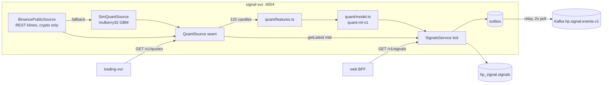
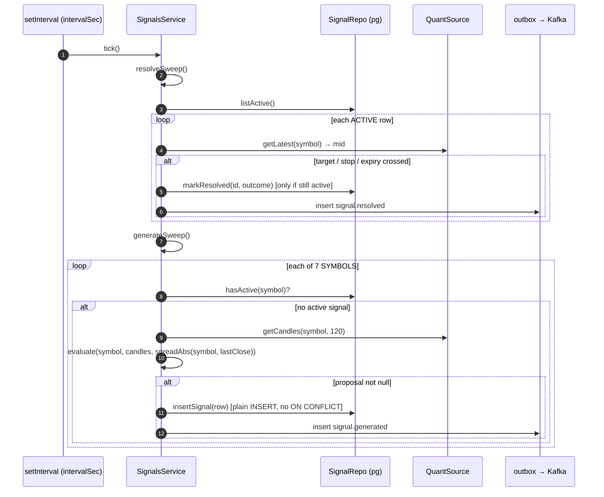
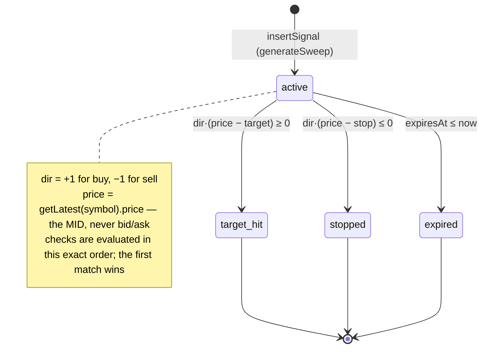

# signal-svc — market feed, quant model, signal lifecycle

This document covers `apps/services/signal` at code level: the market-source
abstraction and how the simulator achieves bit-for-bit determinism, the Binance
REST integration, every function in the feature pipeline with its exact formula
and lookback, the `quant-ml-v1` logistic scorer, how confidence/entry/stop/
target/horizon are derived, the generation tick, the one-active-per-symbol
invariant, and the resolution state machine. It is written for an engineer or
quant who needs to reason about — or reimplement — the model. Tables, indexes
and cross-service sequences are owned elsewhere: see
[data model](../02-data-model.md), [flows](../03-flows.md),
[API reference](../05-api-reference.md).

---

## 1. Responsibility

signal-svc owns two things and nothing else:

1. **Market data for the tradable universe.** It synthesizes (or fetches)
   1-minute OHLCV candles behind a `QuantSource` seam and derives bid/ask from
   mid using fixed per-market spreads.
2. **The signal lifecycle.** A periodic tick resolves finished signals and then
   scores every symbol, emitting at most one ACTIVE signal per symbol.

It runs on port 4004 against database `hp_signal`. Both HTTP endpoints are
**unauthenticated by design** — the service is not internet-reachable and
entitlement gating happens in the Next.js BFF
(`apps/services/signal/src/signals/signals.controller.ts:11`,
`apps/services/signal/src/market/market.controller.ts:7`). CORS is deliberately
off (`src/main.ts:18`). It publishes `signal.generated` / `signal.resolved`
onto `hp.signal.events.v1` through an outbox relay, and consumes no Kafka topic
at all.

Two consumers exist in practice: the web BFF (signals list) and trading-svc,
which polls `GET /v1/quotes` for execution and mark-to-market pricing — see
[trading](./trading.md).



---

## 2. Module map

| File | Role |
|---|---|
| `src/main.ts` | Bootstrap: `migrate(pool)` at `:13` before the listener opens; global `ApiExceptionFilter` `:19`; shutdown hooks `:20`; listens on `PORT ?? 4004` at `0.0.0.0` `:22-23`. |
| `src/app.module.ts` | `loadConfig()` runs at module load `:21`. `buildSource()` `:23-28` always constructs `SimQuantSource(config.simSeed)` and wraps it in `BinancePublicSource` only when `SOURCE=binance`. Providers `:32-38`. `HealthController` `:13-19`. |
| `src/common/config.ts` | `loadConfig` `:14-23` — the only env parsing in the service. |
| `src/common/errors.ts` | `ApiHttpError` / `apiError` / `ApiExceptionFilter`. 404 becomes `{error_code:"internal", message:"Not found."}` `:45-47`; unknown throwables are logged and become 500 `internal` `:52-53`. |
| `src/market/source.ts` | The seam: `Candle` `:4-11`, `LatestTick` `:13-16`, `QuantSource` `:23-30`, DI token `QUANT_SOURCE` `:32`. |
| `src/market/sim.source.ts` | Deterministic zero-drift GBM feed. |
| `src/market/binance.source.ts` | Public REST klines for crypto, warn-once fallback to sim. |
| `src/market/quotes.ts` | `SPREAD_BPS` `:5-9`, `spreadAbs` `:12-14`, `quoteFromMid` `:17-21`. |
| `src/market/market.controller.ts` | `GET /v1/quotes`. |
| `src/quant/features.ts` | The pure feature pipeline. |
| `src/quant/model.ts` | `quant-ml-v1`. |
| `src/signals/signals.service.ts` | The tick loop, generation sweep, resolution sweep, list projection. |
| `src/signals/signals.repo.ts` | `SignalRepo` DI seam `:28-36` + Drizzle implementation `:42-104`. |
| `src/signals/signals.controller.ts` | `GET /v1/signals`. |
| `src/db/{client,schema,migrate}.ts` | pg pool (`max: 10`, `client.ts:10`), Drizzle tables, bootstrap DDL. |
| `src/outbox/{outbox.service,relay}.ts` | `makeEnvelope` `outbox.service.ts:8-16`; the Kafka relay. |

---

## 3. The market-source abstraction

```ts
// src/market/source.ts:23-30
export interface QuantSource {
  getCandles(symbol: SymbolCode, n: number): Promise<Candle[]>;
  getLatest(symbol: SymbolCode): Promise<LatestTick>;
  dataSource(symbol: SymbolCode): string;
}
```

`dataSource(symbol)` is a **provenance label disclosed verbatim on every signal
row** (`src/signals/signals.service.ts:90`) and surfaced on the wire as
`SignalRes.data_source` (`packages/contracts/src/index.ts:474`). Simulated bars
are never labelled as live. There is exactly one instance of the source per
process, constructed at module import time (`src/app.module.ts:34`).

### 3.1 `SimQuantSource` — how determinism is achieved

The simulator is a per-symbol **zero-drift geometric Brownian motion** walk
driven by a 32-bit PRNG. Candle *i* is a pure function of
`(seed, symbol, i)` — nothing else, including the clock, can change its content.

**Seed flow.** One `SIM_SEED` integer (default 42, `src/common/config.ts:16,20`)
is mixed with the symbol name and becomes a per-symbol generator:

```ts
// src/market/sim.source.ts:105-116
rng: mulberry32((this.seed + fnv1a(symbol)) >>> 0),
candles: [],
last: ANCHOR_PRICES[symbol],
```

`fnv1a` is standard FNV-1a 32-bit — offset basis `0x811c9dc5`, prime
`0x01000193`, `>>> 0` at the end (`src/market/sim.source.ts:36-43`). Adding the
symbol hash to the seed guarantees that two symbols under the same `SIM_SEED`
never share a stream, which is asserted at
`apps/services/signal/test/sim-source.spec.ts:39-45`.

**The PRNG.** `mulberry32` (`src/market/sim.source.ts:24-33`), uniform in
`[0, 1)`:

```ts
let a = seed >>> 0;
return () => {
  a = (a + 0x6d2b79f5) | 0;
  let t = a;
  t = Math.imul(t ^ (t >>> 15), t | 1);
  t ^= t + Math.imul(t ^ (t >>> 7), t | 61);
  return ((t ^ (t >>> 14)) >>> 0) / 4294967296;
};
```

It is a pure counter-based mixer: the state advances by the fixed odd increment
`0x6d2b79f5` and the output is an avalanche of the counter. There is no
rejection sampling and no branch on the drawn value, so **the number of draws
consumed per bar is constant** — the property everything else rests on.

**Normal draws.** `gauss` is Box–Muller, consuming exactly two uniforms
(`src/market/sim.source.ts:46-50`):

$$u = 1 - \mathrm{rng}(),\quad v = \mathrm{rng}(),\quad
N = \sqrt{-2\ln u}\,\cos(2\pi v)$$

`u = 1 − rng()` maps the draw into `(0, 1]` so `log(0)` is unreachable.

**Per-minute volatility.** `MINUTES_PER_YEAR = 365 · 24 · 60 = 525 600`
(`src/market/sim.source.ts:18`):

$$\sigma_{\text{step}} = \frac{\texttt{SYMBOLS[symbol].annual\_vol}}{\sqrt{525600}}$$

(`src/market/sim.source.ts:120`). $\sqrt{525600} = 724.9827584156743$, so
EURUSD (`annual_vol` 0.08) walks at $1.1035\times10^{-4}$ per bar and BTCUSDT
(0.55) at $7.586\times10^{-4}$. `annual_vol` per symbol lives at
`packages/contracts/src/index.ts:392-398`.

**The bar.** `nextCandle` (`src/market/sim.source.ts:118-141`) — exactly **7
PRNG draws** (3 × `gauss` = 6, plus 1 for volume):

| Field | Formula | Line |
|---|---|---|
| `o` | $o = \texttt{last}$ (previous unrounded close) | `:125` |
| `c` | $c = o \cdot e^{\sigma_{\text{step}} N_1}$ | `:126` |
| `h` | $h = \max(o,c)\cdot e^{\,\sigma_{\text{step}}\cdot 0.5\cdot |N_2|}$ | `:127` |
| `l` | $l = \min(o,c)\cdot e^{-\sigma_{\text{step}}\cdot 0.5\cdot |N_3|}$ | `:128` |
| `v` | $v = \operatorname{round}(1000 + \mathrm{rng}()\cdot 9000) \in [1000,10000]$ | `:129` |

Drift is zero: the exponent has no $-\tfrac{1}{2}\sigma^2$ or $\mu$ term.
`state.last = c` is stored **unrounded** (`:130`) while the emitted OHLC is
rounded to `SYMBOLS[symbol].precision` (`:132-140`), so rounding never
accumulates into the walk. The construction $h \ge \max(o,c)$ and
$l \le \min(o,c)$ is structural, not clamped — asserted at
`test/sim-source.spec.ts:47-57`.

**The clock decides only how many bars exist.** `t0` is the wall clock floored
to the minute, captured **once at construction** (`src/market/sim.source.ts:76`).
`series()` materializes `BASE_HISTORY + elapsedMinutes` bars and only ever
appends (`:95-103`), where `BASE_HISTORY = 512` (`:21`). Bar index
`BASE_HISTORY − 1` opens at `t0`; earlier bars extend into the past
(`:121-123`). Advancing the clock five minutes therefore produces exactly five
new bars and leaves every prior bar byte-identical — pinned at
`test/sim-source.spec.ts:59-66`.

**Anchors** (`src/market/sim.source.ts:8-16`): EURUSD 1.085, GBPUSD 1.27,
USDJPY 151.4, XAUUSD 2400, BTCUSDT 118000, ETHUSDT 4100, SOLUSDT 210. The first
bar opens exactly at the anchor.

Label: `SIM_DATA_SOURCE = "institutional-composite-sim"`
(`src/market/sim.source.ts:5`).

**Reproducibility boundary.** Identical seed ⇒ identical candles ⇒ identical
signals, *within a process*. Across restarts, `t0` re-anchors to the new wall
clock, so a restart at a different minute shifts which bar index is "now" and
the emitted signals differ. Same-seed reproducibility is asserted at
`test/signals.service.spec.ts:90-99` using a pinned clock.

### 3.2 `BinancePublicSource` — REST only

There is **no WebSocket anywhere in this service** and **no quote cache in this
service**. Both facts are load-bearing when reasoning about load.

- Base URL `https://api.binance.com` (`src/market/binance.source.ts:24`);
  `fetchFn` is injectable for tests (`:23`).
- Non-crypto symbols short-circuit to the sim with **no network call at all**
  (`:32` for candles, `:59` for latest) — fx and metals are always simulated,
  even in `SOURCE=binance`.
- Request: `GET {base}/api/v3/klines?symbol={SYM}&interval=1m&limit={n}` (`:34`).
  A non-`ok` response throws `klines HTTP {status}` (`:36`). Rows are mapped
  positionally from the Binance array shape
  `[openTime, o, h, l, c, v]` (`:39-46`).
- On success the symbol is added to `live` (`:38`); on any failure it is removed
  (`:48`), a warning is logged **once per symbol** (`:49-53`), and sim candles
  are returned (`:54`).
- `dataSource(symbol)` returns `"binance-public"` (`:6`) only while the symbol
  is in `live`, otherwise it delegates to the sim label (`:27-29`).
- `getLatest` is implemented as `getCandles(symbol, 1)` (`:60`) — a **second
  REST round-trip per symbol**, not a reuse of the candle fetch.

There is no timeout, no `AbortController`, no backoff and no circuit breaker on
the fetch, and no Binance request-weight accounting.

### 3.3 Quotes

```ts
// src/market/quotes.ts:5-21
export const SPREAD_BPS: Record<string, number> = { fx: 0.6, metal: 1.2, crypto: 2.0 };
export function spreadAbs(symbol, mid) { return (mid * SPREAD_BPS[SYMBOLS[symbol].market]) / 10_000; }
export function quoteFromMid(symbol, mid, ts) {
  const half = spreadAbs(symbol, mid) / 2;
  const p = SYMBOLS[symbol].precision;
  return { symbol, bid: roundTo(mid - half, p), ask: roundTo(mid + half, p), ts };
}
```

$$\text{spread} = \frac{\text{mid}\cdot \text{bps}}{10000},\qquad
\text{bid} = \text{mid} - \tfrac{\text{spread}}{2},\qquad
\text{ask} = \text{mid} + \tfrac{\text{spread}}{2}$$

both rounded to the symbol's precision. Worked values pinned at
`test/quotes.spec.ts:17-33`: EURUSD mid 1.085 ⇒ 1.08497 / 1.08503; XAUUSD 2400 ⇒
2399.86 / 2400.14; BTCUSDT 118000 ⇒ 117988.2 / 118011.8.

`GET /v1/quotes` recomputes from `getLatest` on **every request, per symbol**
(`src/market/market.controller.ts:26-27`). The five-second cache that people
expect lives in trading-svc, not here — see
[trading](./trading.md#43-quote-provider).

---

## 4. Feature pipeline — `src/quant/features.ts`

Every function is pure, deterministic and total (no throws); degenerate inputs
return a documented neutral value. The model always calls them with the last
`LOOKBACK = 120` candles (`src/signals/signals.service.ts:26`), so
`closes.length = 120` and `returns.length = 119`.

| Function | Formula | Window actually used | Degenerate case | Line |
|---|---|---|---|---|
| `roundTo(x, dp)` | $\operatorname{round}(x\cdot 10^{dp})/10^{dp}$ | — | — | `:9-12` |
| `clamp(x, lo, hi)` | $\min(hi, \max(lo, x))$ | — | — | `:14-16` |
| `logReturns(closes)` | $r_i = \ln(c_i / c_{i-1})$ | all closes ⇒ `n − 1` values (119) | `[]` for a single close | `:19-25` |
| `ewmaVol(returns, λ=0.94)` | $\sigma^2_0 = r_0^2;\ \sigma^2_t = \lambda\sigma^2_{t-1} + (1-\lambda) r_t^2;\ \text{return } \sqrt{\sigma^2_{\text{last}}}$ | all returns | `0` on empty | `:32-39` |
| `zScore(prices, λ=0.97)` | $m_0 = p_0,\ v_0 = 0;\ \mathrm{dev}_t = p_t - m_{t-1};\ v_t = \lambda v_{t-1} + (1-\lambda)\mathrm{dev}_t^2;\ m_t = \lambda m_{t-1} + (1-\lambda)p_t;\ z = (p_{\text{last}} - m)/\sqrt{v}$ | **all 120 closes** | `0` when $\sqrt{v} = 0$ | `:47-58` |
| `rsi14(closes, period=14)` | seed $\overline{G},\overline{L}$ = simple mean of the first 14 gains/losses, then Wilder $\mathrm{avg}_t = (\mathrm{avg}_{t-1}\cdot 13 + x_t)/14$; $\mathrm{RSI} = 100 - \dfrac{100}{1 + \overline{G}/\overline{L}}$ | all closes | `50` when fewer than 15 closes; `100` when $\overline{L} = 0$ | `:66-85` |
| `ema(values, n)` | $k = 2/(n+1)$, $e_0 = v_0$, $e_i = v_i k + e_{i-1}(1-k)$ | the **entire** array, not a trailing window | `0` on empty | `:88-96` |
| `momentum(closes, atr)` | $(\mathrm{EMA}_{10} - \mathrm{EMA}_{30}) / \mathrm{ATR}_{14}$ — trend strength in ATR units | all closes | `0` when `atr ≤ 0` | `:102-105` |
| `atr14(candles, period=14)` | $\mathrm{TR}_i = \max(h_i - l_i,\ |h_i - c_{i-1}|,\ |l_i - c_{i-1}|)$; seed = mean of the first 14 TRs, then Wilder recursion | all candles ⇒ 119 TRs | simple TR mean when fewer than 14 TRs; `0` when fewer than 2 candles | `:113-127` |
| `regimeRatio(returns, 20, 60)` | $\mathrm{rv}(w) = \sqrt{\tfrac{1}{|w|}\sum_{r\in w} r^2}$; ratio $= \mathrm{rv}(\text{last }20)\,/\,\mathrm{rv}(\text{last }60)$ | **tail** windows of 20 and 60 returns | `1` when fewer than 60 returns, or when the long-window rv is 0 | `:134-141` |

Notes a reimplementer must not miss:

- `zScore` and `ema` iterate the **whole** array. They are not windowed
  estimators; the λ / k factor is the only decay. Feeding a different lookback
  than 120 changes their output.
- `rsi14`'s seed loop runs `i = 1..period` inclusive and counts `d >= 0` as a
  gain, so a flat step contributes 0 to gains and nothing to losses.
- `atr14` computes TRs from index 1, so 120 candles give 119 TRs, well above the
  14 needed for the Wilder branch.
- `regimeRatio` uses zero-mean realized vol, not a sample standard deviation.
- **`ewmaVol` is dead in production.** It is exported and unit-tested but never
  imported by the model (`src/quant/model.ts:3` imports
  `atr14, clamp, logReturns, momentum, regimeRatio, roundTo, rsi14, zScore` —
  not `ewmaVol`).

Hand-computed fixtures pinning these (`apps/services/signal/test/features.spec.ts`):
`ewmaVol([0.01,−0.02,0.015]) ≈ 0.01115437134042076` (`:41`);
`zScore([100,101,102,101,103,104,102,105]) ≈ 3.659417190221466` (`:52`);
Wilder's classic RSI series ⇒ `70.46413502109705` after 15 closes (`:68`) and
`57.91502067008556` over the full sequence (`:72`);
`ema(1..10, 10) = 6.239368480121215`, `ema(1..10, 30) = 3.455999347184394`
(`:85-86`); `momentum(1..10, 2) = 1.3916845664684103` (`:90`);
`atr14 = 3.2653061224489797` with the short-input fallback `3.0` (`:108,112`).

---

## 5. `quant-ml-v1` — the scorer

`src/quant/model.ts`. `MODEL_VERSION = "quant-ml-v1"` (`:5`), written to every
row and disclosed as `SignalRes.model_version`.

### 5.1 Constants

```ts
// src/quant/model.ts:22-33
export const WEIGHTS = { momentum: 1.1, zScore: -0.55, rsi: -0.9, regime: -0.35 } as const;
export const MIN_CONFIDENCE = 0.1;
export const EDGE_ATR_FACTOR = 0.8;
export const SPREAD_EDGE_MULT = 2;
export const STOP_ATR_MULT = 1.2;
export const TARGET_ATR_MULT = 1.8; // R = 1.8 / 1.2 = 1.5
```

### 5.2 Preconditions

`evaluate(symbol, candles, spread)` returns `null` — no signal — when:

- `candles.length < 61` (`:51`), so the 60-return regime window is always full;
- `atr14(candles) <= 0` (`:56-57`), a flat market.

### 5.3 Inputs

| Model input | Source | Transform | Line |
|---|---|---|---|
| `mom` | `momentum(closes, atr)` | none | `:59` |
| `z` | `zScore(closes)` | none | `:60` |
| `rsiFeature` | `rsi14(closes)` | $\begin{cases}(\mathrm{rsi}-50)/50 & |\mathrm{rsi}-50| > 20\\ 0 & \text{otherwise}\end{cases}$ | `:61,64` |
| `regimeFeature` | `regimeRatio(returns)` | $\operatorname{clamp}(\text{regime} - 1,\ 0,\ 1.5)$ | `:62,65` |

The RSI transform has a **dead zone over `rsi ∈ [30, 70]`** — inside it the RSI
term contributes exactly zero, so the feature only fires on genuine extremes and
saturates at ±1 at RSI 0/100. `regimeFeature` is one-sided: contracting
volatility (`regime < 1`) clamps to 0, so the term can only ever *penalise*.

### 5.4 Score, probability, side, confidence

```ts
// src/quant/model.ts:86-89
const score = contributions.reduce((a, c) => a + c.w, 0);
const p = 1 / (1 + Math.exp(-score));
const side: "buy" | "sell" = p > 0.5 ? "buy" : "sell";
const confidence = Math.abs(2 * p - 1);
```

$$
\begin{aligned}
s &= 1.10\,\mathrm{mom} \;-\; 0.55\,z \;-\; 0.90\,\mathrm{rsiFeature} \;-\; 0.35\,\mathrm{regimeFeature}\\
p &= \sigma(s) = \frac{1}{1 + e^{-s}}\\
\text{side} &= \begin{cases}\texttt{buy} & p > 0.5\\ \texttt{sell} & p \le 0.5\end{cases}\\
\text{confidence} &= |2p - 1| \;=\; \left|\tanh\!\left(\tfrac{s}{2}\right)\right| \in [0,1)
\end{aligned}
$$

Confidence is a symmetric distance from the coin flip, so a strong *sell*
(`p = 0.1`) and a strong *buy* (`p = 0.9`) both score 0.8. It is rounded to 4 dp
on output (`:109`) and the contract constrains it to `[0, 1]`
(`packages/contracts/src/index.ts:467`).

Sign intuition: momentum is the only trend-following term; z-score and RSI are
mean-reversion terms that fade the move; the regime term is a pure dampener that
pushes the score toward `sell` when volatility is expanding — an asymmetry worth
knowing about, since an expanding-vol regime biases the model short rather than
suppressing it.

### 5.5 The emission gate

Both conditions must pass or `evaluate` returns `null`:

```ts
// src/quant/model.ts:92-94
if (confidence < MIN_CONFIDENCE) return null;
const edge = confidence * atr * EDGE_ATR_FACTOR;
if (edge <= SPREAD_EDGE_MULT * spread) return null;
```

1. **Conviction:** $\text{confidence} \ge 0.10$.
2. **Spread-adjusted expectancy:**
   $\text{edge} = \text{confidence}\cdot \mathrm{ATR}_{14}\cdot 0.8 > 2\cdot\text{spread}$.
   The comparison is **strict** — exact equality rejects. `spread` is the
   absolute full spread passed in by the caller
   (`src/signals/signals.service.ts:75` supplies `spreadAbs(symbol, mid)`).

Gate 2 is why 1-minute fx signals are rare: fx ATR over a minute is tiny
relative to a 0.6 bps spread. `test/model.spec.ts:60-67` proves the gate in
isolation — seed 7 GBPUSD is `null` with the real spread and non-`null` with
`spread = 0`. `test/model.spec.ts:54-58` proves gate 1 with seed 42 SOLUSDT
(confidence ≈ 0.08).

### 5.6 Levels and horizon

```ts
// src/quant/model.ts:96-113
const precision = SYMBOLS[symbol].precision;
const entry = closes[closes.length - 1];
const dir = side === "buy" ? 1 : -1;
...
  confidence: roundTo(confidence, 4),
  entry: roundTo(entry, precision),
  stop: roundTo(entry - dir * STOP_ATR_MULT * atr, precision),
  target: roundTo(entry + dir * TARGET_ATR_MULT * atr, precision),
  horizon_min: clamp(Math.round(90 * regime), 30, 240),
```

$$
\text{entry} = c_{\text{last}},\qquad
\text{stop} = \text{entry} - d\cdot 1.2\,\mathrm{ATR}_{14},\qquad
\text{target} = \text{entry} + d\cdot 1.8\,\mathrm{ATR}_{14},\qquad d = \pm 1
$$

so the reward:risk ratio is a fixed
$R = 1.8 / 1.2 = 1.5$ for both directions, independent of confidence
(`test/model.spec.ts:49` asserts `(target − entry)/(entry − stop) ≈ 1.5`).
Confidence affects **whether** a signal is emitted, never how far the levels
sit.

$$\text{horizon\_min} = \operatorname{clamp}(\operatorname{round}(90 \cdot \text{regime}),\ 30,\ 240)$$

Note this uses the **raw** `regimeRatio`, not the clamped `regimeFeature`: a
quiet regime (ratio 0.5) gives a 45-minute horizon, a neutral regime 90 minutes,
and anything above ratio 2.67 saturates at 240.

`entry` is the last **close**, i.e. a mid price, not a tradable one — trading-svc
fills at ask/bid, so the published entry is never exactly executable.

### 5.7 Rationale string

The four contributions are pre-built with human text (`:67-84`), then sorted by
`|w·f|` descending, the **top two** are taken, and their texts joined with
`"; "` (`:100-105`). `fmtSigned` formats to 2 dp with an explicit `+` for
non-negatives (`:119-122`). Because contributions are sorted by weighted
magnitude, the rationale names the terms that actually moved the score.

Full deterministic snapshot, seed 42 / USDJPY (`test/model.spec.ts:21-30`):

```
side: "sell", confidence: 0.7967, entry: 151.372, stop: 151.408,
target: 151.318, horizon_min: 101,
rationale: "momentum -2.56 below trend; z-score -1.23 vs EWMA mean"
```

---

## 6. The generation tick

`src/signals/signals.service.ts`.

**Scheduling** (`:42-51`): if `intervalSec <= 0` the loop never starts (the test
configuration). Otherwise `setInterval(run, intervalSec * 1000)` is installed and
`run()` fires **immediately** at boot, so a fresh process emits its first sweep
without waiting a minute. `tick()` failures are swallowed into a
`logger.warn` (`:45-47`). `onApplicationShutdown` clears the timer (`:53-56`).

**Order** (`:59-62`): `resolveSweep()` then `generateSweep()`. Resolve-first is
deliberate: a symbol whose signal resolves this tick is free to regenerate in the
same tick.



**`generateSweep()`** (`:68-101`), per symbol in `Object.keys(SYMBOLS)` order:

1. `hasActive(symbol)` ⇒ `continue` (`:70`).
2. `getCandles(symbol, LOOKBACK=120)`; empty ⇒ `continue` (`:72-73`).
3. `mid = candles[last].c` (`:74`).
4. `evaluate(symbol, candles, spreadAbs(symbol, mid))`; `null` ⇒ `continue`
   (`:75-76`).
5. Build the row (`:78-94`): fresh `randomUUID()`, `dataSource` read from the
   source **at that instant** (`:90`), `status: "active"`,
   `generatedAt = this.now()`, and
   `expiresAt = generatedAt + horizon_min · 60_000` (`:93`).
6. `insertSignal` (`:95`), then `insertOutbox(TOPICS.signalEvents,
   makeEnvelope(SIGNAL_EVENTS.generated, toRes(row)))` (`:96-99`).

`now` is an injectable field (`:34`) so tests can pin timestamps and expiry.

A single `try/catch` wraps the whole tick, so **one throwing symbol aborts the
rest of that sweep**; the next tick starts over.

### 6.1 The one-active-per-symbol invariant

The invariant is implemented as **read-then-insert**, with a partial unique index
as the storage-level backstop:

```sql
-- src/db/migrate.ts:25-26
-- The one-active-per-symbol invariant, enforced at the storage layer.
CREATE UNIQUE INDEX IF NOT EXISTS signals_one_active_per_symbol_uq
  ON signals (symbol) WHERE status = 'active';
```

- The read is `hasActive` — `SELECT id … WHERE symbol = $1 AND status = 'active'
  LIMIT 1` (`src/signals/signals.repo.ts:64-71`).
- The write is a **plain INSERT with no `onConflict` clause**
  (`src/signals/signals.repo.ts:45-62`).

Single-replica this is airtight, because the sweep is sequential and
single-threaded. **On a race** — two signal-svc replicas ticking concurrently, or
one process's tick overlapping the next because a sweep ran longer than
`intervalSec` — both can observe `hasActive === false` for the same symbol, both
call `insertSignal`, and the second INSERT violates
`signals_one_active_per_symbol_uq`. The resulting `pg` error propagates out of
`generateSweep`, is caught by the tick wrapper (`:45-47`), and is logged as
`tick failed: …`. The consequence is that **the whole remaining sweep is
abandoned for that tick** — symbols later in the iteration order are silently
skipped. The row is not lost (the first writer's row is committed) and no
duplicate is created; the cost is one degraded tick. There is no
`ON CONFLICT DO NOTHING`, no retry, and no per-symbol error isolation.

The in-memory test repo deliberately mirrors the index by throwing on a duplicate
active symbol (`apps/services/signal/test/mem-repo.ts:14-20`), and the invariant
is exercised over ten simulated minutes at
`test/signals.service.spec.ts:101-118`.

### 6.2 The resolution FSM



`resolveSweep()` (`src/signals/signals.service.ts:107-125`), per ACTIVE row:

```ts
const { price } = await this.source.getLatest(row.symbol);   // :110
const dir = row.side === "buy" ? 1 : -1;                     // :111
let outcome = null;                                          // :113
if (dir * (price - row.target) >= 0) outcome = "target_hit";       // :114
else if (dir * (price - row.stop) <= 0) outcome = "stopped";       // :115
else if (row.expiresAt.getTime() <= this.now().getTime()) outcome = "expired"; // :116
if (!outcome) continue;                                      // :117
await this.repo.markResolved(row.id, outcome);               // :119
await this.repo.insertOutbox(TOPICS.signalEvents,            // :120-123
  makeEnvelope(SIGNAL_EVENTS.resolved, { ...toRes({ ...row, status: outcome }), outcome }));
```

Properties that matter:

- **`target_hit` beats `stopped`.** If a single tick's mid has crossed both
  levels (a gap, or a 60-second window that traversed the whole range),
  resolution is optimistic. It also uses `>=` / `<=`, so touching a level counts
  as crossing it.
- **Mid, not bid/ask.** Resolution never accounts for the spread that the
  emission gate was so careful about.
- **Expiry is checked last**, so a signal that crossed a level in its final
  minute resolves as `target_hit`/`stopped`, not `expired`.
- **`markResolved` is conditional** — `UPDATE … WHERE id = $1 AND status =
  'active'` (`src/signals/signals.repo.ts:94-99`) — so a lost double-resolve race
  is a silent no-op on the row. The outbox insert on `:120` runs
  **unconditionally**, so a duplicate `signal.resolved` event is possible.
- Terminal states are absorbing: only ACTIVE rows are listed for resolution
  (`listActive`, `src/signals/signals.repo.ts:73-76`), and nothing ever
  transitions a resolved row back.

### 6.3 Read path

`GET /v1/signals?status=&limit=` (`src/signals/signals.controller.ts:17-28`).
`status` ∈ `active | resolved | all`, default `active`; anything else is 422
`validation_failed` (`:7,19-22`). `limit` defaults to 50 and must be an integer
in `[1, 200]` (`:8-9,23-26`). The repo maps `active → eq('active')`,
`resolved → ne('active')`, `all → sql\`true\``, ordered
`generated_at DESC` with the limit applied
(`src/signals/signals.repo.ts:78-92`). `toRes` projects the 14-field `SignalRes`
wire shape (`src/signals/signals.service.ts:133-150`;
contract `packages/contracts/src/index.ts:463-479`).

---

## 7. Data

Full schema documentation lives in [data model](../02-data-model.md). What
matters here:

`signals` (`src/db/migrate.ts:7-23`, Drizzle mirror `src/db/schema.ts:16-32`)
carries CHECK constraints for `side ∈ (buy, sell)`, `confidence ∈ [0, 1]`,
`horizon_min > 0`, and
`status ∈ (active, expired, target_hit, stopped)` — the FSM's alphabet is
enforced by the database. Two indexes:

| Index | Definition | Why | Line |
|---|---|---|---|
| `signals_generated_at_idx` | `(generated_at DESC)` | backs the list ordering in `signals.repo.ts:89` | `migrate.ts:24` |
| `signals_one_active_per_symbol_uq` | `UNIQUE (symbol) WHERE status = 'active'` | the storage-level one-active invariant | `migrate.ts:26` |

`outbox` (`migrate.ts:28-34`) has `outbox_unsent_idx (created_at) WHERE sent_at
IS NULL` (`:35`), which matches the relay's predicate exactly
(`src/outbox/relay.ts:65-67`).

`signals.tenant_id text NOT NULL DEFAULT 'heropips'`
(`src/db/migrate.ts:9`, `src/db/schema.ts:18`) exists in the schema but is never
written by application code — multi-tenancy is not wired.

**Transaction boundaries: there are none.** `SignalRepo` exposes no `tx()` seam
(`src/signals/signals.repo.ts:28-36`). `insertSignal` and `insertOutbox` are two
independent autocommit statements (`signals.service.ts:95-99`), as are
`markResolved` and its event (`:119-123`). This is the documented divergence
from the platform's transactional-outbox pattern; trading-svc does it correctly
(see [trading](./trading.md#9-data)).

---

## 8. Events

Produced on `hp.signal.events.v1` (`TOPICS.signalEvents`,
`packages/contracts/src/index.ts:249`). Envelope shape is the platform
`EventEnvelope`: `{event_id, type, occurred_at, tenant_id: "heropips", payload}`
built by `makeEnvelope` (`src/outbox/outbox.service.ts:8-16`).

| `type` | Payload | Emitted at |
|---|---|---|
| `signal.generated` | the full `SignalRes` | `src/signals/signals.service.ts:96-99` |
| `signal.resolved` | `SignalRes` with `status` set to the outcome, **plus a duplicate `outcome` field** | `src/signals/signals.service.ts:120-123` |

**Consumed: nothing.** There is no Kafka consumer in this service. Downstream,
growth-svc subscribes and aggregates weekly generated / target_hit / stopped
counts.

**Relay** (`src/outbox/relay.ts`): `clientId: "hp-signal"` (`:27`), brokers from
`KAFKA_BROKERS` CSV, default `localhost:9092` (`:28-31`), kafkajs retry
`{retries: 1, initialRetryTime: 300}` (`:33`). Loop: poll every 2 s (`:7`),
select up to 100 unsent rows ordered by `created_at` (`:62-67`), lazily create an
**idempotent producer with `maxInFlightRequests: 1`** (`:71`), group by topic,
`send` with `key = outbox.id` (`:86-89`), then stamp `sent_at` (`:90-93`).
Delivery is **send-then-mark**, so a crash in between redelivers — at-least-once,
mitigated but not eliminated by the idempotent producer. Any error resets
`connected` and the loop retries forever, warning at most once per 30 s
(`:95-103`).

---

## 9. Configuration

| Var | Read at | Default | Notes |
|---|---|---|---|
| `SOURCE` | `src/common/config.ts:15` | `sim` | `binance` only on an exact trimmed match; anything else is `sim` |
| `SIM_SEED` | `src/common/config.ts:16,20` | `42` | `parseInt`; non-finite falls back to 42 |
| `SIGNAL_INTERVAL_SEC` | `src/common/config.ts:17,21` | `60` | must be finite and `>= 0`; **`0` disables the tick loop** |
| `PORT` | `src/main.ts:22` | `4004` | |
| `DATABASE_URL_SIGNAL` → `DATABASE_URL` | `src/db/client.ts:5-8` | `postgres://hp:hp@localhost:5432/hp_signal` | pool `max: 10` (`:10`) |
| `KAFKA_BROKERS` | `src/outbox/relay.ts:28` | `localhost:9092` | CSV, trimmed, empties dropped |

Compose sets `PORT=4004`, `SOURCE=${SIGNAL_SOURCE:-sim}`, `SIM_SEED=${SIM_SEED:-42}`,
`SIGNAL_INTERVAL_SEC=${SIGNAL_INTERVAL_SEC:-60}`
(`infra/compose/docker-compose.yml:237-242`). Container topology and env files
are documented in [infrastructure](../07-infrastructure.md).

---

## 10. Testing

Vitest, node environment, `@swc/core` for decorator support. No test touches the
network or a database; the `QuantSource` and `SignalRepo` seams carry the whole
suite.

| Spec | What it locks down |
|---|---|
| `test/features.spec.ts` | Hand-computed values for every feature function plus degenerate cases (see §4). |
| `test/sim-source.spec.ts` | PRNG determinism and range `:7-17`; FNV distinctness `:19-22`; honest labelling `:26-29`; identical candles for identical seeds `:32-37`; divergence across seeds **and** symbols `:39-45`; first bar at the anchor with sane OHLC `:47-57`; the append-only clock property `:59-66`. |
| `test/model.spec.ts` | Full-output snapshot for seed 42 / USDJPY `:14-31`; determinism `:33-38`; buy geometry with `R ≈ 1.5` and the horizon clamp `:40-52`; confidence gate `:54-58`; **spread gate proven in isolation** `:60-67`; `ATR = 0` and short-history nulls `:69-`. |
| `test/quotes.spec.ts` | Spread bps table `:5-9`, absolute spreads `:11-15`, exact rounded quotes `:17-33`, `bid < mid < ask` `:35-39`. |
| `test/binance-source.spec.ts` | Kline parsing, live label and the exact URL `:8-25`; fallback labels sim and warns once `:27-40`; non-crypto never calls `fetch` `:42-49`. `fetch` is injected — the suite never leaves the machine. |
| `test/signals.service.spec.ts` | Disclosure invariants on every generated row and one outbox event per row `:66-88`; same-seed reproducibility `:90-99`; the one-active invariant across ten simulated minutes `:101-118`; the full resolution matrix — buy target/stop, sell mirror, expiry with price in range, and the stay-active case `:122-172`; list filtering and `SignalRes` serialization `:175-193`. |
| `test/mem-repo.ts` | In-memory `SignalRepo` that **throws on a duplicate active symbol** `:14-20`, deliberately mirroring `signals_one_active_per_symbol_uq`. |

The model snapshot at `test/model.spec.ts:21-30` is the tripwire: any drift in
the PRNG, the feature pipeline or the weights changes those six numbers, so a
change must be deliberate.

---

## 11. Hazards and gaps

Ordered roughly by blast radius.

1. **The outbox is not transactional.** Despite the naming, `insertSignal` /
   `markResolved` and `insertOutbox` are separate autocommit statements
   (`src/signals/signals.service.ts:95-99`, `:119-123`) and `SignalRepo` has no
   `tx()` (`src/signals/signals.repo.ts:28-36`). A crash between them either
   loses the event or leaves state unpublished. This is the one service that
   diverges from the platform pattern.
2. **Duplicate `signal.resolved` is possible.** `markResolved` no-ops when the
   row already moved, but the outbox insert runs unconditionally
   (`signals.service.ts:119-123`). There are no idempotency keys anywhere in this
   service; consumers must dedupe on `event_id`.
3. **The one-active invariant costs a whole tick on a race.** See §6.1: the
   unique-index violation aborts `generateSweep` for every symbol after the
   contended one. Fixing this is a one-line `ON CONFLICT DO NOTHING` plus
   per-symbol error isolation, and until then running more than one replica is
   not safe in the "no degradation" sense.
4. **Resolution is optimistic and mid-based.** `target_hit` is checked before
   `stopped` (`:114-115`) and the price is `getLatest`'s mid, never bid/ask. A
   bar that traversed the whole range books a win.
5. **Published `entry` is not executable.** It is the last close
   (`src/quant/model.ts:97`); trading-svc fills at ask/bid
   (`apps/services/trading/src/exec/exec.service.ts:80`). Any "did the signal
   fill at entry?" analysis will be systematically off by half a spread.
6. **The sim candle array grows without bound.** One bar per elapsed minute per
   symbol, appended forever, never trimmed
   (`src/market/sim.source.ts:99-102`) — roughly 10 080 bars/day across seven
   symbols for the process lifetime. Harmless for days, a slow leak for months,
   and it makes `zScore`/`ema` progressively more expensive because those
   functions iterate the full array they are handed (bounded here only because
   the service always asks for 120).
7. **Signals are reproducible per process, not across restarts.** `t0` is fixed
   at construction (`src/market/sim.source.ts:76`) and the source is built once
   at import (`src/app.module.ts:34`), so restarting at a different wall-clock
   minute re-anchors the 512-bar history.
8. **`ewmaVol` is dead code** — tested but never imported by the model
   (`src/quant/model.ts:3`).
9. **No quote cache here.** Every `GET /v1/quotes` recomputes per symbol
   (`src/market/market.controller.ts:26`); under `SOURCE=binance` that is one
   REST round-trip per crypto symbol per request
   (`src/market/binance.source.ts:58-62`). trading-svc's 5 s cache is the only
   thing keeping this bounded.
10. **No timeout on the Binance fetch.** No `AbortController`, no backoff, no
    circuit breaker (`src/market/binance.source.ts:33-55`). A hung upstream hangs
    the tick, and the tick has no timeout either.
11. **`SPREAD_BPS` has no fallback.** It is keyed by market string with a bare
    lookup (`src/market/quotes.ts:13`); adding a market to `SYMBOLS` without
    adding a bps entry yields `NaN` spreads and `NaN` quotes, silently, and the
    model's gate-2 comparison against `NaN` returns false so signals simply stop.
12. **Both endpoints are unauthenticated** and bound to `0.0.0.0`
    (`src/main.ts:23`). Network policy is the only boundary — see
    [security](../06-security.md).
13. **No rate limiting**, inbound or outbound. No Binance request-weight
    accounting.
14. **`tenant_id` is schema-only** (`src/db/migrate.ts:9`); nothing writes it.
15. **404 maps to `error_code: "internal"`** here (`src/common/errors.ts:45-46`),
    whereas trading-svc maps 404 to `validation_failed`
    (`apps/services/trading/src/common/errors.ts:45-46`). The two services
    disagree; clients that branch on `error_code` must handle both.
16. **`SOURCE=binance` still requires the sim.** It is a decorator over
    `SimQuantSource` (`src/app.module.ts:27`), and fx/metal always come from the
    sim (`src/market/binance.source.ts:32`). "Live mode" is live for three of
    seven symbols at best.
