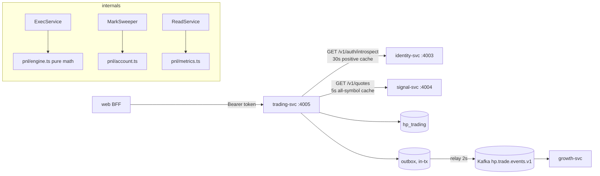
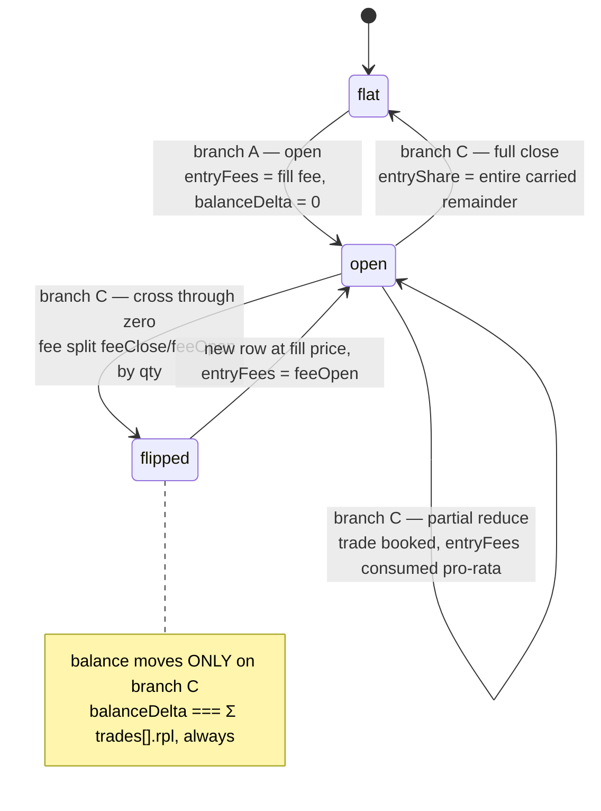

# trading-svc — connections, execution, and the money model

This document covers `apps/services/trading` at code level: bearer-token
introspection against identity-svc and its cache, the AES-256-GCM credential
envelope down to its byte layout, every broker adapter, the order pipeline with
idempotency keys and Trade Guard, the **complete integer-cent accounting model**
(and why it reconciles to zero cents), unrealised versus realised PnL, the
mark-to-market loop with equity snapshots and day-anchor rollover, every
implemented metric with its formula, and exactly what the reconciliation
property test proves. It is written so a quant engineer can follow the execution
path and an accountant can audit the ledger. Tables and indexes are owned by
[data model](../02-data-model.md); cross-service sequences by
[flows](../03-flows.md); the endpoint reference by
[API reference](../05-api-reference.md); the threat model by
[security](../06-security.md).

---

## 1. Responsibility

trading-svc owns everything user-money-shaped:

- broker connections and encrypted credentials at rest;
- the **paper execution engine** — order → guard → fill → position / trade /
  balance;
- the integer-cent PnL accounting model (realised, unrealised, equity, day
  anchors);
- the Trade Guard risk breakers;
- mark-to-market equity snapshots;
- all PnL read models (summary, equity curve, positions, paginated trades).

Port 4005, database `hp_trading`. Every route except `/healthz` requires a
bearer session introspected against identity-svc
(`apps/services/trading/src/auth/introspect.ts:52-63`). Quotes come from
signal-svc (`src/quotes/provider.ts:34-50`) — see [signal](./signal.md).

**v1 execution is entirely internal paper.** Live-key adapters validate
credential *shape* and store the keys encrypted, but never contact a broker:
`src/brokers/adapters.ts:4-6` states it, and all four adapters' `quote()` methods
delegate to the same signal-svc-backed provider. There is no order routing, no
fill simulation against a book, and no broker reconciliation.



---

## 2. Module map

| File | Role |
|---|---|
| `src/main.ts` | `migrate(pool)` at `:13`, global filter `:19`, shutdown hooks `:20`, listens on `PORT ?? 4005` at `0.0.0.0` `:22-23`. CORS off `:18`. |
| `src/app.module.ts` | Singletons at import: `loadConfig()` `:25`, one shared `HttpQuoteProvider` `:26` used by both `QUOTE_PROVIDER` and `BrokerAdapters` `:34-35`, `HttpIntrospector` `:33`, `DrizzleTradingRepo` `:32`, `CLOCK = () => new Date()` `:36`. |
| `src/common/config.ts` | Env parsing and the `CRED_KEY` boot check. |
| `src/common/crypto.ts` | The AES-256-GCM credential envelope. |
| `src/common/errors.ts` | `apiError` `:21-28`; 404 → `validation_failed` `:45-46`; unknown → 500 `internal`, logged, never leaked `:52-53`. |
| `src/auth/introspect.ts` | `Introspector` seam, `HttpIntrospector` cache, `requireUser`. |
| `src/brokers/adapters.ts` | Paper / Binance / KuCoin / MT5 adapters. |
| `src/quotes/provider.ts` | 5-second all-symbol quote cache over signal-svc. |
| `src/connections/*` | Connection CRUD, paper auto-provisioning, package limits. |
| `src/exec/exec.service.ts` | The order pipeline — the only writer of money state. |
| `src/pnl/engine.ts` | Pure money math: rounding, fees, `applyFill`, `sizeByRisk`, Trade Guard. |
| `src/pnl/account.ts` | Marking positions and assembling user equity. |
| `src/pnl/marks.ts` | The periodic mark-to-market sweep. |
| `src/pnl/metrics.ts` | Drawdown, daily returns, Sharpe, win rate, downsampling. |
| `src/pnl/read.service.ts` | Summary / equity curve / positions / trades read models. |
| `src/db/{client,schema,migrate,repo}.ts` | pg pool (`max: 10`), Drizzle tables, bootstrap DDL, the `TradingRepo` seam and its transaction wrapper. |
| `src/outbox/{outbox.service,relay}.ts` | Envelope builder and the Kafka relay (`clientId: "hp-trading"`, `relay.ts:27`). |

---

## 3. Identity introspection

`src/auth/introspect.ts`.

`requireUser(req, introspector)` (`:52-63`) is called at the top of **every**
handler. It requires a header that literally starts with `"Bearer "` and is
longer than 7 characters (`:55`) — otherwise 401 `unauthorized`. It then strips
the prefix (`:58`) and maps a `null` result to 401 `session_expired` (`:59-61`).
Two distinct error codes, so the client can tell "you sent nothing" from "your
session died".

`HttpIntrospector.introspect(token)` (`:23-43`):

| Step | Behaviour | Line |
|---|---|---|
| Cache hit | returns immediately while `expiresAt > now()` | `:24-25` |
| Stale entry | deleted before the refetch | `:26` |
| Upstream call | `fetch("{identityUrl}/v1/auth/introspect", { headers: { authorization: "Bearer <token>" } })` | `:30-32` |
| Network throw | **503 `internal`**, remediation "Retry shortly." | `:33-34` |
| Non-2xx | returns `null`, **not cached** | `:36` |
| Body parse | `SessionUserRes.safeParse`; failure ⇒ `null`, **not cached** | `:38-39` |
| Success | caches `{ user, expiresAt: now() + 30_000 }` keyed by the **raw token string** | `:41` |

`CACHE_TTL_MS = 30_000` (`:12`). Properties worth internalising:

- **Positive-only cache.** Failures are never memoised, so a user who just signed
  in is never locked out by a cached negative — but a brute-force attempt also
  gets full-rate access to identity-svc.
- **Revocation lag is up to 30 seconds.** A session revoked in identity-svc keeps
  working here until the entry expires.
- **The cache never evicts.** It is a plain `Map` keyed by token with no size
  bound and no sweep; an entry is only removed when that exact token is looked up
  again after expiry (`:26`). Distinct tokens accumulate for the process
  lifetime.
- **No timeout, no retry, no `AbortController`** on the fetch (`:30`). A hung
  identity-svc hangs the request.
- The cache is per replica and per process, so it resets on deploy.

Behaviour pinned at `apps/services/trading/test/auth.spec.ts:9-28` (the 401
paths), `:36-52` (one identity call per token inside the TTL, refetch at
TTL + 1 ms), `:54-` (failures are not cached).

---

## 4. Credentials, brokers, quotes

### 4.1 The AES-256-GCM envelope

`src/common/crypto.ts`. `IV_BYTES = 12`, `TAG_BYTES = 16` (`:7-8`).

```ts
// src/common/crypto.ts:10-16
export function encryptJson(value: unknown, keyHex: string): string {
  const key = Buffer.from(keyHex, "hex");
  const iv = randomBytes(IV_BYTES);
  const cipher = createCipheriv("aes-256-gcm", key, iv);
  const ciphertext = Buffer.concat([cipher.update(JSON.stringify(value), "utf8"), cipher.final()]);
  return Buffer.concat([iv, cipher.getAuthTag(), ciphertext]).toString("base64");
}
```

**Byte layout of `connections.cred_cipher`** — a single base64 string decoding to:

```
offset  0 .. 11      12 bytes    random IV, fresh per row (randomBytes)
offset 12 .. 27      16 bytes    GCM authentication tag
offset 28 .. n-1     n-28 bytes  AES-256-GCM ciphertext of JSON.stringify(credentials)
```

GCM is a stream mode, so the ciphertext length equals the plaintext length and
the blob is `ceil((28 + len(json)) / 3) * 4` base64 characters. `decryptJson`
slices exactly those three ranges — `[0, 12)`, `[12, 28)`, `[28, …)` — calls
`setAuthTag`, and `JSON.parse`s the plaintext (`:18-27`). Tampering with any byte
makes `decipher.final()` throw.

Key handling:

- **No key derivation and no salt.** `Buffer.from(keyHex, "hex")` is used
  directly as the 32-byte AES key (`:11`, `:19`). `CRED_KEY` *is* the key.
- **No key id and no version byte** in the blob, so rotating `CRED_KEY` orphans
  every existing `cred_cipher` with no way to tell which key a row used.
- `loadConfig` validates the key at boot: `(env.CRED_KEY ?? DEV_CRED_KEY_HEX)`
  trimmed and lowercased must match `/^[0-9a-f]{64}$/`, otherwise the process
  **throws before listening** (`src/common/config.ts:23-26`).
  `DEV_CRED_KEY_HEX` (`:8-10`) decodes to the ASCII string
  `dev-only-key-do-not-use-in-prod!` — self-documenting, and the preflight gate
  rejects it outside local.
- **`decryptJson` is never called anywhere in `src/`.** Credentials are
  write-only in v1; only `test/connections.spec.ts:60` reads one back. Nothing
  detects a wrong `CRED_KEY` at runtime — a mis-set key silently produces
  undecryptable rows.

### 4.2 Broker adapters

`src/brokers/adapters.ts`. `API_KEY_CHARSET = /^[A-Za-z0-9\-_]+$/` (`:25`).

| Adapter | `kind` | `validate` rules | `quote()` | Broker network I/O | Lines |
|---|---|---|---|---|---|
| `PaperAdapter` | `paper` | always `{ ok: true }` | delegates to `QuoteProvider` | none | `:27-38` |
| `BinanceAdapter` | `binance` | `api_key` and `api_secret` each present, `length >= 16`, charset-matched | delegates | none | `:40-58` |
| `KucoinAdapter` | `kucoin` | Binance rules **plus** `passphrase` present and `length >= 6` | delegates | none | `:60-81` |
| `Mt5Adapter` | `mt5` | `mt5_login` matches `/^\d{4,20}$/`; `mt5_server` trimmed `length >= 3`; `mt5_password` `length >= 6` | delegates | none | `:83-104` |

`BrokerAdapters.for(kind)` is a static `Record<BrokerKind, IBrokerAdapter>`
lookup built once per process (`:106-121`). Validation failures return a
`detail` string that is contractually forbidden from containing credential
material (`:12-13`) and surfaces as the 422 message
(`src/connections/connections.service.ts:105-108`).

`LIVE_PENDING_DETAIL = "Keys stored — live execution rolls out to Founding
members in waves"` (`:22-23`) is written to `connections.status_detail` for every
live connection and echoed as the remediation when an order targets one.

### 4.3 Quote provider

`src/quotes/provider.ts`. `CACHE_TTL_MS = 5_000` (`:11`).

`getQuote(symbol)` refreshes when `now() − fetchedAt >= 5000` (`:24-26`), then
reads the map; a missing symbol is 503 `broker_unavailable` (`:28-30`).
`refresh()` fetches **all** symbols in one call to `{signalUrl}/v1/quotes`
(`:37`); a network error, a non-`ok` response, or a `QuotesRes` parse failure all
become 503 `broker_unavailable` with remediation "Retry shortly."
(`:38-47`). On success the whole map is replaced atomically and `fetchedAt`
stamped (`:48-49`).

The cache is **all-or-nothing** — one `fetchedAt` for every symbol — which is
what makes the N+1 marking in `markPositions` affordable (§7.1). Same caveat as
introspection: no timeout, no retry, no backoff.

### 4.4 Connections

`src/connections/connections.service.ts`.

`ensurePaper(userId)` (`:40-57`) is called at the top of `list` and `create`. If
the user has no `paper`-mode connection it creates exactly one: label
`"Paper account"`, `mode: "paper"`, `status: "active"`, balance
`PAPER_STARTING_BALANCE_USD_MINOR = 1_000_000` cents = $10,000.00
(`packages/contracts/src/index.ts:623`).

Limits (`:19-25`, `:66`): founding users get
`PACKAGES.ltd_founding.limits` = `{ live_connections: 3, paper_accounts: 3,
signals_per_day: 50, guard_rules: 20 }`
(`packages/contracts/src/index.ts:668`); everyone else gets the fail-closed
`NON_FOUNDING_LIMITS` = 0 live, 1 paper. Exceeding either is 409
`connection_limit_reached` (`:71-77`, `:97-103`).

Live creation (`:105-124`): validate through the adapter (422 on failure), then
store `credCipher = encryptJson(req.credentials, this.config.credKeyHex)` with
`mode: "live"`, `status: "pending"`, `statusDetail: LIVE_PENDING_DETAIL`, and
balance 0. `toConnectionRes` (`:145-155`) projects exactly seven fields —
credential material has no path to the wire, asserted at
`test/connections.spec.ts:67-88`.

`remove` (`:128-141`) is idempotent and owner-scoped (an unknown or foreign id is
a silent no-op returning 204), and 409 `order_rejected` when the connection has
open positions.

---

## 5. The order pipeline

`src/exec/exec.service.ts`. `placeOrder` wraps the entire body in one repository
transaction (`:36-38`), and `repo.tx` hands the callback a repo bound to that
transaction handle (`src/db/repo.ts:103-105`). Everything below — the idempotency
read, the position write, the balance update, the trade rows, the order row,
**the outbox inserts**, and the equity snapshot — commits atomically or not at
all.

```mermaid
sequenceDiagram
  autonumber
  participant C as caller (web BFF)
  participant X as ExecService.execute (in repo.tx)
  participant R as TradingRepo (tx-bound)
  participant Q as QuoteProvider (5s cache)
  participant E as pnl/engine.ts (pure)

  C->>X: POST /v1/orders (Bearer, OrderReq)
  X->>R: findOrder(user.id, idempotency_key)
  alt replay exists
    R-->>C: stored OrderRes verbatim
  else fresh
    X->>R: getConnection(id): owner + status checks
    X->>Q: getQuote(symbol)
    Note over X: entry = buy ? ask : bid
    X->>R: listPositionsByConnection, mark, connEquity
    opt risk_pct sizing
      X->>E: sizeByRisk(connEquity, risk_pct, entry, stop, symbol)
    end
    X->>R: getDayAnchor(user, utcDay) or create from pre-order equity
    X->>R: sumRplSince(user, utcMidnight)
    X->>E: evaluateGuards(...)
    opt blocked
      X->>R: insertOrder(blocked_by_guard) + outbox trade.order.blocked
    end
    X->>E: fee = feeUsdMinor(...); applyFill(existing, spec)
    X->>R: upsertPosition or deletePosition
    X->>R: updateConnectionBalance (only when delta != 0)
    loop each closed trade
      X->>R: insertTrade + outbox trade.position.closed
    end
    X->>R: insertOrder(filled) + outbox trade.order.filled
    X->>R: insertSnapshot(user, ts, post-fill equity)
    R-->>C: 200 filled
  end
```

Step by step (`src/exec/exec.service.ts:56-247`):

1. **Idempotency replay** (`:58-59`). `findOrder(user.id, req.idempotency_key)`
   returns the **original `OrderRes` verbatim** — including `rejected` and
   `blocked_by_guard` responses, not just fills. Backed by
   `UNIQUE (user_id, idempotency_key)` (`src/db/migrate.ts:59`). The contract
   requires the key, 8–80 characters
   (`packages/contracts/src/index.ts:543`).
2. **Connection resolve and ownership** (`:61-64`) — unknown or foreign is 404.
   `status !== "active"` is 409 `order_rejected` carrying `statusDetail` as the
   remediation (`:65-72`), which is how a pending live connection is refused.
3. **Symbol check** (`:75-77`) — defence in depth behind the contract enum; 422
   `symbol_unknown`.
4. **Quote and fill price** (`:79-82`):
   `entry = side === "buy" ? quote.ask : quote.bid`. `ts = now.toISOString()`
   from the injected `CLOCK`.
5. **Connection-scope equity** (`:85-89`):
   `connEquity = conn.balanceUsdMinor + Σ upl` over that connection's marked
   positions.
6. **Sizing** (`:91-110`). The contract enforces exactly one of
   `qty | risk_pct` via `.refine`
   (`packages/contracts/src/index.ts:544-546`), and `risk_pct ∈ [0.1, 2]`. With
   `risk_pct`, a `stop` is **mandatory** — otherwise 422 (`:94-96`). If
   `sizeByRisk` returns `<= QTY_EPS` the order is `rejected` with reason
   `quantity_too_small` and **that response is persisted under the idempotency
   key** (`:98-107`).
7. **Day anchor and today's realised PnL** (`:112-120`). `getDayAnchor(user,
   utcDayOf(now))`; when absent, the anchor is written as the **pre-order**
   equity and inserted with `onConflictDoNothing`
   (`src/db/repo.ts:312-317`). `rplToday = sumRplSince(user, utcMidnightIso(now))`.
8. **Trade Guard** (`:122-157`). On a block: persist a `blocked_by_guard`
   response under the idempotency key and emit `trade.order.blocked`.
9. **Fill** (`:159-171`): `fee = feeUsdMinor(qty, price, req.symbol)`, then
   `applyFill(existing, { symbol, side, qty, price, feeUsdMinor: fee, ts,
   signalId: req.signal_id ?? null, newPositionId: randomUUID() })`.
10. **Persist** (`:173-244`): upsert or delete the position; update the balance
    **only when the delta is non-zero** (`:179-181`); insert each closed trade
    with its `trade.position.closed` event (`:183-217`); insert the order row and
    `trade.order.filled` (`:219-240`); recompute the account and append an equity
    snapshot at the fill timestamp (`:243-244`).

`closePosition` (`:41-54`) looks up the position, ownership-checks it (404), and
re-enters `placeOrder` with the inverse side, the full `qty`, and a **freshly
generated key** `close-{positionId}-{uuid}` — so a close is by construction *not*
idempotent; a client retry after a successful close 404s only because the
position no longer exists.

`POST /v1/orders` returns **HTTP 200 for `filled`, `rejected` and
`blocked_by_guard` alike** (`src/exec/exec.controller.ts:15`). Callers must
branch on `OrderRes.status`, never on the status code.

### 5.1 Trade Guard

`evaluateGuards` (`src/pnl/engine.ts:314-341`) is pure and fail-closed, evaluated
in this exact order. Constants at `:40-42`.

**Rule 0 — pure reduces bypass everything** (`:315`). `isPureReduce`
(`:303-307`) is true when an opposite-side position exists and
`qty <= existing.qty + QTY_EPS`. A user can always de-risk or close, whatever
state the account is in.

**Rule 1 — max risk per trade** (`:320-327`), *only evaluated when a `stop` is
present*:

$$
\text{risk} = \operatorname{roundMoney}\!\big(\text{qty}\cdot|\text{entry}-\text{stop}|\cdot\text{contract\_size}\cdot \text{usdPerQuote}(\text{entry})\cdot 100\big)
$$

blocks with `max_risk_per_trade` when
$\text{risk} > \operatorname{roundMoney}(\text{equity}\cdot 0.02)$. The
`usdPerQuote(entry)` factor is what keeps the comparison USD-to-USD; without it
a JPY stop distance would inflate the measured risk about 150×. Exactly 2 %
passes (`test/engine.spec.ts:300`).

**Rule 2 — max open positions** (`:330-332`): blocks with `max_open_positions`
only when there is **no existing position on that symbol** and the connection
already holds `>= 5`. Adding to an existing symbol is always allowed
(`test/engine.spec.ts:303-309`).

**Rule 3 — daily-loss breaker** (`:336-339`), only when `dayStart > 0`:

$$\text{limit} = -\operatorname{roundMoney}(\text{dayStartEquity}\cdot 0.05),\qquad
\text{block iff } \text{rplToday} + \text{uplNow} \le \text{limit}$$

**Scope mixing is deliberate and surprising**: equity, position count and the
risk cap are **per connection** (`src/exec/exec.service.ts:89,124-125`), while
`rplToday`, `uplNow` and the day anchor are **per user** (`:113-120`). A user
with several connections gets a per-connection risk cap but a global loss
breaker.

---

## 6. The accounting model

`src/pnl/engine.ts` is pure: no I/O, no clocks, no randomness. All balances,
fees and realised PnL are **integer USD minor units (cents)**, stored as `bigint`
(`src/db/schema.ts:20,33,47-48,66,74`). Prices and quantities are `double
precision`. Float math happens internally; rounding to cents happens at exactly
three boundaries — notional/fee, unrealised PnL, and realised gross.

### 6.1 Primitives

```ts
// src/pnl/engine.ts:47-55
export function roundMoney(x: number): number {
  const r = Math.round(Math.abs(x));
  return x < 0 ? -r : r;
}
export function roundQty(q: number): number { return Math.round(q * 1e8) / 1e8; }
```

`roundMoney` is **half away from zero**, not JavaScript's default half-up. This
is the reason a long and its mirror short produce equal-and-opposite cents:
`roundMoney(2.5) === 3` and `roundMoney(-2.5) === -3`
(`test/engine.spec.ts:42-43`). Half-up would round −2.5 to −2 and break the
symmetry. `roundQty` kills float residue at 8 dp, well below any symbol's price
step.

**Quote-currency conversion** (`:111-113`):

$$\text{usdPerQuote}(\text{symbol}, \text{price}) =
\begin{cases}1/\text{price} & \texttt{SYMBOLS[symbol].quote === "JPY"}\\ 1 & \text{otherwise}\end{cases}$$

USD and USDT quotes are 1:1. USDJPY is the only JPY-quoted instrument
(`packages/contracts/src/index.ts:394`), and because the pair *is* the USDJPY
rate, 1 JPY = 1/price USD. Critically, **the rate is always taken from the same
price that produced the amount** — the fill price for realised PnL, the mark for
unrealised — so each converted integer is a pure function of one observed price,
and the trade row and the balance mutation share it exactly.

**Notional** (`:120-124`):

$$\text{notional}_{\text{cents}} = \operatorname{roundMoney}\big(100\cdot(\texttt{base\_is\_usd}\ ?\ \text{qty}\cdot\text{contract\_size}\ :\ \text{qty}\cdot\text{price}\cdot\text{contract\_size})\big)$$

For USDJPY `base_is_usd` is true, so `qty × contract_size` is *already* USD and
the price term must be dropped — multiplying by a ~151 JPY price would inflate
the notional ~150×.

**Fee** (`:127-128`), `FEE_BPS = 8` (`:39`):

$$\text{fee} = \max\!\big(1,\ \operatorname{roundMoney}(\text{notional}_{\text{cents}}\cdot 8/10000)\big)$$

A one-cent floor, so dust orders still pay something. Worked:
1 BTC @ 50,000 ⇒ notional 5,000,000¢ ⇒ fee 4,000¢
(`test/engine.spec.ts:53`); 0.001 SOL @ 100 ⇒ notional 10¢ ⇒ 0.008¢ ⇒ floored to
1¢ (`:58`); 0.022 USDJPY lots @ 151.363 ⇒ notional 220,000¢ ⇒ 176¢ (`:64`).

### 6.2 Unrealised PnL

```ts
// src/pnl/engine.ts:132-142
export function markPrice(side, quote) { return side === "long" ? quote.bid : quote.ask; }
export function uplUsdMinor(pos, mark) {
  const dir = pos.side === "long" ? 1 : -1;
  return roundMoney(pos.qty * (mark - pos.avgEntry) * SYMBOLS[pos.symbol].contract_size
    * dir * usdPerQuote(pos.symbol, mark) * 100);
}
```

$$\text{upl} = \operatorname{roundMoney}\big(\text{qty}\cdot(\text{mark}-\text{avgEntry})\cdot\text{contract\_size}\cdot d\cdot \text{usdPerQuote}(\text{mark})\cdot 100\big),\quad d=\pm 1$$

Marking is **conservative**: a long marks at the bid, a short at the ask — the
price at which the position could actually be exited. Unrealised PnL is
therefore always net of the round-trip spread but **never net of fees** — see
§6.4.

JPY regression worth memorising (`test/engine.spec.ts:228-233`): short 0.022 lots
of USDJPY, price moves +0.01 JPY. In quote currency that is
`0.022 × 0.01 × 100,000 × (−1) = −22 JPY`; converted at the mark,
`−22 / 151.373 = −$0.1453…` ⇒ **−15¢**, not −$22.

### 6.3 `applyFill` — the three branches

`applyFill(position, fill)` (`src/pnl/engine.ts:174-276`) is average-cost
accounting on the single position allowed per `(connection, symbol)`. It returns
`{ position, balanceDeltaUsdMinor, trades }`.



**Branch A — open** (`:179-194`), when there is no position or `qty <= QTY_EPS`
(`QTY_EPS = 1e-9`, `:44`):

- new position at the fill price, `side` from the fill direction,
  `qty = roundQty(fill.qty)`, `avgEntry = fill.price`;
- `entryFeesUsdMinor = fill.feeUsdMinor` — **the fee is carried on the position,
  not charged to the balance**;
- `balanceDeltaUsdMinor = 0`, `trades = []`.

**Branch B — same direction (add)** (`:199-212`):

$$\text{newQty} = \operatorname{roundQty}(q + q_f),\qquad
\text{newAvg} = \frac{q\cdot\text{avg} + q_f\cdot p_f}{\text{newQty}}$$

`entryFeesUsdMinor` accumulates (`:207`), `balanceDelta = 0`, no trades.
Verified at `test/engine.spec.ts:158-169` (2 × ETH at 3000 and 3100 ⇒ avg 3050,
carried fees 240 + 248).

**Branch C — opposite direction (reduce, close, or flip)** (`:215-275`):

```ts
const closedQty = Math.min(position.qty, fill.qty);            // :215
const crossing  = fill.qty > position.qty + QTY_EPS;           // :216
const fullClose = fill.qty >= position.qty - QTY_EPS;          // :217

const feeClose = crossing ? roundMoney(fill.feeUsdMinor * (closedQty / fill.qty))
                          : fill.feeUsdMinor;                  // :220-222
const feeOpen  = fill.feeUsdMinor - feeClose;                  // :223

const entryShare = fullClose ? position.entryFeesUsdMinor
                             : roundMoney(position.entryFeesUsdMinor * (closedQty / position.qty)); // :226-228

const gross = roundMoney(closedQty * (fill.price - position.avgEntry)
  * spec.contract_size * posDir * usdPerQuote(fill.symbol, fill.price) * 100);  // :230-237
const rpl = gross - feeClose - entryShare;                     // :238
```

$$
\begin{aligned}
\text{gross} &= \operatorname{roundMoney}\big(q_c\cdot(p_f - \text{avgEntry})\cdot\text{contract\_size}\cdot d_{\text{pos}}\cdot\text{usdPerQuote}(p_f)\cdot 100\big)\\
\text{rpl} &= \text{gross} - \text{feeClose} - \text{entryShare}\\
\text{trade.fees} &= \text{feeClose} + \text{entryShare}\\
\text{balanceDelta} &= \text{rpl}
\end{aligned}
$$

(`trade.fees` at `:248`, `balanceDelta` at `:275`.)

The two fee splits are the subtle part:

- **`feeClose` / `feeOpen`** split *this fill's* fee pro-rata by quantity, but
  only when the fill crosses through zero. A pure reduce charges the whole fill
  fee to the close (`feeClose = fill.feeUsdMinor`, `feeOpen = 0`).
- **`entryShare`** consumes the *carried* entry fees pro-rata by the fraction of
  the position being closed — **except on the final close, where it takes the
  entire remaining balance verbatim** (`:226-227`). This is the anti-leak rule:
  intermediate shares round, the last one absorbs whatever integer remainder is
  left, so the sum of consumed shares is exactly the sum of carried fees. No
  cent is minted and none is lost.

Residual position (`:254-273`):

- partial reduce ⇒ same row, `qty − closedQty`,
  `entryFees − entryShare` (`:256-260`);
- exact/over close with a crossing ⇒ the old row is closed and a **new** position
  opens for `fill.qty − closedQty` at the fill price with
  `entryFees = feeOpen` (`:261-272`);
- exact close without crossing ⇒ `position = null`, and the caller deletes the
  row (`src/exec/exec.service.ts:175-177`).

Worked BTC lifecycle (`test/engine.spec.ts:69-107`), all exact cents:

| Fill | notional¢ | fill fee¢ | entryShare¢ | gross¢ | rpl¢ | balance Δ¢ | carried after¢ |
|---|---|---|---|---|---|---|---|
| buy 1.0 @ 50,000 | 5,000,000 | 4,000 | — | — | — | **0** | 4,000 |
| sell 0.4 @ 51,000 | 2,040,000 | 1,632 | 1,600 | +40,000 | **+36,768** | +36,768 | 2,400 |
| sell 0.6 @ 49,000 | 2,940,000 | 2,352 | **2,400** (exact remainder) | −60,000 | **−64,752** | −64,752 | 0 |

Fee audit for that lifecycle: charged 4,000 + 1,632 + 2,352 = 7,984¢; realised
(1,632 + 1,600) + (2,352 + 2,400) = 7,984¢. Equal, by construction.

Cross-through-zero (`test/engine.spec.ts:138-155`): long 1 @ 50,000 with 4,000¢
carried, sell 1.5 @ 52,000. The fill fee is 8 bps of 7,800,000¢ = 6,240¢, split
2:1 into `feeClose = 4,160` and `feeOpen = 2,080`; `entryShare = 4,000`;
`gross = +200,000`; `rpl = 191,840`; the resulting position is short 0.5 at
52,000 carrying 2,080¢.

JPY realised (`test/engine.spec.ts:235-245`): short 1 USDJPY lot at 152, buy back
at 151. Quote PnL `1 × (151 − 152) × 100,000 × (−1) = +100,000 JPY`; converted at
the **fill** price, `100,000 / 151 = $662.251…` ⇒ gross 66,225¢; fees 8,000¢ each
way ⇒ `rpl = 66,225 − 8,000 − 8,000 = 50,225¢`, and `balanceDelta` is that same
integer.

### 6.4 Why balance only moves on reducing fills — and why that is the whole trick

Branches A and B return `balanceDeltaUsdMinor = 0`. Entry fees ride on
`positions.entry_fees_usd_minor` (`src/db/schema.ts:33`) until a reducing fill
consumes them. The execution layer honours this literally: it calls
`updateConnectionBalance` **only when the delta is non-zero**
(`src/exec/exec.service.ts:179-181`).

The invariant that follows is:

$$\text{balanceDelta of a fill} \;=\; \sum_{t \in \text{trades of that fill}} t.\text{rpl}$$

and, integrated over any sequence of fills,

$$\text{balance} \;=\; \text{balance}_0 + \sum_{\text{all trades}} \text{rpl}$$

with **zero cents of drift**. It holds *because* fees are deferred. Consider the
alternative — charging the fee to the balance at fill time. Then an opening fill
would move the balance by `−fee` while producing no trade row, so
`Σ trade.rpl` would lag the balance by every open position's entry fee, and the
books would only reconcile once every position was flat *and* you separately
tracked a fee ledger. By carrying the fee on the position and folding it into
`rpl` at realisation (`rpl = gross − feeClose − entryShare`), every cent that
ever leaves the balance is attributable to exactly one `trades` row. `trades` is
a complete, gap-free explanation of the balance — that is the auditable property.

The price of this design is stated plainly so nobody is surprised:

**`equity = balance + upl` overstates the account by the total carried entry
fees while positions are open.** This is intended and asserted as such: after
buying 0.1 BTC at 50,000 with a 400¢ fee, the balance is still the full
$10,000.00 and the equity snapshot is `balance − 100¢` (the unrealised mark
loss), *not* `balance − 500¢` (`test/exec.spec.ts:73-77`). Closing the round trip
books the whole `−100 − 400 − 400 = −900¢` at once
(`test/exec.spec.ts:85-98`).

### 6.5 Risk-based sizing

```ts
// src/pnl/engine.ts:154-171
const perUnit = Math.abs(entry - stop) * usdPerQuote(symbol, entry) * spec.contract_size;
if (perUnit <= 0 || equityUsdMinor <= 0) return 0;
const riskUsd = (equityUsdMinor / 100) * (riskPct / 100);
const step = Math.pow(10, -spec.precision);
const steps = Math.floor(riskUsd / perUnit / step + 1e-6);
return roundQty(Math.max(0, steps) * step);
```

$$
\text{perUnit} = |\text{entry}-\text{stop}|\cdot\text{usdPerQuote}(\text{entry})\cdot\text{contract\_size},\qquad
\text{riskUsd} = \frac{\text{equity}_{\text{cents}}}{100}\cdot\frac{\text{pct}}{100}
$$
$$
\text{step} = 10^{-\text{precision}},\qquad
\text{qty} = \Big\lfloor \frac{\text{riskUsd}}{\text{perUnit}\cdot\text{step}} + 10^{-6}\Big\rfloor\cdot\text{step}
$$

It always **floors** to the symbol's price step — never rounds up — so realised
risk is at or below the requested percentage. The `1e-6` nudge (`:166-169`)
absorbs the ~1e-12 absolute float error that `|entry − stop|` carries at 1e4
steps; it cannot jump a step unless the true value sits within a millionth of the
boundary. Returns 0 when the stop equals the entry or equity cannot fund one
step.

Worked (`test/engine.spec.ts:188-205`, `:247-251`): $10,000 equity at 1 % =
$100 risk; EURUSD |1.10 − 1.09| × 100,000 = $1,000/lot ⇒ **0.1**; XAUUSD at 2 %,
|2400 − 2390| × 100 = $1,000/lot ⇒ **0.2**; floor-not-round
(1.10/1.097, $300/unit) ⇒ **0.33333**; USDJPY entry 151.363 stop 151.408 ⇒
per-lot risk `0.045 / 151.363 × 100,000 = $29.7299` ⇒ `100 / 29.7299 = 3.3636…`
⇒ **3.363**.

---

## 7. Marking, snapshots and day anchors

### 7.1 Marking

`markPositions(rows, quotes)` (`src/pnl/account.ts:14-22`) fetches a quote **per
position** and computes `{ row, mark, uplUsdMinor }`. It is N+1 by design and
only affordable because of the provider's 5-second all-symbol cache — the first
call in a burst does one HTTP round trip and the rest are map lookups.

`computeUserAccount(userId, repo, quotes)` (`:33-52`):

$$\text{balance} = \sum_c c.\text{balance},\qquad
\text{upl} = \sum_p \text{upl}(p),\qquad
\text{equity} = \text{balance} + \text{upl}$$

It is called up to three times per order (`src/exec/exec.service.ts:86` via
`markPositions`, `:113`, `:243`).

### 7.2 The mark loop

`MarkSweeper` (`src/pnl/marks.ts`). On bootstrap, if `markIntervalSec > 0` it
installs `setInterval(sweep, markIntervalSec * 1000)` and calls `.unref?.()` on
the timer so it never holds the process open (`:29-38`); failures are logged as
warnings and swallowed (`:32-34`). `onApplicationShutdown` clears it (`:40-43`).

```ts
// src/pnl/marks.ts:45-51
async sweep(nowIso: string = new Date().toISOString()): Promise<void> {
  const userIds = await this.repo.userIdsWithPositions();
  for (const userId of userIds) {
    const account = await computeUserAccount(userId, this.repo, this.quotes);
    await this.repo.insertSnapshot(userId, nowIso, account.equityUsdMinor);
  }
}
```

Only users who **currently hold positions** get a snapshot. A flat user's equity
curve simply has no points between fills, which is what makes `sharpe_30d` sparse
(§8).

### 7.3 Equity snapshots

Two writers, and only two:

| Writer | When | Timestamp | Line |
|---|---|---|---|
| `ExecService` | after **every** fill, inside the order transaction | the fill `ts` | `src/exec/exec.service.ts:243-244` |
| `MarkSweeper` | every `MARK_INTERVAL_SEC`, for users with positions | sweep time | `src/pnl/marks.ts:49` |

`equity_snapshots` has an identity primary key and index `(user_id, ts)`
(`src/db/migrate.ts:62-68`); `listSnapshots` orders by `(ts ASC, id ASC)`
(`src/db/repo.ts:297`) so ties within a millisecond stay in insertion order. An
idempotent replay produces **no second snapshot**, because the replay
short-circuits before any write (`test/exec.spec.ts:184-193`).

### 7.4 Day-anchor rollover

`day_anchors` is `PRIMARY KEY (user_id, day)` where `day` is the UTC calendar day
string `YYYY-MM-DD` (`src/db/migrate.ts:70-75`), produced by
`utcDayOf = d.toISOString().slice(0, 10)` (`src/pnl/account.ts:55-57`).

The anchor is written by the **first order of the UTC day**, using the equity
measured **before** that order executes:

```ts
// src/exec/exec.service.ts:113-119
const account = await computeUserAccount(user.id, ops, this.quotes);
const day = utcDayOf(now);
let dayStart = await ops.getDayAnchor(user.id, day);
if (dayStart === null) {
  dayStart = account.equityUsdMinor;
  await ops.insertDayAnchor(user.id, day, dayStart);
}
```

`insertDayAnchor` is `onConflictDoNothing` (`src/db/repo.ts:312-317`), so
concurrent first-orders cannot fight. Rollover is implicit: at the UTC date
boundary the lookup key changes, no anchor exists, the next order writes a fresh
one from current equity, and the daily-loss breaker resets. `rpl_today` uses the
matching boundary — `sumRplSince(user, utcMidnightIso(now))` where
`utcMidnightIso` is `"YYYY-MM-DDT00:00:00.000Z"`
(`src/pnl/account.ts:60-62`). The breaker tripping and then clearing on the next
UTC day is exercised at `test/exec.spec.ts:167-182`.

Consequence: **the mark sweeper never creates anchors**
(`src/pnl/marks.ts:45-50` inserts snapshots only). A user who places no order on
a given day has no anchor, `dayStart` is 0, and the breaker's
`if (g.dayStartEquityUsdMinor > 0)` guard (`src/pnl/engine.ts:336`) makes it
inert until the first order — which is also the order that establishes the
baseline, so the very first order of a day can never be blocked by the breaker.

---

## 8. Metrics

`src/pnl/metrics.ts` — pure, and the complete list. Everything is computed at
read time; nothing is materialised.

| Metric | Formula | Null / edge behaviour | Line |
|---|---|---|---|
| `maxDrawdownBps(equities)` | running peak $P$; $\mathrm{dd} = \big\lfloor \frac{P - e}{P}\cdot 10000 \big\rfloor$; return the max | 0 for empty and monotone-up curves; only evaluated while `peak > 0` | `:9-20` |
| `dailyReturns(dayCloses)` | $r_i = c_i / c_{i-1} - 1$ | skips any step whose predecessor is `<= 0` | `:23-30` |
| `sharpe(returns)` | one-pass Welford mean and $m_2$; **sample** stdev $\sqrt{m_2/(n-1)}$; return $\frac{\mu}{\sigma}\sqrt{365}$ | `null` when `n < 5` **or** stdev is exactly 0; risk-free rate is 0 | `:36-51` |
| `winRate(rpls)` | $\#\{r > 0\}/n$ | `null` on empty; **break-even counts as a loss** | `:54-59` |
| `downsampleEvenly(series, points)` | index $\operatorname{round}\!\big(\frac{i(n-1)}{\text{cap}-1}\big)$ for $i \in [0, \text{cap})$ | returns a copy when `n <= cap`; `cap = 1` returns only the last point; always keeps first and last | `:65-75` |

**Profit factor is not implemented.** There is no `profitFactor` function in
`src/pnl/metrics.ts`, no gross-win / gross-loss aggregation anywhere in the
service, and no such field on `PnlSummaryRes`
(`packages/contracts/src/index.ts:598-610` — ten fields, none of them profit
factor). Despite appearing in the product brief, it does not exist in the code.
Adding it would mean a `metrics.ts` function plus a contract field plus
`read.service.ts` wiring; it is not hidden somewhere else.

Two quirks: the drawdown uses `Math.floor`, so it under-reports by up to 1 bp
(`[100, 120, 90, 110, 80]` ⇒ 3333 bps, not 3334 —
`test/metrics.spec.ts:5-8`), and it tracks the **running** peak rather than the
global maximum (`[100, 90, 200, 195]` ⇒ 1000 bps —
`test/metrics.spec.ts:15-18`).

### 8.1 Read models

`src/pnl/read.service.ts`. `TRADES_PAGE_SIZE = 50`,
`THIRTY_DAYS_MS = 30 · 86_400_000` (`:15-16`).

`summary` (`:26-60`) assembles `PnlSummaryRes` with **three different windows in
one response** — worth reading carefully:

| Field | Window | Source |
|---|---|---|
| `equity/balance/upl_usd_minor` | live | `computeUserAccount` `:28` |
| `rpl_today_usd_minor` | since UTC midnight | `sumRplSince` `:29` |
| `rpl_total_usd_minor` | lifetime | `sumRplTotal` `:30` |
| `max_drawdown_bps` | **lifetime** — the full snapshot history **plus the live equity point** | `:36-37,54` |
| `sharpe_30d` | last 30 days, one point per UTC day using that day's **last** snapshot | `:40-46,55` |
| `win_rate_30d`, `trades_30d` | trades closed in the last 30 days | `:33,56-57` |

`equityCurve` clamps `points` to `[1, 500]`, default 200 (`:63`) and downsamples
(`:66`). `positions` marks live (`:73-89`). `trades` (`:91-117`) decodes an
opaque `base64url("<closedAt>|<id>")` cursor (`:94-96`) into a keyset predicate
and re-encodes the next one (`:113-115`); the repo fetches `limit + 1` rows
ordered `(closed_at DESC, id DESC)` to detect the next page
(`src/db/repo.ts:221-244`), backed by
`trades_user_closed_idx (user_id, closed_at DESC, id DESC)`
(`src/db/migrate.ts:51`).

---

## 9. Data

Full schema in [data model](../02-data-model.md). Summary of what this service
owns (`src/db/migrate.ts`):

| Table | Purpose | Key constraints / indexes | Line |
|---|---|---|---|
| `connections` | broker connections + `cred_cipher` | `broker ∈ (paper,mt5,binance,kucoin)`, `mode ∈ (paper,live)`, `status ∈ (active,pending,error)`; `connections_user_idx` | `:7-19` |
| `positions` | at most one per `(connection, symbol)` | FK → `connections` **ON DELETE CASCADE**; `positions_connection_symbol_uq (connection_id, symbol)`; `positions_user_idx` | `:21-34` |
| `trades` | one row per **reducing** fill | `side ∈ (long,short)`; `trades_user_closed_idx (user_id, closed_at DESC, id DESC)` | `:36-51` |
| `orders` | the idempotency ledger (`response jsonb`) | `UNIQUE (user_id, idempotency_key)` | `:53-60` |
| `equity_snapshots` | the equity curve | identity PK; `equity_snapshots_user_ts_idx (user_id, ts)` | `:62-68` |
| `day_anchors` | day-start equity for the breaker | `PRIMARY KEY (user_id, day)` | `:70-75` |
| `outbox` | relay queue | `outbox_unsent_idx (created_at) WHERE sent_at IS NULL` | `:77-84` |

Money columns are `bigint` in cents; prices and quantities are `double
precision` (`src/db/schema.ts`).

`upsertPosition` conflicts on `(connection_id, symbol)` and — importantly —
**overwrites `id` in the SET clause** (`src/db/repo.ts:178-189`). A
cross-through-zero fill therefore reuses the row with a new UUID, so any client
holding the old position id must re-read.

**Ledger invariants** (all asserted, see §11):

1. `balanceDelta` of a fill `=== Σ trades[].rpl` of that fill
   (`src/pnl/engine.ts:238,275`).
2. Every fee cent charged at fill time is realised exactly once, as
   `feeClose + entryShare` (`src/pnl/engine.ts:220-228,248`).
3. `equity = Σ balances + Σ upl`; with no open positions, `equity ≡ balance`
   (`src/pnl/account.ts:50`).
4. At most one position per `(connection, symbol)`, enforced by both the unique
   index and the upsert conflict target.

**Transaction boundary:** the entire order pipeline is one transaction
(`src/exec/exec.service.ts:36-38` + `src/db/repo.ts:103-105`), outbox rows
included — a genuine transactional outbox, unlike signal-svc
(see [signal](./signal.md#7-data)). Connection create/delete and the mark sweep
are **not** transactional.

Demo rows for local work are seeded by `infra/sql/seed/trading.sql` via
`pnpm db:seed` — see [developer guide](../08-developer-guide.md).

---

## 10. Events

Produced on `hp.trade.events.v1` (`TOPICS.tradeEvents`,
`packages/contracts/src/index.ts:250`), all inside the order transaction.
Envelope from `makeEnvelope`.

| `type` | Payload fields | Line |
|---|---|---|
| `trade.order.filled` | `order_id, user_id, connection_id, symbol, side, qty, price, fee_usd_minor, signal_id` | `src/exec/exec.service.ts:227-240` |
| `trade.order.blocked` | `order_id, user_id, connection_id, symbol, side, qty, reason` where `reason ∈ max_risk_per_trade \| max_open_positions \| daily_loss_breaker` | `src/exec/exec.service.ts:144-155` |
| `trade.position.closed` | `trade_id, position_id, user_id, connection_id, symbol, side, qty, entry, exit, rpl_usd_minor, fees_usd_minor, signal_id` | `src/exec/exec.service.ts:200-216` |

Constants at `packages/contracts/src/index.ts:617-621`.

**Consumed: none.** growth-svc consumes `trade.order.filled` downstream. The
relay is byte-identical to signal-svc's apart from `clientId: "hp-trading"`
(`src/outbox/relay.ts:27`): 2 s poll, 100-row batch, idempotent producer with
`maxInFlightRequests: 1`, `key = row id`, send-then-mark, 30 s warn throttle. At
least once — consumers dedupe on `event_id`.

---

## 11. Testing

Vitest, node environment. `test/fakes.ts` supplies a scripted `FakeQuotes` (which
throws for unscripted symbols, so no test can silently depend on a default
price), a `FakeIntrospector`, and a founding `makeUser`. `test/mem-repo.ts`
mirrors pg semantics including the `(connection_id, symbol)` upsert key and
throwing on a duplicate idempotency key.

### 11.1 What `test/reconciliation.property.spec.ts` actually proves

This is the money test. It is a **seeded property test over the pure engine** —
`applyFill` and `feeUsdMinor` only. It does not exercise the repository,
transactions, guards, quotes or HTTP; it isolates the arithmetic so that a
failure can only mean the maths is wrong.

Setup (`:33-56`): 500 iterations, each with its own `mulberry32(iter + 1)` stream
(`:36`) — the same PRNG family as signal-svc's simulator, reimplemented locally
so the property is reproducible. Per iteration it tracks `balance` (seeded at
`PAPER_STARTING_BALANCE_USD_MINOR`), `feesCharged` (every fill fee, at fill
time), `feesRealized` (`Σ trade.fees`) and `rplSum` (`Σ trade.rpl`).

Workload: a random walk of **5–30 fills** across all seven symbols (`:78-84`)
with random side, quantity in `0.01 … 1.00` in 1-cent steps, and prices at ±10 %
of a per-symbol base rounded to that symbol's precision (`:27-31`). Then **every
open position is flattened at a fresh random price** (`:87-89`) and `open.size`
is asserted to be 0 (`:90`). Each iteration therefore ends genuinely flat, and
the mixture guarantees coverage of all three `applyFill` branches plus partial
reduces and crossings.

Assertions, **tolerance zero cents**:

| # | Assertion | Line | What it proves |
|---|---|---|---|
| 1 | `Number.isInteger(t.rplUsdMinor)` and `Number.isInteger(t.feesUsdMinor)` for every trade | `:60-61` | no fractional cents ever escape the engine |
| 2 | `res.balanceDeltaUsdMinor === Σ trades[].rplUsdMinor` **on every single fill** | `:67` | the per-fill balance mutation is exactly explained by the trade rows it produced — the strongest of the group, because it holds mid-sequence, not only at the end |
| 3 | `Number.isInteger(balance)` and `Number.isInteger(position.entryFeesUsdMinor)` after each fill | `:68,70` | the carried-fee accumulator stays integral through pro-rata splits |
| 4 | `balance === PAPER_STARTING_BALANCE_USD_MINOR + rplSum` | `:94` | the ledger closes: the whole run's balance drift is exactly the sum of realised trades |
| 5 | `feesRealized === feesCharged` | `:96` | **fee conservation** — every cent charged at fill time is realised exactly once via `feeClose + entryShare`; none minted, none lost. This is precisely the property that the "final close takes the exact remainder" rule at `src/pnl/engine.ts:226-227` exists to guarantee |
| 6 | `equity === balance` when flat | `:98-99` | documents intent; in this file the `upl` term is literally `+ 0`, so the line is a tautology rather than a test of the account layer |

What it does **not** prove: nothing about persistence, transactions, guard
ordering, quote handling or concurrency, and assertion 6 is trivially true here.
The real end-to-end "equity equals balance when flat" check lives at
`test/exec.spec.ts:81-100`, which drives the full pipeline through `MemRepo` and
`ReadService.summary`.

### 11.2 Everything else

| Spec | Coverage |
|---|---|
| `test/engine.spec.ts` | `roundMoney` half-away-from-zero symmetry `:41-48`; the 8 bps fee with its 1¢ floor and the `base_is_usd` USDJPY case `:51-65`; the full long lifecycle in exact cents `:69-107`; `Σ trade.rpl ≡ balance delta` `:109-122`; short mirror `:125-135`; cross-through-zero `:138-155`; weighted-average adds `:158-169`; marks (long at bid, short at ask) `:175-186`; `sizeByRisk` exact values, floor-to-step and zero cases `:188-206`; the JPY suite — `usdPerQuote`, the −15¢ regression, realised conversion at the fill price, 3.363-lot sizing and the guard comparing USD to USD `:208-279`; all four guard rules including the exact 2 % boundary `:281-337`. |
| `test/exec.spec.ts` | Buy fills at ask with a 400¢ fee, entry fee carried so the balance is unchanged, and a post-fill snapshot at `balance − 100¢` `:61-79`; flat round trip lands `−900¢` with `equity === balance` `:81-100`; `risk_pct` sizing for EURUSD and USDJPY `:102-123`; missing stop ⇒ 422 `:125-129`; `quantity_too_small` `:131-140`; each guard end-to-end including the breaker tripping then clearing on the next UTC day `:142-182`; idempotent replay with no second position and **no second snapshot** `:184-193`; 404 on foreign/missing connections `:195-202`; 409 on a pending live connection `:204-214`; close round trip then 404 `:216-229`; 60-trade cursor pagination `:231-257`; equity-curve downsampling and the 500 cap `:259-270`; summary window semantics `:272-`. |
| `test/connections.spec.ts` | One auto paper account, idempotent `:29-42`; Binance keys stored encrypted and decryptable with the dev key, plaintext absent from the blob `:44-65`; **no credential field appears in the response or list JSON, and `ConnectionRes` has exactly seven keys** `:67-88`; malformed key and MT5 rejection `:90-98`; MT5 happy path pending `:100-108`; the founding 3-live limit `:110-125`; non-founding fails closed at 0 `:127-135`; idempotent owner-scoped delete `:137-147`; 409 with remediation when positions are open `:149-`. |
| `test/auth.spec.ts` | 401 paths `:9-28`; the 30 s cache calling identity once then refetching at TTL + 1 ms `:36-52`; failures not cached `:54-`. |
| `test/metrics.spec.ts` | Drawdown floored to 3333 bps and running-peak semantics `:5-18`; daily returns `:22-28`; Sharpe null below 5 points and at zero variance, `≈ 48.833` on a fixed fixture `:32-45`; win rate with break-even counted as a loss `:49-53`; downsampling endpoints preserved `:61-70`. |

---

## 12. Configuration

| Var | Read at | Default | Notes |
|---|---|---|---|
| `CRED_KEY` | `src/common/config.ts:23-26` | `DEV_CRED_KEY_HEX` | must be 64 lowercase hex chars or **boot throws**; required in production |
| `TRADING_PORT` | `src/common/config.ts:28` | `PORT`, then 4005 | **dead config — the value is never consumed** |
| `PORT` | `src/main.ts:22` | `4005` | the listener actually reads this |
| `IDENTITY_URL` | `src/common/config.ts:29` | `http://localhost:4003` | trailing slashes stripped |
| `SIGNAL_URL` | `src/common/config.ts:30` | `http://localhost:4004` | trailing slashes stripped |
| `MARK_INTERVAL_SEC` | `src/common/config.ts:32` | `30` | `0` disables the sweeper |
| `DATABASE_URL_TRADING` → `DATABASE_URL` | `src/db/client.ts` | `postgres://hp:hp@localhost:5432/hp_trading` | pool `max: 10` |
| `KAFKA_BROKERS` | `src/outbox/relay.ts:28` | `localhost:9092` | CSV |

Compose supplies `PORT=4005`, `IDENTITY_URL`, `SIGNAL_URL`, a 64-hex `CRED_KEY`
default and `MARK_INTERVAL_SEC=30`
(`infra/compose/docker-compose.yml:253-268`). Overlays, env files and deployment
are documented in [infrastructure](../07-infrastructure.md); day-2 procedures in
[operations](../09-operations-runbook.md).

---

## 13. Hazards and gaps

1. **Balance can go negative.** There is no margin requirement, no free-margin
   check, no liquidation and no stop-out anywhere in the engine. A large adverse
   move on a large position simply books a negative balance at close.
2. **`decryptJson` is never called in `src/`.** Credentials are write-only in v1
   (`src/common/crypto.ts:18` has no production caller), so a wrong or rotated
   `CRED_KEY` is undetectable at runtime and silently produces unreadable rows.
3. **No key derivation, no key id, no version byte.** `CRED_KEY` is the raw AES
   key (`src/common/crypto.ts:11,19`) and the blob carries no identifier, so
   rotation orphans every existing `cred_cipher` with no migration path.
4. **`equity = balance + upl` overstates the account by carried entry fees.**
   Intended (§6.4) and asserted at `test/exec.spec.ts:73-77`, but any external
   consumer of `equity_usd_minor` must know it is pre-fee while positions are
   open.
5. **An order without a `stop` has no risk cap at all** — Trade Guard rule 1 is
   skipped entirely (`src/pnl/engine.ts:320`). Only `risk_pct` sizing forces a
   stop (`src/exec/exec.service.ts:94-96`), so an explicit-`qty` order of any
   size passes rule 1.
6. **Mixed scopes inside one guard call.** Risk %, position count and equity are
   per *connection*; `rplToday`, `uplNow` and the day anchor are per *user*
   (`src/exec/exec.service.ts:89,113-125`).
7. **The day anchor is written by the first order of the day, from pre-order
   equity** (`src/exec/exec.service.ts:115-119`), and the mark sweeper never
   creates one (`src/pnl/marks.ts:45-50`). No orders ⇒ no anchor ⇒ the breaker is
   inert that day, and the first order of any day can never be blocked by it.
8. **`closePosition` is not idempotent by construction** — it mints a new UUID
   key per call (`src/exec/exec.service.ts:52`). A retried close 404s only
   because the position is gone.
9. **Concurrent identical idempotency keys are not handled.** `insertOrder` is a
   plain insert with no `ON CONFLICT` (`src/db/repo.ts:282-284`), so two
   simultaneous requests with the same key make one transaction abort on the
   unique violation, surfaced as 500 `internal`.
10. **`POST /v1/orders` returns HTTP 200 for `rejected` and `blocked_by_guard`**
    (`src/exec/exec.controller.ts:15`). Branch on `status`.
11. **Position ids change on a flip** — the upsert overwrites `id`
    (`src/db/repo.ts:178-189`).
12. **No timeouts, retries, backoff or `AbortController`** on either outbound
    call (`src/auth/introspect.ts:30`, `src/quotes/provider.ts:37`). A hung
    identity-svc or signal-svc hangs the request.
13. **The introspection cache never evicts** (`src/auth/introspect.ts:16,41`) and
    grants up to 30 seconds of post-revocation access.
14. **Quote unavailability fails the whole order** with 503
    `broker_unavailable`, and the cache is all-or-nothing behind a single
    `fetchedAt` (`src/quotes/provider.ts:15-16,24`).
15. **`markPositions` is N+1 by design** (`src/pnl/account.ts:16-20`), invoked up
    to three times per order. It is only cheap because of the 5 s quote cache;
    shortening that TTL multiplies outbound calls.
16. **`max_drawdown_bps` is lifetime, not 30-day**, unlike every other windowed
    field in the same response (`src/pnl/read.service.ts:36-37,54`).
17. **`sharpe_30d` needs ≥ 5 distinct UTC days containing snapshots**
    (`src/pnl/read.service.ts:40-46,55`), and snapshots only exist after fills or
    sweeps of users holding positions. A user who is flat for a week produces no
    points and gets `null`.
18. **Profit factor does not exist** — not in `src/pnl/metrics.ts`, not in
    `PnlSummaryRes` (§8).
19. **`TRADING_PORT` is dead config** (`src/common/config.ts:28`); the listener
    reads `process.env.PORT` (`src/main.ts:22`). Setting only `TRADING_PORT`
    silently binds 4005.
20. **Deleting a connection cascades its positions** at the DB level
    (`src/db/migrate.ts:24`). The 409 guard
    (`src/connections/connections.service.ts:131-139`) is the only thing
    preventing silent position loss, and it is application-level, not a
    constraint.
21. **`paper_accounts: 3` for founding** (`packages/contracts/src/index.ts:668`)
    but `ensurePaper` only ever auto-creates one; extra paper accounts require an
    explicit `POST`.
22. **Trade keyset pagination tiebreaks on lexicographic UUID**
    (`src/db/repo.ts:229,236`) — stable, but not chronological within the same
    `closed_at`.
23. **No rate limiting in this service.** Any authenticated caller can drive the
    order pipeline as fast as the database allows.
24. **404 maps to `error_code: "validation_failed"`** here
    (`src/common/errors.ts:45-46`), whereas signal-svc maps 404 to `internal`.
    The two services disagree — see [signal](./signal.md#11-hazards-and-gaps).
