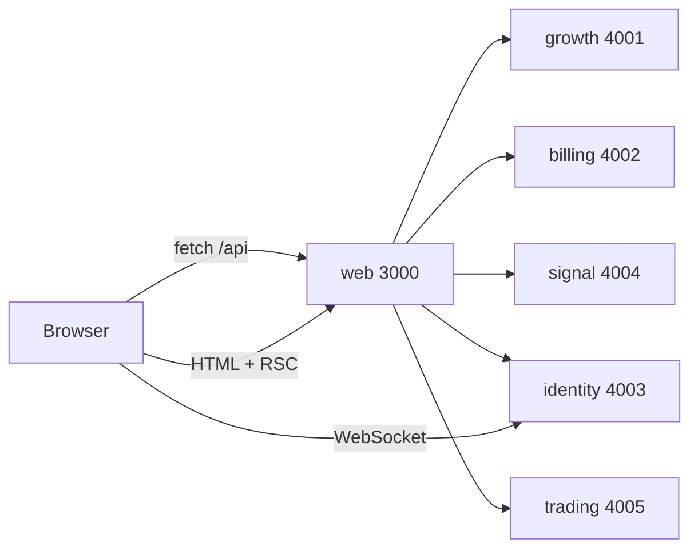
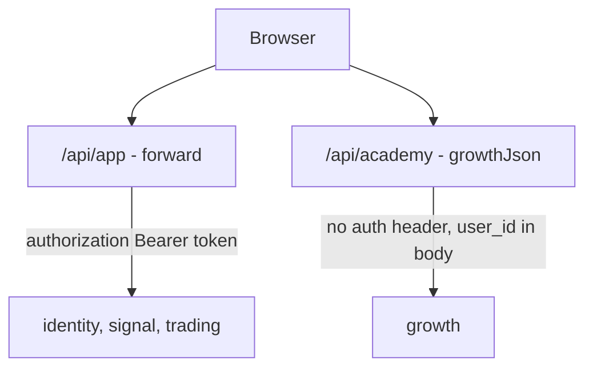
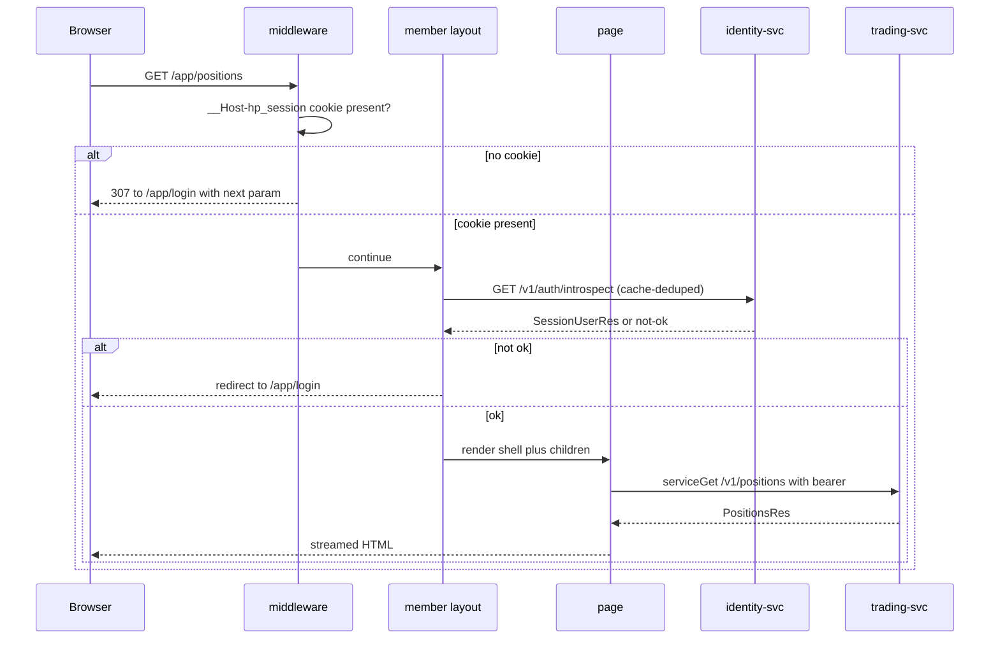

# `apps/web` — Next.js app + Backend-for-Frontend

This document is the code-level reference for `apps/web`: the App Router
structure, the exhaustive route inventory (38 pages, 40 API route files), the
two distinct BFF layers, middleware, session handling, rendering strategy,
SEO/AEO artifacts, the PWA, the member app shell, the academy client engine,
the E2E suite, and the hazards you will hit. It is for an engineer who has to
add a route, change an upstream call, or work out why a page hangs. Behaviour
that another document owns is linked, not repeated: the
[data model](../02-data-model.md), cross-service
[flows](../03-flows.md), the HTTP [API reference](../05-api-reference.md), the
[threat model](../06-security.md), containers, edge routing and environments in
[infrastructure](../07-infrastructure.md), and day-2
[operations](../09-operations-runbook.md).

---

## 1. Position in the system

`apps/web` is the only internet-facing component. The five NestJS services have
CORS disabled and are never exposed; a browser reaches them exclusively through
this app — either from a server component or through a route handler under
`apps/web/app/api/`. The app owns no persistence.



The one channel that bypasses the BFF is the chat WebSocket. Route handlers
cannot proxy WS, so `POST /api/app/chat/token`
(`apps/web/app/api/app/chat/token/route.ts`) mints a **single-use 60 s ticket**
from identity and the client dials `NEXT_PUBLIC_CHAT_WS_URL` directly, passing
the ticket as the `Sec-WebSocket-Protocol` subprotocol rather than a query param
(`apps/web/components/app/ChatRoom.tsx`). The session bearer never reaches
client JS and no credential ever appears in a URL. That endpoint is served by
identity-svc, not by Next.js, so the reverse proxy must route `/v1/chat/ws`
separately — see [infrastructure](../07-infrastructure.md) for the edge config.

Runtime is Node everywhere — no `export const runtime = "edge"` exists anywhere
in the package. Build output is `output: "standalone"`
(`apps/web/next.config.ts:48`).

---

## 2. App Router structure

```
apps/web/app/
  layout.tsx            root: fonts, metadata, viewport, theme bootstrap, PWA + analytics
  globals.css           shared primitives (.hp-skeleton, .skip-link, containers)
  not-found.tsx         global 404 (static)
  sitemap.ts robots.ts manifest.ts
  (marketing)/          24 pages — public site, Nav + Footer chrome
  (platform)/app/       14 pages — private member surface, own shell, noindex
  api/                  40 route files — the BFF
```

### 2.1 Why the two route groups exist

Route groups bind **different layouts and metadata defaults** to two surfaces
that share one URL space and one root layout. They add no path segment.

| | `(marketing)` | `(platform)` |
|---|---|---|
| Layout | `apps/web/app/(marketing)/layout.tsx:5` — skip link, `Nav`, `main#main`, `Footer` | `apps/web/app/(platform)/app/layout.tsx:9` — passthrough; the real shell is one level deeper |
| Metadata | inherits the root title template `%s · HeroPips` (`apps/web/app/layout.tsx:24`) | own template `%s · HeroPips App` **and `robots: {index:false, follow:false}`** (`apps/web/app/(platform)/app/layout.tsx:4`) — one declaration de-indexes the entire platform |
| CSS | per-page CSS modules plus `components/**/*.css` | `./app.css` imported once by the group layout (`apps/web/app/(platform)/app/layout.tsx:2`) |
| Auth | none | `apps/web/middleware.ts` cookie gate, then real introspection in `apps/web/app/(platform)/app/(member)/layout.tsx:11` |

Inside `(platform)/app` there are two further groups, and that split is
load-bearing:

- **`(member)/`** — wrapped by a layout that introspects the session and
  redirects (`apps/web/app/(platform)/app/(member)/layout.tsx:11`), then renders
  the sidebar/tab-bar shell.
- **`(auth)/`** — `login` and `redeem`. These must render for signed-out users,
  so they sit *outside* `(member)` and carry their own `loading.tsx` and
  `error.tsx`. They are also the exact two paths `middleware.ts` bypasses
  (`apps/web/middleware.ts:8`).

> A new private page placed anywhere other than under `(member)/` inherits
> **zero** server-side session validation. See
> [§15 Hazards and gaps](#15-hazards-and-gaps).

---

## 3. Complete route inventory — pages (38)

`L` = a `loading.tsx` sibling exists, `E` = an `error.tsx` sibling exists.
"static" means prerendered at build (no `dynamic` export and no dynamic request
API). The three token pages authenticate on an opaque `?token=` query param,
not a session.

### 3.1 `(marketing)` — 24 pages

Paths in the *Notes* column are relative to `apps/web/app/(marketing)/`.

| Route | Rendering | Auth | Upstream | L/E | Notes |
|---|---|---|---|---|---|
| `/` | static + ISR — `fetch(..., {next:{revalidate:30}})` (`page.tsx:74`) | public | billing `/v1/founding/seats` | — | `@graph` JSON-LD: Organization + WebSite + SoftwareApplication + Offer $499 (`page.tsx:30-69`); a seats failure returns `null` and the meter falls back to client polling (`page.tsx:78`) |
| `/product` | static | public | — | — | FAQPage (`product/page.tsx:57`) + Breadcrumb (`product/page.tsx:56`) |
| `/product/intelligence` | static | public | — | — | FAQPage (`product/intelligence/page.tsx:123`) + Breadcrumb (`product/intelligence/page.tsx:118`) |
| `/product/trade-guard` | static | public | — | — | FAQPage (`product/trade-guard/page.tsx:143`) + Breadcrumb (`product/trade-guard/page.tsx:137`) |
| `/product/automation` | static | public | — | — | FAQPage (`product/automation/page.tsx:97`) + Breadcrumb (`product/automation/page.tsx:92`) |
| `/pricing` | static | public | — | — | Product + Brand + `Offer[]` built from `TIERS` (`pricing/page.tsx:25-46`) |
| `/faq` | static | public | — | — | FAQPage from the `FAQ` list in `apps/web/lib/content.ts` (`faq/page.tsx:24`) |
| `/affiliates` | static | public | — | — | FAQPage (`affiliates/page.tsx:103`); `affiliates/ApplyForm.tsx:111` POSTs `/api/affiliates` |
| `/founding` | `force-dynamic` (`founding/page.tsx:24`) | public | billing `/v1/founding/seats` (`founding/page.tsx:66`) | **L** | Offer JSON-LD (`founding/page.tsx:42`); a throw sets `seats = null` (`founding/page.tsx:68`) |
| `/founding/status` | `force-dynamic` (`founding/status/page.tsx:15`) | `?token=` | billing `/v1/founding/status` (`founding/status/page.tsx:51`) | **L** | `robots:{index:false}`; a missing or failed token renders `ErrorCard` (`founding/status/page.tsx:17`) |
| `/early-access` | `force-dynamic` (`early-access/page.tsx:32`) | public | growth `/v1/early-access/stats` + billing `/v1/founding/seats`, both `.catch(()=>null)` (`early-access/page.tsx:141`) | **L** | FAQPage with an explicit `@id` fragment `…/early-access#faq` (`early-access/page.tsx:122`) + Breadcrumb (`early-access/page.tsx:149`) |
| `/early-access/status` | `force-dynamic` (`early-access/status/page.tsx:17`) | `?token=` | growth `/v1/early-access/status` (`early-access/status/page.tsx:55`) | **L** | `robots:{index:false}`; Breadcrumb on both the invalid and the valid branch (`early-access/status/page.tsx:28`, `:65`) |
| `/academy` | static | public | — | — | own `academy/layout.tsx` + `academy/opengraph-image.tsx`. Course + CourseInstance + nested Course + LearningResource (`academy/page.tsx:41-74`) + Breadcrumb (`academy/page.tsx:40`) |
| `/academy/[slug]` | **SSG** — `generateStaticParams()` over `LESSONS_FULL` plus `dynamicParams = false` (`academy/[slug]/page.tsx:13-17`) | public, content tiered | — (curriculum is local) | — | per-lesson `academy/[slug]/opengraph-image.tsx`. LearningResource + Quiz (`academy/[slug]/page.tsx:59-74`) + Breadcrumb (`:54`); an unknown slug 404s and is never SSR'd |
| `/academy/certificates` | static | public | — | — | ItemList → 11 × EducationalOccupationalCredential (`academy/certificates/page.tsx:56-74`); `issuedAt` is `new Date()` at render, so it is **frozen at build** (`academy/certificates/page.tsx:45`) |
| `/academy/arcade` | static | public | — | — | Breadcrumb only (`academy/arcade/page.tsx:26`); client games award XP through the store |
| `/academy/verify/[code]` | `force-dynamic` (`academy/verify/[code]/page.tsx:19`) | public | growth `/v1/academy/certificates/verify/{code}` through a `cache()`-wrapped loader (`academy/verify/[code]/page.tsx:22-27`) | — | own `academy/verify/[code]/opengraph-image.tsx` with its **own** `GROWTH_URL` fetch (`:25`). Always 200; invalid → `robots:{index:false}`; EducationalOccupationalCredential (`page.tsx:104`) |
| `/legal/terms` | static | public | — | — | Breadcrumb via `legal/LegalShell.tsx:21` |
| `/legal/privacy` | static | public | — | — | Breadcrumb via `legal/LegalShell.tsx:21` |
| `/legal/risk` | static | public | — | — | Breadcrumb via `legal/LegalShell.tsx:21` |
| `/legal/refunds` | static | public | — | — | Breadcrumb via `legal/LegalShell.tsx:21` |
| `/legal/ltd-terms` | static | public | — | — | Breadcrumb via `legal/LegalShell.tsx:21` |
| `/unsubscribe` | `force-dynamic` (`unsubscribe/page.tsx:12`) | `?token=` | growth `/v1/messaging/unsubscribe` (`unsubscribe/page.tsx:49`) | — | `robots:{index:false}`; failure sets `result = null` (`:51`) |
| `/offline` | static | public | — | — | `robots:{index:false}` (`apps/web/app/(marketing)/offline/page.tsx:8`); precached by `sw.js` **together with its hashed assets** |

### 3.2 `(platform)/app` — 14 pages

Every page here is `force-dynamic`. Session enforcement is layered: middleware
checks cookie presence, `(member)/layout.tsx` introspects, pages that call
`getSession()` themselves redirect again, and `serviceGet` redirects on an
upstream 401 (`apps/web/lib/session.ts:76`). Paths in *Notes* are relative to
`apps/web/app/(platform)/app/`.

| Route | Rendering | Auth | Upstream | L/E | Notes |
|---|---|---|---|---|---|
| `/app` | `force-dynamic` (`(member)/page.tsx:17`) | layout introspection | trading `/v1/connections` **awaited first** (`(member)/page.tsx:23`), then parallel trading `/v1/pnl/summary`, `/v1/pnl/equity?points=200`, `/v1/positions` and signal `/v1/signals?status=active&limit=3` (`:24-29`) | **L**, **E** | connections resolve first so trading-svc's `ensurePaper` seeding cannot race the balance reads (`(member)/page.tsx:20-22`) |
| `/app/intelligence` | `force-dynamic` (`(member)/intelligence/page.tsx:15`) | layout | signal `/v1/signals?status=active`, `?status=resolved&limit=20`, trading `/v1/connections` (`:44-48`) | **L**, **E** | `/app/signals` 307s here (`apps/web/next.config.ts:82`) |
| `/app/positions` | `force-dynamic` (`(member)/positions/page.tsx:8`) | layout | trading `/v1/positions` (`:11`) | **L**, **E** | `PositionsLive` polls `/api/app/positions` every 5 000 ms (`apps/web/components/app/PositionsLive.tsx:9`) |
| `/app/history` | `force-dynamic` (`(member)/history/page.tsx:8`) | layout | trading `/v1/trades` (`:11`) | **L**, **E** | cursor pagination through `/api/app/trades?cursor=` |
| `/app/connect` | `force-dynamic` (`(member)/connect/page.tsx:8`) | layout | trading `/v1/connections` + identity `/v1/me/package` (`:12-13`) | **L**, **E** | |
| `/app/chat` | `force-dynamic` (`(member)/chat/page.tsx:9`) | layout **plus own `getSession()`** (`:12-13`) | identity `/v1/chat/history?limit=50` (`:14`) | **L**, **E** | client upgrades to a direct WS and degrades to 10 000 ms polling (`apps/web/components/app/ChatRoom.tsx:10`) |
| `/app/packages` | `force-dynamic` (`(member)/packages/page.tsx:8`) | layout | identity `/v1/me/package` (`:24`) | **L**, **E** | |
| `/app/security` | `force-dynamic` (`(member)/security/page.tsx:7`) | layout | identity `/v1/sessions` + `/v1/me/audit` (`:11-12`) | **L**, **E** | |
| `/app/settings` | `force-dynamic` (`(member)/settings/page.tsx:10`) | layout + own `getSession()` (`:13-14`) | — (session object only) | **L**, **E** | theme radiogroup + logout control |
| `/app/academy` | `force-dynamic` (`(member)/academy/page.tsx:20`) | layout + own `getSession()` (`:57-58`) | growth via `loadProgress()` and `GROWTH_URL/v1/academy/leaderboard?limit=10` (`:26`, `:59`) | **L**, **E**, own `layout.tsx` | a leaderboard failure degrades to `{entries:[]}` (`:27-30`) |
| `/app/academy/certificates` | `force-dynamic` (`(member)/academy/certificates/page.tsx:15`) | layout + own `getSession()` (`:18-19`) | growth via `loadProgress()` (`:20`) | inherits the segment L/E | |
| `/app/academy/learn/[slug]` | `force-dynamic` (`(member)/academy/learn/[slug]/page.tsx:11`) | layout; `user.founding` additionally required for `pro` lessons (`:31`) | — (curriculum is local) | inherits the segment L/E | an unknown slug calls `notFound()`; a pro-locked lesson renders the `.ac-wall` |
| `/app/login` | `force-dynamic` (`(auth)/login/page.tsx:9`) | **public** — middleware bypass | identity via `getSession()` | `(auth)/` **Layout** + **L** + **E** | a live session triggers `redirect("/app")` (`:16-17`); `?next=` is sanitised by `safeNext` (`apps/web/components/app/AuthForms.tsx:37`) |
| `/app/redeem` | `force-dynamic` (`(auth)/redeem/page.tsx:11`) | **public** — middleware bypass | identity via `getSession()`, billing `GET /v1/founding/status` when `?token=` is present (`:23`) | `(auth)/` **Layout** + **L** + **E** | a live session triggers `redirect("/app")` (`:35-36`). Prefill, in precedence order: `?token=` (the order-status HMAC — resolves server-side to **both** the order id and the paid email, and renders the "order verified" strip), then `?code=` / `?email=`. `?next=` is carried through to the post-redeem redirect. A token that is expired, tampered, or not yet redeemable falls back to a blank form (`:25-27`) |

### 3.3 Metadata and image routes

| Route | File | Output |
|---|---|---|
| `/sitemap.xml` | `apps/web/app/sitemap.ts` | 20 fixed routes (`:11-36`) plus one entry per lesson (`:23`) |
| `/robots.txt` | `apps/web/app/robots.ts` | `*` plus 8 named AI crawlers, all under the same `DISALLOW` (`:5-23`) |
| `/manifest.webmanifest` | `apps/web/app/manifest.ts` | `start_url:"/app"`, 4 icons, 3 shortcuts |
| `/academy/opengraph-image` | `apps/web/app/(marketing)/academy/opengraph-image.tsx` | 1200×630 PNG via `next/og`, no remote fonts, hex values mirrored from tokens (`:13-17`) |
| `/academy/[slug]/opengraph-image` | `apps/web/app/(marketing)/academy/[slug]/opengraph-image.tsx` | per-lesson card |
| `/academy/verify/[code]/opengraph-image` | `apps/web/app/(marketing)/academy/verify/[code]/opengraph-image.tsx` | fetches growth directly (`:25`); failure falls back to a generic card |

AEO route handlers — these were static files under `public/` and are now
generated from the same typed content the pages use, so they cannot drift from
the product: `apps/web/app/llms.txt/route.ts` and
`apps/web/app/llms-full.txt/route.ts`, both `dynamic = "force-static"` and
rendered once at build.

Static assets: `apps/web/public/sw.js`, `apps/web/public/icon.svg`,
`apps/web/public/icon-192.png`, `apps/web/public/icon-512.png`,
`apps/web/public/media/hero-poster.jpg`.

---

## 4. Complete route inventory — API (40 files, 43 method handlers)

All responses are `application/json` unless noted. Bodies are zod-validated
against `@heropips/contracts` **before** any upstream call. "dynamic" is Next
15's default for route handlers; "force-dynamic" means the file exports it
explicitly. Rate limiting is the in-process token bucket in
`apps/web/app/api/_lib/bff.ts` — default capacity 20/min/IP (`:8`), with named
buckets where noted.

### 4.1 Public BFF — `lib/api.ts` clients, no session

| Route | Rendering | Rate limit | Upstream | Notes |
|---|---|---|---|---|
| `POST /api/early-access/code` | dynamic | `ea-code`, **6/min** (`apps/web/app/api/early-access/code/route.ts:12`) | growth `/v1/early-access/code` | `EarlyAccessCodeReq`; 422 "Enter a valid email address." (`:16`). Own bucket because every call sends real mail (`:6-10`) |
| `POST /api/early-access/verify` | dynamic | `ea-verify`, **12/min** (`apps/web/app/api/early-access/verify/route.ts:11`) | growth `/v1/early-access/verify` | `EarlyAccessVerifyReq` → `EarlyAccessJoinRes`; this is the call that claims the queue position |
| `GET /api/early-access/status` | dynamic | — | growth `/v1/early-access/status` | no `?token` → **401 `invalid_token`** (`apps/web/app/api/early-access/status/route.ts:8-13`) |
| `POST /api/founding/checkout` | dynamic | shared 20/min (`apps/web/app/api/founding/checkout/route.ts:7`) | billing `/v1/founding/checkout` | `CheckoutReq` → `CheckoutRes` |
| `GET /api/founding/seats` | force-dynamic (`apps/web/app/api/founding/seats/route.ts:6`) | — | billing `/v1/founding/seats` | the only route that emits a shared-cache header: `public, s-maxage=5, stale-while-revalidate=10` (`:11`) |
| `GET /api/founding/status` | dynamic | — | billing `/v1/founding/status` | no `?token` → 401 `invalid_token` (`apps/web/app/api/founding/status/route.ts:8`) |
| `POST /api/affiliates` | dynamic | shared 20/min (`apps/web/app/api/affiliates/route.ts:10`) | growth `/v1/affiliates/apply` | returns **202** with `{ok:true}` (`:17`) |
| `GET /api/mail/c/[id]` | dynamic | — | growth `/v1/messaging/click/{id}?u=` | **302** to `res.to`; any failure → 302 to `SITE_URL/`, because a mail link must never dead-end (`apps/web/app/api/mail/c/[id]/route.ts:20-23`) |
| `GET /api/mail/o/[id]` | dynamic | — | growth `/v1/messaging/open/{id}` | always returns a 1×1 GIF, `image/gif`, `no-store, max-age=0`; a tracking failure is swallowed (`apps/web/app/api/mail/o/[id]/route.ts:10`) |
| `GET /api/mail/unsubscribe` | dynamic | — | growth `/v1/messaging/unsubscribe` | no token → 422 (`apps/web/app/api/mail/unsubscribe/route.ts:8`) |
| `POST /api/mail/unsubscribe` | dynamic | — | same | **RFC 8058 one-click: ALWAYS 200 `{ok:true}`**, errors swallowed, because a bounce makes providers retry or flag the message (`apps/web/app/api/mail/unsubscribe/route.ts:17-30`) |

### 4.2 Session-minting routes — set or clear `__Host-hp_session`

| Route | Rendering | Rate limit | Upstream | Notes |
|---|---|---|---|---|
| `POST /api/app/auth/login` | force-dynamic (`apps/web/app/api/app/auth/login/route.ts:7`) | shared 20/min (`:10`) | identity `/v1/auth/login` | `LoginReq`; an upstream `!ok` is mirrored verbatim (`:28`); an unparseable `AuthSessionRes` → 502 (`:31`); sets `__Host-hp_session` with `SESSION_COOKIE_ATTRS` and returns **only** `{user}` (`:33-35`) |
| `POST /api/app/auth/redeem` | force-dynamic (`apps/web/app/api/app/auth/redeem/route.ts:7`) | shared 20/min (`:10`) | identity `/v1/auth/redeem` **plus a best-effort** trading `/v1/connections` | `RedeemAccessReq`; the throwaway connections GET triggers trading-svc `ensurePaper` $10 000 seeding before first paint, and its failure is swallowed (`:35-46`) |
| `POST /api/app/auth/logout` | force-dynamic (`apps/web/app/api/app/auth/logout/route.ts:5`) | — | identity `/v1/auth/logout`, best effort (`:11-15`) | always clears the cookie with `maxAge:0` and returns `{ok:true}` (`:17-19`) |

### 4.3 Authenticated proxy — `/api/app/**`

All `force-dynamic`, all through `forward()`. **None is rate-limited at the
BFF.**

| Route | Upstream | Query passthrough / body schema |
|---|---|---|
| `GET /api/app/me` | identity `/v1/me` | — |
| `PATCH /api/app/me` | identity `/v1/me` | local `MePatchReq` — `display_name` trimmed, 2–40 (`apps/web/app/api/app/me/route.ts:7`) |
| `GET /api/app/me/package` | identity `/v1/me/package` | — |
| `GET /api/app/me/audit` | identity `/v1/me/audit` | `pickSearch(["cursor","limit"])` |
| `POST /api/app/me/password` | identity `/v1/me/password` | local `PasswordChangeReq` — current 1–200, **new min 10** (`apps/web/app/api/app/me/password/route.ts:7-10`) |
| `GET /api/app/sessions` | identity `/v1/sessions` | — |
| `DELETE /api/app/sessions/[id]` | identity `/v1/sessions/{id}` | id is `encodeURIComponent`'d (`apps/web/app/api/app/sessions/[id]/route.ts:7`) |
| `GET /api/app/chat/history` | identity `/v1/chat/history` | `pickSearch(["cursor","limit"])` |
| `POST /api/app/chat/messages` | identity `/v1/chat/messages` | `ChatPostReq`; 422 "Message must be 1–2000 characters." (`apps/web/app/api/app/chat/messages/route.ts:10`) |
| `POST /api/app/chat/token` | identity `POST /v1/chat/ticket` | mints an opaque **single-use 60 s WS ticket**, never the session bearer; returns `{ticket, expiresIn}` with `cache-control: no-store` (`apps/web/app/api/app/chat/token/route.ts`) |
| `GET /api/app/connections` | trading `/v1/connections` | — |
| `POST /api/app/connections` | trading `/v1/connections` | `ConnectionCreateReq` (`apps/web/app/api/app/connections/route.ts:13`) |
| `DELETE /api/app/connections/[id]` | trading `/v1/connections/{id}` | — |
| `GET /api/app/positions` | trading `/v1/positions` | — |
| `POST /api/app/positions/[id]/close` | trading `/v1/positions/{id}/close` | — |
| `POST /api/app/orders` | trading `/v1/orders` | `OrderReq`; the 422 mentions "exactly one of qty or risk %" (`apps/web/app/api/app/orders/route.ts:10`) |
| `GET /api/app/trades` | trading `/v1/trades` | `pickSearch(["cursor","limit"])` |
| `GET /api/app/pnl/summary` | trading `/v1/pnl/summary` | none forwarded |
| `GET /api/app/pnl/equity` | trading `/v1/pnl/equity` | **none forwarded — `points` is dropped** (`apps/web/app/api/app/pnl/equity/route.ts:6`) |
| `GET /api/app/signals` | signal `/v1/signals` | `pickSearch(["status","limit"])` |
| `GET /api/app/quotes` | signal `/v1/quotes` | `pickSearch(["symbols"])` |

### 4.4 Academy BFF — `/api/academy/**`

All `force-dynamic`; upstream growth calls carry **no** bearer.

| Route | Auth | Upstream | Notes |
|---|---|---|---|
| `GET /api/academy/progress` | session | growth via `loadProgress()` | **anonymous → 204, not 401**, so the browser console stays clean on public academy pages (`apps/web/app/api/academy/progress/route.ts:8-10`) |
| `POST /api/academy/sync` | session | growth `/v1/academy/sync` | body is `AcademySyncReq.omit({user_id,email,display_name})`; identity is injected server-side (`apps/web/app/api/academy/sync/route.ts:9`) |
| `POST /api/academy/complete` | session | growth `/v1/academy/complete` | `AcademyCompleteReq.omit({user_id})` (`apps/web/app/api/academy/complete/route.ts:8`) |
| `POST /api/academy/game` | session | growth `/v1/academy/game` | `AcademyGameReq.omit({user_id})` (`apps/web/app/api/academy/game/route.ts:8`) |
| `POST /api/academy/spin` | session | growth `/v1/academy/spin` | once per UTC day; growth's **409 `academy_spin_used`** is mirrored as-is (`apps/web/app/api/academy/spin/route.ts:6-10`) |
| `POST /api/academy/certificates` | session | growth `/v1/academy/certificates` | idempotent upstream; **409 `academy_track_incomplete`** is mirrored (`apps/web/app/api/academy/certificates/route.ts:10`) |
| `GET /api/academy/leaderboard` | **public** | growth `/v1/academy/leaderboard` | `pickSearch(["limit"])`; display names and XP only (`apps/web/app/api/academy/leaderboard/route.ts:6`) |
| `GET /api/academy/capstone` | session | trading `/v1/connections` + `/v1/trades?limit=100` + growth `loadProgress()` (`apps/web/app/api/academy/capstone/route.ts:22-26`) | derives 2 missions from **real** trading state and auto-completes `paper-trading-capstone` once when both pass — exactly-once by construction, because the recorded completion short-circuits (`:33-40`) |

---

## 5. The two BFF layers

There are two families of route handler with **different authentication
models**. Copying a handler from the wrong family produces a silently
unauthenticated upstream call that still returns 200.



### 5.1 `apps/web/app/api/app/_lib/proxy.ts` — forwards the bearer

`forward(base, path, init)` (`:41`):

1. `bearerToken()` reads `__Host-hp_session` from the cookie jar (`:27`); missing →
   `unauthorized()` 401 `{error_code:"unauthorized"}` (`:13`).
2. Sends **only** `authorization: Bearer <token>`, plus `content-type` when a
   body exists (`:49-52`). No cookie, no user agent, no `x-forwarded-for` and no
   trace header is propagated.
3. `cache: "no-store"` unconditionally (`:54`).
4. A network throw becomes `unavailable()` 502 `{error_code:"internal"}`
   (`:56`, `:20`).
5. **204, 205 and 304 short-circuit to a bodiless `NextResponse`** (`:59-62`),
   because `NextResponse.json(null)` would throw and turn a successful upstream
   204 into a 500.
6. Otherwise it mirrors the upstream status and JSON, falling back to
   `{ok: res.ok}` when the body is unparseable (`:63-64`).

`pickSearch(req, keys)` (`:68`) whitelists query params and drops empty values,
so a caller cannot smuggle an arbitrary query string upstream.

### 5.2 `apps/web/app/api/academy/_lib.ts` — injects identity into the body

Growth's academy endpoints are **internal APIs that accept no bearer**; the file
states this at `:7`. So this layer inverts the model:

1. `requireUser()` introspects the cookie via `getSession()` and returns either
   the `SessionUserRes` or a ready-to-return 401 (`:30`). Handlers discriminate
   with `user instanceof NextResponse`.
2. `growthFetch` sends **no authorization header at all** (`:37-45`).
3. Each handler builds the upstream body from an `.omit(...)`-narrowed schema
   and re-adds identity from the session — for example
   `AcademySyncReq.omit({user_id, email, display_name})` at
   `apps/web/app/api/academy/sync/route.ts:9`. A client therefore cannot claim
   XP against another `user_id`.
4. `loadProgress(user)` performs first-touch auto-provisioning: `GET
   /v1/academy/progress/{id}`, and on **404 with `academy_not_found`** it POSTs
   `/v1/academy/sync` carrying the session identity and returns the fresh
   progress (`:78-93`). Server pages reuse it so first paint needs no extra hop.

### 5.3 Shared plumbing

`apps/web/app/api/_lib/bff.ts`:

- `rateLimit(req, {bucket?, capacity?})` (`:12`) — continuous-refill token
  bucket, `tokens = min(capacity, tokens + (now - ts) * capacity / 60000)`
  (`:21`). The key is `bucket:ip` or `ip`, where `ip` is the first
  `x-forwarded-for` hop and otherwise the literal string `local` (`:17-18`).
  Exhausted → 429 `rate_limited` (`:27`).
- `toResponse(err)` (`:34`) — an `UpstreamError` passes through with its status
  and body; anything else becomes an **opaque 502 `internal`**.
- `validationFailed(detail)` (`:42`) — 422 `validation_failed` with a
  human-readable message and a fixed remediation string.

`apps/web/lib/api.ts` is the unauthenticated server client used by marketing
pages and the public BFF. `call()` always sends `content-type:
application/json` and `cache: "no-store"`, and throws `UpstreamError(status,
ApiError)` on `!ok` with an `internal` fallback body (`:14-26`).

**Error codes this layer originates.** Everything else is an upstream status
mirrored verbatim.

| Code | Status | Origin |
|---|---|---|
| `unauthorized` | 401 | `apps/web/app/api/app/_lib/proxy.ts:15`, `apps/web/app/api/academy/_lib.ts:17` |
| `invalid_token` | 401 | `apps/web/app/api/early-access/status/route.ts:10`, `apps/web/app/api/founding/status/route.ts:8` |
| `validation_failed` | 422 | `apps/web/app/api/_lib/bff.ts:44` |
| `rate_limited` | 429 | `apps/web/app/api/_lib/bff.ts:28` |
| `internal` | 502 | `apps/web/app/api/_lib/bff.ts:37`, `apps/web/app/api/app/_lib/proxy.ts:22`, `apps/web/app/api/academy/_lib.ts:24` |

---

## 6. Middleware

`apps/web/middleware.ts` does two things: it mints the per-request CSP nonce for
every document, and it gates `/app/**` on cookie presence.

- Matcher: everything except `/_next/static`, `/_next/image` and paths ending in
  a static asset extension (`:42-44`) — wide because the nonce has to reach every
  document, not just the platform.
- `PUBLIC_APP_PATHS = new Set(["/app/login", "/app/redeem"])` (`:13`), an
  **exact-match** bypass (`:18`) — `/app/login/extra` is not exempt.
- **Cookie presence only**: `req.cookies.has(SESSION_COOKIE)` (`:18`, constant
  from `apps/web/lib/session-cookie.ts`). No signature check and no
  introspection. The file gives the reason at `:5-12`: real validation happens
  server-side in the platform layout.
- Redirect: clone `nextUrl`, set `pathname = "/app/login"`, **blank `search`**,
  then set `next = pathname + originalSearch` (`:19-23`). Blanking first stops
  the original query string appearing twice in the login URL.

Two things middleware does, and one it deliberately does not:

- **Mints the CSP nonce.** For every request the matcher covers it generates a
  nonce, sets the policy on both the response and the forwarded request headers
  (Next reads the latter to nonce its own bootstrap scripts), and exposes the
  nonce to the root layout as `x-hp-nonce`. The static headers — HSTS,
  `X-Frame-Options`, `Referrer-Policy`, `Permissions-Policy`, COOP/CORP,
  `Origin-Agent-Cluster`, `X-DNS-Prefetch-Control` — still come from the
  `headers()` entry in `apps/web/next.config.ts`, applied to `source: "/(.*)"`.
- **Gates `/app/**`.** The matcher now spans the whole site for the nonce, so the
  auth gate self-scopes with `pathname.startsWith("/app")`.
- **No authentication.** A forged or expired `__Host-hp_session` sails past the
  presence check.

Because the `?next=` value is attacker-controlled by construction,
`safeNext()` in `apps/web/components/app/AuthForms.tsx:37` only honours values
that are exactly `/app` or start with `/app/`, and never start with `//`. The
`/app/` suffix matters — a bare `startsWith("/app")` also admitted `/apparel`,
which is not the subtree the middleware was guarding when it minted the param.
`withNext()` (`:43`) re-encodes the same sanitised value onto the login ↔
redeem cross-links, so a deep link survives a detour through redeem. That check
is load-bearing.

---

## 7. Session handling in server components

`apps/web/lib/session.ts` starts with `import "server-only"` (`:1`), so it
cannot be pulled into a client bundle.

| Fact | Value | Line |
|---|---|---|
| Cookie name | `__Host-hp_session` | `apps/web/lib/session.ts:14` |
| Attributes | `httpOnly`, `sameSite: "lax"`, `secure: true` (unconditional), `path: "/"`, `priority: "high"`, `maxAge: 60*60*24*30` = **2 592 000 s / 30 days** | `apps/web/lib/session-cookie.ts` |
| Token shape | opaque identity bearer; never parsed by web | `apps/web/lib/session.ts:10` |
| Service bases | `IDENTITY_URL`, `SIGNAL_URL`, `TRADING_URL` | `apps/web/lib/session.ts:16-18` |

### 7.1 `getSession()` — one introspection per request

`getSession` is wrapped in React's `cache()` (`apps/web/lib/session.ts:38`).
That is why the member shell can call it in the layout *and* again in
`/app/chat`, `/app/settings`, `/app/academy` and
`/app/academy/certificates` while issuing exactly **one**
`GET {IDENTITY_URL}/v1/auth/introspect` per render. The call is
`cache: "no-store"` (`:44`) and returns `null` on `!res.ok` or on any throw
(`:46-50`) — an unreachable identity-svc therefore looks like "signed out"
rather than a 500.

### 7.2 `serviceGet(base, path, schema)` — the page-level analogue of `forward()`

`apps/web/lib/session.ts:69`:

- No token → `redirect("/app/login")` (`:71`).
- Upstream **401 → `redirect("/app/login")`** (`:76`), which covers the session
  dying between introspection and use.
- Any other `!ok` → `throw new ServiceError(status, ApiError)` (`:80`), parsed
  from the upstream body with an `internal` fallback. That throw is what the
  segment `error.tsx` boundaries catch.
- Success → `schema.parse(json)` (`:85`), so a contract drift is a loud render
  error rather than quietly wrong UI.



---

## 8. Rendering and data strategy

**Data is resolved server-side.** Every platform page fetches through
`serviceGet` or `loadProgress` inside the server component; client components
receive already-parsed props and only re-fetch through the BFF for live
updates. Marketing pages use `apps/web/lib/api.ts` (`growth.get` /
`billing.get`) or a raw `fetch`, always with a `.catch()` that degrades to
`null`, so a down service never 500s a public page
(`apps/web/app/(marketing)/page.tsx:78`,
`apps/web/app/(marketing)/founding/page.tsx:68`,
`apps/web/app/(marketing)/early-access/page.tsx:141`).

**Caching.** The only ISR in the app is the home-page seat read
(`{next:{revalidate:30}}`, `apps/web/app/(marketing)/page.tsx:74`). Everything
else that touches a service is `cache: "no-store"` (`apps/web/lib/api.ts:18`,
`apps/web/lib/session.ts:44`, `apps/web/app/api/app/_lib/proxy.ts:54`,
`apps/web/app/api/academy/_lib.ts:42`) or `force-dynamic`. The single route that
emits a shared-cache header is `GET /api/founding/seats`
(`apps/web/app/api/founding/seats/route.ts:11`).

**Loading skeletons.** 11 `loading.tsx` files exist under `(platform)` — one per
member segment plus `(auth)/` — and 4 under `(marketing)` (`/founding`,
`/founding/status`, `/early-access`, `/early-access/status`). They are not
spinners: they mirror the real layout using the page's own grid so the swap
moves nothing. `apps/web/app/(marketing)/founding/loading.tsx:6-11` records
why — the previous centred spinner measured **CLS 0.343 on mobile against a
0.1 budget**. The dashboard fallback reuses `.ap-hero`, `.ap-stats` and
`.ap-grid-2` with `Skeleton` blocks and `aria-busy="true"`
(`apps/web/app/(platform)/app/(member)/loading.tsx:6-24`).

**Error boundaries.** 11 `error.tsx` files, one per member segment plus
`(auth)/`. Member segments delegate to a shared `ErrorState` with a `reset`
button (`apps/web/app/(platform)/app/(member)/error.tsx:5`); the auth boundary
renders a branded `role="alert"` card
(`apps/web/app/(platform)/app/(auth)/error.tsx:8`). The `ServiceError` thrown by
`serviceGet` is what reaches them.

**Client-side liveness.** All plain `setInterval`, no backoff:

| Component | Interval | Target |
|---|---|---|
| `apps/web/components/app/PositionsLive.tsx:9` | 5 000 ms | `/api/app/positions` |
| `apps/web/components/convert/OrderStatusPanel.tsx:45` | 8 000 ms until terminal | `/api/founding/status` |
| `apps/web/components/convert/SeatsMeter.tsx:24` | 10 000 ms | `/api/founding/seats` |
| `apps/web/components/app/ChatRoom.tsx:10` | 10 000 ms, **fallback only** when the WS is down; WS reconnect after 5 000 ms (`:101`, `:108`); send cooldown 2 000 ms (`:11`) | `/api/app/chat/history` |
| `apps/web/components/app/Countdown.tsx:20` | 1 000 ms | local clock, no network |

The chat polling fallback is not only a failure path: on staging the edge
applies basic auth, and browsers do not attach basic-auth credentials to a
JS-initiated WebSocket handshake, so the lounge runs on polling there by design
— see [infrastructure](../07-infrastructure.md).

**No fetch timeouts anywhere.** There is no `AbortSignal`, `AbortController` or
`signal:` option in any file under `apps/web/app`, `apps/web/lib` or
`apps/web/components` — verified by search across all three trees. Every
upstream `fetch` inherits the Node/undici default, so one hung service stalls
the Next worker serving that request. This is the highest-impact gap in the
package; see [§15](#15-hazards-and-gaps).

---

## 9. SEO and answer-engine optimisation

### 9.1 `sitemap.ts`

`ROUTES` (`apps/web/app/sitemap.ts:11-36`) is a hand-maintained list of **20**
indexable paths, plus `LESSONS_FULL.map(...)` for every lesson (`:23`).
Priorities run from 1.0 for `/` down to 0.3 for the five legal pages;
`/founding` is the only `changeFrequency: "daily"` entry, because the seat
counter moves (`:18-19`). `/app/**`, `/api/**`, `/offline` and both `/status`
pages are absent **by construction**, documented at `:7-10` and asserted by
`apps/web/e2e/seo-artifacts.spec.ts:8`.

### 9.2 `robots.ts`

`DISALLOW = ["/app", "/api", "/founding/status", "/early-access/status",
"/offline"]` (`apps/web/app/robots.ts:5`). Eight AI crawlers — GPTBot,
ClaudeBot, Claude-Web, PerplexityBot, Google-Extended, Applebot-Extended, CCBot
and meta-externalagent (`:8-17`) — each get their **own rule block with
identical terms**, which is an explicit "welcome, under the same rules" signal
rather than a block. `sitemap` and `host` both derive from `SITE_URL` (`:25-26`).

### 9.3 Metadata

The root layout sets `metadataBase`, the `%s · HeroPips` title template, a
shared description, OpenGraph with `/media/hero-poster.jpg` at 1600×900, and
`twitter: {card:"summary_large_image", site:"@heropips"}`
(`apps/web/app/layout.tsx:22-37`). The platform group layout overrides `robots`
to `{index:false, follow:false}` for every route beneath it
(`apps/web/app/(platform)/app/layout.tsx:6`).

`htmlLimitedBots: /.*/` (`apps/web/next.config.ts:62`) is deliberate and
load-bearing. Next 15 streams `<head>` metadata and only *blocks* for its own
built-in bot list, so Lighthouse, GPTBot, ClaudeBot, PerplexityBot,
OAI-SearchBot and CCBot were all receiving an empty `<head>` and had to run JS
to find the title, description and canonical. Matching every UA forces
server-side metadata resolution for everyone. The comment at `:54-61` notes the
cost is effectively zero, because every route's metadata is a static object with
no I/O.

`/academy/[slug]` clamps its meta description to 160 characters at a word
boundary and appends `" A {minutes}-min lesson, +{xp} XP."`
(`apps/web/app/(marketing)/academy/[slug]/page.tsx:19-28`).
`apps/web/e2e/marketing-pages.spec.ts` enforces a 50–160 character budget on
every indexable route.

### 9.4 JSON-LD

Everything is emitted through `apps/web/components/seo/JsonLd.tsx`: `JsonLd`
stringifies a plain object into an `application/ld+json` script (`:7`), and
`BreadcrumbsJsonLd` builds a `BreadcrumbList` from site-relative crumbs (`:19`).

| Type(s) | Emitted at |
|---|---|
| `Organization`, `WebSite`, `SoftwareApplication`, `Offer` — one `@graph` | `apps/web/app/(marketing)/page.tsx:30-69` |
| `FAQPage` + `Question` + `Answer` | `apps/web/app/(marketing)/product/page.tsx:57`, `apps/web/app/(marketing)/product/intelligence/page.tsx:123`, `apps/web/app/(marketing)/product/trade-guard/page.tsx:143`, `apps/web/app/(marketing)/product/automation/page.tsx:97`, `apps/web/app/(marketing)/faq/page.tsx:24`, `apps/web/app/(marketing)/affiliates/page.tsx:103`, `apps/web/app/(marketing)/early-access/page.tsx:119` |
| `Product` + `Brand` + `Offer[]` | `apps/web/app/(marketing)/pricing/page.tsx:25-46` |
| `Offer` | `apps/web/app/(marketing)/founding/page.tsx:42` |
| `Course` + `CourseInstance` + nested `Course` + `LearningResource` | `apps/web/app/(marketing)/academy/page.tsx:41-74` |
| `LearningResource` + `Quiz` | `apps/web/app/(marketing)/academy/[slug]/page.tsx:59-74` |
| `ItemList` + `ListItem` + `EducationalOccupationalCredential` ×11 | `apps/web/app/(marketing)/academy/certificates/page.tsx:56-74` |
| `EducationalOccupationalCredential` | `apps/web/app/(marketing)/academy/verify/[code]/page.tsx:104` |
| `BreadcrumbList` | every marketing page except `/`; the five legal pages get theirs from `apps/web/app/(marketing)/legal/LegalShell.tsx:21` |

`apps/web/e2e/seo-artifacts.spec.ts:86` asserts **no `aggregateRating`**
anywhere: fabricated ratings are a hard product prohibition.

### 9.5 `llms.txt` and `llms-full.txt`

Force-static route handlers, not files on disk:
`apps/web/app/llms.txt/route.ts` and `apps/web/app/llms-full.txt/route.ts`.
Both import the same typed content the pages render from — `@heropips/contracts`
plus `apps/web/lib/academy/curriculum.ts` and `apps/web/lib/content.ts`
(`apps/web/app/llms-full.txt/route.ts:1-13`) — so seat counts, XP values, the
referral ladder and the curriculum cannot drift from what the product actually
does. `export const dynamic = "force-static"`
(`apps/web/app/llms-full.txt/route.ts:16`) renders them once at build, so they
cost nothing per request.

`llms.txt` is the short structured brief for answer engines; `llms-full.txt` is
the long form. `apps/web/e2e/seo-artifacts.spec.ts:60` asserts both return 200
`text/plain` containing "HeroPips".

### 9.6 Redirect table

`apps/web/next.config.ts:66-93` declares 14 rules: 4 permanent (308) and 10
temporary (307).

| Source | Destination | Kind | Why |
|---|---|---|---|
| `/:path*` when host is `www.heropips.com` | `https://heropips.com/:path*` | 308 | canonical host |
| `/waitlist` | `/early-access` | 308 | rename kept alive |
| `/waitlist/status` | `/early-access/status` | 308 | rename kept alive |
| `/product/signals` | `/product/intelligence` | 308 | 2026-07 repositioning; the public URL is permanent for SEO (`:79`) |
| `/app/signals` | `/app/intelligence` | 307 | private route, so temporary is fine (`:80`) |
| `/home` | `/` | 307 | pre-launch alias |
| `/platform` | `/product` | 307 | pre-launch alias |
| `/login` | `/app/login` | 307 | pre-launch alias |
| `/signin` | `/app/login` | 307 | pre-launch alias |
| `/signup` | `/founding` | 307 | pre-launch alias |
| `/register` | `/founding` | 307 | pre-launch alias |
| `/refer` | `/affiliates` | 307 | pre-launch alias |
| `/referral` | `/affiliates` | 307 | pre-launch alias |
| `/docs` | `/faq` | 307 | pre-launch alias |

Nine of these are asserted end to end in
`apps/web/e2e/redirects.spec.ts:4-22`.

---

## 10. PWA

### 10.1 `apps/web/public/sw.js` — hand-written, zero dependencies

| Constant | Value | Line |
|---|---|---|
| `VERSION` | `hp-v4` — the **only** cache-invalidation lever | `:14` |
| Caches | `hp-v4-static`, `hp-v4-pages`, `hp-v4-media` | `:15-17` |
| `OFFLINE_URL` | `/offline` | `:18` |
| `PRECACHE_STATIC` | `/manifest.webmanifest`, `/icon.svg`, `/icon-192.png`, `/icon-512.png` | `:20` |
| `PAGE_LIMIT` | 48 | `:22` |
| `MEDIA_LIMIT` | 80 | `:23` |

**Install** (`:38`) runs `precacheOffline()` alongside
`addAll(PRECACHE_STATIC)`, then `skipWaiting()`. `precacheOffline()` (`:27`)
fetches `/offline` with `cache:"no-cache"`, stores it in the page cache, then
**scrapes the returned HTML for `/_next/static/...` `href` and `src` values and
precaches those too** (`:33-35`) — so the offline fallback is fully styled and
hydrated with the network gone.

**Activate** (`:47`) deletes every cache whose key does not start with
`VERSION`, then calls `clients.claim()`.

**Fetch strategy** (`:99-124`), in evaluation order:

| Condition | Behaviour | Line |
|---|---|---|
| method is not `GET` | bypass | `:101` |
| request carries a `range` header | bypass — partial 206 bodies through the Cache API break video playback | `:102-104` |
| cross-origin | bypass | `:106` |
| path starts with `/api/` | **bypass entirely** — trading and account data is never cached | `:108-109` |
| `req.mode === "navigate"` | `pageNetworkFirst` | `:111-113` |
| `/_next/static/`, `/fonts/`, or the icon / favicon / manifest pattern | `cacheFirst(STATIC_CACHE)`, uncapped | `:116-118` |
| `/media/` or `/_next/image` | `cacheFirst(MEDIA_CACHE, 80)` | `:121-122` |

`cacheFirst` (`:68`) stores **status 200 only**, and only `basic` or `default`
response types (`:74`), then fire-and-forget `trim()`. `pageNetworkFirst`
(`:81`) caches only when `res.ok && !res.redirected` (`:86`) — so a login bounce
is never cached — and on network failure falls back to an `ignoreSearch: true`
cache match, then `/offline`, then `Response.error()` (`:92-95`).
`trim(name, limit)` (`:61`) drops oldest-first by cache insertion order.

Old hashed chunks survive deploys on purpose (`:10-12`): an already-open page
keeps navigating after the server has dropped its assets. Bumping `VERSION` is
the only way to invalidate.

### 10.2 Registration

`apps/web/components/pwa/PwaRegister.tsx`, mounted from the root layout
(`apps/web/app/layout.tsx:79`). `updateViaCache: "none"` so the browser always
revalidates `sw.js` itself (`:23`); `reg.update()` on every `visibilitychange`
to visible (`:18-19`); a `waiting` worker is sent
`postMessage("SKIP_WAITING")` immediately (`:26`, `:30`) — no forced reload is
needed because pages keep running on their old cached chunks. Failure is
swallowed (`:34`): offline support is progressive enhancement.

### 10.3 Manifest

`apps/web/app/manifest.ts` — `id: "/"`, **`start_url: "/app"`** (`:11`),
`scope: "/"`, `display: "standalone"` with
`display_override: ["standalone","minimal-ui"]`, `theme_color` and
`background_color` both `#07080C` (the value of `--ink-950`), categories
`["finance","productivity"]`, four icons (192 any, 512 any, 512 maskable, SVG
any), and three shortcuts — Intelligence, Positions, Founding Lounge (`:24-28`).

### 10.4 Offline route

`apps/web/app/(marketing)/offline/page.tsx` — static, `robots:{index:false}`
(`:8`), a raised card with the `LevelUpMark`, a `Reconnect` client control and a
"Back home" link. It is listed in `apps/web/app/robots.ts:5` `DISALLOW` and is
absent from the sitemap.

---

## 11. The member app shell

One nav config, two presentations. `apps/web/components/app/AppNav.tsx` declares
three groups totalling **10 links** (`:26-41`):

| Group | Links |
|---|---|
| `TRADE` (`:26-31`) | `/app` Dashboard, `/app/intelligence`, `/app/positions`, `/app/history` |
| `PLATFORM` (`:32-37`) | `/app/academy`, `/app/connect`, `/app/chat`, `/app/packages` |
| `ACCOUNT` (`:38-41`) | `/app/security`, `/app/settings` |

- **Desktop** — `Sidebar` (`:77`) renders all three groups under labelled
  headings, plus a member chip with the display-name initial and a `Founding`
  badge when `user.founding` (`:98`).
- **Mobile** — `TabBar` (`:121`) shows 4 tabs derived from the same arrays,
  `TABS = [TRADE[0], TRADE[1], TRADE[2], PLATFORM[0]]` (`:118`), and puts the
  remaining 6 in `MORE` (`:119`) behind a `role="dialog" aria-modal="true"`
  bottom sheet (`:160`). Adding a nav item therefore means touching one array,
  not two components.
- **Top bar** — `TopBar` (`:106`) looks the page title up in `TITLES` (`:43-55`)
  and renders `#ap-topbar-side`, a portal target pages use to inject
  right-aligned controls (`:112`).

`isActive()` (`:57`) exact-matches `/app` and prefix-matches everything else, so
the Dashboard tab does not light up on every child route. The More sheet
auto-closes on `pathname` change (`:127`).

`apps/web/app/(platform)/app/(member)/layout.tsx:14-26` composes
`Sidebar` → `TopBar` → `OfflineBanner` → `main.ap-content#main` → `TabBar`.

**Route transitions.** `apps/web/app/(platform)/app/(member)/template.tsx` wraps
children in `div.ap-screen`. A `template.tsx` remounts on every navigation
within its segment, which replays the CSS entrance animation `ap-screen-in`
(`apps/web/app/(platform)/app/app.css:191`, keyframes at `:201`: `opacity 0`
plus `translateY(6px)`) — a native screen-change feel with no client boundary.
`prefers-reduced-motion` neutralises it globally through the `*` rule in
`packages/ui/tokens.css:119`.

The comment at `template.tsx:3` claims a 150 ms entrance, but the animation uses
`var(--dur-med)` = **220 ms** (`packages/ui/tokens.css:84`). Stale comment, not
a behaviour bug.

---

## 12. Academy client

The academy is the one feature with a genuine client-side state machine, because
anonymous visitors must be able to earn XP before an account exists.

### 12.1 Curriculum data model

`apps/web/lib/academy/curriculum.ts` merges content authored in 10 TypeScript
files (`apps/web/lib/academy/content/level-0.ts` through `level-9.ts`) with the
metadata in `@heropips/contracts` — `ACADEMY_LEVELS` (10 levels) and
`ACADEMY_LESSONS` (31 lessons). See
[the architecture overview](../01-architecture.md) for the contracts surface.

Authoring types: `LessonSection`, `QuizQuestion`, `LessonCallout`, `LessonTerm`,
`LessonFigure` with a closed union of **20 diagram ids** (`:44-64`) that must
each map to a component in `apps/web/components/academy/diagrams.tsx`, and
`LessonInteractive` (`:90-94`: `candle-anatomy`, `replay`, `risk-sizer`,
`capstone`).

`resolveLesson()` (`:145`) enforces three integrity rules and **throws at module
init**, so a content bug fails the build rather than the user:

1. missing content file for a contracts slug (`:147`);
2. `content.quiz.length !== meta.quiz` (`:150`);
3. any quiz `answer` index out of range (`:155`).

Exports: `LESSONS_FULL` (curriculum order, with `number` assigned by index at
`:161`), `LEVELS` (levels with their lessons attached), `findLesson`,
`adjacentLessons`, `findLevel`, `TOTAL_LESSONS`, `TOTAL_MINUTES` and
`curriculumMaxLessonXp()`.

`TRACKS` (`:229-244`) is **11 certificate tracks**: one per level with hardcoded
credential wording from `LEVEL_CERT_NAMES`, plus `hero-trader` spanning all 10.
`TRACKS[levelNumber]` is that level's certificate (`:246`).
`trackProgress()` (`:248`) counts completed slugs against a track.

### 12.2 The 10 levels and access gating

Level tiers come from contracts: level 0 is `open`, levels 1–7 are `member`,
levels 8–9 are `pro`. `apps/web/lib/academy/access.ts` turns that into UI
behaviour. `LAUNCH_MODE` reads `NEXT_PUBLIC_LAUNCH_MODE` and defaults to
`prelaunch` (`:12`).

| Function | Rule |
|---|---|
| `canEarn(access, viewer)` (`:20`) | `open` always earns; otherwise the viewer must be a member, and `pro` additionally requires `viewer.pro` |
| `tierLabel(access)` (`:27`) | `open` → "Free", `member` → "Members", `pro` → "Pro" |
| `unlockCta(access, mode)` (`:38`) | `pro` → `/founding` **in every mode**; `member` with `main` → `/app/login`; `member` with `prelaunch` → `/early-access` |
| `claimCta(mode)` (`:61`) | `main` → `/app/login`; `prelaunch` → `/early-access` |

Content visibility is stated at `:3`: `open` lessons ship their full text for
SEO/AEO, while `member` and `pro` lessons ship **only the first section**
publicly plus an unlock CTA, with the full player living at
`/app/academy/learn/[slug]` behind the session.
`apps/web/app/(platform)/app/(member)/academy/learn/[slug]/page.tsx:31`
additionally requires `user.founding` for `pro` lessons and renders the
`.ac-wall` otherwise.

### 12.3 Client store

`apps/web/lib/academy/store.ts` is a vanilla `subscribe`/`getSnapshot` store
consumed through `useSyncExternalStore`, chosen explicitly to avoid a context
re-render cascade (`:10`).

| Key | Store | Contents |
|---|---|---|
| `hp_academy_v1` | localStorage | `LocalState{v:1, xp, completions, games, streak, spinLast}`; rejected unless `v === 1 && typeof xp === "number"` (`:85`) |
| `hp_academy_ref` | localStorage | pending referral code, captured from `?ref=` only when it matches `/^[a-z0-9-]{4,40}$/i` (`:203`), deleted after a successful claim (`:269`) |

`buildSnapshot()` (`:128`) encodes the authority rule: when `status ===
"member"` and `server !== null`, **every** field reads from the server response
(`:129-155`), and local state becomes a pure offline cache. `wallActive`
(`:157`) is
`!isMember && status !== "loading" && anonCompletions >= ACADEMY_XP.ANON_LESSON_LIMIT`.
`getServerSnapshot()` returns a frozen `SSR_SNAPSHOT` (`:174`) so the SSR pass
is stable.

`hydrateProgress()` (`:237`) is single-flight through the `progressFetch`
promise (`:238`):

1. `GET /api/academy/progress`. `fetchJson` treats **204 or `!ok` as `null`**
   (`:226`), which is how the anonymous 204 becomes `status = "anon"` (`:242`).
2. On success, `status = "member"` and emit (`:247-249`).
3. Compute `unclaimed` — device completions the account lacks **and** that exist
   in `ACADEMY_LESSON_BY_SLUG` (`:251-253`).
4. If anything is unclaimed or a `ref` is pending, `POST /api/academy/sync`,
   push an "XP claimed" award for the delta, replace `server`, **increment
   `claimSeq`** so UIs can `router.refresh()`, and clear `hp_academy_ref`
   (`:255-275`).

Mutations `completeLesson` (`:310`), `recordGame` (`:351`), `spinWheel` (`:386`)
and `refreshProgress` (`:412`) all share one shape: anonymous banks locally
(blocked past `ACADEMY_XP.ANON_LESSON_LIMIT`), member POSTs to the BFF and
**reconciles from the authoritative response**. `saveLocal` swallows quota
errors (`:102`) — gamification degrades, lessons keep working.

`apps/web/lib/academy/xp.ts` mirrors growth-svc's XP maths on the client from
the same contracts constants. It is the only file in the package with a unit
test (`apps/web/lib/academy/xp.test.ts`).

---

## 13. E2E

### 13.1 `apps/web/playwright.config.ts`

| Setting | Value | Line |
|---|---|---|
| `testDir` / `outputDir` | `./e2e` / `./e2e/.artifacts` | `:13-14` |
| `fullyParallel` | `true` | `:15` |
| `retries` | `1` | `:16` |
| `reporter` | `[["list"]]` | `:17` |
| `expect.timeout` | 10 000 ms | `:18` |
| `trace` | `on-first-retry` | `:21` |
| `baseURL` | `process.env.BASE_URL ?? "http://localhost:3100"` | `:10`, `:20` |
| `webServer` | **absent** — the stack is externally managed | `:6-8` |

Three projects (`:23-51`):

| Project | Scope |
|---|---|
| `setup` | `testMatch` limited to the setup file (`:27`) |
| `chromium` | 1440×900, `dependencies: ["setup"]`, ignores the setup file (`:32-36`) |
| `mobile` | 390×844, `isMobile`, `hasTouch`, DPR 3, `testMatch` limited to `responsive.spec.ts` and `nav.spec.ts`; **declares no `dependencies`** (`:40-49`) |

Bringing the stack up before a run is an operations concern —
see [operations](../09-operations-runbook.md).

### 13.2 `apps/web/e2e/platform-app.setup.ts` — mints a real founding member

`POST /api/founding/checkout` → parse `CheckoutRes` → `POST
{invoiceOrigin}/simulate/{id}/pay` against the NOWPayments mock →
`expect.poll` on `GET /api/founding/status?token=` until `seat_state ===
"granted"` with a 30 s timeout → `POST /api/app/auth/redeem` with
**`access_code = checkout.order_id`** → save `request.storageState()` to
`e2e/.auth/member.json` (`:16-51`).

The comment at `:26-29` records why the poll gates on the **seat** and not the
payment: at `payment_status: "confirmed"` the seat is still only `held` and
identity rejects the order id with `access_code_invalid`. The seat flips to
`granted` on `finished`, which is the moment the code becomes redeemable.

### 13.3 Spec inventory — 12 specs plus the setup

| Spec | What it asserts |
|---|---|
| `apps/web/e2e/platform-app.spec.ts` | Runs on the saved storage state. Sidebar lists all 10 sections (`:16`); the hero and 4 stat tiles carry "Paper"; the full order lifecycle — BFF order, row appears, UI close with confirm, "No open positions" and flat equity (`:41`); history renders a `Fees` columnheader with a `$`-prefixed value (`:92`); add then remove a Binance connection (`:101`, `:125`); a posted chat message renders (`:133`); security shows a session with a "Current" button and a non-empty audit log (`:141`); packages shows "Founding Hero" plus 4 numeric limit rows (`:152`); a display-name change propagates to `.ap-member-name` (`:162`) |
| `apps/web/e2e/platform-auth.spec.ts` | One page and context so the cookie carries across phases: redeem → `$10,000.00` equity **present in the raw SSR document** → logout bounces `/app` → login → a wrong password keeps you on `/app/login` with `role=alert` → a duplicate-email redeem errors (`:10`) |
| `apps/web/e2e/redirects.spec.ts` | 9 aliases each resolve 200 at the canonical pathname (`:4-22`); `/app` without a session lands on `/app/login?next=%2Fapp` (`:25`) |
| `apps/web/e2e/marketing-pages.spec.ts` | For all 20 `MARKETING_ROUTES`: 200, exactly one `h1`, non-empty title, absolute canonical, meta description 50–160 chars, no horizontal scroll, zero console errors with favicon probes filtered (`:11`); plus global title uniqueness (`:60`) |
| `apps/web/e2e/seo-artifacts.spec.ts` | `sitemap.xml` parses through the browser's own `DOMParser`, every `loc` is absolute, it covers each marketing route and contains no `/app`, `/api` or `/status` (`:8`); `robots.txt` references the sitemap and disallows `/app` and `/api` (`:50`); both `llms*.txt` are 200 `text/plain` mentioning HeroPips (`:62`); across 8 sample routes every `ld+json` block parses and declares `@context` (`:73`), and **none contains `aggregateRating`** (`:86`); `/` declares SoftwareApplication, Organization and WebSite (`:94`); `/faq` declares FAQPage (`:102`) |
| `apps/web/e2e/academy.spec.ts` | The hub renders every level and lesson link server-side (`:30`); Course plus BreadcrumbList JSON-LD and unique meta (`:44`); the certificate gallery renders exactly `TRACKS.length` = 11 `.ac-cert` nodes (`:57-60`); the anonymous earn loop — ace the quiz, see `+N XP` (`:71`) — and persistence across reload (`:88`); **the claim wall rises exactly at `ACADEMY_XP.ANON_LESSON_LIMIT`** (`:96`); a member-tier lesson shows section 1, withholds later sections and shows an unlock CTA (`:117`); a pro lesson links `/founding` (`:128`); a lesson declares `LearningResource` (`:133`); an arcade round reaches a verdict (`:142`); an unknown verify code renders the branded invalid state rather than crashing (`:152`); a11y smoke on 3 academy routes (`:161`) |
| `apps/web/e2e/early-access.spec.ts` | The wizard's submit handler only exists after hydration, so it navigates with `waitUntil:"networkidle"` (`:28`). A wrong code shows "tries left" and claims nothing; the correct code shows "Place claimed", the position, a saved profile, a copy-code button and a `/early-access/status?token=` link (`:26`); **a returning address must not be revealed before the code is proven** — the membership-oracle guard — and then shows the identical position (`:67`); counters and both JSON-LD blocks are server-rendered (`:93`); no horizontal overflow at 320/390/768/1440 (`:113`) |
| `apps/web/e2e/nav.spec.ts` | Desktop, skipped at ≤920 px (`:14`): the Product panel opens on hover with visible links (`:20`), Escape closes it and restores focus to the trigger (`:31`), an outside click closes it (`:41`), the Academy trigger swaps panels (`:51`), a panel link navigates (`:63`). Mobile, skipped above 920 px (`:74`): the burger flips `aria-expanded` and locks body scroll (`:80`), tapping a link navigates and unlocks (`:92`) |
| `apps/web/e2e/theme.spec.ts` | The nav toggle flips `html[data-theme]`, changes the body background, writes `hp_theme` and survives reload (`:14`); with no cookie and `prefers-color-scheme: light`, **first paint** is light at `rgb(245, 246, 241)` (`:51-54`); the settings radiogroup has 3 radios and Light persists (`:61`); zero console errors in light mode on `/` and `/app/login` (`:85`) |
| `apps/web/e2e/responsive.spec.ts` | Every marketing route stays overflow-free (`:10`); 9 high-risk routes swept across 12 widths from 320 to 1920 (`:9`, `:18`); the desktop split hero places the console right of the copy column (`:27`); the member shell across 6 routes × 12 widths (`:49`); the mobile tab bar is present and content clears it (`:58`) |
| `apps/web/e2e/loaders.spec.ts` | Login submit and the early-access code request render `aria-busy` plus an inline spinner behind a 1 500 ms delayed route (`:38`, `:52`); a genuinely `waiting` founding order renders the `LevelLoader` (`:73`). The file header documents the three loader candidates that are **not** testable and why — RSC single-flight means a `loading.tsx` boundary never paints when the destination does not suspend server-side, and server-side seat/status fetches cannot be intercepted from the browser |
| `apps/web/e2e/a11y-smoke.spec.ts` | On `/` and `/app/login`: exactly one `h1`, every `img` has `alt`, every link and button exposes a non-empty accessible name (`:10`, `:35`), and the skip link is the first focusable element on `/` (`:16-19`) |

`apps/web/e2e/helpers.ts` holds the shared fixtures: `E2E_PASSWORD` (`:4`),
`ACCESS_CODE` from `E2E_ACCESS_CODE` defaulting to `hp_dev_alpha` (`:7`), the
canonical `MARKETING_ROUTES` list of 20 (`:10-31`), `uniqueEmail()` (`:34`),
`redeem()` (`:39`), `loginAs()` (`:53`), `noHscroll()` with a 1 px tolerance
(`:62-67`), `parseJsonLd()` (`:71`) and `jsonLdTypes()` which flattens `@graph`
(`:81`).

Unit tests cover exactly one file, `apps/web/lib/academy/xp.test.ts`; the
package `test` script is `vitest run --passWithNoTests`, so a deleted test file
is invisible.

---

## 14. Configuration

| Var | Read at | Default | Notes |
|---|---|---|---|
| `IDENTITY_URL` | `apps/web/lib/session.ts:16`, re-exported by `apps/web/app/api/app/_lib/proxy.ts:5` | `http://localhost:4003` | |
| `SIGNAL_URL` | `apps/web/lib/session.ts:17` | `http://localhost:4004` | |
| `TRADING_URL` | `apps/web/lib/session.ts:18` | `http://localhost:4005` | |
| `GROWTH_URL` | `apps/web/lib/api.ts:5`, `apps/web/app/api/academy/_lib.ts:13`, `apps/web/app/(marketing)/academy/verify/[code]/opengraph-image.tsx:23` | `http://localhost:4001` | read in three independent places |
| `BILLING_URL` | `apps/web/lib/api.ts:6`, `apps/web/app/(marketing)/page.tsx:73` | `http://localhost:4002` | |
| `NEXT_PUBLIC_SITE_URL` | `apps/web/lib/content.ts`, `apps/web/app/layout.tsx:13`, `apps/web/app/(marketing)/page.tsx:13`, `apps/web/app/api/mail/c/[id]/route.ts:5` | `https://heropips.com` | drives `metadataBase`, canonicals, the sitemap, the robots host and every JSON-LD `@id` |
| `NEXT_PUBLIC_CHAT_WS_URL` | `apps/web/lib/security-headers.ts`, `apps/web/components/app/ChatRoom.tsx:9` | `ws://localhost:4003/v1/chat/ws` | **its origin is baked into CSP `connect-src` at build time** |
| `NEXT_PUBLIC_GA4_ID` | `apps/web/lib/security-headers.ts`, `apps/web/components/analytics/Analytics.tsx:15` | unset | unset means no GA origins in CSP and no consent banner |
| `NEXT_PUBLIC_CLARITY_ID` | `apps/web/lib/security-headers.ts`, `apps/web/lib/analytics.ts` | unset | loaded post-consent only |
| `NEXT_PUBLIC_LAUNCH_MODE` | `apps/web/lib/academy/access.ts:12` | `prelaunch` | flips every locked-lesson CTA between `/early-access` and `/app/login` |
| `NEXT_DIST_DIR` | `apps/web/next.config.ts:80` | `.next` | lets a production build run beside a live `next dev` (`:78-79`) |
| `NODE_ENV` | `apps/web/lib/session-cookie.ts`, `apps/web/lib/security-headers.ts` | — | gates CSP `'unsafe-eval'` and `upgrade-insecure-requests`; the session cookie is `Secure` unconditionally now |
| `BASE_URL` | `apps/web/playwright.config.ts:10` | `http://localhost:3100` | |
| `E2E_ACCESS_CODE` | `apps/web/e2e/helpers.ts:7` | `hp_dev_alpha` | |

Static security headers are applied to `/(.*)` from `apps/web/next.config.ts`
(`securityHeaders`): `X-Frame-Options: DENY`, `X-Content-Type-Options: nosniff`,
`Referrer-Policy: strict-origin-when-cross-origin`, a 21-feature
`Permissions-Policy`, `Strict-Transport-Security:
max-age=63072000; includeSubDomains; preload`,
`Cross-Origin-Opener-Policy: same-origin`,
`Cross-Origin-Resource-Policy: same-origin`, `Origin-Agent-Cluster: ?1` and
`X-DNS-Prefetch-Control: off`. `Cross-Origin-Embedder-Policy` is deliberately
absent — it would block the GA4 loader and the Clarity tag, and nothing here
needs cross-origin isolation.

The CSP is **not** there: it carries a per-request nonce, so it is built in
`apps/web/middleware.ts` from `apps/web/lib/security-headers.ts` —
`default-src 'self'`, `script-src 'self' 'nonce-…' 'strict-dynamic'` (plus
`'unsafe-eval'` in development and the GA/Clarity origins when configured),
`style-src 'self' 'unsafe-inline'`, `img-src 'self' data: blob:` plus GA,
`media-src 'self'`, `font-src 'self'`, `connect-src 'self'` plus the chat WS
origin plus GA and Clarity, `object-src 'none'`, `worker-src 'self'`,
`manifest-src 'self'`, `frame-src 'none'`, `frame-ancestors 'none'`,
`base-uri 'self'`, `form-action 'self'`, and `upgrade-insecure-requests` outside
development. The [security document](../06-security.md) covers the threat model
these headers serve and why each directive is shaped the way it is.

Theme selection and persistence are documented in
[the design system](./design-system.md#4-theming).

---

## 15. Hazards and gaps

Ordered by blast radius. Every item carries a citation.

1. **No fetch timeouts anywhere.** No `AbortSignal`, `AbortController` or
   `signal:` exists under `apps/web/app`, `apps/web/lib` or
   `apps/web/components`. Every upstream call — `apps/web/lib/api.ts:15`,
   `apps/web/lib/session.ts:42`, `apps/web/lib/session.ts:72`,
   `apps/web/app/api/app/_lib/proxy.ts:47`,
   `apps/web/app/api/academy/_lib.ts:38` — inherits the undici default. A hung
   service holds a Next worker until the client gives up. The fix is one shared
   `AbortSignal.timeout(n)` in those four helpers.

2. **The rate limiter is a per-process `Map` that is never evicted.** `buckets`
   at `apps/web/app/api/_lib/bff.ts:10` grows one entry per distinct
   `bucket:ip` key forever — an unbounded memory leak under a scan. It is also
   per replica, so N instances multiply every limit by N, and it **resets on
   every deploy**. Only 6 of the 43 handlers are limited at all; every
   `/api/app/**` proxy route and every `/api/academy/**` route is unthrottled.

3. **`x-forwarded-for` is trusted verbatim.**
   `apps/web/app/api/_lib/bff.ts:17` takes the first hop with no allowlist of
   trusted proxies, so the bucket key is spoofable by anything that can set the
   header. It falls back to the literal string `local`, which means a deployment
   with no proxy in front shares **one global bucket** across all clients.

4. **Middleware is a cookie sniff, not authentication.**
   `apps/web/middleware.ts:13` checks presence only. The real gate is
   `getSession()` in `apps/web/app/(platform)/app/(member)/layout.tsx:11`. Any
   new private segment placed outside `(member)/` inherits zero server
   validation.

5. **The CSP nonce is load-bearing and easy to break.** `script-src` no longer
   carries `'unsafe-inline'`: the pre-paint theme script
   (`apps/web/app/layout.tsx`, `THEME_INIT`) and the GA consent bootstrap run
   only because middleware mints a nonce and sets the policy on both the
   response *and* the forwarded request headers — Next needs the request copy to
   nonce its own bootstrap scripts. Drop either half and the page still renders
   server-side but never hydrates, which looks like a styling bug rather than a
   CSP failure. `scripts/preflight.mjs` (`checkHeaders`) fails a
   staging/production run if `'unsafe-inline'` returns or the request-header
   forward disappears; there is still no CSP *reporting* endpoint, so a
   field-only violation stays invisible.

6. **`NEXT_PUBLIC_CHAT_WS_URL` is baked into CSP at build time**
   (`apps/web/lib/security-headers.ts`). Changing the WS host at runtime
   silently breaks the socket through `connect-src`, with no server-side error —
   you must rebuild.

7. **Two BFF auth models that look identical.** `/api/app/**` forwards the
   bearer (`apps/web/app/api/app/_lib/proxy.ts:50`); `/api/academy/**` sends no
   bearer and injects `user_id` into the body
   (`apps/web/app/api/academy/_lib.ts:40`). A handler copied from the wrong
   family yields an unauthenticated growth call that still returns 200.

8. **`GET /api/academy/progress` returns 204, not 401, for anonymous users**
   (`apps/web/app/api/academy/progress/route.ts:10`). Client code that only
   checks `res.ok` sees `true` with no body.
   `apps/web/lib/academy/store.ts:226` handles it; every new caller must too.

9. **`/api/app/pnl/equity` silently drops `points`**
   (`apps/web/app/api/app/pnl/equity/route.ts:6`) while the dashboard server
   component requests `?points=200`
   (`apps/web/app/(platform)/app/(member)/page.tsx:26`). A client refresh
   therefore receives a differently-shaped curve than first paint.

10. **`forward()` special-cases 204/205/304**
    (`apps/web/app/api/app/_lib/proxy.ts:59-62`) because
    `NextResponse.json(null)` throws and turns a successful upstream 204 into a
    500. **`growthJson` has no such guard**
    (`apps/web/app/api/academy/_lib.ts:48-56`) and would break the same way if
    growth ever answered 204 on an academy endpoint.

11. **Redeem depends on a throwaway upstream GET.**
    `apps/web/app/api/app/auth/redeem/route.ts:39-46` calls
    `GET /v1/connections` purely to trigger trading-svc's `ensurePaper`
    $10 000 seeding before first paint. Removing it makes new members briefly
    see $0 equity. `apps/web/app/(platform)/app/(member)/page.tsx:23` encodes
    the same ordering constraint by awaiting connections before the parallel
    balance reads.

12. **`/academy/[slug]` sets `dynamicParams = false`**
    (`apps/web/app/(marketing)/academy/[slug]/page.tsx:17`). A lesson added to
    contracts without a content file fails the build at
    `apps/web/lib/academy/curriculum.ts:148`; a slug outside
    `generateStaticParams` 404s instead of rendering.

13. **`/academy/certificates` freezes `issuedAt` at build time** —
    `new Date()` inside a statically prerendered page
    (`apps/web/app/(marketing)/academy/certificates/page.tsx:45`). The sample
    certificates and their JSON-LD show the deploy date, not today.

14. **`manifest.start_url` is `/app`** (`apps/web/app/manifest.ts:11`). An
    installed PWA cold-starts straight into the middleware redirect once the
    session has expired.

15. **Service-worker invalidation is manual.** `VERSION = "hp-v4"`
    (`apps/web/public/sw.js:14`) is the only lever, and the design deliberately
    keeps stale hashed chunks across deploys (`:10-12`). Forgetting to bump it
    after changing `/offline` leaves users on the old fallback indefinitely.

16. **Two `AcademyLayout` files exist.**
    `apps/web/app/(marketing)/academy/layout.tsx:9` pins `--ac-hud-top: 65px`,
    while `apps/web/app/(platform)/app/(member)/academy/layout.tsx:12` pins
    `calc(57px + env(safe-area-inset-top))`. Editing the wrong one misaligns the
    sticky XP HUD on exactly one surface.

17. **Playwright has no `webServer`** (`apps/web/playwright.config.ts:6-8`), so
    specs fail instantly unless the stack is already listening on `BASE_URL`.
    The `mobile` project declares no `dependencies` (`:40-49`), so running it
    alone against a clean checkout fails on the missing
    `e2e/.auth/member.json`.

18. **`ChatRoom` reconnects on a fixed 5 s timer**
    (`apps/web/components/app/ChatRoom.tsx:101`, `:108`) with no backoff and no
    attempt cap, and falls back to a 10 s poll (`:10`). A prolonged identity
    outage means every open chat tab keeps hitting the BFF twice a minute
    indefinitely.

19. **Stale comment.**
    `apps/web/app/(platform)/app/(member)/template.tsx:3` claims a 150 ms
    entrance; the animation is `var(--dur-med)` = 220 ms
    (`apps/web/app/(platform)/app/app.css:191`, `packages/ui/tokens.css:84`).
