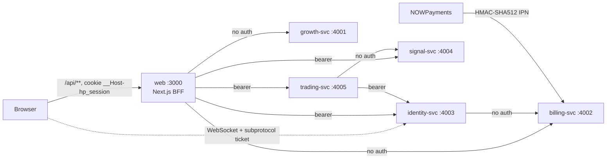
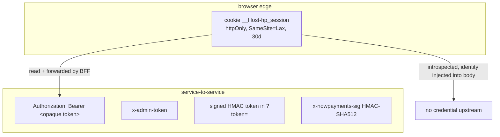

# API reference

Every HTTP entry point in the HeroPips system, in two layers: the public
Backend-for-Frontend under `apps/web/app/api/**` (the only surface a browser
reaches) and the internal NestJS service routes on ports 4001–4005. For each
endpoint you get method, path, authentication, request and response shape,
status codes, rate limits and the handler's `path:line`. Written for an
engineer who has to add, change or debug an endpoint today; behavioural depth
lives in the per-service documents linked from each section.

---

## 1. Topology and base URLs

The browser reaches Next.js on `:3000` for every HTTP request, plus **one**
direct WebSocket to identity-svc for the founding lounge (§6.6). Next fans out
server-side to five services. CORS is disabled on every service by design, and
no service port is published to the internet — see
[infrastructure](./07-infrastructure.md).



| Service | Port | Env var read by web | Default |
|---|---|---|---|
| growth-svc | 4001 | `GROWTH_URL` | `http://localhost:4001` (`apps/web/lib/api.ts:5`, `apps/web/app/api/academy/_lib.ts:13`) |
| billing-svc | 4002 | `BILLING_URL` | `http://localhost:4002` (`apps/web/lib/api.ts:6`) |
| identity-svc | 4003 | `IDENTITY_URL` | `http://localhost:4003` (`apps/web/lib/session.ts:16`) |
| signal-svc | 4004 | `SIGNAL_URL` | `http://localhost:4004` (`apps/web/lib/session.ts:17`) |
| trading-svc | 4005 | `TRADING_URL` | `http://localhost:4005` (`apps/web/lib/session.ts:18`) |

Every service exposes `GET /healthz → 200 {ok:true}`: `apps/services/growth/src/app.module.ts:27`,
`apps/services/billing/src/app.module.ts:22`, `apps/services/identity/src/app.module.ts:22`,
`apps/services/signal/src/app.module.ts:15`, `apps/services/trading/src/app.module.ts:19`.

Counts verified against source: **43 method handlers across 40 route files** in
the BFF, and **57 internal entry points** (56 HTTP + 1 WebSocket upgrade) across
the five services.

---

## 2. Conventions

### 2.1 The `ApiError` envelope

Every non-2xx response body in the system is this shape and nothing else
(`packages/contracts/src/index.ts:43-47`):

```ts
{ error_code: ErrorCode, message: string, remediation?: string }
```

`error_code` is drawn from a closed 31-value enum, so clients switch on the code
and never parse `message`. Each service installs a catch-all exception filter as
`APP_FILTER`, which guarantees that raw provider errors, stack traces and driver
messages never reach the wire:

| Service | Filter | Fallback behaviour |
|---|---|---|
| growth | `apps/services/growth/src/common/errors.ts:30-55` | `ApiHttpError` → its own body; other `HttpException` 404 → `early_access_not_found`, any other → `internal`; unknown throw → 500 `internal` with the stack logged |
| billing | `apps/services/billing/src/common/errors.ts:17-37` | same pattern, flattens anything unrecognised to 500 `internal` |
| identity | `apps/services/identity/src/common/errors.ts:17-38` | `HttpException` carrying `error_code` passes through; otherwise rewritten to `internal` |
| signal | `apps/services/signal/src/common/errors.ts` (`apiError` factory at `:21`) | as above |
| trading | `apps/services/trading/src/common/errors.ts` (`apiError` factory at `:21`) | as above |

Note the growth quirk: because its filter maps *any* Nest `HttpException` with
status 404 to `early_access_not_found` (`errors.ts:45-46`), hitting an unmatched
path on `:4001` returns `404 {error_code:"early_access_not_found", message:"Not found."}`.

At the BFF edge the same envelope is produced by three helpers:
`apps/web/app/api/_lib/bff.ts:27-30` (429), `:36-39` (502), `:43-46` (422);
`apps/web/app/api/app/_lib/proxy.ts:14-17` (401) and `:21-24` (502);
`apps/web/app/api/academy/_lib.ts:16-19` (401) and `:23-26` (502).

### 2.2 Complete error-code catalogue

All 31 codes, declared at `packages/contracts/src/index.ts:9-41`, with the exact
site that emits each one. HTTP status is the status the emitter attaches — the
same code can carry different statuses in different services, which is why the
status column lists them all.

| # | `error_code` | Status | Emitted when / where |
|---|---|---|---|
| 1 | `validation_failed` | 422 (404 in two trading cases) | Any zod `safeParse` failure. BFF: `bff.ts:43-46`. growth: `early-access.controller.ts:24,35`, `academy.controller.ts:35,50,60,70,80`, `referrals.controller.ts:24,41,51,65`, `affiliates.controller.ts:16`, `referrals.service.ts:34,90,94`, `academy.service.ts:199`. identity: `auth.service.ts:60,130`, `me.service.ts:38,51`, `chat.service.ts:52`. signal: `signals.controller.ts:21,25`. trading: `connections.controller.ts:27`, `exec.controller.ts:20`, `connections.service.ts:107`, `exec.service.ts:95`; **404** for "Position not found." / "Connection not found." (`exec.service.ts:44,63`) |
| 2 | `rate_limited` | 429 | BFF token bucket exhausted (`bff.ts:27-30`); identity redeem/login buckets (`auth.service.ts:56,134`); growth early-access 30 s resend cooldown (`early-access.service.ts:108`) |
| 3 | `early_access_duplicate` | — | **Never emitted.** Duplicate joins are signalled by `EarlyAccessJoinRes.duplicate: true` (`contracts:132`) instead |
| 4 | `early_access_not_found` | 404 | Valid status token with no matching queue row (`early-access.service.ts:349`); also growth's catch-all for any unmatched route (`common/errors.ts:46`) |
| 5 | `invalid_token` | 401 | Missing/invalid signed token. BFF: `founding/status/route.ts:10`, `early-access/status/route.ts:10`. growth: `early-access.controller.ts:48`, `early-access.service.ts:341`, `messaging.service.ts:565`. billing: `founding.service.ts:179-186` |
| 6 | `ltd_sold_out` | 410 | Seat cap reached — the `ltd_seats` UPDATE matched 0 rows (`billing/src/founding/founding.service.ts:69-75`) |
| 7 | `seat_hold_failed` | — | **Never emitted.** Hold failure surfaces as `ltd_sold_out` |
| 8 | `invoice_create_failed` | 502 | NOWPayments invoice call threw or returned non-2xx; the seat hold is rolled back first (`founding.service.ts:91-100`) |
| 9 | `ipn_signature_invalid` | 403 | Empty raw body, missing `x-nowpayments-sig`, or HMAC mismatch (`billing/src/ipn/ipn.service.ts:21-27`) |
| 10 | `ipn_unknown_order` | — | **Never emitted.** An IPN for an unknown `order_id` answers `200 {ok:true,ignored:true}` so the provider stops retrying (`ipn.service.ts:47-52`) |
| 11 | `launch_mode_forbidden` | — | **Never emitted.** `LaunchMode` (`contracts:51`) is declared but no route gates on it |
| 12 | `referral_conflict` | 409 | `POST /v1/referrals/link` when the child already has a referrer (`growth/src/referrals/referrals.service.ts:38`) |
| 13 | `referral_cycle` | 409 | The prospective parent is already a descendant of the child (`referrals.service.ts:42`) |
| 14 | `unauthorized` | 401 | No session cookie at the BFF (`proxy.ts:14-17`, `academy/_lib.ts:16-19`); missing/malformed bearer at trading (`trading/src/auth/introspect.ts:56`); wrong `x-admin-token` on the referral config PATCH (`referrals.service.ts:81`) |
| 15 | `admin_disabled` | 503 | `PATCH /v1/referrals/config` while `ADMIN_TOKEN` is unset (`referrals.service.ts:78`) |
| 16 | `auth_invalid_credentials` | 401 | Login with an unknown email or wrong password — byte-identical body for both (`identity/src/auth/auth.service.ts:142`); wrong `current_password` on password change (`me.service.ts:55`) |
| 17 | `access_code_invalid` | 401 | Redeem where billing could not verify the order **and** the code is not in `EARLY_ACCESS_CODES` (`auth.service.ts:72-78`) |
| 18 | `session_expired` | 401 | Bearer resolves to no live session — identity (`auth.service.ts:193`) and trading (`introspect.ts:60`) |
| 19 | `forbidden` | 409 / 404 | 409 on duplicate email during redeem (`auth.service.ts:95-100`); 404 when revoking a session that is unknown, foreign or already revoked (`auth.service.ts:229`) |
| 20 | `connection_limit_reached` | 409 | Paper-account cap (`trading/src/connections/connections.service.ts:71`) or live-connection cap (`:97`) from the package limits |
| 21 | `broker_unavailable` | 503 | No quote for the symbol, quote feed unreachable, or the feed returned an unparseable payload (`trading/src/quotes/provider.ts:29,39,42,46`) |
| 22 | `order_rejected` | 409 | Ordering on a non-`active` connection (`exec.service.ts:66`); deleting a connection that still has open positions (`connections.service.ts:133`) |
| 23 | `symbol_unknown` | 422 | Symbol outside `SYMBOLS` — signal (`market.controller.ts:23`) and trading (`exec.service.ts:76`) |
| 24 | `chat_flood` | 429 | Burst (1 msg / 2 s) or sustained (20 / min) per-user bucket tripped (`identity/src/chat/chat.service.ts:48`) |
| 25 | `academy_spin_used` | 409 | Daily wheel already spun this UTC day (`growth/src/academy/academy.service.ts:274`) |
| 26 | `academy_track_incomplete` | 409 | Certificate claim with lessons still outstanding on the track (`academy.service.ts:305`) |
| 27 | `academy_not_found` | 404 | No academy progress row for the user (`academy.service.ts:181,354`). The BFF treats this as the auto-provision trigger, not an error (`academy/_lib.ts:84-89`) |
| 28 | `verification_code_invalid` | 401 | Wrong 6-digit code — message carries the remaining tries; the code is burned when the 5-attempt budget is exhausted (`early-access.service.ts:183,190`) |
| 29 | `verification_code_expired` | 401 | Code older than `EA_CODE_TTL_SEC` (900 s); the row is cleared first (`early-access.service.ts:171`) |
| 30 | `verification_required` | 401 | Verify called with no code ever issued for that address, or the row was already cleared (`early-access.service.ts:162`) |
| 31 | `internal` | 500 / 502 / 503 | Catch-all in every filter; 502 at the BFF for a dead upstream (`bff.ts:36-39`, `proxy.ts:21-24`, `academy/_lib.ts:23-26`); 502 when growth cannot send a verification email (`early-access.service.ts:138`); 503 when trading cannot reach identity to introspect (`introspect.ts:34`) |

Four declared codes — `early_access_duplicate`, `seat_hold_failed`,
`ipn_unknown_order`, `launch_mode_forbidden` — have **zero emit sites** in the
entire repository (verified by search across `apps/**/src`, `apps/web/{app,lib}`
and `packages/contracts/src`). Treat them as reserved, not as responses a client
can encounter.

### 2.3 The 422 validation-failure shape

A 422 is an ordinary `ApiError`; there is **no** field-level error array anywhere
in the system. The `message` is the only carrier of detail, and it is built two
different ways:

**Services** join up to the first three zod issues as `path: message` pairs
(`growth/src/common/errors.ts:58-63`, and identically in signal and trading):

```json
{
  "error_code": "validation_failed",
  "message": "email: Invalid email; profile.experience: Invalid enum value",
  "remediation": "Fix the listed fields and retry."
}
```

identity is terser: `RedeemAccessReq` failures emit only the first issue message
(`auth.service.ts:60`), and login failures emit the literal `"Invalid input."`
(`:130`), deliberately leaking nothing about which field was wrong.

**The BFF** never forwards zod internals. Each route passes a fixed,
human-authored sentence to `validationFailed()` (`bff.ts:42-46`), so the
remediation is always `"Check the highlighted fields."`:

```json
{
  "error_code": "validation_failed",
  "message": "Order needs a connection, symbol, side and exactly one of qty or risk %.",
  "remediation": "Check the highlighted fields."
}
```

Consequence worth knowing: because the BFF validates with the *same* contract
schema before forwarding, a client that satisfies the BFF will normally satisfy
the service too, and a service-generated 422 reaching the browser means the two
schemas have drifted (or the route omitted fields, as the academy routes do).

### 2.4 Keyset pagination and cursor encoding

Three collections paginate; all three use opaque keyset cursors over
`(timestamp, id)` descending, never offsets. `next_cursor` is `null` on the last
page. `limit` is clamped server-side; an out-of-range or non-numeric value falls
back to the default rather than erroring.

| Collection | Endpoint | Cursor key | Page size | Encoder |
|---|---|---|---|---|
| Audit log | `GET /v1/me/audit` | `(created_at, id)` | 50 fixed (`identity/src/me/me.service.ts:21`) | `identity/src/common/cursor.ts:4-6` |
| Chat history | `GET /v1/chat/history` | `(created_at, id)`, encodes the **oldest** row of the page | default 50, max 100 (`chat.service.ts:9-10`) | same helper |
| Closed trades | `GET /v1/trades` | `(closed_at, id)` | see [trading](./04-features/trading.md) | inline in `trading/src/pnl/read.service.ts:113-115` |

Encoding is identical in both implementations:

```
cursor = base64url(`${ISO_timestamp}|${uuid}`)
```

`identity/src/common/cursor.ts:4-6` and `trading/src/pnl/read.service.ts:114`.
Decoding splits on the **first** `|` (`cursor.ts:11`, `read.service.ts:95`), and
the SQL predicate is `(ts < c.ts) OR (ts = c.ts AND id < c.id)` ordered
`ts DESC, id DESC`.

Two properties to be aware of, both by construction:

- Cursors are **unsigned and unauthenticated**. A client can mint any
  `(timestamp, id)` pair. This is not an authorization hole — every query is
  additionally scoped by `user_id` — but it does mean cursors are not tamper-evident.
- A malformed cursor **silently degrades to the newest page** instead of
  returning 422: `decodeCursor` returns `null` on a bad date or empty id
  (`cursor.ts:15`), and trading only assigns `before` when `sep > 0`
  (`read.service.ts:96`).

`GET /v1/academy/leaderboard` takes `?limit=` but is **not** paginated: `limit`
is floored and capped at 50, defaulting to 10 (`academy.controller.ts:21-22,92-93`).

### 2.5 Units and money

Money crossing an API boundary is always an **integer of USD minor units**
(cents) with a `_usd_minor` suffix — `equity_usd_minor`, `rpl_usd_minor`,
`fee_usd_minor` (`contracts:598-609`). The two exceptions are both billing
fields typed as floats because they mirror the payment provider: `price_usd`
(`contracts:183,205`) and `actually_paid` (`:207`). Prices and quotes are floats
with per-symbol precision from `SYMBOLS` (`contracts:391-399`). Ratios
(`confidence`, `win_rate_30d`) are floats in `[0,1]`; drawdown is integer bps.

---

## 3. Authentication

Three distinct schemes are in play. They do not overlap, and picking the wrong
one for a new endpoint is the single most common way to ship an unauthenticated
route here — see the [security](./06-security.md) threat model.



### 3.1 Session cookie — browser edge only

`__Host-hp_session`, name and attributes defined once in
`apps/web/lib/session-cookie.ts` and re-exported by `apps/web/lib/session.ts`:
`httpOnly`, `sameSite: "lax"`, `secure: true` (unconditional), `path: "/"`,
`priority: "high"`, `maxAge: 2592000` (30 days). The `__Host-` prefix makes
the cookie un-writable by any `*.heropips.com` subdomain. The value is the **opaque identity
bearer verbatim** — 32 random bytes base64url minted by identity
(`identity/src/common/crypto.ts`), of which only `sha256(token)` is persisted.

Set by exactly two handlers: `POST /api/app/auth/login`
(`apps/web/app/api/app/auth/login/route.ts:34`) and `POST /api/app/auth/redeem`
(`redeem/route.ts:49`). Cleared with `maxAge: 0` by `POST /api/app/auth/logout`
(`logout/route.ts:18`).

Server-side introspection is `getSession()`, a `React.cache()`-wrapped
`GET {IDENTITY_URL}/v1/auth/introspect` that returns `null` on any failure
(`lib/session.ts:38-51`). The `cache()` wrapper means N server components in one
render share **one** upstream call.

`middleware.ts` gates `/app/:path*` on cookie **presence only** — it never
validates (`apps/web/middleware.ts:12`). Real enforcement is `getSession()` in
the member layout. Do not treat middleware as auth.

### 3.2 Bearer token — service-to-service

`Authorization: Bearer <token>`, the same opaque token. Produced by
`forward()`, which reads the cookie and sets the header
(`apps/web/app/api/app/_lib/proxy.ts:42-52`), or by `serviceGet()` for server
components (`lib/session.ts:69-75`). `forward()` propagates **only**
`authorization` and, when a body exists, `content-type` — no cookie, user-agent,
`x-forwarded-for` or trace header crosses the boundary.

Validated two ways upstream:

- **identity** validates it itself: `requireSession()` strips the `Bearer `
  prefix, hashes, looks up the session, and throws `401 session_expired`
  (`identity/src/auth/auth.service.ts:189-196`).
- **trading** delegates: `requireUser()` rejects a missing or malformed header
  with `401 unauthorized`, then calls identity `GET /v1/auth/introspect` behind a
  30 s in-memory cache (`trading/src/auth/introspect.ts:52-63`, cache at `:12,41`).
  An unreachable identity is `503 internal` (`:34`).

**signal-svc validates nothing.** The BFF sends a bearer to `/v1/signals` and
`/v1/quotes`, but the controllers never read it (`signals.controller.ts:11`,
`market.controller.ts:7` both document "No auth by design").

### 3.3 Admin token — guarded mutations

Exactly **one** endpoint in the whole system uses it:
`PATCH /v1/referrals/config`, reading the `x-admin-token` header
(`growth/src/referrals/referrals.controller.ts:36`). The service answers
`503 admin_disabled` when `ADMIN_TOKEN` is unset and `401 unauthorized` on
mismatch (`referrals.service.ts:77-82`). There is **no BFF route** that reaches
it — it is operator-only, called directly against `:4001`.

### 3.4 Signed HMAC tokens in the query string

Not a login; a capability URL for a single resource, mailed to the user.

| Token | Payload | Secret | Verified at | Reached via |
|---|---|---|---|---|
| Founding order status | `{o: order_id}` | `STATUS_TOKEN_SECRET` | `billing/src/common/token.ts:14-33` | `GET /api/founding/status?token=` |
| Early-access status | `{e: email}` | `STATUS_TOKEN_SECRET` | `growth/src/common/token.ts:18-40` | `GET /api/early-access/status?token=` |
| Unsubscribe | `{a:"unsub", e: email}` | `STATUS_TOKEN_SECRET` | `growth/src/messaging/messaging.service.ts:562-566` | `GET|POST /api/mail/unsubscribe?token=` |

Wire format is identical in both services:
`base64url(json) + "." + hex(HMAC-SHA256(base64urlPayload, secret))`
(`billing/src/common/token.ts:8-12`, `growth/src/common/token.ts:9-16`).
**No `exp`, no `iat`, no nonce — these tokens are valid forever**, and both
services share one secret, so a token minted by growth verifies in billing.

### 3.5 Provider HMAC

`POST /v1/billing/ipn` authenticates with `x-nowpayments-sig`:
`hex(HMAC-SHA512(JSON.stringify(body, Object.keys(body).sort()), NOWPAYMENTS_IPN_SECRET))`
(`billing/src/ipn/signature.ts:8-11`). Key sorting is **top-level only**. The
raw request bytes are captured by a buffer-mode body parser
(`billing/src/app.module.ts:81-105`); dropping that flag makes every IPN 403.

### 3.6 The academy exception — identity injection

`/api/academy/**` uses a **different model** from `/api/app/**` and this is the
sharpest trap in the codebase. growth's academy endpoints accept **no bearer at
all**; instead the BFF introspects the cookie and writes `user_id` / `email` /
`display_name` into the request body (`apps/web/app/api/academy/_lib.ts:6-11`,
injection at `sync/route.ts:19`, `complete/route.ts:16`, `game/route.ts:16`,
`spin/route.ts:10`, `certificates/route.ts:17`). Client-supplied identity is
stripped first with `.omit({user_id, email, display_name})`
(`sync/route.ts:9`, `complete/route.ts:8`, `game/route.ts:8`,
`certificates/route.ts:8`), so a caller cannot claim to be someone else *through
the BFF*. Directly against `:4001` there is nothing stopping them — see §6.

### 3.7 Scheme by endpoint group

| Group | Scheme |
|---|---|
| `/api/early-access/{code,verify}`, `/api/founding/{checkout,seats}`, `/api/affiliates`, `/api/academy/leaderboard`, `/api/mail/{c,o}/[id]` | **none** (public) |
| `/api/founding/status`, `/api/early-access/status`, `/api/mail/unsubscribe` | **signed token** in `?token=` |
| `/api/app/auth/{login,redeem}` | **none** (they mint the session) |
| `/api/app/auth/logout` | cookie **optional** (best-effort revoke, always clears) |
| all other `/api/app/**` | **session cookie** → forwarded as **bearer** |
| all `/api/academy/**` except `leaderboard` | **session cookie** → identity **injected into body** |
| identity `/v1/{me,sessions,chat}/**`, `/v1/auth/{logout,introspect}` | **bearer** |
| identity `/v1/chat/ws` | **single-use 60 s ticket** in the `Sec-WebSocket-Protocol` subprotocol; no credential in the URL. The only internal path the edge proxy exposes directly (§6.6) |
| trading `/v1/**` (all) | **bearer** |
| growth `PATCH /v1/referrals/config` | **admin token** |
| billing `POST /v1/billing/ipn` | **provider HMAC** |
| everything else internal | **none** — see §6 |

---

## 4. Idempotency

There is exactly **one** client-supplied idempotency key in the system, plus
three server-side idempotency mechanisms that behave like it. Nothing accepts an
`Idempotency-Key` *header*; the key travels in the body.

### 4.1 `OrderReq.idempotency_key` — the real one

`POST /api/app/orders` → `POST /v1/orders`. Required field, 8–80 characters
after trim (`contracts:543`).

**Replay semantics:** the first statement of the order pipeline looks up
`(user_id, idempotency_key)` and, on a hit, returns the **original stored
`OrderRes` verbatim** — same `order_id`, same `status`, same `fill` — without
re-evaluating guards, re-quoting or touching the position
(`trading/src/exec/exec.service.ts:57-59`). Uniqueness is enforced by
`UNIQUE (user_id, idempotency_key)` in the DDL
(`trading/src/db/migrate.ts:59`), so the key is per-user: two members may use the
same string. The response is persisted on **every** terminal outcome, so
rejections and guard blocks replay identically too (`exec.service.ts:105,143,226`).

The web client mints the key with `crypto.randomUUID()` when the order sheet
**opens**, not on submit (`apps/web/components/app/OrderSheet.tsx:40`). Retrying
a failed submit from the same open sheet is therefore safe; closing and
reopening mints a new key and will place a second order.

Position closes synthesise their own key, `close-${positionId}-${randomUUID()}`
(`exec.service.ts:52`), which is unique per call — so
`POST /api/app/positions/[id]/close` is **not** idempotent. A double-click can
submit two closes; the second fails on the missing position rather than being
deduped.

### 4.2 Server-side idempotency without a client key

| Endpoint | Mechanism | Replay result |
|---|---|---|
| `POST /v1/billing/ipn` | `UNIQUE (payment_id, payment_status)` on `ipn_events`, inserted before any state read (`billing/src/db/repo.ts:231-245`) | `200 {ok:true, duplicate:true}`, no state change (`ipn.service.ts:38-45`) |
| `POST /v1/early-access/verify` | Existing queue row detected inside `joinTx` | `200` with the **existing** position and `duplicate: true`; no second `early_access.joined` event (`growth/src/early-access/early-access.service.ts:209-289`) |
| `POST /v1/academy/certificates` | Existing certificate for `(user, track)` returned as-is | `200` with the original `code` and `issued_at` |
| `POST /v1/academy/complete` | Idempotent per lesson slug — a repeat completion does not re-award XP | `200 AcademyMutationRes` with `awarded_xp: 0` |
| `POST /v1/referrals/attribute` | `UNIQUE (order_id, beneficiary_id, level)` with `ON CONFLICT DO NOTHING RETURNING id` (`referrals.repo.ts:166-179`) | Same `ReferralAttributionRes`, no extra commission rows and no extra events |
| `DELETE /v1/connections/:id` | Unknown or foreign id returns silently (`connections.service.ts:130`) | `204` either way |

### 4.3 Endpoints that are explicitly NOT idempotent

`POST /v1/founding/checkout` accepts no key: a double-submitted checkout form
burns **two seats** for two 120-minute hold TTLs. The only dedupe is the 48-bit
random `order_id` (`billing/src/founding/founding.service.ts:46`), which
prevents collisions, not duplicates. `POST /v1/early-access/code` is guarded by a
30-second per-address cooldown rather than a key
(`early-access.service.ts:103-117`).

---

## 5. Layer 1 — public BFF (`apps/web/app/api/**`)

Runtime is Node everywhere; no route declares the edge runtime. Every handler
returns `application/json` unless noted. Request bodies are validated against a
contracts (or locally declared) zod schema **before** any upstream call. Nothing
is cached except `GET /api/founding/seats`.

### 5.1 Rate limits

In-process leaky-bucket, keyed by `bucket:ip` where `ip` is the first
`x-forwarded-for` hop or the literal `"local"`
(`apps/web/app/api/_lib/bff.ts:17-18`). Refill is continuous:
`tokens = min(capacity, tokens + (now - ts) * capacity / 60000)` (`:21`).

| Bucket | Capacity / min | Routes |
|---|---|---|
| shared (unnamed) | 20 | `POST /api/founding/checkout`, `POST /api/affiliates`, `POST /api/app/auth/login`, `POST /api/app/auth/redeem` |
| `ea-code` | **6** | `POST /api/early-access/code` (`early-access/code/route.ts:12`) |
| `ea-verify` | **12** | `POST /api/early-access/verify` (`early-access/verify/route.ts:11`) |
| — | none | **every** `/api/app/**` proxy route and **every** `/api/academy/**` route |

The `Map` is per-process and never evicted: buckets reset on deploy, are not
shared across replicas, and the key is spoofable if `x-forwarded-for` is not
trustworthy.

### 5.2 Full BFF inventory

Auth legend: `—` public · `S` session cookie · `S→B` cookie forwarded as bearer ·
`S→body` cookie introspected, identity injected · `T` signed token in `?token=`.

| # | Method | Path | Auth | Upstream | Success | Handler |
|---|---|---|---|---|---|---|
| 1 | POST | `/api/early-access/code` | — | growth `POST /v1/early-access/code` | 200 `EarlyAccessCodeRes` | `early-access/code/route.ts:11` |
| 2 | POST | `/api/early-access/verify` | — | growth `POST /v1/early-access/verify` | 200 `EarlyAccessJoinRes` | `early-access/verify/route.ts:10` |
| 3 | GET | `/api/early-access/status` | T | growth `GET /v1/early-access/status` | 200 `EarlyAccessStatusRes` | `early-access/status/route.ts:6` |
| 4 | POST | `/api/founding/checkout` | — | billing `POST /v1/founding/checkout` | 200 `CheckoutRes` | `founding/checkout/route.ts:6` |
| 5 | GET | `/api/founding/seats` | — | billing `GET /v1/founding/seats` | 200 `SeatsRes` + `cache-control` | `founding/seats/route.ts:8` |
| 6 | GET | `/api/founding/status` | T | billing `GET /v1/founding/status` | 200 `OrderStatusRes` | `founding/status/route.ts:6` |
| 7 | POST | `/api/affiliates` | — | growth `POST /v1/affiliates/apply` | **202** `{ok:true}` | `affiliates/route.ts:9` |
| 8 | GET | `/api/mail/c/[id]` | — | growth `GET /v1/messaging/click/:id?u=` | **302** to `res.to` | `mail/c/[id]/route.ts:12` |
| 9 | GET | `/api/mail/o/[id]` | — | growth `GET /v1/messaging/open/:id` | 200 `image/gif` | `mail/o/[id]/route.ts:8` |
| 10 | GET | `/api/mail/unsubscribe` | T | growth `GET /v1/messaging/unsubscribe` | 200 `UnsubscribeRes` | `mail/unsubscribe/route.ts:6` |
| 11 | POST | `/api/mail/unsubscribe` | T (optional) | same | **always 200** `{ok:true}` | `mail/unsubscribe/route.ts:22` |
| 12 | POST | `/api/app/auth/login` | — | identity `POST /v1/auth/login` | 200 `{user}` + `Set-Cookie` | `app/auth/login/route.ts:9` |
| 13 | POST | `/api/app/auth/redeem` | — | identity `POST /v1/auth/redeem` **+** trading `GET /v1/connections` | 200 `{user}` + `Set-Cookie` | `app/auth/redeem/route.ts:9` |
| 14 | POST | `/api/app/auth/logout` | S (optional) | identity `POST /v1/auth/logout` (best-effort) | 200 `{ok:true}` + cookie cleared | `app/auth/logout/route.ts:7` |
| 15 | GET | `/api/app/me` | S→B | identity `GET /v1/me` | 200 `SessionUserRes` | `app/me/route.ts:9` |
| 16 | PATCH | `/api/app/me` | S→B | identity `PATCH /v1/me` | 200 `SessionUserRes` | `app/me/route.ts:13` |
| 17 | GET | `/api/app/me/package` | S→B | identity `GET /v1/me/package` | 200 `PackageRes` | `app/me/package/route.ts:5` |
| 18 | GET | `/api/app/me/audit` | S→B | identity `GET /v1/me/audit` | 200 `AuditListRes` | `app/me/audit/route.ts:5` |
| 19 | POST | `/api/app/me/password` | S→B | identity `POST /v1/me/password` | 200 `{ok:true}` | `app/me/password/route.ts:12` |
| 20 | GET | `/api/app/sessions` | S→B | identity `GET /v1/sessions` | 200 `SessionsRes` | `app/sessions/route.ts:5` |
| 21 | DELETE | `/api/app/sessions/[id]` | S→B | identity `DELETE /v1/sessions/:id` | 200 `{ok:true}` | `app/sessions/[id]/route.ts:5` |
| 22 | GET | `/api/app/chat/history` | S→B | identity `GET /v1/chat/history` | 200 `ChatHistoryRes` | `app/chat/history/route.ts:5` |
| 23 | POST | `/api/app/chat/messages` | S→B | identity `POST /v1/chat/messages` | 200 `ChatMessageRes` | `app/chat/messages/route.ts:7` |
| 24 | POST | `/api/app/chat/token` | S→B | identity `POST /v1/chat/ticket` | 200 `{ticket, expiresIn}`, `no-store` | `app/chat/token/route.ts` |
| 25 | GET | `/api/app/connections` | S→B | trading `GET /v1/connections` | 200 `ConnectionsRes` | `app/connections/route.ts:7` |
| 26 | POST | `/api/app/connections` | S→B | trading `POST /v1/connections` | **201** `ConnectionRes` | `app/connections/route.ts:11` |
| 27 | DELETE | `/api/app/connections/[id]` | S→B | trading `DELETE /v1/connections/:id` | **204** no body | `app/connections/[id]/route.ts:5` |
| 28 | GET | `/api/app/positions` | S→B | trading `GET /v1/positions` | 200 `PositionsRes` | `app/positions/route.ts:5` |
| 29 | POST | `/api/app/positions/[id]/close` | S→B | trading `POST /v1/positions/:id/close` | 200 `OrderRes` | `app/positions/[id]/close/route.ts:5` |
| 30 | POST | `/api/app/orders` | S→B | trading `POST /v1/orders` | 200 `OrderRes` | `app/orders/route.ts:7` |
| 31 | GET | `/api/app/trades` | S→B | trading `GET /v1/trades` | 200 `TradesRes` | `app/trades/route.ts:5` |
| 32 | GET | `/api/app/pnl/summary` | S→B | trading `GET /v1/pnl/summary` | 200 `PnlSummaryRes` | `app/pnl/summary/route.ts:5` |
| 33 | GET | `/api/app/pnl/equity` | S→B | trading `GET /v1/pnl/equity` | 200 `EquityCurveRes` | `app/pnl/equity/route.ts:5` |
| 34 | GET | `/api/app/signals` | S→B | signal `GET /v1/signals` | 200 `SignalListRes` | `app/signals/route.ts:5` |
| 35 | GET | `/api/app/quotes` | S→B | signal `GET /v1/quotes` | 200 `QuotesRes` | `app/quotes/route.ts:5` |
| 36 | GET | `/api/academy/progress` | S | growth `GET /v1/academy/progress/:id` (+ auto-`sync`) | 200 `AcademyProgressRes`, **204 anonymous** | `academy/progress/route.ts:6` |
| 37 | POST | `/api/academy/sync` | S→body | growth `POST /v1/academy/sync` | 200 `AcademyProgressRes` | `academy/sync/route.ts:11` |
| 38 | POST | `/api/academy/complete` | S→body | growth `POST /v1/academy/complete` | 200 `AcademyMutationRes` | `academy/complete/route.ts:10` |
| 39 | POST | `/api/academy/game` | S→body | growth `POST /v1/academy/game` | 200 `AcademyMutationRes` | `academy/game/route.ts:10` |
| 40 | POST | `/api/academy/spin` | S→body | growth `POST /v1/academy/spin` | 200 `AcademySpinRes` | `academy/spin/route.ts:7` |
| 41 | POST | `/api/academy/certificates` | S→body | growth `POST /v1/academy/certificates` | 200 `AcademyCertRes` | `academy/certificates/route.ts:11` |
| 42 | GET | `/api/academy/leaderboard` | — | growth `GET /v1/academy/leaderboard` | 200 `AcademyLeaderboardRes` | `academy/leaderboard/route.ts:7` |
| 43 | GET | `/api/academy/capstone` | S | trading ×2 **+** growth | 200 `{missions[], completed}` | `academy/capstone/route.ts:17` |

Paths are relative to `apps/web/app/`. All 43 handlers accounted for; the three
metadata routes (`sitemap.ts`, `robots.ts`, `manifest.ts`) are not API routes and
are documented in [web](./04-features/web.md).

### 5.3 Per-endpoint detail

#### Early access

**`POST /api/early-access/code`** — `early-access/code/route.ts:11`
Bucket `ea-code`, capacity **6/min** (`:12`). Body `EarlyAccessCodeReq =
{email}` (`contracts:99`); 422 message `"Enter a valid email address."` (`:16`).
Upstream via the unauthenticated `growth` client, response parsed as
`EarlyAccessCodeRes = {email_masked, expires_in, resend_in, dev_code?}`
(`contracts:102-110`). Statuses: 200 · 422 · 429 (local bucket **or** growth's
30 s per-address cooldown, both `rate_limited`) · 502 (`internal`, growth could
not send mail, or growth unreachable via `toResponse`). Deliberately **not** a
membership oracle — the response is identical whether or not the address is
already queued (`contracts:111-114`).

**`POST /api/early-access/verify`** — `early-access/verify/route.ts:10`
Bucket `ea-verify`, capacity **12/min** (`:11`). Body `EarlyAccessVerifyReq =
{email, code /^[0-9]{6}$/, ref?, utm?, profile?}` (`contracts:118-124`).
Response `EarlyAccessJoinRes = {position, total, code, status_token, duplicate}`
(`contracts:127-133`). Statuses: 200 · 401 (`verification_required` /
`verification_code_expired` / `verification_code_invalid`) · 422 · 429 · 502.
This call, not the code request, is what creates the queue row.

**`GET /api/early-access/status?token=`** — `early-access/status/route.ts:6`
No token → **401 `invalid_token`** produced locally (`:9-12`). Otherwise growth
`GET /v1/early-access/status`, response `EarlyAccessStatusRes = {email_masked,
position, total, code, referrals_verified, jumps}` (`contracts:136-143`).
Statuses: 200 · 401 · 404 `early_access_not_found` · 502.

#### Founding / LTD

**`POST /api/founding/checkout`** — `founding/checkout/route.ts:6`
Shared 20/min bucket. Body `CheckoutReq = {email, pay_currency?, ref?}`
(`contracts:173-177`); 422 `"Enter a valid email address."`. Response
`CheckoutRes = {order_id, invoice_url, price_usd, expires_at, status_token}`
(`contracts:180-186`). Statuses: 200 · 410 `ltd_sold_out` · 422 · 429 · 502
(`invoice_create_failed` mirrored, or local `internal`). Price is a **flat $499**
(`LTD.PRICE_USD_DEFAULT`, `contracts:294`); `expires_at` is the 120-minute seat
hold. No idempotency key — see §4.3.

**`GET /api/founding/seats`** — `founding/seats/route.ts:8`
`force-dynamic` (`:6`). Response `SeatsRes = {cap, remaining, held}`
(`contracts:166-170`) with `cache-control: public, s-maxage=5,
stale-while-revalidate=10` (`:11`) — the only cached BFF response. Statuses:
200 · 502.

**`GET /api/founding/status?token=`** — `founding/status/route.ts:6`
No token → **401 `invalid_token`** locally (`:9-12`). Response `OrderStatusRes`
(`contracts:217-231`), which includes the buyer's `email` — the address the
seat must be redeemed with. It is reachable only through the HMAC status token,
i.e. by the buyer, and it is what lets `/app/redeem?token=` prefill without
putting an address in a URL. Statuses: 200 · 401 (missing, tampered, or unknown
order) · 502. The token has no expiry (§3.4).

#### Affiliates

**`POST /api/affiliates`** — `affiliates/route.ts:9`
Shared 20/min bucket. Body `AffiliateApplyReq = {name, email, channel,
audience_size ∈ {"<1k","1k-10k","10k-50k","50k-250k","250k+"}, geo, note?}`
(`contracts:155-162`). Returns **202** `{ok:true}` (`:17`) — the application is
queued for human review, not processed. Statuses: 202 · 422 · 429 · 502.

#### Mail tracking

**`GET /api/mail/c/[id]?u=`** — `mail/c/[id]/route.ts:12`
Records the click in growth, then **302** to `res.to` (`:20`). Any failure — bad
id, tampered `u`, growth down — 302s to `NEXT_PUBLIC_SITE_URL/` instead (`:22`).
Never returns an error status: a mail link must not dead-end.

**`GET /api/mail/o/[id]`** — `mail/o/[id]/route.ts:8`
Always returns the 1×1 transparent GIF with `content-type: image/gif` and
`cache-control: no-store, max-age=0` (`:11-16`). Tracking failure is swallowed
(`:10`).

**`GET /api/mail/unsubscribe?token=`** — `mail/unsubscribe/route.ts:6`
Missing token → **422** (`:8`), not 401 — inconsistent with the two `/status`
routes. Response `UnsubscribeRes = {ok:true, email_masked}` (`contracts:285-288`).
Statuses: 200 · 401 `invalid_token` · 422 · 502.

**`POST /api/mail/unsubscribe`** — `mail/unsubscribe/route.ts:22`
RFC 8058 one-click target. **Always 200** `{ok:true}`; every error is swallowed
(`:24-29`) because a non-2xx makes the mail provider retry or flag the message.
The token is optional in the signature (`:23`), so a bodiless POST also 200s.

#### Auth

**`POST /api/app/auth/login`** — `app/auth/login/route.ts:9`
Shared 20/min bucket. Body `LoginReq = {email, password 1..200}`
(`contracts:439-442`). On upstream success the handler parses `AuthSessionRes`
(`contracts:455-459`), sets `__Host-hp_session` from `session.data.token` (`:34`) and
returns **only** `{user}` (`:33`) — the token never reaches client JS. An upstream
non-2xx is mirrored verbatim with its status (`:28`); an unparseable
`AuthSessionRes` becomes **502** (`:31`), because a 200 with a broken shape would
leave the browser thinking it is logged in. Statuses: 200 · 401
`auth_invalid_credentials` · 422 · 429 · 502.

**`POST /api/app/auth/redeem`** — `app/auth/redeem/route.ts:9`
Shared 20/min bucket. Body `RedeemAccessReq = {email, access_code 6..120,
password ≥10, display_name 2..40}` (`contracts:431-435`). `access_code` is the
Founding **order id** or an `EARLY_ACCESS_CODES` value. Same cookie/`{user}`
contract as login. After minting the session it fires a throwaway authenticated
`GET {TRADING_URL}/v1/connections` (`:40-43`) purely to trigger trading's
`ensurePaper` $10,000 seeding before first paint; the call is wrapped in
try/catch and its failure is ignored (`:44-46`) because the next connections read
self-heals. Statuses: 200 · 401 `access_code_invalid` · 409 `forbidden`
(duplicate email) · 422 · 429 · 502.

**`POST /api/app/auth/logout`** — `app/auth/logout/route.ts:7`
No body, no rate limit. Revokes upstream best-effort (`:11-15`) then **always**
returns 200 `{ok:true}` with the cookie cleared via `maxAge: 0` (`:17-19`). A
dead identity-svc must not strand a user in a logged-in state.

#### Member self-service (identity via `forward()`)

All of these are `force-dynamic`, unthrottled at the BFF, and return **401
`unauthorized`** locally when the cookie is absent (`proxy.ts:43`) or **502
`internal`** when the fetch throws (`:57`). Any other status and body is the
upstream response mirrored verbatim (`:64`).

| Route | Handler | Request | Notes |
|---|---|---|---|
| `GET /api/app/me` | `app/me/route.ts:9` | — | → `SessionUserRes` |
| `PATCH /api/app/me` | `app/me/route.ts:13` | **locally declared** `{display_name: trim 2..40}` (`:7`) | not a contracts schema; mirrors identity's `UpdateMeReq` |
| `GET /api/app/me/package` | `app/me/package/route.ts:5` | — | → `PackageRes` |
| `GET /api/app/me/audit` | `app/me/audit/route.ts:5` | `?cursor`, `?limit` whitelisted (`:6`) | → `AuditListRes`; identity ignores `limit` (page size is fixed 50) |
| `POST /api/app/me/password` | `app/me/password/route.ts:12` | **locally declared** `{current_password 1..200, new_password ≥10}` (`:7-10`) | 422 `"New password must be at least 10 characters."`; upstream revokes all sibling sessions |
| `GET /api/app/sessions` | `app/sessions/route.ts:5` | — | → `SessionsRes`, exactly one row has `current:true` |
| `DELETE /api/app/sessions/[id]` | `app/sessions/[id]/route.ts:5` | path id, `encodeURIComponent`d (`:7`) | 200 `{ok:true}` · 404 `forbidden` if unknown/foreign/already revoked |

#### Chat

**`GET /api/app/chat/history`** — `app/chat/history/route.ts:5`
Forwards `?cursor` and `?limit` (`:6`). → `ChatHistoryRes = {channel:
"founding-lounge", messages (newest LAST), next_cursor}` (`contracts:637-641`).

**`POST /api/app/chat/messages`** — `app/chat/messages/route.ts:7`
Body `ChatPostReq = {body: trim 1..2000}` (`contracts:626`); 422 `"Message must
be 1–2000 characters."` (`:10`). → `ChatMessageRes`. Statuses: 200 · 401 · 422 ·
**429 `chat_flood`** (upstream: 1 msg / 2 s and 20 / min per user) · 502.

**`POST /api/app/chat/token`** — `app/chat/token/route.ts`
Mints the WebSocket credential, which exists only because a Next route handler
cannot proxy a WebSocket. It proxies `POST /v1/chat/ticket` on identity with the
session bearer and returns `{ticket, expiresIn}` with `cache-control: no-store`.
The ticket is **opaque to the BFF and to the browser** (identity owns the
format), lives 60 s and is consumed on first use. No cookie → **401**; upstream
401 → **401**; anything else — non-2xx, unparseable body, network throw — →
**502**. It is POST, not GET, because minting a credential is a side effect and
POST puts it behind `requireSameOrigin` so a third-party page cannot farm
tickets.

The browser then opens `new WebSocket(NEXT_PUBLIC_CHAT_WS_URL, ["hp.chat.v1",
"hp.ticket." + ticket])`. The credential rides in `Sec-WebSocket-Protocol` — the
only header a browser `WebSocket` can set — so **nothing secret ever appears in
a URL**, and therefore nothing lands in Caddy's access log. The gateway echoes
back only `hp.chat.v1`. This replaces the previous design, which handed the raw
30-day session bearer to client JS and put it in the WS query string.

#### Trading

**`GET /api/app/connections`** — `app/connections/route.ts:7` → `ConnectionsRes`.
Side effect upstream: `ensurePaper` seeds a $10,000 paper account on first touch
(`trading/src/connections/connections.service.ts:40-42,60`).

**`POST /api/app/connections`** — `app/connections/route.ts:11`
Body `ConnectionCreateReq = {broker ∈ {paper,mt5,binance,kucoin}, label 1..60,
credentials{api_key?, api_secret?, passphrase?, mt5_login?, mt5_password?,
mt5_server?} = {}}` (`contracts:503-517`). Credentials are **write-only** —
accepted, AES-256-GCM encrypted at rest, never echoed. Returns **201**
`ConnectionRes` (`contracts:520-528`). Statuses: 201 · 401 · 409
`connection_limit_reached` · 422 (`validation_failed` for bad credentials) · 502.

**`DELETE /api/app/connections/[id]`** — `app/connections/[id]/route.ts:5`
Returns **204 with no body** — `forward()` special-cases 204/205/304 because
`NextResponse.json(null)` would throw a 500 (`proxy.ts:59-62`). Statuses: 204 ·
401 · 409 `order_rejected` (open positions on the connection) · 502. Unknown or
foreign ids also 204.

**`GET /api/app/positions`** — `app/positions/route.ts:5` → `PositionsRes`
(`contracts:565-577`), marked to the live quote.

**`POST /api/app/positions/[id]/close`** — `app/positions/[id]/close/route.ts:5`
No body. → `OrderRes` (`contracts:557-562`). Statuses: 200 · 401 · 404
`validation_failed` `"Position not found."` · 502. **Not idempotent** (§4.1).

**`POST /api/app/orders`** — `app/orders/route.ts:7`
Body `OrderReq = {connection_id, symbol, side, type:"market", qty? XOR
risk_pct? (0.1..2), stop?, signal_id?, idempotency_key 8..80}`
(`contracts:533-546`). The XOR is a schema-level `.refine`; 422 message
`"Order needs a connection, symbol, side and exactly one of qty or risk %."`
(`:10`). `stop` becomes **required** when sizing by `risk_pct`
(`exec.service.ts:94-96`).
Returns **200 even for a refusal** — the outcome is in the body:

| `status` | `reason` | Meaning |
|---|---|---|
| `filled` | `null` | Filled at buy@ask / sell@bid, `fill.fee_usd_minor = max(1¢, 8 bps of notional)` |
| `rejected` | `"quantity_too_small"` | Risk sizing produced a sub-epsilon quantity (`exec.service.ts:99-104`) |
| `blocked_by_guard` | Trade Guard reason string | Guard refused; emits `trade.order.blocked` (`exec.service.ts:137-155`) |

Error statuses: 401 · 409 `order_rejected` (connection not active) · 422
`symbol_unknown` / `validation_failed` · 404 `validation_failed` (unknown
connection) · 503 `broker_unavailable` (no quote) · 502.

**`GET /api/app/trades`** — `app/trades/route.ts:5`
Forwards `?cursor` and `?limit` (`:6`). → `TradesRes = {trades, next_cursor}`
(`contracts:594`). Every row is a closed round-trip by contract.

**`GET /api/app/pnl/summary`** — `app/pnl/summary/route.ts:5`
No params forwarded. → `PnlSummaryRes` (`contracts:598-609`). `sharpe_30d` is
`null` until ≥5 daily returns; `win_rate_30d` is `null` until ≥1 closed trade.

**`GET /api/app/pnl/equity`** — `app/pnl/equity/route.ts:5`
No params forwarded. → `EquityCurveRes` (`contracts:614`). **`points` is
dropped** even though the dashboard's server-side fetch requests
`?points=200` — client refetches silently get the upstream default. Upstream
*does* accept `points` (`trading/src/pnl/pnl.controller.ts:20`).

#### Signals

**`GET /api/app/signals`** — `app/signals/route.ts:5`
Forwards `?status` and `?limit` (`:6`). → `SignalListRes` (`contracts:480`).
Upstream `status ∈ {active, resolved, all}` (default `active`), `limit` 1..200
default 50 (`signal/src/signals/signals.controller.ts:7-9`).

**`GET /api/app/quotes`** — `app/quotes/route.ts:5`
Forwards `?symbols` only (`:6`), a comma-separated list; omitted means all seven
instruments. → `QuotesRes` (`contracts:490`). 422 `symbol_unknown` for anything
outside `SYMBOLS`.

Both routes require the session cookie **at the BFF**, and the bearer they
forward is discarded by signal-svc. The BFF is the entire access control for
signal data.

#### Academy

Every academy route except `leaderboard` requires the session and reaches growth
with **no bearer**; identity is injected server-side (§3.6). Growth statuses are
mirrored verbatim by `growthJson` (`academy/_lib.ts:48-56`), and a network throw
is **502 `internal`** (`:53`).

**`GET /api/academy/progress`** — `academy/progress/route.ts:6`
Anonymous → **204 with no body**, not 401, so the constant probe on every
academy page does not spam the browser console (`:8-10`). Authenticated → 200
`AcademyProgressRes` (`contracts:856-872`) via `loadProgress()`, which
auto-provisions: growth `404 + academy_not_found` triggers a `POST
/v1/academy/sync` with the session identity and returns the fresh progress
(`_lib.ts:81-92`). Client code that checks `res.ok` sees `true` with an empty
body for anonymous users and must handle it.

**`POST /api/academy/sync`** — `academy/sync/route.ts:11`
Body is `AcademySyncReq.omit({user_id, email, display_name})` (`:9`), i.e.
`{ref_code?, client?: {completions: Record<slug, {score,total,at}>}}`
(`contracts:876-892`). Identity is injected at `:19`. → 200 `AcademyProgressRes`.
This is how device-banked anonymous XP is claimed into the account, idempotent
per slug.

**`POST /api/academy/complete`** — `academy/complete/route.ts:10`
Body `AcademyCompleteReq.omit({user_id})` = `{lesson_slug, score, total}`
(`contracts:895-900`). → 200 `AcademyMutationRes = {awarded_xp, streak_bonus,
progress}` (`contracts:911-915`). Unknown slug → **422** from growth
(`academy.service.ts:199`). Repeat completion → 200 with `awarded_xp: 0`.

**`POST /api/academy/game`** — `academy/game/route.ts:10`
Body `AcademyGameReq.omit({user_id})` = `{game ∈ {long-short, risk-sizer}, won,
streak?}` (`contracts:903-908`). → 200 `AcademyMutationRes`. Past the daily play
cap the award is 0 rather than an error.

**`POST /api/academy/spin`** — `academy/spin/route.ts:7`
No client body at all; the BFF sends `{user_id}` (`:10`). → 200 `AcademySpinRes =
{prize_xp, progress}` (`contracts:918-921`). Second spin in the same UTC day →
**409 `academy_spin_used`** mirrored as-is (`academy.service.ts:274`).

**`POST /api/academy/certificates`** — `academy/certificates/route.ts:11`
Body `AcademyCertIssueReq.omit({user_id})` = `{track}` where track is
`level-0`…`level-9` or `hero-trader` (`contracts:783-787,924-927`). → 200
`AcademyCertRes = {code "HP-XXXXX-XXXXX", track, recipient, issued_at,
xp_at_issue}` (`contracts:847-853`). Idempotent. Unearned track → **409
`academy_track_incomplete`** (`academy.service.ts:305`).

**`GET /api/academy/leaderboard`** — `academy/leaderboard/route.ts:7`
**Public.** Forwards `?limit` (`:8`), capped at 50 upstream. → 200
`AcademyLeaderboardRes = {entries: [{display_name, xp, streak_days}]}`
(`contracts:936-944`). Display names and XP only, no ids or emails.

**`GET /api/academy/capstone`** — `academy/capstone/route.ts:17`
The one composite endpoint. Fans out in parallel to trading
`GET /v1/connections`, trading `GET /v1/trades?limit=100` and growth
`loadProgress()` (`:22-26`), derives two missions from **real** account state
(`:28-31`) and, when both pass and the capstone lesson is still open, completes
`paper-trading-capstone` against growth exactly once (`:34-40`) — exactly-once
because the recorded completion short-circuits on the next call (`:33`).
Response shape is local, not a contracts schema:

```json
{ "missions": [ { "id": "paper-connect", "label": "…", "done": true },
                { "id": "paper-3-trades", "label": "…", "done": false } ],
  "completed": false }
```

Statuses: 200 · 401 · mirrored `ServiceError`/`GrowthError` status · 502
(`:49-53`).

### 5.4 Deliberate soft-fails at the BFF

These return success on failure **on purpose**; do not "fix" them without
reading the comment above each one.

| Endpoint | Behaviour | Why |
|---|---|---|
| `GET /api/academy/progress` | 204 for anonymous (`:10`) | keeps the browser console clean on every academy page |
| `POST /api/mail/unsubscribe` | always 200 (`:24-29`) | RFC 8058 one-click; a bounce makes the provider retry or flag |
| `GET /api/mail/c/[id]` | 302 to `/` on any error (`:22`) | a mail link must never dead-end |
| `GET /api/mail/o/[id]` | pixel regardless (`:10`) | tracking is not worth breaking an email render |
| `POST /api/app/auth/logout` | 200 + cookie cleared regardless (`:15-19`) | a dead identity must not strand a session |
| `POST /api/app/auth/redeem` | paper-seeding touch swallowed (`:44-46`) | the next connections read self-heals |

---

## 6. Layer 2 — internal services (ports 4001–4005)

Reachable only from inside the compose network, with exactly one deliberate
exception at the edge — `/v1/chat/ws` (§6.6). **Not** protected by network policy
inside that network either — every service can call every other. Service
ports are published on the host **only** by the local overlay
(`infra/compose/docker-compose.local.yml:45,55,59,66,73` for 4001–4005); the base
topology publishes none, and the staging and production overlays publish only the
Caddy edge on 80/443 (`docker-compose.staging.yml:106-108`,
`docker-compose.production.yml:143-146`). See
[infrastructure](./07-infrastructure.md) for the full topology.

Auth legend: `—` **none** · `B` bearer · `A` admin token · `T` signed token ·
`H` provider HMAC.

### 6.1 growth-svc — `:4001`, database `hp_growth`

Internals in [early access](./04-features/growth-early-access.md),
[referrals](./04-features/growth-referrals.md),
[academy](./04-features/growth-academy.md),
[messaging](./04-features/growth-messaging.md).

| Method | Path | Auth | Request | Success | Errors | Handler |
|---|---|---|---|---|---|---|
| GET | `/healthz` | — | — | 200 `{ok:true}` | — | `app.module.ts:27` |
| POST | `/v1/early-access/code` | **—** | `EarlyAccessCodeReq` | 200 `EarlyAccessCodeRes` | 422, 429 `rate_limited`, 502 `internal` | `early-access.controller.ts:19-27` |
| POST | `/v1/early-access/verify` | **—** | `EarlyAccessVerifyReq` | 200 `EarlyAccessJoinRes` | 422, 401 `verification_required` / `verification_code_expired` / `verification_code_invalid` | `early-access.controller.ts:30-38` |
| GET | `/v1/early-access/stats` | **—** | — | 200 `EarlyAccessStatsRes` | 500 `internal` | `early-access.controller.ts:40-43` |
| GET | `/v1/early-access/status` | T | `?token` | 200 `EarlyAccessStatusRes` | 401 `invalid_token` (`:48`), 404 `early_access_not_found` | `early-access.controller.ts:45-51` |
| POST | `/v1/affiliates/apply` | **—** | `AffiliateApplyReq` | **202** `{ok:true}` | 422 | `affiliates.controller.ts:11-20` |
| GET | `/v1/messaging/unsubscribe` | T | `?token` | 200 `UnsubscribeRes` | 401 `invalid_token` (`messaging.service.ts:565`) | `messaging.controller.ts:15-18` |
| POST | `/v1/messaging/unsubscribe` | T | `?token` | 200 `UnsubscribeRes` | 401 `invalid_token` | `messaging.controller.ts:21-24` |
| GET | `/v1/messaging/open/:id` | **—** | path id | 200 `{ok:true}` | — (repo errors swallowed, `messaging.service.ts:573`) | `messaging.controller.ts:26-29` |
| GET | `/v1/messaging/click/:id` | **—** | path id, `?u` | 200 `{to}` | — (`u` is validated against `publicOrigin`, else falls back, `messaging.service.ts:582`) | `messaging.controller.ts:31-34` |
| POST | `/v1/referrals/link` | **—** | `ReferralLinkReq {child_id, parent_id}` | **201** `{ok:true}` | 422 (`self-link`), 409 `referral_conflict`, 409 `referral_cycle` | `referrals.controller.ts:19-27` |
| GET | `/v1/referrals/config` | **—** | — | 200 `ReferralConfigRes` | 500 `internal` | `referrals.controller.ts:29-32` |
| PATCH | `/v1/referrals/config` | **A** | `ReferralConfigPatchReq` | 200 `ReferralConfigRes` | 503 `admin_disabled`, 401 `unauthorized`, 422 (length ≠ `max_levels`, or sum > 5000 bps) | `referrals.controller.ts:34-44` |
| POST | `/v1/referrals/attribute` | **—** | `ReferralAttributeReq {order_id, buyer_id, total_usd_minor}` | 200 `ReferralAttributionRes` | 422 | `referrals.controller.ts:46-58` |
| POST | `/v1/referrals/reverse` | **—** | `ReferralReverseReq {order_id}` | 200 `{ok:true, reversed:N}` | 422 | `referrals.controller.ts:60-68` |
| POST | `/v1/academy/sync` | **—** | `AcademySyncReq` (**full**, incl. `user_id`) | 200 `AcademyProgressRes` | 422 | `academy.controller.ts:30-38` |
| GET | `/v1/academy/progress/:userId` | **—** | path userId | 200 `AcademyProgressRes` | 404 `academy_not_found` (`academy.service.ts:181`) | `academy.controller.ts:40-43` |
| POST | `/v1/academy/complete` | **—** | `AcademyCompleteReq` (**full**) | 200 `AcademyMutationRes` | 422 (bad body or unknown slug, `academy.service.ts:199`), 404 `academy_not_found` | `academy.controller.ts:45-53` |
| POST | `/v1/academy/game` | **—** | `AcademyGameReq` (**full**) | 200 `AcademyMutationRes` | 422, 404 `academy_not_found` | `academy.controller.ts:55-63` |
| POST | `/v1/academy/spin` | **—** | `{user_id}` (locally declared, `academy.controller.ts:19`) | 200 `AcademySpinRes` | 422, 409 `academy_spin_used`, 404 `academy_not_found` | `academy.controller.ts:65-73` |
| POST | `/v1/academy/certificates` | **—** | `AcademyCertIssueReq {user_id, track}` | 200 `AcademyCertRes` | 422, 409 `academy_track_incomplete`, 404 `academy_not_found` | `academy.controller.ts:75-83` |
| GET | `/v1/academy/certificates/verify/:code` | **—** | path code | 200 `AcademyVerifyRes {valid, certificate\|null}` | — (invalid code is `{valid:false}`, not an error) | `academy.controller.ts:85-88` |
| GET | `/v1/academy/leaderboard` | **—** | `?limit` (floor, cap 50, default 10) | 200 `AcademyLeaderboardRes` | 500 `internal` | `academy.controller.ts:90-95` |

Note the asymmetry with Layer 1: growth's academy endpoints take the **full**
contract schema including `user_id`. The BFF omits those fields from what a
client may send and re-injects them from the session — but the service accepts
whatever it is given.

### 6.2 billing-svc — `:4002`, database `hp_billing`

Order lifecycle, seat concurrency and the IPN state machine in
[billing](./04-features/billing.md). There is **no guard, interceptor or auth
middleware anywhere in this service** — the only credentials in play are the IPN
HMAC and the status token.

| Method | Path | Auth | Request | Success | Errors | Handler |
|---|---|---|---|---|---|---|
| GET | `/healthz` | — | — | 200 `{ok:true}` | — | `app.module.ts:22` |
| GET | `/v1/founding/seats` | **—** | — | 200 `SeatsRes`; `remaining = max(0, cap − granted − held)` | 500 `internal` if the `ltd_seats` row is missing | `founding/seats.controller.ts:9-12` |
| POST | `/v1/founding/checkout` | **—** | `CheckoutReq` | 200 `CheckoutRes` | 422, 410 `ltd_sold_out`, 502 `invoice_create_failed` | `founding/checkout.controller.ts:9-13` |
| GET | `/v1/founding/status` | T | `?token` (optional in the signature; the service 401s) | 200 `OrderStatusRes` | 401 `invalid_token` for missing / malformed / bad-MAC / unknown order (`founding.service.ts:179-186`) | `founding/status.controller.ts:9-12` |
| POST | `/v1/founding/verify` | **—** | `{email ≤320, order_id 1..120}` (`founding.service.ts:219-222`) | **always 200**: `{ok:true, sku}` or `{ok:false}` | none — parse failure returns `{ok:false}` (`:146`) | `founding/verify.controller.ts:9-13` |
| POST | `/v1/billing/ipn` | **H** | NOWPayments IPN JSON (`contracts:215-232`, `.passthrough()`) | 200 `{ok:true}` \| `{ok:true,duplicate:true}` \| `{ok:true,ignored:true}` | 403 `ipn_signature_invalid` (empty body, missing or bad sig) | `ipn/ipn.controller.ts:14-19` |

The IPN endpoint answers 200 for a signed-but-unparseable body and for an
unknown `order_id` (`ipn.service.ts:29-34,47-52`) so NOWPayments stops retrying;
both cases log a warning and change nothing. Ordering is arbitrated by
`PAYMENT_STATUS_RANK` (`contracts:195-198`) with a **strictly greater** gate
(`ipn.service.ts:61`) — the only "ladder" in billing, and unrelated to price.

`POST /v1/founding/verify` is called by identity during redeem
(`identity/src/auth/billing-verify.client.ts:11-16`, `content-type:
application/json`, `AbortSignal.timeout(5000)`); any transport or shape problem
degrades to `{ok:false}` and redeem falls back to `EARLY_ACCESS_CODES`.

### 6.3 identity-svc — `:4003`, database `hp_identity`

Session, crypto and audit internals in [identity](./04-features/identity.md).
Nest's default status codes apply except where `@HttpCode` overrides them: POST
would default to 201, and every POST here is explicitly pinned to 200.

| Method | Path | Auth | Request | Success | Errors | Handler |
|---|---|---|---|---|---|---|
| GET | `/healthz` | — | — | 200 `{ok:true}` | — | `app.module.ts:22` |
| POST | `/v1/auth/redeem` | **—** | `RedeemAccessReq` | 200 `AuthSessionRes` | 429 `rate_limited` (5/min/IP, checked **before** validation), 422, 401 `access_code_invalid`, 409 `forbidden` | `auth/auth.controller.ts:10-14` |
| POST | `/v1/auth/login` | **—** | `LoginReq` | 200 `AuthSessionRes` | 422 (validated **first**), 429 (10/min/IP **and** 5/min/email), 401 `auth_invalid_credentials` | `auth/auth.controller.ts:16-20` |
| POST | `/v1/auth/logout` | B | — | 200 `{ok:true}` | 401 `session_expired` | `auth/auth.controller.ts:22-26` |
| GET | `/v1/auth/introspect` | B | — | 200 `SessionUserRes` | 401 `session_expired` | `auth/auth.controller.ts:28-31` |
| GET | `/v1/sessions` | B | — | 200 `SessionsRes` | 401 `session_expired` | `auth/sessions.controller.ts:10-13` |
| DELETE | `/v1/sessions/:id` | B | path id | 200 `{ok:true}` | 401 `session_expired`, 404 `forbidden` | `auth/sessions.controller.ts:15-18` |
| GET | `/v1/me` | B | — | 200 `SessionUserRes` | 401 | `me/me.controller.ts:10-13` |
| PATCH | `/v1/me` | B | `{display_name: trim 2..40}` (locally declared, `me.service.ts:15`) | 200 `SessionUserRes` | 401, 422 | `me/me.controller.ts:15-18` |
| POST | `/v1/me/password` | B | `{current_password 1..200, new_password 10..200}` (`me.service.ts:16-19`) | 200 `{ok:true}` | 401 `session_expired` / `auth_invalid_credentials`, 422 | `me/me.controller.ts:20-24` |
| GET | `/v1/me/audit` | B | `?cursor` | 200 `AuditListRes` | 401 | `me/me.controller.ts:26-29` |
| GET | `/v1/me/package` | B | — | 200 `PackageRes` | 401 | `me/me.controller.ts:31-34` |
| GET | `/v1/chat/history` | B | `?cursor`, `?limit` (1..100, default 50) | 200 `ChatHistoryRes` | 401 | `chat/chat.controller.ts:14-22` |
| POST | `/v1/chat/messages` | B | `ChatPostReq` | 200 `ChatMessageRes` | 401, 422, 429 `chat_flood` | `chat/chat.controller.ts:24-29` |
| — | `/v1/chat/ws` (WebSocket) | 60 s ticket in `Sec-WebSocket-Protocol` | upgrade only | 101 + `{type:"chat.message", message}` frames | raw `HTTP/1.1 401 Unauthorized` then socket destroy; any other path → `socket.destroy()` | `chat/gateway.ts:45-59` |

Unlike every other row in this document, `/v1/chat/ws` is **not** proxied through
Next.js — the edge sends it straight to identity-svc. See §6.6.

`GET /v1/me/audit` accepts only `?cursor`; the page size is a fixed 50
(`me.service.ts:21`), so a forwarded `?limit` is silently ignored.

The WebSocket is **server→client only** — there is no inbound message handler.
Posting happens over `POST /v1/chat/messages`, which fires the in-process
`onMessage` hook wired to `gateway.broadcast` in `main.ts`. `?token=` is the
same opaque bearer, handed to the browser by `GET /api/app/chat/token`. At
`maxSockets` (default 500) the **oldest** socket is closed with code 1013 to make
room (`gateway.ts:63-68`).

Neither chat route checks `founding` or `role`, so any authenticated member can
read and write the "founding lounge".

### 6.4 signal-svc — `:4004`, database `hp_signal`

Model and feed internals in [signal](./04-features/signal.md).

| Method | Path | Auth | Request | Success | Errors | Handler |
|---|---|---|---|---|---|---|
| GET | `/healthz` | — | — | 200 `{ok:true}` | — | `app.module.ts:15` |
| GET | `/v1/signals` | **—** | `?status ∈ {active,resolved,all}` default `active`; `?limit` int 1..200 default 50 | 200 `SignalListRes` | 422 `validation_failed` for a bad status (`:21`) or out-of-range limit (`:25`) | `signals/signals.controller.ts:17-28` |
| GET | `/v1/quotes` | **—** | `?symbols` CSV; omitted/blank = all of `SYMBOLS` | 200 `QuotesRes` | 422 `symbol_unknown` (`:23`) | `market/market.controller.ts:13-30` |

Both controllers carry an explicit "No auth by design" comment
(`signals.controller.ts:11`, `market.controller.ts:7`): the intent is that
signals are gated at the web BFF and that trading-svc consumes `/v1/quotes`
service-to-service. Note the asymmetry between the two `status` vocabularies:
the query filter is `active|resolved|all`, while `SignalRes.status` is
`active|expired|target_hit|stopped` (`contracts:460`) — `resolved` is a filter
covering the three terminal states, not a value a signal can hold.

### 6.5 trading-svc — `:4005`, database `hp_trading`

Execution, sizing, Trade Guard and PnL formulas in
[trading](./04-features/trading.md). This is the only service where **every**
non-health route is authenticated: each handler's first statement is
`await requireUser(req, this.introspector)`.

| Method | Path | Auth | Request | Success | Errors | Handler |
|---|---|---|---|---|---|---|
| GET | `/healthz` | — | — | 200 `{ok:true}` | — | `app.module.ts:19` |
| GET | `/v1/connections` | B | — | 200 `ConnectionsRes` (seeds a $10k paper account on first touch) | 401 `unauthorized` / `session_expired`, 503 `internal` | `connections/connections.controller.ts:15-19` |
| POST | `/v1/connections` | B | `ConnectionCreateReq` | **201** `ConnectionRes` | 401, 422, 409 `connection_limit_reached` | `connections/connections.controller.ts:21-30` |
| DELETE | `/v1/connections/:id` | B | path id | **204** no body | 401, 409 `order_rejected` (open positions) | `connections/connections.controller.ts:32-37` |
| POST | `/v1/orders` | B | `OrderReq` | 200 `OrderRes` (`filled` \| `rejected` \| `blocked_by_guard`) | 401, 422 `validation_failed` / `symbol_unknown`, 404 `validation_failed`, 409 `order_rejected`, 503 `broker_unavailable` | `exec/exec.controller.ts:14-23` |
| POST | `/v1/positions/:id/close` | B | path id, no body | 200 `OrderRes` | 401, 404 `validation_failed` `"Position not found."` | `exec/exec.controller.ts:25-30` |
| GET | `/v1/pnl/summary` | B | — | 200 `PnlSummaryRes` | 401, 503 `broker_unavailable` | `pnl/pnl.controller.ts:13-17` |
| GET | `/v1/pnl/equity` | B | `?points` (non-numeric silently ignored, `:22-23`) | 200 `EquityCurveRes` | 401 | `pnl/pnl.controller.ts:19-24` |
| GET | `/v1/positions` | B | — | 200 `PositionsRes` | 401, 503 `broker_unavailable` | `pnl/pnl.controller.ts:26-30` |
| GET | `/v1/trades` | B | `?cursor` | 200 `TradesRes` | 401 | `pnl/pnl.controller.ts:32-36` |

`GET /v1/trades` accepts only `?cursor` (`pnl.controller.ts:33`), so the
`?limit` the BFF forwards — and the `?limit=100` the capstone route sends
(`academy/capstone/route.ts:24`) — is ignored.

### 6.6 The one internal path exposed at the edge — `/v1/chat/ws`

Every internal route in §6.1–6.5 is reachable only from inside the compose
network, with a single deliberate exception. The founding-lounge WebSocket server
is attached to identity-svc's **raw** HTTP server
(`apps/services/identity/src/main.ts:36`) and accepts only the exact path
`/v1/chat/ws` (`apps/services/identity/src/chat/gateway.ts:47`). Next.js serves no
`/v1/**` route and declares no `rewrites()`, so a route handler cannot proxy it —
the edge has to split the traffic itself.

Both Caddy configs therefore use two mutually exclusive `handle` blocks, evaluated
most-specific-first:

| Path | Upstream | Production | Staging |
|---|---|---|---|
| `/v1/chat/ws` | `{$CHAT_UPSTREAM}` = `identity:4003` | `infra/compose/caddy/Caddyfile.production:69-70` | `infra/compose/caddy/Caddyfile.staging:47-48` |
| everything else | `{$UPSTREAM}` = `web:3000` | `infra/compose/caddy/Caddyfile.production:80-81` | `infra/compose/caddy/Caddyfile.staging:57-58` |

`CHAT_UPSTREAM` is set at `infra/compose/docker-compose.production.yml:157` and
`infra/compose/docker-compose.staging.yml:113`. Routing this path to `web:3000`
returns 404 and silently degrades the lounge to polling.

Two consequences for this API surface:

1. **Authentication on `/v1/chat/ws` is load-bearing at the perimeter.** For
   every other internal route the BFF is the first gate and the service the
   second; here identity's `validateToken` in the upgrade handler
   (`gateway.ts:51-57`) is the *only* gate. It is a real check — an invalid or
   expired token gets a raw `HTTP/1.1 401 Unauthorized` and the socket is
   destroyed — and the token handed to the browser was re-introspected first by
   `GET /api/app/chat/token` (`apps/web/app/api/app/chat/token/route.ts:17-22`).
2. **On staging the lounge always falls back to polling, by design.** The
   `basic_auth` directive is declared before the handle blocks
   (`infra/compose/caddy/Caddyfile.staging:27-29`) so it covers the WebSocket
   handle too, and
   browsers do not attach basic-auth credentials to a JS-initiated WebSocket
   handshake. The handshake 401s and `ChatRoom` degrades to polling
   `GET /api/app/chat/history` every 10 s. Production has no basic auth
   (`infra/compose/caddy/Caddyfile.staging:12-15` documents the trade-off).

---

## 7. Security callout — internal endpoints with NO authentication

Full threat model in [security](./06-security.md). This section is the endpoint
inventory that document's controls apply to.

The system's security model is **network-perimeter only**: the browser reaches
`:3000` and — at the edge — `/v1/chat/ws` on identity-svc (§6.6), and nothing
else. Next.js is the sole authorization boundary for every HTTP endpoint; the
WebSocket is the sole endpoint that authenticates itself at the perimeter. The
services themselves mostly have no authentication at all. That is a deliberate
design, but it means the blast radius of any of the following is total:

- a service port published to the internet or a hostile network,
- SSRF from any component that can issue outbound HTTP,
- a compromised container inside the compose network,
- port-forwarding on a shared or staging host.

### 7.1 The unauthenticated inventory

**30 of the 57 internal entry points accept requests with no credential** — 18 of
growth's 23, 3 of billing's 6, 2 of identity's 15, 2 of signal's 3, and the five
`/healthz` routes. `/healthz` ×5 is intentional and harmless; the remaining **25**
are ranked below by what an attacker with network reach gains. trading-svc is the
only service with no unauthenticated route other than `/healthz`.

| Severity | Endpoint | Exposure if the port is reachable |
|---|---|---|
| **Critical** | `POST /v1/referrals/attribute` (`referrals.controller.ts:46`) | Mint arbitrary MLM commissions: caller supplies `order_id`, `buyer_id` and `total_usd_minor` and the ladder accrues real payable amounts. No proof the order exists or was paid. Idempotency only prevents *duplicating* a given `(order_id, beneficiary, level)` — it does not prevent inventing new ones. |
| **Critical** | `POST /v1/founding/verify` (`verify.controller.ts:9`) | The oracle identity trusts to grant lifetime Founding entitlement. `(email, order_id)` is the whole secret and `order_id` is only 48 bits of randomness (`founding.service.ts:46`). It is also a purchase-confirmation oracle for any known email. |
| **Critical** | `POST /v1/academy/complete`, `/game`, `/spin`, `/certificates`, `/sync` (`academy.controller.ts:30,45,55,65,75`) | Full write access to any member's academy state by passing their `user_id` in the body — grant unlimited XP, top the leaderboard, mint certificates without completing anything, and overwrite `ref_code`/`referred_by`. The BFF's identity injection is the *only* thing binding these to a session. |
| **Critical** | `POST /v1/referrals/link` (`referrals.controller.ts:19`) | Attach any user to any parent in the closure tree, once. The link is permanent (`referral_conflict` on retry), so it is also a one-shot denial: attaching a victim to an attacker-controlled parent cannot be undone through the API. |
| **High** | `POST /v1/referrals/reverse` (`referrals.controller.ts:60`) | Reverse every accrued commission on any `order_id`. Financial denial-of-service against affiliates. |
| **High** | `GET /v1/academy/progress/:userId` (`academy.controller.ts:40`) | IDOR: full progress for any user id — `display_name`, XP, streaks, `referral_code`, `referred_by`, every completion timestamp and every certificate. |
| **High** | `POST /v1/auth/redeem` (`auth.controller.ts:10`) | Account creation. Public by necessity, but the only brake is an in-process 5/min/IP bucket (`auth.service.ts:56`) that resets on deploy and is not shared across replicas. Combined with an unauthenticated `/v1/founding/verify`, a known `(email, order_id)` pair converts directly into a lifetime account. |
| **High** | `POST /v1/auth/login` (`auth.controller.ts:16`) | Credential stuffing, braked only by the same in-process buckets (10/min/IP, 5/min/email). Bypassing the BFF also bypasses its separate 20/min bucket. |
| **Medium** | `POST /v1/founding/checkout` (`checkout.controller.ts:9`) | Seat exhaustion: 500 unauthenticated calls hold the entire inventory for 120 minutes each, and each one triggers an outbound NOWPayments invoice creation. Billing has **no** rate limiting of its own. |
| **Medium** | `GET /v1/signals`, `GET /v1/quotes` (`signals.controller.ts:17`, `market.controller.ts:13`) | The paid product, free. `?limit=200` dumps the signal book including `rationale`, `model_version` and `confidence`. Both controllers document this as intentional, delegating access control entirely to the BFF. |
| **Medium** | `GET /v1/referrals/config` (`referrals.controller.ts:29`) | Discloses commission depth and the full bps ladder. Read-only; the PATCH sibling *is* admin-gated. |
| **Medium** | `POST /v1/early-access/code` (`early-access.controller.ts:19`) | Mail-sending primitive: each call dispatches real email to an attacker-chosen address. Braked only by a 30 s per-address cooldown (`early-access.service.ts:103-117`), so N addresses = N emails per 30 s. Reputation and cost risk. |
| **Low** | `POST /v1/early-access/verify` (`early-access.controller.ts:30`) | Online code guessing against a 6-digit code. Well defended: 5 attempts per issued code then burned, 15-minute TTL, and the hash is bound to the address (`common/verification.ts:9-15`). Bypassing the BFF removes only the 12/min IP bucket. |
| **Low** | `POST /v1/affiliates/apply` (`affiliates.controller.ts:11`) | Unbounded row insertion into `affiliate_applications` plus a best-effort admin notification email per application. Spam / storage. |
| **Low** | `GET /v1/messaging/open/:id`, `GET /v1/messaging/click/:id` (`messaging.controller.ts:26,31`) | Falsify email open and click analytics. `click` will not become an open redirect: the `u` parameter is only honoured when it starts with `publicOrigin/`, otherwise it falls back (`messaging.service.ts:582`). |
| **Low** | `GET /v1/academy/certificates/verify/:code`, `GET /v1/academy/leaderboard`, `GET /v1/early-access/stats` | Public by product design; already exposed through the BFF. `verify` returns `{valid:false}` rather than an error for unknown codes, so it is not an enumeration signal. |
| **Info** | `GET /healthz` ×5 | Confirms the service is up and, by implication, its identity. |
| **Info** | `GET /v1/founding/seats` | Public seat counters; already on the marketing site. |

### 7.2 Endpoints whose "authentication" is weaker than it looks

| Endpoint | Weakness |
|---|---|
| `GET /v1/founding/status`, `GET /v1/early-access/status`, `GET|POST /v1/messaging/unsubscribe` | The signed token has **no `exp`, no `iat`, no nonce** (`billing/src/common/token.ts:8-12`, `growth/src/common/token.ts:9-16`) — valid forever. The billing token is embedded in the NOWPayments `success_url`, so it travels through provider redirect chains, referrers and browser history. Both services share one `STATUS_TOKEN_SECRET`, so a token minted by growth verifies in billing and rotating the secret invalidates every link in both at once. |
| `POST /v1/billing/ipn` | The HMAC is recomputed over a **re-serialization** of the parsed body, not the received bytes (`signature.ts:27,37`), and only top-level keys are sorted. There is no timestamp or nonce window, so a captured valid IPN with a *new* `(payment_id, payment_status)` pair is accepted; only the rank ladder limits its effect. `sig_valid` is hardcoded `true` at its only write site (`ipn.service.ts:43`), so **forged-IPN attempts leave no persisted audit trail**. |
| `/v1/chat/ws` | The bearer travels in the **query string**, so it lands in access logs and proxy logs. Mitigated by `GET /api/app/chat/token` re-introspecting before handing the token out (`chat/token/route.ts:17-22`). Because the edge proxies this path directly to identity-svc (§6.6), it is also the one internal route where identity's own `validateToken` is the *first* line of defence rather than the second. |
| `PATCH /v1/referrals/config` | A single shared static secret compared with `!==` (`referrals.service.ts:80`) — not a constant-time compare, and no rotation, scoping or audit of admin actions. |
| Everything behind `forward()` | `apps/web/middleware.ts:12` gates on cookie **presence**, not validity. A forged cookie reaches the BFF, which forwards it as a bearer; identity/trading reject it with 401. Correct today, but only because every `/api/app/**` upstream validates independently. |

---

## 8. Gaps, bugs and hazards in the API surface

Documented honestly; each is verifiable at the citation.

1. **No timeouts on any BFF fetch.** There is no `AbortSignal` or
   `AbortController` anywhere in `apps/web` — every upstream call inherits the
   undici default. One hung service stalls a Next worker. Contrast the two
   places that *do* set one: `identity → billing` (5 s,
   `billing-verify.client.ts:15`) and `billing → NOWPayments` (10 s,
   `nowpayments/client.ts:41`).
2. **Rate limits are per-process and in-memory.** Both the BFF buckets
   (`bff.ts:10`) and identity's (`identity/src/common/rate-limit.ts:7`) are plain
   `Map`s. They reset on deploy, are not shared across replicas, and the BFF key
   is spoofable when `x-forwarded-for` is not trustworthy. The BFF's *entire*
   `/api/app/**` and `/api/academy/**` surface is unthrottled.
3. **`GET /api/app/pnl/equity` drops `points`** (`app/pnl/equity/route.ts:6`)
   while the dashboard's server-side fetch requests `?points=200`. Upstream
   accepts it (`pnl.controller.ts:20`), so client refetches silently render a
   differently-sampled curve than first paint.
4. **`?limit` is accepted and ignored in two places.** The BFF whitelists
   `limit` for `/api/app/trades` and `/api/app/me/audit`, but
   `trading GET /v1/trades` takes only `?cursor` (`pnl.controller.ts:33`) and
   identity's audit page size is a fixed 50 (`me.service.ts:21`).
5. **Two inconsistent "missing token" statuses.** `/api/founding/status` and
   `/api/early-access/status` answer **401 `invalid_token`**;
   `/api/mail/unsubscribe` answers **422** for the same condition
   (`mail/unsubscribe/route.ts:8`).
6. **Four error codes are declared but unreachable** —
   `early_access_duplicate`, `seat_hold_failed`, `ipn_unknown_order`,
   `launch_mode_forbidden` (`contracts:12,16,19,20`). Any client `switch`
   handling them is dead code, and `LaunchMode` (`contracts:51`) gates nothing.
7. **`validation_failed` is overloaded onto 404.** trading returns
   `404 {error_code:"validation_failed"}` for "Position not found." and
   "Connection not found." (`exec.service.ts:44,63`) — a client keying on the
   code cannot distinguish a malformed request from a missing resource.
8. **growth rewrites every unmatched-route 404 to `early_access_not_found`**
   (`common/errors.ts:45-46`), so a typo'd internal path returns a misleading
   domain error instead of a routing error.
9. **`POST /api/app/positions/[id]/close` is not idempotent.** The synthesised
   key embeds a fresh `randomUUID()` per call (`exec.service.ts:52`), so a
   double-click can submit two closes.
10. **`POST /v1/founding/checkout` accepts no idempotency key**, so a
    double-submitted form burns two seats for two 120-minute holds and creates
    two provider invoices.
11. **Cursors are unsigned and malformed ones fail open**, silently returning the
    newest page rather than 422 (`cursor.ts:15`, `read.service.ts:96`).
12. **Chat has no entitlement check.** Neither `/v1/chat/history` nor
    `/v1/chat/messages` inspects `founding` or `role`
    (`chat/chat.controller.ts:20,27`), so any member reaches the "founding
    lounge". Message bodies are stored raw and unescaped
    (`chat.service.ts:57`) — output escaping is entirely the renderer's job.
13. **`DELETE /v1/sessions/:id` does not validate the path parameter.** A
    non-UUID reaches Postgres and surfaces as a 500 `internal` via the filter
    rather than a 422.
14. **Confirmed-but-not-final payments already grant entitlement.**
    `verifyPurchase` accepts `payment_status ∈ {finished, confirmed}`
    (`founding.service.ts:150`), so `POST /v1/auth/redeem` can create a lifetime
    account while the seat is still merely `held`.
15. **`expired`, `failed` and `finished` all rank 4** in `PAYMENT_STATUS_RANK`
    (`contracts:197`) and the gate is strictly greater (`ipn.service.ts:61`).
    Once the hold sweeper marks an order `expired`, a genuinely `finished`
    payment can never advance it: the IPN answers `200 {ok:true,ignored:true}` —
    money in, no seat, no alert.
16. **The BFF's academy schemas and growth's differ by design**, and copying a
    handler from the wrong family produces a silently unauthenticated growth
    call (`academy/_lib.ts:6-11` versus `app/_lib/proxy.ts:7-11`). This is the
    single easiest mistake to make when adding a route here.
17. **`forward()` must special-case 204/205/304** or `NextResponse.json(null)`
    throws a 500 (`proxy.ts:59-62`). Any new relay helper needs the same guard.
