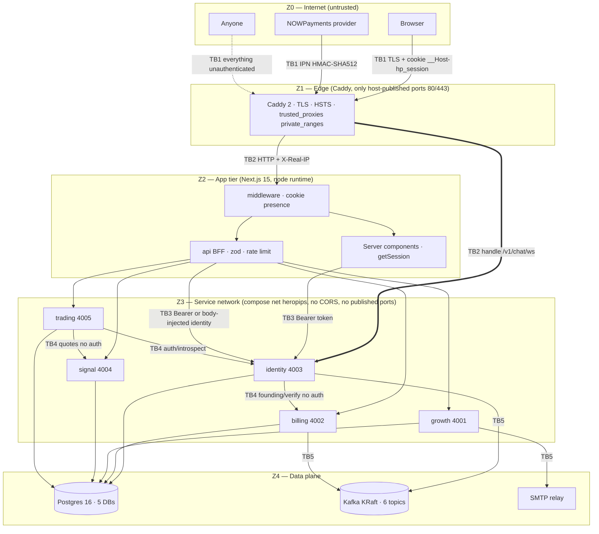

# Security

This is the security reference for the HeroPips monorepo: what is worth
protecting, where the trust boundaries are, what controls exist today (with a
`path:line` for each), and what is still broken. It is written for an engineer
who has to change auth, payments, credential handling or the edge config and
needs to know what they are standing on. Deep behaviour lives in the documents
that own it — [architecture](./01-architecture.md),
[data model](./02-data-model.md), [flows](./03-flows.md),
[per-service internals](./04-features/), [API reference](./05-api-reference.md),
[infrastructure](./07-infrastructure.md),
[operations runbook](./09-operations-runbook.md) — and is linked, not repeated.

Every finding in §13 is a ticket-shaped statement of a real defect verified in
source. Nothing here is aspirational.

---

## 1. Assets and trust boundaries

### 1.1 Assets

| Asset | Where it lives | Why it matters |
|---|---|---|
| **Broker credentials** | `connections.cred_cipher`, `base64(iv‖tag‖AES-256-GCM)` in `hp_trading` (`infra/sql/trading/0001_init.sql:35,41`), written at `apps/services/trading/src/connections/connections.service.ts:120` | Live API keys for a member's exchange account. Disclosure = someone else's money. |
| **Session bearer tokens** | Plaintext only in the `__Host-hp_session` cookie (`apps/web/lib/session.ts:13,20-26`); the database stores `sha256` only (`apps/services/identity/src/common/crypto.ts:62-65`) | A token is full account authority: trading, chat, profile, package. |
| **Payment webhook secret** | `NOWPAYMENTS_IPN_SECRET`, HMAC-SHA512 key (`apps/services/billing/src/common/config.ts:30`) | Holder can forge a `finished` payment and mint free $499 lifetime seats. |
| **Member PII** | `users` (`hp_identity`), `waitlist_entries` / `msg_contacts` / `affiliate_applications` / `academy_progress` (`hp_growth`), `orders` (`hp_billing`) | Emails, display names, IPs, user agents, self-declared trader profiles, purchase history. See §12. |
| **Seat ledger** | Single `ltd_seats` row, `tenant_id='heropips'` (`apps/services/billing/src/db/repo.ts:106-113`) | The 500-seat cap is the scarcity the entire pre-launch offer rests on. Oversell is unrecoverable revenue and trust damage. |
| **`STATUS_TOKEN_SECRET`** | Shared by billing **and** growth (`infra/compose/docker-compose.yml:156,196`) | Signs order-status links, early-access status links, email-verification code hashes and unsubscribe tokens. One key, four purposes. |
| **`CRED_KEY`** | trading-svc only (`apps/services/trading/src/common/config.ts:23-26`) | Master key for every stored broker credential. Not rotatable without re-encryption; not recoverable if lost. |

### 1.2 Trust zones



### 1.3 What crosses each boundary

| # | Boundary | Crosses | Enforced by |
|---|---|---|---|
| **TB1** | Internet → Edge | TLS 1.2+/HTTP3, `__Host-hp_session` cookie, `?token=` HMAC links, NOWPayments IPN body + `x-nowpayments-sig`, WebSocket upgrade | Caddy is the only process bound to `:80/:443` (`infra/compose/docker-compose.production.yml:143-146`); ACME certificates; `trusted_proxies static private_ranges` so a client-sent `X-Forwarded-For` is never believed (`infra/compose/caddy/Caddyfile.production:35-39`) |
| **TB2** | Edge → app tier | Plain HTTP with `X-Real-IP` injected, split across two upstreams by mutually exclusive `handle` blocks: `/v1/chat/ws` → `{$CHAT_UPSTREAM}` = `identity:4003`, everything else → `{$UPSTREAM}` = `web:3000` (`infra/compose/caddy/Caddyfile.production:68-90`, `infra/compose/docker-compose.production.yml:154,157`) | Path routing only. Anything on the compose network can reach `web:3000` or `identity:4003` directly and forge `X-Forwarded-For`. |
| **TB3** | App tier → services | `Authorization: Bearer <opaque>` for identity/trading; **no credential at all** for signal, growth academy, billing, growth early-access | `apps/web/app/api/app/_lib/proxy.ts:27-30,44-50`; body-injected identity for academy (`apps/web/app/api/academy/_lib.ts:30-33`) |
| **TB4** | Service ↔ service (east-west) | identity→billing `POST /v1/founding/verify` (unauthenticated), trading→identity introspect, trading→signal quotes | Network reachability only. No mTLS, no service tokens, no allowlists. |
| **TB5** | Service → data plane | Postgres DSNs with one shared role, Kafka plaintext `PLAINTEXT://kafka:9092`, SMTP credentials | Compose network isolation only. No TLS on Postgres or Kafka, no SASL, no per-service database role. |

---

## 2. Threat model

STRIDE per boundary. "Severity" is the impact if exploited today in production,
not the likelihood.

### TB1 — Internet → Edge

| STRIDE | Threat | Current control | Residual risk | Severity |
|---|---|---|---|---|
| Spoofing | Forged IPN callback grants a free seat | HMAC-SHA512 over the body, constant-time compare (`apps/services/billing/src/ipn/signature.ts:20-42`); the dev secret is blocked beyond local (`scripts/preflight.mjs:89`) | The callback URL in the production template points at `https://heropips.com/api/billing/ipn`, a route that **does not exist** (`.env.production.example:100`; nothing under `apps/web/app/api/billing/`), and the edge has no `handle` for it (`infra/compose/caddy/Caddyfile.production:68-90`). Genuine IPNs 404 → every payment stalls at `waiting/held`. | **Critical** |
| Spoofing | Client-injected `X-Forwarded-For` to evade per-IP limits | Caddy trusts only private-range hops (`infra/compose/caddy/Caddyfile.production:38`) and sets `X-Real-IP` (`:71,:82`) | The BFF limiter keys on `x-forwarded-for`, which Caddy does **not** set (`apps/web/app/api/_lib/bff.ts:17`). The key collapses to `"local"` for all traffic → one global 20/min bucket. | **High** |
| Tampering | MITM downgrade | HSTS `max-age=63072000; includeSubDomains; preload` from the app (`apps/web/next.config.ts`) and the **same** value from the edge (`infra/compose/caddy/Caddyfile.production:61`) | Aligned, and `scripts/preflight.mjs` warns if the two ever diverge. | Low |
| Repudiation | Forged-IPN attempts leave no trace | `ipn_events.sig_valid` column exists | Hardcoded `true` at the only call site (`apps/services/billing/src/ipn/ipn.service.ts:43`) because invalid signatures throw first (`:25-27`). A forgery campaign produces 403s and **zero** persisted evidence. | Medium |
| Info disclosure | Order enumeration via a status link | 48-bit random `order_id` (`apps/services/billing/src/founding/founding.service.ts:46`) + HMAC token | Status tokens have **no `exp`** (`apps/services/billing/src/common/token.ts:8-12`) and ride in the NOWPayments `success_url` (`apps/services/billing/src/founding/founding.service.ts:87`) → provider redirect chains, browser history, referrer logs. Valid forever. | High |
| DoS | Unthrottled POST flood | 20/min/IP shared bucket, in-memory (`apps/web/app/api/_lib/bff.ts:8-9,17-18`) | Per-process, resets on deploy, and (per the XFF bug above) effectively global. `POST /api/app/auth/login` costs a 32 MiB scrypt upstream (`apps/services/identity/src/common/crypto.ts:9-16`) — a cheap memory and latency amplifier. No WAF, no CAPTCHA, no `rate_limit` at the edge. | High |
| Elevation | — | — | The edge terminates TLS and routes; it holds no authority to elevate. | — |

### TB2 — Edge → app tier

| STRIDE | Threat | Current control | Residual risk | Severity |
|---|---|---|---|---|
| Spoofing | Direct request to `web:3000` or `identity:4003` bypassing the edge | Compose network isolation; the production overlay publishes no host port for any app container (`infra/compose/docker-compose.production.yml:124-133`, asserted in CI at `.github/workflows/ci.yml:100-113`) | Any container on the `heropips` network — including a compromised service — can hit either upstream directly and set an arbitrary `X-Forwarded-For`. | Medium |
| Tampering | Forged `__Host-hp_session` to enter `/app/**` | Middleware checks **presence only** (`apps/web/middleware.ts:13`), by design; real validation is `getSession()` in the member layout (`apps/web/app/(platform)/app/(member)/layout.tsx:11-12`) | Any private route added **outside** the `(member)` segment inherits zero server validation. The gate is a filesystem convention, not a mechanism. | Medium |
| Tampering | Open redirect on the login bounce | `?next=` is honoured only when it is exactly `/app` or `/app/`-prefixed, and never `//`-prefixed (`apps/web/components/app/AuthForms.tsx:37`). The same sanitiser guards the redeem form and both cross-links (`:43`) | `?next=` is attacker-controlled via the middleware redirect (`apps/web/middleware.ts:17`), so this check is load-bearing and untested. | Medium |
| Info disclosure | Internal error text reaching the browser | Non-`UpstreamError` throws become an opaque `502 internal` (`apps/web/app/api/_lib/bff.ts:34-40`); proxy failures become `502` (`apps/web/app/api/app/_lib/proxy.ts:20-25`) | Upstream `ApiError` bodies are mirrored verbatim (`apps/web/app/api/_lib/bff.ts:35`). Safe today because the service filters normalise everything (`apps/services/identity/src/common/errors.ts:17-38`). | Low |
| DoS | One slow upstream stalls the worker | Edge caps it: 5 s dial, 30 s response-header on the Next.js handle (`infra/compose/caddy/Caddyfile.production:85-88`) | There is **no `AbortSignal` anywhere in `apps/web`** — every upstream `fetch` inherits the undici default, so the Next worker stays blocked after Caddy has already given up. The container has 2 vCPU / 1 GiB (`infra/compose/docker-compose.production.yml:127-133`). | High |

### TB3 — App tier → service network

| STRIDE | Threat | Current control | Residual risk | Severity |
|---|---|---|---|---|
| Spoofing | Caller claims another `user_id` | `/api/app/**` forwards only the bearer (`apps/web/app/api/app/_lib/proxy.ts:44-50`); trading re-introspects every request (`apps/services/trading/src/auth/introspect.ts:52-63`) | `/api/academy/**` sends **no bearer** and injects `user_id` into the body (`apps/web/app/api/academy/_lib.ts:30-33`). growth's academy controller has no auth at all (`apps/services/growth/src/academy/academy.controller.ts:25-93`). Anyone with network reach to `growth:4001` can mint XP and certificates for any user id. | **High** |
| Spoofing | Bearer token reaches client JS | `__Host-hp_session` is `httpOnly` (`apps/web/lib/session-cookie.ts`) and **no route returns it to JS**. The chat WebSocket uses a single-use 60 s ticket (`apps/web/app/api/app/chat/token/route.ts`) carried in `Sec-WebSocket-Protocol` (`apps/web/components/app/ChatRoom.tsx`), so nothing secret enters a URL or an access log. | XSS can still mint a ticket, but it buys 60 s of chat, not 30 days of trading and PII. | Low |
| Tampering | Client-side XP or entitlement forgery | Academy XP is recomputed server-side from curriculum metadata; `founding` gates pro lessons | Undermined by the unauthenticated academy surface above. | High |
| Info disclosure | Signals and quotes leaked to non-members | "Platform-gated at the web BFF" by comment only (`apps/services/signal/src/signals/signals.controller.ts:11`, `apps/services/signal/src/market/market.controller.ts:7`) | signal-svc has **zero** authentication — verified: no `requireUser`/`introspect` anywhere in `apps/services/signal/src`. The paid product is one network hop from being free. | Medium |
| Repudiation | No trace of who called a service | identity writes `audit_log` for its own mutations (`apps/services/identity/src/common/audit.ts:9-30`) | **No other service writes any audit row** — verified: zero `audit` matches in billing/growth/signal/trading `src`. Order submission, connection creation, credential storage and payment transitions are unaudited. | **High** |
| DoS | Unthrottled proxy routes | 20/min on four POSTs plus `ea-code` 6/min and `ea-verify` 12/min | Every `/api/app/**` and `/api/academy/**` route is unthrottled at the BFF; no service except identity has any limiter. | Medium |

### TB4 — Service ↔ service (east-west)

| STRIDE | Threat | Current control | Residual risk | Severity |
|---|---|---|---|---|
| Spoofing | Anyone confirms a purchase | — | `POST /v1/founding/verify` has **no authentication** (`apps/services/billing/src/founding/verify.controller.ts:9-13`). Knowing `(email, order_id)` is sufficient; identity then creates a free `founding: true` lifetime account (`apps/services/identity/src/auth/auth.service.ts:74-104`). | **High** |
| Spoofing | Admin config mutation | `x-admin-token` shared secret, 503 when unset (`apps/services/growth/src/referrals/referrals.service.ts:77-82`) | Compared with `!==` — non-constant-time (`:80`). Referral rates are money. | Medium |
| Tampering | Trusted `sku` from billing | — | `verified.sku` is cast, not parsed, and trusted verbatim (`apps/services/identity/src/auth/billing-verify.client.ts:18-19` → `apps/services/identity/src/auth/auth.service.ts:102`); an unknown sku silently resolves to full founding entitlements (`apps/services/identity/src/me/me.service.ts:86`). | Medium |
| Elevation | Fail-open on a billing outage | Verify is wrapped in try/catch degrading to `{ok:false}` (`apps/services/identity/src/auth/auth.service.ts:74-77`) | Fails *closed* for billing, but falls back to `EARLY_ACCESS_CODES`, which are **unlimited multi-use** and compared with a case-sensitive `Array.includes` (`:71`). Compose ships `hp_dev_alpha,hp_dev_beta` locally (`infra/compose/docker-compose.local.yml:62`). | Medium |
| Info disclosure | Credentials in transit east-west | Plaintext HTTP inside the compose network | Broker credentials cross TB2 and TB3 in the clear (browser→edge is TLS; edge→web→trading is not). Acceptable only while the network is a single host. | Medium |

### TB5 — Service → data plane

| STRIDE | Threat | Current control | Residual risk | Severity |
|---|---|---|---|---|
| Spoofing | Rogue Kafka producer or consumer | — | `PLAINTEXT` listener, no SASL, no ACLs. Production at least disables auto topic creation (`infra/compose/docker-compose.production.yml:96`) while every relay still requests it (`apps/services/identity/src/outbox/relay.ts:52`). | Medium |
| Tampering | Direct database write bypassing invariants | Seat invariants live in `UPDATE … WHERE` predicates, not constraints (`apps/services/billing/src/db/repo.ts:110,190,207,224`) | `granted + held ≤ cap` is not a CHECK; nothing reconciles counters against `orders`. `ltd_seats.checksum` is declared and never used. | Medium |
| Info disclosure | Database disclosure | Passwords scrypt-hashed; session tokens sha256; verification codes HMAC'd; broker credentials AES-256-GCM | Everything else is plaintext: emails, display names, session `ip`/`user_agent`, chat bodies, trader profiles, `ipn_events.raw` (the full provider payload including amounts). No column encryption, no TDE, no at-rest volume encryption declared. | **High** |
| Elevation | One credential, five databases | — | Every service uses the **same** Postgres role (`.env.production.example:61-65`). Compromise of the least-important service yields read/write on all five databases. | **High** |
| DoS | Log or disk exhaustion | `json-file` driver capped at 20 MB × 5 per container (`infra/compose/docker-compose.production.yml:34-38`) | Postgres and Kafka volumes are unbounded; no retention policy exists for `msg_sends`, `audit_log`, `ipn_events` or `equity_snapshots`. | Medium |

---

## 3. Authentication and session security

Full route-by-route behaviour: [identity](./04-features/identity.md).
Cross-service sequence: [flows](./03-flows.md).

### 3.1 Password hashing — scrypt

| Parameter | Value | Source |
|---|---|---|
| `N` (cost) | `2**15` = 32768 | `apps/services/identity/src/common/crypto.ts:9` |
| `r` (block size) | 8 | `apps/services/identity/src/common/crypto.ts:10` |
| `p` (parallelism) | 1 | `apps/services/identity/src/common/crypto.ts:11` |
| salt | 32 random bytes | `apps/services/identity/src/common/crypto.ts:12,26` |
| derived key | 64 bytes | `apps/services/identity/src/common/crypto.ts:13,27` |
| `maxmem` | `128·N·r·2` = 67 108 864 B (64 MiB) | `apps/services/identity/src/common/crypto.ts:14-16` |
| stored form | `scrypt$32768$8$1$<b64 salt>$<b64 key>` (150 chars, standard base64) | `apps/services/identity/src/common/crypto.ts:33` |
| comparison | `timingSafeEqual` | `apps/services/identity/src/common/crypto.ts:52` |

**Why these values.** `N=2^15, r=8, p=1` is the widely used interactive-login
profile: it needs `128·N·r` = 32 MiB of memory per hash, which is exactly what
node's default `maxmem` permits — hence the explicit `×2` headroom at
`apps/services/identity/src/common/crypto.ts:16`, so a future parameter bump does
not start throwing. scrypt is chosen over bcrypt for memory-hardness and over
argon2 because it ships in `node:crypto` with **zero external dependencies**
(`apps/services/identity/src/common/crypto.ts:1`), removing a supply-chain
surface from the most security-critical code path in the repo.

**Parameters are stored, not assumed.** `verifyPassword` parses `N/r/p` out of
the stored string (`apps/services/identity/src/common/crypto.ts:37-51`), so
raising the cost does not invalidate existing hashes. It returns `false` rather
than throwing for malformed input — wrong part count, wrong prefix, non-integer
parameters, empty salt or key (`apps/services/identity/src/common/crypto.ts:38-45`) —
asserted at `apps/services/identity/test/crypto.test.ts:31-35`.

**Hazard.** The parsed `N/r/p` are trusted and bounded only by the fixed 64 MiB
`maxmem` (`apps/services/identity/src/common/crypto.ts:46-51`). A stored hash
carrying larger parameters makes node's scrypt *throw*, surfacing as
`500 internal` rather than a failed login. Safe today only because every hash
originates from `hashPassword`.

**Cost is also a DoS vector.** *[INFERENCE]* With the default
`UV_THREADPOOL_SIZE=4`, at most four hashes run concurrently and the rest queue;
`POST /v1/auth/login` is unauthenticated and each attempt allocates 32 MiB.
`DUMMY_HASH_PROMISE` also pays one 32 MiB scrypt at module import
(`apps/services/identity/src/common/crypto.ts:59`).

### 3.2 Constant-time unknown-email path

```
login(input):
  1. zod validate            → 422                       auth.service.ts:128-131
  2. rate limit IP || email  → 429                       auth.service.ts:133-135
  3. getUserByEmail                                      auth.service.ts:137
  4. verifyPassword(pw, user?.passwordHash ?? DUMMY)     auth.service.ts:140
  5. if (!user || !ok) → 401 auth_invalid_credentials    auth.service.ts:141-143
```

An unknown email verifies against `DUMMY_HASH_PROMISE`, a module-load hash of
24 random bytes (`apps/services/identity/src/common/crypto.ts:59`), so wall-clock
cost is identical whether or not the account exists. The `401` body is
**byte-identical** for unknown-email and wrong-password — pinned by
`apps/services/identity/test/auth.test.ts:114-131`.

**This effort is undone elsewhere.** `POST /v1/auth/redeem` returns
`409 forbidden` "An account with this email already exists."
(`apps/services/identity/src/auth/auth.service.ts:105-113`) — a free
account-enumeration oracle. Note also the ordering asymmetry: `redeem`
rate-limits *before* validation
(`apps/services/identity/src/auth/auth.service.ts:63-69`), `login` validates
*first* (`apps/services/identity/src/auth/auth.service.ts:140-147`), so malformed
login payloads are unlimited.

### 3.3 Session tokens

| Property | Value | Source |
|---|---|---|
| Generation | `randomBytes(32).toString("base64url")` → 43 chars, 256 bits | `apps/services/identity/src/common/crypto.ts:62-65` |
| Persisted | `sha256` hex only, 64 chars, `UNIQUE` | `apps/services/identity/src/common/crypto.ts:67-69`; `apps/services/identity/src/db/migrate.ts:17` |
| TTL | 30 days, `SESSION_TTL_DAYS` hard-coded (not env-configurable) | `apps/services/identity/src/common/config.ts:12,30` |
| Sliding renewal | On introspect, only when `now − last_seen_at ≥ 60 000 ms` | `apps/services/identity/src/auth/auth.service.ts:41,180-184` |
| Live predicate | `revoked_at IS NULL AND expires_at > now` | `apps/services/identity/src/auth/auth.service.ts:191`; SQL equivalent `apps/services/identity/src/db/repo.ts:171` |
| Lookup | One indexed `sessions ⋈ users` on `token_sha256` | `apps/services/identity/src/db/repo.ts:151-162` |
| Cookie | `__Host-hp_session`, `httpOnly`, `sameSite=lax`, `secure` (unconditional), `path=/`, `priority=high`, `maxAge=2 592 000` | `apps/web/lib/session-cookie.ts` |

The token is opaque — no claims, no signature, nothing to parse. Revocation is
therefore immediate and total, which is the whole point of not using a JWT.

**Renewal is unbounded.** Regular use slides `expires_at` forward forever —
40 iterations of `+20 d` keep a session alive in
`apps/services/identity/test/auth.test.ts:163-181`. There is no absolute lifetime
cap and no re-authentication requirement.

**The cookie `maxAge` is never refreshed** (`apps/web/lib/session.ts:25`), so the
browser imposes a hard 30-day cap the server does not, and
`AuthSessionRes.expires_at` is discarded by the BFF.

**Revocation paths.** `POST /v1/auth/logout` revokes the current session and
discards the boolean result, always answering 200
(`apps/services/identity/src/auth/auth.service.ts:215-220`);
`DELETE /v1/sessions/:id` is owner-scoped and 404s on a second attempt
(`apps/services/identity/src/auth/auth.service.ts:237-245`, guard at
`apps/services/identity/src/db/repo.ts:175-183`); `POST /v1/me/password` revokes
every *other* live session while keeping the caller's
(`apps/services/identity/src/me/me.service.ts:57-61`).
`DELETE /v1/sessions/:id` performs no UUID validation — a non-UUID reaches
Postgres and surfaces as `500 internal`.

**Password change is not atomic.** Three independently committed writes:
`setPasswordHash` → `revokeOtherSessions` → `audit`
(`apps/services/identity/src/me/me.service.ts:57-61`). A crash between the first
and second leaves the old sessions live under the new password.

### 3.4 What a database disclosure yields

| Disclosed | Attacker gains | Attacker does **not** gain |
|---|---|---|
| `users.password_hash` | Offline scrypt cracking at 32 MiB per guess — economically hostile for anything but weak passwords | Any plaintext password |
| `sessions.token_sha256` | Nothing usable. Reversing needs a sha256 preimage over 256 bits of entropy | A working bearer token |
| `sessions.ip`, `user_agent` | Device and location history per member | — |
| `early_access_verifications.code_hash` | Nothing replayable on another address — the HMAC binds `lower(email):code` (`apps/services/growth/src/common/verification.ts:9-15`) | A code usable elsewhere. But a 6-digit code plus the key is trivially brute-forced offline, so **key + table = code recovery** |
| `connections.cred_cipher` | Nothing without `CRED_KEY` (`apps/services/trading/src/common/crypto.ts:18-28`) | Plaintext broker keys |
| Everything else | Emails, display names, chat bodies, trader profiles, order history, `ipn_events.raw` in full | — |

Net: a pure database dump does not hand over sessions or broker credentials. A
dump **plus** the environment (which holds `CRED_KEY` and
`STATUS_TOKEN_SECRET`) hands over broker credentials, forged status and
unsubscribe tokens, and recoverable verification codes. Keep the secret store on
a different blast radius than the database backups.

---

## 4. Authorisation

### 4.1 The three schemes

| Scheme | Credential | Verified by | Used by |
|---|---|---|---|
| **1. Opaque bearer session** | `Authorization: Bearer <43-char base64url>` | identity: `requireSession` → `resolveToken` (`apps/services/identity/src/auth/auth.service.ts:185-208`). trading: `requireUser` → `HttpIntrospector` with a **30 s positive-only cache** (`apps/services/trading/src/auth/introspect.ts:12,23-43,52-63`) | All 14 identity `/v1/**` routes; all trading `/v1/**` routes; `/v1/chat/ws` via a single-use 60 s ticket in `Sec-WebSocket-Protocol`, never the session bearer (`apps/services/identity/src/chat/gateway.ts`) |
| **2. HMAC-signed opaque token** | `?token=base64url(json).hex(HMAC-SHA256)` | billing `verifyStatusToken` (`apps/services/billing/src/common/token.ts:14-33`); growth `verifyStatusToken` (`apps/services/growth/src/common/token.ts:18-37`) | `GET /v1/founding/status`, `GET /v1/early-access/status`, `GET+POST /v1/messaging/unsubscribe` |
| **3. Shared admin secret** | `x-admin-token` header | plain `!==` against `ADMIN_TOKEN`; `503 admin_disabled` when unset (`apps/services/growth/src/referrals/referrals.service.ts:77-82`; header binding `apps/services/growth/src/referrals/referrals.controller.ts:35-44`) | `PATCH /v1/referrals/config` only |

A fourth credential exists but is a webhook signature rather than an
authorisation scheme: the NOWPayments `x-nowpayments-sig` HMAC-SHA512 (§6). On
staging only, a fifth sits in front of everything: HTTP basic auth at the edge
(`infra/compose/caddy/Caddyfile.staging:27-29`).

Notably absent: **role enforcement**. `users.role` is written as `'member'` at
creation and surfaced in `SessionUserRes`
(`apps/services/identity/src/auth/auth.service.ts:112`), but nothing anywhere
gates on `admin`. Founding-only content is gated only in the web layer; the chat
controller requires a session but checks neither `role` nor `founding`
(`apps/services/identity/src/chat/chat.controller.ts:14-29`), so the "founding
lounge" is readable and writable by any member.

The 30 s introspect cache in trading is **positive-only**
(`apps/services/trading/src/auth/introspect.ts:24-26,41`), so a revoked session
keeps trading authority for up to 30 seconds after logout.

### 4.2 Endpoints with no authentication

Signatures and payloads: [API reference](./05-api-reference.md). Service ports
are not published outside local — `infra/compose/docker-compose.production.yml`
publishes only Caddy's `80/443` (`:143-146`), and CI fails the build if any other
port appears in a rendered staging or production compose file
(`.github/workflows/ci.yml:100-113`). So "unauthenticated" here means "anything
on the service network, or any compromised container, can call it".

| Service | Endpoint | Handler | Consequence |
|---|---|---|---|
| billing | `POST /v1/founding/verify` | `apps/services/billing/src/founding/verify.controller.ts:9-13` | `(email, order_id)` → free lifetime founding account |
| billing | `POST /v1/founding/checkout` | `apps/services/billing/src/founding/checkout.controller.ts:9-13` | Burns a seat hold for 120 min per call; no idempotency key accepted |
| billing | `GET /v1/founding/seats` | `apps/services/billing/src/founding/seats.controller.ts:9-12` | Public by design |
| billing | `POST /v1/billing/ipn` | `apps/services/billing/src/ipn/ipn.controller.ts:14-19` | HMAC-gated, unthrottled |
| growth | `POST /v1/early-access/{code,verify}`, `GET /v1/early-access/stats` | `apps/services/growth/src/early-access/early-access.controller.ts:13-51` | Public by design; code issuance is the email-bomb surface |
| growth | `POST /v1/affiliates/apply` | `apps/services/growth/src/affiliates/affiliates.controller.ts:6-14` | Unbounded PII intake |
| growth | **all 8** `/v1/academy/**` routes | `apps/services/growth/src/academy/academy.controller.ts:25-93` | Forge XP, streaks, spins and certificates for any `user_id` |
| growth | `POST /v1/referrals/{link,attribute,reverse}`, `GET /v1/referrals/config` | `apps/services/growth/src/referrals/referrals.controller.ts:19-68` | Forge commission accruals; only `PATCH config` is guarded |
| growth | `GET/POST /v1/messaging/unsubscribe`, `GET /v1/messaging/{open,click}/:id` | `apps/services/growth/src/messaging/messaging.controller.ts:11-34` | Token-gated unsubscribe; open and click take a bare send id |
| signal | `GET /v1/signals`, `GET /v1/quotes` | `apps/services/signal/src/signals/signals.controller.ts:12-18`, `apps/services/signal/src/market/market.controller.ts:8-14` | The paid product, free |
| all | `GET /healthz` | e.g. `apps/services/identity/src/app.module.ts:22-25` | Fine |

Web BFF routes that are public by design: `GET /api/academy/leaderboard` (names
and XP only), `GET /api/founding/seats`, `GET /api/mail/{o,c}/[id]`, and the four
early-access/affiliate POSTs. `GET /api/academy/progress` answers **204** rather
than 401 for anonymous callers.

---

## 5. Cryptography inventory

Every cryptographic use in the repo. All primitives come from `node:crypto`;
there is no crypto dependency anywhere.

| # | Use | Algorithm | Size / params | Key source | Rotation | If the key is lost or compromised |
|---|---|---|---|---|---|---|
| 1 | Password storage | scrypt | `N=2^15, r=8, p=1`, 32 B salt, 64 B key, `maxmem` 64 MiB (`apps/services/identity/src/common/crypto.ts:9-16`) | Per-row random salt; **no pepper, no server-side key** | Parameters are encoded in the hash (`apps/services/identity/src/common/crypto.ts:33`) and re-read on verify (`:37-51`), so cost can be raised in place; existing hashes stay valid | N/A — nothing to lose. Compromise = offline cracking only |
| 2 | Session token | CSPRNG + SHA-256 | 32 B token, sha256-hex stored (`apps/services/identity/src/common/crypto.ts:62-69`) | `randomBytes` | Not a key. Rotate by revoking sessions | N/A |
| 3 | Broker credentials at rest | **AES-256-GCM** | 12 B random IV, 16 B tag, `base64(iv‖tag‖ct)` (`apps/services/trading/src/common/crypto.ts:7-16`) | `CRED_KEY`, 32 B raw hex, **no KDF**, validated `^[0-9a-f]{64}$` at boot or the process throws (`apps/services/trading/src/common/config.ts:23-26`) | **Cannot be rotated without decrypting and re-encrypting every `connections.cred_cipher` row.** No key id in the blob, so no two-key transition window exists (`.env.production.example:17-18`) | Every stored broker credential is permanently undecryptable; members must re-enter keys. Compromise = plaintext exchange API keys |
| 4 | Order-status tokens | HMAC-SHA256 | `base64url(json) + "." + hex(mac)`, payload `{o:order_id}` (`apps/services/billing/src/common/token.ts:8-12`) | `STATUS_TOKEN_SECRET` | Rotation invalidates every outstanding status link **and** every growth link simultaneously — one secret, both services (`infra/compose/docker-compose.yml:156,196`) | Forge a token for any `order_id` → read any buyer's order (status, amount, currency, `purchase_id`) |
| 5 | Early-access status and unsubscribe tokens | HMAC-SHA256 | Same wire format; payloads `{e:email}` and `{e,a:"unsub"}` (`apps/services/growth/src/common/token.ts:9-16`; `apps/services/growth/src/messaging/messaging.service.ts:514`) | `STATUS_TOKEN_SECRET`, defaulted **in code** to `"dev-status-secret-change-me"` (`apps/services/growth/src/common/token.ts:11`) | As above | Forge status links for any address (reveals masked email, queue position, referral count) and unsubscribe anyone |
| 6 | Email verification codes | HMAC-SHA256 | `hex(HMAC(key, lower(email) + ":" + code))`, 6-digit code, 900 s TTL, 5 attempts (`apps/services/growth/src/common/verification.ts:9-15`) | `STATUS_TOKEN_SECRET`, same in-code default (`apps/services/growth/src/common/verification.ts:12`) | Rotation invalidates outstanding codes — harmless, 15 min TTL | Key + table ⇒ offline recovery of any pending code (10^6 HMACs). Address-binding still prevents cross-address replay |
| 7 | NOWPayments IPN | **HMAC-SHA512** | `hex(HMAC(secret, JSON.stringify(body, Object.keys(body).sort())))` (`apps/services/billing/src/ipn/signature.ts:8-11`) | `NOWPAYMENTS_IPN_SECRET`, must equal the provider's value | Rotate in the provider dashboard first, then here (`.env.production.example:16`). Any window where the two disagree = 100 % IPN rejection | Forge a `finished` IPN for any known `order_id` → free $499 lifetime seat |
| 8 | Admin token | none (plain compare) | — | `ADMIN_TOKEN` | Rotate on any team change (`.env.production.example:15`) | Rewrite referral payout rates |
| 9 | Staging edge basic auth | bcrypt | cost 14 hash supplied via env (`infra/compose/caddy/Caddyfile.staging:27-29`) | `STAGING_BASICAUTH_HASH` | Regenerate with `caddy hash-password` (`infra/compose/caddy/Caddyfile.staging:8`) | Staging becomes publicly readable; `X-Robots-Tag: noindex, nofollow, noarchive` is the second line of defence (`infra/compose/caddy/Caddyfile.staging:33`) |
| 10 | TLS | ACME via Caddy | Caddy defaults | Auto-issued, auto-renewed (`infra/compose/docker-compose.production.yml:152-153`) | Automatic | Certificates live in the `caddydata` volume (`infra/compose/docker-compose.production.yml:160`); losing it triggers re-issuance, not an outage |

Cross-cutting notes:

- **All four HMAC comparisons are constant-time** (`timingSafeEqual`) with an
  explicit length pre-check: billing token
  (`apps/services/billing/src/common/token.ts:23-25`), growth token
  (`apps/services/growth/src/common/token.ts:27-29`), verification
  (`apps/services/growth/src/common/verification.ts:24-26`), IPN
  (`apps/services/billing/src/ipn/signature.ts:38-41`). The **admin token is
  not** (`!==`, `apps/services/growth/src/referrals/referrals.service.ts:80`).
- **The two status-token verifiers disagree on how to split.** Billing uses the
  **first** dot (`indexOf`, `apps/services/billing/src/common/token.ts:18`);
  growth uses the **last** (`lastIndexOf`,
  `apps/services/growth/src/common/token.ts:22`). Harmless today because
  base64url contains no `.`, but it is two implementations of one wire format.
- **No key derivation anywhere.** `CRED_KEY` is used as raw AES key material;
  `STATUS_TOKEN_SECRET` is used as a raw HMAC key for three different purposes
  with no domain-separation string.
- **`decryptJson` has no production caller.** Verified: the only non-test
  reference is the export itself and
  `apps/services/trading/test/connections.spec.ts:59`. Live broker credentials
  are written and never read, because no live broker adapter executes yet —
  encryption at rest is currently write-only.

---

## 6. Payment security

Order lifecycle and the full status × seat transition table:
[billing](./04-features/billing.md). Cross-service purchase flow:
[flows](./03-flows.md).

The price is a **flat $499** (`LTD.PRICE_USD_DEFAULT`,
`packages/contracts/src/index.ts:294`). There is no seat-price ladder anywhere in
the codebase. The only ladder in billing is `PAYMENT_STATUS_RANK`
(`packages/contracts/src/index.ts:195-198`).

### 6.1 IPN signature verification, step by step

```mermaid
sequenceDiagram
  participant NP as NOWPayments
  participant C as ipn.controller
  participant S as signature.verifyIpn
  participant I as IpnService
  participant DB as hp_billing
  NP->>C: POST /v1/billing/ipn + x-nowpayments-sig
  C->>C: read req.rawBody (custom buffer parser)
  C->>I: handle(raw, sig)
  I->>I: raw empty then 403
  I->>S: verifyIpn(raw, sig, secret)
  S->>S: JSON.parse(raw); reject non-object/array/null
  S->>S: re-serialize with sorted top-level keys
  S->>S: HMAC-SHA512, length check, timingSafeEqual
  S-->>I: valid plus parsed body
  I->>I: invalid then 403 ipn_signature_invalid
  I->>I: NowPaymentsIpn.safeParse else 200 ignored
  I->>DB: INSERT ipn_events ON CONFLICT DO NOTHING
  DB-->>I: 0 rows then 200 duplicate
  I->>DB: getOrder(order_id); unknown then 200 ignored
  I->>I: rank incoming greater than current, else 200 ignored
  I->>DB: apply() inside one transaction
```

1. **Raw bytes are captured.** The Fastify adapter registers a buffer-mode
   `application/json` parser with the `rawBody` flag
   (`apps/services/billing/src/app.module.ts:81-105`, flag at `:88`). Dropping
   that `true` silently removes `req.rawBody` and **every** IPN starts 403ing.
2. **Empty body → 403** before any crypto
   (`apps/services/billing/src/ipn/ipn.service.ts:21-23`).
3. **Parse.** `JSON.parse` the raw bytes; non-JSON, array or `null` is invalid
   (`apps/services/billing/src/ipn/signature.ts:26-33`).
4. **Missing header → invalid**, but the parsed body is still returned for
   logging (`apps/services/billing/src/ipn/signature.ts:35`).
5. **Recompute.**
   `hex(HMAC-SHA512(JSON.stringify(parsed, Object.keys(parsed).sort()), secret))`
   (`apps/services/billing/src/ipn/signature.ts:37` → `:8-11`). The
   replacer-array form sorts **top-level keys only**; nested objects keep
   insertion order.
6. **Compare.** The header is `.trim().toLowerCase()`d, lengths checked, then
   `timingSafeEqual` on utf8 hex buffers
   (`apps/services/billing/src/ipn/signature.ts:38-41`).
7. **Failure → 403 `ipn_signature_invalid`**
   (`apps/services/billing/src/ipn/ipn.service.ts:25-27`).
8. **Shape check.** A signed body that fails `NowPaymentsIpn` returns
   `200 {ok:true, ignored:true}` with a warn
   (`apps/services/billing/src/ipn/ipn.service.ts:29-34`) — deliberate, so the
   provider stops retrying.

Verified independently against a hand-computed vector and asserted invariant to
source key order at `apps/services/billing/test/signature.test.ts:8-30`, with
tamper, wrong-secret, missing-header, short-sig and non-JSON rejections at
`apps/services/billing/test/signature.test.ts:43-51`.

**Hazard — the MAC covers a re-serialization, not the received bytes.** The raw
bytes matter only insofar as they parse
(`apps/services/billing/src/ipn/signature.ts:27,37`). Formatting differences are
normalised away, but any value that does not round-trip identically through
`JSON.parse`/`JSON.stringify` — big integers, duplicate keys, unusual number
formats — breaks verification.

### 6.2 Replay defence

The only replay control is the uniqueness of `(payment_id, payment_status)`:

```sql
INSERT INTO ipn_events (…) ON CONFLICT (payment_id, payment_status) DO NOTHING RETURNING id
```

`apps/services/billing/src/db/repo.ts:231-245`, index at
`apps/services/billing/src/db/migrate.ts:43`. Zero rows returned ⇒
`200 {ok:true, duplicate:true}` **before** any state is read or written
(`apps/services/billing/src/ipn/ipn.service.ts:38-45`). Byte-identical replay
asserted at `apps/services/billing/test/ipn.controller.test.ts:112-133`.

There is **no timestamp, no nonce and no freshness window**. A captured valid IPN
with a *new* `(payment_id, payment_status)` pair would be accepted; only the rank
ladder limits its effect. And the ledger insert commits on its own, *outside* the
`apply()` transaction (`apps/services/billing/src/db/repo.ts:232-244` vs
`apps/services/billing/src/ipn/ipn.service.ts:69`), so a crash between them
permanently loses that transition — the provider's retry is treated as a
duplicate and 200s.

### 6.3 Seat double-grant defences

Four independent layers, in firing order:

| # | Layer | Mechanism | Source |
|---|---|---|---|
| 1 | Exactly-once ingestion | `UNIQUE (payment_id, payment_status)` arbitrates across processes | `apps/services/billing/src/db/repo.ts:231-245` |
| 2 | Strict-rank monotonicity | `rank[incoming] > rank[current]`; a second `finished` with a different `payment_id` fails here | `apps/services/billing/src/ipn/ipn.service.ts:61` |
| 3 | Conditional UPDATE inside the transaction | `UPDATE orders SET … WHERE order_id=$1 AND seat_state='held' RETURNING id`; 0 rows ⇒ return `false` **before** touching `ltd_seats` or the outbox | `apps/services/billing/src/db/repo.ts:180-195`; the same pattern for `releaseHold` `:197-212` and `refundRelease` `:214-229` |
| 4 | SQL-expression counters | `held = held + 1`, `held-1, granted+1`, `granted-1`, `held - N` — never read-modify-write; the cap check lives in the predicate `WHERE granted + held < cap` | `apps/services/billing/src/db/repo.ts:106-113,190,207,224,263` |

*[INFERENCE]* Two transactions that pass layers 1–2 simultaneously serialize on
the `orders` row lock, and the loser re-evaluates the `seat_state='held'`
predicate against the winner's committed row (Postgres EvalPlanQual under READ
COMMITTED). What the code guarantees directly is the predicate plus `RETURNING`
plus the transaction envelope. Cap enforcement is proven behaviourally: 600
checkouts against a cap of 500 yield exactly 500 orders and 100 ×
`410 ltd_sold_out` (`apps/services/billing/test/seats.test.ts:53-72`);
double-`finished` is idempotent (`apps/services/billing/test/seats.test.ts:117-134`).

Cost of the design: the single `ltd_seats` row is a global serialization point
for every checkout, grant, release and sweep.

### 6.4 Payment hazards

| Hazard | Detail | Severity |
|---|---|---|
| **Status tokens never expire** | `{o: order_id}` HMAC with no `exp`, `iat` or nonce (`apps/services/billing/src/common/token.ts:8-12`), minted at `apps/services/billing/src/founding/founding.service.ts:77` and embedded in the NOWPayments `success_url` (`:87`). It survives provider redirect chains, browser history and any referrer leak, forever. | High |
| **`expired`/`failed`/`finished` all rank 4** | Once the 60 s sweeper marks an order `expired` (`apps/services/billing/src/db/repo.ts:247-274`), a genuinely `finished` payment can never advance it — strict `>` at `apps/services/billing/src/ipn/ipn.service.ts:61`, ranks at `packages/contracts/src/index.ts:195-198`. The IPN returns `200 {ok:true, ignored:true}`. **Money in, no seat, no alert.** Pinned by `apps/services/billing/test/ladder.test.ts:66-70`. | **Critical** |
| **`confirmed` grants before finality** | `verifyPurchase` accepts `finished` **or** `confirmed` (`apps/services/billing/src/founding/founding.service.ts:213`, pinned at `apps/services/billing/test/verify.test.ts:55-60`). identity therefore creates a lifetime founding account at rank 2, while the seat is still merely `held`. A later `expired` sweep releases that seat and revokes nothing. | High |
| **Entitlement without a counted seat** | `apply('finished')` on a `released` order marks it `finished` but never re-grants a seat (`apps/services/billing/src/ipn/ipn.service.ts:97`). Reachable: `createInvoice` times out at 10 s *after* the provider created the invoice, checkout rolls the hold back to `(waiting, released)` (`apps/services/billing/src/founding/founding.service.ts:91-100`), and the provider still fires IPNs → `finished > waiting` → `verifyPurchase` says `ok:true`. | High |
| **`sig_valid` can never be `false`** | Hardcoded `true` (`apps/services/billing/src/ipn/ipn.service.ts:43`); invalid signatures throw first. Forged-IPN attempts leave no audit trail. | Medium |
| **Repo booleans are discarded** | `IpnService` ignores the return of `grantSeat`/`releaseHold`/`refundRelease` (`apps/services/billing/src/ipn/ipn.service.ts:95,107,119-123`). A lost race produces no log, no metric, and a cheerful `200`. | Medium |
| **No rate limit on `/v1/billing/ipn` or `/v1/founding/verify`** | Neither has any limiter at any layer. | Medium |
| **Order ids are 48 bits** | `hp_ltd_${randomBytes(6).hex}` (`apps/services/billing/src/founding/founding.service.ts:46`). Combined with the unauthenticated `/v1/founding/verify`, guessing is not free but is not expensive either. | Medium |
| **No idempotency key on checkout** | A double-submitted form burns two seats for two 120-minute hold TTLs. | Medium |
| **Invoice-failure rollback leaves a zombie** | `releaseHold(orderId, {})` passes an empty patch, so the row keeps `payment_status='waiting'` with `seat_state='released'` (`apps/services/billing/src/founding/founding.service.ts:93`) and `/status` shows it pending forever. | Low |
| **Cap is seeded once** | `INSERT … ON CONFLICT (tenant_id) DO NOTHING` (`apps/services/billing/src/db/migrate.ts:57-61`). Changing `LTD_SEAT_CAP` after first boot has zero effect. | Low |

---

## 7. Input validation

### 7.1 zod at every boundary

Validation is not middleware. There is no Nest `ValidationPipe` and no
`class-validator` anywhere; every controller receives `unknown` and the service
calls `safeParse` as its first act. `packages/contracts/src/index.ts` is the
single source of truth for the shapes crossing services.

| Layer | Pattern | Example |
|---|---|---|
| Browser → BFF | Contracts schema `safeParse` **before** any upstream call, then `validationFailed(detail)` | `apps/web/app/api/_lib/bff.ts:42-47` |
| BFF → service | Response `schema.parse` on the way back, so contract drift is a 502 not a render crash | `apps/web/lib/session.ts:80` |
| Service controller | `@Body() body: unknown` → `Req.safeParse(body ?? {})` → `422 validation_failed` with the first zod issue | `apps/services/billing/src/founding/checkout.controller.ts:9-13` → `apps/services/billing/src/founding/founding.service.ts:37-42`; `apps/services/identity/src/auth/auth.service.ts:66-69` |
| Query params | Manual clamping, not zod | chat `limit` clamp 1..100 (`apps/services/identity/src/chat/chat.service.ts:28-30`); leaderboard cap (`apps/services/growth/src/academy/academy.controller.ts:90-93`) |
| Normalisation as defence | Emails `trim().toLowerCase()` capped at 254/320 chars; `ref` upper-cased; `display_name` trimmed 2..40 | `packages/contracts/src/index.ts:96,405`; `apps/services/identity/src/me/me.service.ts:15` |

**The 422 contract.** Every validation failure returns the frozen `ApiError`
shape `{error_code, message, remediation?}` with
`error_code: "validation_failed"` and HTTP **422** — never 400. Enforced by the
global `APP_FILTER` in each service
(`apps/services/identity/src/common/errors.ts:17-38`, registered
`apps/services/identity/src/app.module.ts:76`), verified end-to-end at
`apps/services/identity/test/app.test.ts:116-123`. The BFF emits the same shape
(`apps/web/app/api/_lib/bff.ts:42-47`). Anything that is not an `HttpException`
carrying an `error_code` is logged and flattened to
`500 {error_code:"internal", message:"Unexpected error."}` — internals never
leak.

**Validation gaps.**

- `DELETE /v1/sessions/:id` does not validate the UUID; a malformed id reaches
  Postgres and surfaces as `500 internal`
  (`apps/services/identity/src/auth/sessions.controller.ts:15-18`).
- Pagination cursors are unsigned and unauthenticated
  (`apps/services/identity/src/common/cursor.ts:4-17`); a malformed cursor
  silently restarts from the newest page instead of erroring. Harmless because
  every list query is scoped server-side.
- `GET /v1/chat/history?limit=` (empty string) returns exactly **1** message —
  `Number("")` is `0` and `Number.isInteger(0)` is true — while `?limit=abc`
  returns 50 (`apps/services/identity/src/chat/chat.service.ts:29-30`).
- `LTD_PRICE_USD` is `Number(...)` with no validation
  (`apps/services/billing/src/common/config.ts:34`); a malformed value yields
  `NaN`.
- The billing-verify response is **cast, not parsed**
  (`apps/services/identity/src/auth/billing-verify.client.ts:18-19`), so `sku`
  crosses a trust boundary unvalidated.
- Chat bodies are stored **raw and unescaped** by design
  (`apps/services/identity/src/chat/chat.service.ts:56-57`, asserted at
  `apps/services/identity/test/chat.test.ts:42-53`). Escaping is a render-time
  concern; any consumer that `innerHTML`s a message has stored XSS. React
  escapes by default, which is the only reason this is safe today.

### 7.2 SQL injection posture

**No raw string interpolation into SQL exists in any service.** Two mechanisms
only:

1. **Drizzle query builders** with typed operands — `eq`, `and`, `lt`, `ne`,
   `desc` — which emit parameterised statements. Every repo read and write in
   identity (`apps/services/identity/src/db/repo.ts:98-269`) and billing
   (`apps/services/billing/src/db/repo.ts:94-290`) uses this form.
2. **Drizzle `sql` template tags** for the few expression-level writes:
   `held = held + 1`, `granted + held < cap`, `held - ${released.length}`
   (`apps/services/billing/src/db/repo.ts:106-113,190,263`). The `${}` slots in
   these tags are bound parameters, not string splices, and the interpolated
   values are numbers derived server-side.

Bootstrap DDL is a static string per service, executed on boot with no user
input (`apps/services/identity/src/db/migrate.ts:3-60`). The versioned mirror in
`infra/sql/` is applied by `scripts/db.mjs` with a checksum ledger, and CI proves
apply/verify/seed are idempotent by running the sequence twice
(`.github/workflows/ci.yml:164-174`).

Residual: the boot DDL is what actually runs, and the Drizzle table declarations
are descriptive only — nothing invokes drizzle-kit. Editing `schema.ts` alone
changes nothing at runtime. Details in [data model](./02-data-model.md).

---

## 8. Web security

### 8.1 Content-Security-Policy

Built **per request** in `apps/web/middleware.ts:26-36` from
`apps/web/lib/security-headers.ts`. It has to live there: the policy carries a
nonce, and the `headers()` entry in `next.config.ts` is evaluated once at build
time. `next.config.ts` therefore sends **no** CSP — two CSP headers are enforced
as an intersection, so a nonce-less build-time copy would block every script.

Middleware sets the policy twice on purpose:

1. on the **response**, which is what the browser enforces;
2. on the **forwarded request headers**, which is how Next discovers the nonce
   (`app-render` → `getScriptNonceFromHeader`) and stamps it onto its own
   bootstrap, hydration and flight-data scripts, plus anything rendered by
   `next/script`. Without step 2, `'strict-dynamic'` blocks Next's own runtime
   and the page renders but never hydrates.

The layout reads the same nonce from the `x-hp-nonce` request header
(`NONCE_HEADER`) for the one hand-written inline script
(`apps/web/app/layout.tsx`, `THEME_INIT`).

| Directive | Value | Reading |
|---|---|---|
| `default-src` | `'self'` | Fallback for anything unlisted: same-origin only. |
| `script-src` | `'self' 'nonce-<per-request>' 'strict-dynamic'` + `'unsafe-eval'` in dev + GA + Clarity | **No `'unsafe-inline'`.** The two executable inline scripts (theme bootstrap, GA consent bootstrap) carry the nonce; `'strict-dynamic'` extends trust to the elements Next's runtime creates. The GA/Clarity host names are ignored by any browser that implements `'strict-dynamic'` and exist only for Safari < 15.4, which falls back to the allow-list. `'unsafe-eval'` is gated on `NODE_ENV === "development"` and never ships. |
| `style-src` | `'self' 'unsafe-inline'` | Required by Next's critical-CSS inlining, the font-variable style attributes on `<body>`, and the React inline `style` objects `packages/ui` uses. Low value to an attacker relative to `script-src`. |
| `img-src` | `'self' data: blob:` + GA | `data:`/`blob:` for satori-generated OG images and canvas. |
| `media-src` | `'self'` | The hero video is local. |
| `font-src` | `'self'` | `next/font/google` self-hosts the woff2 under `/_next/static/media`; no Google origin is ever contacted. |
| `connect-src` | `'self'` + `chatWsOrigin` + GA + Clarity | The WS origin is derived from `NEXT_PUBLIC_CHAT_WS_URL` at **build time**. Changing the WS host at runtime silently breaks the socket — you must rebuild. |
| `object-src` | `'none'` | Explicit: CSP2 browsers do not fall back to `default-src` for it. |
| `worker-src` | `'self'` | The service worker at `/sw.js`. `child-src` is deliberately absent — setting it would block workers in CSP2 browsers that ignore `worker-src`. |
| `manifest-src` | `'self'` | `/manifest.webmanifest`. |
| `frame-src` | `'none'` | Nothing is embedded. |
| `frame-ancestors` | `'none'` | Clickjacking. Modern equivalent of `X-Frame-Options`. |
| `base-uri` | `'self'` | Blocks `<base>` injection redirecting every relative URL. |
| `form-action` | `'self'` | Blocks exfiltration by re-targeting a form POST. |
| `upgrade-insecure-requests` | present outside dev | Omitted in development, where `ws://localhost:4003` has no TLS to upgrade to. |

Production policy with GA4 and Clarity configured, verbatim:

```
default-src 'self'; script-src 'self' 'nonce-<base64>' 'strict-dynamic' https://www.googletagmanager.com https://www.clarity.ms https://*.clarity.ms; style-src 'self' 'unsafe-inline'; img-src 'self' data: blob: https://*.google-analytics.com https://www.googletagmanager.com; media-src 'self'; font-src 'self'; connect-src 'self' wss://heropips.com https://*.google-analytics.com https://*.analytics.google.com https://www.googletagmanager.com https://*.clarity.ms; object-src 'none'; worker-src 'self'; manifest-src 'self'; frame-src 'none'; frame-ancestors 'none'; base-uri 'self'; form-action 'self'; upgrade-insecure-requests
```

Three deliberate omissions, all documented at the top of
`apps/web/lib/security-headers.ts`:

- **`require-trusted-types-for 'script'`** would break `next/script`: its
  client-side injector assigns `el.innerHTML = dangerouslySetInnerHTML.__html`
  (`next/dist/client/script.js`, `loadScript`), a Trusted Types sink with no
  policy, so the GA consent bootstrap would throw before `gtag.js` loads.
- **`block-all-mixed-content`** is deprecated and subsumed by
  `upgrade-insecure-requests`.
- **`report-uri`/`report-to`** — there is still no CSP reporting endpoint, so
  violations remain invisible in production.

The three `<script type="application/ld+json">` blocks need no nonce: a data
block returns from HTML's "prepare the script element" steps before the inline
CSP check, so it is neither executed nor `script-src`-restricted.

Analytics origins enter the policy only when the corresponding env var is set,
so an unconfigured deployment has a strictly tighter policy.

### 8.2 Other security headers

| Header | Value | Source |
|---|---|---|
| `X-Frame-Options` | `DENY` | `apps/web/next.config.ts` (edge backstop, `?`-defaulted) |
| `X-Content-Type-Options` | `nosniff` | `apps/web/next.config.ts` (edge backstop `infra/compose/caddy/Caddyfile.production`) |
| `Referrer-Policy` | `strict-origin-when-cross-origin` | `apps/web/next.config.ts` (edge backstop) |
| `Permissions-Policy` | 21 features denied — `accelerometer`, `ambient-light-sensor`, `attribution-reporting`, `bluetooth`, `browsing-topics`, `camera`, `display-capture`, `geolocation`, `gyroscope`, `idle-detection`, `local-fonts`, `magnetometer`, `microphone`, `midi`, `payment`, `screen-wake-lock`, `serial`, `usb`, `xr-spatial-tracking` at `()`, plus `autoplay=(self)` and `fullscreen=(self)` | `apps/web/next.config.ts` (`PERMISSIONS_POLICY`) |
| `Strict-Transport-Security` | `max-age=63072000; includeSubDomains; preload` | `apps/web/next.config.ts`, same value at the edge |
| `Cross-Origin-Opener-Policy` | `same-origin` | `apps/web/next.config.ts` (edge backstop) |
| `Cross-Origin-Resource-Policy` | `same-origin` | `apps/web/next.config.ts` (edge backstop) |
| `Origin-Agent-Cluster` | `?1` | `apps/web/next.config.ts` (edge backstop) |
| `X-DNS-Prefetch-Control` | `off` | `apps/web/next.config.ts` (edge backstop) |
| `X-Powered-By` | suppressed | `poweredByHeader: false`; the edge also strips `Server` and `X-Powered-By` |

**`Cross-Origin-Embedder-Policy` is intentionally absent.** `require-corp` would
block the GA4 loader and the Clarity tag — neither `googletagmanager.com` nor
`clarity.ms` sends `Cross-Origin-Resource-Policy` — and `credentialless` only
moves the failure to whichever vendor needs its own cookies. Fonts are not the
blocker (`next/font/google` self-hosts them). Nothing in the app needs
cross-origin isolation: no `SharedArrayBuffer`, no wasm threads, no
high-resolution timers. COOP alone still severs the `window.opener`
relationship, which is the part that matters here.

**Edge layer.** `infra/compose/caddy/Caddyfile.production` sets HSTS hard (same
`max-age=63072000; includeSubDomains; preload` as the app — preflight fails on a
divergence, because the browser keeps whichever value it saw last) and every
other security header with Caddy's `?` prefix, which writes the header **only
when the response carries none**. The app therefore stays the single source of
truth while the edge still covers responses the app never produced: its own
error pages, or a dead upstream. Staging runs the same block with a shorter,
non-preload `max-age` and an added `X-Robots-Tag`. The CSP is never duplicated at
the edge, and both Caddyfiles say why.

`trusted_proxies static private_ranges`
(`infra/compose/caddy/Caddyfile.production:44`) means Caddy never believes a
client-supplied `X-Forwarded-For`, and all three handles inject
`X-Real-IP: {remote_host}` (`:103,:114,:125`). Transport timeouts: 5 s dial
everywhere, 30 s response-header on the Next.js handle only — the WebSocket
handle deliberately omits it because the connection is long-lived
(`:104-107,:115-118,:128-131`).

Caching posture: content-hashed assets and the icons get
`max-age=31536000, immutable` (`infra/compose/caddy/Caddyfile.production:76-77`);
`/sw.js` and the manifest get `no-cache, must-revalidate` (`:85-86`) so clients
cannot pin an old shell. The crawler artifacts (`/llms.txt`, `/llms-full.txt`,
`/robots.txt`, `/sitemap.xml`) are deliberately **not** matched at the edge — the
app owns their `Cache-Control` in `apps/web/next.config.ts`, and an edge rule
would silently override it (`:79-81`).

**Staging differs deliberately.** The staging edge adds HTTP basic auth
(`infra/compose/caddy/Caddyfile.staging:31-34`) and
`X-Robots-Tag: noindex, nofollow, noarchive` as a second line of defence if that
gate is ever relaxed (`infra/compose/caddy/Caddyfile.staging:43`). Because basic
auth also covers the WebSocket handle and browsers do not attach basic-auth
credentials to a JS-initiated handshake, the founding lounge 401s on staging and
the client falls back to polling — accepted and documented at
`infra/compose/caddy/Caddyfile.staging:12-15`. Production has no basic auth.

### 8.3 Cookies

| Cookie | Flags | Source |
|---|---|---|
| `__Host-hp_session` | `httpOnly`, `sameSite=lax`, `secure` (unconditional), `path=/`, `priority=high`, `maxAge=2592000` | `apps/web/lib/session-cookie.ts` |
| `hp_theme` | `samesite=lax`, `max-age=31536000`, **not** `httpOnly` (read server-side in the root layout to avoid a flash) | `apps/web/lib/theme.ts` |

The `__Host-` prefix is browser-enforced: the cookie is rejected unless it is
`Secure`, `Path=/` and carries no `Domain`, which makes it un-writable by any
`*.heropips.com` subdomain and closes the session-fixation / login-CSRF
overwrite a plain host cookie allows. `secure` is unconditional rather than
derived from `NODE_ENV`, so a mis-set env can no longer ship a non-Secure
30-day bearer. No cookie partitioning.

### 8.4 CSRF posture

There is no CSRF token anywhere. The defence is structural and rests on four
properties holding simultaneously:

1. **`SameSite=Lax`** (`apps/web/lib/session.ts:22`) — the cookie is not sent on
   cross-site POST/PUT/DELETE. It *is* sent on top-level cross-site GET
   navigations, which is why no state-changing GET may ever be added.
2. **JSON-only API.** Every mutating BFF route parses a JSON body via a zod
   schema. An HTML form cannot produce `application/json`; it can only produce
   `application/x-www-form-urlencoded`, `multipart/form-data` or `text/plain`,
   none of which parse — `safeParse` fails and returns 422.
3. **`form-action 'self'`** (`apps/web/lib/security-headers.ts`) blocks a form on
   another origin from targeting this one.
4. **`frame-ancestors 'none'`** (`apps/web/lib/security-headers.ts`) prevents
   framing-based attacks.

Residual risks:

- **Any future state-changing GET is an immediate CSRF hole.** Two already exist
  and are safe only by accident: `GET /api/mail/unsubscribe` and
  `GET /v1/messaging/unsubscribe` mutate suppression state, but they are
  token-authenticated rather than cookie-authenticated
  (`apps/services/growth/src/messaging/messaging.service.ts:561-570`), so
  `SameSite` is irrelevant to them.
- **No `Origin`/`Sec-Fetch-Site` check** on any route. Property 2 above is the
  only thing stopping a simple-request forgery, and it depends on every future
  handler continuing to require JSON.
- **`POST /api/mail/unsubscribe` always returns 200** and swallows every error
  (RFC 8058 one-click), so it is also an unauthenticated no-feedback endpoint.

---

## 9. Secrets management

### 9.1 Where each secret lives

Ports, container names and env plumbing: [infrastructure](./07-infrastructure.md).

| Secret | Local | Staging / Production | Consumed by |
|---|---|---|---|
| `POSTGRES_PASSWORD` | compose default `hp` (`infra/compose/docker-compose.yml:44,57`) | `.env.production` rendered from a secret store (`.env.production.example:43`) | all five services via `DATABASE_URL_*` |
| `NOWPAYMENTS_API_KEY` | `sandbox-key` (`apps/services/billing/src/common/config.ts:29`) | live key (`.env.production.example:96`) | billing → provider |
| `NOWPAYMENTS_IPN_SECRET` | `dev-ipn-secret`, shared with the mock (`infra/compose/docker-compose.yml:125,191`) | live IPN secret (`.env.production.example:99`) | billing IPN verification |
| `STATUS_TOKEN_SECRET` | `dev-status-secret-change-me`, **defaulted in code** (`apps/services/growth/src/common/token.ts:11`, `apps/services/growth/src/common/verification.ts:12`, `apps/services/billing/src/common/config.ts:31`) | `openssl rand -base64 32` (`.env.production.example:103`) | billing + growth, three purposes |
| `CRED_KEY` | 64-hex dev key in compose with a scan pragma (`infra/compose/docker-compose.yml:266-267`) and a second dev key in code (`apps/services/trading/src/common/config.ts:8-10`) | `openssl rand -hex 32` (`.env.production.example:113`) | trading AES-256-GCM |
| `ADMIN_TOKEN` | unset ⇒ admin mutations 503 (`apps/services/growth/src/common/config.ts:42`) | `openssl rand -base64 32` (`.env.production.example:127`) | growth `PATCH /v1/referrals/config` |
| `SMTP_URL` | `smtp://mailpit:1025`, no auth (`infra/compose/docker-compose.yml:158`) | real relay with credentials (`.env.production.example:121`) | growth transport |
| `EARLY_ACCESS_CODES` | `hp_dev_alpha,hp_dev_beta` (`infra/compose/docker-compose.local.yml:62`) | empty (`.env.production.example:107`) | identity redeem bypass |
| `EARLY_ACCESS_DEV_CODE` | `123456` locally | forced empty by the production overlay (`infra/compose/docker-compose.production.yml:105`) and hard-failed by preflight | growth verification |
| `STAGING_BASICAUTH_USER` / `_HASH` | n/a | bcrypt hash from `caddy hash-password` (`infra/compose/caddy/Caddyfile.staging:8,27-29`) | staging edge only |
| `GA4_API_SECRET` | unset | measurement-protocol secret (`.env.production.example:134`) | growth server-side GA4 |
| TLS private keys | n/a | `caddydata` volume, ACME-managed (`infra/compose/docker-compose.production.yml:160`) | Caddy |

Transport in all environments is a `.env.<environment>` file on disk read by
compose. `.env` and `*.local` are gitignored (`.gitignore`), `.dockerignore`
excludes `.env` and `.env.*` from every build context, and the production
template states the real control plainly: render it at deploy time from SOPS /
Vault / Secrets Manager / Doppler and do not write secrets to disk
(`.env.production.example:5-8`). **There is no secret-store integration in the
repo** — no compose `secrets:`, no `*_FILE` env convention, no init container.
Secrets are plain environment variables, visible in `docker inspect` and in
`/proc/<pid>/environ`.

### 9.2 The preflight placeholder guard

`scripts/preflight.mjs` is the gate every `stack:*` script runs before starting
anything. Four secret-relevant checks:

- **Required-variable matrix** per service (`scripts/preflight.mjs:39-82`),
  derived from each service's `common/config.ts`. `local` warns; staging and
  production **fail** (`scripts/preflight.mjs:250,265-267`).
- **Known dev placeholders** (`scripts/preflight.mjs:88-103`, evaluated at
  `:301-317`) — each entry carries its blast radius, which is why they do not get
  casually overridden: `NOWPAYMENTS_IPN_SECRET=dev-ipn-secret` ("anyone could
  forge a paid-order IPN and mint free lifetime seats"),
  `NOWPAYMENTS_API_KEY=sandbox-key`,
  `STATUS_TOKEN_SECRET=dev-status-secret-change-me`, `POSTGRES_PASSWORD=hp`, and
  **both** dev `CRED_KEY` values — the in-code one
  (`scripts/preflight.mjs:95`) and the compose one (`:100`). Comparison is
  case-insensitive (`scripts/preflight.mjs:312`).
- **Shape and entropy.** `CRED_KEY` must match `^[0-9a-f]{64}$` or preflight
  fails with the fix command (`scripts/preflight.mjs:275-279`) — catching at the
  gate what trading-svc would otherwise throw on at boot
  (`apps/services/trading/src/common/config.ts:24-26`).
  `STATUS_TOKEN_SECRET`, `NOWPAYMENTS_IPN_SECRET`, `ADMIN_TOKEN` and
  `POSTGRES_PASSWORD` shorter than 24 chars **warn**
  (`scripts/preflight.mjs:320-327`) — length as a crude entropy proxy that
  reliably catches `changeme`.
- **Two hard production failures beyond placeholders:** `EARLY_ACCESS_DEV_CODE`
  present at all (`scripts/preflight.mjs:281-287` — "every verification code
  becomes this value AND is echoed to the caller"), and a `PUBLIC_ORIGIN` that is
  localhost or non-`https` (`:289-298` — "session cookies are Secure-flagged").

**CI proves the guard actually blocks.** The `infra` job copies
`.env.local.example` to `.env.staging` and fails the build if preflight *exits
zero* (`.github/workflows/ci.yml:151-162`) — "a zero exit here means dev
credentials could reach a real environment".

Remaining weaknesses: the placeholder list is **exact-match on known strings**,
so `dev-ipn-secret2` passes; short secrets only warn; and preflight validates the
env file, not the running container.

### 9.3 `secret-scan.mjs` and the other CI guards

`.github/workflows/ci.yml` runs, in order: secret scan (`:32-33`), brand guard
(`:35-36`), documentation integrity via `scripts/docs-check.mjs` (`:40-41`, which
validates links and `path:line` citations across `docs/engineering` so a rename
cannot silently orphan them), typecheck (`:43-44`), lint (`:46-47`), tests
(`:49-50`), dependency audit (`:54-56`) and build (`:58-59`).

**Rules** (`scripts/secret-scan.mjs:16-23`):

| Pattern | Label |
|---|---|
| `-----BEGIN (RSA\|EC\|OPENSSH\|PGP) PRIVATE KEY-----` | private key |
| `AKIA[0-9A-Z]{16}` | AWS access key |
| `sk_live_[0-9a-zA-Z]{20,}` | Stripe live key |
| `xox[baprs]-[0-9a-zA-Z-]{10,}` | Slack token |
| `ghp_[0-9a-zA-Z]{36}` | GitHub token |
| `(?<![A-Za-z0-9])[0-9a-f]{64}(?![A-Za-z0-9])` | raw 256-bit hex secret (verify) |

**Scope.** Walks the whole repo from `process.cwd()` (`scripts/secret-scan.mjs:66`).
Skips 10 directory names plus **any** directory whose name starts with `.next`
(`:10-14`) — that prefix rule exists because `.next-build`, `.next-audit` and
`.next-founder` all carry Next's random deployment ids and trip the 64-hex
heuristic. Path allowlist of 6 regexes including `pnpm-lock.yaml`, binary and
media extensions, and the scanner itself (`:25-29`). Files over 2 MB are skipped
(`:61`). Exit 1 with a count (`:68-71`).

**The `secret-scan:allow` pragma** (`scripts/secret-scan.mjs:36`). Deliberate dev
and test values are annotated at the site; the marker is honoured on the
**matching line or the line immediately above** (`:48`), and nowhere else. This is
scoped per line *by design* so an annotation can never mask a different secret
elsewhere in the same file — do not convert it to a file-level marker. Two live
uses, both the 64-hex rule firing on a dev AES key:

- `infra/compose/docker-compose.yml:266` — "local compose default; every other
  environment injects its own"
- `apps/services/trading/src/common/config.ts:9` — "dev-only placeholder,
  self-documenting above"

**Dependency audit.** `pnpm audit --prod --audit-level high` is
`continue-on-error` **only on a pull request** and therefore blocking on main
(`.github/workflows/ci.yml:54-56`) — the stated reason being that a fresh
upstream advisory should not block an unrelated fix, but must still be dealt with
before it lands.

**Limits.** `secret-scan.mjs` is a regex scan of the working tree, not of git
history — a secret committed and later removed is invisible. There is no entropy
rule beyond the 64-hex heuristic, so a base64 or 32-hex secret passes. And
`pnpm lint` now runs in CI (`.github/workflows/ci.yml:46-47`) but all five
services define `lint: echo ok` (e.g.
`apps/services/identity/package.json:11`), so only `apps/web` is actually linted.

### 9.4 Rotation procedure per secret

| Secret | Procedure | Blast radius during rotation |
|---|---|---|
| `POSTGRES_PASSWORD` | `ALTER ROLE … PASSWORD`, update all five `DATABASE_URL_*`, roll every service | All services down until restarted. Same role for all five databases, so it is all-or-nothing. |
| `NOWPAYMENTS_API_KEY` | Rotate in the provider dashboard, then env, then restart billing | Checkout fails between the two steps. |
| `NOWPAYMENTS_IPN_SECRET` | Provider dashboard **first**, then env, then restart billing (`.env.production.example:16`) | Every IPN in the window 403s. NOWPayments retries, so the window must be short. |
| `STATUS_TOKEN_SECRET` | Rotate env, restart **billing and growth together** | Invalidates *simultaneously*: every outstanding order-status link, every early-access status link, every unsubscribe link in every already-delivered email, and every pending verification code. Unsubscribe breakage is a compliance problem, not an inconvenience. Mitigation would be a keyed verifier accepting old+new for one TTL — not implemented. |
| `ADMIN_TOKEN` | Rotate env, restart growth. Unset ⇒ 503 rather than open (`apps/services/growth/src/referrals/referrals.service.ts:77-78`) | `PATCH /v1/referrals/config` only. |
| `SMTP_URL` | Rotate at the relay, then env, restart growth | Sends fail and are **ledgered** as `status:'failed'` (`apps/services/growth/src/messaging/messaging.service.ts:550-553`), so nothing is silently lost. |
| `STAGING_BASICAUTH_HASH` | `docker run --rm caddy:2-alpine caddy hash-password --plaintext '<pw>'` (`infra/compose/caddy/Caddyfile.staging:8`), then env, then restart caddy | Staging only. |
| **`CRED_KEY`** | **Cannot be rotated in place.** No key id is stored in the blob (`apps/services/trading/src/common/crypto.ts:10-16`), so there is no two-key window. Rotation requires reading every `connections.cred_cipher`, `decryptJson` with the old key, `encryptJson` with the new, writing back, then swapping the env — a migration that does not exist in `scripts/`. Back the key up before the first live connection (`.env.production.example:110-113`). | Losing the key permanently orphans every stored credential; members must re-enter broker keys. |
| TLS | ACME handles renewal | None. |
| `EARLY_ACCESS_CODES` | Rotate env, restart identity | Codes are unlimited multi-use, so treat every published code as permanently spent. |

---

## 10. Infrastructure hardening

### 10.1 What the production overlay does

`infra/compose/docker-compose.production.yml` is the only place hardening is
applied. (The file name matters: `scripts/stack.mjs` resolves the overlay as
`docker-compose.${env}.yml` and the environment is named `production`, so a
shortened name would never load.)

| Control | Implementation | Notes |
|---|---|---|
| No published service ports | Only `caddy` declares `ports` — `80:80`, `443:443`, `443:443/udp` (`infra/compose/docker-compose.production.yml:143-146`) | The base compose file declares **no** ports at all; the local overlay is what publishes 3000/4001-4005/4090/5432/8025/9094 (`infra/compose/docker-compose.local.yml:24-77`). CI renders each environment and fails if more than three `published:` entries appear (`.github/workflows/ci.yml:100-113`). |
| No development doubles beyond local | The `mocks` profile is never passed (`infra/compose/docker-compose.production.yml:19`) | The NOWPayments mock — which accepts **any** non-blank `x-api-key` — and mailpit are structurally absent, and CI greps the rendered file to prove it (`.github/workflows/ci.yml:103-105`). |
| `cap_drop: [ALL]` | `x-hardening` anchor (`infra/compose/docker-compose.production.yml:33`), applied to all six app services and Caddy (`:147`) | Postgres and Kafka **reset it to `[]`** (`:53,85`) because Postgres needs to change to the postgres user at startup. Caddy re-adds only `NET_BIND_SERVICE` (`:148`). |
| `no-new-privileges:true` | `infra/compose/docker-compose.production.yml:31-32`, plus Caddy `:149-150` | Blocks setuid escalation inside the container. |
| Resource limits | `SVC_CPU_LIMIT` 1.0 / `SVC_MEM_LIMIT` 768M / reserve 256M per service (`infra/compose/docker-compose.production.yml:40-47`); Postgres 4 CPU / 4 G (`:54-60`); Kafka 2 CPU / 2 G (`:86-92`); web 2 CPU / 1 G (`:127-133`) | One runaway service cannot take the host down. |
| Log rotation | `json-file`, `max-size: 20m`, `max-file: 5` (`infra/compose/docker-compose.production.yml:34-38`), Caddy explicitly (`:162-164`) | Bounds disk from logs to about 100 MB per container. |
| `restart: always` | `infra/compose/docker-compose.production.yml:30,141` | Paired with the healthchecks defined in the base compose file. |
| Kafka auto-create off | `KAFKA_AUTO_CREATE_TOPICS_ENABLE: "false"` (`infra/compose/docker-compose.production.yml:96`) | Topics are created explicitly with the partition count and retention each stream needs. But every relay still passes `allowAutoTopicCreation: true` (`apps/services/identity/src/outbox/relay.ts:52`), so a missing topic is a silent publish failure rather than an auto-create. |
| Correct WebSocket routing | `CHAT_UPSTREAM: identity:4003` (`infra/compose/docker-compose.production.yml:157`) consumed by the `handle /v1/chat/ws` block (`infra/compose/caddy/Caddyfile.production:68-77`) | Fixes a real bug: Next.js serves no `/v1/**` route and declares no `rewrites()`, so proxying the lounge to `web:3000` 404s and the client silently degrades to polling. CI asserts both the handle and the env var exist in both environments (`.github/workflows/ci.yml:120-132`), and `caddy validate` runs against both files (`:136-146`). |
| Immutable images | `pull_policy: always`; `IMAGE_TAG` must be a commit SHA; production never builds on the host (`infra/compose/docker-compose.production.yml:8-10,102`) | Makes a rollback a one-line change. |
| Required-or-die vars | `SITE_DOMAIN` and `ACME_EMAIL` use `${VAR:?…}` (`infra/compose/docker-compose.production.yml:152-153`) | Compose refuses to start without them. |
| Dev bypass forced empty | `EARLY_ACCESS_DEV_CODE: ""` (`infra/compose/docker-compose.production.yml:105`) | Belt and braces with the preflight failure. |
| Versioned database bootstrap | `infra/sql/000_databases.sql` mounted read-only into the Postgres entrypoint (`infra/compose/docker-compose.production.yml:80`) | Database creation is a reviewed, versioned artifact rather than an ad-hoc script, and CI proves apply/verify/seed are idempotent (`.github/workflows/ci.yml:164-174`). |

### 10.2 What is still missing

**Correction to a common assumption: the images do not run as root.** Every
service and web Dockerfile sets `USER node` before `CMD` — e.g.
`apps/services/trading/Dockerfile:32`. Application files are copied as root and
read by `node`, so the code tree is effectively read-only to the process. The
real container gaps are elsewhere:

| Gap | Evidence | Impact |
|---|---|---|
| **Full dev-dependency tree in the final layer** | `pnpm install` runs without `--prod` because `tsx` is a devDependency and *is* the entrypoint; the run stage copies the whole `node_modules` (`apps/services/trading/Dockerfile:18,25-27`) and the whole source tree including `*.spec.ts` (`:30`) | vitest, typescript, drizzle-kit, `@swc/core` and every `@types/*` ship to production. Large attack surface, large image, and a full development toolchain available to anything that achieves code execution — on the service that holds `CRED_KEY`. |
| **Nothing runs compiled output, and a compile error cannot fail the build** | `build` is `tsc -p tsconfig.build.json \|\| echo build-noop` in all five services (e.g. `apps/services/trading/package.json:9`). identity and billing inherit `noEmit: true`; growth, signal and trading set `"noEmit": false` in `tsconfig.build.json` and do emit a `dist/` tree — but nothing consumes it: `.dockerignore:11` excludes `**/dist` and every image CMD is `tsx src/main.ts` (`apps/services/trading/Dockerfile:34`) | `pnpm typecheck` (`.github/workflows/ci.yml:43-44`) is the only real type gate. Production transpiles TypeScript at runtime, so cold start pays for the transpiler and a syntax error surfaces at boot rather than at build. |
| **No `HEALTHCHECK` in any of the 7 images** | verified across all Dockerfiles | Orchestrators get no liveness signal from the image itself. Compose defines healthchecks for the app containers (`infra/compose/docker-compose.yml:169-171`), but nothing outside compose does. |
| **No init process** | no `dumb-init`/`tini` anywhere | PID 1 is `node` or the `tsx` shim; nothing reaps zombies and signal handling depends on tsx forwarding. |
| **No image scanning, signing or SBOM** | the `images` job only runs `node scripts/stack.mjs build --env local` (`.github/workflows/ci.yml:195-196`) and pushes nothing | Vulnerable base-image CVEs ship undetected. |
| **e2e never runs on a merge to main** | `on: workflow_dispatch` or a PR labelled `e2e` (`.github/workflows/e2e.yml:17-24`); `pull_request: types: [labeled]` means re-pushing to an already-labelled PR does not re-run it | The only browser-level regression gate is opt-in. |
| **No WAF, no bot management, no CAPTCHA** | `infra/compose/caddy/Caddyfile.production` declares no `rate_limit` and no request filtering | The only limiter is the in-process BFF bucket, which the `X-Forwarded-For` mismatch defeats. |
| **No read-only root filesystem, no tmpfs, no seccomp profile, no userns remap** | absent from `infra/compose/docker-compose.production.yml` | `read_only: true` plus a `tmpfs` for `/tmp` would be a cheap next step. |
| **Single-host data plane** | Postgres and Kafka are single containers on local volumes; the file says so (`infra/compose/docker-compose.production.yml:21-26`) | One host loss is total data loss. Kafka RF=1. |
| **No TLS or auth on Postgres/Kafka; one DB role for five databases** | `.env.production.example:42,61-65`; Kafka `PLAINTEXT` listener | Lateral movement from any service to all data. |
| **`IPN_CALLBACK_URL` points at a nonexistent route** | `.env.production.example:100` = `https://heropips.com/api/billing/ipn`; nothing exists under `apps/web/app/api/billing/`, and the edge has no matching `handle` (`infra/compose/caddy/Caddyfile.production:68-90`) | Every production IPN 404s. See §13-F1. |

---

## 11. Audit and detection

### 11.1 What `audit_log` captures

`audit_log` exists in **`hp_identity` only** — verified: zero `audit` references
in `apps/services/{billing,growth,signal,trading}/src`. One helper writes every
row (`apps/services/identity/src/common/audit.ts:9-30`), and the row plus its
Kafka envelopes commit in a single transaction — the only `db.transaction` in
identity (`apps/services/identity/src/db/repo.ts:195-204`).

| `action` | `target` | `meta` | Emitted at |
|---|---|---|---|
| `auth.redeemed` | user id | `{via: 'billing'\|'access_code', founding: <billing verified?>}` | `apps/services/identity/src/auth/auth.service.ts:116-135` |
| `auth.login` | user id | `{ip}` | `apps/services/identity/src/auth/auth.service.ts:158` |
| `auth.logout` | **session** id | `null` | `apps/services/identity/src/auth/auth.service.ts:218` |
| `auth.session.revoked` | session id | `null` | `apps/services/identity/src/auth/auth.service.ts:243` |
| `me.updated` | user id | `{display_name}` | `apps/services/identity/src/me/me.service.ts:41-43` |
| `auth.password.changed` | user id | `{revoked_sessions: <count>}` | `apps/services/identity/src/me/me.service.ts:59-61` |
| `chat.message.posted` | message id | `null` | `apps/services/identity/src/chat/chat.service.ts:58` |

Properties: append-only — no update or delete path exists anywhere in the
service. `actor_id` is `NOT NULL` but has **no foreign key**
(`apps/services/identity/src/db/migrate.ts:28`), so rows survive user deletion
(and the test suite relies on it). Indexed
`(actor_id, created_at DESC, id DESC)` (`apps/services/identity/src/db/migrate.ts:34`),
exactly matching the keyset query at
`apps/services/identity/src/db/repo.ts:206-227`. Members read their own trail
50 rows at a time via `GET /v1/me/audit`
(`apps/services/identity/src/me/me.service.ts:65-82`); a foreign actor's rows are
excluded, asserted at `apps/services/identity/test/me.test.ts:99-120`.

Every row is also published to Kafka `hp.audit.log.v1`
(`apps/services/identity/src/outbox/outbox.service.ts:19-21`), keyed by
`actor_id` for per-user partition ordering
(`apps/services/identity/src/outbox/relay.ts:59,64`). **Nothing consumes that
topic** — it is a write-only sink today.

### 11.2 What is not captured

| Not audited | Where it should be |
|---|---|
| **Every payment state transition** — grant, release, refund, hold expiry | billing has no audit table; only `ipn_events` (raw provider bodies) and the outbox |
| **Forged-IPN attempts** | `sig_valid` is hardcoded `true` (`apps/services/billing/src/ipn/ipn.service.ts:43`); invalid signatures produce a 403 and nothing persisted |
| **Broker connection create/delete and credential storage** | trading has no audit table (`apps/services/trading/src/connections/connections.service.ts:64-141`) |
| **Order submission, fills, guard blocks, position closes** | trading emits Kafka trade events but writes no audit row |
| **Failed authorisation attempts** | `401`/`403` responses are recorded nowhere. Only *successful* logins produce `auth.login`, so credential stuffing is invisible after the fact. |
| **Rate-limit trips** | `429`s are not logged or counted at any layer |
| **Admin config changes** | `PATCH /v1/referrals/config` writes no audit row (`apps/services/growth/src/referrals/referrals.service.ts:73-104`) |
| **Session `ip` provenance** | `FastifyAdapter` is constructed with no options, so `trustProxy` is **off** (`apps/services/identity/src/main.ts:24`). Behind the edge, `req.ip` is the proxy address (`apps/services/identity/src/common/http.ts:9-15`), so every `sessions.ip` and every `auth.login` meta records the proxy — and `redeemByIp`/`loginByIp` collapse into one global bucket. |
| **Anything at all in signal-svc** | no auth, no audit |

### 11.3 Logging that exists

- **Structured logs: none.** `pino` is a declared dependency of billing, growth,
  signal and trading and is unused; all logging is `console.log/warn/error` with
  a `[service]` prefix — e.g. `apps/services/billing/src/main.ts:43`,
  `apps/services/billing/src/founding/holds.job.ts:27,31`,
  `apps/services/billing/src/outbox/relay.ts:81`. Identity does not even declare
  pino.
- **Error logs never leak internals**: the global filter `console.error`s the
  original and returns `500 {error_code:'internal'}`
  (`apps/services/identity/src/common/errors.ts:30,37`).
- **Warn throttling**: the outbox relays log at most one warning per 30 s and
  never rethrow (`apps/services/identity/src/outbox/relay.ts:71-83`), so a Kafka
  outage is quiet by design — and therefore easy to miss.
- **Edge access logs**: Caddy JSON to stdout at INFO
  (`infra/compose/caddy/Caddyfile.production:92-96`). This is the only request
  log in the system. Note that the chat WS token travels in the query string, so
  **session bearers land in these logs**
  (`apps/web/components/app/ChatRoom.tsx:79`).
- **Slow queries**: Postgres `log_min_duration_statement` default 1000 ms
  (`infra/compose/docker-compose.production.yml:73`).
- **Send ledger**: `msg_sends` records *every* attempt including `suppressed`,
  `capped` and `failed`
  (`apps/services/growth/src/messaging/messaging.service.ts:496,502,551`), so
  "why did they not get the email" is answerable.
- **No metrics, no tracing, no alerting.** No `/metrics`, no OpenTelemetry, no
  correlation id: the proxy forwards only `authorization` and `content-type`
  (`apps/web/app/api/app/_lib/proxy.ts:44-50`), so a request cannot be followed
  across services. Detection today is: read stdout.

---

## 12. Compliance-adjacent

Table and column detail: [data model](./02-data-model.md).

### 12.1 PII inventory by table

| Database | Table | PII held | Protection |
|---|---|---|---|
| `hp_identity` | `users` | email (`citext`, unique), `display_name`, `password_hash` | password scrypt-hashed; email plaintext |
| `hp_identity` | `sessions` | `ip`, `user_agent`, timestamps | plaintext; `ip` is the proxy address in production (§11.2) |
| `hp_identity` | `audit_log` | `actor_id`, `meta.ip`, `meta.display_name` | plaintext, append-only, **no deletion path** |
| `hp_identity` | `chat_messages` | free-text bodies authored by members, stored raw | plaintext, unescaped |
| `hp_growth` | `waitlist_entries` | email, `utm` jsonb, `profile` jsonb (self-declared experience, markets, platforms, terminology) | plaintext; unique on `lower(email)` (`infra/sql/growth/0001_init.sql:44`) |
| `hp_growth` | `early_access_verifications` | email (PK), `code_hash` | code is HMAC'd, never plaintext (`infra/sql/growth/0001_init.sql:75`) |
| `hp_growth` | `affiliate_applications` | name, email, channel, audience size, geo, free-text note | plaintext |
| `hp_growth` | `academy_progress` | `user_id`, email, `display_name`, XP, streaks | plaintext |
| `hp_growth` | `academy_certificates` | `recipient` name snapshotted at issue (`infra/sql/growth/0001_init.sql:249`) | plaintext, immutable by design |
| `hp_growth` | `msg_contacts` | email (PK), `display_name`, `founding`, `package_sku`, engagement facts | plaintext |
| `hp_growth` | `msg_suppressions` | email (PK) + reason | plaintext — and necessarily retained *after* deletion requests to honour the opt-out |
| `hp_growth` | `msg_sends` | email, template, subject, provider id, open/click timestamps | plaintext behavioural log |
| `hp_growth` | `msg_journeys` | email + state-machine position | plaintext |
| `hp_billing` | `orders` | email, `sku`, price, crypto `pay_currency`, `purchase_id` | plaintext purchase history |
| `hp_billing` | `ipn_events` | **full raw provider body** including amounts (`raw jsonb NOT NULL`) | plaintext, unbounded retention |
| `hp_trading` | `connections` | `cred_cipher` = broker API keys | **AES-256-GCM** (`infra/sql/trading/0001_init.sql:41`) |
| `hp_trading` | `positions`, `trades`, `orders`, `equity_snapshots` | per-member financial history keyed by `user_id` | plaintext |

Email is the de-facto join key across services (`hp_billing.orders.email` ↔
`hp_growth.msg_contacts.email` ↔ `hp_identity.users.email`) because there are no
cross-database foreign keys. An email address is therefore duplicated into at
least four databases with no propagation mechanism.

`infra/sql/seed/growth.sql` and `infra/sql/seed/trading.sql` (applied by
`pnpm db:seed`, exercised in CI at `.github/workflows/ci.yml:169,173`) contain
demo data only and must never be applied to a database holding real members.

### 12.2 Transactional vs lifecycle consent

One dispatch choke point enforces the split
(`apps/services/growth/src/messaging/messaging.service.ts:478-555`):

| | `transactional` | `lifecycle` |
|---|---|---|
| Suppression list checked | **No** (`apps/services/growth/src/messaging/messaging.service.ts:494`) | Yes → `status:'suppressed'` (`:495-498`) |
| 20 h frequency cap | No | Yes → `status:'capped'` (`:499-505`, `LIFECYCLE_MIN_GAP_MS` at `:33`), overridable per send via `skipCap` |
| Unsubscribe footer link | Not rendered (`:523`) | Rendered |
| `List-Unsubscribe` + `List-Unsubscribe-Post` headers | Not sent (`:534-540`) | Sent (RFC 8058 one-click) |
| Dedupe | `msg_sends.dedupe_key` UNIQUE, both categories (`:486-492`) | same |

The database comment states the rule and the risk: *"transactional bypasses
suppression and frequency caps; lifecycle respects both. Mis-categorising is a
compliance bug"* (`infra/sql/growth/0001_init.sql:349`). Category is a
compile-time property of each `TemplateDef`, so a mis-tagged template silently
mails unsubscribed addresses forever. There is no test asserting the category of
each individual template — only that the two paths behave differently
(`apps/services/growth/test/messaging.spec.ts`).

Unsubscribe token: `signStatusToken({e: email, a: "unsub"})`
(`apps/services/growth/src/messaging/messaging.service.ts:514`), verified by
requiring `payload.a === "unsub"` (`:563`), then
`suppress(email, "unsubscribe")` (`:567`). No expiry, no revocation — see §5
row 5.

Click tracking wraps every link through `/api/mail/c/:id?u=`
(`apps/services/growth/src/messaging/messaging.service.ts:525`) and refuses to
redirect off-origin: the target must start with `${PUBLIC_ORIGIN}/` or it falls
back to the origin (`:582`). The open pixel at `/api/mail/o/:id` (`:524`) always
returns the GIF.

### 12.3 Data-deletion story and its gaps

**There is no data-deletion path.** Verified: no account-deletion endpoint, no
anonymisation routine, no retention job anywhere in `apps/services/*/src`. The
only deletes in the codebase are `deleteConnection`
(`apps/services/trading/src/connections/connections.service.ts:140`) and the
transient consumption of `early_access_verifications` rows.

A subject deletion request today requires manual SQL across five databases, plus
these obstacles:

| Gap | Detail |
|---|---|
| No account deletion | `users` has no delete path; `redeem` is the only creation path |
| No password reset either | The duplicate-email 409 remediation literally says "reset your password" (`apps/services/identity/src/auth/auth.service.ts:112`) but no such route exists in any service. A forgotten password is permanent lockout. |
| `audit_log` is append-only by design | Deleting a user leaves their audit rows intact — `actor_id` has no FK (`apps/services/identity/src/db/migrate.ts:28`). Arguably correct for security, unarguably in tension with erasure. |
| Suppression list must survive erasure | `msg_suppressions` is keyed by email; deleting the row re-enables mail to someone who opted out. |
| Kafka retains PII | `hp.identity.events.v1` carries `{user_id, email, display_name, …}` and `hp.audit.log.v1` carries audit meta, with 336 h retention in production (`infra/compose/docker-compose.production.yml:97`). Erasure cannot reach an already-written log segment. |
| `ipn_events.raw` retains full provider payloads | No retention policy, no redaction. |
| Certificates snapshot names deliberately | `academy_certificates.recipient` is frozen at issue (`infra/sql/growth/0001_init.sql:249`) so a rename cannot alter an issued credential — which also means erasure cannot. |
| No server-side consent record for analytics | GA4 and Clarity consent live in `localStorage['hp_consent']` client-side only; there is no server-side proof of consent. |
| No cookie banner for the session cookie | `__Host-hp_session` is strictly necessary, so this is defensible; the analytics banner is gated on `NEXT_PUBLIC_GA4_ID` being set. |
| No email verification for member accounts | `redeem` creates a usable account without proving the address, unlike early access which verifies. |

---

## 13. Prioritised remediation backlog

Ordered by severity. Effort is engineer-days for someone who knows the codebase.

### Critical

| ID | Finding | Impact | Fix | Effort |
|---|---|---|---|---|
| **F1** | Production `IPN_CALLBACK_URL` is `https://heropips.com/api/billing/ipn` (`.env.production.example:100`) but **no such route exists** under `apps/web/app/api/`, and the edge has no `handle` for it (`infra/compose/caddy/Caddyfile.production:68-90`) | Every real payment callback 404s. Orders stall at `(waiting, held)`, seats expire after 120 min, buyers pay and get nothing. Nothing alerts. | Either add a `handle /api/billing/ipn` block routing to `billing:4002` (mirroring the `CHAT_UPSTREAM` pattern that already exists for the WebSocket), or add `POST /api/billing/ipn` in the BFF that streams the **raw body** and `x-nowpayments-sig` verbatim — a Next handler must not re-serialise the body, since the HMAC depends on the bytes parsing identically. Then add a CI assertion alongside `.github/workflows/ci.yml:120-132` and an e2e test that drives the provider mock through the public origin. | 1 |
| **F2** | `expired`, `failed` and `finished` all rank 4 and the gate is strict `>` (`apps/services/billing/src/ipn/ipn.service.ts:61`, `packages/contracts/src/index.ts:195-198`) | A payment that lands after the 120-min sweeper is **silently dropped**: `200 {ignored:true}`, money in, no seat, no log, no alert. | Split the ladder so `finished` and `refunded` outrank the terminal-failure states, or special-case `finished` to always apply with a compensating action when `seat_state != 'held'`. Either way: emit a `payment.late` event and alert on it. Extend `apps/services/billing/test/ladder.test.ts`. | 1–2 |
| **F3** | Nothing runs compiled output and a compile error cannot fail the build: `build` is `tsc … \|\| echo build-noop` (`apps/services/trading/package.json:9`), the emitted `dist/` in growth/signal/trading is excluded from images (`.dockerignore:11`), and every CMD is `tsx src/main.ts` with the full dev-dependency tree in the layer (`apps/services/trading/Dockerfile:18,25-27,34`) | vitest, typescript, drizzle-kit and `@swc/core` are present in production — on the service holding `CRED_KEY`. `pnpm typecheck` is the only real type gate. | Make `build` fail on error, emit `dist` in all five services, add a `pnpm install --prod` runtime layer that runs `node dist/main.js`, and drop `tsx`. Add `HEALTHCHECK` and `tini` while the Dockerfiles are open. | 3–4 |

### High

| ID | Finding | Impact | Fix | Effort |
|---|---|---|---|---|
| **F4** | All 8 growth `/v1/academy/**` routes are unauthenticated and take `user_id` from the request body (`apps/services/growth/src/academy/academy.controller.ts:25-93`; the BFF injects identity at `apps/web/app/api/academy/_lib.ts:30-33`) | Anyone with network reach to `growth:4001` can mint XP, streaks, spins and certificates for any user id. | Give growth an `Introspector` mirroring trading's (`apps/services/trading/src/auth/introspect.ts`), require a bearer on every academy route, and take `user_id` from the introspected session rather than the body. Same treatment for `/v1/referrals/{link,attribute,reverse}`. | 2–3 |
| **F5** | `POST /v1/founding/verify` has no authentication (`apps/services/billing/src/founding/verify.controller.ts:9-13`) and order ids are 48 bits (`apps/services/billing/src/founding/founding.service.ts:46`) | `(email, order_id)` is enough to obtain a free lifetime founding account via identity's redeem. | Require a shared service token (or mTLS) on the verify endpoint — identity already has the config seam to send one. Widen `order_id` to 16 random bytes. | 1 |
| **F6** | `verifyPurchase` accepts `confirmed` as well as `finished` (`apps/services/billing/src/founding/founding.service.ts:213`) | Lifetime entitlement is granted at rank 2, before payment finality, while the seat is still merely `held`. A later `expired` sweep releases that seat and revokes nothing. | Accept `finished` only, and gate on `seat_state === 'granted'` rather than on `payment_status`. Update `apps/services/billing/test/verify.test.ts:55-60`, which currently pins the wrong behaviour. | 0.5 |
| **F7** | The BFF rate limiter keys on `x-forwarded-for` (`apps/web/app/api/_lib/bff.ts:17`), which Caddy never sets — it sets `X-Real-IP` (`infra/compose/caddy/Caddyfile.production:82`) | Every request keys to `"local"`: one global 20/min bucket for all users. Login flooding is trivially cheap and each attempt costs a 32 MiB scrypt upstream. | Read `x-real-ip` first, then `x-forwarded-for`. Move the limiter to a shared store (Redis) so it survives deploys and spans replicas. Add a tighter dedicated bucket for `/api/app/auth/login`. | 1–2 |
| **F8** | No `AbortSignal` anywhere in `apps/web`; every upstream `fetch` inherits the undici default | One slow service stalls Next workers even after Caddy's 30 s `response_header_timeout` has already returned a 502 (`infra/compose/caddy/Caddyfile.production:87`). | Wrap every server-side `fetch` with `AbortSignal.timeout(...)` — 2 s for reads, 10 s for checkout. Centralise in `apps/web/lib/api.ts`, `apps/web/lib/session.ts` and both proxy helpers so it cannot be forgotten. | 1 |
| **F9** | The session bearer is handed to client JS by `GET /api/app/chat/token` and then travels in a WebSocket **query string** (`apps/web/app/api/app/chat/token/route.ts:14-29`; `apps/web/components/app/ChatRoom.tsx:76-79`) | Any XSS exfiltrates a full-power 30-day session with one fetch. The token also lands in Caddy access logs (`infra/compose/caddy/Caddyfile.production:92-96`). | Issue a **short-lived, single-purpose** WS ticket (60 s, chat scope only) instead of the session bearer, and pass it in `Sec-WebSocket-Protocol` rather than the URL. The edge already routes the socket to identity-svc, so this is purely a token-scope change. | 2 |
| **F10** | `audit_log` exists only in identity; billing, growth, signal and trading write none. No failed-auth or rate-limit ledger anywhere | No forensics for payments, credentials, trading, admin changes or credential-stuffing campaigns. `ipn_events.sig_valid` is hardcoded `true` (`apps/services/billing/src/ipn/ipn.service.ts:43`), so forged IPNs leave nothing. | Extract identity's `audit()` helper into a shared package and adopt it in billing (payment transitions, IPN signature failures), trading (connection create/delete, orders) and growth (admin config). Persist failed IPN attempts with `sig_valid=false`. Record failed logins. | 3 |
| **F11** | One Postgres role for all five databases (`.env.production.example:42,61-65`); no TLS on Postgres or Kafka; no SASL or ACLs on Kafka | Compromise of the least-important service yields read/write on every database and every topic. | One role per service with grants on its own database only. `sslmode=require` on all DSNs. Kafka SASL/SCRAM plus per-client ACLs. | 2–3 |
| **F12** | Billing status tokens never expire (`apps/services/billing/src/common/token.ts:8-12`) and ride in the provider `success_url` (`apps/services/billing/src/founding/founding.service.ts:87`) | A leaked link — provider redirect chain, browser history, referrer, shared screenshot — grants permanent read of an order. | Add `exp` to the payload and enforce it in `verifyStatusToken` (30 days is plenty for a receipt link). Apply the same to growth's early-access tokens. Keep the unsubscribe token long-lived but scope-bound, which it already is. | 1 |
| **F13** | `EARLY_ACCESS_CODES` are unlimited multi-use, compared with a case-sensitive `Array.includes` (`apps/services/identity/src/auth/auth.service.ts:78`), and `founding` is hard-coded `true` regardless of whether billing verified (`:89`) | Any leaked code mints unlimited free lifetime accounts, and downstream consumers cannot distinguish a paid founder from a comped grant — the Kafka `user.registered` payload always says `founding: true` (`:119`). | Make codes single-use rows in the database with an expiry and a redemption count. Set `founding: verified.ok` on the user row, not just in the audit meta. | 1–2 |
| **F14** | No image scanning, signing or SBOM: the `images` job only builds (`.github/workflows/ci.yml:195-196`), and e2e never runs on a merge to main (`.github/workflows/e2e.yml:17-24`) | Vulnerable base-image CVEs ship undetected, and the only browser-level regression gate is opt-in per PR. | Add Trivy or Grype against the built images in the `images` job, failing on High, plus cosign signing and an SBOM artifact. Run e2e on every PR — the workflow already provisions the stack correctly via `pnpm stack:up` (`.github/workflows/e2e.yml:50-51`). | 1 |

### Medium

| ID | Finding | Impact | Fix | Effort |
|---|---|---|---|---|
| ~~**F15**~~ | **Resolved.** CSP moved to `apps/web/middleware.ts`, which mints a per-request nonce and forwards it to Next; `script-src` is `'self' 'nonce-…' 'strict-dynamic'` with no `'unsafe-inline'`. `object-src`, `worker-src`, `manifest-src`, `frame-src` and `upgrade-insecure-requests` added at the same time. Enforced by `scripts/preflight.mjs` (`checkHeaders`), which fails a staging/production run if `'unsafe-inline'` reappears in `script-src` or the nonce stops reaching the request headers. | — | — | 0 |
| **F16** | signal-svc has zero authentication (`apps/services/signal/src/signals/signals.controller.ts:11`, `apps/services/signal/src/market/market.controller.ts:7` — "gated at the web BFF" by comment only) | Signals and quotes — the paid product — are free to anything on the service network. | Adopt the trading-svc `Introspector` pattern. At minimum require a shared service token from the BFF. | 1 |
| **F17** | trading's introspect cache is positive-only with a 30 s TTL (`apps/services/trading/src/auth/introspect.ts:12,24-26,41`) | A revoked session retains trading authority for up to 30 s after logout — long enough to submit an order. | Publish revocations on `hp.identity.events.v1` and invalidate the cache on receipt, or drop the TTL to 5 s for mutating routes. | 1 |
| **F18** | Duplicate-email `409` on redeem is an account-enumeration oracle (`apps/services/identity/src/auth/auth.service.ts:105-113`), undoing the constant-time login work | Membership of any address is trivially testable. | Return the same generic response as an invalid code and move the "already exists" signal into the email. | 0.5 |
| **F19** | No password reset exists, yet the 409 remediation tells users to reset (`apps/services/identity/src/auth/auth.service.ts:112`) | Forgotten password = permanent lockout. Also blocks the standard "rotate your password after a breach" response. | Implement reset: HMAC token bound to `(user_id, password_hash)` so it self-invalidates, 30 min TTL, single use, revoke all sessions on use. | 2 |
| **F20** | `FastifyAdapter` has `trustProxy` off (`apps/services/identity/src/main.ts:24`) | Identity's per-IP buckets collapse into one global bucket, and every `sessions.ip` / `auth.login` records the proxy address — the audit trail names the wrong actor. | Construct the adapter with `{trustProxy: true}` (safe: only the edge and the BFF can reach it) and forward `X-Real-IP`/`X-Forwarded-For` from the BFF proxy, which currently forwards neither (`apps/web/app/api/app/_lib/proxy.ts:44-50`). | 1 |
| **F21** | `STATUS_TOKEN_SECRET` is one key for four purposes across two services, with in-code defaults (`apps/services/growth/src/common/token.ts:11`, `apps/services/growth/src/common/verification.ts:12`) and no rotation window | Rotation simultaneously breaks every outstanding order link, status link, unsubscribe link and pending verification code. Unsubscribe breakage is a compliance incident. | Split into per-purpose keys with domain separation, remove the in-code defaults (fail closed at boot the way trading does with `CRED_KEY`), and make verifiers accept `{current, previous}` for one TTL. | 2 |
| **F22** | `CRED_KEY` cannot be rotated: no key id in the blob (`apps/services/trading/src/common/crypto.ts:10-16`), no re-encryption script | A suspected key compromise has no remediation short of asking every member to re-enter broker keys. | Prefix the blob with a key id (`v1:`/`v2:`), keep a `{current, previous}` keyring, and add a new `rotate-cred-key` script under `scripts/` that re-encrypts every row. Do this **before** the first live connection. | 2 |
| **F23** | No CSRF token and no `Origin`/`Sec-Fetch-Site` check; the defence is `SameSite=Lax` plus JSON-only bodies (§8.4) | Correct today, but one state-changing GET or one handler accepting form encoding reopens it. | Add an `Origin`/`Sec-Fetch-Site` assertion in a shared BFF helper for every mutating method. Cheap, and it makes the invariant explicit rather than emergent. | 0.5 |
| **F24** | Production containers have no `read_only` root filesystem, no seccomp profile and no userns remap; Postgres and Kafka reset `cap_drop` to `[]` (`infra/compose/docker-compose.production.yml:53,85`) | Weaker container isolation than the rest of the overlay implies. | Add `read_only: true` + `tmpfs: [/tmp]` to the six app services. Replace Postgres's `cap_drop: []` with the minimal set it actually needs (`CHOWN`, `SETUID`, `SETGID`, `DAC_OVERRIDE`). | 1 |
| **F25** | `secret-scan.mjs` scans the working tree only, with one entropy heuristic (64-hex) | A rotated-away secret in git history, or any base64 or 32-hex secret, is invisible. | Add gitleaks with history scanning as a separate CI job; keep the zero-dep scanner as the fast pre-commit gate. | 0.5 |
| **F26** | The chat WS gateway has no `maxPayload`, no `perMessageDeflate` limit and no `bufferedAmount` backpressure check, and it evicts the **oldest** socket at 500 (`apps/services/identity/src/chat/gateway.ts:29,63-67,81-86`); `handleUpgrade` is covered by **no test** | A slow consumer accumulates unbounded in the Node socket buffer; past 500 sockets the longest-connected members are continuously kicked. The entire WS auth handshake is untested — and now that the edge routes it correctly, it is reachable from the internet. | Set `maxPayload`, skip sends when `bufferedAmount` exceeds a threshold, reject the newest connection instead of evicting the oldest, and add tests for the upgrade path (path check, missing token, invalid token, success). | 1–2 |
| **F27** | Admin token compared with `!==` (`apps/services/growth/src/referrals/referrals.service.ts:80`) | Non-constant-time comparison on a secret that controls payout rates. | `timingSafeEqual` with a length pre-check, matching the four HMAC verifiers. | 0.25 |
| **F28** | No data-deletion or retention path anywhere (§12.3); `ipn_events.raw`, `msg_sends`, `audit_log` and Kafka retain PII indefinitely | Erasure requests require manual SQL across five databases and cannot reach Kafka. | Write the deletion runbook plus a new `erase-subject` script under `scripts/` that anonymises `users`/`waitlist_entries`/`msg_contacts`, preserves `msg_suppressions` and `audit_log`, and records the request. Add retention jobs for `ipn_events` and `msg_sends`. | 3 |
| **F29** | Session sliding renewal is unbounded — a session can live forever (`apps/services/identity/src/auth/auth.service.ts:192-196`, proven at `apps/services/identity/test/auth.test.ts:163-181`) | No absolute session lifetime; a stolen token stays valid as long as it is used. | Add an absolute cap (`sessions.created_at + 90 d`) checked alongside `expires_at`, and refresh the cookie `maxAge` on renewal so browser and server agree. | 0.5 |
| **F30** | Service linting is a no-op: `pnpm lint` runs in CI (`.github/workflows/ci.yml:46-47`) but all five services define `lint: echo ok` (`apps/services/identity/package.json:11`) | Only `apps/web` is actually linted. Rules that catch security-relevant mistakes (floating promises, unsafe `any`, unhandled rejections) never run on the services. | Add a shared ESLint config with `@typescript-eslint` type-aware rules to the five services and replace the `echo ok` stubs. | 1–2 |

### Low

| ID | Finding | Impact | Fix | Effort |
|---|---|---|---|---|
| ~~**F31**~~ | **Resolved.** Both layers now send `max-age=63072000; includeSubDomains; preload`, and preflight warns on any divergence. | — | — | 0 |
| **F32** | No CSP reporting (`report-to`/`report-uri` absent from `apps/web/lib/security-headers.ts`) | Violations — including real XSS attempts — are invisible. | Add `report-to` with a collection endpoint. No longer blocks F15 (already landed), but it is the only way to see what the nonce policy is rejecting in the field. | 0.5 |
| **F33** | Status-token verifiers split on different dots: `indexOf` in billing (`apps/services/billing/src/common/token.ts:18`), `lastIndexOf` in growth (`apps/services/growth/src/common/token.ts:22`) | Two implementations of one wire format; harmless only because base64url has no `.`. | Move `signStatusToken`/`verifyStatusToken` into `packages/contracts` and delete both copies. | 0.5 |
| **F34** | `decryptJson` has no production caller — only `apps/services/trading/test/connections.spec.ts:59` | Credential encryption is currently write-only; the decrypt path is unexercised and will be first tried when live trading ships. | Fine to leave, but note it in the live-broker rollout plan and add an integration test that round-trips through a real Postgres row. | 0.25 |
| **F35** | `payment_status` has no CHECK constraint (`apps/services/billing/src/db/migrate.ts`), `granted + held ≤ cap` is a predicate not a constraint, and `ltd_seats.checksum` is declared and never used | A bad direct write silently corrupts the seat ledger, and nothing reconciles counters against `orders`. | Add the `payment_status` CHECK, add `CHECK (granted + held <= cap)`, and add a reconciliation job that recomputes `granted`/`held` from `orders` and alerts on drift — which is what `checksum` was reserved for. | 1 |
| **F36** | The outbox relays have no `FOR UPDATE SKIP LOCKED` (`apps/services/identity/src/db/repo.ts:256-264`) and chat broadcast is per-process (`apps/services/identity/src/chat/gateway.ts:31`) | Scaling identity past one replica double-publishes every event and splits chat fanout. Not a vulnerability, but it blocks the horizontal scaling that would fix F7's per-process limiter. | Add `FOR UPDATE SKIP LOCKED`; move chat fanout onto Kafka or Redis pub/sub. | 2 |
| **F37** | `hp.audit.log.v1` has no consumer anywhere in `apps/services` (§11.1) | The audit stream is a write-only sink; there is no SIEM, no retention beyond Kafka's 336 h, and no alerting on it. | Either consume it into a durable audit store with alerting rules, or stop publishing it and keep `audit_log` as the record. | 1 |
