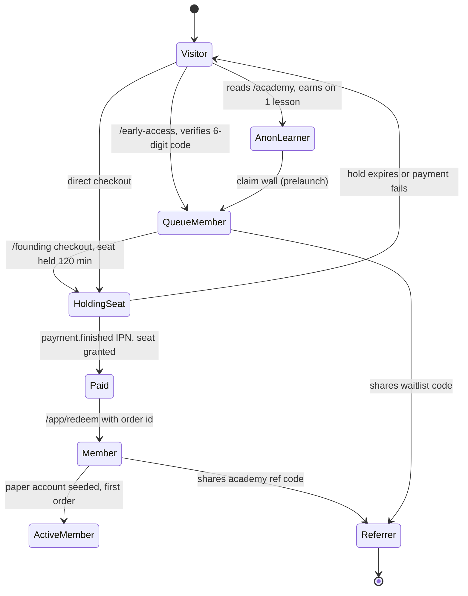
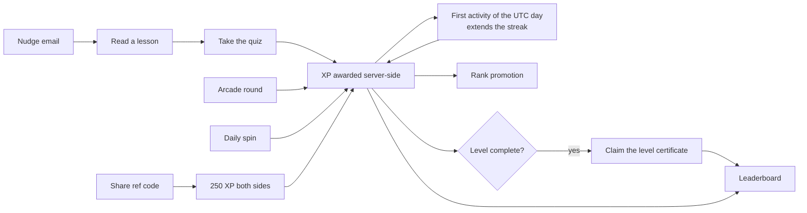

# 10 — Product specification, as built

What this covers: HeroPips as it actually exists in this repository — the
commercial model, every shipped capability, the user journeys, the academy, the
entitlement definitions, the growth mechanics, and the launch-mode switch. It
closes with an explicit inventory of things the marketing surface promises that
the code does not do. Written for an engineer or PM who needs to know what is
real before quoting a number to a customer.

Every claim below carries a `path:line` citation. Where the shipped code
contradicts the public copy, the code wins and the discrepancy is recorded in
[§8 Not built yet](#8-not-built-yet).

---

## 1. What HeroPips is

HeroPips is a self-directed trading-intelligence platform for retail traders. A
member gets four things:

1. **Decision intelligence** — a signal feed produced by an in-house quant
   pipeline. Every brief carries direction, entry, stop, target, a confidence
   score, a `model_version` and a plain-language rationale
   (`packages/contracts/src/index.ts:463-479`).
2. **Guarded execution** — orders sized from account equity and stop distance,
   checked against risk guards, executed on a broker connection
   (`apps/services/trading/src/exec/exec.service.ts`).
3. **A gamified academy** — 10 levels, 31 lessons, XP, ranks, certificates
   (`packages/contracts/src/index.ts:691-798`).
4. **A founding-member chat lounge** — one WebSocket channel,
   `founding-lounge` (`packages/contracts/src/index.ts:637-642`).

It is explicitly **not** a broker, fund or adviser. It never takes custody:
broker credentials are trade-scope API keys stored encrypted
(`apps/services/trading/src/connections/connections.service.ts:110-121`). The
compliance framing is baked into the UI — `Disclaimer` renders a fixed
compliance sentence by default (`packages/ui/src/index.tsx:107-113`).

### Who it is for

| Segment | Evidence in code |
|---|---|
| Complete beginners | Academy Level 0 is `access: "open"` and readable without an account (`packages/contracts/src/index.ts:692`); anonymous visitors may earn on `ANON_LESSON_LIMIT: 1` lesson (`:759`) |
| Self-directed retail traders on existing broker accounts | Broker kinds `paper \| mt5 \| binance \| kucoin` (`packages/contracts/src/index.ts:499`) |
| Prop-firm challenge traders | Curriculum lesson `prop-firms-and-funded-accounts` (`packages/contracts/src/index.ts:743`); prop presets are **marketing only** — see §8 |
| Educators / community leaders (affiliates) | `AffiliateApplyReq` intake form (`packages/contracts/src/index.ts:155-163`) |

The signup funnel additionally captures a four-question trader profile —
experience, markets, platforms, terminology comfort — all optional
(`packages/contracts/src/index.ts:58-79`), so launch cohorts can be segmented.

---

## 2. Pre-launch commercial model

The only thing purchasable today is the **Founding Hero lifetime deal**.

| Property | Value | Source |
|---|---|---|
| SKU | `ltd_founding` | `packages/contracts/src/index.ts:293` |
| Price | **flat $499 USD**, identical for seat 1 and seat 500 | `packages/contracts/src/index.ts:294`; `apps/services/billing/src/common/config.ts:34` |
| Seat cap | 500 | `packages/contracts/src/index.ts:295`; `apps/services/billing/src/common/config.ts:35` |
| Seat hold TTL | 120 minutes | `packages/contracts/src/index.ts:296`; `apps/services/billing/src/founding/founding.service.ts:47` |
| Payment rail | Crypto via NOWPayments (invoice + signed IPN) | `apps/services/billing/src/nowpayments/client.ts` |
| Stored price | `price_usd_minor = round(price × 100)` = `49900` | `apps/services/billing/src/founding/founding.service.ts:53` |
| Entitlement | `PACKAGES.ltd_founding`, `lifetime: true` | `packages/contracts/src/index.ts:662-670` |

> **There is no seat-price ladder anywhere in the codebase.** The price is a
> single env-overridable constant read once per checkout. The only "ladder" in
> billing is `PAYMENT_STATUS_RANK`, the monotonic rank that lets out-of-order
> IPNs be applied safely (`packages/contracts/src/index.ts:195-198`). Public
> copy agrees on the flat number
> (`apps/web/app/(marketing)/founding/page.tsx:96,138`;
> `apps/web/lib/content.ts:230-231`).

The cap is seeded into `ltd_seats` on first boot with
`ON CONFLICT (tenant_id) DO NOTHING`
(`apps/services/billing/src/db/migrate.ts:57-61`) — changing `LTD_SEAT_CAP` after
the first boot has no effect and requires SQL. Full lifecycle in
[flows](./03-flows.md) and [billing](./04-features/billing.md).

### Post-launch price list (declared, not sellable)

`apps/web/lib/content.ts:159-228` defines four subscription tiers rendered on
`/pricing`. **No code path can sell them** — billing knows exactly one SKU.

| Tier | $/mo | Live connections | Guarded executions/mo | Backtests | Prop presets |
|---|---|---|---|---|---|
| Free | 0 | 0 | 0 | no | no |
| Starter | 29 | 1 | 100 | no | no |
| Pro | 79 | 3 | 1 000 | yes | no |
| Elite | 199 | 10 | 10 000 | yes | yes |

Annual discount is 20 % (`apps/web/lib/content.ts:156-157`).

---

## 3. Feature inventory

Everything below is implemented and reachable. "Entry point" is the URL a user
lands on; the browser never talks to a service directly — the Next.js BFF fans
out server-side ([architecture](./01-architecture.md)).

| # | Feature | User-visible behaviour | Entry point | Service | Doc |
|---|---|---|---|---|---|
| 1 | Early-access waitlist | Email-first signup: request a 6-digit code, verify it, receive a queue position, a personal referral code and a status link | `/early-access` | growth | [growth-early-access](./04-features/growth-early-access.md) |
| 2 | Queue status page | Position, total, referral code, verified referrals and jumps earned, via a signed token | `/early-access/status?token=` | growth | [growth-early-access](./04-features/growth-early-access.md) |
| 3 | Public queue counters | Total joined, joined today, joined this week | `/early-access` | growth | [growth-early-access](./04-features/growth-early-access.md) |
| 4 | Founding Hero checkout | Enter email (+ optional pay currency and referral code) → seat held 120 min → NOWPayments invoice → crypto payment | `/founding` | billing | [billing](./04-features/billing.md) |
| 5 | Live seat meter | `cap / remaining / held`, polled client-side every 10 s | `/`, `/founding` | billing | [billing](./04-features/billing.md) |
| 6 | Order status page | Payment status, seat state, amount paid, pay currency | `/founding/status?token=` | billing | [billing](./04-features/billing.md) |
| 7 | Account redeem | Exchange the order id for an account: email, password, display name → founding member | `/app/redeem` | identity | [identity](./04-features/identity.md) |
| 8 | Login / logout / sessions | Opaque session cookie, 30-day sliding TTL, session list with per-device revoke | `/app/login`, `/app/security` | identity | [identity](./04-features/identity.md) |
| 9 | Profile + password | Change display name, change password (revokes sibling sessions) | `/app/settings`, `/app/security` | identity | [identity](./04-features/identity.md) |
| 10 | Personal audit log | Keyset-paginated list of the member's own security events | `/app/security` | identity | [identity](./04-features/identity.md) |
| 11 | Package view | The member's SKU, lifetime flag and four numeric limits | `/app/packages` | identity | [identity](./04-features/identity.md) |
| 12 | Founding lounge chat | Server-rendered history + WebSocket fanout, 1 msg / 2 s and 20 / min per user | `/app/chat` | identity | [growth-messaging](./04-features/growth-messaging.md), [identity](./04-features/identity.md) |
| 13 | Intelligence feed | Active and resolved signals with entry/stop/target, confidence, model version, rationale | `/app/intelligence` | signal | [signal](./04-features/signal.md) |
| 14 | Quotes | Current bid/ask for the 7-symbol universe | `/app` (internal) | signal | [signal](./04-features/signal.md) |
| 15 | Broker connections | Add/remove a connection; paper is auto-provisioned, live keys are validated and encrypted | `/app/connect` | trading | [trading](./04-features/trading.md) |
| 16 | Paper account | $10 000.00 starting balance, auto-created on first touch | `/app` | trading | [trading](./04-features/trading.md) |
| 17 | Order placement | Market orders, sized by explicit qty **or** risk %, mandatory idempotency key | `/app/intelligence` order sheet | trading | [trading](./04-features/trading.md) |
| 18 | Trade Guard | Three pre-trade checks; a blocked order returns `blocked_by_guard` with a reason | order submit | trading | [trading](./04-features/trading.md) |
| 19 | Positions | Open positions with live unrealised PnL, close from the UI, 5 s poll | `/app/positions` | trading | [trading](./04-features/trading.md) |
| 20 | Trade history | Closed round-trips with fees, cursor-paginated | `/app/history` | trading | [trading](./04-features/trading.md) |
| 21 | PnL + equity curve | Realised/unrealised totals, 30-day win rate, Sharpe, max drawdown, equity series | `/app` | trading | [trading](./04-features/trading.md) |
| 22 | Academy (public) | All 10 levels and 31 lessons readable; open lessons full text, gated lessons first section + unlock CTA | `/academy`, `/academy/[slug]` | web + growth | [growth-academy](./04-features/growth-academy.md) |
| 23 | Academy (member) | Full lesson player, quizzes, XP, streaks, rank, leaderboard | `/app/academy`, `/app/academy/learn/[slug]` | growth | [growth-academy](./04-features/growth-academy.md) |
| 24 | Anonymous XP banking | Earn on 1 lesson without an account; XP banks in `localStorage` and claims on first sync | `/academy/[slug]` | web | [web](./04-features/web.md) |
| 25 | Trading arcade | Two games (`long-short`, `risk-sizer`), 15 XP per win, 10 earning rounds per game per UTC day | `/academy/arcade` | growth | [growth-academy](./04-features/growth-academy.md) |
| 26 | Daily spin | One spin per UTC day, prize drawn server-side from `[10,15,20,25,40,60,80,100]` | `/app/academy` | growth | [growth-academy](./04-features/growth-academy.md) |
| 27 | Certificates | 11 tracks; claim when every lesson in the track is complete; unique `HP-XXXXX-XXXXX` code | `/app/academy/certificates` | growth | [growth-academy](./04-features/growth-academy.md) |
| 28 | Public certificate verification | Anyone can confirm holder, track and issue date | `/academy/verify/[code]` | growth | [growth-academy](./04-features/growth-academy.md) |
| 29 | Academy referrals | Share `/academy?ref=CODE`; 250 XP to both sides, once per referred user | `/app/academy` | growth | [growth-academy](./04-features/growth-academy.md) |
| 30 | Waitlist referrals | Every 3 verified referrals move the referrer 25 queue positions | `/early-access/status` | growth | [growth-referrals](./04-features/growth-referrals.md) |
| 31 | Affiliate application | Intake form (name, email, channel, audience size, geo, note) → 202 | `/affiliates` | growth | [growth-referrals](./04-features/growth-referrals.md) |
| 32 | Lifecycle email | 26 templates, 3 drip journeys, weekly digest, 3 academy nudges | email | growth | [growth-messaging](./04-features/growth-messaging.md) |
| 33 | Unsubscribe / open / click tracking | RFC 8058 one-click unsubscribe, 1×1 open pixel, click redirect with UTM | `/unsubscribe`, `/api/mail/*` | growth | [growth-messaging](./04-features/growth-messaging.md) |
| 34 | Theme switching | Dark / light / system, cookie-persisted, correct on first paint | any page | web | [web](./04-features/web.md) |
| 35 | PWA + offline | Installable manifest, service worker, offline fallback page | any page | web | [web](./04-features/web.md) |
| 36 | SEO / AEO surface | Sitemap, robots (8 named AI crawlers), JSON-LD on every page, OG images, `llms.txt` + `llms-full.txt` | — | web | [web](./04-features/web.md) |

---

## 4. User journeys



### 4.1 Visitor

- Every marketing page is public and statically prerendered unless it needs
  live data (`apps/web/app/(marketing)/**`). The whole academy is crawlable:
  `sitemap.ts` emits one URL per lesson (`apps/web/app/sitemap.ts:14-40`).
- Gated lessons ship their **first section only** plus an unlock CTA; the full
  player lives behind the session (`apps/web/lib/academy/access.ts:1-8`).
- Product rule: an anonymous visitor may complete and earn XP on exactly
  `ANON_LESSON_LIMIT = 1` lesson before a claim wall appears
  (`packages/contracts/src/index.ts:759`). XP banks in `localStorage`
  (`apps/web/lib/academy/store.ts`) and is claimed on the first authenticated
  sync.

### 4.2 Early access

Signup is deliberately two-step and email-first
(`packages/contracts/src/index.ts:81-84`):

1. `POST /api/early-access/code` — issues a 6-digit code. Constants:
   `EA_CODE_LENGTH 6`, `EA_CODE_TTL_SEC 900`, `EA_CODE_MAX_ATTEMPTS 5`,
   `EA_CODE_RESEND_SEC 30` (`packages/contracts/src/index.ts:87-93`). Only an
   address-bound HMAC of the code is stored
   (`apps/services/growth/src/common/verification.ts:9-15`).
2. `POST /api/early-access/verify` — **verifying is what claims the place in
   line** (`packages/contracts/src/index.ts:117`). Only here is the entry row
   created, the referral resolved and the `early_access.joined` event written.

Product rules at this stage:

- The code endpoint deliberately does **not** reveal whether the address is
  already on the list — it would otherwise be a membership oracle
  (`packages/contracts/src/index.ts:111-114`).
- Re-verifying an existing address is not an error: `duplicate: true` with the
  original position (`packages/contracts/src/index.ts:132`).
- Base position is `count(entries) + 1` at insert time
  (`apps/services/growth/src/early-access/early-access.service.ts:252`), assigned
  under `pg_advisory_xact_lock(42)` so positions are globally serialised
  (`apps/services/growth/src/early-access/early-access.repo.ts:113`).
- Effective position = `max(1, base − floor(referrals / 3) × 25)`
  (`apps/services/growth/src/common/position.ts:4-11`).
- The profile answers are optional and can be updated by re-verifying
  (`apps/services/growth/src/early-access/early-access.service.ts:209-289`).

### 4.3 Founding buyer

1. `POST /api/founding/checkout` with an email. Billing atomically increments
   `ltd_seats.held` behind `WHERE granted + held < cap`; zero rows means
   `410 ltd_sold_out` (`apps/services/billing/src/db/repo.ts:106-113`).
2. Order id is `hp_ltd_<12 hex>` (48 bits of randomness)
   (`apps/services/billing/src/founding/founding.service.ts:46`); the hold
   expires at `now + 120 min` (`:47`).
3. A NOWPayments invoice is created. If that call fails the hold is rolled back
   and the caller gets `502 invoice_create_failed` (`:91-100`).
4. The response carries a signed `status_token` so the buyer can poll
   `/founding/status` without an account.
5. On the `finished` IPN the seat flips `held → granted` and
   `payment.finished` is published (`apps/services/billing/src/ipn/ipn.service.ts:87-92`).
6. A hold that expires is swept every 60 s into
   `(expired, released)` and emits `order.hold_expired`
   (`apps/services/billing/src/founding/holds.job.ts:3`,
   `apps/services/billing/src/db/repo.ts:249-273`).

Product rules: one checkout = one seat; there is no client idempotency key, so a
double-submitted form burns two seats for two hold TTLs. Seat states `granted`
and `released` are terminal — nothing returns a seat to `held`.

### 4.4 Active member

`POST /api/app/auth/redeem` takes the **order id as the access code**
(`apps/web/e2e/platform-app.setup.ts:47`). Identity calls
`POST /v1/founding/verify` on billing; a successful verify (or a matching entry
in `EARLY_ACCESS_CODES`) creates the account with `founding: true` and
`package_sku` from the verify response
(`apps/services/identity/src/auth/auth.service.ts:95-104`).

Note the redemption gate: billing accepts `finished` **or** `confirmed`
(`apps/services/billing/src/founding/founding.service.ts:213`), while the E2E
harness gates on the seat flipping to `granted`
(`apps/web/e2e/platform-app.setup.ts`). These are not the same condition — see
[billing](./04-features/billing.md).

On first touch of `/v1/connections`, trading auto-creates exactly one paper
connection labelled "Paper account" seeded with
`PAPER_STARTING_BALANCE_USD_MINOR = 10_000_00`
(`apps/services/trading/src/connections/connections.service.ts:36-57`;
`packages/contracts/src/index.ts:623`). The redeem BFF route fires a throwaway
`GET /v1/connections` purely to trigger that seeding before first paint
(`apps/web/app/api/app/auth/redeem/route.ts:39-46`).

An active member can then: read the intelligence feed, place market orders on
the paper account, watch positions and PnL, work the academy, and post in the
lounge.

### 4.5 Referrer / affiliate

Three separate referral mechanisms exist. They share no data.

| Mechanism | Identity key | Depth | Reward | Wired to a caller? |
|---|---|---|---|---|
| Waitlist referral | `waitlist_entries.code` / `referred_by` | 1 | 25 queue positions per 3 verified referrals | Yes — `/early-access` `?ref=` |
| Academy referral | `academy_progress.referral_code` / `referred_by` | 1 | 250 XP to both sides, once per referred user (`apps/services/growth/src/academy/academy.service.ts:132-149`) | Yes — `/academy?ref=` |
| Multi-level commission tree | identity user ids in `referral_edges` / `referral_ancestors` / `referral_commissions` | up to 10 | `floor(total_usd_minor × rate_bps / 10000)` per ancestor level | **No** — see §8 |

The affiliate programme surface is an application form only. `POST
/v1/affiliates/apply` inserts a row and emits an `affiliate.applied` outbox
event (`apps/services/growth/src/affiliates/affiliates.service.ts:12-27`); there
is no partner portal, no approval workflow and no payout path.

---

## 5. The academy

### 5.1 Structure

10 levels ("worlds") × 31 lessons. Metadata lives in contracts so web and
growth-svc cannot drift; rich lesson content lives in
`apps/web/lib/academy/content/level-0..9` and is merged at module init with
integrity checks that fail the build, not the user
(`apps/web/lib/academy/curriculum.ts:145-165`).

| # | Level id | Name | Access | Lessons | Lesson XP | Quiz Qs | Minutes |
|---|---|---|---|---|---|---|---|
| 0 | `first-steps` | First Steps | **open** | 3 | 180 | 13 | 23 |
| 1 | `read-the-market` | Read the Market | member | 3 | 210 | 15 | 21 |
| 2 | `protect-your-money` | Protect Your Money | member | 4 | 330 | 18 | 30 |
| 3 | `chart-structure` | Chart Structure | member | 3 | 270 | 15 | 25 |
| 4 | `find-the-trade` | Find the Trade | member | 3 | 280 | 14 | 23 |
| 5 | `strategy-lab` | Strategy Lab | member | 3 | 310 | 14 | 25 |
| 6 | `prove-it` | Prove It | member | 3 | 350 | 12 | 26 |
| 7 | `mind-of-a-hero` | Mind of a Hero | member | 3 | 340 | 14 | 24 |
| 8 | `trade-with-the-machine` | Trade With the Machine | **pro** | 3 | 360 | 14 | 25 |
| 9 | `go-live` | Go Live Like a Hero | **pro** | 3 | 410 | 14 | 25 |
| | | **Total** | | **31** | **3 040** | **143** | **247** |

Levels and their access tiers: `packages/contracts/src/index.ts:691-702`.
Lessons with per-lesson `xp`, `quiz` count and `minutes`:
`packages/contracts/src/index.ts:713-745`. Totals are derived at runtime by
`TOTAL_LESSONS` / `TOTAL_MINUTES`
(`apps/web/lib/academy/curriculum.ts:202-203`) — 247 minutes ≈ 4.1 hours.

Access semantics (`apps/web/lib/academy/access.ts:20-24`):

- `open` — anyone may earn, including anonymous visitors (up to the 1-lesson wall).
- `member` — any authenticated member may earn.
- `pro` — only members with `founding: true` may earn.

Content is **always readable** regardless of tier; only earning is gated. Gated
lessons publish their first section for SEO and show an unlock CTA
(`apps/web/lib/academy/access.ts:1-8`).

### 5.2 XP economy

All constants are server-authoritative and mirrored client-side for optimistic
UI (`packages/contracts/src/index.ts:752-764`).

| Source | Award | Constant |
|---|---|---|
| Lesson complete | 60–150 XP, per lesson | `ACADEMY_LESSONS[].xp` (`:713-745`) |
| Correct quiz answer | 10 XP each | `QUIZ_CORRECT` (`:753`) |
| Perfect quiz | +20 XP bonus | `QUIZ_PERFECT_BONUS` (`:754`) |
| Arcade win | 15 XP | `GAME_WIN` (`:755`) |
| Arcade daily cap | 10 XP-earning rounds per game per UTC day | `GAME_DAILY_CAP` (`:757`) |
| Anonymous limit | 1 lesson before the claim wall | `ANON_LESSON_LIMIT` (`:759`) |
| Referral | 250 XP to **both** sides, once per referred user | `REFERRAL_BONUS` (`:760`) |
| Daily streak bonus | `5 × streak_days`, capped at 50 | `STREAK_BONUS_PER_DAY`, `STREAK_BONUS_CAP` (`:761-762`) |
| Daily spin | one per UTC day, uniform over `[10,15,20,25,40,60,80,100]` | `SPIN_PRIZES` (`:763`); draw at `apps/services/growth/src/academy/academy.service.ts:281` |

Days are UTC calendar days (`utcDay()` in
`apps/services/growth/src/academy/xp.ts:11`). Streak transitions: same day → no
change; previous UTC day → +1; any larger gap → reset to 1
(`apps/services/growth/src/academy/xp.ts:47`).

Every mutation runs inside a transaction with `SELECT … FOR UPDATE` on the
progress row (`apps/services/growth/src/academy/academy.service.ts:351-362`), so
the client can never inflate XP — it can only replay a completion, which is
idempotent per slug (`:117-128`).

Maximum XP obtainable from lessons + perfect quizzes alone:
`3040 + 143×10 + 31×20 = 5090`
(`apps/web/lib/academy/curriculum.ts:198-200`) — enough to reach the top rank
without arcade, spin or streaks.

### 5.3 Ranks

Ten thresholds; rank is the last entry with `at ≤ xp`
(`packages/contracts/src/index.ts:768-779`).

| XP | Rank | | XP | Rank |
|---|---|---|---|---|
| 0 | Recruit | | 2 000 | Setup Hunter |
| 150 | Pip Rookie | | 2 750 | Strategy Smith |
| 400 | Chart Reader | | 3 550 | Paper Pilot |
| 800 | Risk Keeper | | 4 400 | Machine Tamer |
| 1 350 | Structure Scout | | 5 000 | Hero Trader |

### 5.4 Certificate tracks

11 tracks: one per level plus the grand `hero-trader`
(`packages/contracts/src/index.ts:783-798`). A track is claimable only when
every lesson mapped to it is complete; otherwise `409 academy_track_incomplete`
(`apps/services/growth/src/academy/academy.service.ts:303-311`). Issuance is
idempotent — a re-claim returns the existing certificate (`:300-301`).

| Track | Requires | Display name |
|---|---|---|
| `level-0` … `level-9` | all lessons of that one level | First Steps, Market Reader, Risk Keeper, Structure Scout, Trade Finder, Strategy Builder, Proven Trader, Steel Mind, Machine Tamer, Live Hero (`apps/web/lib/academy/curriculum.ts:215-227`) |
| `hero-trader` | all lessons of all 10 levels | Hero Trader |

Each certificate carries a Crockford-base32 code in the shape
`HP-XXXXX-XXXXX` (`apps/services/growth/src/academy/xp.ts:68`) with a bounded
collision retry (`academy.service.ts:313-316`). Verification is public and
always returns 200 — an invalid code is `{valid:false}`, not an error
(`academy.service.ts:339-342`).

### 5.5 The gamification loop



Retention is driven by three email nudges from an hourly sweeper
(`apps/services/growth/src/academy/nudges.ts:13-14`):

| Cadence | Trigger | Constant |
|---|---|---|
| Daily "streak save" | streak ≥ 3 and exactly one missed day | `DAILY_MIN_STREAK: 3` (`packages/contracts/src/index.ts:961`) |
| Weekly "next lesson" | inactive 7–27 days | `WEEKLY_AFTER_DAYS: 7` (`:963`) |
| Monthly win-back | inactive ≥ 28 days | `MONTHLY_AFTER_DAYS: 28` (`:965`) |

A leaderboard ranks by `xp DESC, updated_at ASC`
(`apps/services/growth/src/academy/academy.repo.ts:296-307`) and is exposed
publicly with names and XP only
(`apps/web/app/api/academy/leaderboard/route.ts`).

The `paper-trading-capstone` lesson is verified against **real** trading state:
`/api/academy/capstone` derives two missions from the member's connections and
closed trades and auto-completes the lesson exactly once when both pass
(`apps/web/app/api/academy/capstone/route.ts:23-44`).

---

## 6. Packages and entitlements

There is exactly one package (`packages/contracts/src/index.ts:662-670`):

```ts
ltd_founding: {
  sku: "ltd_founding",
  name: "Founding Hero — Lifetime Pro",
  active: true,
  lifetime: true,
  limits: { live_connections: 3, paper_accounts: 3, signals_per_day: 50, guard_rules: 20 },
}
```

| Limit | Value | Enforced? | Where |
|---|---|---|---|
| `live_connections` | 3 | **yes** — `409 connection_limit_reached` | `apps/services/trading/src/connections/connections.service.ts:95-103` |
| `paper_accounts` | 3 | **yes** — `409 connection_limit_reached` | `apps/services/trading/src/connections/connections.service.ts:69-77` |
| `signals_per_day` | 50 | **no** — displayed only | rendered at `apps/web/app/(platform)/app/(member)/packages/page.tsx:52-53`; no consumer anywhere |
| `guard_rules` | 20 | **no** — displayed only; the engine has 3 fixed guards | rendered at `…/packages/page.tsx:56-57`; guards at `apps/services/trading/src/pnl/engine.ts:39-42` |

Non-founding members fail closed to
`{ live_connections: 0, paper_accounts: 1, signals_per_day: 0, guard_rules: 0 }`
(`apps/services/trading/src/connections/connections.service.ts:19-25`). In
practice every account created by redeem is founding
(`apps/services/identity/src/auth/auth.service.ts:95-104`), so this branch is a
guard rail for a future free tier.

Academy entitlement is derived from the same flag: `pro` levels require
`founding: true` (`apps/web/lib/academy/access.ts:20-24`).

**Hazard:** an unknown `package_sku` silently resolves to the founding package
(`apps/services/identity/src/me/me.service.ts:84-87`).

---

## 7. Growth mechanics

### 7.1 Queue position

```
jumps    = floor(verified_referrals / REFERRALS_PER_JUMP)   // 3
position = max(1, base_position - jumps * JUMP_SIZE)        // 25
```

`apps/services/growth/src/common/position.ts:4-11`;
`packages/contracts/src/index.ts:298-299`. Position is recomputed on read from
the referral count, never stored — so the ledger cannot drift. A referral only
counts once the invitee has verified their own email, because the entry row is
created at verify time.

### 7.2 Multi-level referral programme

Modelled as a **closure table** so ancestor lookups are a single indexed read:
`referral_edges` (child → parent, one row per child) plus `referral_ancestors`
(descendant, ancestor, depth) built to the full `MAX_LEVELS = 10` on every link
(`apps/services/growth/src/referrals/referrals.service.ts:45-63`). The closure
is always built to depth 10 so payout depth can be raised later without a tree
rebuild (`packages/contracts/src/index.ts:303-305`).

| Setting | Default | Source |
|---|---|---|
| `MAX_LEVELS` | 10 | `packages/contracts/src/index.ts:305` |
| `DEFAULT_LEVELS` | 5 | `:307` |
| `DEFAULT_LEVEL_RATES_BPS` | `[2000, 1000, 500, 300, 200]` = 20 / 10 / 5 / 3 / 2 % | `:309` |
| Sum cap (service-side) | 5 000 bps = 50 % | `apps/services/growth/src/referrals/referrals.service.ts:16` |

Commission per ancestor: `floor(total_usd_minor × rate_bps / 10000)`, inserted
with `ON CONFLICT (order_id, beneficiary_id, level) DO NOTHING`, so attribution
is idempotent (`apps/services/growth/src/referrals/referrals.repo.ts:166-179`).
Reversal marks `status = 'reversed'` for one order and emits exactly one event
(`:180-192`).

Config is admin-mutable via `PATCH /v1/referrals/config` guarded by an
`x-admin-token` header; with `ADMIN_TOKEN` unset the endpoint returns `503`
(`apps/services/growth/src/referrals/referrals.service.ts:73-104`).

**This subsystem has no callers.** Nothing in the web app or in any service
invokes `POST /v1/referrals/link` or `POST /v1/referrals/attribute` — verified by
grep across `apps/web` and `apps/services`. The tree is never populated and no
commission has ever been accrued at runtime. See §8.

### 7.3 Affiliate programme

`POST /v1/affiliates/apply` accepts name, email, channel URL, audience-size
bucket (`<1k` … `250k+`), geo and an optional note
(`packages/contracts/src/index.ts:155-163`), returns `202 {ok:true}`, writes an
`affiliate_applications` row and an `affiliate.applied` outbox event
(`apps/services/growth/src/affiliates/affiliates.service.ts:12-27`). That is the
entire implementation.

### 7.4 Lifecycle email

One engine, two consent lanes (`packages/contracts/src/index.ts:278-283`):

- **Transactional** — always delivers (verification codes, receipts, refunds,
  certificates).
- **Lifecycle** — honours the suppression list, enforces a ≥20 h gap between
  sends per contact (`apps/services/growth/src/messaging/messaging.service.ts:33`),
  and carries RFC 8058 one-click unsubscribe.

26 templates in `apps/services/growth/src/messaging/templates/library.ts`.
Three drip journeys, all firing at 14:00 UTC on start-day + offset
(`apps/services/growth/src/messaging/journeys.ts:11,34-67`):

| Journey | Audience | Steps | Cancelled by |
|---|---|---|---|
| `early_access_nurture` | queue joiner → buyer | D1, D3, D5, D8, D12, D19 | `payment.finished`, `user.registered` |
| `founding_onboarding` | paid but not redeemed | D1, D3 | `user.registered`, `payment.refunded` |
| `member_activation` | registered → activated | D2, D5, D10 | per-step skips on lesson done / trade filled |

Plus a Monday weekly digest to every non-suppressed contact when the prior ISO
week had ≥ 1 signal
(`apps/services/growth/src/messaging/messaging.service.ts:446`). Full trigger
matrix in [growth-messaging](./04-features/growth-messaging.md) and the
product-side playbook at `docs/Lifecycle-Email-Playbook.md`.

Copy rules are enforced by convention in the template library: no fabricated
performance numbers, FOMO from real mechanics only (seat cap, queue position,
streaks), a why-you-got-this line and a risk disclaimer in every footer
(`docs/Lifecycle-Email-Playbook.md:82-91`).

---

## 8. Launch modes

`LaunchMode` is declared as `prelaunch | main | maintenance`
(`packages/contracts/src/index.ts:51-52`), but only two values are ever read and
only in one place.

`NEXT_PUBLIC_LAUNCH_MODE` defaults to `"prelaunch"`
(`apps/web/lib/academy/access.ts:12-13`) and is set in compose
(`infra/compose/docker-compose.yml:297`) and the env examples
(`.env.local.example:38`).

Exactly what changes when it flips to `main`:

| Surface | `prelaunch` | `main` | Source |
|---|---|---|---|
| Locked **member** lesson CTA | "Join the free launch list" → `/early-access` | "Create a free account" → `/app/login` | `apps/web/lib/academy/access.ts:46-57` |
| Anonymous claim-wall CTA | "Join early access" → `/early-access` | "Create your free account" → `/app/login` | `apps/web/lib/academy/access.ts:61-74` |
| Locked **pro** lesson CTA | "Unlock with Founding Hero" → `/founding` | unchanged | `apps/web/lib/academy/access.ts:39-45` |

That is the complete blast radius. It is a **build-time** value —
`NEXT_PUBLIC_*` is inlined at build, so flipping it requires a rebuild and
redeploy, not a restart. Nothing else in the codebase reads it: no service
gates on launch mode, checkout is not disabled, `maintenance` is never handled,
and the `launch_mode_forbidden` error code
(`packages/contracts/src/index.ts:20`) is never thrown.

---

## 9. Not built yet

Capabilities implied by `apps/web/app/llms-full.txt/route.ts`, the marketing pages or
`docs/HeroPips-Architecture-v2.md` that have **no implementation**. Each row
names the promise, the reality and the evidence.

### 9.1 Execution and brokers

| Promise | Reality | Evidence |
|---|---|---|
| "Executes them on the user's own broker account (MT5, Binance, KuCoin)" (`llms-full.txt:3,23`) | **No live execution exists.** Live adapters validate key shape and store credentials; they never call a broker. Every connection — including `mt5`/`binance`/`kucoin` — is created with `status: "pending"` and the detail "Keys stored — live execution rolls out to Founding members in waves". All fills come from the internal paper engine. | `apps/services/trading/src/brokers/adapters.ts:4-6,22-23`; `apps/services/trading/src/connections/connections.service.ts:111-122` |
| "30+ additional crypto exchanges arriving via a unified API" (`llms-full.txt:23,62`) | No unified-API layer exists. `BROKERS` is a closed 4-value enum. | `packages/contracts/src/index.ts:499` |
| "Three execution modes: Notify / Confirm / Full-auto" (`llms-full.txt:36-39`) | No mode field, no consent record, no automatic execution. Orders are placed manually from the UI, one at a time. | `OrderReq` has no mode (`packages/contracts/src/index.ts:533-547`) |
| "Orders … route exactly once (idempotent)" | This one is **real**: `idempotency_key` is a mandatory 8–80 char field. | `packages/contracts/src/index.ts:544` |
| "Withdrawal-enabled keys rejected" (`llms-full.txt:23`) | Adapters check character set and shape only; there is no permission introspection against the exchange. | `apps/services/trading/src/brokers/adapters.ts:25,40-104` |

### 9.2 Trade Guard

Marketing promises **nine** guards, user-configurable, with prop-firm presets
(`llms-full.txt:43-55`; `apps/web/lib/content.ts:188,222`). **Three** are
implemented, all with hardcoded constants:

| # | Marketing guard | Implemented? | Evidence |
|---|---|---|---|
| 1 | Risk-% position sizing | **Yes**, fixed at 2 % max | `GUARD_MAX_RISK_PCT = 2` (`apps/services/trading/src/pnl/engine.ts:40`), checked at `:324` |
| 2 | Daily loss circuit breaker | **Yes**, fixed at 5 % | `GUARD_DAILY_LOSS_LIMIT_PCT = 5` (`:42`), checked at `:337-338` |
| 5 | Concurrent position limit | **Yes**, fixed at 5 per connection | `GUARD_MAX_OPEN_POSITIONS = 5` (`:41`), checked at `:330` |
| 3 | Max drawdown breaker | No | absent from `engine.ts:309-340` |
| 4 | Exposure cap | No | absent |
| 6 | News filter | No | absent; no news data source exists |
| 7 | Session window | No | absent |
| 8 | Symbol allowlist | No | absent |
| 9 | Prop-firm presets | No | absent |

There is also **no configuration surface**: guard thresholds are module
constants, not per-user rows, so the advertised `guard_rules: 20` entitlement
has nothing to count. The "fail-closed if the risk engine is unreachable"
guarantee is vacuous today because the guard engine is in-process with the
executor.

### 9.3 Market data and the model

| Promise | Reality | Evidence |
|---|---|---|
| "Institutional-grade composite market feeds (FX, metals, crypto), merged, cleaned and time-synced in-house" (`llms-full.txt:22,31`) | The **default and only fully-covering source is a simulator**: per-symbol geometric Brownian motion from a seeded `mulberry32` PRNG. Its identifier is literally `institutional-composite-sim`. `SOURCE=binance` switches to public Binance REST — crypto only, no FX or metals. | `apps/services/signal/src/market/sim.source.ts:5,8-16,58-67`; `apps/services/signal/src/common/config.ts:15` |
| "In-house machine-learning model (quant-ml-v1)" (`llms-full.txt:22,33`) | A **fixed-weight logistic function** over four hand-computed features. There is no training pipeline, no model artifact, no dataset — the four weights are literals in source. It is honestly labelled a "logistic ensemble" in the code comment. | `apps/services/signal/src/quant/model.ts:5,8-27` |
| "Multi-factor scores per brief (macro, liquidity, institutional flow)" (`llms-full.txt:41`) | Explicitly labelled roadmap; not present. | — |
| "AI trade journal", "trading reputation score" (`llms-full.txt:41`) | Explicitly labelled roadmap; not present. | — |
| Model transparency (`confidence`, `model_version`, `data_source` on every brief) | **Real** — all three are required fields and `data_source` is always disclosed. | `packages/contracts/src/index.ts:463-479` |

### 9.4 Commerce

| Promise | Reality | Evidence |
|---|---|---|
| Subscription tiers Free / Starter / Pro / Elite (`llms-full.txt:137-141`) | Rendered on `/pricing` from a static array. Billing knows one SKU and one price; there is no recurring-billing code, no subscription table, no plan change path. | `apps/web/lib/content.ts:159-228` vs `packages/contracts/src/index.ts:662-670` |
| "14-day refund window paid in USDT equivalent" (`llms-full.txt:135`) | There is **no refund initiation path**. Billing only reacts to a `refunded` IPN pushed by the provider; refunds are an out-of-band manual operation. No 14-day clock is tracked anywhere. | `apps/services/billing/src/ipn/ipn.service.ts:113-124`; no refund endpoint in `app.module.ts:45-52` |
| "Refunds within the 14-day window claw back the associated commissions at every level" (`llms-full.txt:148`) | `POST /v1/referrals/reverse` exists and works, but nothing calls it — and nothing calls `attribute` either, so there are no commissions to claw back. | `apps/services/growth/src/referrals/referrals.service.ts:159-172`; no callers found |
| "Transparent double-entry ledger" for commissions (`llms-full.txt:148`) | `referral_commissions` is a single-entry accrual table with a `status` column. It is not double-entry and it is empty in practice. | `apps/services/growth/src/db/schema.ts:92-104` |
| "Payouts are made in crypto" | No payout code exists anywhere. | — |

### 9.5 Growth and community

| Promise | Reality | Evidence |
|---|---|---|
| "Marketer/affiliate platform … own partner portal" (`llms-full.txt:148`) | An application form. No portal, no approval flow, no dashboard, no link attribution to a marketer. | `apps/services/growth/src/affiliates/` (2 files, 53 lines) |
| Multi-level commissions are live | The engine is complete and tested, but **unreachable** — no caller links a buyer to a parent or attributes an order. | grep for `v1/referrals` across `apps/web` and `apps/services` returns only the controller itself |
| Live workshops and Hero Council (`llms-full.txt:130-131`) | The ladder constants and the UI card exist, but there is no scheduling, no calendar, no entitlement store, no attendance and no delivery. The component derives its state purely from lesson completions and says as much. | `packages/contracts/src/index.ts:808-816`; `apps/web/components/academy/member/LiveWorkshops.tsx:8-11,104-108` |
| "Ambassador programme, regional leaders, trading competitions, mentorship" (`llms-full.txt:18`) | Not present in any form. | — |
| "Capital (invest — future)" pillar (`llms-full.txt:17`) | Correctly described as future in the copy; nothing exists. | — |

### 9.6 Cross-cutting product gaps

| Gap | Impact | Evidence |
|---|---|---|
| Waitlist referrals and the MLM tree are unconnected | A waitlist referral earns queue position but can never become a paid commission, because the tree is keyed on identity user ids that nothing ever links. | `waitlist_entries.referred_by` (`apps/services/growth/src/db/schema.ts:21-34`) vs `referral_edges` (`:75-79`) |
| Three independent referral codes per person | A user can hold a waitlist code, an academy code and (in principle) a tree position, with different sharing URLs and no reconciliation. Support and analytics will conflate them. | §4.5 |
| Per-level certificate emails all say "Hero Trader" | `track` is mapped through a two-branch ternary that predates the per-level refactor, so a `level-3` certificate email is titled "Your Hero Trader certificate is ready". | `apps/services/growth/src/messaging/messaging.service.ts:301` |
| `signals_per_day` and `guard_rules` are decorative | Both are rendered as hard limits on `/app/packages` but no code reads them. | `apps/web/app/(platform)/app/(member)/packages/page.tsx:52-57` |
| `maintenance` launch mode is unhandled | Setting it produces `prelaunch` behaviour for pro CTAs and `prelaunch` copy elsewhere — there is no maintenance page and no service-side gate. | `apps/web/lib/academy/access.ts:38-58` |
| Certificate sample gallery freezes `issuedAt` at build time | `/academy/certificates` shows the deploy date on every sample credential. | `apps/web/app/(marketing)/academy/certificates/page.tsx:46` |

---

## See also

- [01 — Architecture](./01-architecture.md) — service topology and boundaries
- [02 — Data model](./02-data-model.md) — every table behind the features above
- [03 — Flows](./03-flows.md) — the checkout, redeem and academy sequences
- [04 — Features](./04-features/README.md) — per-service internals
- [05 — API reference](./05-api-reference.md) — every endpoint
- [06 — Security](./06-security.md) — threat model and controls
- [memory-bank/product-context.md](./memory-bank/product-context.md) — the durable product framing
