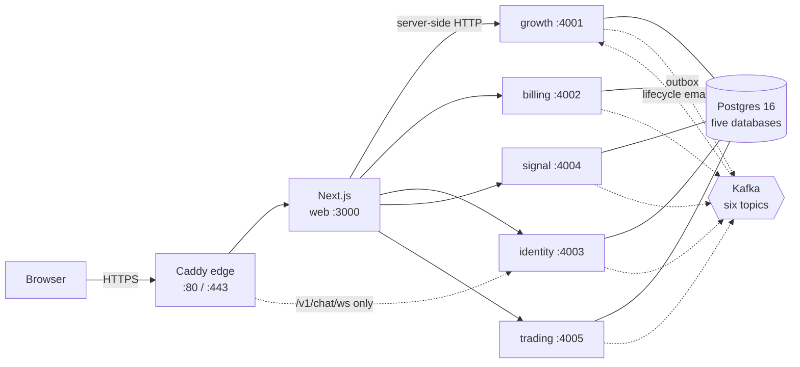

# HeroPips engineering documentation

Everything a developer needs to understand, run, extend and operate the
HeroPips platform. Written against the code as it exists — every behavioural
claim in these documents carries a `path/to/file.ts:LINE` citation, and
[`scripts/docs-check.mjs`](../../scripts/docs-check.mjs) fails CI when a
citation, link or diagram breaks.

> Business and design material — the BRD, PRD, FRD, business plan and design
> system PDFs — lives one level up in [`docs/`](../). This directory is
> engineering only.

---

## Start here

**New to the codebase?** Read in this order. About two hours end to end.

1. [Product](./10-product.md) — what HeroPips is and what it actually does today.
2. [Architecture](./01-architecture.md) — the shape of the system and why it is that shape.
3. [Developer guide](./08-developer-guide.md) — clone to a running stack with a logged-in member.
4. [Flows](./03-flows.md) — follow one end-to-end path in detail; the founding purchase is the richest.
5. The [feature doc](./04-features/README.md) for whatever you are about to change.

**Need something specific right now?**

| I want to… | Go to |
|---|---|
| Run the stack locally | [Developer guide](./08-developer-guide.md) |
| Understand a table or index | [Data model](./02-data-model.md) |
| Find an endpoint's contract | [API reference](./05-api-reference.md) |
| Trace a request end to end | [Flows](./03-flows.md) |
| Deploy, roll back, rotate a secret | [Operations runbook](./09-operations-runbook.md) |
| Change compose, envs or CI | [Infrastructure](./07-infrastructure.md) |
| Review the security posture | [Security](./06-security.md) |
| Add a table, endpoint, event or page | [Developer guide](./08-developer-guide.md) |
| Reload full project context from zero | [Memory bank](./memory-bank/README.md) |

---

## The document set

### Foundations

| Document | Covers |
|---|---|
| [01 Architecture](./01-architecture.md) | System and container views, the service catalogue, the reasoning behind database-per-service / BFF-only ingress / transactional outbox, boot and shutdown sequences, and the architectural risk register. |
| [02 Data model](./02-data-model.md) | Every table in all five databases, ER diagrams per service, every index with the query it serves, the database-enforced invariants, the money and precision rules, and the migration system. |
| [03 Flows](./03-flows.md) | Fourteen end-to-end flows as sequence diagrams with cited step lists and failure modes — signup, purchase, IPN, redeem, login, render, signal generation, execution, PnL, chat, referrals, academy, lifecycle email. |

### Features, code-level

One document per bounded context. Each follows the same structure:
responsibility · module map · feature walkthroughs · data · events ·
configuration · testing · hazards and gaps.

| Document | Service |
|---|---|
| [Feature index](./04-features/README.md) | Capability-to-code map across the whole platform |
| [Identity](./04-features/identity.md) | Accounts, sessions, audit trail, founding-lounge chat — `:4003` |
| [Billing](./04-features/billing.md) | Lifetime-deal orders, the seat ledger, NOWPayments IPN — `:4002` |
| [Early access](./04-features/growth-early-access.md) | Email-first signup, verification codes, queue position — `:4001` |
| [Referrals](./04-features/growth-referrals.md) | The closure-table referral graph and commission accrual — `:4001` |
| [Academy](./04-features/growth-academy.md) | XP economy, streaks, certificates, nudges — `:4001` |
| [Messaging](./04-features/growth-messaging.md) | The lifecycle email engine — `:4001` |
| [Signal](./04-features/signal.md) | Market feed, feature pipeline, the `quant-ml-v1` model — `:4004` |
| [Trading](./04-features/trading.md) | Broker connections, execution, Trade Guard, PnL accounting — `:4005` |
| [Web](./04-features/web.md) | The Next.js app: full route inventory, the two BFF layers, SEO, PWA |
| [Design system](./04-features/design-system.md) | Design tokens and UI primitives in `packages/ui` |

### Reference and operations

| Document | Covers |
|---|---|
| [05 API reference](./05-api-reference.md) | Every public BFF handler and every internal service endpoint, with auth, schemas, status codes, the full error-code catalogue, and a callout listing the unauthenticated endpoints. |
| [06 Security](./06-security.md) | Trust boundaries, threat model, the cryptography inventory, payment security, secrets handling, infrastructure hardening, and a prioritised remediation backlog. |
| [07 Infrastructure](./07-infrastructure.md) | The three environments and how they differ, the compose overlay architecture, the preflight/stack/db scripts, container images, the exhaustive environment-variable table, CI/CD, and scaling limits. |
| [09 Operations runbook](./09-operations-runbook.md) | Task-oriented procedures: deploy, roll back, migrate, rotate secrets, back up and restore, plus incident playbooks. |

### Product and durable context

| Document | Covers |
|---|---|
| [10 Product](./10-product.md) | The product as built: feature inventory, user journeys, the academy curriculum, entitlements, growth mechanics, launch modes, and an honest list of what is not built yet. |
| [Memory bank](./memory-bank/README.md) | A reloadable knowledge base — project brief, product context, system patterns, tech context, current state, progress, and an ADR-style decision log. Read this first if you are returning after a long gap, or if you are an AI assistant starting with no context. |

---

## System at a glance



Five NestJS services on Fastify, one Postgres database each, integrating over
Kafka through a transactional outbox. A single Next.js app serves effectively
all browser traffic and fans out to the services server-side — which is why no
service enables CORS and why none publishes a port outside local development.
The one exception is the founding-lounge WebSocket at `/v1/chat/ws`, which the
edge routes straight to identity-svc because the socket server is attached
there, not to Next.js.

| | Port | Database | Owns |
|---|---|---|---|
| web | 3000 | — | Marketing site, member app, BFF |
| growth | 4001 | `hp_growth` | Early access, referrals, academy, lifecycle email |
| billing | 4002 | `hp_billing` | Lifetime-deal orders, seat ledger, payment IPN |
| identity | 4003 | `hp_identity` | Accounts, sessions, audit, chat |
| signal | 4004 | `hp_signal` | Market data, quant model, signals |
| trading | 4005 | `hp_trading` | Connections, execution, positions, PnL |

---

## Quick commands

```bash
cp .env.local.example .env.local
pnpm install
pnpm preflight        # toolchain, config, secrets, ports — before anything starts
pnpm stack:up         # build → start → wait for health → apply migrations
pnpm db:verify        # assert the live schema matches the migrations
pnpm docs:check       # links, citations and diagrams across this directory
```

Full command inventory: [Infrastructure](./07-infrastructure.md).

---

## Keeping these documents true

Documentation that drifts is worse than none, because it is trusted. Three
things keep this set honest:

1. **Citations, not prose.** Every behavioural claim names a file and line.
   `pnpm docs:check` verifies the file exists and the line is in range, so a
   deleted or renamed file fails the build rather than quietly lying.
2. **One owner per fact.** Deep behaviour lives in exactly one document; the
   others link to it. If you find the same rule explained twice, delete one.
3. **Update with the change, not after it.** A pull request that alters
   behaviour updates the feature document in the same commit. The
   [memory bank](./memory-bank/README.md) states which file to touch for which
   kind of change.

Found something wrong? Fix it in place and note it in
[`memory-bank/progress.md`](./memory-bank/progress.md). An inaccuracy you
noticed and left is a bug you chose to ship.
