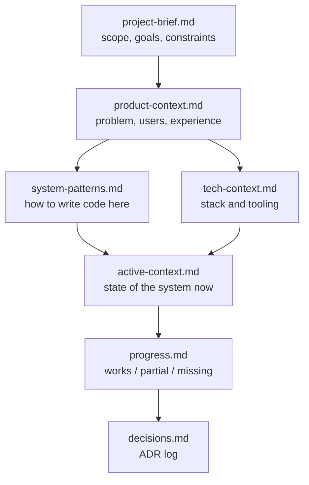

# Memory bank

What this covers: how to use this directory, the order to read it in, and the
rule for keeping it true. It is for anyone — human or AI assistant — who is
arriving at the HeroPips monorepo with **zero** prior context and needs to
reload the full picture from text alone.

---

## Why this exists

The rest of `docs/engineering/` is reference material: you go to it with a
question. The memory bank is the opposite — it is **narrative state**. Read it
end to end and you should be able to reason about this system, make a design
call that fits, and know which decisions are already settled and why.

It is deliberately small and deliberately redundant with nothing. Each file
answers exactly one question and stands on its own:

| File | The question it answers |
|---|---|
| [project-brief.md](./project-brief.md) | What are we building, and what is immovable? |
| [product-context.md](./product-context.md) | Who is it for, what problem does it solve, what should it feel like? |
| [system-patterns.md](./system-patterns.md) | How do we write code here? |
| [tech-context.md](./tech-context.md) | What is it built out of, and what are the constraints? |
| [active-context.md](./active-context.md) | What is the state of the system right now? |
| [progress.md](./progress.md) | What works, what is half-done, what is missing? |
| [decisions.md](./decisions.md) | Why is it like this? |

---

## Reading order

Read in this order. Each file assumes the ones above it.

1. **project-brief.md** — the frame. Everything else is subordinate to it.
2. **product-context.md** — why the frame is shaped that way.
3. **system-patterns.md** — the nine patterns you must follow when you touch
   code. Read this before your first edit, not after.
4. **tech-context.md** — versions, dependencies, tooling, hard constraints.
5. **active-context.md** — where things stand as of the last pass, including
   what was just added.
6. **progress.md** — the honest checklist. Consult before promising anything.
7. **decisions.md** — the ADR log. Consult before *changing* anything
   structural; the reasoning is usually already recorded.

If you are in a hurry: **project-brief → active-context → progress**. That is
the minimum to avoid saying something false about this system.

Once loaded, the deep reference lives one directory up:
[architecture](../01-architecture.md), [data model](../02-data-model.md),
[flows](../03-flows.md), [features](../04-features/README.md),
[API](../05-api-reference.md), [security](../06-security.md),
[infrastructure](../07-infrastructure.md),
[developer guide](../08-developer-guide.md),
[runbook](../09-operations-runbook.md), [product](../10-product.md).

---

## Maintenance rule

The memory bank rots silently. The rule is: **the file you update is determined
by what changed, not by what you feel like writing.**

| What changed | Update | Also update |
|---|---|---|
| Scope, a goal, or a non-negotiable constraint | `project-brief.md` | `decisions.md` if it overturns an ADR |
| Target user, pricing model, or the intended experience | `product-context.md` | `../10-product.md` |
| A recurring implementation idiom — new pattern, or an existing one changed | `system-patterns.md` | `decisions.md` if it was a deliberate choice |
| A dependency, runtime version, tool, or build constraint | `tech-context.md` | — |
| Anything shipped, started, or torn down | `active-context.md` | `progress.md` |
| A capability moved between works / partial / missing, or a bug was found or fixed | `progress.md` | `../10-product.md` §9 if it was a product-visible gap |
| A structural choice was made or reversed | `decisions.md` (new ADR, or supersede the old one) | `system-patterns.md` if it changes how code is written |

Three further rules, all load-bearing:

1. **Never edit an accepted ADR to change its decision.** Add a new one and set
   the old one to `Superseded by ADR-NNN`. The log is a history, not a
   description of the present.
2. **Cite the code.** Every factual claim in this directory carries a
   `path/to/file.ts:LINE`. A claim with no citation is a claim nobody can
   verify six months from now, which means it will be wrong and nobody will
   notice.
3. **`active-context.md` is a snapshot, not an append log.** Rewrite it. If you
   find yourself adding a fifth "previously…" section, the content belongs in
   `progress.md` or `decisions.md` instead.

When code and this directory disagree, **the code is right**. Fix the document
in the same change that revealed the discrepancy.
