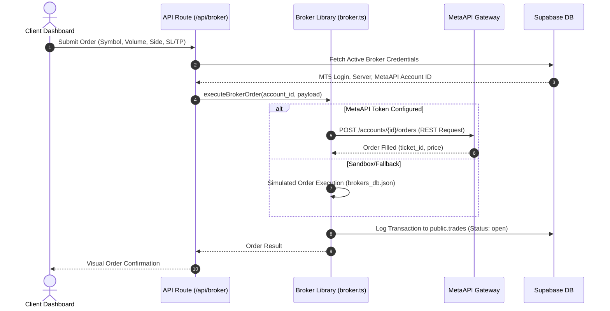
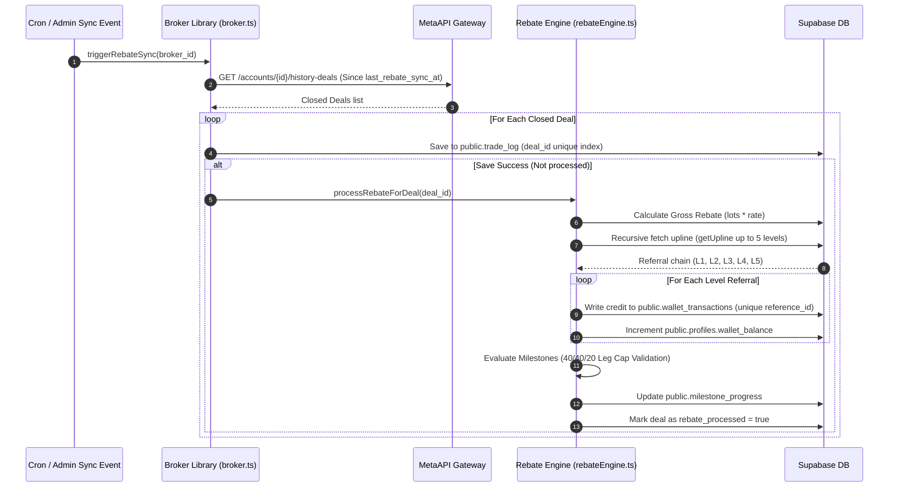
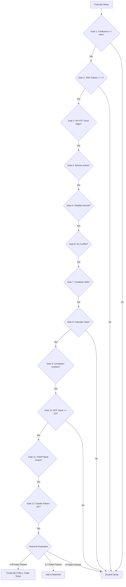

# TradeGPT: Institutional AI Trading Terminal & MetaTrader Node Infrastructure
## Comprehensive Architecture & Technical Specifications Document

---

## 1. Executive Summary & Core Value Proposition

**TradeGPT** is a next-generation, institutional-grade automated trading terminal and node management dashboard. It combines sophisticated technical and quantitative analysis engines with a multi-broker execution broker node network. Additionally, it features a complete Multi-Level Marketing (MLM) rebate and milestone rewards program to incentivize network growth and trading volume.

The platform is designed to:
- **Analyze:** Evaluate assets using a proprietary 12-Gate Confluence and Validation Pipeline.
- **Execute:** Route institutional trade tickets instantly to MetaTrader 4 (MT4) or MetaTrader 5 (MT5) live accounts via the MetaAPI node infrastructure.
- **Reward:** Calculate and distribute trading commissions across a 5-level referral upline hierarchy and track performance milestones.
- **Monetize:** Handle crypto-based SaaS subscription payments and manual commission withdrawals with automated 2FA verification.

---

## 2. Technology Stack, Integrations & Dashboard Features

### 2.1 Technology Stack & Integrations

TradeGPT uses a modern, high-performance web development stack optimized for serverless deployment:

| Category | Technology | Purpose |
| :--- | :--- | :--- |
| **Framework** | Next.js 14 (App Router) | Server-side rendering, routing, API endpoints, optimization |
| **Core Languages** | React 18, TypeScript, SQL | Frontend components, robust typing, database schema and triggers |
| **Database & Auth** | Supabase (PostgreSQL) | User sessions, profiles, ledger tracking, Row-Level Security (RLS) |
| **Broker Operations** | MetaAPI SDK (v29) / Cloud API | Cloud provisioning, deployed nodes, REST trade execution for MT4/MT5 |
| **Market Intelligence** | Twelve Data API | Live price streaming, historical time-series, technical indicator baseline |
| **Financial Calendar** | Finnhub API | Live economic calendar tracking and high-impact event classification |
| **Alternate Markets** | Yahoo Finance (RSS / HTML) | Fallback time-series charts, news sentiment, correlation analysis |
| **AI Processing** | NVIDIA NIM API | Chat interface model routing and signal analysis automation |
| **Crypto Payments** | NOWPayments API | Plan subscription invoices, payout processing, IPN webhooks |
| **PDF Generation** | jsPDF / html2pdf.js / Nodemailer | Client invoice processing, report distribution, automated emails |

---

### 2.2 User Dashboard & Terminal Features (Designer Reference Guide)

The TradeGPT user interface is designed as a premium, institutional dark-mode suite. To assist landing page designers and frontend developers in understanding the components and layout requirements, the terminal features are mapped as follows:

#### A. AI Trading Terminal Tab (`TerminalTab.tsx`)
The primary interactive trading dashboard where users execute AI-generated strategies.
- **Interactive Technical Charting (`MiniChart.tsx`):** Real-time price charts (Gold, Forex, Indices, and Crypto) rendered using the lightweight-charts library with custom color overlays.
- **AI Signal Assistant Panel (`TradeTicket.tsx`):** A conversational command line where users ask TradeGPT to analyze charts. Upon confluence, it generates high-conviction trade ticket cards showing direction (BUY/SELL), entry price, lot volume, SL/TP, and margin calculations.
- **12-Gate Confluence Checklist:** A visual sidebar component showing verification gates (RSI, SMC patterns, market volatility, session timing, economic calendar blocks) passing or failing in real-time.
- **Astro Mode Panel (`AstroCard.tsx`):** A cosmic telemetry widget showing current lunar phase, zodiac aspects, Mercury retrograde alerts, and corresponding lot size multipliers/adjustments.

#### B. Portfolio & Risk Manager Tab (`ManagerTab.tsx`)
An advanced management panel for automated trade monitoring and risk configuration.
- **Floating Positions Monitor (`ManagerPositions.tsx`):** Renders all active trades synced via MetaAPI nodes, featuring details on leverage, floating P&L, and an interactive **"Slide to Close"** slider for instant manual exits.
- **Risk Configuration Desk (`ManagerRisk.tsx` / `ManagerConfig.tsx`):** UI inputs for Max Drawdown alerts, trailing stop loss settings, automatic hedging triggers, and Kelly Criterion sizing rules.
- **Visual Analytics Widgets:**
  - *Equity Curve Chart (`EquityCurve.tsx`):* Displays account capital growth vs drawdown metrics over time.
  - *Asset Allocation Pie (`PositionChart.tsx`):* Visualizes active asset exposure (Commodities vs Forex vs Crypto).

#### C. Referral Network & MLM Hub (`ReferralTab.tsx`)
A dashboard focused on network growth, downline visualizers, and commission management.
- **5-Tier Downline Interactive Tree:** A visual hierarchical map illustrating direct and indirect referrers across 5 depth levels.
- **Referral Ledger Wallet:** Cards listing wallet balance, lifetime commission earned, and batch payouts.
- **2FA Withdrawal Portal:** Form allowing payouts to USDT wallets, secured with Google Authenticator TOTP verification.
- **Milestone Rewards Progress (`MilestoneProgress.tsx`):** Visual tracker for Bronze, Silver, Gold, Platinum, and Diamond ranks showing direct leg volume with a cap limit matching the 40/40/20 leg capping rule.

#### D. Broker Connections Tab (`BrokersTab.tsx`)
Paired brokerage accounts settings page.
- **Pair Broker Modal (`ModalNode.tsx`):** A clean form for pairing MT4/MT5 logins, passwords, and broker servers.
- **Connection Cards:** Status badges (`connected`, `disconnected`, `connecting`, `error`) showing real-time balance, equity, and margin levels for each deployed node.

---

## 3. System Architecture Map

TradeGPT utilizes a multi-tier serverless-compatible architecture. The following diagrams map out the physical layout, components layer, and execution data flows.

### 3.1 Tiered Component Topology

```mermaid
graph TB
    subgraph Client Layer [1. Client / Frontend Layer]
        UI[Next.js React Client]
        Charts[Lightweight Charts Render]
        Dash[Manager Dashboard]
        Terminal[Trading Terminal Panel]
        AdminPanel[Admin Configurations Console]
    end

    subgraph Security Layer [2. Routing & Security Layer]
        Middleware[Next.js Auth Middleware]
        SupabaseAuth[Supabase Auth JWT Validator]
        RLSPolicy[Postgres Row Level Security Policies]
    end

    subgraph Compute Layer [3. Compute & Orchestration Layer - Serverless APIs]
        APIMarket[api/market - Market Scan & 12-Gate Pipeline]
        APIBroker[api/broker - Provision & Dispatch Orders]
        APIPayout[api/payout - Approve & Process 2FA Withdrawals]
        APIWebhooks[api/nowpayments/webhook - Inbound payments IPN]
        APIChat[api/chat - NVIDIA NIM AI Assistant]
    end

    subgraph Services Layer [4. Core Business Logic Engines]
        IndicatorsEngine[indicators.ts - Pure TS Math Engine]
        SMCScanner[scanner.ts - Structure & OB Scanner]
        Calendar[econCalendar.ts - Calendar Event Pauser]
        Rebates[rebateEngine.ts - 5-Level Rebates & 40/40/20 Milestones]
        BrokerLib[broker.ts - MetaAPI Node Controller & Simulator]
        PlatformCfg[platformConfig.ts - Database Key Vault]
        Telemetry[apiStats.ts - sliding-window rate telemetric tracker]
    end

    subgraph Data & Cache Layer [5. Data Storage & Cache Layer]
        Postgres[(Supabase PostgreSQL)]
        JSONDb[(Local json fallback database)]
        CacheTwelve[In-Memory 3-Min Twelve Data Cache]
        CacheEcon[In-Memory 30-Min Econ Calendar Cache]
    end

    subgraph Integration Layer [6. External Gateways & APIs]
        TwelveData[Twelve Data REST API]
        Finnhub[Finnhub Economic API]
        YahooFin[Yahoo Finance RSS Feed]
        NvidiaNIM[NVIDIA NIM LLM Core]
        MetaAPINode[MetaAPI cloud terminal endpoints]
        NowPayments[NOWPayments Payment & Payout Router]
    end

    %% Client Interactions
    UI --> Middleware
    Middleware --> APIMarket
    Middleware --> APIBroker
    Middleware --> APIPayout
    Middleware --> APIChat
    APIWebhooks <--> NowPayments

    %% Security Mapping
    SupabaseAuth --> RLSPolicy
    RLSPolicy --> Postgres

    %% Compute to Engines
    APIMarket --> IndicatorsEngine
    APIMarket --> SMCScanner
    APIMarket --> Calendar
    APIBroker --> BrokerLib
    APIPayout --> Rebates
    APIPayout --> NowPayments
    APIChat --> PlatformCfg
    
    %% Service Interactions
    IndicatorsEngine --> CacheTwelve
    Calendar --> CacheEcon
    Rebates --> Postgres
    BrokerLib --> Postgres
    BrokerLib --> JSONDb
    PlatformCfg --> Postgres
    Telemetry --> Compute Layer

    %% Data to Integrations
    CacheTwelve --> TwelveData
    CacheTwelve --> YahooFin
    CacheEcon --> Finnhub
    APIChat --> NvidiaNIM
    BrokerLib --> MetaAPINode
```

---

### 3.2 Key System Execution Flows

#### A. Trade Execution Pipeline (REST Optimized)


#### B. Trade Sync & MLM Rebate Allocation Flow


---


## 4. Database Schema & Storage Strategy

TradeGPT relies on a structured, relational PostgreSQL database hosted on Supabase. Row-Level Security (RLS) is strictly enforced to isolate user data. 

### 4.1 Core Tables

#### `public.profiles`
Stores user profile information, extending the default Supabase `auth.users` schema.
- `id` (uuid, PK): Matches the auth user ID.
- `email` (text): Primary contact.
- `full_name` (text): User display name.
- `avatar_url` (text): Profile image link.
- `plan` (text): Tier tier: `'free'`, `'pro'`, or `'enterprise'`.
- `referred_by` (uuid, FK): Upline referrer ID (`profiles.id`).
- `referral_code` (varchar, Unique): Random alphanumeric code.
- `wallet_balance` (numeric(15,2)): Accumulated commission balance.
- `created_at` / `updated_at` (timestamptz).

#### `public.broker_accounts`
Represents paired MT4/MT5 accounts mapped to specific users.
- `id` (uuid, PK): Auto-generated.
- `user_id` (uuid, FK -> `profiles.id`): Account owner.
- `broker_name` (text): e.g., ICMarkets, Vantage.
- `mt5_login` (text): Account account number.
- `server` (text): Broker broker server name.
- `metaapi_id` (text): Deployed MetaAPI cloud node ID.
- `status` (text): Connection status (`'connected'`, `'disconnected'`, `'connecting'`, `'error'`).
- `balance` (numeric(15,2)): Cached balance.
- `equity` (numeric(15,2)): Cached equity.
- `pnl` (numeric(15,2)): Cached floating P&L.
- `is_active` (boolean): Flag indicating if this account is currently active.

#### `public.trades`
Tracks order executions requested directly from the terminal.
- `id` (uuid, PK).
- `user_id` (uuid, FK -> `profiles.id`).
- `broker_id` (uuid, FK -> `broker_accounts.id`).
- `symbol` (text): Asset ticker (e.g. XAU/USD).
- `action` (text): `'BUY'` or `'SELL'`.
- `volume` (numeric(10,4)): Lot size.
- `entry_price` / `stop_loss` / `take_profit` / `close_price` (numeric(15,5)).
- `pnl` (numeric(15,2)).
- `status` (text): `'open'`, `'closed'`, `'cancelled'`, `'pending'`.
- `order_id` (text): Remote broker ticket ID.
- `confidence` (text): Confidence grade (`'AAA'`, `'AA'`, `'A'`, `'BBB'`).

#### `public.trade_log`
An immutable historical ledger of all closed transactions retrieved from broker history. Used to process rebate payouts and team volume calculations.
- `id` (uuid, PK).
- `user_id` (uuid, FK).
- `broker_account_id` (uuid, FK).
- `deal_id` (varchar, Unique): Dedup key from broker server history.
- `symbol` (varchar).
- `deal_type` (varchar): `'BUY'` or `'SELL'`.
- `volume` (numeric(10,4)).
- `profit` / `commission` / `swap` (numeric(15,2)).
- `entry_price` / `exit_price` (numeric(15,5)).
- `hold_time_seconds` (integer).
- `opened_at` / `closed_at` (timestamptz).
- `rebate_processed` (boolean): Flags if commission was processed.

#### `public.wallet_transactions`
Auditable ledger tracking balance adjustments.
- `id` (uuid, PK).
- `user_id` (uuid, FK -> `profiles.id`).
- `amount` (numeric(15,2)).
- `tx_type` (text): `'rebate'`, `'referral'`, `'withdrawal_request'`, `'withdrawal_payout'`, `'withdrawal_declined'`.
- `status` (text): `'pending'`, `'completed'`, `'failed'`.
- `reference_id` (varchar, Unique): e.g., `ref_{deal_id}_L{level}` to prevent double payouts.
- `metadata` (jsonb): Detailed execution snapshot.

#### `public.astro_signal_log`
Chronicles astrological parameters captured during signal generation events.
- `id` (bigint, PK).
- `user_id` (uuid, FK -> `profiles.id`).
- `symbol` (text): Asset ticker.
- `direction` (text): `'BUY'` or `'SELL'`.
- `confluence_score` (numeric).
- `gates_passed` (integer).
- `outcome` (text).
- `moon_phase` (numeric).
- `moon_phase_name` (text).
- `moon_sign` (text).
- `mercury_state` (text).
- `eclipse_active` (boolean).
- `void_of_course` (boolean).
- `aspects` (text[]): Active aspect list.
- `seasonal_bias` (numeric).
- `astro_mode_on` (boolean).
- `created_at` (timestamptz).

---

### 4.2 Database Triggers & Network Helpers

1. **User Signup Sync (`on_auth_user_created`):** Automatically duplicates newly registered users from `auth.users` into `public.profiles` to ensure relational integrity.
2. **Descendant Tracker (`get_team_user_ids`):** Recurses up to 10 levels deep to map out a user's entire downstream referral network.
3. **Leg Volume Calculator (`get_leg_volume`):** Aggregates total trade volume (in standard lots) generated under a specific direct leg (level 1 downline).

```sql
-- Downline Team volume lookup
CREATE OR REPLACE FUNCTION public.get_team_user_ids(root_user_id uuid)
RETURNS TABLE(user_id uuid, depth integer) AS $$
  WITH RECURSIVE team AS (
    SELECT id AS user_id, 1 AS depth
    FROM public.profiles
    WHERE referred_by = root_user_id
    UNION ALL
    SELECT p.id AS user_id, t.depth + 1
    FROM public.profiles p
    INNER JOIN team t ON p.referred_by = t.user_id
    WHERE t.depth < 10
  )
  SELECT * FROM team;
$$ LANGUAGE sql STABLE;
```

---

## 5. Market Analysis & 12-Gate Confluence Engine

TradeGPT implements an advanced, institutional-grade market scan and signal validation pipeline. To run efficiently within serverless environments (like Vercel functions), the entire computation logic is implemented in pure TypeScript without depending on heavy external Python libraries.

### 5.1 Pure TypeScript Indicator Engine
The technical indicator engine (`/src/lib/indicators.ts`) processes historical candlestick series (typically 1H and 4H) and outputs key metrics using Wilder's smoothing and standard EMA calculations:
- **RSI (14):** Evaluates momentum using Wilder's smoothed averages.
- **MACD (12, 26, 9):** Computes MACD line, signal line, and hist values.
- **EMA (50):** Computes trend direction baseline.
- **ATR (14):** Measures real market volatility.

---

### 5.2 The 12-Gate Validation Pipeline
Before a trade ticket is generated, the setup must pass through a strict gate-based verification framework (`/src/lib/market.ts`):



#### Detailed Gate Specifications:
1. **Confluence Filter (Gate 1 - Critical):** Computes a weighted average of individual indicators (RSI: 15%, MACD: 20%, EMA Stack: 20%, Bollinger Bands: 15%, Stochastic: 10%, 4H Bias: 15%). Must be $\ge 45\%$.
2. **SMC Confirmation (Gate 2):** Scans for Smart Money Concepts structural cues (Break of Structure - BOS, Change of Character - ChoCH, Fair Value Gaps - FVG, Order Blocks - OB, Liquidity Sweeps). At least one pattern must be detected.
3. **HTF Alignment (Gate 3):** Confirms that the trade direction aligns with the higher-timeframe 4H bias (derived from 4H RSI).
4. **Session Filter (Gate 4):** Evaluates if the current market time matches the optimal trading window for that asset (e.g. London & NY Session overlap for Gold and Major Forex pairs).
5. **Volatility Filter (Gate 5):** Calculates the current ATR vs the 20-period average. Excludes trading if the market is dormant (ratio $< 0.5$) or experiencing extreme news spikes (ratio $> 2.5$).
6. **No Conflict (Gate 6):** Assures that the bull vs bear indicator weight spread exceeds 10% (i.e. indicators are not conflicting).
7. **Cooldown Filter (Gate 7):** Restricts multiple trades on the same ticker within a 4-hour cooldown period.
8. **Economic Calendar Block (Gate 8 - Critical):** Checks for high-impact economic news releases (e.g., NFP, FOMC, CPI) and pauses trading 30 minutes before and 15 minutes after.
9. **Correlation Index (Gate 9):** Cross-references inverse or positive assets (e.g., Gold vs DXY index, Bitcoin vs Ethereum) to ensure market-wide alignment.
10. **MTF Bias Stack (Gate 10 - Critical):** Assesses the Weekly, Daily, and 4H EMAs. Requires at least 2 out of 3 timeframes to be in absolute alignment.
11. **VWAP Deviation (Gate 11):** Checks if the current price is extended past the $\pm 2\sigma$ standard deviation VWAP bands (preventing buying at absolute tops or selling at bottoms).
12. **Candlestick Entry (Gate 12):** Validates local wicks and bodies (e.g. Pin Bars, Hammers, Engulfing candles) on the 1H chart to confirm entry.

---

### 5.3 Position Sizing & Risk Management

#### Stop Loss and Take Profit
Trade parameters are set programmatically:
- **Stop Loss (SL):** Calculated as $1.5 \times \text{ATR}$ away from entry, capped at a minimum safety distance based on the asset specifications.
- **Take Profit (TP):** Fixed to achieve a strict **$1:2.5$ Risk-to-Reward Ratio (R:R)** relative to the SL distance.

#### Kelly Criterion Position Sizing
Rather than relying on static percentages, the size engine computes the optimal fraction of account balance to risk using historical performance logs:

$$f^* = \frac{W \times R - L}{W \times R}$$

Where:
- $W$ = Historical win rate.
- $L = 1 - W$ = Historical loss rate.
- $R$ = Average win amount divided by average loss amount.

To ensure capital preservation, the resulting Kelly fraction is strictly capped at a maximum of **$2.0\%$ account risk** per trade.

---

### 5.4 Astro Mode & Celestial Confluence Engine

TradeGPT integrates an advanced celestial indicator pipeline (`/src/lib/astro.ts`) driven by the high-precision `astronomy-engine` library (accurate to $<0.1^\circ$ geocentric ecliptic longitude). When **Astro Mode** is toggled, planetary and lunar metrics are computed in real time and injected directly into the confluence pipeline and LLM context.

#### Key Celestial Metrics Evaluated:
- **Lunar Cycles:** Computes real-time lunar elongation, synodic moon phase (0.0 to 1.0), age (0 to 29.53 days), zodiac sign, and element category (`fire`, `earth`, `air`, `water`).
- **Mercury Stations:** Tracks Mercury's exact zodiac degree and direction state (`direct`, `pre-shadow`, `retrograde`, `post-shadow`).
- **Planetary Aspects:** Checks for major aspects (Conjunctions, Sextiles, Squares, Trines, Oppositions) between the Sun, Moon, Mercury, Venus, Mars, Jupiter, and Saturn within a standard $6^\circ$ orb.
- **Eclipse Blackout Periods:** Maps known solar and lunar eclipse windows.
- **Seasonal Commodity/Index Cycles:** Analyzes historical seasonal biases (e.g., Gold strength in Jan/Feb/Aug/Sep, Tech Index weakness in Sep/Oct).

#### Signal Gating & Position Sizing Rules:
Astro Mode applies both hard limits (blocking executions) and soft modifications (adjusting lot sizing) based on planetary configurations:

| Celestial Event | Gating Status | Lot Size Multiplier | Confidence Modifier | Platform Actions & Rationale |
| :--- | :--- | :--- | :--- | :--- |
| **Eclipse Blackout** | **BLOCKED** | `0.0` | `-40%` | Hard block on order execution. Suspends all trading activity due to high systemic volatility risks. |
| **Void of Course Moon** | **BLOCKED** | `0.0` | `-25%` | Hard block. Prevents entry during period of stagnant momentum and high probability of false breakouts. |
| **Mercury Retrograde (℞)** | **BLOCKED** | `0.0` | `-30%` | Hard block on new signal positions. Politely informs users of celestial restrictions to avoid retrograde market volatility. |
| **Mercury Pre-Shadow** | Allowed | `0.75` | `-10%` | Soft warning. Sizing reduced by 25% due to Mercury deceleration. |
| **Mercury Post-Shadow** | Allowed | `0.85` | `-5%` | Soft warning. Sizing reduced by 15% during stabilization. |
| **Full Moon / High Risk** | Allowed | `0.50` | `-15%` | Soft sizing penalty. Sizing reduced by 50% due to historical correlation with peak emotional trading. |
| **Waning Moon / Med Risk** | Allowed | `0.75` | `-5%` | Soft sizing penalty. Sizing reduced by 25% due to moderate risk conditions. |
| **New Moon / Low Risk** | Allowed | `1.00` | `+5%` (if bullish bias) | Optimal condition. Full position sizing permitted; adds +5% boost if market and element biases align bullishly. |

#### Database Telemetry & Logging:
Every generated trade ticket with Astro Mode enabled is logged asynchronously into the database table `public.astro_signal_log` with details including direction, confluence, aspect aspects list, void-of-course flags, mercury state, seasonal bias, and moon details.

---

## 6. Broker Node Integration (MetaAPI Network)

TradeGPT features a robust backend system (`/src/lib/broker.ts`) for connecting client broker accounts to live markets. Rather than routing trades through browser automation, the platform interacts with MT4 and MT5 terminal backends directly via **MetaAPI (metaapi.cloud-sdk)**.

### 6.1 Serverless-Friendly Architecture
Next.js serverless functions (e.g., hosted on Vercel) are subject to short execution timeouts (typically 10 to 60 seconds). Deploying and synchronizing a live streaming websocket node via MetaAPI usually takes 1 to 3 minutes, which would cause timeouts in a standard serverless setup.

To resolve this limitation, TradeGPT operates in a dual mode:
1. **Provisioning & Deployment:** When a user links their broker account, the API triggers account creation and cloud node deployment via MetaAPI REST endpoints asynchronously.
2. **REST Execution & Queries:** Once deployed, all account information (balance, equity, floating positions) and trade ticket routing bypass the SDK streaming client entirely. Instead, they interact directly with MetaAPI's REST endpoints (`mt-client-api-v1.london.agiliumtrade.ai`) located in low-latency hubs. This achieves round-trip trade executions in under 2 seconds.

---

### 6.2 Connection & Routing Flow
```
[User Pairing Request] 
      │
      ▼
[API Route: POST /api/broker]
      │
      ├─► [MetaAPI SDK: createAccount()]
      ├─► [MetaAPI SDK: deploy()]
      │
      ▼ (Non-blocking response)
[Save Node to Database with 'connecting' status]
      │
      ▼ (Async REST Polling)
[GET /account-information] ────► [Update status to 'connected']
```

---

### 6.3 REST Execution & Error Handling
Trades are dispatched using a standardized payload outlining order specifications. If order rejection occurs, the broker engine catches standard MT5 error codes and handles them gracefully:

| MT5 Code | Scenario | Engine Action | User Feedback |
| :--- | :--- | :--- | :--- |
| `TRADE_RETCODE_MARKET_CLOSED` | Weekend session or holiday | Halt order routing | "Market is closed. Try trading cryptocurrency pairs (e.g. BTCUSD)." |
| `SYMBOL_TRADE_MODE_DISABLED` | Pair disabled on account | Block order | "Trading is disabled for this symbol on this account." |
| `TRADE_RETCODE_INVALID_VOLUME` | Input size exceeds bounds | Block order | "Invalid volume size. Minimum lot size may be different." |
| `TRADE_RETCODE_INVALID_STOPS` | Stop-Loss / Take-Profit invalid | **Fallback execution:** Strip SL/TP and retry executing order | Orders fills. SL/TP are managed locally by the terminal. |

---

### 6.4 Local DB Fallback (Simulators)
If the `META_API_TOKEN` is not configured in the environment, the engine gracefully falls back to a simulated broker database (`src/lib/brokers_db.json`). This simulates execution, open positions, balance changes, and commission tracking for testing purposes.

---

## 7. Multi-Level Marketing (MLM) Rebate & Milestone Engines

TradeGPT implements a robust financial ledger system to encourage organic user growth through trading volume. It comprises two main engines: the **Multi-Level Rebate Distribution Engine** and the **40/40/20 Milestone Validation Engine** (`/src/lib/rebateEngine.ts`).

### 7.1 Multi-Level Rebates (5-Tier Hierarchy)
When a user closes a transaction on their broker account, the gross rebate amount (calculated from traded lots and custom per-symbol rates) is parsed. The rebate distribution engine walks up the referral tree, allocating earnings to the user's upline ancestors across 5 active tiers:

```
[Trader (Closes Trade)]
      │
      ├─► Level 1 Referrer (Direct)  ──► receives 40% of Gross Rebate
      │
      ├─► Level 2 Referrer (Indirect) ──► receives 20% of Gross Rebate
      │
      ├─► Level 3 Referrer            ──► receives 10% of Gross Rebate
      │
      ├─► Level 4 Referrer            ──► receives 5% of Gross Rebate
      │
      └─► Level 5 Referrer            ──► receives 5% of Gross Rebate
```

#### Verification & Ledger Safeguards:
- **Ancestry Walk (`getUpline`):** Traverses the `referred_by` column on the profiles table recursively up to the max levels configured in the database.
- **Double Payout Prevention:** For each distribution, a unique reference ID is generated matching the format: `ref_{deal_id}_L{level}`. An insertion check verifies that no ledger item with this key exists in `wallet_transactions` before executing the credit.
- **Real-time Wallet Sync:** Upon confirmation, the upline user's profile `wallet_balance` is credited in a transactional write, ensuring ledger integrity.

---

### 7.2 The 40/40/20 Milestone Engine
To reward high-performing network leaders, TradeGPT features milestone reward ranks:

| Rank | Required Team Volume (Lots) | Capped Leg Limit (40%) | Direct Cash Reward |
| :--- | :--- | :--- | :--- |
| **Bronze** | 500 Lots | 200 Lots | $500 |
| **Silver** | 2,000 Lots | 800 Lots | $2,500 |
| **Gold** | 5,000 Lots | 2,000 Lots | $7,500 |
| **Platinum** | 10,000 Lots | 4,000 Lots | $15,000 |
| **Diamond** | 25,000 Lots | 10,000 Lots | $50,000 |

#### Leg Capping Logic (The "Power-of-3" Rule):
To prevent a single active downstream "power leg" from carrying an inactive upline user to rank qualifications, the milestone calculator caps the contribution of each direct referral's leg volume at **$40\%$ of the target lots**:

$$\text{Counted Lots} = \sum_{i} \min(\text{Raw Leg Volume}_i, \text{Target Lots} \times 0.40)$$

This design effectively requires a user to build and maintain at least **3 separate active downline legs** (e.g., 40% + 40% + 20%) to qualify for rank advancement and cash rewards.

- **Leg Volume Aggregation:** Done by calling the Supabase stored RPC function `get_leg_volume(leg_user_id)`, which sums the trade volumes of the direct referral plus all downstream descendants recursively.
- **Milestone Progress Tracking:** Updates are cached and saved in `milestone_progress` alongside a JSON breakdown of all legs for frontend transparency.
- **Status Progression:** Progresses from `'in_progress'` $\rightarrow$ `'qualified'` (upon meeting target) $\rightarrow$ `'paid'` (once payout is verified).

---

## 8. Payment Invoicing & Payout Systems (NOWPayments)

TradeGPT integrates **NOWPayments** for both payment collection (SaaS subscriptions) and payout distribution (referral and milestone commissions) using cryptocurrencies (principally USDT-TRC20 and USDT-ERC20) via `/src/lib/nowpayments.ts`.

### 8.1 Inbound Subscription Payments (SaaS)
Users upgrading from the Free tier to Pro ($99/mo) or Enterprise ($299/mo) follow the payment invoice flow:
1. **Invoice Request:** The client triggers `createPayment()`, which communicates with NOWPayments (`POST /payment`) passing price currency (USD), payment currency (e.g. `usdttrc20`), amount, and a callback URL.
2. **Deposit Address Generation:** NOWPayments returns a unique, temporary destination wallet address.
3. **Status Monitoring:** The user pays to the address. NOWPayments monitors block confirmations and dispatches status updates (`pending` $\rightarrow$ `completed` $\rightarrow$ `expired`/`failed`) via Instant Payment Notification (IPN) webhooks to our backend.
4. **Subscription Activation:** Upon receiving a verified `completed` webhook, Next.js API handler updates the user's plan in `public.profiles` to grant terminal capabilities.

---

### 8.2 Outbound Referral Withdrawals (Payouts)
Users who accumulate commission earnings in their platform wallet can submit withdrawal requests. This is a payout-only flow designed with double-verification protection:

```
[User Requests Withdrawal] ──► Status: 'pending' in Ledger
                                    │
                                    ▼ (Admin Panel Approval)
[Admin Approves Payout] ──────► [POST /auth] ──► Retrieves 5-min JWT
                                    │
                                    ▼
                                [POST /payout] ──► Initializes Batch Payout
                                    │
                                    ▼ (Critical 2FA Security)
                                [POST /payout/:id/verify] (Sends TOTP Token)
                                    │
                                    ▼
                                [NOWPayments dispatches crypto to User]
```

- **Two-Factor (2FA) Payout Verification:** Payout requests placed via NOWPayments are initially held in a `'creating'` state. The server must invoke the verification endpoint (`/verify`) using a Base32 Time-based One-time Password (TOTP) token. If the 2FA verification code is not transmitted within 1 hour, the transaction is automatically discarded by the network, preventing unauthorized asset leakage.
- **Dynamic Configuration Platform Config:** Credentials (API keys, email, passwords, sandbox flags, TOTP secrets) are loaded dynamically from `public.platform_config` on each call, enabling admins to modify payout accounts live without redeploying code.

---

### 8.3 Webhook Signature Security
To prevent malicious actors from spoofing payment confirmations or payout statuses, the IPN endpoint validates signatures matching the official NOWPayments HMAC-SHA512 standard:

```typescript
// Recursively sort payload keys, stringify, then compute HMAC
export function verifyIpnSignature(
  payload: Record<string, any>, 
  signature: string, 
  secret: string
): boolean {
  const crypto = require('crypto');
  const sorted = sortObjectKeys(payload);
  const hmac   = crypto.createHmac('sha512', secret);
  hmac.update(JSON.stringify(sorted));
  return hmac.digest('hex') === signature;
}
```
If the calculated hash does not match the `x-nowpayments-sig` header, the request is immediately rejected.

---

## 9. Telemetry, Security, & Operational Settings

TradeGPT includes robust logging, API rate management, and session protection utilities to guarantee security and performance.

### 9.1 API Quota & Telemetry Tracker (`/src/lib/apiStats.ts`)
To prevent exceeding limits on Twelve Data (Grow plan: max 55 calls/min) or Finnhub, the terminal tracks API calls in memory:
- **Metrics Collected:** Total calls, successes, errors, latency (ms), sliding 60-second window rate, and last error message.
- **Dynamic Adaptive Status:** APIs automatically transition through `'idle'` $\rightarrow$ `'active'` $\rightarrow$ `'error'` $\rightarrow$ `'unconfigured'` or `'disabled'`.
- **Twelve Data Caching:** Market data snapshots are cached in-memory for 3 minutes to avoid hammering API endpoints during rapid terminal user page updates.

---

### 9.2 NVIDIA NIM Round-Robin Rotation
AI-powered signal analysis utilizes the NVIDIA NIM LLM. To avoid rate limits, the terminal accepts multiple comma-separated keys under `NVIDIA_API_KEYS`. The request router loops through the keys in a round-robin rotation, spreading request volume evenly.

---

### 9.3 Middleware & Row-Level Security (RLS)
Security is built around two primary paradigms:
1. **Next.js Middleware:** All requests to routing directories (e.g. `/dashboard/*`, `/admin/*`) pass through the Next.js Supabase auth middleware. Unauthenticated requests are immediately redirected to the `/login` route.
2. **PostgreSQL RLS:** All tables have Row-Level Security enabled. RLS policies verify that users can only view or modify records where `auth.uid() = user_id` or `auth.uid() = id`.
3. **Admin Panel Authorization:** Access to billing tables, user listings, and platform configuration editing requires `profiles.is_admin = true`. The validation checks this constraint in database triggers and API routing boundaries.

---

## 10. Operational Playbook & Deployment Notes

When deploying TradeGPT, follow these guidelines to ensure continuous operation:

### 10.1 Environment Configurations Checklist
Confirm the following keys are set inside your production deployment dashboard:
- `NEXT_PUBLIC_SUPABASE_URL` & `NEXT_PUBLIC_SUPABASE_ANON_KEY`
- `SUPABASE_SERVICE_ROLE_KEY` (High-privilege admin database operations)
- `NVIDIA_API_KEYS` (LLM prompt requests - comma-separated list)
- `TWELVE_DATA_API_KEY` (Market baseline data feed)
- `FINNHUB_API_KEY` (Finnhub calendar events fallback)
- `META_API_TOKEN` (MetaAPI provisioning and order routing JWT)
- `NOWPAYMENTS_API_KEY` & `IPN_SECRET` (Payment invoice and webhooks verification)
- `NOWPAYMENTS_EMAIL` & `NOWPAYMENTS_PASSWORD` (Payout transaction requests auth credentials)
- `NOWPAYMENTS_TOTP_SECRET` (Google Authenticator 2FA secret used for automated payouts validation)

### 10.2 Serverless Configuration
To avoid timeout issues on Vercel deployment:
- **Maximum Duration:** Configure api routes with a configuration export `export const maxDuration = 60;` if deploying to Vercel Pro.
- **REST Fallback:** Maintain REST execution mode for MetaAPI. Do not activate WebSocket listeners or persistent subscriptions within Next.js API boundaries.
- **Database Indexing:** Ensure indices on `user_id` columns and the unique `reference_id` checks remain in place to guarantee low database querying latency.

---
*Document compiled and audited successfully for TradeGPT Production Release.*


