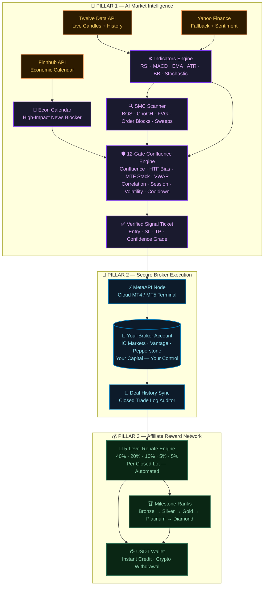
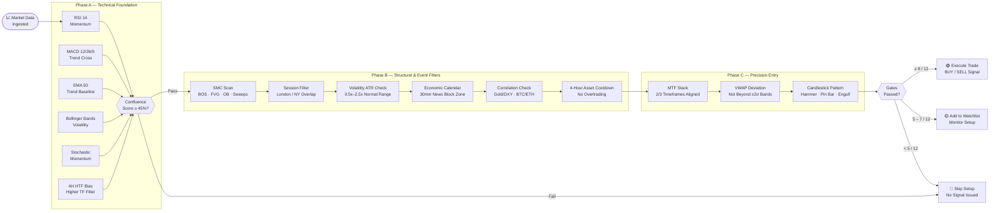
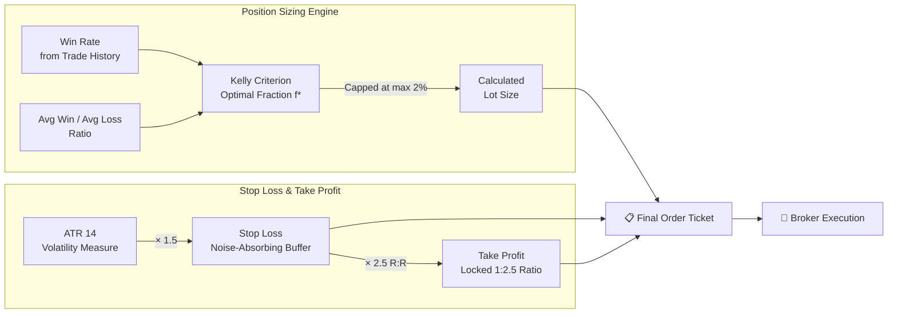
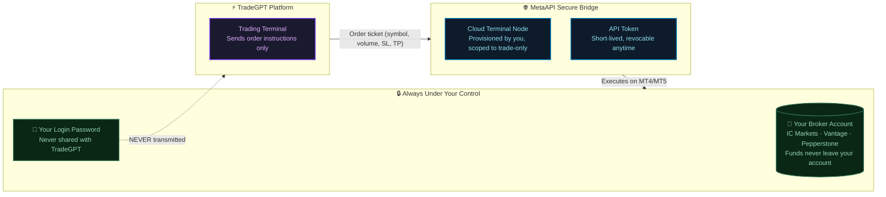
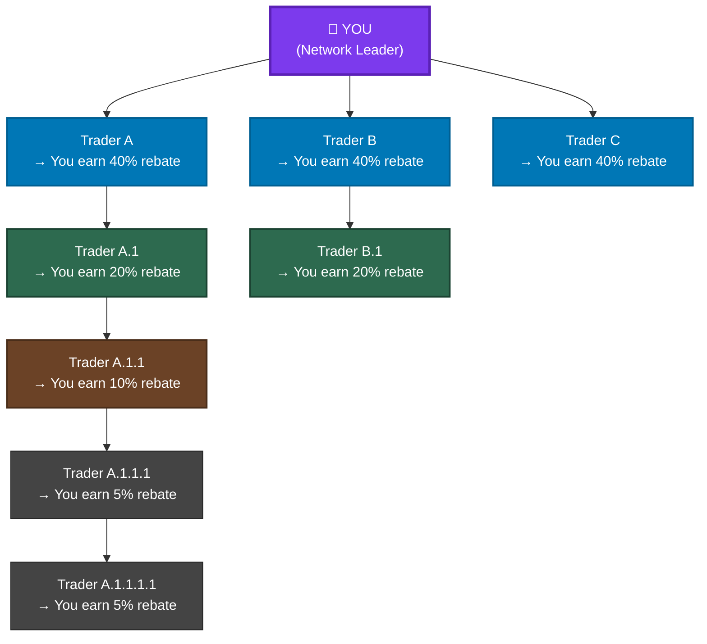
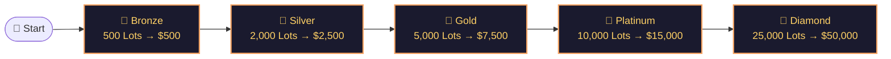
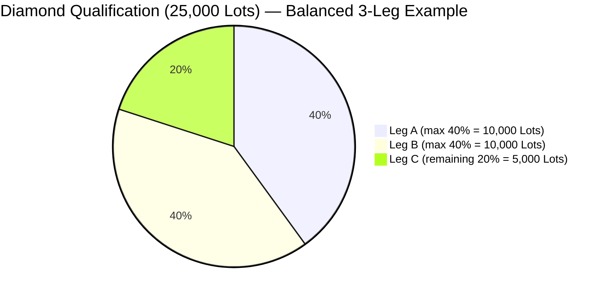
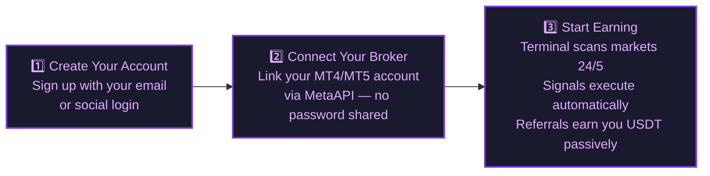

# TradeGPT: The Next Generation AI-Powered Trading Terminal
## Institutional-Grade Intelligence. Cloud Execution. Lucrative Affiliate Ecosystem.

> **For traders who demand precision. For builders who demand scale.**

Welcome to **TradeGPT** — a premier, cloud-native trading terminal and community-building ecosystem designed for the modern trader, quantitative analyst, and network builder. By marrying institutional-grade quantitative analysis models with real-time MetaTrader broker connectivity and a multi-level affiliate rebate matrix, TradeGPT delivers a high-edge trading experience alongside a powerful passive revenue pipeline.

Whether you are a retail trader looking for a systematic edge, a team leader building an automated trading desk, or a community builder scaling a passive income network — **TradeGPT is your unified platform.**

---

## Platform Ecosystem Map

TradeGPT operates as a closed-loop synergy between three core pillars:

---

## 1. The Technological Edge: The 12-Gate Confluence Engine

Most retail traders fail due to emotional bias, poor timing, and one-dimensional analysis. TradeGPT eliminates the guesswork entirely. Every potential trade setup is evaluated through a proprietary **12-Gate Confluence Engine** — an automated, multi-layered validation system modeled after institutional risk committees.

### How It Works

### The 12 Gatekeepers at a Glance

| # | Gate | What It Checks | Why It Matters |
|:---:|:---|:---|:---|
| 1 | **Confluence Score** | Weighted average of RSI, MACD, EMA, BB, Stoch, 4H Bias | Must be ≥ 45% — filters weak or contradictory setups |
| 2 | **SMC Pattern** | BOS, ChoCH, FVG, Order Blocks, Liquidity Sweeps | Confirms institutional price action structure |
| 3 | **HTF Trend** | 4-Hour RSI directional bias | Never trade counter to the dominant trend |
| 4 | **Session Activity** | London & NY overlap windows | Avoid low-liquidity hours and Asia chop |
| 5 | **Volatility ATR** | ATR ratio vs 20-period average | Prevent entering in dead or spike-driven markets |
| 6 | **No Conflict** | Bull/Bear indicator weight spread > 10% | No entry when signals are contradictory |
| 7 | **Asset Cooldown** | 4-hour timer per symbol post-trade | Blocks destructive over-trading |
| 8 | **Economic Calendar** | NFP, FOMC, CPI, ECB, BoE, BoJ detection | Blocks ±30min/15min around high-impact news |
| 9 | **Correlation Guard** | Asset vs correlated index alignment | E.g., Gold must align with DXY movement |
| 10 | **MTF Bias Stack** | Weekly, Daily, 4H EMA direction | 2 of 3 timeframes must align |
| 11 | **VWAP Deviation** | Price vs ±2σ VWAP band | No buying tops or selling bottoms |
| 12 | **Candlestick Entry** | 1H wick/body pattern detection | Pin Bars, Hammers, Engulfing confirmations |

---

## 2. Institutional Risk Management & Capital Preservation

Consistency separates professional traders from gamblers. TradeGPT embeds institutional risk mechanics into every single signal — automating the discipline most traders struggle to maintain manually.

### Risk Architecture at a Glance

### A. Mathematically Structured Stops

Every trade is issued with automatically computed SL and TP levels:

- **Stop Loss:** `Entry ± (ATR × 1.5)` — absorbs market noise without premature stops.
- **Take Profit:** Positioned at exactly **1:2.5 Risk-to-Reward (R:R)**.

> **Why 1:2.5 matters:** Even with a win rate of just **30%**, a 1:2.5 R:R strategy is profitable over time. Most retail traders overtrade and under-manage risk — TradeGPT handles both automatically.

### B. Kelly Criterion Dynamic Lot Sizing

$$f^* = \frac{W \times R - L}{W \times R}$$

Where **W** = Win Rate, **L** = Loss Rate (1−W), **R** = Avg Win / Avg Loss. The output is capped at **2.0% account risk per trade**, protecting against statistical outliers.

| Win Rate | R:R Ratio | Kelly f* | Risk Capped At |
|:---:|:---:|:---:|:---:|
| 40% | 1:2.5 | 24% → **Capped** | **2.0%** |
| 50% | 1:2.5 | 37.5% → **Capped** | **2.0%** |
| 60% | 1:2.5 | 49.6% → **Capped** | **2.0%** |

No matter how strong the signal, no single trade ever risks more than 2% of your account.

---

## 3. Security, Trust & Non-Custodial Architecture

The biggest fear in automated trading is: *"What if they access my funds?"* TradeGPT's architecture makes this impossible by design.

**Key Security Pillars:**

| Protection | Description |
|:---|:---|
| 🔒 **Non-Custodial** | Your funds never leave your personal regulated broker account |
| 🔑 **No Password Sharing** | Broker credentials are never transmitted to TradeGPT |
| ⚡ **Instant Revocation** | Disconnect your node in one click from the dashboard |
| 🛡️ **Scoped API Access** | MetaAPI tokens are restricted to trade-execution only — no withdrawal rights |
| 🔐 **Supabase RLS** | Row-level database security ensures only you can access your account data |

---

## 4. The TradeGPT Affiliate Network: Dual Earnings Engine

TradeGPT provides one of the most lucrative and transparent affiliate structures in financial technology. You earn passive income on **every single deal closed** in the accounts of every trader you refer — across 5 levels deep.

### A. 5-Tier Transactional Rebate Flow

Every time a trader in your downline closes a deal, the platform's gross rebate is split and distributed automatically, in real-time, credited directly to your USDT wallet balance.

| Level | Relationship | Your Rebate Share |
|:---:|:---|:---:|
| 1 | Direct referrals (your invites) | **40%** |
| 2 | Their direct referrals | **20%** |
| 3 | 3rd generation | **10%** |
| 4 | 4th generation | **5%** |
| 5 | 5th generation | **5%** |

---

### B. Milestone Rank Rewards: The Path to Diamond

| Achievement Rank | Required Team Volume | Max Single-Leg Contribution | Cash Bonus |
|:---:|:---:|:---:|:---:|
| 🥉 Bronze | 500 Lots | 200 Lots (40%) | **$500** |
| 🥈 Silver | 2,000 Lots | 800 Lots (40%) | **$2,500** |
| 🥇 Gold | 5,000 Lots | 2,000 Lots (40%) | **$7,500** |
| 💎 Platinum | 10,000 Lots | 4,000 Lots (40%) | **$15,000** |
| 👑 Diamond | 25,000 Lots | 10,000 Lots (40%) | **$50,000** |

#### The 40/40/20 Balanced Network Principle

The milestone volume system uses **leg capping** to reward builders who grow balanced, multi-branch networks. No single branch can count for more than **40%** of your target lot volume.

> This design ensures that only well-built, diversified networks achieve the highest ranks — preventing a single "power leg" from fraudulently carrying an inactive leader.

---

## 5. Why TradeGPT? At-a-Glance Comparison

| Feature | Traditional Copy-Trade | Generic Signal Bots | **TradeGPT** |
|:---|:---:|:---:|:---:|
| 12-Layer Signal Validation | ❌ | ❌ | ✅ |
| Non-Custodial (Your Funds Stay Yours) | ❌ | ❌ | ✅ |
| SMC + Institutional Analysis | ❌ | ❌ | ✅ |
| Kelly Criterion Position Sizing | ❌ | ❌ | ✅ |
| Economic News Auto-Block | ❌ | Partial | ✅ |
| 5-Level Affiliate Rebates (Per Lot) | ❌ | ❌ | ✅ |
| $50,000 Rank Milestone Rewards | ❌ | ❌ | ✅ |
| Real-Time USDT Payouts | ❌ | ❌ | ✅ |
| Live MT4 / MT5 Execution | ❌ | Partial | ✅ |

---

## 6. Get Started in 3 Steps

**Your capital stays in your broker account. Your referrals earn you passive USDT income. Your network builds generational wealth.**

---

*TradeGPT — Where Institutional Intelligence Meets Accessible Markets.*
